# Cover Letter Creation

<cite>
**Referenced Files in This Document**
- [schemas.py](file://backend/app/models/cover_letter/schemas.py)
- [cover_letter.py](file://backend/app/services/cover_letter.py)
- [cover_letter.py](file://backend/app/routes/cover_letter.py)
- [web_content_agent.py](file://backend/app/agents/web_content_agent.py)
- [CoverLetterDetailsForm.tsx](file://frontend/components/cover-letter/CoverLetterDetailsForm.tsx)
- [GeneratedLetterPanel.tsx](file://frontend/components/cover-letter/GeneratedLetterPanel.tsx)
- [page.tsx](file://frontend/app/dashboard/cover-letter/page.tsx)
- [cover-letter.service.ts](file://frontend/services/cover-letter.service.ts)
- [use-cover-letters.ts](file://frontend/hooks/queries/use-cover-letters.ts)
- [cover-letter.ts](file://frontend/types/cover-letter.ts)
- [ats_analysis.py](file://backend/app/data/prompt/ats_analysis.py)
- [ats.py](file://backend/app/services/ats.py)
</cite>

## Table of Contents
1. [Introduction](#introduction)
2. [Project Structure](#project-structure)
3. [Core Components](#core-components)
4. [Architecture Overview](#architecture-overview)
5. [Detailed Component Analysis](#detailed-component-analysis)
6. [Dependency Analysis](#dependency-analysis)
7. [Performance Considerations](#performance-considerations)
8. [Troubleshooting Guide](#troubleshooting-guide)
9. [Conclusion](#conclusion)
10. [Appendices](#appendices)

## Introduction
This document explains the Cover Letter Creation system that generates AI-powered, personalized cover letters from job descriptions and candidate profiles. It covers the prompt engineering strategies, integration with job description analysis and candidate skill matching, customization options, content structure, editing and revision workflows, ATS considerations, and frontend composition and preview capabilities.

## Project Structure
The system spans backend FastAPI routes and LangChain-based services, a job description fetcher agent, and a React-based frontend with dedicated components and hooks for form input, preview, and editing.

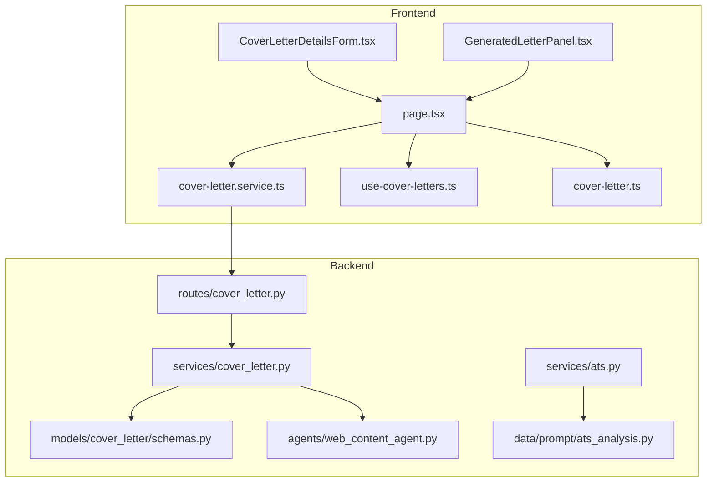

**Diagram sources**
- [CoverLetterDetailsForm.tsx](file://frontend/components/cover-letter/CoverLetterDetailsForm.tsx#L1-L246)
- [GeneratedLetterPanel.tsx](file://frontend/components/cover-letter/GeneratedLetterPanel.tsx#L1-L174)
- [page.tsx](file://frontend/app/dashboard/cover-letter/page.tsx#L1-L512)
- [cover-letter.service.ts](file://frontend/services/cover-letter.service.ts#L1-L34)
- [use-cover-letters.ts](file://frontend/hooks/queries/use-cover-letters.ts#L1-L50)
- [cover-letter.ts](file://frontend/types/cover-letter.ts#L1-L39)
- [cover_letter.py](file://backend/app/routes/cover_letter.py#L1-L103)
- [cover_letter.py](file://backend/app/services/cover_letter.py#L1-L254)
- [schemas.py](file://backend/app/models/cover_letter/schemas.py#L1-L33)
- [web_content_agent.py](file://backend/app/agents/web_content_agent.py#L1-L23)
- [ats.py](file://backend/app/services/ats.py#L1-L214)
- [ats_analysis.py](file://backend/app/data/prompt/ats_analysis.py#L1-L69)

**Section sources**
- [CoverLetterDetailsForm.tsx](file://frontend/components/cover-letter/CoverLetterDetailsForm.tsx#L1-L246)
- [GeneratedLetterPanel.tsx](file://frontend/components/cover-letter/GeneratedLetterPanel.tsx#L1-L174)
- [page.tsx](file://frontend/app/dashboard/cover-letter/page.tsx#L1-L512)
- [cover-letter.service.ts](file://frontend/services/cover-letter.service.ts#L1-L34)
- [use-cover-letters.ts](file://frontend/hooks/queries/use-cover-letters.ts#L1-L50)
- [cover-letter.ts](file://frontend/types/cover-letter.ts#L1-L39)
- [cover_letter.py](file://backend/app/routes/cover_letter.py#L1-L103)
- [cover_letter.py](file://backend/app/services/cover_letter.py#L1-L254)
- [schemas.py](file://backend/app/models/cover_letter/schemas.py#L1-L33)
- [web_content_agent.py](file://backend/app/agents/web_content_agent.py#L1-L23)
- [ats.py](file://backend/app/services/ats.py#L1-L214)
- [ats_analysis.py](file://backend/app/data/prompt/ats_analysis.py#L1-L69)

## Core Components
- Backend request/response models define the shape of inputs and outputs for cover letter generation and editing.
- The cover letter service composes prompts, resolves job descriptions from URLs or text, and invokes an LLM to produce plain-text cover letters.
- FastAPI routes accept multipart/form-data, assemble resume data, and delegate to the service layer.
- The frontend provides a form for collecting inputs, a preview panel with copy/download/edit controls, and React Query hooks for optimistic UI and state management.
- A job description fetcher agent retrieves clean markdown from URLs via an external service.
- ATS-related services and prompts support keyword coverage, formatting, and compatibility analysis.

**Section sources**
- [schemas.py](file://backend/app/models/cover_letter/schemas.py#L5-L33)
- [cover_letter.py](file://backend/app/services/cover_letter.py#L138-L254)
- [cover_letter.py](file://backend/app/routes/cover_letter.py#L16-L103)
- [CoverLetterDetailsForm.tsx](file://frontend/components/cover-letter/CoverLetterDetailsForm.tsx#L1-L246)
- [GeneratedLetterPanel.tsx](file://frontend/components/cover-letter/GeneratedLetterPanel.tsx#L1-L174)
- [page.tsx](file://frontend/app/dashboard/cover-letter/page.tsx#L1-L512)
- [web_content_agent.py](file://backend/app/agents/web_content_agent.py#L4-L23)
- [ats.py](file://backend/app/services/ats.py#L22-L214)
- [ats_analysis.py](file://backend/app/data/prompt/ats_analysis.py#L4-L69)

## Architecture Overview
The system follows a layered architecture:
- Frontend collects inputs and renders previews.
- API routes validate and forward requests to the service layer.
- Services resolve job descriptions, build prompts, and call the LLM.
- Responses are returned as plain text cover letters.

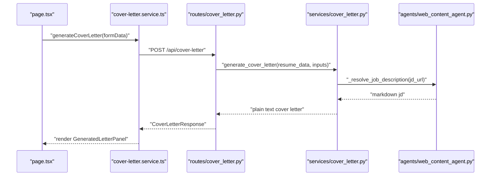

**Diagram sources**
- [page.tsx](file://frontend/app/dashboard/cover-letter/page.tsx#L109-L198)
- [cover-letter.service.ts](file://frontend/services/cover-letter.service.ts#L22-L25)
- [cover_letter.py](file://backend/app/routes/cover_letter.py#L16-L56)
- [cover_letter.py](file://backend/app/services/cover_letter.py#L138-L171)
- [web_content_agent.py](file://backend/app/agents/web_content_agent.py#L4-L23)

## Detailed Component Analysis

### Backend: Cover Letter Generation and Editing
- Request/response models encapsulate inputs and outputs for generation and editing workflows.
- The generation service:
  - Resolves job descriptions from a URL (via markdown fetcher) or uses provided text, merging both when available.
  - Formats a strict prompt with constraints on length, paragraph count, tone, and content focus.
  - Calls the LLM with a role instruction and returns plain text.
- Editing service:
  - Accepts a previous cover letter and user edit instructions.
  - Enforces strict adherence to instructions while preserving quality and constraints.

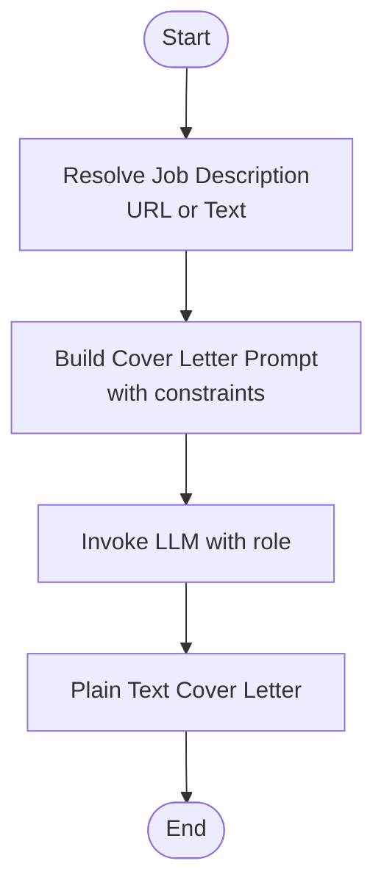

**Diagram sources**
- [cover_letter.py](file://backend/app/services/cover_letter.py#L12-L31)
- [cover_letter.py](file://backend/app/services/cover_letter.py#L138-L171)
- [cover_letter.py](file://backend/app/services/cover_letter.py#L174-L211)

**Section sources**
- [schemas.py](file://backend/app/models/cover_letter/schemas.py#L5-L33)
- [cover_letter.py](file://backend/app/services/cover_letter.py#L12-L31)
- [cover_letter.py](file://backend/app/services/cover_letter.py#L138-L211)

### Backend: Job Description Resolution
- When a URL is provided, the system fetches clean markdown content and prepends any additional context text.
- Ensures robustness by returning empty strings on failure and normalizing protocol prefixes.

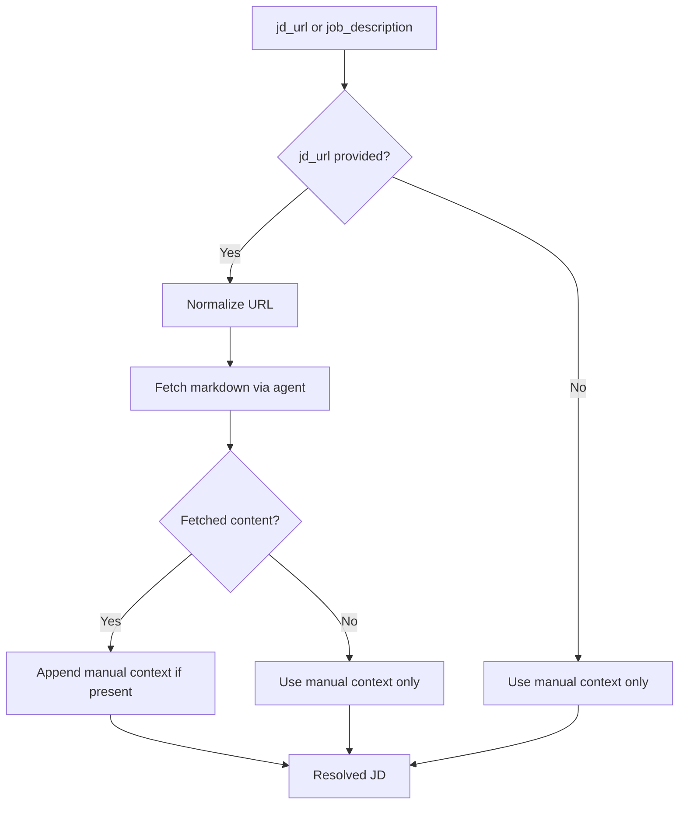

**Diagram sources**
- [cover_letter.py](file://backend/app/services/cover_letter.py#L12-L31)
- [web_content_agent.py](file://backend/app/agents/web_content_agent.py#L4-L23)

**Section sources**
- [cover_letter.py](file://backend/app/services/cover_letter.py#L12-L31)
- [web_content_agent.py](file://backend/app/agents/web_content_agent.py#L4-L23)

### Backend: Routes and Data Flow
- Routes accept form-encoded inputs, construct a minimal resume data object, and call the service layer.
- Both generation and editing endpoints return a unified response model.

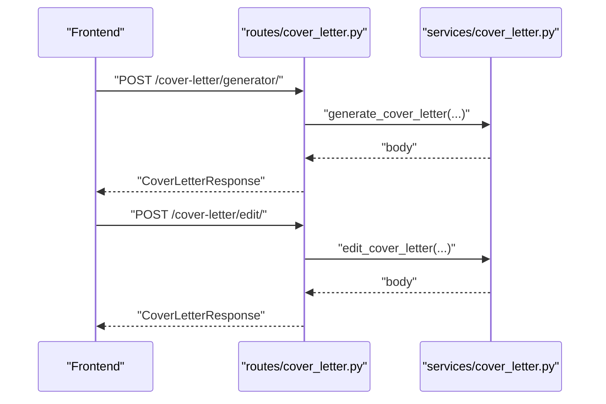

**Diagram sources**
- [cover_letter.py](file://backend/app/routes/cover_letter.py#L16-L103)
- [cover_letter.py](file://backend/app/services/cover_letter.py#L138-L211)

**Section sources**
- [cover_letter.py](file://backend/app/routes/cover_letter.py#L16-L103)

### Frontend: Inputs and Preview
- CoverLetterDetailsForm collects:
  - Personal details (your name, desired role/goal).
  - Job description via URL or text, with a toggle to switch modes.
  - Key points to highlight and additional context.
  - Optional recipient and company details.
- GeneratedLetterPanel displays the cover letter, supports copy/download, and toggles an edit mode with instructions.
- The page orchestrates state, validation, and submission via React Query mutations.

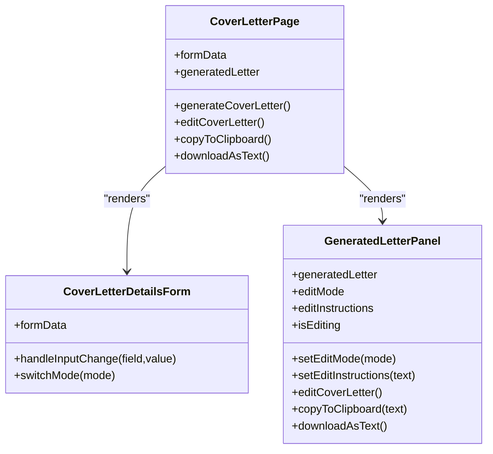

**Diagram sources**
- [CoverLetterDetailsForm.tsx](file://frontend/components/cover-letter/CoverLetterDetailsForm.tsx#L26-L246)
- [GeneratedLetterPanel.tsx](file://frontend/components/cover-letter/GeneratedLetterPanel.tsx#L34-L174)
- [page.tsx](file://frontend/app/dashboard/cover-letter/page.tsx#L26-L512)

**Section sources**
- [CoverLetterDetailsForm.tsx](file://frontend/components/cover-letter/CoverLetterDetailsForm.tsx#L1-L246)
- [GeneratedLetterPanel.tsx](file://frontend/components/cover-letter/GeneratedLetterPanel.tsx#L1-L174)
- [page.tsx](file://frontend/app/dashboard/cover-letter/page.tsx#L1-L512)

### Frontend: Service and Hooks
- cover-letter.service.ts defines typed endpoints for generation and editing.
- use-cover-letters.ts exposes React Query hooks for fetching sessions, deleting entries, and mutating generation/editing requests.
- Types cover-letter.ts define session and entry shapes for persistence and display.

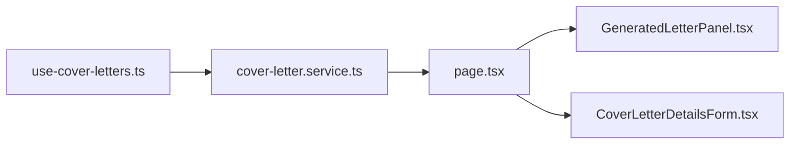

**Diagram sources**
- [use-cover-letters.ts](file://frontend/hooks/queries/use-cover-letters.ts#L1-L50)
- [cover-letter.service.ts](file://frontend/services/cover-letter.service.ts#L1-L34)
- [cover-letter.ts](file://frontend/types/cover-letter.ts#L1-L39)
- [page.tsx](file://frontend/app/dashboard/cover-letter/page.tsx#L1-L512)

**Section sources**
- [use-cover-letters.ts](file://frontend/hooks/queries/use-cover-letters.ts#L1-L50)
- [cover-letter.service.ts](file://frontend/services/cover-letter.service.ts#L1-L34)
- [cover-letter.ts](file://frontend/types/cover-letter.ts#L1-L39)

### Prompt Engineering Strategies
- Constraints ensure concise, readable, and ATS-friendly output:
  - Word and paragraph limits.
  - Specific opening referencing a concrete JD element.
  - Middle section aligns 1–2 resume qualifications to stated requirements.
  - Closing remains modest and actionable.
  - Tone is confident yet not overly eager.
  - Plain text output avoids markdown or JSON.
- Editing prompt enforces strict adherence to user instructions while preserving quality and constraints.

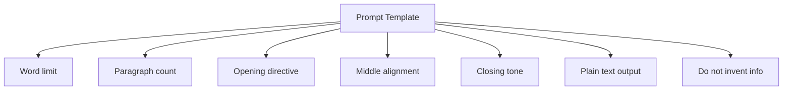

**Diagram sources**
- [cover_letter.py](file://backend/app/services/cover_letter.py#L33-L62)
- [cover_letter.py](file://backend/app/services/cover_letter.py#L65-L96)

**Section sources**
- [cover_letter.py](file://backend/app/services/cover_letter.py#L33-L96)

### Integration with Job Description Analysis and Candidate Matching
- ATS analysis service evaluates keyword coverage, formatting, and compatibility, producing structured metrics and recommendations.
- While cover letter generation focuses on narrative, ATS analysis can guide resume refinement and JD alignment, complementing cover letter personalization.

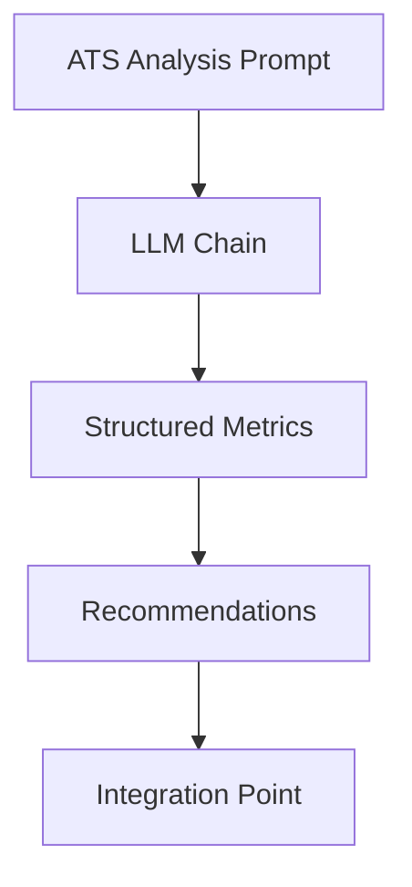

**Diagram sources**
- [ats_analysis.py](file://backend/app/data/prompt/ats_analysis.py#L4-L69)
- [ats.py](file://backend/app/services/ats.py#L22-L214)

**Section sources**
- [ats_analysis.py](file://backend/app/data/prompt/ats_analysis.py#L1-L69)
- [ats.py](file://backend/app/services/ats.py#L1-L214)

### Customization Options
- Tailor to roles and companies via:
  - Recipient and company names.
  - Job description URL or text.
  - Additional context and key points to highlight.
  - Language selection for output.
- Editing allows iterative refinement with explicit instructions.

**Section sources**
- [schemas.py](file://backend/app/models/cover_letter/schemas.py#L5-L17)
- [cover_letter.py](file://backend/app/services/cover_letter.py#L138-L211)
- [CoverLetterDetailsForm.tsx](file://frontend/components/cover-letter/CoverLetterDetailsForm.tsx#L1-L246)

### Content Structure
- Opening: Reference one specific JD aspect (product, tech, or problem).
- Middle: Align 1–2 relevant resume qualifications to stated requirements.
- Closing: Brief availability to discuss without desperation.
- Tone: Confident peer; avoid placeholders and invented facts.

**Section sources**
- [cover_letter.py](file://backend/app/services/cover_letter.py#L49-L62)

### Editing and Revision Workflows
- Toggle edit mode, provide instructions, and apply changes to refine content.
- Validation ensures a cover letter exists and instructions are provided before editing.

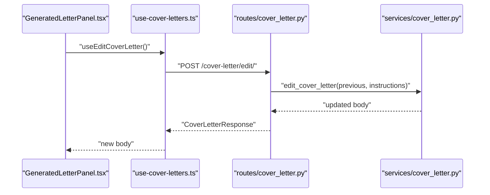

**Diagram sources**
- [GeneratedLetterPanel.tsx](file://frontend/components/cover-letter/GeneratedLetterPanel.tsx#L99-L148)
- [use-cover-letters.ts](file://frontend/hooks/queries/use-cover-letters.ts#L45-L49)
- [cover_letter.py](file://backend/app/routes/cover_letter.py#L59-L103)
- [cover_letter.py](file://backend/app/services/cover_letter.py#L174-L211)

**Section sources**
- [GeneratedLetterPanel.tsx](file://frontend/components/cover-letter/GeneratedLetterPanel.tsx#L99-L148)
- [use-cover-letters.ts](file://frontend/hooks/queries/use-cover-letters.ts#L45-L49)
- [cover_letter.py](file://backend/app/routes/cover_letter.py#L59-L103)
- [cover_letter.py](file://backend/app/services/cover_letter.py#L174-L211)

### ATS Optimization and Formatting Considerations
- The cover letter output is plain text, avoiding markdown or JSON, which improves ATS compatibility.
- Constraints prevent problematic characters and enforce concise formatting.
- ATS analysis provides complementary insights for keyword coverage and formatting improvements.

**Section sources**
- [cover_letter.py](file://backend/app/services/cover_letter.py#L60-L61)
- [cover_letter.py](file://backend/app/services/cover_letter.py#L94-L95)
- [ats_analysis.py](file://backend/app/data/prompt/ats_analysis.py#L4-L69)

### Frontend Composition and Preview Functionality
- Resume selection supports choosing an existing resume or uploading a file.
- Auto-preloading from analysis data streamlines user experience.
- Copy-to-clipboard and download-as-text enable easy reuse.
- Loading overlays and toasts provide feedback during generation and editing.

**Section sources**
- [page.tsx](file://frontend/app/dashboard/cover-letter/page.tsx#L63-L103)
- [page.tsx](file://frontend/app/dashboard/cover-letter/page.tsx#L200-L229)
- [GeneratedLetterPanel.tsx](file://frontend/components/cover-letter/GeneratedLetterPanel.tsx#L1-L174)

## Dependency Analysis
- Frontend depends on typed services and hooks for network operations.
- Backend routes depend on the cover letter service and the job description agent.
- ATS analysis is decoupled and can be leveraged independently for resume optimization.

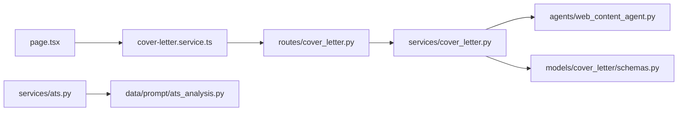

**Diagram sources**
- [page.tsx](file://frontend/app/dashboard/cover-letter/page.tsx#L1-L512)
- [cover-letter.service.ts](file://frontend/services/cover-letter.service.ts#L1-L34)
- [cover_letter.py](file://backend/app/routes/cover_letter.py#L1-L103)
- [cover_letter.py](file://backend/app/services/cover_letter.py#L1-L254)
- [schemas.py](file://backend/app/models/cover_letter/schemas.py#L1-L33)
- [web_content_agent.py](file://backend/app/agents/web_content_agent.py#L1-L23)
- [ats.py](file://backend/app/services/ats.py#L1-L214)
- [ats_analysis.py](file://backend/app/data/prompt/ats_analysis.py#L1-L69)

**Section sources**
- [page.tsx](file://frontend/app/dashboard/cover-letter/page.tsx#L1-L512)
- [cover_letter.py](file://backend/app/routes/cover_letter.py#L1-L103)
- [cover_letter.py](file://backend/app/services/cover_letter.py#L1-L254)
- [ats.py](file://backend/app/services/ats.py#L1-L214)

## Performance Considerations
- Minimizing prompt size and enforcing strict constraints reduces token usage and latency.
- Fetching job descriptions from URLs introduces network latency; caching or pre-fetching can help.
- Plain text output avoids extra parsing overhead for downstream consumers.

## Troubleshooting Guide
- Job description URL errors: Ensure the URL is reachable and returns content; the agent returns empty content on failure.
- Missing inputs: The page validates presence of required fields before submitting.
- Editing failures: Confirm a cover letter exists and edit instructions are provided.
- ATS mismatch: Use ATS analysis to identify missing keywords and formatting gaps; iterate on resume and cover letter alignment.

**Section sources**
- [web_content_agent.py](file://backend/app/agents/web_content_agent.py#L4-L23)
- [page.tsx](file://frontend/app/dashboard/cover-letter/page.tsx#L109-L198)
- [GeneratedLetterPanel.tsx](file://frontend/components/cover-letter/GeneratedLetterPanel.tsx#L231-L324)
- [ats.py](file://backend/app/services/ats.py#L42-L73)

## Conclusion
The Cover Letter Creation system combines precise prompt engineering, flexible input modes, and a streamlined editing workflow to produce tailored, ATS-friendly cover letters. Its modular backend and intuitive frontend enable rapid iteration and high-quality output aligned with job requirements and candidate profiles.

## Appendices
- Example prompt constraints and requirements are embedded in the service layer and enforced during generation and editing.
- ATS analysis provides actionable insights for keyword coverage and formatting improvements.