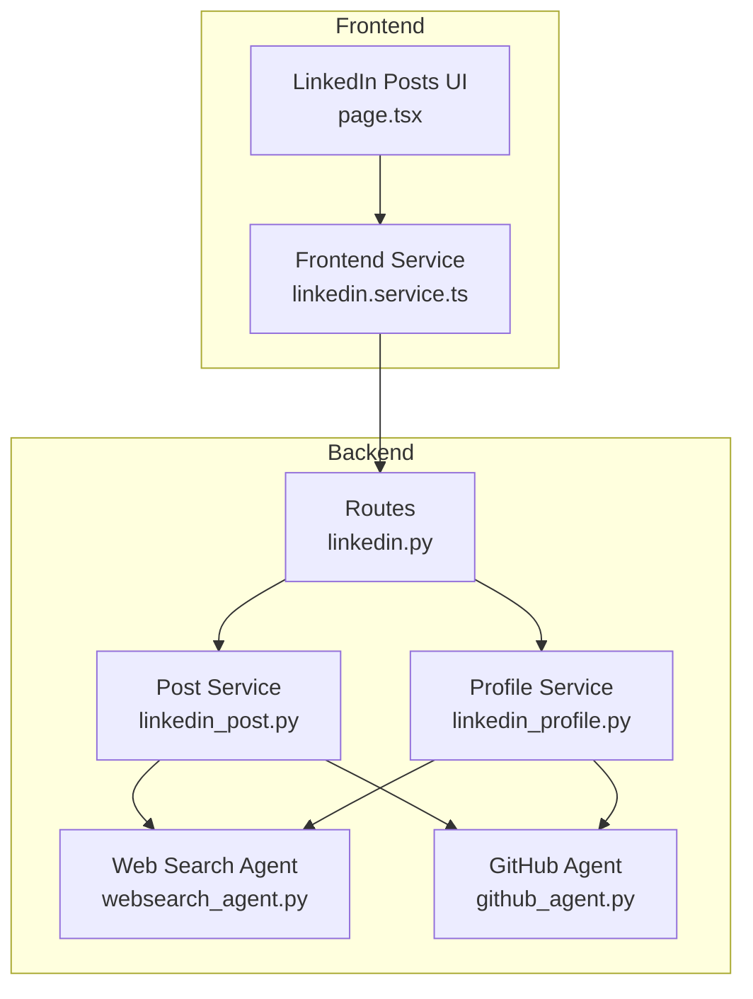
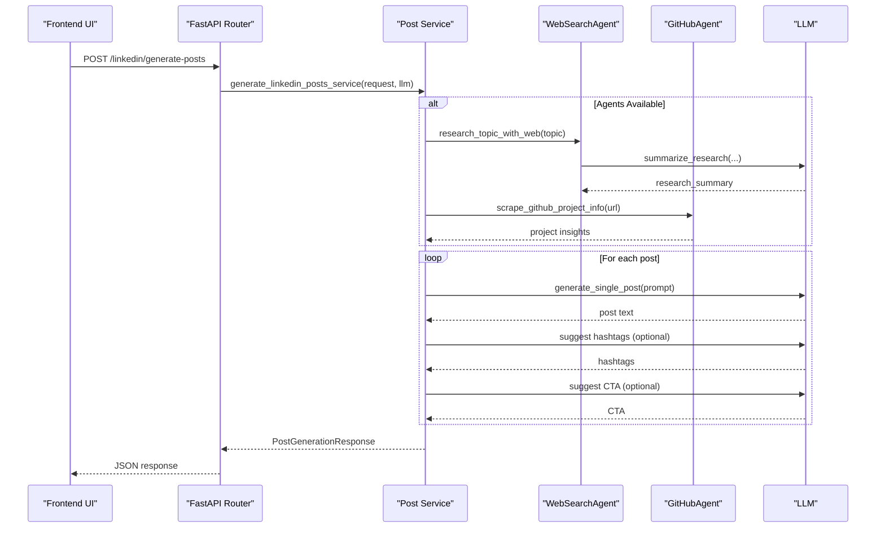
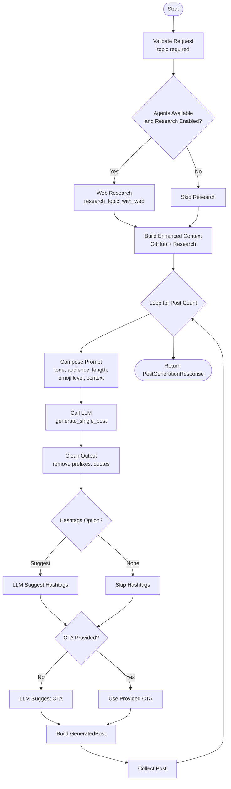
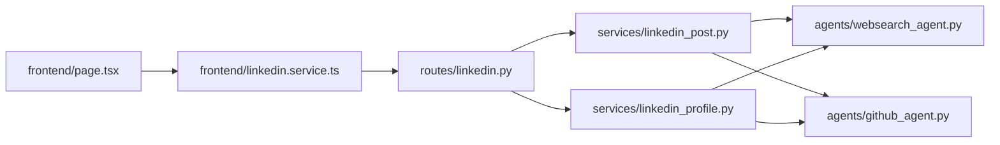

# LinkedIn Post Generator

<cite>
**Referenced Files in This Document**
- [linkedin.py](file://backend/app/routes/linkedin.py)
- [linkedin_post.py](file://backend/app/services/linkedin_post.py)
- [schemas.py](file://backend/app/models/linkedin_post/schemas.py)
- [response.py](file://backend/app/models/linkedin_post/response.py)
- [linkedin_profile.py](file://backend/app/services/linkedin_profile.py)
- [websearch_agent.py](file://backend/app/agents/websearch_agent.py)
- [github_agent.py](file://backend/app/agents/github_agent.py)
- [page.tsx](file://frontend/app/dashboard/linkedin-posts/page.tsx)
- [linkedin.service.ts](file://frontend/services/linkedin.service.ts)
</cite>

## Table of Contents
1. [Introduction](#introduction)
2. [Project Structure](#project-structure)
3. [Core Components](#core-components)
4. [Architecture Overview](#architecture-overview)
5. [Detailed Component Analysis](#detailed-component-analysis)
6. [Dependency Analysis](#dependency-analysis)
7. [Performance Considerations](#performance-considerations)
8. [Troubleshooting Guide](#troubleshooting-guide)
9. [Conclusion](#conclusion)
10. [Appendices](#appendices)

## Introduction
The LinkedIn Post Generator is an AI-powered system designed to streamline professional social media content creation on LinkedIn. It enables users to generate multiple, high-quality posts tailored to specific topics, tones, audiences, and lengths. The system integrates optional research enhancements, GitHub project insights, and content personalization to produce authentic, brand-consistent posts optimized for engagement.

Key capabilities include:
- AI-driven post generation with customizable tone, length, emoji level, and hashtag suggestions
- Optional web research to enrich posts with current industry insights
- GitHub project integration to surface technical achievements and hooks
- Frontend interface for configuring generation parameters and reviewing outputs
- Optional post editing using AI instructions

## Project Structure
The system spans backend services and frontend UI:
- Backend exposes FastAPI routes for LinkedIn post generation and page composition
- Services orchestrate LLM calls, optional agent integrations, and data shaping
- Agents provide web research and GitHub project analysis
- Frontend offers a user-friendly form and results display

**Diagram sources**
- [linkedin.py](file://backend/app/routes/linkedin.py#L1-L75)
- [linkedin_post.py](file://backend/app/services/linkedin_post.py#L1-L308)
- [linkedin_profile.py](file://backend/app/services/linkedin_profile.py#L1-L410)
- [websearch_agent.py](file://backend/app/agents/websearch_agent.py#L1-L272)
- [github_agent.py](file://backend/app/agents/github_agent.py#L1-L425)
- [page.tsx](file://frontend/app/dashboard/linkedin-posts/page.tsx#L1-L735)
- [linkedin.service.ts](file://frontend/services/linkedin.service.ts#L1-L36)

**Section sources**
- [linkedin.py](file://backend/app/routes/linkedin.py#L1-L75)
- [linkedin_post.py](file://backend/app/services/linkedin_post.py#L1-L308)
- [linkedin_profile.py](file://backend/app/services/linkedin_profile.py#L1-L410)
- [websearch_agent.py](file://backend/app/agents/websearch_agent.py#L1-L272)
- [github_agent.py](file://backend/app/agents/github_agent.py#L1-L425)
- [page.tsx](file://frontend/app/dashboard/linkedin-posts/page.tsx#L1-L735)
- [linkedin.service.ts](file://frontend/services/linkedin.service.ts#L1-L36)

## Core Components
- Routes: Define endpoints for generating posts, editing posts, and generating a complete LinkedIn page
- Post Service: Orchestrates LLM invocation, optional research, GitHub context, cleaning, and post structuring
- Profile Service: Generates headline, summary, about section, experience highlights, skills, and suggested posts for a full LinkedIn presence
- Agents: WebSearchAgent for topic research and GitHubAgent for project insights
- Frontend UI: Provides a form to configure generation parameters and displays results with copy/download actions

**Section sources**
- [linkedin.py](file://backend/app/routes/linkedin.py#L17-L74)
- [linkedin_post.py](file://backend/app/services/linkedin_post.py#L106-L307)
- [linkedin_profile.py](file://backend/app/services/linkedin_profile.py#L81-L409)
- [websearch_agent.py](file://backend/app/agents/websearch_agent.py#L124-L236)
- [github_agent.py](file://backend/app/agents/github_agent.py#L51-L424)
- [page.tsx](file://frontend/app/dashboard/linkedin-posts/page.tsx#L39-L735)
- [linkedin.service.ts](file://frontend/services/linkedin.service.ts#L32-L35)

## Architecture Overview
The system follows a layered architecture:
- Presentation Layer: Next.js UI with form controls and result rendering
- API Layer: FastAPI routes exposing generation endpoints
- Service Layer: Business logic for post generation and profile composition
- Agent Layer: Optional external integrations for research and GitHub insights
- LLM Integration: Asynchronous LLM invocations for content generation and summarization

**Diagram sources**
- [linkedin.py](file://backend/app/routes/linkedin.py#L17-L32)
- [linkedin_post.py](file://backend/app/services/linkedin_post.py#L226-L273)
- [websearch_agent.py](file://backend/app/agents/websearch_agent.py#L146-L198)
- [github_agent.py](file://backend/app/agents/github_agent.py#L227-L249)

## Detailed Component Analysis

### Post Generation Workflow
The core workflow generates one or more posts based on user-provided parameters, optional research, and GitHub context. It cleans LLM output, optionally suggests hashtags and CTAs, and structures the response.

**Diagram sources**
- [linkedin_post.py](file://backend/app/services/linkedin_post.py#L226-L273)
- [linkedin_post.py](file://backend/app/services/linkedin_post.py#L106-L224)

**Section sources**
- [linkedin_post.py](file://backend/app/services/linkedin_post.py#L226-L273)
- [linkedin_post.py](file://backend/app/services/linkedin_post.py#L106-L224)

### Personalization Strategies
Personalization is achieved through:
- Tone and audience parameters shaping the LLM prompt
- Optional mimic examples to align style with user preferences
- GitHub project context to tailor posts to technical achievements
- Optional web research to ground posts in current industry insights
- Emoji level control for personality and engagement balance

These inputs are mapped into prompt guidance and passed to the LLM for content generation.

**Section sources**
- [linkedin_post.py](file://backend/app/services/linkedin_post.py#L144-L157)
- [schemas.py](file://backend/app/models/linkedin_post/schemas.py#L7-L22)

### Content Formatting and Engagement Features
- Hashtag suggestions: Optional LLM-generated hashtags when enabled
- Call-to-action suggestions: Optional LLM-generated CTAs or user-provided
- Sources: Research results included when available
- GitHub project name: Derived from context for attribution
- Frontend formatting: Displays posts with hashtags and optional sources; supports copying and downloading

**Section sources**
- [linkedin_post.py](file://backend/app/services/linkedin_post.py#L166-L202)
- [linkedin_post.py](file://backend/app/services/linkedin_post.py#L294-L301)
- [response.py](file://backend/app/models/linkedin_post/response.py#L29-L50)
- [page.tsx](file://frontend/app/dashboard/linkedin-posts/page.tsx#L101-L140)
- [page.tsx](file://frontend/app/dashboard/linkedin-posts/page.tsx#L142-L175)

### Tone and Style Customization
- Tone: Selectable from predefined options (e.g., Professional, Conversational, Inspirational, Analytical, Friendly)
- Length: Short, Medium, Long, Any
- Emoji level: Integer scale controlling emoji usage
- Language: Optional field for localization
- Mimic examples: Optional pasted post to emulate style

These parameters are embedded into the generation prompt to steer the LLM’s output.

**Section sources**
- [page.tsx](file://frontend/app/dashboard/linkedin-posts/page.tsx#L282-L330)
- [schemas.py](file://backend/app/models/linkedin_post/schemas.py#L7-L22)

### Integration with User Profiles and Network Insights
- Profile Composition: The profile service composes headline, summary, about section, experience highlights, and skills based on user input and optional GitHub insights
- Content Calendar: Suggests weekly posting themes and goals
- Engagement Tips: Personalized advice based on experience, GitHub presence, and industry
- Optional GitHub Integration: Analyzes repositories for LinkedIn-friendly hooks and hashtags

**Section sources**
- [linkedin_profile.py](file://backend/app/services/linkedin_profile.py#L81-L149)
- [linkedin_profile.py](file://backend/app/services/linkedin_profile.py#L151-L251)
- [linkedin_profile.py](file://backend/app/services/linkedin_profile.py#L307-L359)
- [linkedin_profile.py](file://backend/app/services/linkedin_profile.py#L361-L397)

### Content Planning and Scheduling
- Weekly Themes: Industry insights, career growth, technology trends, and project highlights
- Bi-weekly and Monthly Ideas: Industry commentary and milestone reflections
- Hashtag Suggestions: Tailored to content type and industry
- Engagement Goals: Drive discussions, position as thought leader, connect and inspire

**Section sources**
- [linkedin_profile.py](file://backend/app/services/linkedin_profile.py#L307-L359)

### Example Templates and Engagement Strategies
- Achievement Announcement Template: Hook with project name, impact statement, and optional CTA
- Industry Insight Template: Trend summary with a professional hook and 2–3 relevant hashtags
- Networking Template: Personal anecdote or reflection with a subtle CTA to connect

Engagement strategies:
- Consistent posting cadence (2–3 times per week)
- Mix of insights, personal experiences, and behind-the-scenes content
- Authentic engagement with thoughtful responses
- Strategic hashtag usage (3–5 per post)
- Use of stories/live and long-form articles for deeper reach

[No sources needed since this section provides general guidance]

### Content Authenticity, Brand Consistency, and Professional Presentation
- Authenticity: LLM output is cleaned to remove explanatory text and meta-commentary; prompts emphasize “authentic, valuable” content
- Brand Consistency: Tone and audience parameters keep messaging aligned with user-defined style and target
- Professional Presentation: Structured prompts, optional research grounding, and optional GitHub context ensure polished, credible posts

**Section sources**
- [linkedin_post.py](file://backend/app/services/linkedin_post.py#L22-L64)
- [linkedin_post.py](file://backend/app/services/linkedin_post.py#L144-L157)

## Dependency Analysis
The backend components depend on:
- LangChain LLM clients for asynchronous content generation
- Optional agents for research and GitHub analysis
- Pydantic models for request/response validation
- FastAPI for routing and dependency injection

**Diagram sources**
- [linkedin.py](file://backend/app/routes/linkedin.py#L1-L14)
- [linkedin_post.py](file://backend/app/services/linkedin_post.py#L1-L20)
- [linkedin_profile.py](file://backend/app/services/linkedin_profile.py#L1-L22)
- [websearch_agent.py](file://backend/app/agents/websearch_agent.py#L1-L18)
- [github_agent.py](file://backend/app/agents/github_agent.py#L1-L32)
- [page.tsx](file://frontend/app/dashboard/linkedin-posts/page.tsx#L1-L38)
- [linkedin.service.ts](file://frontend/services/linkedin.service.ts#L1-L36)

**Section sources**
- [linkedin.py](file://backend/app/routes/linkedin.py#L1-L14)
- [linkedin_post.py](file://backend/app/services/linkedin_post.py#L1-L20)
- [linkedin_profile.py](file://backend/app/services/linkedin_profile.py#L1-L22)
- [websearch_agent.py](file://backend/app/agents/websearch_agent.py#L1-L18)
- [github_agent.py](file://backend/app/agents/github_agent.py#L1-L32)
- [page.tsx](file://frontend/app/dashboard/linkedin-posts/page.tsx#L1-L38)
- [linkedin.service.ts](file://frontend/services/linkedin.service.ts#L1-L36)

## Performance Considerations
- Asynchronous LLM calls minimize latency during generation
- Optional research and GitHub analysis are gated by flags to reduce overhead when not needed
- Output cleaning avoids unnecessary post-processing
- Frontend debounces and disables generation when required fields are missing

[No sources needed since this section provides general guidance]

## Troubleshooting Guide
Common issues and resolutions:
- Missing TAVILY API key: Web research will log warnings and return empty results; disable research or configure the key
- Invalid GitHub URL: Project analysis returns an error; ensure a valid GitHub repository URL
- Empty topic: Frontend prevents generation until a topic is provided
- LLM unavailability: Research summaries fall back to raw content extraction; post generation may still succeed depending on prompt structure

**Section sources**
- [websearch_agent.py](file://backend/app/agents/websearch_agent.py#L62-L66)
- [websearch_agent.py](file://backend/app/agents/websearch_agent.py#L72-L75)
- [page.tsx](file://frontend/app/dashboard/linkedin-posts/page.tsx#L69-L77)

## Conclusion
The LinkedIn Post Generator delivers a robust, extensible solution for AI-assisted LinkedIn content creation. By combining configurable prompts, optional research and GitHub insights, and a clean frontend interface, it empowers professionals to craft authentic, engaging, and brand-consistent posts efficiently. The modular architecture supports incremental enhancements, such as scheduling, advanced personalization, and expanded agent integrations.

[No sources needed since this section summarizes without analyzing specific files]

## Appendices

### API Endpoints Overview
- POST /linkedin/generate-posts: Generate multiple posts based on parameters
- POST /linkedin/edit-post: Edit an existing post with AI instructions
- POST /linkedin/generate-page: Generate a complete LinkedIn page including profile and suggested posts

**Section sources**
- [linkedin.py](file://backend/app/routes/linkedin.py#L17-L74)

### Data Models Summary
- PostGenerationRequest: Topic, tone, audience, length, hashtags option, CTA, mimic examples, language, post count, emoji level, GitHub URL, research toggle
- GeneratedPost: Text, hashtags, CTA suggestion, token info, sources, GitHub project name
- PostGenerationResponse: Success flag, message, list of posts, timestamp

**Section sources**
- [schemas.py](file://backend/app/models/linkedin_post/schemas.py#L7-L50)
- [response.py](file://backend/app/models/linkedin_post/response.py#L8-L50)