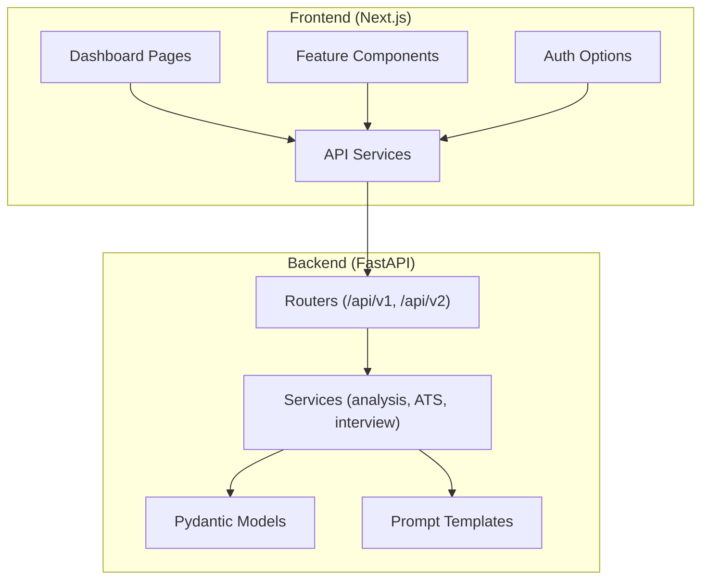
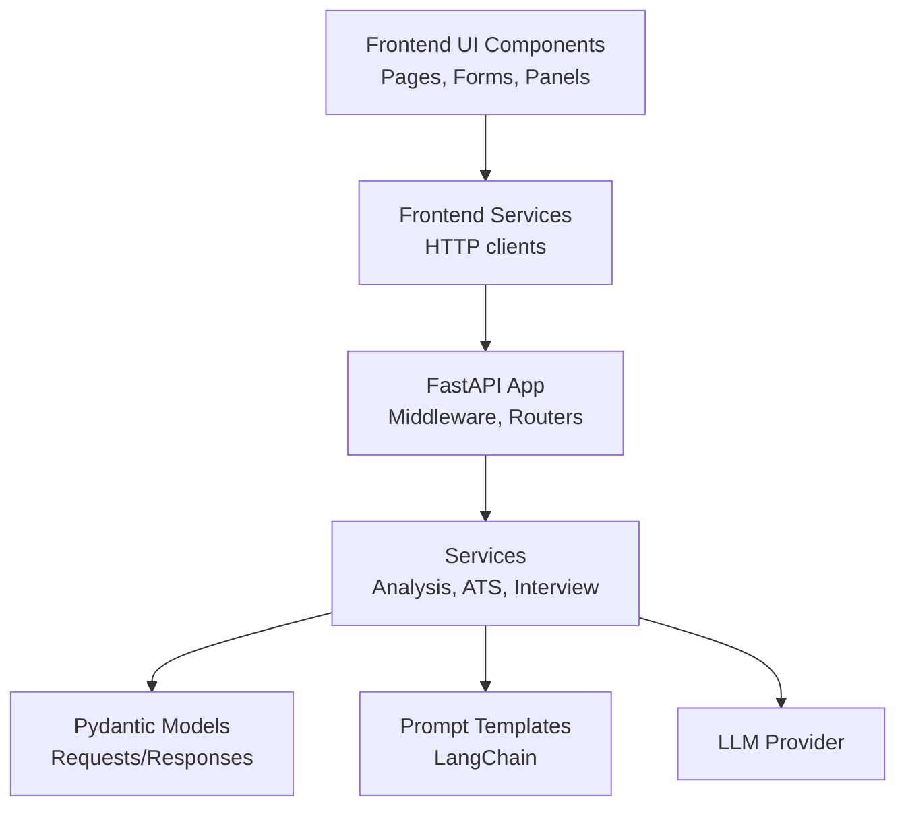
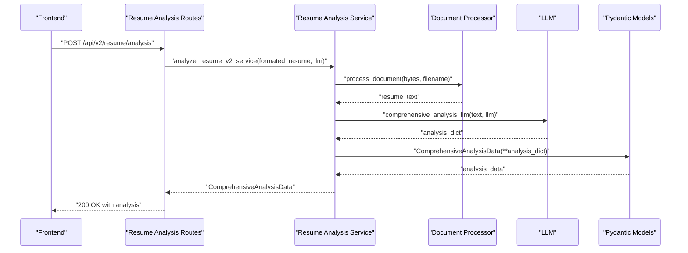
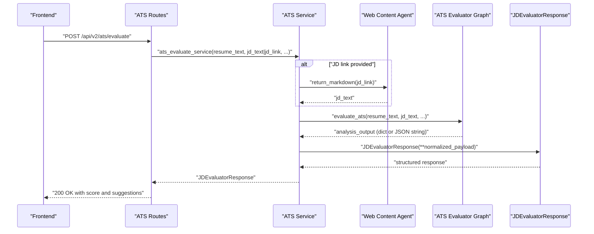
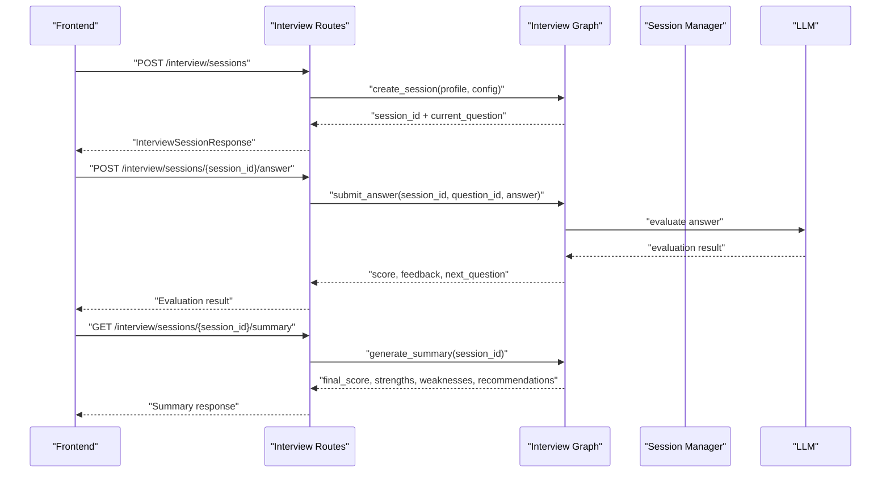
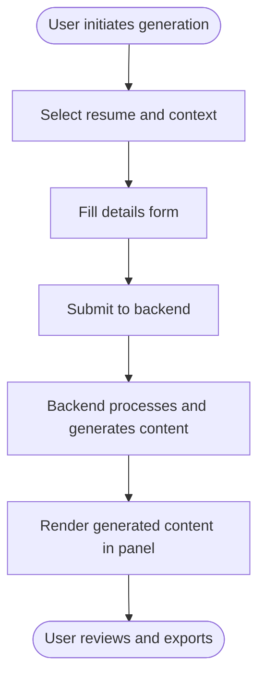
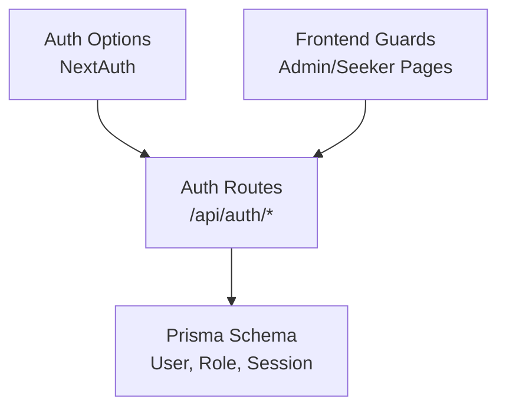
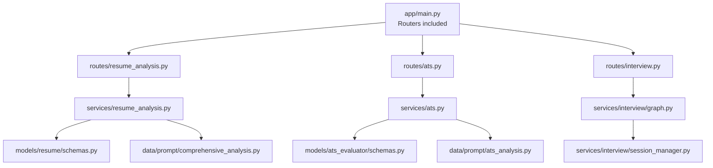

# Feature Implementation

<cite>
**Referenced Files in This Document**
- [readme.md](file://readme.md)
- [backend/app/main.py](file://backend/app/main.py)
- [backend/app/routes/resume_analysis.py](file://backend/app/routes/resume_analysis.py)
- [backend/app/services/resume_analysis.py](file://backend/app/services/resume_analysis.py)
- [backend/app/models/resume/schemas.py](file://backend/app/models/resume/schemas.py)
- [backend/app/data/prompt/comprehensive_analysis.py](file://backend/app/data/prompt/comprehensive_analysis.py)
- [backend/app/routes/ats.py](file://backend/app/routes/ats.py)
- [backend/app/services/ats.py](file://backend/app/services/ats.py)
- [backend/app/models/ats_evaluator/schemas.py](file://backend/app/models/ats_evaluator/schemas.py)
- [backend/app/data/prompt/ats_analysis.py](file://backend/app/data/prompt/ats_analysis.py)
- [backend/app/routes/interview.py](file://backend/app/routes/interview.py)
- [backend/app/models/interview/schemas.py](file://backend/app/models/interview/schemas.py)
- [backend/app/models/interview/enums.py](file://backend/app/models/interview/enums.py)
- [backend/app/models/interview/templates.py](file://backend/app/models/interview/templates.py)
- [backend/app/services/interview/graph.py](file://backend/app/services/interview/graph.py)
- [backend/app/services/interview/session_manager.py](file://backend/app/services/interview/session_manager.py)
- [backend/app/services/interview/question_generator.py](file://backend/app/services/interview/question_generator.py)
- [backend/app/services/interview/answer_evaluator.py](file://backend/app/services/interview/answer_evaluator.py)
- [backend/app/services/interview/summary_generator.py](file://backend/app/services/interview/summary_generator.py)
- [backend/app/services/interview/code_executor.py](file://backend/app/services/interview/code_executor.py)
- [frontend/package.json](file://frontend/package.json)
- [frontend/app/dashboard/page.tsx](file://frontend/app/dashboard/page.tsx)
- [frontend/components/ats/EvaluationResults.tsx](file://frontend/components/ats/EvaluationResults.tsx)
- [frontend/components/ats/JobDescriptionForm.tsx](file://frontend/components/ats/JobDescriptionForm.tsx)
- [frontend/components/ats/ResumeSelection.tsx](file://frontend/components/ats/ResumeSelection.tsx)
- [frontend/components/cold-mail/EmailDetailsForm.tsx](file://frontend/components/cold-mail/EmailDetailsForm.tsx)
- [frontend/components/cold-mail/GeneratedEmailPanel.tsx](file://frontend/components/cold-mail/GeneratedEmailPanel.tsx)
- [frontend/components/cover-letter/CoverLetterDetailsForm.tsx](file://frontend/components/cover-letter/CoverLetterDetailsForm.tsx)
- [frontend/components/cover-letter/GeneratedLetterPanel.tsx](file://frontend/components/cover-letter/GeneratedLetterPanel.tsx)
- [frontend/components/hiring-assistant/InterviewDetailsForm.tsx](file://frontend/components/hiring-assistant/InterviewDetailsForm.tsx)
- [frontend/components/hiring-assistant/GeneratedAnswersPanel.tsx](file://frontend/components/hiring-assistant/GeneratedAnswersPanel.tsx)
- [frontend/components/pdf-resume/ConfigurationForm.tsx](file://frontend/components/pdf-resume/ConfigurationForm.tsx)
- [frontend/components/pdf-resume/ExportTab.tsx](file://frontend/components/pdf-resume/ExportTab.tsx)
- [frontend/components/pdf-resume/LatexOutput.tsx](file://frontend/components/pdf-resume/LatexOutput.tsx)
- [frontend/components/pdf-resume/ResumePreview.tsx](file://frontend/components/pdf-resume/ResumePreview.tsx)
- [frontend/components/pdf-resume/ResumeSourceSelector.tsx](file://frontend/components/pdf-resume/ResumeSourceSelector.tsx)
- [frontend/components/pdf-resume/TailoringForm.tsx](file://frontend/components/pdf-resume/TailoringForm.tsx)
- [frontend/services/ats.service.ts](file://frontend/services/ats.service.ts)
- [frontend/services/cold-mail.service.ts](file://frontend/services/cold-mail.service.ts)
- [frontend/services/cover-letter.service.ts](file://frontend/services/cover-letter.service.ts)
- [frontend/services/interview.service.ts](file://frontend/services/interview.service.ts)
- [frontend/lib/auth-options.ts](file://frontend/lib/auth-options.ts)
- [frontend/prisma/schema.prisma](file://frontend/prisma/schema.prisma)
</cite>

## Table of Contents
1. [Introduction](#introduction)
2. [Project Structure](#project-structure)
3. [Core Components](#core-components)
4. [Architecture Overview](#architecture-overview)
5. [Detailed Component Analysis](#detailed-component-analysis)
6. [Dependency Analysis](#dependency-analysis)
7. [Performance Considerations](#performance-considerations)
8. [Troubleshooting Guide](#troubleshooting-guide)
9. [Conclusion](#conclusion)

## Introduction
This document provides feature implementation details for the core capabilities of TalentSync-Normies:
- Resume analysis engine: text processing pipeline, NLP integration, and result structuring
- ATS optimization system: keyword analysis, formatting recommendations, and compatibility scoring
- Interview preparation system: question generation logic, answer evaluation criteria, and interview analytics
- Communication tools: cold email generation, cover letter creation, and LinkedIn post generator
- User management, role-based access control, and authentication integration
- Feature-specific UI components, state management, and API integrations

The platform combines a Next.js frontend with a FastAPI backend, integrating LangChain-based NLP prompts and Pydantic models for structured outputs. The backend exposes REST APIs organized by feature domains, while the frontend consumes these APIs and renders domain-specific UI components.

**Section sources**
- [readme.md](file://readme.md#L21-L71)

## Project Structure
The repository follows a clear separation of concerns:
- Backend (FastAPI): routes, services, models, prompts, and core infrastructure
- Frontend (Next.js): pages, components, services, and UI state management
- Shared data models and prompts under backend for consistent schema enforcement
- Authentication via NextAuth integration in the frontend

**Diagram sources**
- [backend/app/main.py](file://backend/app/main.py#L157-L203)
- [frontend/package.json](file://frontend/package.json#L17-L86)

**Section sources**
- [backend/app/main.py](file://backend/app/main.py#L157-L203)
- [frontend/package.json](file://frontend/package.json#L17-L86)

## Core Components
This section outlines the primary building blocks powering each feature area.

- Resume Analysis Engine
  - Routes: file-based and text-based endpoints for resume analysis and formatting
  - Service: orchestrates document processing, LLM-driven extraction, validation, and cleanup
  - Models: comprehensive analysis data structures and typed responses
  - Prompts: structured prompt template for extracting rich, UI-ready data

- ATS Optimization System
  - Routes: evaluation endpoints supporting both file-based and text-based inputs
  - Service: validates inputs, retrieves JD content (link or file), and normalizes evaluator output
  - Models: request/response schemas for structured evaluation results
  - Prompts: ATS analysis prompt defining keyword coverage, compatibility, and recommendations

- Interview Preparation System
  - Routes: session lifecycle, answer submission (streaming and non-streaming), code execution, summary generation, and event recording
  - Services: graph orchestration, session management, question generation, answer evaluation, and summary generation
  - Models: interview configuration, templates, and event enums

- Communication Tools
  - Cold email: form and panel components with selection and generation flows
  - Cover letter: form and panel components with selection and generation flows
  - LinkedIn post: generator UI components

- User Management and Authentication
  - NextAuth integration in frontend with Prisma adapter
  - Role-based access control via database schema and frontend guards

**Section sources**
- [backend/app/routes/resume_analysis.py](file://backend/app/routes/resume_analysis.py#L1-L68)
- [backend/app/services/resume_analysis.py](file://backend/app/services/resume_analysis.py#L1-L364)
- [backend/app/models/resume/schemas.py](file://backend/app/models/resume/schemas.py#L21-L157)
- [backend/app/data/prompt/comprehensive_analysis.py](file://backend/app/data/prompt/comprehensive_analysis.py#L5-L173)
- [backend/app/routes/ats.py](file://backend/app/routes/ats.py#L1-L184)
- [backend/app/services/ats.py](file://backend/app/services/ats.py#L1-L214)
- [backend/app/models/ats_evaluator/schemas.py](file://backend/app/models/ats_evaluator/schemas.py#L6-L44)
- [backend/app/data/prompt/ats_analysis.py](file://backend/app/data/prompt/ats_analysis.py#L4-L69)
- [backend/app/routes/interview.py](file://backend/app/routes/interview.py#L1-L494)
- [frontend/package.json](file://frontend/package.json#L22-L68)
- [frontend/lib/auth-options.ts](file://frontend/lib/auth-options.ts)

## Architecture Overview
The system architecture integrates frontend UI components with backend APIs, which delegate to services and prompts orchestrated by LangChain. The backend centralizes routing, middleware, and logging, while the frontend manages user interactions, state, and API consumption.

**Diagram sources**
- [backend/app/main.py](file://backend/app/main.py#L63-L80)
- [backend/app/routes/resume_analysis.py](file://backend/app/routes/resume_analysis.py#L1-L68)
- [backend/app/routes/ats.py](file://backend/app/routes/ats.py#L1-L184)
- [backend/app/routes/interview.py](file://backend/app/routes/interview.py#L1-L494)

## Detailed Component Analysis

### Resume Analysis Engine
The resume analysis engine processes uploaded or formatted resume content, cleans and structures it, and produces a comprehensive profile suitable for UI rendering and downstream ATS scoring.

- Text Processing Pipeline
  - File-based analysis reads the uploaded file, writes a temporary file, extracts text, removes the temp file, validates content, and optionally formats text via LLM before JSON extraction.
  - Text-based analysis accepts pre-formatted text, validates it, and performs comprehensive analysis.
  - Formatting and analysis endpoint returns cleaned text plus structured analysis.

- NLP Integration
  - Comprehensive analysis prompt instructs the LLM to produce a JSON object conforming to the ComprehensiveAnalysisData model, covering skills, languages, education, work experience, projects, publications, positions of responsibility, certifications, achievements, and personal links.
  - Structured extraction ensures consistent schema compliance and UI rendering.

- Result Structuring
  - Responses include typed models for resume analysis, comprehensive analysis, and formatted-and-analyzed results.
  - Portfolio links are normalized across multiple potential field aliases.

**Diagram sources**
- [backend/app/routes/resume_analysis.py](file://backend/app/routes/resume_analysis.py#L55-L68)
- [backend/app/services/resume_analysis.py](file://backend/app/services/resume_analysis.py#L305-L342)
- [backend/app/data/prompt/comprehensive_analysis.py](file://backend/app/data/prompt/comprehensive_analysis.py#L170-L173)
- [backend/app/models/resume/schemas.py](file://backend/app/models/resume/schemas.py#L21-L48)

**Section sources**
- [backend/app/routes/resume_analysis.py](file://backend/app/routes/resume_analysis.py#L1-L68)
- [backend/app/services/resume_analysis.py](file://backend/app/services/resume_analysis.py#L1-L364)
- [backend/app/models/resume/schemas.py](file://backend/app/models/resume/schemas.py#L21-L157)
- [backend/app/data/prompt/comprehensive_analysis.py](file://backend/app/data/prompt/comprehensive_analysis.py#L5-L173)

### ATS Optimization System
The ATS optimization system evaluates a resume against a job description, computes keyword coverage, compatibility scores, and actionable recommendations.

- Input Handling
  - Accepts either raw JD text or a JD link; supports optional company context.
  - Validates payload to ensure at least one source of the job description is provided.

- Evaluation Workflow
  - Retrieves JD content from a link if needed.
  - Normalizes evaluator output to a structured response with success flag, message, score, reasons, and suggestions.

- Scoring and Recommendations
  - The prompt defines metrics such as semantic similarity, contact completeness, content quality, formatting, keyword coverage, and density.
  - Outputs composite score, strengths, areas for improvement, recommended keywords, and structured recommendations.

**Diagram sources**
- [backend/app/routes/ats.py](file://backend/app/routes/ats.py#L50-L131)
- [backend/app/services/ats.py](file://backend/app/services/ats.py#L22-L214)
- [backend/app/models/ats_evaluator/schemas.py](file://backend/app/models/ats_evaluator/schemas.py#L20-L44)
- [backend/app/data/prompt/ats_analysis.py](file://backend/app/data/prompt/ats_analysis.py#L4-L69)

**Section sources**
- [backend/app/routes/ats.py](file://backend/app/routes/ats.py#L1-L184)
- [backend/app/services/ats.py](file://backend/app/services/ats.py#L1-L214)
- [backend/app/models/ats_evaluator/schemas.py](file://backend/app/models/ats_evaluator/schemas.py#L6-L44)
- [backend/app/data/prompt/ats_analysis.py](file://backend/app/data/prompt/ats_analysis.py#L1-L69)

### Interview Preparation System
The interview preparation system provides a full lifecycle: session creation, question delivery, answer evaluation (with streaming), code execution, and summary generation.

- Session Lifecycle
  - Create session with profile and configuration; returns current question.
  - Retrieve, list, and delete sessions; filter by status.
  - Record interview events (e.g., tab switches) for integrity tracking.

- Answer Evaluation
  - Non-streaming and streaming endpoints for answer submission.
  - Streaming uses Server-Sent Events to simulate typing and deliver final evaluation.

- Code Execution
  - Execute candidate code for coding questions and stream execution results followed by review.

- Summary Generation
  - Generate final interview summary (non-streaming and streaming).

**Diagram sources**
- [backend/app/routes/interview.py](file://backend/app/routes/interview.py#L65-L186)
- [backend/app/routes/interview.py](file://backend/app/routes/interview.py#L343-L414)
- [backend/app/services/interview/graph.py](file://backend/app/services/interview/graph.py)
- [backend/app/services/interview/session_manager.py](file://backend/app/services/interview/session_manager.py)
- [backend/app/services/interview/answer_evaluator.py](file://backend/app/services/interview/answer_evaluator.py)
- [backend/app/services/interview/summary_generator.py](file://backend/app/services/interview/summary_generator.py)

**Section sources**
- [backend/app/routes/interview.py](file://backend/app/routes/interview.py#L1-L494)
- [backend/app/models/interview/schemas.py](file://backend/app/models/interview/schemas.py)
- [backend/app/models/interview/enums.py](file://backend/app/models/interview/enums.py)
- [backend/app/models/interview/templates.py](file://backend/app/models/interview/templates.py)

### Communication Tools
Communication tools enable generating cold emails, cover letters, and LinkedIn posts. The frontend provides dedicated forms and panels, while backend routes handle generation and persistence.

- Cold Email Generation
  - UI components: EmailDetailsForm and GeneratedEmailPanel
  - Selection and generation flows handled by frontend services

- Cover Letter Creation
  - UI components: CoverLetterDetailsForm and GeneratedLetterPanel

- LinkedIn Post Generator
  - UI components for post generation

**Diagram sources**
- [frontend/components/cold-mail/EmailDetailsForm.tsx](file://frontend/components/cold-mail/EmailDetailsForm.tsx)
- [frontend/components/cold-mail/GeneratedEmailPanel.tsx](file://frontend/components/cold-mail/GeneratedEmailPanel.tsx)
- [frontend/components/cover-letter/CoverLetterDetailsForm.tsx](file://frontend/components/cover-letter/CoverLetterDetailsForm.tsx)
- [frontend/components/cover-letter/GeneratedLetterPanel.tsx](file://frontend/components/cover-letter/GeneratedLetterPanel.tsx)

**Section sources**
- [frontend/components/cold-mail/EmailDetailsForm.tsx](file://frontend/components/cold-mail/EmailDetailsForm.tsx)
- [frontend/components/cold-mail/GeneratedEmailPanel.tsx](file://frontend/components/cold-mail/GeneratedEmailPanel.tsx)
- [frontend/components/cover-letter/CoverLetterDetailsForm.tsx](file://frontend/components/cover-letter/CoverLetterDetailsForm.tsx)
- [frontend/components/cover-letter/GeneratedLetterPanel.tsx](file://frontend/components/cover-letter/GeneratedLetterPanel.tsx)

### User Management, Role-Based Access Control, and Authentication
The platform integrates NextAuth with a Prisma adapter for secure user authentication and session management. Role-based access control is enforced via database schema and frontend guards.

- Authentication Integration
  - NextAuth configuration with Prisma adapter
  - Auth routes for registration, verification, password reset, and role updates

- Role-Based Access Control
  - Database schema defines roles and relationships
  - Frontend guards restrict access to admin and seeker dashboards

**Diagram sources**
- [frontend/lib/auth-options.ts](file://frontend/lib/auth-options.ts)
- [frontend/prisma/schema.prisma](file://frontend/prisma/schema.prisma)

**Section sources**
- [frontend/package.json](file://frontend/package.json#L22-L68)
- [frontend/lib/auth-options.ts](file://frontend/lib/auth-options.ts)
- [frontend/prisma/schema.prisma](file://frontend/prisma/schema.prisma)

## Dependency Analysis
The backend organizes features into routers, services, models, and prompts. The frontend composes UI components and consumes services that call backend endpoints.

**Diagram sources**
- [backend/app/main.py](file://backend/app/main.py#L157-L203)
- [backend/app/routes/resume_analysis.py](file://backend/app/routes/resume_analysis.py#L1-L68)
- [backend/app/services/resume_analysis.py](file://backend/app/services/resume_analysis.py#L1-L364)
- [backend/app/models/resume/schemas.py](file://backend/app/models/resume/schemas.py#L21-L157)
- [backend/app/data/prompt/comprehensive_analysis.py](file://backend/app/data/prompt/comprehensive_analysis.py#L5-L173)
- [backend/app/routes/ats.py](file://backend/app/routes/ats.py#L1-L184)
- [backend/app/services/ats.py](file://backend/app/services/ats.py#L1-L214)
- [backend/app/models/ats_evaluator/schemas.py](file://backend/app/models/ats_evaluator/schemas.py#L6-L44)
- [backend/app/data/prompt/ats_analysis.py](file://backend/app/data/prompt/ats_analysis.py#L1-L69)
- [backend/app/routes/interview.py](file://backend/app/routes/interview.py#L1-L494)
- [backend/app/services/interview/graph.py](file://backend/app/services/interview/graph.py)
- [backend/app/services/interview/session_manager.py](file://backend/app/services/interview/session_manager.py)

**Section sources**
- [backend/app/main.py](file://backend/app/main.py#L157-L203)

## Performance Considerations
- Asynchronous processing: All major services operate asynchronously to avoid blocking I/O and LLM calls.
- Temporary file handling: Writes to disk are minimized and removed immediately after processing to reduce I/O overhead.
- Payload normalization: Robust input validation and normalization prevent repeated parsing and reduce error handling costs.
- Streaming responses: Interview answer and summary endpoints use Server-Sent Events to provide responsive UX and incremental feedback.
- Caching and reuse: Consider caching processed documents and LLM outputs where appropriate to reduce redundant computations.

[No sources needed since this section provides general guidance]

## Troubleshooting Guide
- Resume Analysis
  - Unsupported file type or processing errors: Ensure the file format is supported and readable; verify LLM availability.
  - Validation errors: Confirm extracted data conforms to expected schema; check alias normalization for portfolio links.
  - Empty or invalid resume text: Validate content presence and structure before analysis.

- ATS Evaluation
  - Missing job description: Provide either JD text or a valid JD link; ensure link accessibility.
  - JSON decoding failures: Validate evaluator output format; handle non-dictionary outputs gracefully.
  - Web retrieval errors: Confirm external link availability and network connectivity.

- Interview System
  - Session not found: Verify session identifiers and lifecycle states.
  - Streaming errors: Ensure client supports SSE and network stability.
  - Code execution failures: Validate language support and test inputs.

- Authentication and Authorization
  - NextAuth configuration: Verify provider settings and Prisma adapter configuration.
  - Role mismatches: Confirm user roles in the database and frontend guards.

**Section sources**
- [backend/app/services/resume_analysis.py](file://backend/app/services/resume_analysis.py#L149-L156)
- [backend/app/services/ats.py](file://backend/app/services/ats.py#L193-L214)
- [backend/app/routes/interview.py](file://backend/app/routes/interview.py#L183-L185)

## Conclusion
TalentSync-Normies delivers a cohesive set of AI-powered features spanning resume analysis, ATS optimization, interview preparation, and communication tools. The backend’s modular design with clear separation of concerns, combined with the frontend’s domain-specific UI components and robust API integrations, enables a scalable and maintainable solution. By leveraging structured prompts, typed models, and streaming capabilities, the platform provides both accuracy and responsiveness for users across job-seeking and hiring scenarios.

[No sources needed since this section summarizes without analyzing specific files]