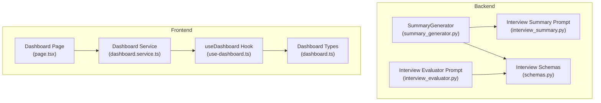
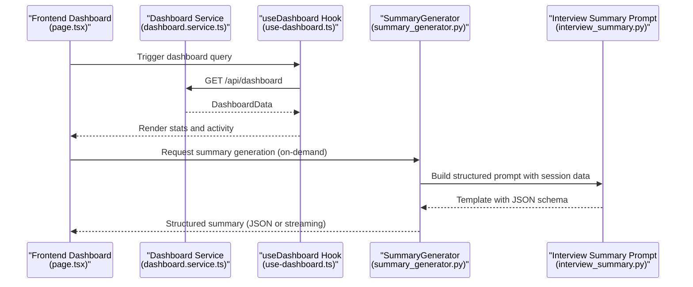
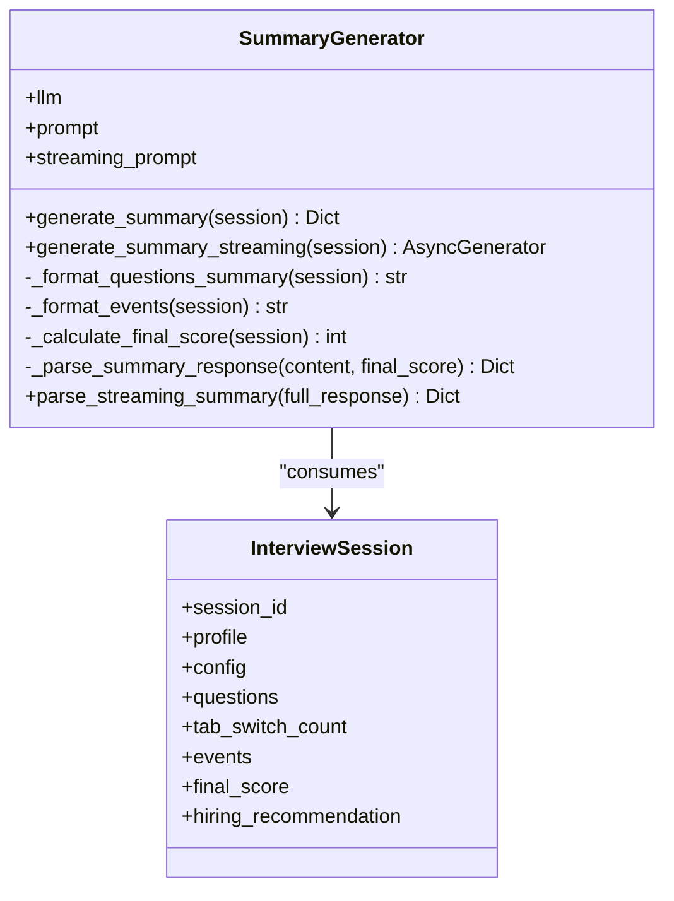
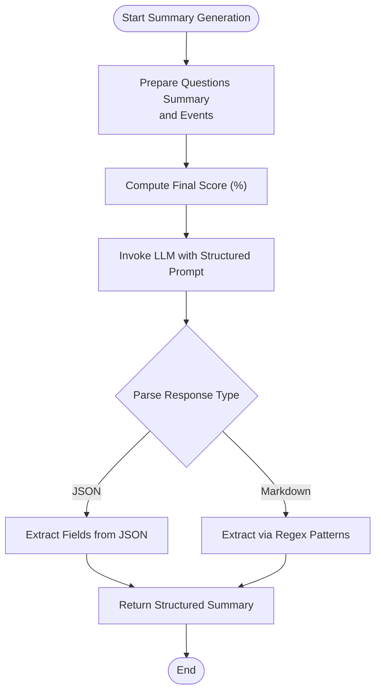
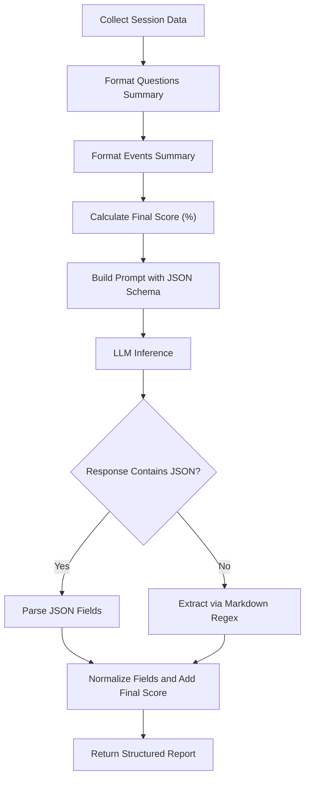
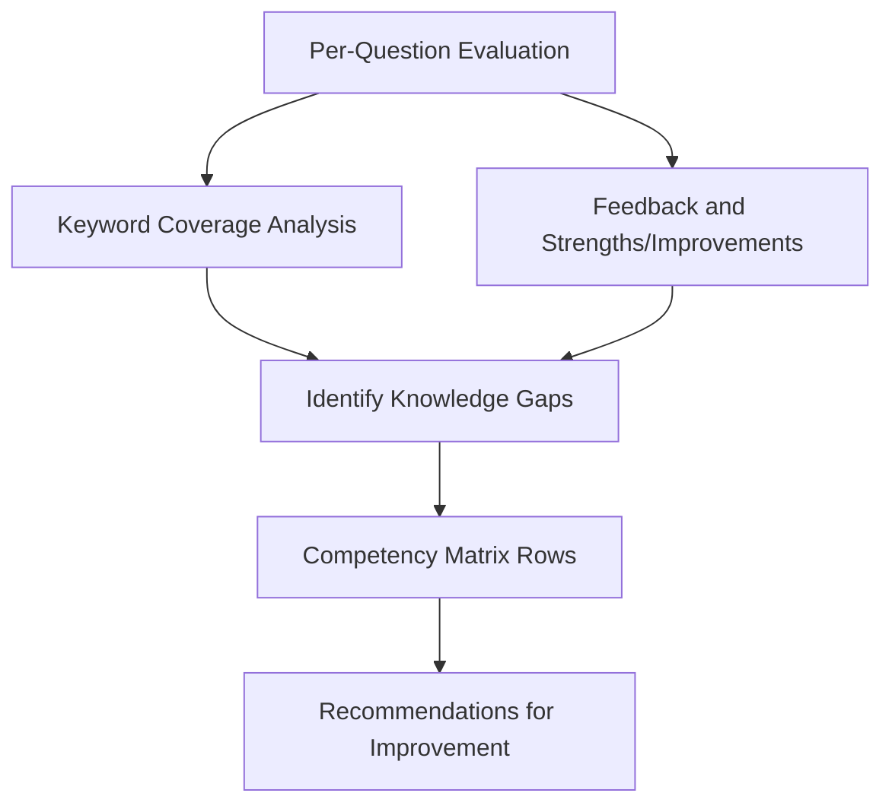
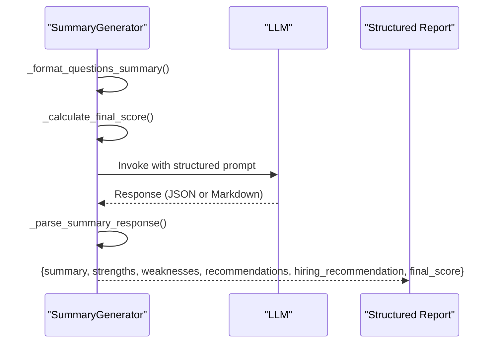
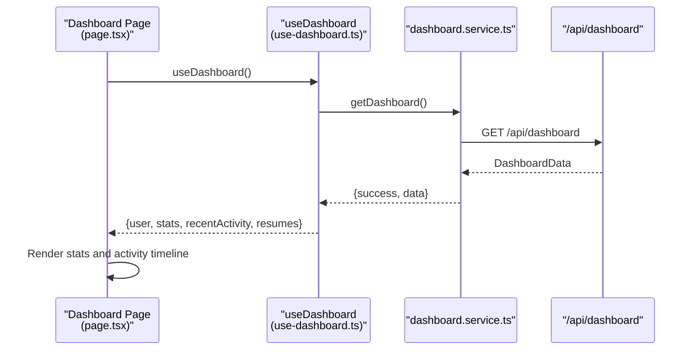
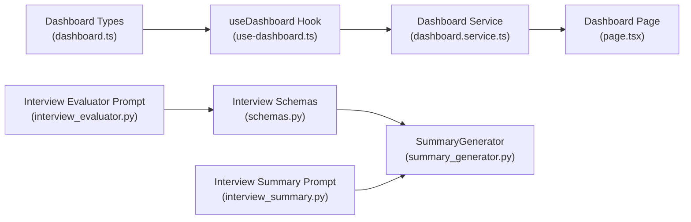

# Analytics and Reporting

<cite>
**Referenced Files in This Document**
- [summary_generator.py](file://backend/app/services/interview/summary_generator.py)
- [interview_summary.py](file://backend/app/data/prompt/interview_summary.py)
- [schemas.py](file://backend/app/models/interview/schemas.py)
- [interview_evaluator.py](file://backend/app/data/prompt/interview_evaluator.py)
- [page.tsx](file://frontend/app/dashboard/page.tsx)
- [dashboard.service.ts](file://frontend/services/dashboard.service.ts)
- [use-dashboard.ts](file://frontend/hooks/queries/use-dashboard.ts)
- [dashboard.ts](file://frontend/types/dashboard.ts)
</cite>

## Table of Contents
1. [Introduction](#introduction)
2. [Project Structure](#project-structure)
3. [Core Components](#core-components)
4. [Architecture Overview](#architecture-overview)
5. [Detailed Component Analysis](#detailed-component-analysis)
6. [Dependency Analysis](#dependency-analysis)
7. [Performance Considerations](#performance-considerations)
8. [Troubleshooting Guide](#troubleshooting-guide)
9. [Conclusion](#conclusion)
10. [Appendices](#appendices)

## Introduction
This document explains the Analytics and Reporting component focused on interview analytics and reporting. It covers how the system generates performance metrics, competency assessments, and improvement recommendations from interview sessions. It documents the SummaryGenerator implementation, report generation algorithms, and visualization capabilities. It also describes how evaluation data is aggregated, skill gaps are identified, and personalized feedback reports are produced. Finally, it outlines integration with frontend reporting components and interactive dashboards, along with examples of analytics outputs, privacy considerations, customization options, and export capabilities.

## Project Structure
The Analytics and Reporting capability spans backend services and prompts that produce structured summaries, and frontend dashboards that present analytics and drive user interactions.

**Diagram sources**
- [summary_generator.py](file://backend/app/services/interview/summary_generator.py#L17-L198)
- [interview_summary.py](file://backend/app/data/prompt/interview_summary.py#L1-L111)
- [interview_evaluator.py](file://backend/app/data/prompt/interview_evaluator.py#L34-L96)
- [schemas.py](file://backend/app/models/interview/schemas.py#L22-L169)
- [page.tsx](file://frontend/app/dashboard/page.tsx#L1-L800)
- [dashboard.service.ts](file://frontend/services/dashboard.service.ts#L1-L8)
- [use-dashboard.ts](file://frontend/hooks/queries/use-dashboard.ts#L1-L13)
- [dashboard.ts](file://frontend/types/dashboard.ts#L1-L39)

**Section sources**
- [summary_generator.py](file://backend/app/services/interview/summary_generator.py#L17-L198)
- [interview_summary.py](file://backend/app/data/prompt/interview_summary.py#L1-L111)
- [schemas.py](file://backend/app/models/interview/schemas.py#L22-L169)
- [interview_evaluator.py](file://backend/app/data/prompt/interview_evaluator.py#L34-L96)
- [page.tsx](file://frontend/app/dashboard/page.tsx#L1-L800)
- [dashboard.service.ts](file://frontend/services/dashboard.service.ts#L1-L8)
- [use-dashboard.ts](file://frontend/hooks/queries/use-dashboard.ts#L1-L13)
- [dashboard.ts](file://frontend/types/dashboard.ts#L1-L39)

## Core Components
- SummaryGenerator: Orchestrates interview summary generation, computes performance metrics, and parses structured outputs from LLM prompts.
- Interview Summary Prompt: Defines the structured JSON schema and streaming format for comprehensive interview summaries.
- Interview Evaluator Prompt: Provides evaluation prompts for per-question scoring, strengths, and improvement suggestions.
- Interview Schemas: Define the data models for interview sessions, questions, and evaluation results.
- Frontend Dashboard: Renders analytics and integrates with backend APIs to display interview statistics and recent activity.

Key responsibilities:
- Aggregate evaluation data across questions and compute a final score.
- Identify competency assessments and skill gaps.
- Generate personalized feedback and hiring recommendations.
- Support streaming and non-streaming summary generation.
- Integrate with frontend dashboards for visualization and user interaction.

**Section sources**
- [summary_generator.py](file://backend/app/services/interview/summary_generator.py#L17-L198)
- [interview_summary.py](file://backend/app/data/prompt/interview_summary.py#L17-L51)
- [interview_evaluator.py](file://backend/app/data/prompt/interview_evaluator.py#L89-L96)
- [schemas.py](file://backend/app/models/interview/schemas.py#L22-L169)
- [page.tsx](file://frontend/app/dashboard/page.tsx#L122-L127)

## Architecture Overview
The analytics pipeline collects interview data, evaluates answers, computes metrics, and produces structured summaries consumed by the frontend dashboard.

**Diagram sources**
- [page.tsx](file://frontend/app/dashboard/page.tsx#L122-L127)
- [dashboard.service.ts](file://frontend/services/dashboard.service.ts#L4-L7)
- [use-dashboard.ts](file://frontend/hooks/queries/use-dashboard.ts#L4-L12)
- [summary_generator.py](file://backend/app/services/interview/summary_generator.py#L25-L72)
- [interview_summary.py](file://backend/app/data/prompt/interview_summary.py#L17-L51)

## Detailed Component Analysis

### SummaryGenerator Implementation
The SummaryGenerator encapsulates the end-to-end process of generating interview summaries, including formatting inputs, invoking LLM prompts, and parsing outputs.

Key behaviors:
- Input preparation: Formats questions, answers, scores, and session events into a prompt-friendly structure.
- Final score calculation: Aggregates per-question scores into a percentage.
- Structured parsing: Attempts JSON parsing first; falls back to markdown extraction for strengths, weaknesses, recommendations, and hiring recommendation.
- Streaming support: Streams LLM chunks for real-time rendering.

**Diagram sources**
- [summary_generator.py](file://backend/app/services/interview/summary_generator.py#L25-L72)
- [summary_generator.py](file://backend/app/services/interview/summary_generator.py#L103-L193)

**Section sources**
- [summary_generator.py](file://backend/app/services/interview/summary_generator.py#L17-L198)

### Report Generation Algorithms
Report generation follows a deterministic algorithm:
- Input aggregation: Collects question texts, difficulty, topic, answer, score, feedback, and session events.
- Metrics computation: Calculates a final score percentage based on total achieved vs. maximum possible points.
- Structured synthesis: Uses a prompt template that enforces a JSON schema for summary, strengths, weaknesses, recommendations, hiring recommendation, and additional attributes.
- Parsing and normalization: Normalizes outputs to ensure consistent field presence and types.

**Diagram sources**
- [interview_summary.py](file://backend/app/data/prompt/interview_summary.py#L17-L51)
- [summary_generator.py](file://backend/app/services/interview/summary_generator.py#L142-L193)

**Section sources**
- [interview_summary.py](file://backend/app/data/prompt/interview_summary.py#L17-L51)
- [summary_generator.py](file://backend/app/services/interview/summary_generator.py#L103-L193)

### Competency Assessments and Skill Gap Identification
Competency assessments are derived from:
- Per-question scores and feedback.
- Topic coverage and keyword matching.
- Behavioral and communication indicators extracted from the summary.

Skill gap identification:
- Weaknesses and areas for improvement are explicitly extracted from the summary.
- Topics to probe indicate follow-up focus areas.
- Technical proficiency and communication skills ratings provide high-level competency signals.

**Diagram sources**
- [interview_evaluator.py](file://backend/app/data/prompt/interview_evaluator.py#L34-L51)
- [interview_summary.py](file://backend/app/data/prompt/interview_summary.py#L35-L47)
- [summary_generator.py](file://backend/app/services/interview/summary_generator.py#L142-L193)

**Section sources**
- [interview_evaluator.py](file://backend/app/data/prompt/interview_evaluator.py#L34-L51)
- [interview_summary.py](file://backend/app/data/prompt/interview_summary.py#L35-L47)
- [summary_generator.py](file://backend/app/services/interview/summary_generator.py#L142-L193)

### Personalized Feedback Reports
Personalized feedback is generated by:
- Embedding specific examples from answers and scores.
- Providing actionable recommendations grounded in observed strengths and weaknesses.
- Including hiring recommendation with justification and next steps.

**Diagram sources**
- [summary_generator.py](file://backend/app/services/interview/summary_generator.py#L25-L72)
- [summary_generator.py](file://backend/app/services/interview/summary_generator.py#L142-L193)

**Section sources**
- [summary_generator.py](file://backend/app/services/interview/summary_generator.py#L25-L72)
- [summary_generator.py](file://backend/app/services/interview/summary_generator.py#L142-L193)

### Frontend Integration and Interactive Dashboards
The frontend dashboard integrates analytics data and provides interactive views:
- Dashboard service fetches analytics data from the backend.
- React Query hook manages caching and fetching.
- Dashboard page renders statistics, recent activity, and links to detailed analysis pages.

**Diagram sources**
- [page.tsx](file://frontend/app/dashboard/page.tsx#L122-L127)
- [use-dashboard.ts](file://frontend/hooks/queries/use-dashboard.ts#L4-L12)
- [dashboard.service.ts](file://frontend/services/dashboard.service.ts#L4-L7)
- [dashboard.ts](file://frontend/types/dashboard.ts#L33-L38)

**Section sources**
- [page.tsx](file://frontend/app/dashboard/page.tsx#L122-L127)
- [use-dashboard.ts](file://frontend/hooks/queries/use-dashboard.ts#L4-L12)
- [dashboard.service.ts](file://frontend/services/dashboard.service.ts#L4-L7)
- [dashboard.ts](file://frontend/types/dashboard.ts#L33-L38)

### Analytics Outputs and Examples
Example outputs produced by the system:
- Competency matrix: Rows represent topics; columns represent proficiency levels derived from technical_proficiency and communication_skills.
- Trend analysis: Historical interview sessions can be compared using final_score and hiring_recommendation over time.
- Comparative assessments: Aggregate strengths and weaknesses across multiple sessions to compare candidates or track personal improvement.

Note: The system does not currently expose dedicated endpoints for exporting analytics datasets. The frontend dashboard focuses on rendering summarized insights rather than raw dataset exports.

**Section sources**
- [interview_summary.py](file://backend/app/data/prompt/interview_summary.py#L35-L47)
- [summary_generator.py](file://backend/app/services/interview/summary_generator.py#L129-L140)
- [schemas.py](file://backend/app/models/interview/schemas.py#L72-L94)

## Dependency Analysis
The analytics pipeline exhibits clear separation of concerns:
- Backend depends on LLM prompts and schemas to produce structured summaries.
- Frontend depends on typed dashboard data to render visualizations and activity timelines.

**Diagram sources**
- [dashboard.ts](file://frontend/types/dashboard.ts#L1-L39)
- [use-dashboard.ts](file://frontend/hooks/queries/use-dashboard.ts#L1-L13)
- [dashboard.service.ts](file://frontend/services/dashboard.service.ts#L1-L8)
- [page.tsx](file://frontend/app/dashboard/page.tsx#L1-L800)
- [schemas.py](file://backend/app/models/interview/schemas.py#L22-L169)
- [summary_generator.py](file://backend/app/services/interview/summary_generator.py#L17-L198)
- [interview_summary.py](file://backend/app/data/prompt/interview_summary.py#L1-L111)
- [interview_evaluator.py](file://backend/app/data/prompt/interview_evaluator.py#L34-L96)

**Section sources**
- [schemas.py](file://backend/app/models/interview/schemas.py#L22-L169)
- [summary_generator.py](file://backend/app/services/interview/summary_generator.py#L17-L198)
- [interview_summary.py](file://backend/app/data/prompt/interview_summary.py#L1-L111)
- [interview_evaluator.py](file://backend/app/data/prompt/interview_evaluator.py#L34-L96)
- [dashboard.ts](file://frontend/types/dashboard.ts#L1-L39)
- [use-dashboard.ts](file://frontend/hooks/queries/use-dashboard.ts#L1-L13)
- [dashboard.service.ts](file://frontend/services/dashboard.service.ts#L1-L8)
- [page.tsx](file://frontend/app/dashboard/page.tsx#L1-L800)

## Performance Considerations
- Streaming summaries: The streaming mode reduces perceived latency by yielding partial content chunks, improving user experience during long evaluations.
- Prompt templating: Using structured templates ensures consistent parsing and reduces retries due to format mismatches.
- Input formatting: Efficient aggregation of questions and events avoids redundant computations and keeps prompt sizes manageable.
- Caching and pagination: Frontend hooks should leverage caching and pagination for large datasets to minimize network overhead.

[No sources needed since this section provides general guidance]

## Troubleshooting Guide
Common issues and resolutions:
- Summary generation unavailable: The generator returns a safe fallback when the LLM is not configured, preventing crashes and signaling administrators to configure the LLM.
- Parsing failures: The parser attempts JSON parsing first, then falls back to regex-based extraction; ensure prompts remain aligned with expected formats.
- Empty or missing data: If questions are absent, the final score defaults to zero; verify that evaluation results are persisted before generating summaries.
- Event formatting: Events are aggregated into counts; ensure event metadata is consistent to avoid misinterpretation.

**Section sources**
- [summary_generator.py](file://backend/app/services/interview/summary_generator.py#L30-L37)
- [summary_generator.py](file://backend/app/services/interview/summary_generator.py#L142-L193)
- [summary_generator.py](file://backend/app/services/interview/summary_generator.py#L129-L140)
- [summary_generator.py](file://backend/app/services/interview/summary_generator.py#L117-L127)

## Conclusion
The Analytics and Reporting component delivers robust interview analytics by combining structured evaluation data, competency assessments, and personalized feedback. The SummaryGenerator centralizes report generation, while prompts enforce consistent outputs. The frontend dashboard integrates seamlessly to present key metrics and recent activity. While the current implementation emphasizes summarized insights, future enhancements can include dataset exports and advanced visualizations to support deeper stakeholder analysis.

[No sources needed since this section summarizes without analyzing specific files]

## Appendices

### Data Privacy Considerations
- Candidate data: CandidateProfile fields (name, email, phone) are part of the session model; ensure compliance with privacy regulations when storing and processing.
- Session events: Events such as tab switches are aggregated into counts; avoid exposing sensitive metadata.
- Access controls: Restrict dashboard and analytics endpoints to authenticated users and appropriate roles.

**Section sources**
- [schemas.py](file://backend/app/models/interview/schemas.py#L45-L53)
- [schemas.py](file://backend/app/models/interview/schemas.py#L96-L104)

### Report Customization Options
- Summary fields: The JSON schema supports customizable fields including summary, strengths, weaknesses, recommendations, hiring recommendation, topics to probe, cultural fit notes, technical proficiency, and communication skills.
- Streaming format: The streaming template enables real-time rendering with markdown sections for strengths and weaknesses.

**Section sources**
- [interview_summary.py](file://backend/app/data/prompt/interview_summary.py#L35-L47)
- [interview_summary.py](file://backend/app/data/prompt/interview_summary.py#L54-L100)

### Export Capabilities
- Current state: The repository does not expose explicit endpoints for exporting analytics datasets.
- Recommendations: Extend backend routes to provide CSV/JSON exports of interview summaries and competency matrices for stakeholder sharing.

**Section sources**
- [page.tsx](file://frontend/app/dashboard/page.tsx#L1-L800)
- [dashboard.service.ts](file://frontend/services/dashboard.service.ts#L4-L7)