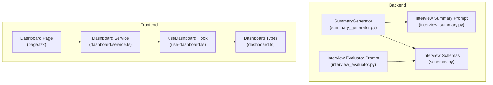
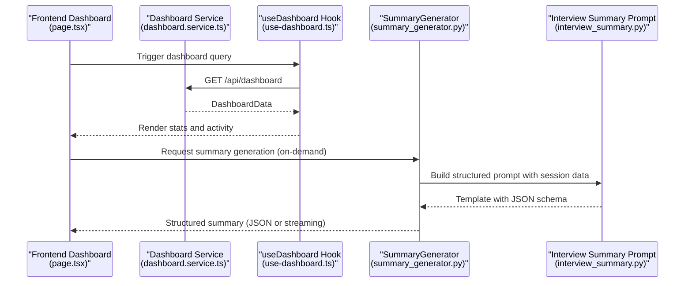
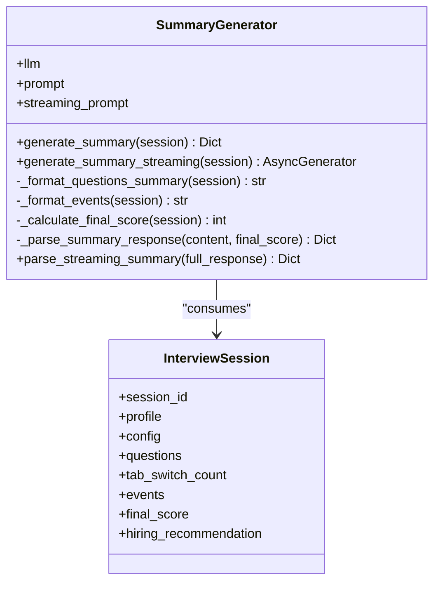
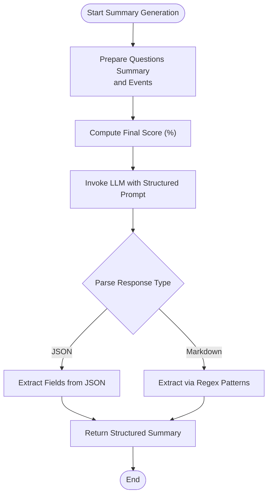
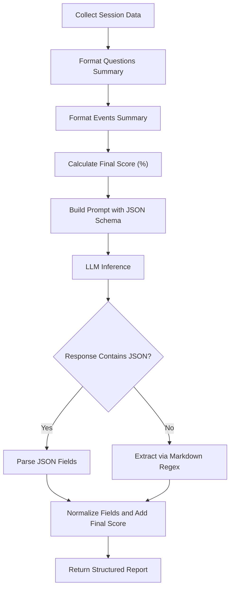
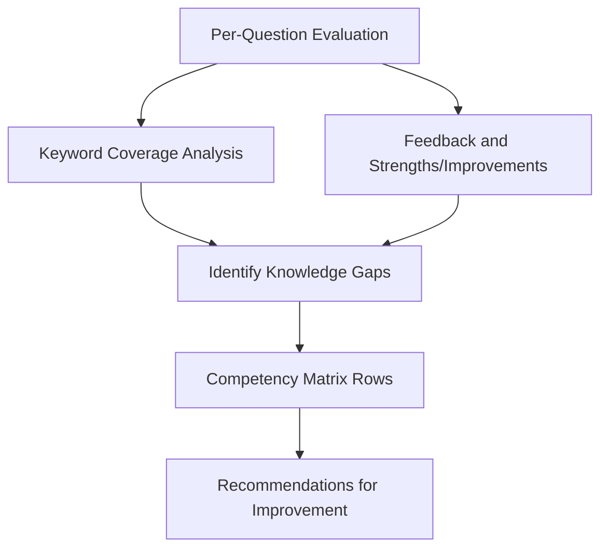
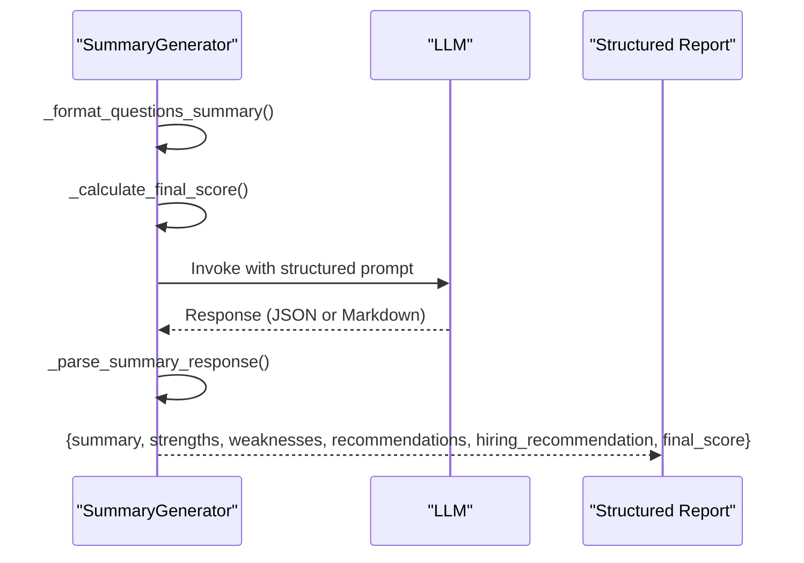
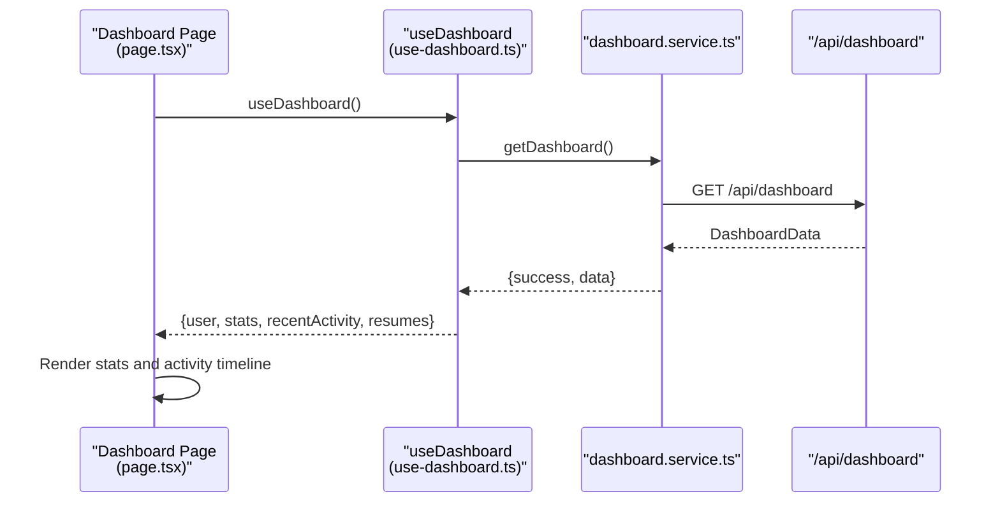
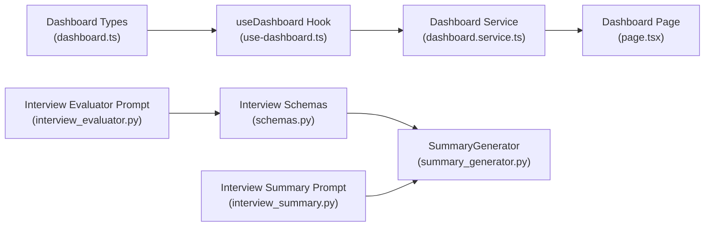

# Analytics and reporting

The Analytics and Reporting component focused on interview analytics and reporting.

## Repository layout
The Analytics and Reporting capability spans backend services and prompts that produce structured summaries, and frontend dashboards that present analytics and drive user interactions.

```mermaid
graph TB
subgraph "Backend"
SG["SummaryGenerator<br/>(summary_generator.py)"]
PROMPT["Interview Summary Prompt<br/>(interview_summary.py)"]
EVAL_PROMPT["Interview Evaluator Prompt<br/>(interview_evaluator.py)"]
MODELS["Interview Schemas<br/>(schemas.py)"]
end
subgraph "Frontend"
DASH_PAGE["Dashboard Page<br/>(page.tsx)"]
DASH_SERVICE["Dashboard Service<br/>(dashboard.service.ts)"]
DASH_QUERY["useDashboard Hook<br/>(use-dashboard.ts)"]
DASH_TYPES["Dashboard Types<br/>(dashboard.ts)"]
end
SG --> PROMPT
SG --> MODELS
EVAL_PROMPT --> MODELS
DASH_PAGE --> DASH_SERVICE
DASH_SERVICE --> DASH_QUERY
DASH_QUERY --> DASH_TYPES
```

## Building blocks
- SummaryGenerator: Orchestrates interview summary generation, computes performance metrics, and parses structured outputs from LLM prompts.
- Interview Summary Prompt: Defines the structured JSON schema and streaming format for detailed interview summaries.
- Interview Evaluator Prompt: Provides evaluation prompts for per-question scoring, strengths, and improvement suggestions.
- Interview Schemas: Define the data models for interview sessions, questions, and evaluation results.
- Frontend Dashboard: Renders analytics and integrates with backend APIs to display interview statistics and recent activity.

Key responsibilities:
- Aggregate evaluation data across questions and compute a final score.
- Identify competency assessments and skill gaps.
- Generate personalized feedback and hiring recommendations.
- Support streaming and non-streaming summary generation.
- Integrate with frontend dashboards for visualization and user interaction.

## How it fits together
The analytics pipeline collects interview data, evaluates answers, computes metrics, and produces structured summaries consumed by the frontend dashboard.

```mermaid
sequenceDiagram
participant FE as "Frontend Dashboard<br/>(page.tsx)"
participant SVC as "Dashboard Service<br/>(dashboard.service.ts)"
participant QRY as "useDashboard Hook<br/>(use-dashboard.ts)"
participant BE as "SummaryGenerator<br/>(summary_generator.py)"
participant PROMPT as "Interview Summary Prompt<br/>(interview_summary.py)"
FE->>QRY : Trigger dashboard query
QRY->>SVC : GET /api/dashboard
SVC-->>QRY : DashboardData
QRY-->>FE : Render stats and activity
FE->>BE : Request summary generation (on-demand)
BE->>PROMPT : Build structured prompt with session data
PROMPT-->>BE : Template with JSON schema
BE-->>FE : Structured summary (JSON or streaming)
```

## SummaryGenerator implementation
SummaryGenerator formats inputs, calls the summary prompts, and parses the model output.

```mermaid
classDiagram
class SummaryGenerator {
+llm
+prompt
+streaming_prompt
+generate_summary(session) Dict
+generate_summary_streaming(session) AsyncGenerator
-_format_questions_summary(session) str
-_format_events(session) str
-_calculate_final_score(session) int
-_parse_summary_response(content, final_score) Dict
+parse_streaming_summary(full_response) Dict
}
class InterviewSession {
+session_id
+profile
+config
+questions
+tab_switch_count
+events
+final_score
+hiring_recommendation
}
SummaryGenerator --> InterviewSession : "consumes"
```

Key behaviors:
- Input preparation: Formats questions, answers, scores, and session events into a prompt-friendly structure.
- Final score calculation: Aggregates per-question scores into a percentage.
- Structured parsing: Attempts JSON parsing first; falls back to markdown extraction for strengths, weaknesses, recommendations, and hiring recommendation.
- Streaming support: Streams LLM chunks for real-time rendering.

```mermaid
flowchart TD
Start(["Start Summary Generation"]) --> Prep["Prepare Questions Summary<br/>and Events"]
Prep --> Score["Compute Final Score (%)"]
Score --> Invoke["Invoke LLM with Structured Prompt"]
Invoke --> Parse{"Parse Response Type"}
Parse --> |JSON| JSONPath["Extract Fields from JSON"]
Parse --> |Markdown| MDPath["Extract via Regex Patterns"]
JSONPath --> Output["Return Structured Summary"]
MDPath --> Output
Output --> End(["End"])
```

## Report generation algorithms
Report generation follows a deterministic algorithm:
- Input aggregation: Collects question texts, difficulty, topic, answer, score, feedback, and session events.
- Metrics computation: Calculates a final score percentage based on total achieved vs. maximum possible points.
- Structured synthesis: Uses a prompt template that enforces a JSON schema for summary, strengths, weaknesses, recommendations, hiring recommendation, and additional attributes.
- Parsing and normalization: Normalizes outputs to ensure consistent field presence and types.

```mermaid
flowchart TD
A["Collect Session Data"] --> B["Format Questions Summary"]
B --> C["Format Events Summary"]
C --> D["Calculate Final Score (%)"]
D --> E["Build Prompt with JSON Schema"]
E --> F["LLM Inference"]
F --> G{"Response Contains JSON?"}
G --> |Yes| H["Parse JSON Fields"]
G --> |No| I["Extract via Markdown Regex"]
H --> J["Normalize Fields and Add Final Score"]
I --> J
J --> K["Return Structured Report"]
```

## Competency assessments and skill gap identification
Competency assessments are derived from:
- Per-question scores and feedback.
- Topic coverage and keyword matching.
- Behavioral and communication indicators extracted from the summary.

Skill gap identification:
- Weaknesses and areas for improvement are explicitly extracted from the summary.
- Topics to probe indicate follow-up focus areas.
- Technical proficiency and communication skills ratings provide high-level competency signals.

```mermaid
flowchart TD
QA["Per-Question Evaluation"] --> KW["Keyword Coverage Analysis"]
QA --> FEED["Feedback and Strengths/Improvements"]
KW --> GAP["Identify Knowledge Gaps"]
FEED --> GAP
GAP --> ASSESS["Competency Matrix Rows"]
ASSESS --> RECS["Recommendations for Improvement"]
```

## Personalized feedback reports
Personalized feedback is generated by:
- Embedding specific examples from answers and scores.
- Providing concrete recommendations grounded in observed strengths and weaknesses.
- Including hiring recommendation with justification and next steps.

```mermaid
sequenceDiagram
participant Gen as "SummaryGenerator"
participant LLM as "LLM"
participant Out as "Structured Report"
Gen->>Gen : _format_questions_summary()
Gen->>Gen : _calculate_final_score()
Gen->>LLM : Invoke with structured prompt
LLM-->>Gen : Response (JSON or Markdown)
Gen->>Gen : _parse_summary_response()
Gen-->>Out : {summary, strengths, weaknesses, recommendations, hiring_recommendation, final_score}
```

## Frontend integration and interactive dashboards
The frontend dashboard integrates analytics data and provides interactive views:
- Dashboard service fetches analytics data from the backend.
- React Query hook manages caching and fetching.
- Dashboard page renders statistics, recent activity, and links to detailed analysis pages.

```mermaid
sequenceDiagram
participant Page as "Dashboard Page<br/>(page.tsx)"
participant Hook as "useDashboard<br/>(use-dashboard.ts)"
participant Service as "dashboard.service.ts"
participant API as "/api/dashboard"
Page->>Hook : useDashboard()
Hook->>Service : getDashboard()
Service->>API : GET /api/dashboard
API-->>Service : DashboardData
Service-->>Hook : {success, data}
Hook-->>Page : {user, stats, recentActivity, resumes}
Page->>Page : Render stats and activity timeline
```

## Analytics outputs and examples
Example outputs produced by the system:
- Competency matrix: Rows represent topics; columns represent proficiency levels derived from technical_proficiency and communication_skills.
- Trend analysis: Historical interview sessions can be compared using final_score and hiring_recommendation over time.
- Comparative assessments: Aggregate strengths and weaknesses across multiple sessions to compare candidates or track personal improvement.

Note: The system does not currently expose dedicated endpoints for exporting analytics datasets. The frontend dashboard focuses on rendering summarized insights rather than raw dataset exports.

## Dependencies
The analytics pipeline splits work by layer:
- Backend depends on LLM prompts and schemas to produce structured summaries.
- Frontend depends on typed dashboard data to render visualizations and activity timelines.

```mermaid
graph LR
FE_TYPES["Dashboard Types<br/>(dashboard.ts)"] --> FE_HOOK["useDashboard Hook<br/>(use-dashboard.ts)"]
FE_HOOK --> FE_SERVICE["Dashboard Service<br/>(dashboard.service.ts)"]
FE_SERVICE --> FE_PAGE["Dashboard Page<br/>(page.tsx)"]
BE_MODELS["Interview Schemas<br/>(schemas.py)"] --> BE_SG["SummaryGenerator<br/>(summary_generator.py)"]
BE_PROMPT["Interview Summary Prompt<br/>(interview_summary.py)"] --> BE_SG
BE_EVAL["Interview Evaluator Prompt<br/>(interview_evaluator.py)"] --> BE_MODELS
```

## Performance
- Streaming summaries: The streaming mode reduces perceived latency by yielding partial content chunks, improving user experience during long evaluations.
- Prompt templating: Structured templates keep parsing consistent and reduces retries due to format mismatches.
- Input formatting: Efficient aggregation of questions and events avoids redundant computations and keeps prompt sizes manageable.
- Caching and pagination: Frontend hooks should use caching and pagination for large datasets to minimize network overhead.

[No sources needed since this section provides general guidance]

## Troubleshooting
Common issues:

- Summary generation unavailable: The generator returns a safe fallback when the LLM is not configured, preventing crashes and signaling administrators to configure the LLM.
- Parsing failures: The parser attempts JSON parsing first, then falls back to regex-based extraction; keep prompts aligned with expected formats.
- Empty or missing data: If questions are absent, the final score defaults to zero; verify that evaluation results are persisted before generating summaries.
- Event formatting: Events are aggregated into counts; keep event metadata consistent to avoid misinterpretation.

## Appendix

### Data privacy considerations
- Candidate data: CandidateProfile fields (name, email, phone) are part of the session model; stay within privacy regulations when storing and processing.
- Session events: Events such as tab switches are aggregated into counts; avoid exposing sensitive metadata.
- Access controls: Restrict dashboard and analytics endpoints to authenticated users and appropriate roles.

### Report customization options
- Summary fields: The JSON schema supports customizable fields including summary, strengths, weaknesses, recommendations, hiring recommendation, topics to probe, cultural fit notes, technical proficiency, and communication skills.
- Streaming format: The streaming template enables real-time rendering with markdown sections for strengths and weaknesses.

### Export capabilities
- Current state: The repository does not expose explicit endpoints for exporting analytics datasets.
- Recommendations: Extend backend routes to provide CSV/JSON exports of interview summaries and competency matrices for stakeholder sharing.
