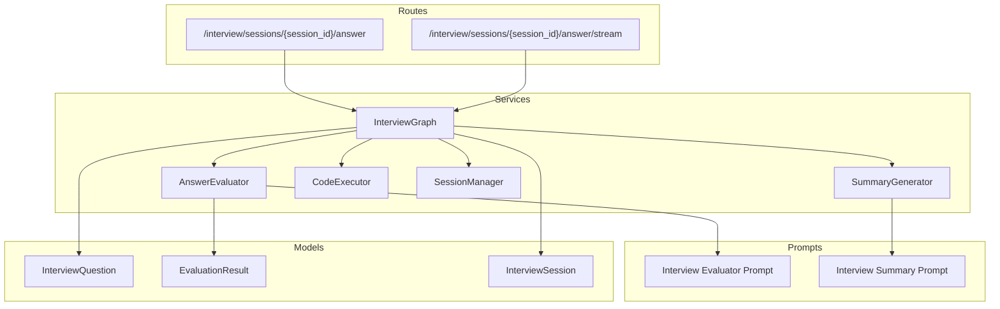
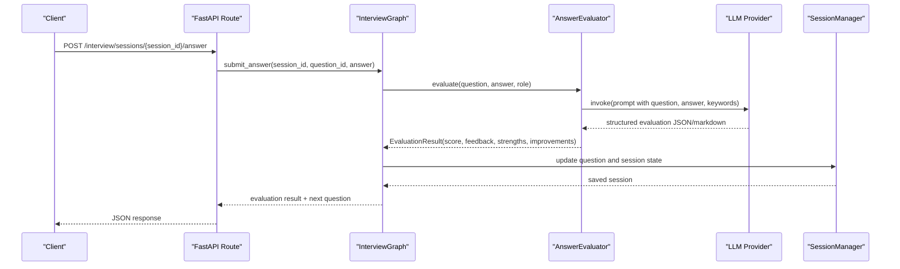
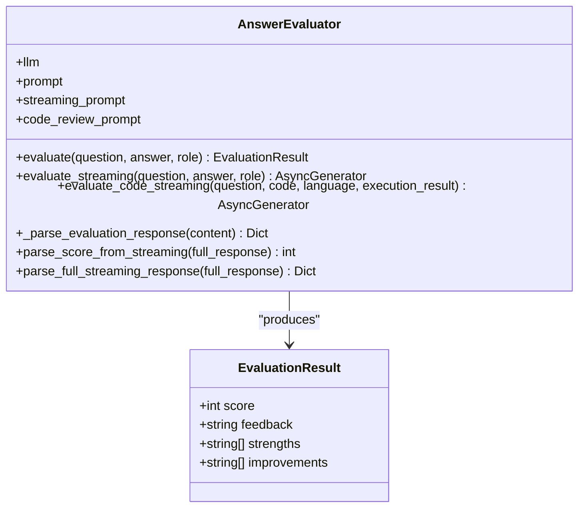
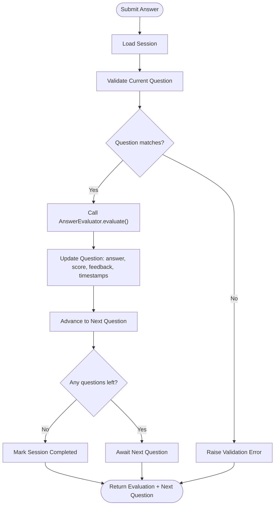
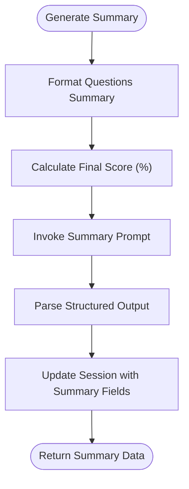
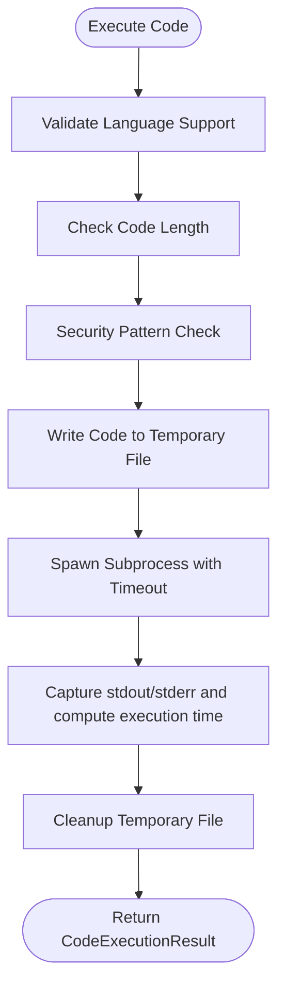
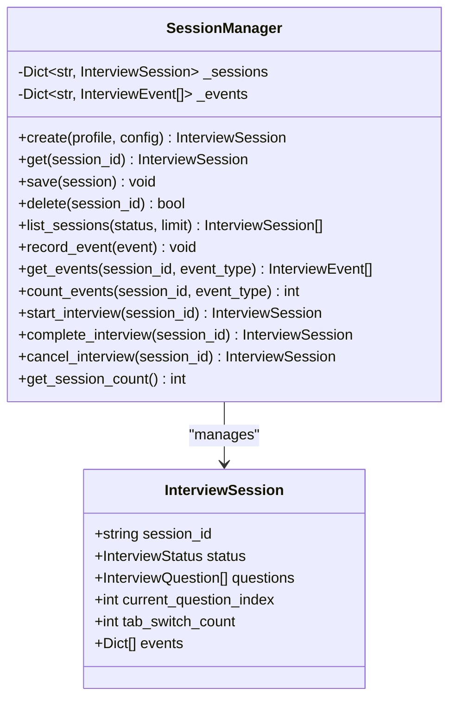
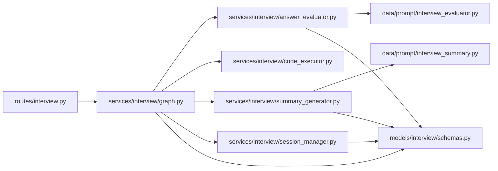

# Answer Evaluation System

<cite>
**Referenced Files in This Document**
- [answer_evaluator.py](file://backend/app/services/interview/answer_evaluator.py)
- [interview_evaluator.py](file://backend/app/data/prompt/interview_evaluator.py)
- [schemas.py](file://backend/app/models/interview/schemas.py)
- [enums.py](file://backend/app/models/interview/enums.py)
- [graph.py](file://backend/app/services/interview/graph.py)
- [interview.py](file://backend/app/routes/interview.py)
- [summary_generator.py](file://backend/app/services/interview/summary_generator.py)
- [interview_summary.py](file://backend/app/data/prompt/interview_summary.py)
- [code_executor.py](file://backend/app/services/interview/code_executor.py)
- [session_manager.py](file://backend/app/services/interview/session_manager.py)
</cite>

## Table of Contents
1. [Introduction](#introduction)
2. [Project Structure](#project-structure)
3. [Core Components](#core-components)
4. [Architecture Overview](#architecture-overview)
5. [Detailed Component Analysis](#detailed-component-analysis)
6. [Dependency Analysis](#dependency-analysis)
7. [Performance Considerations](#performance-considerations)
8. [Troubleshooting Guide](#troubleshooting-guide)
9. [Conclusion](#conclusion)

## Introduction
The Answer Evaluation System evaluates candidate responses during digital interviews using a multi-dimensional scoring framework. It integrates natural language understanding with structured prompts to assess technical competency, communication effectiveness, and cultural fit indicators. The system supports both non-streaming and streaming evaluation modes, enabling real-time feedback delivery via Server-Sent Events (SSE). It also incorporates code execution results for technical challenges, ensuring holistic evaluation across different question types.

## Project Structure
The Answer Evaluation System spans several modules:
- Services orchestrate the interview flow and evaluation logic.
- Data prompts define the evaluation criteria and output formats.
- Models encapsulate schemas for questions, answers, and evaluation results.
- Routes expose APIs for submitting answers, streaming evaluations, and managing sessions.

**Diagram sources**
- [interview.py](file://backend/app/routes/interview.py#L154-L224)
- [graph.py](file://backend/app/services/interview/graph.py#L23-L47)
- [answer_evaluator.py](file://backend/app/services/interview/answer_evaluator.py#L22-L29)
- [summary_generator.py](file://backend/app/services/interview/summary_generator.py#L17-L24)
- [interview_evaluator.py](file://backend/app/data/prompt/interview_evaluator.py#L23-L54)
- [interview_summary.py](file://backend/app/data/prompt/interview_summary.py#L17-L51)
- [schemas.py](file://backend/app/models/interview/schemas.py#L22-L43)
- [schemas.py](file://backend/app/models/interview/schemas.py#L151-L158)
- [schemas.py](file://backend/app/models/interview/schemas.py#L72-L94)

**Section sources**
- [interview.py](file://backend/app/routes/interview.py#L1-L494)
- [graph.py](file://backend/app/services/interview/graph.py#L1-L511)
- [answer_evaluator.py](file://backend/app/services/interview/answer_evaluator.py#L1-L227)
- [summary_generator.py](file://backend/app/services/interview/summary_generator.py#L1-L198)
- [interview_evaluator.py](file://backend/app/data/prompt/interview_evaluator.py#L1-L97)
- [interview_summary.py](file://backend/app/data/prompt/interview_summary.py#L1-L111)
- [schemas.py](file://backend/app/models/interview/schemas.py#L1-L169)

## Core Components
- AnswerEvaluator: Orchestrates evaluation of textual answers and code submissions, parses structured outputs, and supports streaming responses.
- InterviewGraph: Coordinates session lifecycle, question flow, and integrates evaluation and code execution.
- SummaryGenerator: Produces comprehensive interview summaries with cultural fit and communication insights.
- CodeExecutor: Safely executes candidate code and returns execution metrics for contextual evaluation.
- SessionManager: Manages interview sessions and events in memory, tracking tab switches and integrity signals.
- Prompts: Define evaluation rubrics and output formats for both evaluation and summary generation.
- Schemas: Define data models for questions, answers, evaluation results, and session state.

**Section sources**
- [answer_evaluator.py](file://backend/app/services/interview/answer_evaluator.py#L22-L227)
- [graph.py](file://backend/app/services/interview/graph.py#L23-L47)
- [summary_generator.py](file://backend/app/services/interview/summary_generator.py#L17-L198)
- [code_executor.py](file://backend/app/services/interview/code_executor.py#L11-L278)
- [session_manager.py](file://backend/app/services/interview/session_manager.py#L15-L257)
- [interview_evaluator.py](file://backend/app/data/prompt/interview_evaluator.py#L5-L54)
- [interview_summary.py](file://backend/app/data/prompt/interview_summary.py#L5-L51)
- [schemas.py](file://backend/app/models/interview/schemas.py#L22-L169)

## Architecture Overview
The system follows a layered architecture:
- API Layer: FastAPI routes handle requests and stream responses.
- Orchestration Layer: InterviewGraph manages state transitions and delegates tasks.
- Evaluation Layer: AnswerEvaluator and SummaryGenerator produce structured results.
- Execution Layer: CodeExecutor validates and runs candidate code.
- Persistence Layer: SessionManager stores sessions and events.

**Diagram sources**
- [interview.py](file://backend/app/routes/interview.py#L154-L186)
- [graph.py](file://backend/app/services/interview/graph.py#L99-L168)
- [answer_evaluator.py](file://backend/app/services/interview/answer_evaluator.py#L31-L80)
- [session_manager.py](file://backend/app/services/interview/session_manager.py#L65-L72)

## Detailed Component Analysis

### AnswerEvaluator
The AnswerEvaluator class encapsulates the evaluation logic:
- Non-streaming evaluation: Builds a LangChain prompt with role, difficulty, topic, question, expected keywords, and candidate answer; invokes the LLM; parses JSON or markdown to produce an EvaluationResult.
- Streaming evaluation: Formats a streaming prompt and yields tokens incrementally for SSE.
- Code streaming: Uses a specialized prompt incorporating execution results (success, stdout/stderr, execution time) to provide code review feedback.
- Parsing utilities: Extract structured fields (score, strengths, improvements) from both JSON and markdown outputs.

**Diagram sources**
- [answer_evaluator.py](file://backend/app/services/interview/answer_evaluator.py#L22-L227)
- [schemas.py](file://backend/app/models/interview/schemas.py#L151-L158)

**Section sources**
- [answer_evaluator.py](file://backend/app/services/interview/answer_evaluator.py#L22-L227)
- [interview_evaluator.py](file://backend/app/data/prompt/interview_evaluator.py#L23-L96)
- [schemas.py](file://backend/app/models/interview/schemas.py#L151-L158)

### InterviewGraph
InterviewGraph orchestrates the end-to-end interview flow:
- Creates sessions, generates questions, and updates state upon answer submission.
- Streams evaluation tokens to clients via SSE and parses final results.
- Executes code, streams execution results, and then streams code review.
- Generates final interview summaries with cultural fit and communication assessments.

**Diagram sources**
- [graph.py](file://backend/app/services/interview/graph.py#L99-L168)

**Section sources**
- [graph.py](file://backend/app/services/interview/graph.py#L23-L47)
- [graph.py](file://backend/app/services/interview/graph.py#L99-L168)
- [graph.py](file://backend/app/services/interview/graph.py#L170-L242)
- [graph.py](file://backend/app/services/interview/graph.py#L287-L372)

### SummaryGenerator
The SummaryGenerator produces comprehensive interview summaries:
- Calculates a final score as a percentage from question scores.
- Formats questions and events for context.
- Parses structured outputs (JSON or markdown) to extract strengths, weaknesses, recommendations, hiring recommendation, cultural fit notes, technical proficiency, and communication skills.

**Diagram sources**
- [summary_generator.py](file://backend/app/services/interview/summary_generator.py#L25-L72)
- [interview_summary.py](file://backend/app/data/prompt/interview_summary.py#L17-L51)

**Section sources**
- [summary_generator.py](file://backend/app/services/interview/summary_generator.py#L17-L198)
- [interview_summary.py](file://backend/app/data/prompt/interview_summary.py#L1-L111)
- [schemas.py](file://backend/app/models/interview/schemas.py#L72-L94)

### CodeExecutor
The CodeExecutor safely executes candidate code:
- Validates language support and enforces length limits.
- Performs basic security checks to prevent dangerous patterns.
- Runs code with timeouts and captures stdout/stderr.
- Supports batch test execution and aggregates results.

**Diagram sources**
- [code_executor.py](file://backend/app/services/interview/code_executor.py#L35-L153)

**Section sources**
- [code_executor.py](file://backend/app/services/interview/code_executor.py#L11-L278)
- [schemas.py](file://backend/app/models/interview/schemas.py#L160-L169)

### SessionManager
SessionManager maintains in-memory state for sessions and events:
- Stores sessions and events keyed by session_id.
- Tracks tab switches and other integrity events.
- Provides CRUD operations and listing with filtering.

**Diagram sources**
- [session_manager.py](file://backend/app/services/interview/session_manager.py#L15-L257)
- [schemas.py](file://backend/app/models/interview/schemas.py#L72-L94)

**Section sources**
- [session_manager.py](file://backend/app/services/interview/session_manager.py#L15-L257)
- [enums.py](file://backend/app/models/interview/enums.py#L14-L21)
- [schemas.py](file://backend/app/models/interview/schemas.py#L72-L94)

## Dependency Analysis
The system exhibits clear separation of concerns:
- Routes depend on InterviewGraph for orchestration.
- InterviewGraph depends on AnswerEvaluator, CodeExecutor, SummaryGenerator, and SessionManager.
- AnswerEvaluator and SummaryGenerator depend on prompt templates and LLM providers.
- Models define the data contracts used across services.

**Diagram sources**
- [interview.py](file://backend/app/routes/interview.py#L1-L494)
- [graph.py](file://backend/app/services/interview/graph.py#L1-L511)
- [answer_evaluator.py](file://backend/app/services/interview/answer_evaluator.py#L1-L227)
- [summary_generator.py](file://backend/app/services/interview/summary_generator.py#L1-L198)
- [interview_evaluator.py](file://backend/app/data/prompt/interview_evaluator.py#L1-L97)
- [interview_summary.py](file://backend/app/data/prompt/interview_summary.py#L1-L111)
- [schemas.py](file://backend/app/models/interview/schemas.py#L1-L169)

**Section sources**
- [interview.py](file://backend/app/routes/interview.py#L1-L494)
- [graph.py](file://backend/app/services/interview/graph.py#L1-L511)
- [answer_evaluator.py](file://backend/app/services/interview/answer_evaluator.py#L1-L227)
- [summary_generator.py](file://backend/app/services/interview/summary_generator.py#L1-L198)
- [interview_evaluator.py](file://backend/app/data/prompt/interview_evaluator.py#L1-L97)
- [interview_summary.py](file://backend/app/data/prompt/interview_summary.py#L1-L111)
- [schemas.py](file://backend/app/models/interview/schemas.py#L1-L169)

## Performance Considerations
- Streaming evaluation reduces perceived latency by delivering partial feedback incrementally.
- Code execution timeouts and output truncation prevent resource exhaustion.
- In-memory session storage simplifies deployment but requires persistence planning for production.
- Prompt templates standardize evaluation criteria, aiding consistency across LLM invocations.

[No sources needed since this section provides general guidance]

## Troubleshooting Guide
Common issues and mitigations:
- Evaluation service unavailable: The system returns a neutral default score and feedback when the LLM provider is unreachable.
- Parsing failures: The parser attempts JSON extraction first, falling back to markdown parsing; ensure prompts consistently produce one of these formats.
- Streaming interruptions: SSE endpoints wrap errors into structured messages for client handling.
- Session validation errors: The graph validates current question state and raises explicit errors if mismatched.
- Code execution errors: Security checks and timeouts guard against malicious or excessive code; results include stderr for diagnostics.

**Section sources**
- [answer_evaluator.py](file://backend/app/services/interview/answer_evaluator.py#L38-L44)
- [answer_evaluator.py](file://backend/app/services/interview/answer_evaluator.py#L146-L186)
- [interview.py](file://backend/app/routes/interview.py#L29-L39)
- [graph.py](file://backend/app/services/interview/graph.py#L115-L131)
- [code_executor.py](file://backend/app/services/interview/code_executor.py#L154-L216)

## Conclusion
The Answer Evaluation System provides a robust, extensible framework for multi-dimensional candidate assessment. By combining structured prompts, streaming feedback, and contextual code evaluation, it delivers consistent, transparent scoring aligned with technical competency, communication effectiveness, and cultural fit indicators. The modular design enables incremental enhancements, such as integrating external LLM providers, expanding rubrics, and adding bias mitigation strategies.