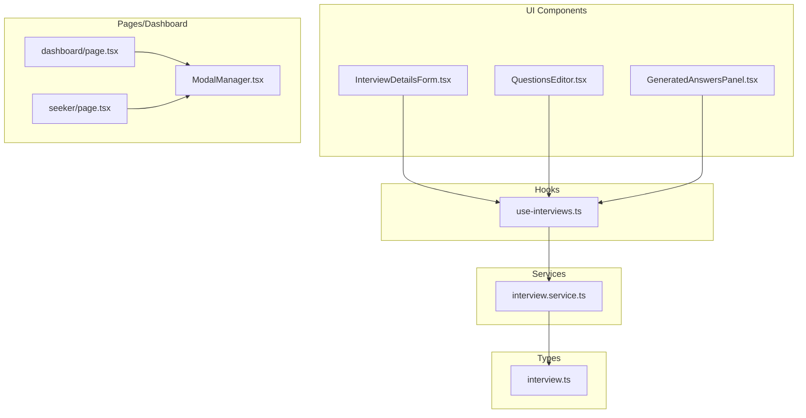
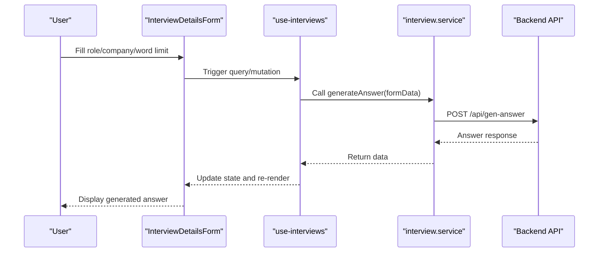
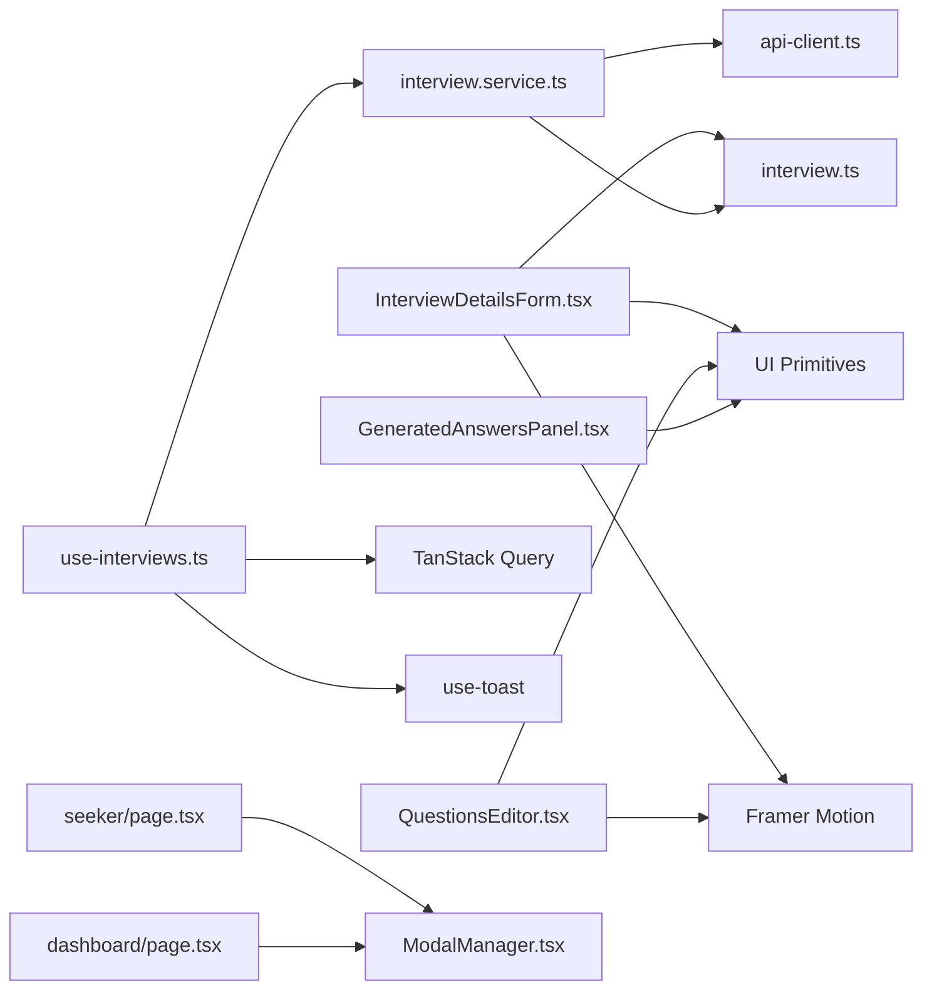

# Frontend Interview Interface

<cite>
**Referenced Files in This Document**
- [InterviewDetailsForm.tsx](file://frontend/components/hiring-assistant/InterviewDetailsForm.tsx)
- [QuestionsEditor.tsx](file://frontend/components/hiring-assistant/QuestionsEditor.tsx)
- [GeneratedAnswersPanel.tsx](file://frontend/components/hiring-assistant/GeneratedAnswersPanel.tsx)
- [use-interviews.ts](file://frontend/hooks/queries/use-interviews.ts)
- [interview.service.ts](file://frontend/services/interview.service.ts)
- [interview.ts](file://frontend/types/interview.ts)
- [page.tsx](file://frontend/app/dashboard/seeker/page.tsx)
- [page.tsx](file://frontend/app/dashboard/page.tsx)
- [ModalManager.tsx](file://frontend/components/dashboard/ModalManager.tsx)
</cite>

## Table of Contents
1. [Introduction](#introduction)
2. [Project Structure](#project-structure)
3. [Core Components](#core-components)
4. [Architecture Overview](#architecture-overview)
5. [Detailed Component Analysis](#detailed-component-analysis)
6. [Dependency Analysis](#dependency-analysis)
7. [Performance Considerations](#performance-considerations)
8. [Troubleshooting Guide](#troubleshooting-guide)
9. [Conclusion](#conclusion)

## Introduction
This document describes the Frontend Interview Interface component built with React and Next.js. It covers the interview setup forms, question management, answer generation, and evaluation result presentation. The interface integrates with backend services using TanStack Query for state management and React hooks for reactive UI updates. Accessibility, responsive design, and cross-browser compatibility are addressed to ensure a robust interview experience across devices.

## Project Structure
The interview interface spans several layers:
- UI components for interview setup and question editing
- Service layer for API communication
- React Query hooks for data fetching and mutations
- Types for interview data models
- Dashboard integration for session listing and deletion

**Diagram sources**
- [InterviewDetailsForm.tsx](file://frontend/components/hiring-assistant/InterviewDetailsForm.tsx#L1-L112)
- [QuestionsEditor.tsx](file://frontend/components/hiring-assistant/QuestionsEditor.tsx#L1-L49)
- [GeneratedAnswersPanel.tsx](file://frontend/components/hiring-assistant/GeneratedAnswersPanel.tsx)
- [use-interviews.ts](file://frontend/hooks/queries/use-interviews.ts#L1-L44)
- [interview.service.ts](file://frontend/services/interview.service.ts#L1-L18)
- [interview.ts](file://frontend/types/interview.ts#L1-L21)
- [page.tsx](file://frontend/app/dashboard/seeker/page.tsx#L1-L197)
- [page.tsx](file://frontend/app/dashboard/page.tsx#L464-L1065)
- [ModalManager.tsx](file://frontend/components/dashboard/ModalManager.tsx#L375-L443)

**Section sources**
- [InterviewDetailsForm.tsx](file://frontend/components/hiring-assistant/InterviewDetailsForm.tsx#L1-L112)
- [QuestionsEditor.tsx](file://frontend/components/hiring-assistant/QuestionsEditor.tsx#L1-L49)
- [use-interviews.ts](file://frontend/hooks/queries/use-interviews.ts#L1-L44)
- [interview.service.ts](file://frontend/services/interview.service.ts#L1-L18)
- [interview.ts](file://frontend/types/interview.ts#L1-L21)
- [page.tsx](file://frontend/app/dashboard/seeker/page.tsx#L1-L197)
- [page.tsx](file://frontend/app/dashboard/page.tsx#L464-L1065)
- [ModalManager.tsx](file://frontend/components/dashboard/ModalManager.tsx#L375-L443)

## Core Components
- InterviewDetailsForm: Collects role, company, word limit, optional company knowledge, and website.
- QuestionsEditor: Manages dynamic lists of interview questions with add/remove and per-question editing.
- GeneratedAnswersPanel: Displays generated answers for submitted questions.
- use-interviews hook: Provides queries and mutations for interview sessions and answer generation.
- interview.service: Encapsulates API endpoints for interviews and answer generation.
- Types: Defines InterviewSession, QuestionAnswer, and InterviewRequest shapes.

Key capabilities:
- Form validation via controlled inputs and numeric constraints
- Real-time updates through React Query invalidations
- Accessible markup with labels and semantic inputs
- Responsive layouts using grid and flex utilities

**Section sources**
- [InterviewDetailsForm.tsx](file://frontend/components/hiring-assistant/InterviewDetailsForm.tsx#L8-L112)
- [QuestionsEditor.tsx](file://frontend/components/hiring-assistant/QuestionsEditor.tsx#L8-L49)
- [GeneratedAnswersPanel.tsx](file://frontend/components/hiring-assistant/GeneratedAnswersPanel.tsx)
- [use-interviews.ts](file://frontend/hooks/queries/use-interviews.ts#L5-L43)
- [interview.service.ts](file://frontend/services/interview.service.ts#L4-L17)
- [interview.ts](file://frontend/types/interview.ts#L1-L21)

## Architecture Overview
The interview interface follows a layered architecture:
- Presentation layer: UI components manage user interactions and render state
- State layer: React hooks and TanStack Query manage data fetching, caching, and mutations
- Service layer: API client abstraction for interview endpoints
- Type layer: Strong typing for interview data structures

**Diagram sources**
- [InterviewDetailsForm.tsx](file://frontend/components/hiring-assistant/InterviewDetailsForm.tsx#L13-L16)
- [use-interviews.ts](file://frontend/hooks/queries/use-interviews.ts#L39-L43)
- [interview.service.ts](file://frontend/services/interview.service.ts#L15-L16)

## Detailed Component Analysis

### InterviewDetailsForm
Purpose:
- Capture essential interview setup details including role, company, word limit, optional company knowledge, and website.

Implementation highlights:
- Controlled inputs bound to props-driven state
- Numeric input with min/max constraints for word limit
- Optional fields clearly marked
- Consistent styling with brand tokens and hover/focus states

Validation and UX:
- Required fields indicated with asterisks
- Real-time feedback via input handlers
- Responsive grid layout for role/company fields

Accessibility:
- Proper labels associated with inputs
- Semantic input types (text, number)
- Focus-visible states for keyboard navigation

Customization:
- Accepts external state handler to integrate with parent forms
- Reusable across different interview flows

**Section sources**
- [InterviewDetailsForm.tsx](file://frontend/components/hiring-assistant/InterviewDetailsForm.tsx#L13-L112)

### QuestionsEditor
Purpose:
- Dynamically manage a list of interview questions with add/remove actions and inline editing.

Implementation highlights:
- Dynamic list rendering with motion animations
- Per-item textarea for question text
- Add/remove controls with icons
- Scrollable content area for long lists

UX patterns:
- Smooth entry animations per item
- Immediate visual feedback on edits
- Clear affordances for adding/removing questions

Accessibility:
- Keyboard navigable list items
- Descriptive button labels with icons
- Focus management during add/remove

**Section sources**
- [QuestionsEditor.tsx](file://frontend/components/hiring-assistant/QuestionsEditor.tsx#L15-L49)

### GeneratedAnswersPanel
Purpose:
- Present generated answers to interview questions, typically after submission to the backend.

Implementation highlights:
- Card-based layout with backdrop blur and borders
- Scrollable content area for long answers
- Integration with answer generation mutation

UX patterns:
- Clean typography hierarchy
- Consistent spacing and padding
- Hover states for interactive elements

Accessibility:
- Readable text sizes and contrast
- Focusable elements for actions
- Semantic heading structure

**Section sources**
- [GeneratedAnswersPanel.tsx](file://frontend/components/hiring-assistant/GeneratedAnswersPanel.tsx)

### use-interviews Hook
Purpose:
- Centralize data fetching and mutations for interview sessions and answer generation.

Key exports:
- useInterviews: Fetches all interview sessions
- useDeleteInterview: Deletes a session with optimistic updates and toast notifications
- useGenerateAnswer: Submits questions and receives generated answers

State management:
- React Query manages caching, background refetching, and invalidations
- Mutation errors surfaced via toast notifications
- Success callbacks refresh dependent queries

**Section sources**
- [use-interviews.ts](file://frontend/hooks/queries/use-interviews.ts#L5-L43)

### interview.service
Purpose:
- Provide typed wrappers around API endpoints for interview operations.

Endpoints:
- GET /api/interviews: Retrieve all sessions
- DELETE /api/interviews?id=: Delete a session
- POST /api/gen-answer: Submit questions and receive answers

Integration:
- Uses apiClient for HTTP requests
- Returns typed responses aligned with InterviewSession and ApiResponse

**Section sources**
- [interview.service.ts](file://frontend/services/interview.service.ts#L4-L17)

### Types
Purpose:
- Define the shape of interview data structures for type safety.

Interfaces:
- QuestionAnswer: Pair of question and answer
- InterviewSession: Complete interview session with metadata and Q&A
- InterviewRequest: Request payload for generating answers

Benefits:
- Compile-time validation of props and API responses
- Improved developer experience with autocompletion

**Section sources**
- [interview.ts](file://frontend/types/interview.ts#L1-L21)

### Dashboard Integration
Purpose:
- Display interview sessions, enable viewing details, and support deletion.

Key areas:
- Seeker dashboard links to hiring assistant and interview features
- Main dashboard shows interview sessions modal with loading and empty states
- Modal manager coordinates session listing, deletion confirmation, and actions

UX patterns:
- Animated modals with backdrop blur
- Loading indicators during data fetch
- Empty state guidance to start practice
- Confirmation dialogs for destructive actions

Accessibility:
- Focus trapping in modals
- Clear headings and descriptions
- Keyboard-accessible close buttons

**Section sources**
- [page.tsx](file://frontend/app/dashboard/seeker/page.tsx#L170-L186)
- [page.tsx](file://frontend/app/dashboard/page.tsx#L464-L1065)
- [ModalManager.tsx](file://frontend/components/dashboard/ModalManager.tsx#L375-L443)

## Dependency Analysis
The interview interface components depend on:
- UI primitives (Button, Card, Input, Label, Loader) for consistent styling
- Framer Motion for smooth animations
- TanStack Query for data management
- Lucide icons for visual cues
- Tailwind classes for responsive layouts

**Diagram sources**
- [InterviewDetailsForm.tsx](file://frontend/components/hiring-assistant/InterviewDetailsForm.tsx#L3-L6)
- [QuestionsEditor.tsx](file://frontend/components/hiring-assistant/QuestionsEditor.tsx#L3-L6)
- [GeneratedAnswersPanel.tsx](file://frontend/components/hiring-assistant/GeneratedAnswersPanel.tsx)
- [use-interviews.ts](file://frontend/hooks/queries/use-interviews.ts#L1-L3)
- [interview.service.ts](file://frontend/services/interview.service.ts#L1)
- [page.tsx](file://frontend/app/dashboard/seeker/page.tsx#L1-L27)
- [page.tsx](file://frontend/app/dashboard/page.tsx#L1-L29)
- [ModalManager.tsx](file://frontend/components/dashboard/ModalManager.tsx#L375-L398)

**Section sources**
- [InterviewDetailsForm.tsx](file://frontend/components/hiring-assistant/InterviewDetailsForm.tsx#L1-L112)
- [QuestionsEditor.tsx](file://frontend/components/hiring-assistant/QuestionsEditor.tsx#L1-L49)
- [use-interviews.ts](file://frontend/hooks/queries/use-interviews.ts#L1-L44)
- [interview.service.ts](file://frontend/services/interview.service.ts#L1-L18)
- [page.tsx](file://frontend/app/dashboard/seeker/page.tsx#L1-L197)
- [page.tsx](file://frontend/app/dashboard/page.tsx#L1-L1065)
- [ModalManager.tsx](file://frontend/components/dashboard/ModalManager.tsx#L375-L443)

## Performance Considerations
- Prefer controlled components to minimize unnecessary re-renders
- Use React Query's background refetching and caching to avoid redundant network calls
- Virtualize long lists in the interview sessions modal for large datasets
- Defer heavy computations until after user input stabilizes
- Optimize animations by limiting expensive transforms and using transform properties

## Troubleshooting Guide
Common issues and resolutions:
- Form submission fails silently: Ensure mutation error handling displays toasts and logs error messages
- Network errors: Verify api-client configuration and endpoint URLs
- State not updating after deletion: Confirm query invalidation for ["interviews"] and ["dashboard"] keys
- Animation glitches: Check motion variants and ensure proper cleanup on unmount

Accessibility checks:
- Verify labels are present for all inputs
- Test keyboard navigation through forms and modals
- Confirm sufficient color contrast for text and interactive elements

Responsive behavior:
- Test grid layouts on small screens; adjust breakpoints as needed
- Ensure modals are usable on mobile with appropriate touch targets
- Validate font sizes and spacing across devices

**Section sources**
- [use-interviews.ts](file://frontend/hooks/queries/use-interviews.ts#L15-L36)
- [interview.service.ts](file://frontend/services/interview.service.ts#L10-L16)
- [ModalManager.tsx](file://frontend/components/dashboard/ModalManager.tsx#L375-L443)

## Conclusion
The Frontend Interview Interface leverages React, TanStack Query, and a clean service-layer architecture to deliver a responsive, accessible, and efficient interview preparation experience. By centralizing state management, enforcing type safety, and providing intuitive UI patterns, the interface supports seamless interaction with backend services while maintaining excellent user experience across devices.