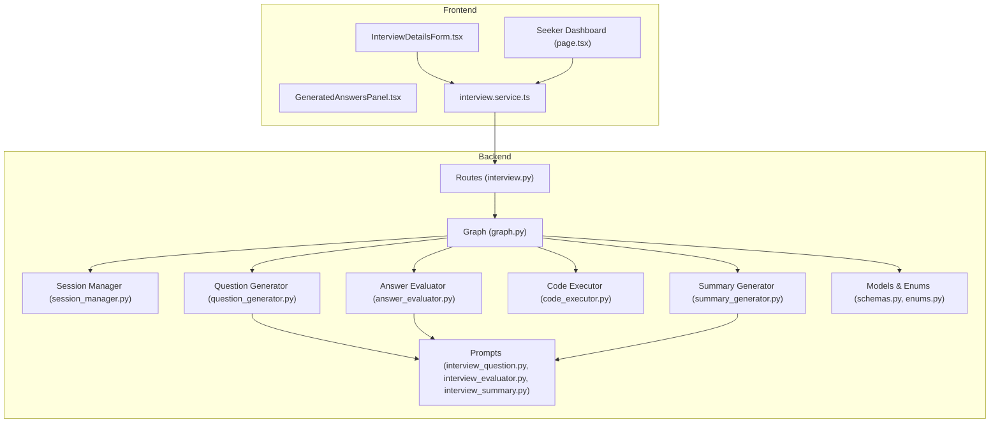
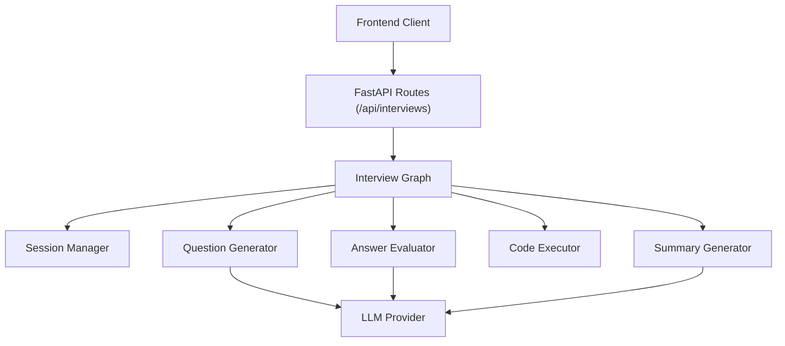
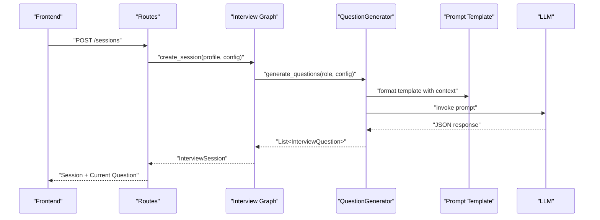
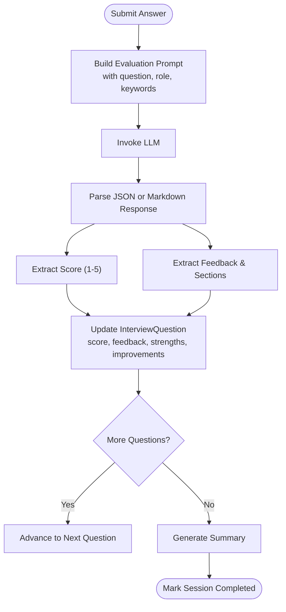
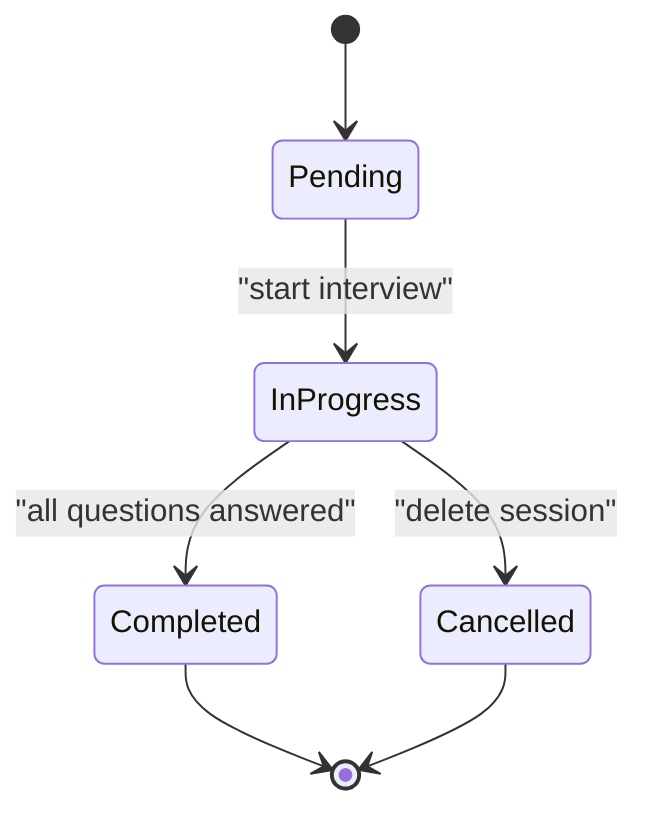
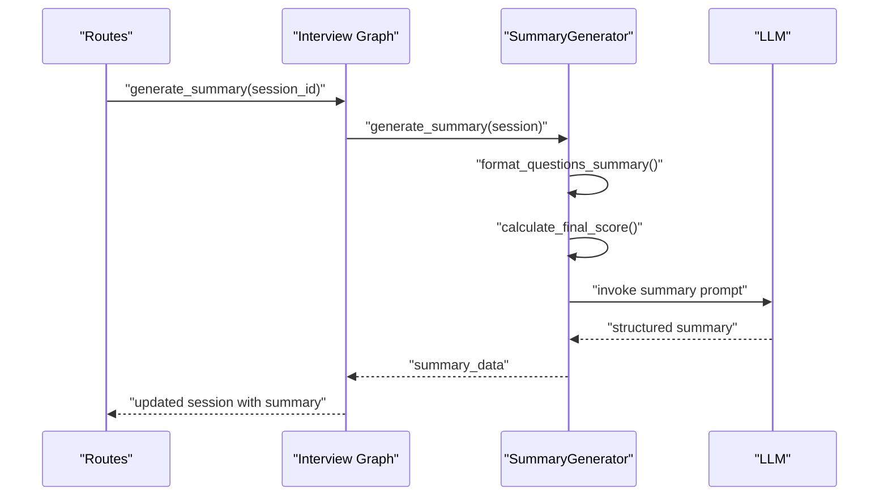
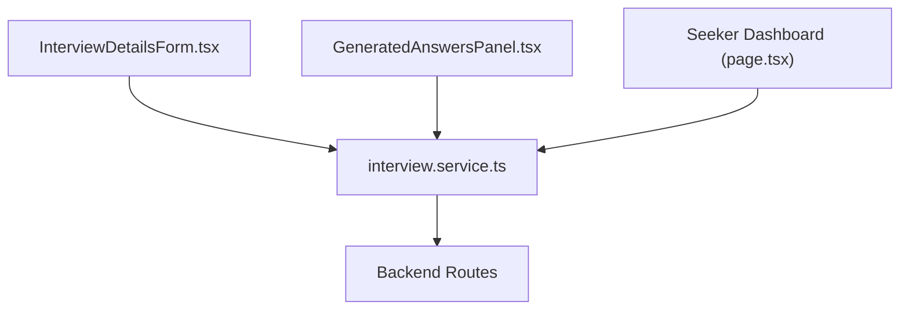
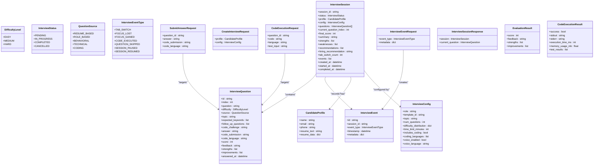
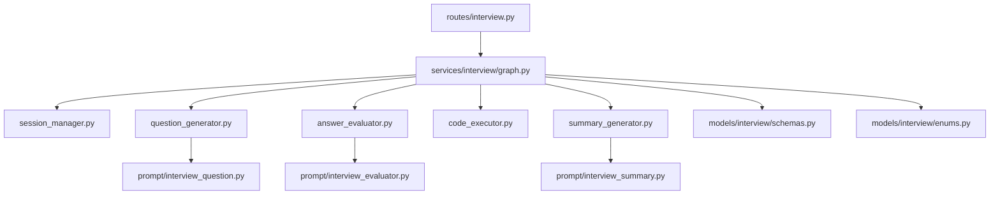
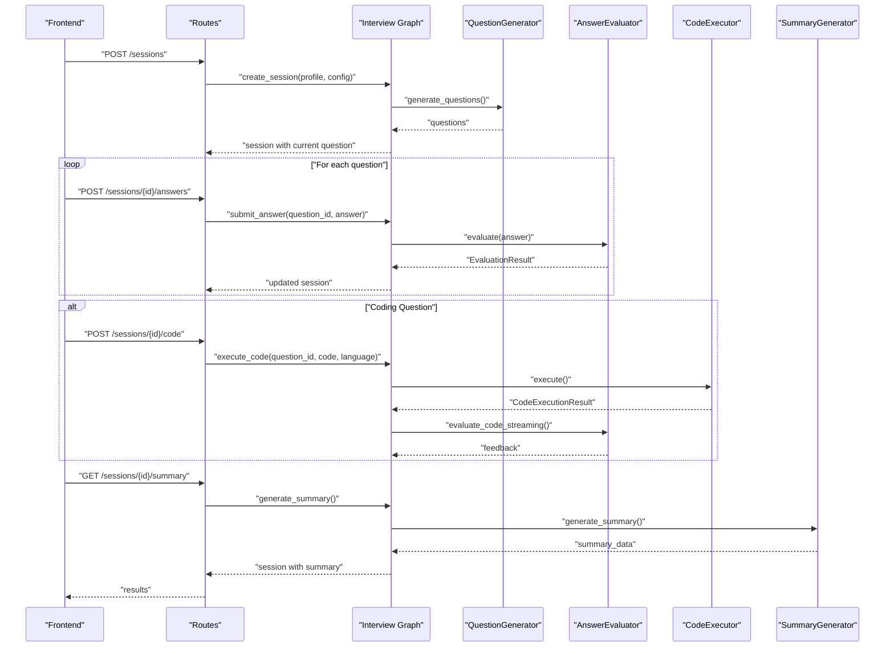

# Interview Preparation System

<cite>
**Referenced Files in This Document**
- [backend/app/data/prompt/interview_question.py](file://backend/app/data/prompt/interview_question.py)
- [backend/app/data/prompt/interview_evaluator.py](file://backend/app/data/prompt/interview_evaluator.py)
- [backend/app/data/prompt/interview_summary.py](file://backend/app/data/prompt/interview_summary.py)
- [backend/app/services/interview/question_generator.py](file://backend/app/services/interview/question_generator.py)
- [backend/app/services/interview/answer_evaluator.py](file://backend/app/services/interview/answer_evaluator.py)
- [backend/app/services/interview/code_executor.py](file://backend/app/services/interview/code_executor.py)
- [backend/app/services/interview/summary_generator.py](file://backend/app/services/interview/summary_generator.py)
- [backend/app/services/interview/session_manager.py](file://backend/app/services/interview/session_manager.py)
- [backend/app/services/interview/graph.py](file://backend/app/services/interview/graph.py)
- [backend/app/routes/interview.py](file://backend/app/routes/interview.py)
- [backend/app/models/interview/schemas.py](file://backend/app/models/interview/schemas.py)
- [backend/app/models/interview/enums.py](file://backend/app/models/interview/enums.py)
- [frontend/components/hiring-assistant/InterviewDetailsForm.tsx](file://frontend/components/hiring-assistant/InterviewDetailsForm.tsx)
- [frontend/components/hiring-assistant/GeneratedAnswersPanel.tsx](file://frontend/components/hiring-assistant/GeneratedAnswersPanel.tsx)
- [frontend/app/dashboard/seeker/page.tsx](file://frontend/app/dashboard/seeker/page.tsx)
- [frontend/services/interview.service.ts](file://frontend/services/interview.service.ts)
</cite>

## Table of Contents
1. [Introduction](#introduction)
2. [Project Structure](#project-structure)
3. [Core Components](#core-components)
4. [Architecture Overview](#architecture-overview)
5. [Detailed Component Analysis](#detailed-component-analysis)
6. [Dependency Analysis](#dependency-analysis)
7. [Performance Considerations](#performance-considerations)
8. [Troubleshooting Guide](#troubleshooting-guide)
9. [Conclusion](#conclusion)
10. [Appendices](#appendices)

## Introduction
The Interview Preparation System provides a complete end-to-end solution for AI-driven interview preparation and evaluation. It generates role- and resume-based questions, evaluates candidate answers (including coding challenges), tracks session events for integrity, and produces comprehensive summaries with hiring recommendations. The backend is built with Python and integrates LangChain prompts with an LLM for intelligent evaluation. The frontend offers intuitive dashboards for session management and answer generation.

## Project Structure
The system is organized into backend and frontend layers:
- Backend: FastAPI routes, interview graph orchestration, services for question generation, evaluation, code execution, and session management, plus Pydantic models and enums.
- Frontend: Next.js app with TypeScript/React components for interview setup, answer display, and dashboard views.

**Diagram sources**
- [backend/app/routes/interview.py](file://backend/app/routes/interview.py#L83-L493)
- [backend/app/services/interview/graph.py](file://backend/app/services/interview/graph.py#L34-L67)
- [backend/app/services/interview/session_manager.py](file://backend/app/services/interview/session_manager.py#L15-L52)
- [backend/app/services/interview/question_generator.py](file://backend/app/services/interview/question_generator.py#L34-L196)
- [backend/app/services/interview/answer_evaluator.py](file://backend/app/services/interview/answer_evaluator.py#L22-L227)
- [backend/app/services/interview/code_executor.py](file://backend/app/services/interview/code_executor.py#L11-L278)
- [backend/app/services/interview/summary_generator.py](file://backend/app/services/interview/summary_generator.py#L42-L151)
- [backend/app/data/prompt/interview_question.py](file://backend/app/data/prompt/interview_question.py#L33-L59)
- [backend/app/data/prompt/interview_evaluator.py](file://backend/app/data/prompt/interview_evaluator.py#L23-L96)
- [backend/app/data/prompt/interview_summary.py](file://backend/app/data/prompt/interview_summary.py#L28-L72)
- [backend/app/models/interview/schemas.py](file://backend/app/models/interview/schemas.py#L22-L169)
- [backend/app/models/interview/enums.py](file://backend/app/models/interview/enums.py#L6-L43)
- [frontend/components/hiring-assistant/InterviewDetailsForm.tsx](file://frontend/components/hiring-assistant/InterviewDetailsForm.tsx#L1-L112)
- [frontend/components/hiring-assistant/GeneratedAnswersPanel.tsx](file://frontend/components/hiring-assistant/GeneratedAnswersPanel.tsx#L1-L107)
- [frontend/app/dashboard/seeker/page.tsx](file://frontend/app/dashboard/seeker/page.tsx#L1-L197)
- [frontend/services/interview.service.ts](file://frontend/services/interview.service.ts#L1-L18)

**Section sources**
- [backend/app/routes/interview.py](file://backend/app/routes/interview.py#L83-L493)
- [backend/app/services/interview/graph.py](file://backend/app/services/interview/graph.py#L34-L67)
- [backend/app/services/interview/session_manager.py](file://backend/app/services/interview/session_manager.py#L15-L52)
- [backend/app/services/interview/question_generator.py](file://backend/app/services/interview/question_generator.py#L34-L196)
- [backend/app/services/interview/answer_evaluator.py](file://backend/app/services/interview/answer_evaluator.py#L22-L227)
- [backend/app/services/interview/code_executor.py](file://backend/app/services/interview/code_executor.py#L11-L278)
- [backend/app/services/interview/summary_generator.py](file://backend/app/services/interview/summary_generator.py#L42-L151)
- [backend/app/data/prompt/interview_question.py](file://backend/app/data/prompt/interview_question.py#L33-L59)
- [backend/app/data/prompt/interview_evaluator.py](file://backend/app/data/prompt/interview_evaluator.py#L23-L96)
- [backend/app/data/prompt/interview_summary.py](file://backend/app/data/prompt/interview_summary.py#L28-L72)
- [backend/app/models/interview/schemas.py](file://backend/app/models/interview/schemas.py#L22-L169)
- [backend/app/models/interview/enums.py](file://backend/app/models/interview/enums.py#L6-L43)
- [frontend/components/hiring-assistant/InterviewDetailsForm.tsx](file://frontend/components/hiring-assistant/InterviewDetailsForm.tsx#L1-L112)
- [frontend/components/hiring-assistant/GeneratedAnswersPanel.tsx](file://frontend/components/hiring-assistant/GeneratedAnswersPanel.tsx#L1-L107)
- [frontend/app/dashboard/seeker/page.tsx](file://frontend/app/dashboard/seeker/page.tsx#L1-L197)
- [frontend/services/interview.service.ts](file://frontend/services/interview.service.ts#L1-L18)

## Core Components
- Interview Graph orchestrates session lifecycle, question generation, evaluation, code execution, and summary creation.
- Question Generator builds question lists from difficulty distributions and avoids repetition using existing questions context.
- Answer Evaluator scores textual answers and streams feedback; also supports code review streaming.
- Code Executor runs candidate code submissions in a sandbox with security checks and timeout enforcement.
- Session Manager maintains in-memory sessions and events; can be extended to persistent storage.
- Summary Generator aggregates scores and events to produce a structured interview summary.
- Routes expose REST endpoints for CRUD operations, event recording, and health checks.

**Section sources**
- [backend/app/services/interview/graph.py](file://backend/app/services/interview/graph.py#L34-L67)
- [backend/app/services/interview/question_generator.py](file://backend/app/services/interview/question_generator.py#L34-L196)
- [backend/app/services/interview/answer_evaluator.py](file://backend/app/services/interview/answer_evaluator.py#L22-L227)
- [backend/app/services/interview/code_executor.py](file://backend/app/services/interview/code_executor.py#L11-L278)
- [backend/app/services/interview/session_manager.py](file://backend/app/services/interview/session_manager.py#L15-L52)
- [backend/app/services/interview/summary_generator.py](file://backend/app/services/interview/summary_generator.py#L42-L151)
- [backend/app/routes/interview.py](file://backend/app/routes/interview.py#L83-L493)

## Architecture Overview
The system follows a layered architecture:
- Presentation Layer: Next.js frontend components and API clients.
- Application Layer: FastAPI routes delegate to the Interview Graph.
- Domain Services: Question generation, evaluation, code execution, and summary generation.
- Data Layer: In-memory session/event storage; models define interview data structures.

**Diagram sources**
- [backend/app/routes/interview.py](file://backend/app/routes/interview.py#L83-L493)
- [backend/app/services/interview/graph.py](file://backend/app/services/interview/graph.py#L34-L67)
- [backend/app/services/interview/question_generator.py](file://backend/app/services/interview/question_generator.py#L34-L196)
- [backend/app/services/interview/answer_evaluator.py](file://backend/app/services/interview/answer_evaluator.py#L22-L227)
- [backend/app/services/interview/summary_generator.py](file://backend/app/services/interview/summary_generator.py#L42-L151)

## Detailed Component Analysis

### Question Generation Logic
The generator creates questions tailored to role, difficulty distribution, topic, and candidate background while avoiding duplicates. It constructs a prompt with existing questions and optional resume data, invokes the LLM, and parses the response into structured question objects.

**Diagram sources**
- [backend/app/services/interview/graph.py](file://backend/app/services/interview/graph.py#L49-L67)
- [backend/app/services/interview/question_generator.py](file://backend/app/services/interview/question_generator.py#L34-L196)
- [backend/app/data/prompt/interview_question.py](file://backend/app/data/prompt/interview_question.py#L33-L59)

**Section sources**
- [backend/app/services/interview/question_generator.py](file://backend/app/services/interview/question_generator.py#L34-L196)
- [backend/app/data/prompt/interview_question.py](file://backend/app/data/prompt/interview_question.py#L33-L59)

### Answer Evaluation Criteria
The evaluator assesses answers using a standardized rubric (1–5) and provides structured feedback, strengths, and improvement areas. It supports streaming evaluation and can also review code submissions with execution results.

**Diagram sources**
- [backend/app/services/interview/answer_evaluator.py](file://backend/app/services/interview/answer_evaluator.py#L31-L110)
- [backend/app/data/prompt/interview_evaluator.py](file://backend/app/data/prompt/interview_evaluator.py#L23-L96)

**Section sources**
- [backend/app/services/interview/answer_evaluator.py](file://backend/app/services/interview/answer_evaluator.py#L31-L110)
- [backend/app/data/prompt/interview_evaluator.py](file://backend/app/data/prompt/interview_evaluator.py#L23-L96)

### Session Management and Progress Tracking
Sessions are created with status transitions and tracked with events (e.g., tab switches). The manager stores sessions and events in memory and exposes save/get/delete operations.

**Diagram sources**
- [backend/app/models/interview/enums.py](file://backend/app/models/interview/enums.py#L14-L21)
- [backend/app/services/interview/session_manager.py](file://backend/app/services/interview/session_manager.py#L15-L52)

**Section sources**
- [backend/app/services/interview/session_manager.py](file://backend/app/services/interview/session_manager.py#L15-L52)
- [backend/app/models/interview/enums.py](file://backend/app/models/interview/enums.py#L14-L21)

### Interview Analytics and Feedback Generation
The summary generator computes a final score percentage, formats questions and events, and asks the LLM to produce a narrative summary with strengths, weaknesses, recommendations, and hiring recommendation.

**Diagram sources**
- [backend/app/services/interview/summary_generator.py](file://backend/app/services/interview/summary_generator.py#L42-L151)
- [backend/app/data/prompt/interview_summary.py](file://backend/app/data/prompt/interview_summary.py#L28-L72)
- [backend/app/services/interview/graph.py](file://backend/app/services/interview/graph.py#L373-L405)

**Section sources**
- [backend/app/services/interview/summary_generator.py](file://backend/app/services/interview/summary_generator.py#L42-L151)
- [backend/app/data/prompt/interview_summary.py](file://backend/app/data/prompt/interview_summary.py#L28-L72)
- [backend/app/services/interview/graph.py](file://backend/app/services/interview/graph.py#L373-L405)

### Frontend Components for Interview Workflow
- InterviewDetailsForm: Collects role, company, word limit, and optional company knowledge/URL for personalized preparation.
- GeneratedAnswersPanel: Renders generated answers with copy/download actions.
- Seeker Dashboard: Provides navigation and quick links to interview preparation tools.
- interview.service: API client for fetching and deleting interviews.

**Diagram sources**
- [frontend/components/hiring-assistant/InterviewDetailsForm.tsx](file://frontend/components/hiring-assistant/InterviewDetailsForm.tsx#L1-L112)
- [frontend/components/hiring-assistant/GeneratedAnswersPanel.tsx](file://frontend/components/hiring-assistant/GeneratedAnswersPanel.tsx#L1-L107)
- [frontend/app/dashboard/seeker/page.tsx](file://frontend/app/dashboard/seeker/page.tsx#L1-L197)
- [frontend/services/interview.service.ts](file://frontend/services/interview.service.ts#L1-L18)

**Section sources**
- [frontend/components/hiring-assistant/InterviewDetailsForm.tsx](file://frontend/components/hiring-assistant/InterviewDetailsForm.tsx#L1-L112)
- [frontend/components/hiring-assistant/GeneratedAnswersPanel.tsx](file://frontend/components/hiring-assistant/GeneratedAnswersPanel.tsx#L1-L107)
- [frontend/app/dashboard/seeker/page.tsx](file://frontend/app/dashboard/seeker/page.tsx#L1-L197)
- [frontend/services/interview.service.ts](file://frontend/services/interview.service.ts#L1-L18)

### Data Models
Core models define the interview data structures and enumerations used across the system.

**Diagram sources**
- [backend/app/models/interview/schemas.py](file://backend/app/models/interview/schemas.py#L22-L169)
- [backend/app/models/interview/enums.py](file://backend/app/models/interview/enums.py#L6-L43)

**Section sources**
- [backend/app/models/interview/schemas.py](file://backend/app/models/interview/schemas.py#L22-L169)
- [backend/app/models/interview/enums.py](file://backend/app/models/interview/enums.py#L6-L43)

## Dependency Analysis
The backend components depend on LangChain prompts and an LLM provider for evaluation and question generation. The Interview Graph composes services and manages session state. Routes expose REST endpoints for frontend consumption.

**Diagram sources**
- [backend/app/routes/interview.py](file://backend/app/routes/interview.py#L83-L493)
- [backend/app/services/interview/graph.py](file://backend/app/services/interview/graph.py#L34-L67)
- [backend/app/services/interview/session_manager.py](file://backend/app/services/interview/session_manager.py#L15-L52)
- [backend/app/services/interview/question_generator.py](file://backend/app/services/interview/question_generator.py#L34-L196)
- [backend/app/services/interview/answer_evaluator.py](file://backend/app/services/interview/answer_evaluator.py#L22-L227)
- [backend/app/services/interview/code_executor.py](file://backend/app/services/interview/code_executor.py#L11-L278)
- [backend/app/services/interview/summary_generator.py](file://backend/app/services/interview/summary_generator.py#L42-L151)
- [backend/app/data/prompt/interview_question.py](file://backend/app/data/prompt/interview_question.py#L33-L59)
- [backend/app/data/prompt/interview_evaluator.py](file://backend/app/data/prompt/interview_evaluator.py#L23-L96)
- [backend/app/data/prompt/interview_summary.py](file://backend/app/data/prompt/interview_summary.py#L28-L72)
- [backend/app/models/interview/schemas.py](file://backend/app/models/interview/schemas.py#L22-L169)
- [backend/app/models/interview/enums.py](file://backend/app/models/interview/enums.py#L6-L43)

**Section sources**
- [backend/app/routes/interview.py](file://backend/app/routes/interview.py#L83-L493)
- [backend/app/services/interview/graph.py](file://backend/app/services/interview/graph.py#L34-L67)
- [backend/app/services/interview/session_manager.py](file://backend/app/services/interview/session_manager.py#L15-L52)
- [backend/app/services/interview/question_generator.py](file://backend/app/services/interview/question_generator.py#L34-L196)
- [backend/app/services/interview/answer_evaluator.py](file://backend/app/services/interview/answer_evaluator.py#L22-L227)
- [backend/app/services/interview/code_executor.py](file://backend/app/services/interview/code_executor.py#L11-L278)
- [backend/app/services/interview/summary_generator.py](file://backend/app/services/interview/summary_generator.py#L42-L151)
- [backend/app/data/prompt/interview_question.py](file://backend/app/data/prompt/interview_question.py#L33-L59)
- [backend/app/data/prompt/interview_evaluator.py](file://backend/app/data/prompt/interview_evaluator.py#L23-L96)
- [backend/app/data/prompt/interview_summary.py](file://backend/app/data/prompt/interview_summary.py#L28-L72)
- [backend/app/models/interview/schemas.py](file://backend/app/models/interview/schemas.py#L22-L169)
- [backend/app/models/interview/enums.py](file://backend/app/models/interview/enums.py#L6-L43)

## Performance Considerations
- Streaming Responses: Use streaming evaluation and summary generation to reduce latency and improve perceived responsiveness.
- Prompt Efficiency: Keep prompts concise and avoid excessive context to minimize token usage and latency.
- Sandboxed Execution: Enforce timeouts and output limits for code execution to prevent resource exhaustion.
- Caching: Cache repeated prompts or frequently accessed templates to reduce LLM calls.
- Event Aggregation: Batch and summarize events to keep session payloads manageable.

[No sources needed since this section provides general guidance]

## Troubleshooting Guide
Common issues and resolutions:
- Evaluation Service Unavailable: The evaluator returns a default score and feedback when the LLM is not configured.
- Parsing Errors: The evaluator extracts structured data from JSON or Markdown fallbacks; verify prompt outputs conform to expected formats.
- Code Execution Failures: Security checks and timeouts guard against malicious or long-running code; inspect stderr for failure reasons.
- Session Not Found: Routes raise 404 when sessions do not exist; ensure correct IDs are used.
- Event Recording: Tab switches and other events are counted; monitor counts to flag potential integrity issues.

**Section sources**
- [backend/app/services/interview/answer_evaluator.py](file://backend/app/services/interview/answer_evaluator.py#L31-L110)
- [backend/app/services/interview/code_executor.py](file://backend/app/services/interview/code_executor.py#L154-L215)
- [backend/app/routes/interview.py](file://backend/app/routes/interview.py#L94-L107)
- [backend/app/routes/interview.py](file://backend/app/routes/interview.py#L440-L450)

## Conclusion
The Interview Preparation System integrates AI-driven question generation, robust answer evaluation, secure code execution, and comprehensive analytics to deliver a seamless interview preparation experience. Its modular architecture enables extensibility, while the frontend provides intuitive controls for session management and result visualization.

[No sources needed since this section summarizes without analyzing specific files]

## Appendices

### Implementation Example: Full Interview Workflow
- Setup: The frontend collects role, company, and preferences; the backend creates a session and generates the first question.
- Practice: The candidate answers questions; the backend evaluates responses and updates the session.
- Coding: For coding questions, the backend executes code securely and reviews results.
- Completion: After answering all questions, the backend generates a summary and marks the session completed.
- Review: The frontend displays session history and results.

**Diagram sources**
- [backend/app/routes/interview.py](file://backend/app/routes/interview.py#L83-L493)
- [backend/app/services/interview/graph.py](file://backend/app/services/interview/graph.py#L34-L67)
- [backend/app/services/interview/question_generator.py](file://backend/app/services/interview/question_generator.py#L34-L196)
- [backend/app/services/interview/answer_evaluator.py](file://backend/app/services/interview/answer_evaluator.py#L31-L110)
- [backend/app/services/interview/code_executor.py](file://backend/app/services/interview/code_executor.py#L35-L152)
- [backend/app/services/interview/summary_generator.py](file://backend/app/services/interview/summary_generator.py#L42-L151)