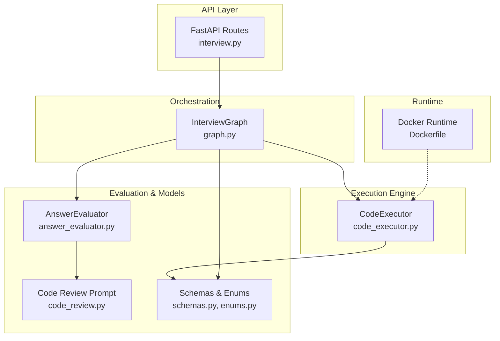
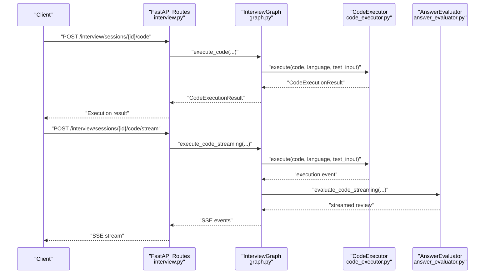
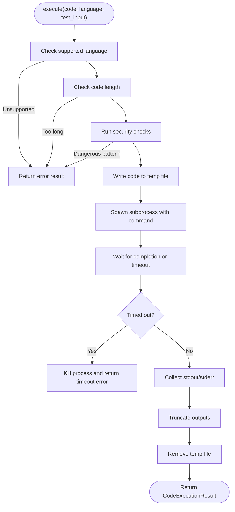
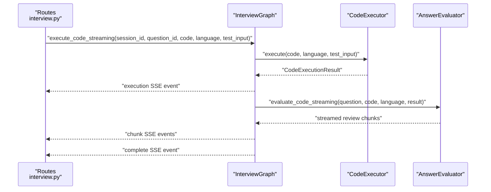
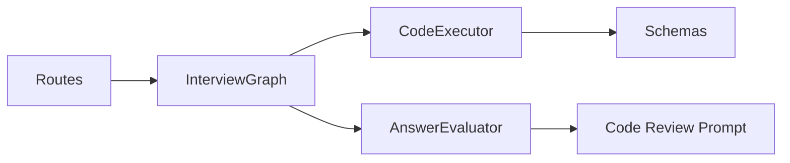

# Live Code Execution

<cite>
**Referenced Files in This Document**
- [code_executor.py](file://backend/app/services/interview/code_executor.py)
- [schemas.py](file://backend/app/models/interview/schemas.py)
- [enums.py](file://backend/app/models/interview/enums.py)
- [graph.py](file://backend/app/services/interview/graph.py)
- [answer_evaluator.py](file://backend/app/services/interview/answer_evaluator.py)
- [interview.py](file://backend/app/routes/interview.py)
- [settings.py](file://backend/app/core/settings.py)
- [Dockerfile](file://backend/Dockerfile)
- [code_review.py](file://backend/app/data/prompt/code_review.py)
</cite>

## Table of Contents
1. [Introduction](#introduction)
2. [Project Structure](#project-structure)
3. [Core Components](#core-components)
4. [Architecture Overview](#architecture-overview)
5. [Detailed Component Analysis](#detailed-component-analysis)
6. [Dependency Analysis](#dependency-analysis)
7. [Performance Considerations](#performance-considerations)
8. [Troubleshooting Guide](#troubleshooting-guide)
9. [Conclusion](#conclusion)

## Introduction
This document describes the Live Code Execution component used in technical interview challenges. It explains how code submissions are securely executed, validated, and evaluated within a sandboxed environment. The system supports Python, JavaScript, and TypeScript with strict timeouts, output limits, and security checks. It integrates with language-specific interpreters and compilers, captures stdout/stderr, and provides both single-run and multi-test execution modes. The component is exposed via FastAPI routes with optional streaming responses for real-time feedback.

## Project Structure
The Live Code Execution feature spans several modules:
- Execution engine: CodeExecutor service
- Orchestration: InterviewGraph that coordinates sessions, questions, and evaluations
- API surface: FastAPI routes for synchronous and streaming code execution
- Data models: Pydantic schemas for requests, responses, and execution results
- Security and evaluation: AnswerEvaluator and prompt templates for code review
- Configuration: Environment and settings for timeouts and limits

**Diagram sources**
- [interview.py](file://backend/app/routes/interview.py#L227-L305)
- [graph.py](file://backend/app/services/interview/graph.py#L23-L48)
- [code_executor.py](file://backend/app/services/interview/code_executor.py#L11-L34)
- [answer_evaluator.py](file://backend/app/services/interview/answer_evaluator.py#L22-L30)
- [code_review.py](file://backend/app/data/prompt/code_review.py#L1-L38)
- [schemas.py](file://backend/app/models/interview/schemas.py#L160-L169)
- [enums.py](file://backend/app/models/interview/enums.py#L6-L43)
- [Dockerfile](file://backend/Dockerfile#L1-L33)

**Section sources**
- [interview.py](file://backend/app/routes/interview.py#L227-L305)
- [graph.py](file://backend/app/services/interview/graph.py#L23-L48)
- [code_executor.py](file://backend/app/services/interview/code_executor.py#L11-L34)
- [answer_evaluator.py](file://backend/app/services/interview/answer_evaluator.py#L22-L30)
- [code_review.py](file://backend/app/data/prompt/code_review.py#L1-L38)
- [schemas.py](file://backend/app/models/interview/schemas.py#L160-L169)
- [enums.py](file://backend/app/models/interview/enums.py#L6-L43)
- [Dockerfile](file://backend/Dockerfile#L1-L33)

## Core Components
- CodeExecutor: Implements sandboxed execution with language-specific commands, timeouts, output limits, and security checks.
- InterviewGraph: Orchestrates execution within interview sessions, persists submissions, and integrates evaluation.
- AnswerEvaluator: Provides code review via LLM prompts and streaming responses.
- Schemas: Defines request/response models and execution result structure.
- Routes: Exposes endpoints for synchronous and streaming code execution and language discovery.

Key capabilities:
- Supported languages: Python, JavaScript, TypeScript
- Resource limits: Timeouts per language, output length caps, code length caps
- Security: Pattern-based safety checks, optional input allowance for Python
- Test execution: Single-run and multi-case execution with aggregated results
- Streaming: SSE-based streaming for execution results and code review

**Section sources**
- [code_executor.py](file://backend/app/services/interview/code_executor.py#L14-L34)
- [graph.py](file://backend/app/services/interview/graph.py#L243-L371)
- [answer_evaluator.py](file://backend/app/services/interview/answer_evaluator.py#L111-L144)
- [schemas.py](file://backend/app/models/interview/schemas.py#L160-L169)
- [interview.py](file://backend/app/routes/interview.py#L227-L305)

## Architecture Overview
The system executes code in a subprocess per language configuration, captures outputs, enforces timeouts, and optionally streams evaluation results.

**Diagram sources**
- [interview.py](file://backend/app/routes/interview.py#L257-L295)
- [graph.py](file://backend/app/services/interview/graph.py#L243-L371)
- [code_executor.py](file://backend/app/services/interview/code_executor.py#L35-L152)
- [answer_evaluator.py](file://backend/app/services/interview/answer_evaluator.py#L111-L144)

## Detailed Component Analysis

### CodeExecutor
Responsibilities:
- Validate language support and code length
- Perform security checks against dangerous patterns
- Write code to a temporary file and execute via subprocess
- Enforce per-language timeouts and capture stdout/stderr
- Truncate outputs and return structured results
- Support multi-test execution with aggregated outcomes

Security model:
- Pattern-based detection for each language
- Optional allowance for input() in Python when test_input is provided
- Temporary file cleanup

Resource controls:
- Per-language timeout values
- Output truncation at configured length
- Code length cap

Execution flow:
- Validate inputs
- Write code to temp file
- Spawn subprocess with configured command
- Await completion or timeout
- Decode outputs and assemble result
- Clean up temp file

**Diagram sources**
- [code_executor.py](file://backend/app/services/interview/code_executor.py#L35-L152)

**Section sources**
- [code_executor.py](file://backend/app/services/interview/code_executor.py#L11-L34)
- [code_executor.py](file://backend/app/services/interview/code_executor.py#L35-L152)
- [code_executor.py](file://backend/app/services/interview/code_executor.py#L154-L215)
- [code_executor.py](file://backend/app/services/interview/code_executor.py#L221-L277)

### InterviewGraph Integration
- Validates session and question context
- Persists code submissions and language metadata
- Coordinates execution and evaluation
- Streams execution result followed by code review

**Diagram sources**
- [graph.py](file://backend/app/services/interview/graph.py#L287-L371)
- [answer_evaluator.py](file://backend/app/services/interview/answer_evaluator.py#L111-L144)

**Section sources**
- [graph.py](file://backend/app/services/interview/graph.py#L243-L371)
- [answer_evaluator.py](file://backend/app/services/interview/answer_evaluator.py#L111-L144)

### API Endpoints and Streaming
Endpoints:
- Synchronous execution: POST /interview/sessions/{session_id}/code
- Streaming execution: POST /interview/sessions/{session_id}/code/stream
- Supported languages: GET /interview/code/languages

Streaming protocol:
- Events: execution, chunk, complete, error
- Headers: Cache-Control, Connection, X-Accel-Buffering for NGINX compatibility

**Section sources**
- [interview.py](file://backend/app/routes/interview.py#L227-L305)
- [interview.py](file://backend/app/routes/interview.py#L257-L295)

### Data Models and Evaluation
- CodeExecutionResult: success flag, stdout, stderr, execution_time_ms, optional memory_usage_mb, optional test_results
- CodeExecutionRequest: question_id, code, language, test_input
- Code review prompt includes question, language, code, execution results, and timing

**Section sources**
- [schemas.py](file://backend/app/models/interview/schemas.py#L160-L169)
- [schemas.py](file://backend/app/models/interview/schemas.py#L125-L132)
- [code_review.py](file://backend/app/data/prompt/code_review.py#L17-L38)

## Dependency Analysis
- CodeExecutor depends on:
  - Schemas for result modeling
  - Language-specific commands and timeouts
- InterviewGraph depends on:
  - SessionManager for persistence
  - CodeExecutor for execution
  - AnswerEvaluator for review
- Routes depend on InterviewGraph for orchestration
- AnswerEvaluator depends on LLM provider and prompt templates

**Diagram sources**
- [code_executor.py](file://backend/app/services/interview/code_executor.py#L8)
- [graph.py](file://backend/app/services/interview/graph.py#L16-L19)
- [answer_evaluator.py](file://backend/app/services/interview/answer_evaluator.py#L10-L14)
- [interview.py](file://backend/app/routes/interview.py#L20-L21)

**Section sources**
- [code_executor.py](file://backend/app/services/interview/code_executor.py#L8)
- [graph.py](file://backend/app/services/interview/graph.py#L16-L19)
- [answer_evaluator.py](file://backend/app/services/interview/answer_evaluator.py#L10-L14)
- [interview.py](file://backend/app/routes/interview.py#L20-L21)

## Performance Considerations
- Timeouts: Configured per language to prevent runaway processes
- Output limits: Prevent excessive memory usage and response sizes
- Code length caps: Control parsing and execution overhead
- Streaming: Reduces perceived latency by emitting execution results early
- Containerization: Python slim image with uv for optimized installs

Recommendations:
- Tune language-specific timeouts based on workload characteristics
- Monitor execution_time_ms and adjust caps if needed
- Consider adding memory enforcement at the container level for stronger isolation
- Cache frequently used dependencies to reduce cold-start costs

**Section sources**
- [code_executor.py](file://backend/app/services/interview/code_executor.py#L14-L34)
- [settings.py](file://backend/app/core/settings.py#L40-L44)
- [Dockerfile](file://backend/Dockerfile#L1-L33)

## Troubleshooting Guide
Common issues and resolutions:
- Unsupported language: Ensure language is one of the supported set
- Code too long: Reduce code length below the configured cap
- Security violation: Remove or refactor dangerous patterns flagged by the security checker
- Timeout exceeded: Simplify logic or increase timeout cautiously
- Execution error: Inspect stderr for interpreter/compiler errors
- Streaming not received: Verify SSE headers and client-side event handling

Operational checks:
- Confirm language availability via GET /interview/code/languages
- Validate session and question context before execution
- Review execution_time_ms and compare with timeout settings

**Section sources**
- [code_executor.py](file://backend/app/services/interview/code_executor.py#L51-L79)
- [code_executor.py](file://backend/app/services/interview/code_executor.py#L107-L123)
- [interview.py](file://backend/app/routes/interview.py#L298-L304)

## Conclusion
The Live Code Execution component provides a secure, configurable, and integrated solution for technical interview coding challenges. It leverages subprocess-based sandboxing, strict resource controls, and robust security checks while offering flexible execution modes and real-time streaming feedback. The design cleanly separates concerns across execution, orchestration, evaluation, and API layers, enabling maintainability and extensibility.