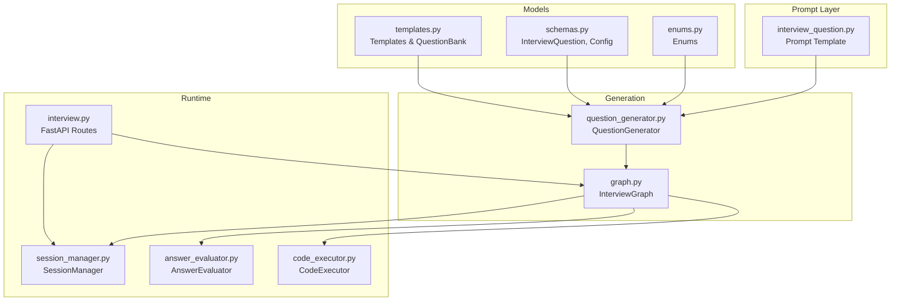
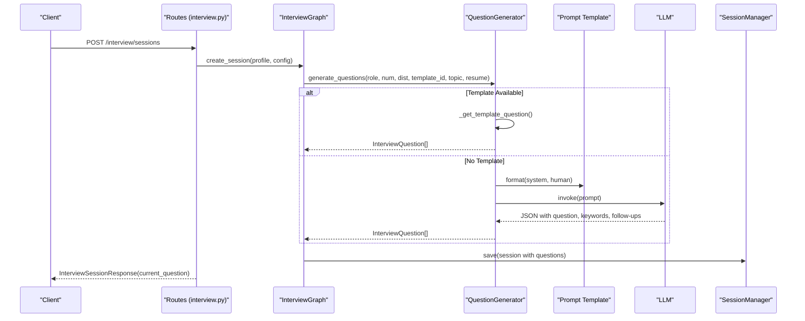
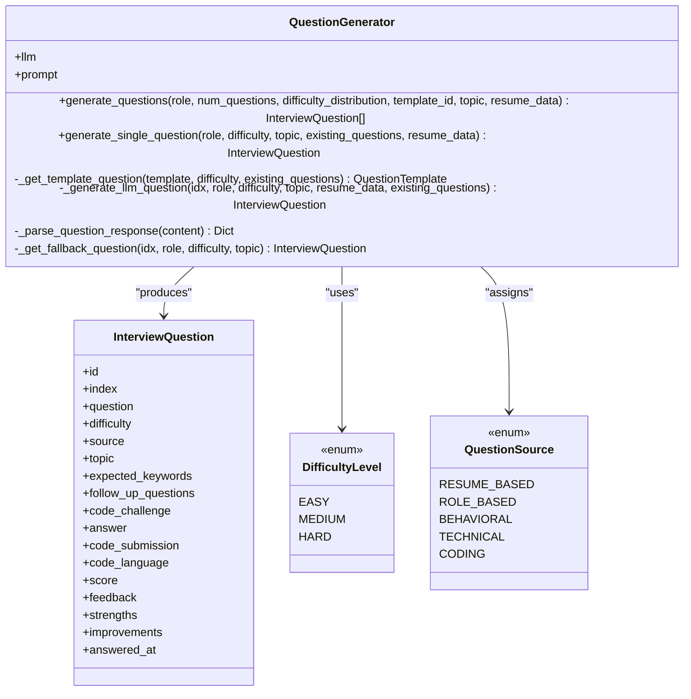
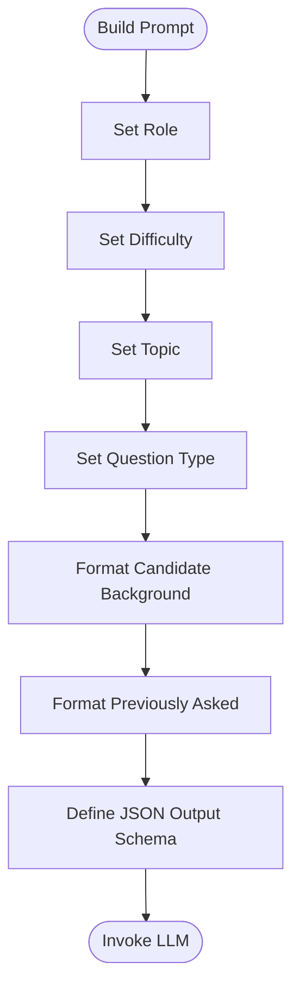
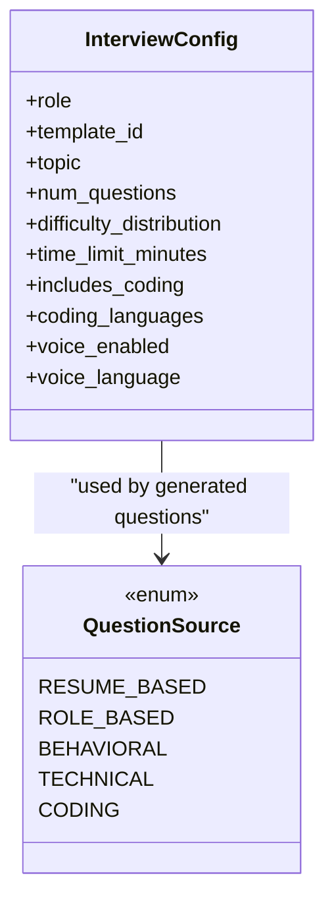
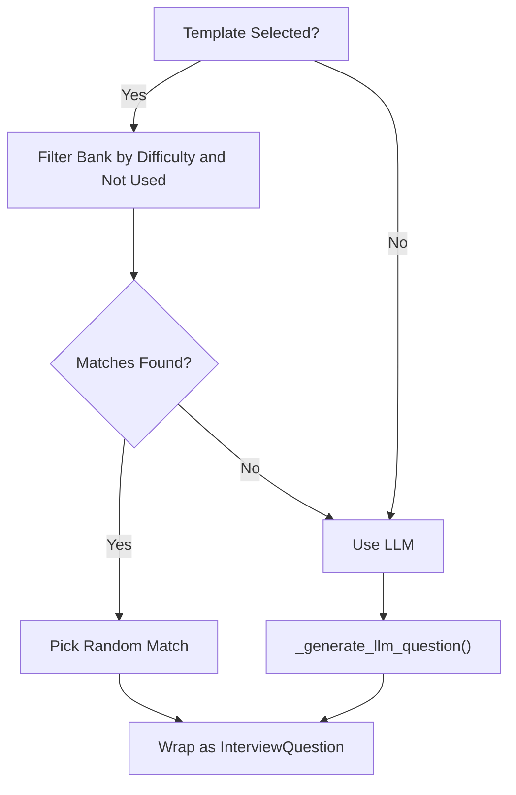
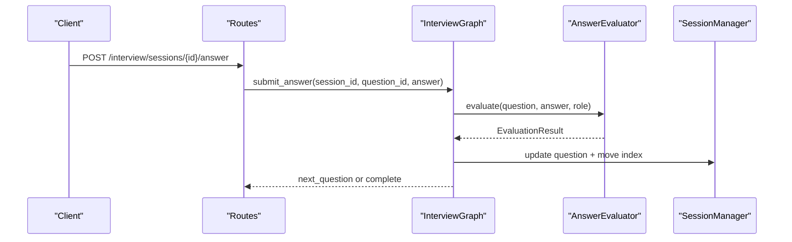
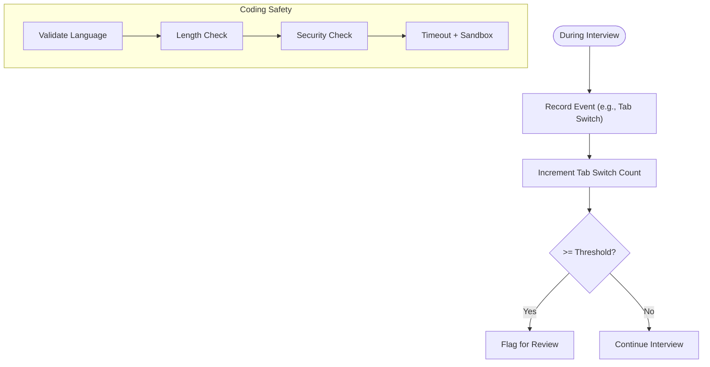
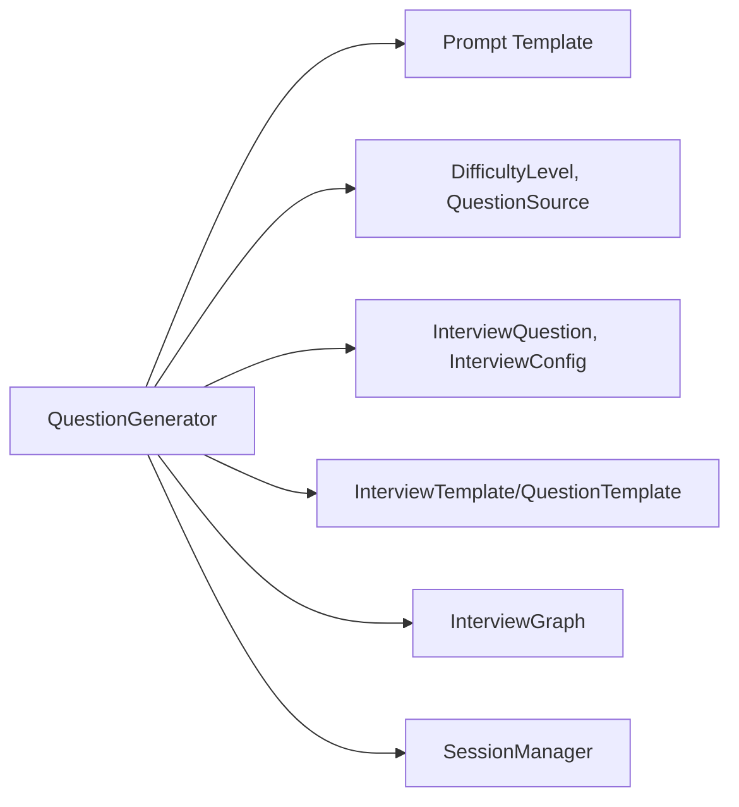

# Question generation engine

## Introduction
The Question Generation Engine is an AI-powered system that generates interview questions tailored to a candidate's profile, the target role, and the interview format. It combines a configurable difficulty distribution, optional role-based templates, and LLM prompts to produce diverse, non-repeating questions. The engine supports both technical and behavioral assessments, integrates with coding challenges, and adapts question selection dynamically across interview stages. Anti-cheating safeguards include integrity tracking (e.g., tab switching) and code sandboxing for coding rounds.

## Project structure
The Question Generation Engine spans several modules:
- Prompt definition for question generation
- Data models for questions, templates, and interview configuration
- Question generation service with template and LLM-backed logic
- Orchestrator that wires generation into the interview flow
- Session management for state and integrity tracking
- Routes exposing interview APIs with streaming support
- Supporting services for answer evaluation and code execution

```mermaid
graph TB
subgraph "Prompt Layer"
PQ["interview_question.py<br/>Prompt Template"]
end
subgraph "Models"
ENUMS["enums.py<br/>Enums"]
MODELS["schemas.py<br/>InterviewQuestion, Config"]
TPL["templates.py<br/>Templates & QuestionBank"]
end
subgraph "Generation"
QGEN["question_generator.py<br/>QuestionGenerator"]
GRAPH["graph.py<br/>InterviewGraph"]
end
subgraph "Runtime"
SM["session_manager.py<br/>SessionManager"]
ROUTES["interview.py<br/>FastAPI Routes"]
EVAL["answer_evaluator.py<br/>AnswerEvaluator"]
CODE["code_executor.py<br/>CodeExecutor"]
end
PQ --> QGEN
ENUMS --> QGEN
MODELS --> QGEN
TPL --> QGEN
QGEN --> GRAPH
GRAPH --> SM
ROUTES --> GRAPH
ROUTES --> SM
GRAPH --> EVAL
GRAPH --> CODE
```

## Core components
- QuestionGenerator: Central class that builds question lists from difficulty distributions, optionally pulls from templates, and falls back to LLM-generated questions. It ensures non-repetition by tracking previously asked questions and selects question types cyclically.
- Prompt Template: Defines the system and human messages guiding the LLM to produce structured, role-appropriate questions with expected keywords and follow-ups.
- Templates: Predefined question banks per role with difficulty, topic, and optional code challenges. These are used to fill gaps when templates are selected.
- InterviewGraph: Integrates generation into the interview lifecycle, passing candidate profile and configuration to the generator.
- SessionManager: Tracks interview state, integrity events (e.g., tab switches), and persists sessions.
- AnswerEvaluator and CodeExecutor: Support evaluation and secure execution for coding questions, complementing question generation.

## Architecture overview
The engine orchestrates question generation within the broader interview flow. The route handlers create sessions, which trigger the graph to generate questions. The generator uses templates and/or LLM prompts to produce questions, ensuring variety and avoiding repetition. Integrity events are recorded to detect potential cheating, and coding questions are executed in a sandboxed environment.

```mermaid
sequenceDiagram
participant Client as "Client"
participant Routes as "Routes (interview.py)"
participant Graph as "InterviewGraph"
participant Gen as "QuestionGenerator"
participant Prompt as "Prompt Template"
participant LLM as "LLM"
participant SM as "SessionManager"
Client->>Routes : POST /interview/sessions
Routes->>Graph : create_session(profile, config)
Graph->>Gen : generate_questions(role, num, dist, template_id, topic, resume)
alt Template Available
Gen->>Gen : _get_template_question()
Gen-->>Graph : InterviewQuestion[]
else No Template
Gen->>Prompt : format(system, human)
Gen->>LLM : invoke(prompt)
LLM-->>Gen : JSON with question, keywords, follow-ups
Gen-->>Graph : InterviewQuestion[]
end
Graph->>SM : save(session with questions)
Routes-->>Client : InterviewSessionResponse(current_question)
```

## Detailed component analysis

### QuestionGenerator class
The QuestionGenerator builds a list of InterviewQuestion objects from:
- Difficulty distribution: Ensures requested counts per difficulty, padding with fallbacks if needed.
- Template selection: Uses predefined templates when provided to fill questions first.
- LLM generation: Falls back to LLM when templates are exhausted or unavailable.
- Non-repetition: Tracks previously asked questions to avoid duplicates.
- Dynamic question types: Cycles through technical, behavioral, and role-based categories.

```mermaid
classDiagram
class QuestionGenerator {
+llm
+prompt
+generate_questions(role, num_questions, difficulty_distribution, template_id, topic, resume_data) InterviewQuestion[]
+generate_single_question(role, difficulty, topic, existing_questions, resume_data) InterviewQuestion
-_get_template_question(template, difficulty, existing_questions) QuestionTemplate
-_generate_llm_question(idx, role, difficulty, topic, resume_data, existing_questions) InterviewQuestion
-_parse_question_response(content) Dict
-_get_fallback_question(idx, role, difficulty, topic) InterviewQuestion
}
class InterviewQuestion {
+id
+index
+question
+difficulty
+source
+topic
+expected_keywords
+follow_up_questions
+code_challenge
+answer
+code_submission
+code_language
+score
+feedback
+strengths
+improvements
+answered_at
}
class DifficultyLevel {
<<enum>>
EASY
MEDIUM
HARD
}
class QuestionSource {
<<enum>>
RESUME_BASED
ROLE_BASED
BEHAVIORAL
TECHNICAL
CODING
}
QuestionGenerator --> InterviewQuestion : "produces"
QuestionGenerator --> DifficultyLevel : "uses"
QuestionGenerator --> QuestionSource : "assigns"
```

### Prompt engineering approach
The prompt template establishes:
- Role and difficulty framing
- Topic focus and question type
- Candidate background context
- Existing questions to avoid repetition
- Expected JSON output with question text, keywords, and follow-ups

```mermaid
flowchart TD
Start(["Build Prompt"]) --> Role["Set Role"]
Role --> Diff["Set Difficulty"]
Diff --> Topic["Set Topic"]
Topic --> Type["Set Question Type"]
Type --> BG["Format Candidate Background"]
BG --> Seen["Format Previously Asked"]
Seen --> Output["Define JSON Output Schema"]
Output --> End(["Invoke LLM"])
```

### Parameter configuration and question categorization
- InterviewConfig controls role, number of questions, difficulty distribution, optional template/topic, and coding flags.
- QuestionSource categorizes questions as resume-based, role-based, behavioral, technical, or coding.
- DifficultyLevel drives question selection and pacing.

```mermaid
classDiagram
class InterviewConfig {
+role
+template_id
+topic
+num_questions
+difficulty_distribution
+time_limit_minutes
+includes_coding
+coding_languages
+voice_enabled
+voice_language
}
class QuestionSource {
<<enum>>
RESUME_BASED
ROLE_BASED
BEHAVIORAL
TECHNICAL
CODING
}
InterviewConfig --> QuestionSource : "used by generated questions"
```

### Template-Based question selection
Templates define:
- Roles and topics
- Question banks with difficulty and expected keywords
- Optional code challenges
- Coding language preferences

The generator selects template questions matching difficulty and not yet asked, falling back to LLM when needed.

```mermaid
flowchart TD
A["Template Selected?"] --> |Yes| B["Filter Bank by Difficulty and Not Used"]
B --> C{"Matches Found?"}
C --> |Yes| D["Pick Random Match"]
C --> |No| E["Use LLM"]
A --> |No| E
D --> F["Wrap as InterviewQuestion"]
E --> G["_generate_llm_question()"]
G --> F
```

### Dynamic question selection based on candidate responses
While the generator itself does not alter future questions based on a single response, the broader interview graph advances to the next question after evaluation. Integrity events (e.g., tab switches) are tracked and surfaced for review, indirectly influencing the final summary and recommendations.

```mermaid
sequenceDiagram
participant Client as "Client"
participant Routes as "Routes"
participant Graph as "InterviewGraph"
participant Eval as "AnswerEvaluator"
participant SM as "SessionManager"
Client->>Routes : POST /interview/sessions/{id}/answer
Routes->>Graph : submit_answer(session_id, question_id, answer)
Graph->>Eval : evaluate(question, answer, role)
Eval-->>Graph : EvaluationResult
Graph->>SM : update question + move index
Graph-->>Routes : next_question or complete
```

### Question diversity and anti-cheating mechanisms
- Diversity: The generator cycles question types (technical, behavioral, role-based) and avoids repeats by tracking existing questions.
- Anti-cheating:
  - Integrity events recording (e.g., tab switches) are stored and counted.
  - Coding questions execute in a sandbox with language-specific timeouts, output limits, and dangerous-pattern checks.
  - Tab switch thresholds flag sessions for review.

```mermaid
flowchart TD
S(["During Interview"]) --> Evt["Record Event (e.g., Tab Switch)"]
Evt --> Count["Increment Tab Switch Count"]
Count --> Flag{">= Threshold?"}
Flag --> |Yes| Review["Flag for Review"]
Flag --> |No| Continue["Continue Interview"]
subgraph "Coding Safety"
C1["Validate Language"]
C2["Length Check"]
C3["Security Check"]
C4["Timeout + Sandbox"]
end
C1 --> C2 --> C3 --> C4
```

### Examples of generated question patterns
- Technical coding rounds (e.g., Software Engineer): Algorithmic challenges with code challenges embedded in questions.
- Behavioral assessments: STAR-focused questions aligned with role expectations.
- Panel interviews: Mixed difficulty and type progression to maintain engagement and depth.

These patterns derive from built-in templates and the LLM prompt's structured output schema.

## Dependency analysis
The QuestionGenerator depends on:
- Prompt template for LLM invocation
- Enums for difficulty and question source
- Models for InterviewQuestion and InterviewConfig
- Templates for pre-defined question banks
- Graph and SessionManager for orchestration and persistence

```mermaid
graph LR
QGEN["QuestionGenerator"] --> PROMPT["Prompt Template"]
QGEN --> ENUMS["DifficultyLevel, QuestionSource"]
QGEN --> MODELS["InterviewQuestion, InterviewConfig"]
QGEN --> TPL["InterviewTemplate/QuestionTemplate"]
QGEN --> GRAPH["InterviewGraph"]
QGEN --> SM["SessionManager"]
```

## Performance considerations
- Prompt construction and LLM invocation are asynchronous; ensure efficient prompt formatting and minimal payload sizes.
- Template-first strategy reduces LLM calls when templates are available.
- Non-repetition tracking uses a list of strings; for very large interviews, consider hashing or indexing for O(1) lookups.
- Streaming evaluation and code execution improve perceived latency; keep prompt sizes reasonable to avoid timeouts.

## Troubleshooting guide
- LLM generation failures: The generator falls back to curated fallback questions and sets a default behavioral source.
- JSON parsing errors: The parser extracts content as-is when JSON is invalid.
- Session not found or mismatched question: Route handlers raise explicit HTTP errors for invalid states.
- Integrity concerns: Excessive tab switches are flagged for manual review.

## Conclusion
The Question Generation Engine blends structured templates with LLM-driven creativity to produce tailored, non-repeating interview questions. Its integration with integrity tracking and secure code execution ensures reliable assessments across technical and behavioral domains. The modular design allows easy extension to new roles, topics, and evaluation modes.
