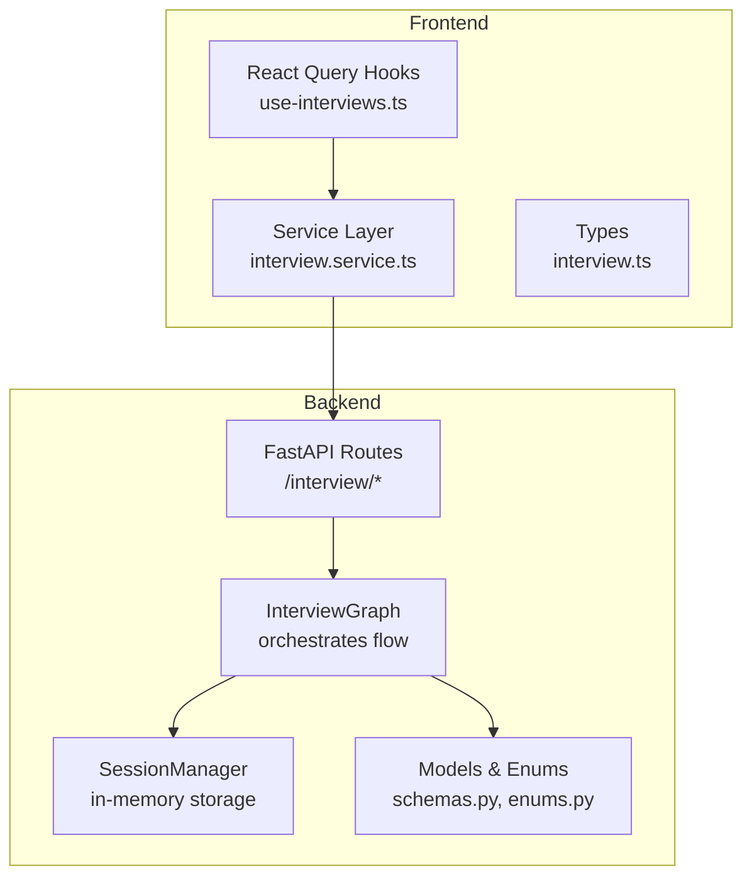
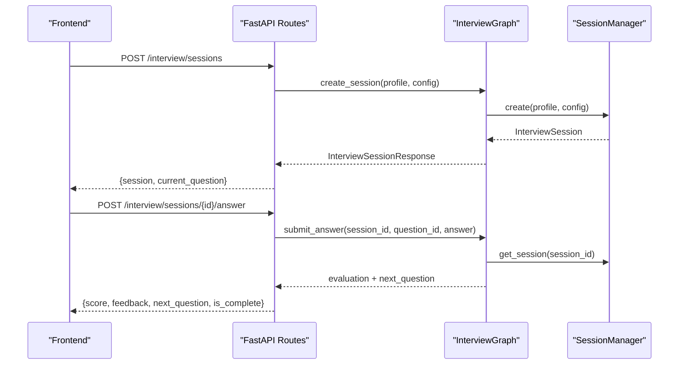
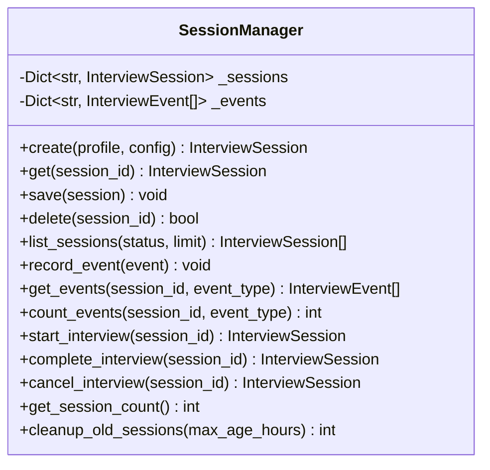
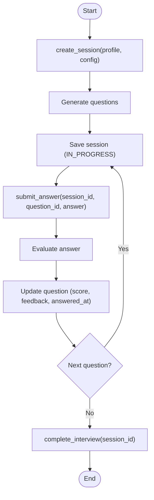
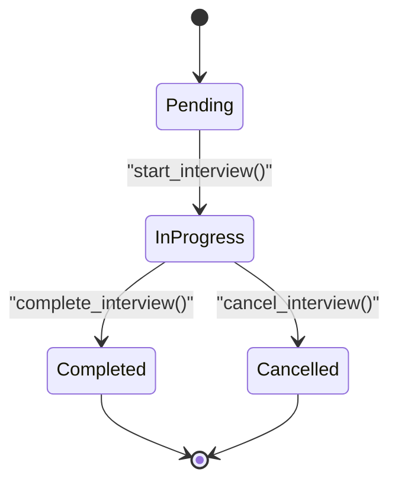
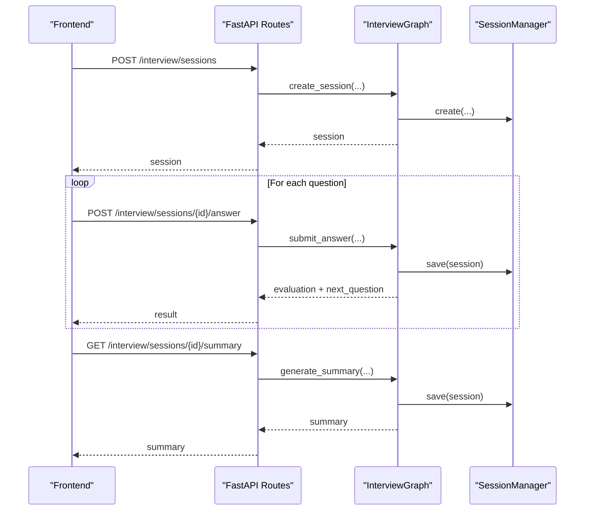
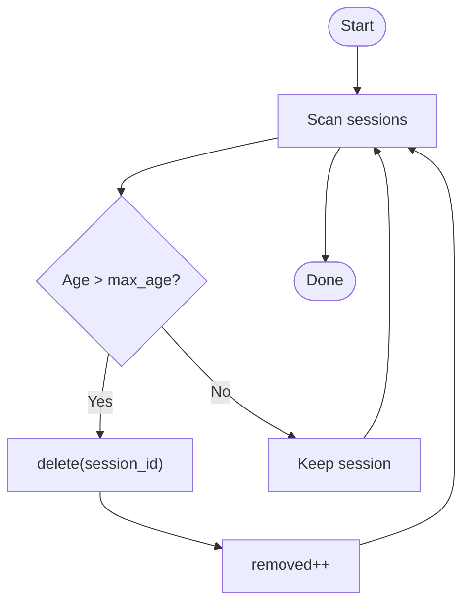
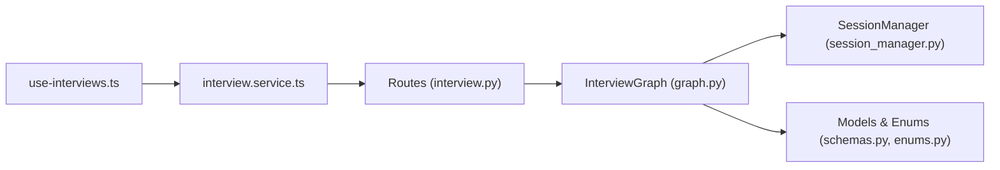

# Session Management

<cite>
**Referenced Files in This Document**
- [session_manager.py](file://backend/app/services/interview/session_manager.py)
- [graph.py](file://backend/app/services/interview/graph.py)
- [interview.py](file://backend/app/routes/interview.py)
- [schemas.py](file://backend/app/models/interview/schemas.py)
- [enums.py](file://backend/app/models/interview/enums.py)
- [use-interviews.ts](file://frontend/hooks/queries/use-interviews.ts)
- [interview.service.ts](file://frontend/services/interview.service.ts)
- [interview.ts](file://frontend/types/interview.ts)
</cite>

## Table of Contents
1. [Introduction](#introduction)
2. [Project Structure](#project-structure)
3. [Core Components](#core-components)
4. [Architecture Overview](#architecture-overview)
5. [Detailed Component Analysis](#detailed-component-analysis)
6. [Dependency Analysis](#dependency-analysis)
7. [Performance Considerations](#performance-considerations)
8. [Troubleshooting Guide](#troubleshooting-guide)
9. [Conclusion](#conclusion)
10. [Appendices](#appendices)

## Introduction
This document provides a comprehensive guide to the Session Management component for digital interviews. It explains the interview session lifecycle from creation to termination, including state tracking, progress monitoring, and real-time synchronization. It documents the SessionManager class, session persistence strategies, configuration options, participant management, access control, and frontend integration via React Query hooks. It also covers workflows such as session resumption, timeout handling, and audit trail maintenance for compliance.

## Project Structure
The Session Management feature spans backend services and models, FastAPI routes, and frontend React Query hooks:
- Backend Python modules define interview data models, session lifecycle, and orchestration.
- FastAPI routes expose endpoints for session CRUD, answer submission, code execution, and event recording.
- Frontend React Query hooks integrate with the backend to manage interview sessions client-side.

**Diagram sources**
- [session_manager.py](file://backend/app/services/interview/session_manager.py#L15-L257)
- [graph.py](file://backend/app/services/interview/graph.py#L23-L511)
- [interview.py](file://backend/app/routes/interview.py#L23-L494)
- [schemas.py](file://backend/app/models/interview/schemas.py#L22-L169)
- [enums.py](file://backend/app/models/interview/enums.py#L6-L43)
- [use-interviews.ts](file://frontend/hooks/queries/use-interviews.ts#L1-L44)
- [interview.service.ts](file://frontend/services/interview.service.ts#L1-L18)
- [interview.ts](file://frontend/types/interview.ts#L1-L21)

**Section sources**
- [session_manager.py](file://backend/app/services/interview/session_manager.py#L15-L257)
- [graph.py](file://backend/app/services/interview/graph.py#L23-L511)
- [interview.py](file://backend/app/routes/interview.py#L23-L494)
- [schemas.py](file://backend/app/models/interview/schemas.py#L22-L169)
- [enums.py](file://backend/app/models/interview/enums.py#L6-L43)
- [use-interviews.ts](file://frontend/hooks/queries/use-interviews.ts#L1-L44)
- [interview.service.ts](file://frontend/services/interview.service.ts#L1-L18)
- [interview.ts](file://frontend/types/interview.ts#L1-L21)

## Core Components
- SessionManager: In-memory session and event storage with lifecycle operations (create, start, complete, cancel, delete, list, cleanup).
- InterviewGraph: Orchestrates session creation, question progression, answer evaluation, code execution, and summary generation.
- FastAPI Routes: Expose endpoints for session management, answer submission (streaming and non-streaming), code execution, summary generation, and event recording.
- Models and Enums: Define InterviewSession, InterviewConfig, InterviewEvent, InterviewQuestion, and related enumerations for statuses, event types, and difficulty levels.

Key responsibilities:
- Session lifecycle: creation, start, progress tracking, completion/cancellation, deletion, and cleanup.
- Real-time state synchronization: streaming endpoints for answers and summaries.
- Audit and integrity: event recording for tab switches and focus changes.
- Persistence strategy: current in-memory storage with production extension points to PostgreSQL.

**Section sources**
- [session_manager.py](file://backend/app/services/interview/session_manager.py#L15-L257)
- [graph.py](file://backend/app/services/interview/graph.py#L23-L511)
- [interview.py](file://backend/app/routes/interview.py#L65-L494)
- [schemas.py](file://backend/app/models/interview/schemas.py#L72-L104)
- [enums.py](file://backend/app/models/interview/enums.py#L14-L43)

## Architecture Overview
The system follows a layered architecture:
- Presentation: FastAPI routes handle HTTP requests and responses, including SSE streaming.
- Application: InterviewGraph coordinates services and manages session state transitions.
- Domain: SessionManager encapsulates session and event persistence.
- Data: Pydantic models define session, config, and event structures.

**Diagram sources**
- [interview.py](file://backend/app/routes/interview.py#L65-L186)
- [graph.py](file://backend/app/services/interview/graph.py#L49-L168)
- [session_manager.py](file://backend/app/services/interview/session_manager.py#L28-L52)

## Detailed Component Analysis

### SessionManager
Responsibilities:
- Create sessions with initial status and timestamps.
- Persist sessions and maintain event logs per session.
- Track and update session progress (current question index).
- Record InterviewEvents and update derived metrics (e.g., tab switch count).
- Manage lifecycle operations: start, complete, cancel, delete, list, and cleanup old sessions.
- Provide counts and health metrics.

Design highlights:
- In-memory dictionaries for sessions and events keyed by session_id.
- Thread-safe in-process usage; production-grade persistence can be added via PostgreSQL integration.

**Diagram sources**
- [session_manager.py](file://backend/app/services/interview/session_manager.py#L15-L257)

**Section sources**
- [session_manager.py](file://backend/app/services/interview/session_manager.py#L15-L257)

### InterviewGraph
Responsibilities:
- Orchestrate the interview flow: create session, generate questions, evaluate answers, execute code, and generate summaries.
- Coordinate with SessionManager for state persistence.
- Provide streaming responses for evaluation and summary generation.

Key flows:
- Session creation: generates questions, sets status to in-progress, records start time.
- Answer submission: validates current question, evaluates answer, updates session, advances to next question, completes session if last.
- Code execution: executes code, stores submission, evaluates code, updates session.
- Summary generation: computes final score and recommendations, marks session as completed.

**Diagram sources**
- [graph.py](file://backend/app/services/interview/graph.py#L49-L168)
- [session_manager.py](file://backend/app/services/interview/session_manager.py#L172-L217)

**Section sources**
- [graph.py](file://backend/app/services/interview/graph.py#L23-L511)
- [session_manager.py](file://backend/app/services/interview/session_manager.py#L15-L257)

### Interview Session Lifecycle
Lifecycle stages:
- Creation: SessionManager creates a session with PENDING status and initializes events list.
- Start: InterviewGraph starts the session, sets IN_PROGRESS and started_at.
- Progress: Answer submission increments current_question_index; code execution stores submissions.
- Completion: When the last question is processed, the session is marked COMPLETED with completed_at.
- Termination: Sessions can be cancelled or deleted; old sessions can be cleaned up.

**Diagram sources**
- [session_manager.py](file://backend/app/services/interview/session_manager.py#L172-L217)
- [enums.py](file://backend/app/models/interview/enums.py#L14-L21)

**Section sources**
- [session_manager.py](file://backend/app/services/interview/session_manager.py#L172-L217)
- [enums.py](file://backend/app/models/interview/enums.py#L14-L21)

### Session Configuration Options
InterviewConfig supports:
- Role and optional template/topic.
- Number of questions and difficulty distribution.
- Time limits, coding inclusion, and supported languages.
- Voice settings (enabled/disabled and language).

These options influence question generation and session behavior.

**Section sources**
- [schemas.py](file://backend/app/models/interview/schemas.py#L55-L70)

### Participant Management and Access Control
- Session retrieval and mutations require a valid session_id; routes return 404 if not found.
- Event recording requires a valid session_id and supports event type validation.
- No explicit user identity is modeled in the session data; access control can be enforced at the route level using authentication middleware.

**Section sources**
- [interview.py](file://backend/app/routes/interview.py#L94-L119)
- [interview.py](file://backend/app/routes/interview.py#L420-L450)

### Real-Time State Synchronization
Streaming endpoints:
- Answer submission streaming: yields partial evaluation chunks and a final complete event.
- Code execution streaming: yields execution result followed by code review chunks and a final complete event.
- Summary streaming: yields summary chunks and a final complete event.

SSE generator converts async generators to Server-Sent Events with appropriate event types.

**Section sources**
- [interview.py](file://backend/app/routes/interview.py#L188-L224)
- [interview.py](file://backend/app/routes/interview.py#L257-L295)
- [interview.py](file://backend/app/routes/interview.py#L386-L414)
- [interview.py](file://backend/app/routes/interview.py#L29-L39)

### Session Persistence Strategies
Current implementation:
- In-memory storage via SessionManager dictionaries for sessions and events.

Production extension points:
- Routes demonstrate persistence via SessionManager; production can integrate PostgreSQL using asyncpg or ORM.
- The comment in SessionManager indicates extending persistence to PostgreSQL.

**Section sources**
- [session_manager.py](file://backend/app/services/interview/session_manager.py#L16-L20)
- [interview.py](file://backend/app/routes/interview.py#L110-L119)

### Audit Trail and Integrity Tracking
- InterviewEvent captures session_id, event_type, timestamp, and metadata.
- Tab switch counting is maintained and exposed; excessive tab switches can be flagged for review.
- Focus gained/lost and other events are supported for integrity tracking.

**Section sources**
- [schemas.py](file://backend/app/models/interview/schemas.py#L96-L104)
- [enums.py](file://backend/app/models/interview/enums.py#L33-L43)
- [interview.py](file://backend/app/routes/interview.py#L420-L450)
- [session_manager.py](file://backend/app/services/interview/session_manager.py#L113-L133)

### Frontend Integration with React Hooks
Frontend hooks:
- use-interviews.ts integrates with the backend via interview.service.ts to fetch and mutate interview data.
- Types in interview.ts define the shape of interview sessions and requests.

Note: The provided frontend files primarily cover generic interview data fetching and deletion. Specific interview session state management and real-time updates would typically be handled by additional hooks and services aligned with the backend streaming endpoints.

**Section sources**
- [use-interviews.ts](file://frontend/hooks/queries/use-interviews.ts#L1-L44)
- [interview.service.ts](file://frontend/services/interview.service.ts#L1-L18)
- [interview.ts](file://frontend/types/interview.ts#L1-L21)

### Examples of Session Workflows

#### Workflow 1: Basic Interview from Setup to Completion
- Create session with profile and config.
- Start interview (status becomes IN_PROGRESS).
- Submit answers; session progresses through questions.
- On last question, session is marked COMPLETED.
- Optionally generate summary.

**Diagram sources**
- [interview.py](file://backend/app/routes/interview.py#L65-L186)
- [interview.py](file://backend/app/routes/interview.py#L343-L384)
- [graph.py](file://backend/app/services/interview/graph.py#L49-L168)
- [session_manager.py](file://backend/app/services/interview/session_manager.py#L65-L72)

#### Workflow 2: Timeout Handling and Cleanup
- Old sessions can be removed after a configurable threshold (hours).
- Health endpoint reports active session count.

**Diagram sources**
- [session_manager.py](file://backend/app/services/interview/session_manager.py#L223-L244)
- [interview.py](file://backend/app/routes/interview.py#L486-L494)

#### Workflow 3: Session Resumption
- Current in-memory implementation does not persist state across restarts.
- To support resumption, integrate SessionManager with persistent storage (e.g., PostgreSQL) and restore sessions on startup.

**Section sources**
- [session_manager.py](file://backend/app/services/interview/session_manager.py#L16-L20)

### Concurrent Session Handling
- SessionManager uses in-memory dictionaries keyed by session_id, enabling concurrent access within a single process.
- For multi-instance deployments, replace in-memory storage with a shared database and add locking or optimistic concurrency controls.

**Section sources**
- [session_manager.py](file://backend/app/services/interview/session_manager.py#L22-L26)

### Session Security Measures
- Session existence checks are performed before mutating state (routes return 404 if not found).
- Event recording validates session presence.
- No built-in user identity is attached to sessions; enforce access control at the route level using authentication and authorization middleware.

**Section sources**
- [interview.py](file://backend/app/routes/interview.py#L94-L119)
- [interview.py](file://backend/app/routes/interview.py#L420-L450)

### Compliance and Audit Trail Maintenance
- InterviewEvent captures timestamps and metadata for each event.
- Tab switch counts and other event types enable integrity monitoring.
- Summaries and scores are persisted with the session for final audit records.

**Section sources**
- [schemas.py](file://backend/app/models/interview/schemas.py#L96-L104)
- [enums.py](file://backend/app/models/interview/enums.py#L33-L43)
- [graph.py](file://backend/app/services/interview/graph.py#L373-L405)

## Dependency Analysis
The following diagram shows key dependencies among components:

**Diagram sources**
- [interview.py](file://backend/app/routes/interview.py#L23-L494)
- [graph.py](file://backend/app/services/interview/graph.py#L23-L511)
- [session_manager.py](file://backend/app/services/interview/session_manager.py#L15-L257)
- [schemas.py](file://backend/app/models/interview/schemas.py#L22-L169)
- [enums.py](file://backend/app/models/interview/enums.py#L6-L43)
- [use-interviews.ts](file://frontend/hooks/queries/use-interviews.ts#L1-L44)
- [interview.service.ts](file://frontend/services/interview.service.ts#L1-L18)

**Section sources**
- [interview.py](file://backend/app/routes/interview.py#L23-L494)
- [graph.py](file://backend/app/services/interview/graph.py#L23-L511)
- [session_manager.py](file://backend/app/services/interview/session_manager.py#L15-L257)
- [schemas.py](file://backend/app/models/interview/schemas.py#L22-L169)
- [enums.py](file://backend/app/models/interview/enums.py#L6-L43)
- [use-interviews.ts](file://frontend/hooks/queries/use-interviews.ts#L1-L44)
- [interview.service.ts](file://frontend/services/interview.service.ts#L1-L18)

## Performance Considerations
- In-memory storage is efficient but not persistent; consider database-backed storage for production.
- Streaming endpoints reduce client wait times; ensure proper buffering and backpressure handling.
- Cleanup_old_sessions helps control memory usage; tune max_age_hours based on retention policies.
- Consider indexing and pagination for list_sessions when scaling.

## Troubleshooting Guide
Common issues and resolutions:
- Session not found: Ensure session_id is valid and created before use. Routes return 404 for missing sessions.
- Question mismatch: When submitting answers, the provided question_id must match the current question; otherwise, validation errors are raised.
- Excessive tab switches: Tab switch count is tracked; flag sessions with high counts for review.
- Streaming errors: SSE generator emits error events; inspect client-side event handlers for error payloads.

**Section sources**
- [interview.py](file://backend/app/routes/interview.py#L94-L119)
- [interview.py](file://backend/app/routes/interview.py#L154-L186)
- [interview.py](file://backend/app/routes/interview.py#L420-L450)
- [interview.py](file://backend/app/routes/interview.py#L29-L39)

## Conclusion
The Session Management component provides a robust foundation for managing interview sessions with clear lifecycle stages, real-time streaming capabilities, and event-driven integrity tracking. While the current implementation uses in-memory storage, the architecture supports straightforward persistence integration for production environments. Frontend integration can be extended to leverage streaming endpoints and centralized state management for a seamless user experience.

## Appendices

### API Reference Summary
- Create session: POST /interview/sessions
- Get session: GET /interview/sessions/{session_id}
- Delete session: DELETE /interview/sessions/{session_id}
- List sessions: GET /interview/sessions
- Submit answer (non-streaming): POST /interview/sessions/{session_id}/answer
- Submit answer (streaming): POST /interview/sessions/{session_id}/answer/stream
- Execute code (non-streaming): POST /interview/sessions/{session_id}/code
- Execute code (streaming): POST /interview/sessions/{session_id}/code/stream
- Skip question: POST /interview/sessions/{session_id}/skip
- Get summary (non-streaming): GET /interview/sessions/{session_id}/summary
- Generate summary (streaming): POST /interview/sessions/{session_id}/summary/stream
- Record event: POST /interview/sessions/{session_id}/events
- Get events: GET /interview/sessions/{session_id}/events
- Health: GET /interview/health

**Section sources**
- [interview.py](file://backend/app/routes/interview.py#L65-L494)