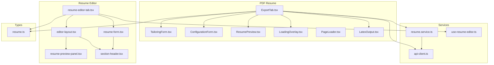
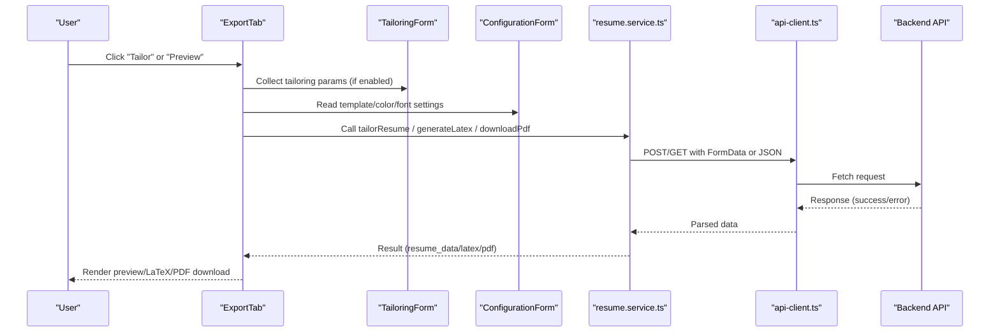
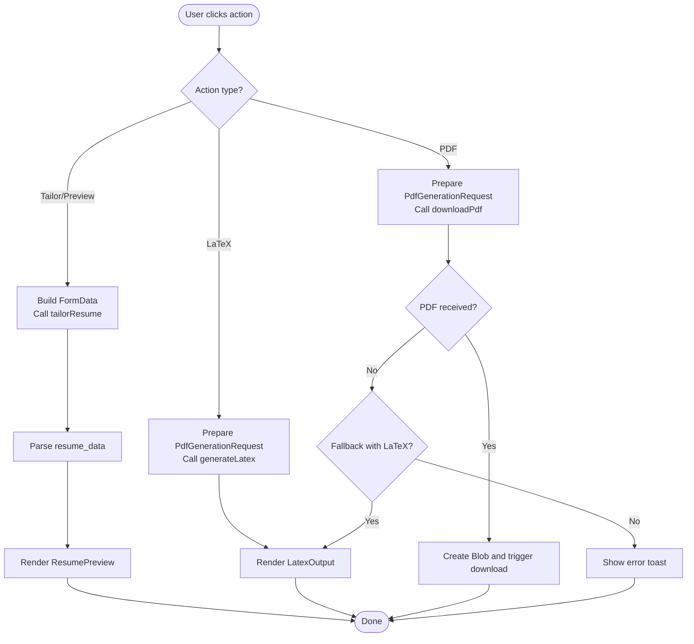
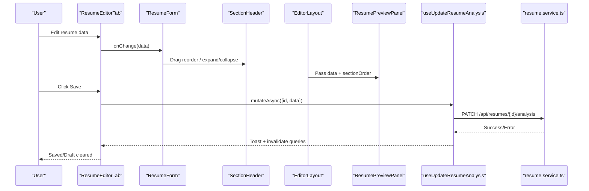
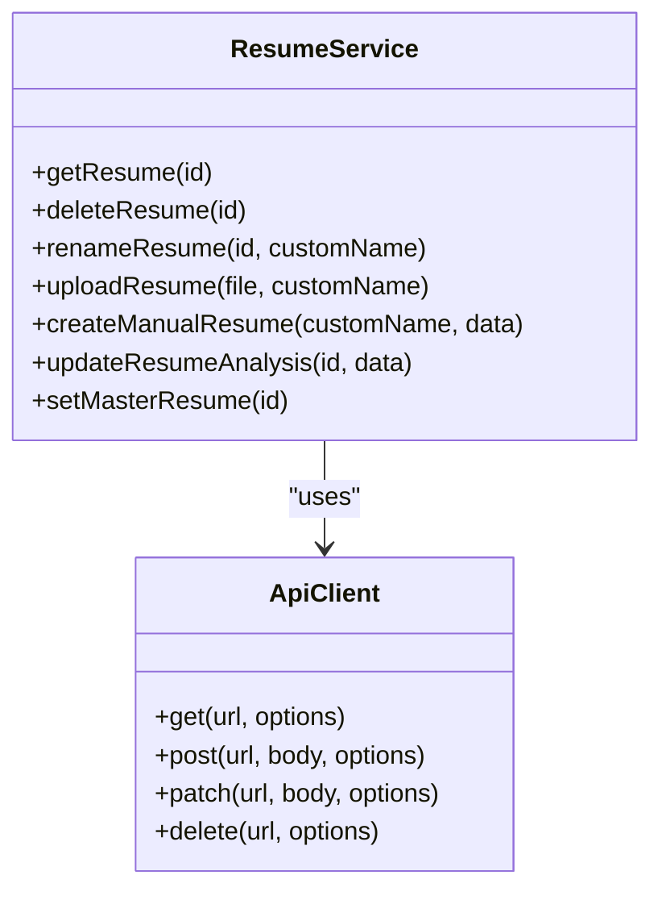
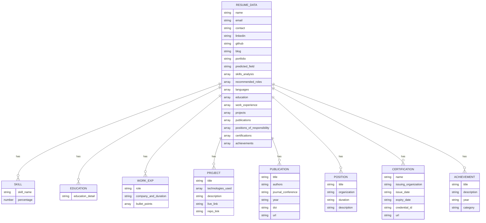
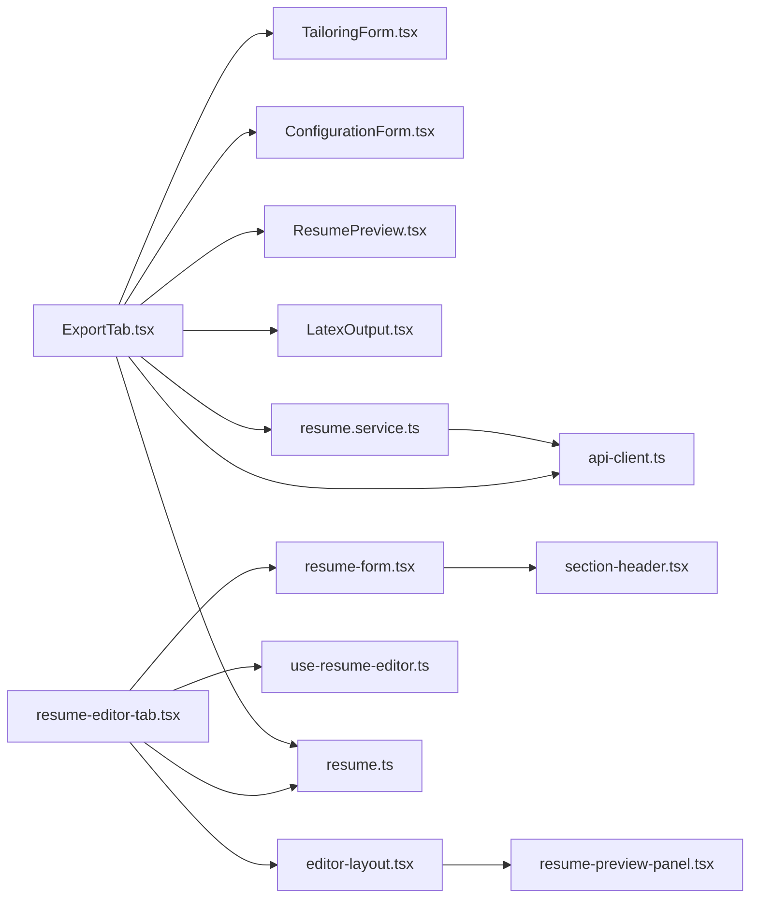

# Frontend Integration and Display

<cite>
**Referenced Files in This Document**
- [ConfigurationForm.tsx](file://frontend/components/pdf-resume/ConfigurationForm.tsx)
- [ResumePreview.tsx](file://frontend/components/pdf-resume/ResumePreview.tsx)
- [ExportTab.tsx](file://frontend/components/pdf-resume/ExportTab.tsx)
- [TailoringForm.tsx](file://frontend/components/pdf-resume/TailoringForm.tsx)
- [LatexOutput.tsx](file://frontend/components/pdf-resume/LatexOutput.tsx)
- [LoadingOverlay.tsx](file://frontend/components/pdf-resume/LoadingOverlay.tsx)
- [PageLoader.tsx](file://frontend/components/pdf-resume/PageLoader.tsx)
- [use-resume-editor.ts](file://frontend/hooks/queries/use-resume-editor.ts)
- [resume.service.ts](file://frontend/services/resume.service.ts)
- [resume-editor-tab.tsx](file://frontend/components/resume-editor/resume-editor-tab.tsx)
- [resume-form.tsx](file://frontend/components/resume-editor/resume-form.tsx)
- [resume-preview-panel.tsx](file://frontend/components/resume-editor/resume-preview-panel.tsx)
- [editor-layout.tsx](file://frontend/components/resume-editor/editor-layout.tsx)
- [section-header.tsx](file://frontend/components/resume-editor/section-header.tsx)
- [resume.ts](file://frontend/types/resume.ts)
- [api-client.ts](file://frontend/services/api-client.ts)
</cite>

## Table of Contents
1. [Introduction](#introduction)
2. [Project Structure](#project-structure)
3. [Core Components](#core-components)
4. [Architecture Overview](#architecture-overview)
5. [Detailed Component Analysis](#detailed-component-analysis)
6. [Dependency Analysis](#dependency-analysis)
7. [Performance Considerations](#performance-considerations)
8. [Troubleshooting Guide](#troubleshooting-guide)
9. [Conclusion](#conclusion)
10. [Appendices](#appendices)

## Introduction
This document explains the frontend integration with the resume analysis engine, focusing on the PDF resume generator and editor. It covers:
- PDF resume components: ConfigurationForm, ResumePreview, ExportTab, TailoringForm, LatexOutput, LoadingOverlay, and PageLoader
- Hook-based integration via use-resume-editor.ts for real-time updates and state management
- Resume service layer for API communication, error handling, and data transformation
- ResumeEditor component architecture with form validation, section management, and live preview
- ResumePreview panel rendering formatted analysis results with responsive design
- Integration patterns for displaying analysis data, handling loading states, and managing user interactions
- Accessibility and cross-browser considerations for PDF rendering

## Project Structure
The frontend integrates two major flows:
- PDF resume generation and export (ExportTab orchestrating TailoringForm, ConfigurationForm, ResumePreview, LatexOutput, and LoadingOverlay)
- Resume editor and live preview (ResumeEditorTab, ResumeForm, EditorLayout, ResumePreviewPanel, SectionHeader)

**Diagram sources**
- [ExportTab.tsx](file://frontend/components/pdf-resume/ExportTab.tsx#L25-L292)
- [TailoringForm.tsx](file://frontend/components/pdf-resume/TailoringForm.tsx#L18-L129)
- [ConfigurationForm.tsx](file://frontend/components/pdf-resume/ConfigurationForm.tsx#L21-L157)
- [ResumePreview.tsx](file://frontend/components/pdf-resume/ResumePreview.tsx#L11-L276)
- [LoadingOverlay.tsx](file://frontend/components/pdf-resume/LoadingOverlay.tsx#L11-L51)
- [LatexOutput.tsx](file://frontend/components/pdf-resume/LatexOutput.tsx#L11-L82)
- [resume-editor-tab.tsx](file://frontend/components/resume-editor/resume-editor-tab.tsx#L106-L246)
- [resume-form.tsx](file://frontend/components/resume-editor/resume-form.tsx#L72-L194)
- [editor-layout.tsx](file://frontend/components/resume-editor/editor-layout.tsx#L18-L116)
- [resume-preview-panel.tsx](file://frontend/components/resume-editor/resume-preview-panel.tsx#L336-L409)
- [section-header.tsx](file://frontend/components/resume-editor/section-header.tsx#L23-L137)
- [resume.service.ts](file://frontend/services/resume.service.ts#L23-L65)
- [api-client.ts](file://frontend/services/api-client.ts#L25-L98)
- [use-resume-editor.ts](file://frontend/hooks/queries/use-resume-editor.ts#L6-L81)
- [resume.ts](file://frontend/types/resume.ts#L60-L133)

**Section sources**
- [ExportTab.tsx](file://frontend/components/pdf-resume/ExportTab.tsx#L25-L292)
- [resume-editor-tab.tsx](file://frontend/components/resume-editor/resume-editor-tab.tsx#L106-L246)

## Core Components
- ExportTab orchestrates resume tailoring, configuration, preview, and export (PDF or LaTeX). It manages state for tailoring parameters, template and style options, and parsed resume data.
- TailoringForm toggles and collects job-specific parameters to tailor the resume.
- ConfigurationForm controls template, color scheme, and font size for PDF/LaTeX output.
- ResumePreview renders a formatted preview of the parsed resume data.
- LatexOutput displays generated LaTeX code with copy and Open in Overleaf actions.
- LoadingOverlay provides animated feedback during generation.
- PageLoader shows a page-level spinner while the generator initializes.
- ResumeEditorTab manages editing lifecycle, local drafts, and saving changes to the backend.
- ResumeForm and EditorLayout implement drag-and-drop reordering, expand/collapse, and visibility toggles.
- ResumePreviewPanel renders a printable A4-style preview with responsive scaling.

**Section sources**
- [ExportTab.tsx](file://frontend/components/pdf-resume/ExportTab.tsx#L25-L292)
- [TailoringForm.tsx](file://frontend/components/pdf-resume/TailoringForm.tsx#L18-L129)
- [ConfigurationForm.tsx](file://frontend/components/pdf-resume/ConfigurationForm.tsx#L21-L157)
- [ResumePreview.tsx](file://frontend/components/pdf-resume/ResumePreview.tsx#L11-L276)
- [LatexOutput.tsx](file://frontend/components/pdf-resume/LatexOutput.tsx#L11-L82)
- [LoadingOverlay.tsx](file://frontend/components/pdf-resume/LoadingOverlay.tsx#L11-L51)
- [PageLoader.tsx](file://frontend/components/pdf-resume/PageLoader.tsx#L8-L26)
- [resume-editor-tab.tsx](file://frontend/components/resume-editor/resume-editor-tab.tsx#L106-L246)
- [resume-form.tsx](file://frontend/components/resume-editor/resume-form.tsx#L72-L194)
- [editor-layout.tsx](file://frontend/components/resume-editor/editor-layout.tsx#L18-L116)
- [resume-preview-panel.tsx](file://frontend/components/resume-editor/resume-preview-panel.tsx#L336-L409)

## Architecture Overview
The system follows a layered architecture:
- UI Layer: Components for PDF export and resume editing
- Service Layer: resume.service.ts encapsulates API calls via api-client.ts
- State Management: TanStack Query mutations in use-resume-editor.ts manage backend state
- Types: Strongly typed ResumeData and related interfaces define data contracts

**Diagram sources**
- [ExportTab.tsx](file://frontend/components/pdf-resume/ExportTab.tsx#L50-L168)
- [TailoringForm.tsx](file://frontend/components/pdf-resume/TailoringForm.tsx#L18-L129)
- [ConfigurationForm.tsx](file://frontend/components/pdf-resume/ConfigurationForm.tsx#L21-L157)
- [resume.service.ts](file://frontend/services/resume.service.ts#L43-L64)
- [api-client.ts](file://frontend/services/api-client.ts#L25-L98)

## Detailed Component Analysis

### PDF Resume Export Tab
ExportTab coordinates tailoring, configuration, preview, and export. It:
- Builds FormData for tailoring parameters and calls tailorResume mutation
- Generates LaTeX or downloads PDF using resume service
- Manages loading states with LoadingOverlay
- Displays parsed data in ResumePreview and LaTeX output in LatexOutput

**Diagram sources**
- [ExportTab.tsx](file://frontend/components/pdf-resume/ExportTab.tsx#L50-L168)
- [ResumePreview.tsx](file://frontend/components/pdf-resume/ResumePreview.tsx#L11-L276)
- [LatexOutput.tsx](file://frontend/components/pdf-resume/LatexOutput.tsx#L11-L82)

**Section sources**
- [ExportTab.tsx](file://frontend/components/pdf-resume/ExportTab.tsx#L25-L292)

### Tailoring Form
TailoringForm toggles job-specific customization and validates required fields. It:
- Uses a Switch to enable/disable tailoring
- Requires job role when tailoring is enabled
- Collects company info and job description for enhanced tailoring

**Section sources**
- [TailoringForm.tsx](file://frontend/components/pdf-resume/TailoringForm.tsx#L18-L129)

### Configuration Form
ConfigurationForm controls:
- Template selection (Professional/Modern)
- Color scheme (Default/Blue/Green/Red)
- Font size slider (8–12pt)

**Section sources**
- [ConfigurationForm.tsx](file://frontend/components/pdf-resume/ConfigurationForm.tsx#L21-L157)

### Resume Preview Panel
ResumePreview renders formatted sections:
- Personal info with links
- Education, Skills, Languages
- Work experience with bullet points
- Projects with technologies and links
- Publications, Certifications, Achievements
- Positions of responsibility
- Recommended roles

It also provides a miniature A4-style preview with responsive scaling and live updates.

**Section sources**
- [ResumePreview.tsx](file://frontend/components/pdf-resume/ResumePreview.tsx#L11-L276)
- [resume-preview-panel.tsx](file://frontend/components/resume-editor/resume-preview-panel.tsx#L336-L409)

### LaTeX Output
LatexOutput displays generated LaTeX code with:
- Copy to clipboard
- Open in Overleaf
- Step-by-step manual compilation instructions

**Section sources**
- [LatexOutput.tsx](file://frontend/components/pdf-resume/LatexOutput.tsx#L11-L82)

### Loading and Page Load States
- LoadingOverlay animates during PDF/LaTeX generation
- PageLoader shows a page-level spinner while initializing

**Section sources**
- [LoadingOverlay.tsx](file://frontend/components/pdf-resume/LoadingOverlay.tsx#L11-L51)
- [PageLoader.tsx](file://frontend/components/pdf-resume/PageLoader.tsx#L8-L26)

### Resume Editor Integration
ResumeEditorTab manages:
- Local drafts persisted to localStorage with auto-save debounce
- Real-time sync with server data and change detection
- Save/discard actions with mutation feedback
- Integration with useUpdateResumeAnalysis for backend updates

**Diagram sources**
- [resume-editor-tab.tsx](file://frontend/components/resume-editor/resume-editor-tab.tsx#L106-L246)
- [resume-form.tsx](file://frontend/components/resume-editor/resume-form.tsx#L72-L194)
- [section-header.tsx](file://frontend/components/resume-editor/section-header.tsx#L23-L137)
- [editor-layout.tsx](file://frontend/components/resume-editor/editor-layout.tsx#L18-L116)
- [resume-preview-panel.tsx](file://frontend/components/resume-editor/resume-preview-panel.tsx#L336-L409)
- [use-resume-editor.ts](file://frontend/hooks/queries/use-resume-editor.ts#L35-L58)
- [resume.service.ts](file://frontend/services/resume.service.ts#L57-L58)

**Section sources**
- [resume-editor-tab.tsx](file://frontend/components/resume-editor/resume-editor-tab.tsx#L106-L246)
- [resume-form.tsx](file://frontend/components/resume-editor/resume-form.tsx#L72-L194)
- [section-header.tsx](file://frontend/components/resume-editor/section-header.tsx#L23-L137)
- [editor-layout.tsx](file://frontend/components/resume-editor/editor-layout.tsx#L18-L116)
- [resume-preview-panel.tsx](file://frontend/components/resume-editor/resume-preview-panel.tsx#L336-L409)
- [use-resume-editor.ts](file://frontend/hooks/queries/use-resume-editor.ts#L6-L81)

### Service Layer and API Communication
The service layer abstracts API calls:
- resume.service.ts defines endpoints for resume CRUD and analysis updates
- api-client.ts centralizes HTTP requests, error normalization, and FormData handling

**Diagram sources**
- [api-client.ts](file://frontend/services/api-client.ts#L25-L98)
- [resume.service.ts](file://frontend/services/resume.service.ts#L23-L65)

**Section sources**
- [resume.service.ts](file://frontend/services/resume.service.ts#L23-L65)
- [api-client.ts](file://frontend/services/api-client.ts#L25-L98)

### Data Models and Interfaces
ResumeData and related types define the shape of analysis results and export options.

**Diagram sources**
- [resume.ts](file://frontend/types/resume.ts#L60-L79)

**Section sources**
- [resume.ts](file://frontend/types/resume.ts#L60-L133)

## Dependency Analysis
- ExportTab depends on TailoringForm, ConfigurationForm, ResumePreview, LatexOutput, and TanStack Query mutations for PDF/LaTeX generation and download
- ResumeEditorTab depends on useUpdateResumeAnalysis and TanStack Query for saving changes
- Both flows depend on resume.service.ts and api-client.ts for backend communication
- Types define contracts across components and services

**Diagram sources**
- [ExportTab.tsx](file://frontend/components/pdf-resume/ExportTab.tsx#L25-L292)
- [resume-editor-tab.tsx](file://frontend/components/resume-editor/resume-editor-tab.tsx#L106-L246)
- [resume.service.ts](file://frontend/services/resume.service.ts#L23-L65)
- [api-client.ts](file://frontend/services/api-client.ts#L25-L98)
- [resume.ts](file://frontend/types/resume.ts#L60-L133)

**Section sources**
- [ExportTab.tsx](file://frontend/components/pdf-resume/ExportTab.tsx#L25-L292)
- [resume-editor-tab.tsx](file://frontend/components/resume-editor/resume-editor-tab.tsx#L106-L246)
- [resume.service.ts](file://frontend/services/resume.service.ts#L23-L65)
- [api-client.ts](file://frontend/services/api-client.ts#L25-L98)
- [resume.ts](file://frontend/types/resume.ts#L60-L133)

## Performance Considerations
- Debounced localStorage writes in ResumeEditorTab reduce storage churn and improve responsiveness
- ResumePreviewPanel scales content to fit available width using ResizeObserver and CSS transforms
- TanStack Query invalidations keep cached data fresh after edits
- ExportTab batches UI updates and uses a single overlay for generation feedback

[No sources needed since this section provides general guidance]

## Troubleshooting Guide
Common issues and remedies:
- PDF generation fails with fallback LaTeX: ExportTab checks for fallback and shows LaTeX output; copy and compile manually
- Network errors: api-client.ts throws ApiError with normalized messages; surface via toasts
- Tailoring validation: ExportTab enforces required job role when tailoring is enabled
- Save conflicts: ResumeEditorTab detects changes and clears drafts upon successful save

**Section sources**
- [ExportTab.tsx](file://frontend/components/pdf-resume/ExportTab.tsx#L148-L167)
- [api-client.ts](file://frontend/services/api-client.ts#L13-L23)
- [resume-editor-tab.tsx](file://frontend/components/resume-editor/resume-editor-tab.tsx#L147-L153)

## Conclusion
The frontend integrates seamlessly with the resume analysis engine through:
- A cohesive PDF export pipeline with tailoring, configuration, preview, and export options
- A robust editor with live preview, drag-and-drop reordering, and offline drafts
- A service layer with strong typing and resilient error handling
- Clear separation of concerns enabling maintainability and scalability

[No sources needed since this section summarizes without analyzing specific files]

## Appendices

### Accessibility Considerations
- Use semantic labels and ARIA-friendly components (e.g., Switch, Button, Select)
- Ensure keyboard navigation support for drag-and-drop and form controls
- Provide visible focus states and sufficient color contrast for print-like previews
- Offer alternative actions (copy LaTeX, open in Overleaf) for users who cannot download PDF

[No sources needed since this section provides general guidance]

### Cross-Browser Compatibility for PDF Rendering
- Prefer server-side PDF generation for consistent rendering across browsers
- Use LaTeX as a fallback for environments where PDF generation is unavailable
- Validate blob handling and download triggers across browsers
- Test link behavior for external services (Overleaf) and ensure pop-up allowances

[No sources needed since this section provides general guidance]