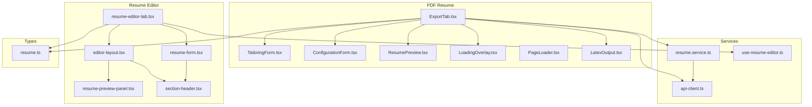
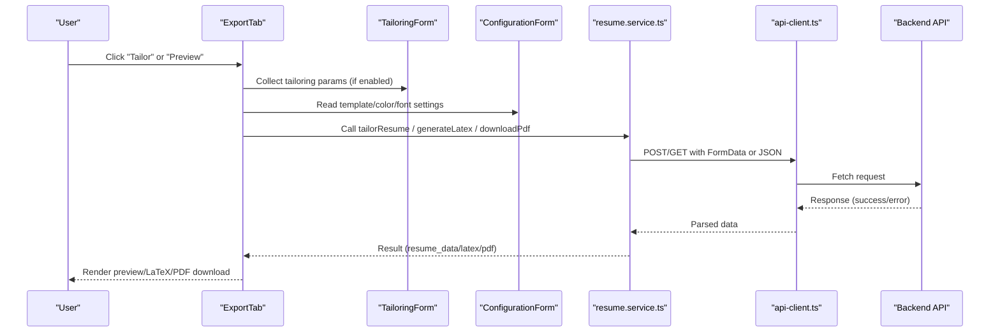
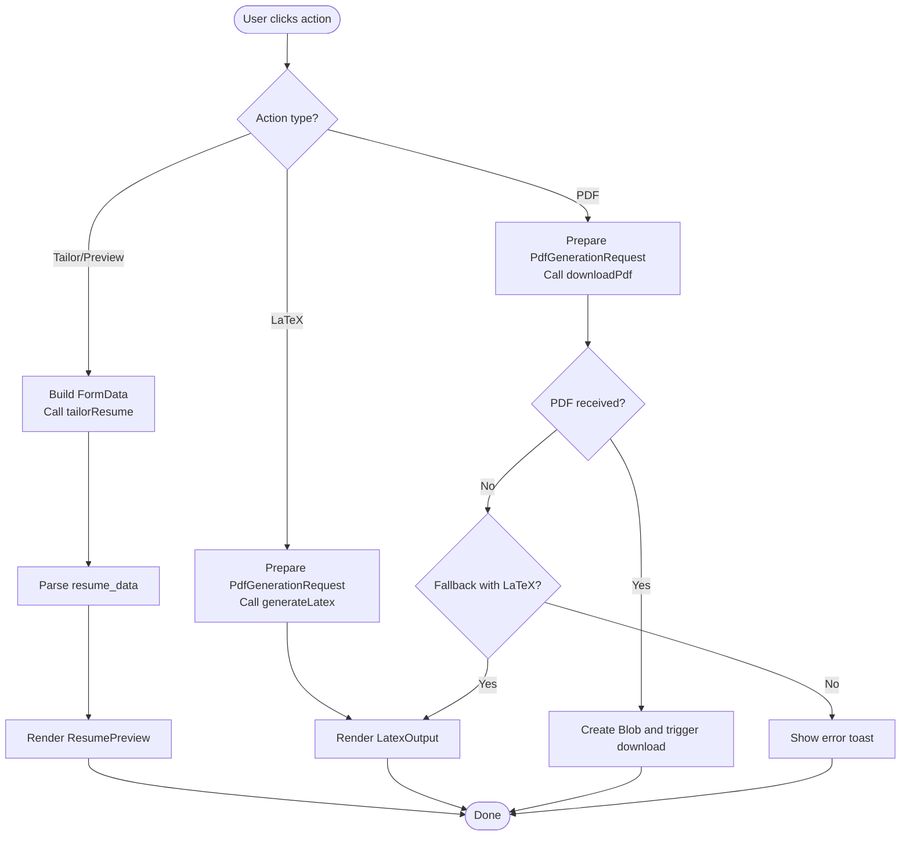
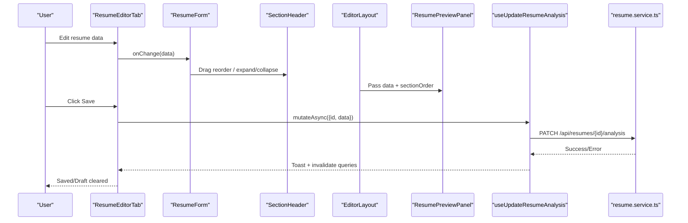
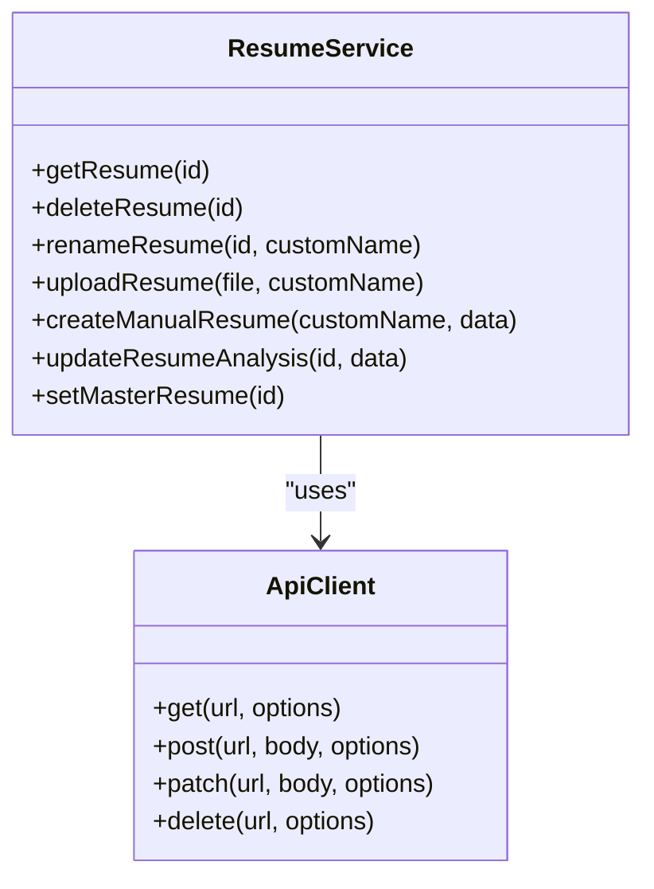
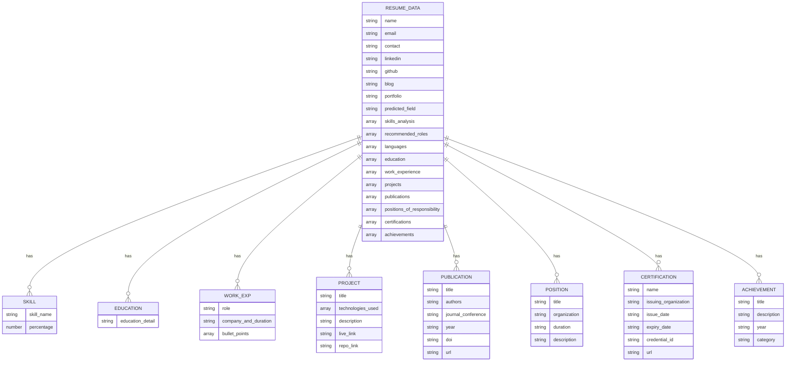
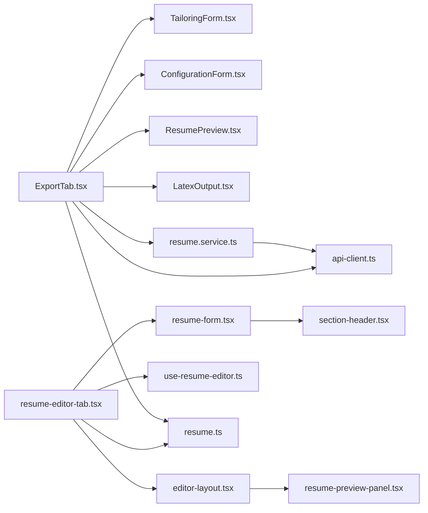

# Frontend integration and display

## Introduction
This page explains the frontend integration with the resume analysis engine, focusing on the PDF resume generator and editor. It covers:
- PDF resume components: ConfigurationForm, ResumePreview, ExportTab, TailoringForm, LatexOutput, LoadingOverlay, and PageLoader
- Hook-based integration via use-resume-editor.ts for real-time updates and state management
- Resume service layer for API communication, error handling, and data transformation
- ResumeEditor component architecture with form validation, section management, and live preview
- ResumePreview panel rendering formatted analysis results with responsive design
- Integration patterns for displaying analysis data, handling loading states, and managing user interactions
- Accessibility and cross-browser considerations for PDF rendering

## Project structure
The frontend integrates two major flows:
- PDF resume generation and export (ExportTab orchestrating TailoringForm, ConfigurationForm, ResumePreview, LatexOutput, and LoadingOverlay)
- Resume editor and live preview (ResumeEditorTab, ResumeForm, EditorLayout, ResumePreviewPanel, SectionHeader)

```mermaid
graph TB
subgraph "PDF Resume"
ET["ExportTab.tsx"]
TF["TailoringForm.tsx"]
CF["ConfigurationForm.tsx"]
RP["ResumePreview.tsx"]
LO["LoadingOverlay.tsx"]
LP["PageLoader.tsx"]
LTX["LatexOutput.tsx"]
end
subgraph "Resume Editor"
RET["resume-editor-tab.tsx"]
RF["resume-form.tsx"]
EL["editor-layout.tsx"]
RPP["resume-preview-panel.tsx"]
SH["section-header.tsx"]
end
subgraph "Services"
RS["resume.service.ts"]
AC["api-client.ts"]
URE["use-resume-editor.ts"]
end
subgraph "Types"
RT["resume.ts"]
end
ET --> TF
ET --> CF
ET --> RP
ET --> LO
ET --> LTX
ET --> RS
ET --> AC
RET --> RF
RET --> EL
EL --> RPP
EL --> SH
RET --> URE
RF --> SH
RS --> AC
RET --> RT
ET --> RT
```

## Core components
- ExportTab orchestrates resume tailoring, configuration, preview, and export (PDF or LaTeX). It manages state for tailoring parameters, template and style options, and parsed resume data.
- TailoringForm toggles and collects job-specific parameters to tailor the resume.
- ConfigurationForm controls template, color scheme, and font size for PDF/LaTeX output.
- ResumePreview renders a formatted preview of the parsed resume data.
- LatexOutput displays generated LaTeX code with copy and Open in Overleaf actions.
- LoadingOverlay provides animated feedback during generation.
- PageLoader shows a page-level spinner while the generator initializes.
- ResumeEditorTab manages editing lifecycle, local drafts, and saving changes to the backend.
- ResumeForm and EditorLayout implement drag-and-drop reordering, expand/collapse, and visibility toggles.
- ResumePreviewPanel renders a printable A4-style preview with responsive scaling.

## Architecture overview
The system follows a layered architecture:
- UI Layer: Components for PDF export and resume editing
- Service Layer: resume.service.ts encapsulates API calls via api-client.ts
- State Management: TanStack Query mutations in use-resume-editor.ts manage backend state
- Types: Strongly typed ResumeData and related interfaces define data contracts

```mermaid
sequenceDiagram
participant User as "User"
participant ET as "ExportTab"
participant TF as "TailoringForm"
participant CF as "ConfigurationForm"
participant RS as "resume.service.ts"
participant AC as "api-client.ts"
participant BE as "Backend API"
User->>ET : Click "Tailor" or "Preview"
ET->>TF : Collect tailoring params (if enabled)
ET->>CF : Read template/color/font settings
ET->>RS : Call tailorResume / generateLatex / downloadPdf
RS->>AC : POST/GET with FormData or JSON
AC->>BE : Fetch request
BE-->>AC : Response (success/error)
AC-->>RS : Parsed data
RS-->>ET : Result (resume_data/latex/pdf)
ET-->>User : Render preview/LaTeX/PDF download
```

## Detailed component analysis

### PDF resume export tab
ExportTab coordinates tailoring, configuration, preview, and export. It:
- Builds FormData for tailoring parameters and calls tailorResume mutation
- Generates LaTeX or downloads PDF using resume service
- Manages loading states with LoadingOverlay
- Displays parsed data in ResumePreview and LaTeX output in LatexOutput

```mermaid
flowchart TD
Start(["User clicks action"]) --> Decide{"Action type?"}
Decide --> |Tailor/Preview| Tailor["Build FormData<br/>Call tailorResume"]
Decide --> |LaTeX| GenLatex["Prepare PdfGenerationRequest<br/>Call generateLatex"]
Decide --> |PDF| Download["Prepare PdfGenerationRequest<br/>Call downloadPdf"]
Tailor --> Parse["Parse resume_data"]
Parse --> ShowPrev["Render ResumePreview"]
GenLatex --> ShowLatex["Render LatexOutput"]
Download --> Blob{"PDF received?"}
Blob --> |Yes| Save["Create Blob and trigger download"]
Blob --> |No| Fallback{"Fallback with LaTeX?"}
Fallback --> |Yes| ShowLatex
Fallback --> |No| Error["Show error toast"]
ShowPrev --> End(["Done"])
ShowLatex --> End
Save --> End
Error --> End
```

### Tailoring form
TailoringForm toggles job-specific customization and validates required fields. It:
- Uses a Switch to enable/disable tailoring
- Requires job role when tailoring is enabled
- Collects company info and job description for improved tailoring

### Configuration form
ConfigurationForm controls:
- Template selection (Professional/Modern)
- Color scheme (Default/Blue/Green/Red)
- Font size slider (8–12pt)

### Resume preview panel
ResumePreview renders formatted sections:
- Personal info with links
- Education, Skills, Languages
- Work experience with bullet points
- Projects with technologies and links
- Publications, Certifications, Achievements
- Positions of responsibility
- Recommended roles

It also provides a miniature A4-style preview with responsive scaling and live updates.

### LaTeX output
LatexOutput displays generated LaTeX code with:
- Copy to clipboard
- Open in Overleaf
- Step-by-step manual compilation instructions

### Loading and page load states
- LoadingOverlay animates during PDF/LaTeX generation
- PageLoader shows a page-level spinner while initializing

### Resume editor integration
ResumeEditorTab manages:
- Local drafts persisted to localStorage with auto-save debounce
- Real-time sync with server data and change detection
- Save/discard actions with mutation feedback
- Integration with useUpdateResumeAnalysis for backend updates

```mermaid
sequenceDiagram
participant User as "User"
participant RET as "ResumeEditorTab"
participant RF as "ResumeForm"
participant SH as "SectionHeader"
participant EL as "EditorLayout"
participant RPP as "ResumePreviewPanel"
participant URE as "useUpdateResumeAnalysis"
participant RS as "resume.service.ts"
User->>RET : Edit resume data
RET->>RF : onChange(data)
RF->>SH : Drag reorder / expand/collapse
EL->>RPP : Pass data + sectionOrder
User->>RET : Click Save
RET->>URE : mutateAsync({id, data})
URE->>RS : PATCH /api/resumes/{id}/analysis
RS-->>URE : Success/Error
URE-->>RET : Toast + invalidate queries
RET-->>User : Saved/Draft cleared
```

### Service layer and API communication
The service layer abstracts API calls:
- resume.service.ts defines endpoints for resume CRUD and analysis updates
- api-client.ts centralizes HTTP requests, error normalization, and FormData handling

```mermaid
classDiagram
class ApiClient {
+get(url, options)
+post(url, body, options)
+patch(url, body, options)
+delete(url, options)
}
class ResumeService {
+getResume(id)
+deleteResume(id)
+renameResume(id, customName)
+uploadResume(file, customName)
+createManualResume(customName, data)
+updateResumeAnalysis(id, data)
+setMasterResume(id)
}
ResumeService --> ApiClient : "uses"
```

### Data models and interfaces
ResumeData and related types define the shape of analysis results and export options.

```mermaid
erDiagram
RESUME_DATA {
string name
string email
string contact
string linkedin
string github
string blog
string portfolio
string predicted_field
array skills_analysis
array recommended_roles
array languages
array education
array work_experience
array projects
array publications
array positions_of_responsibility
array certifications
array achievements
}
SKILL {
string skill_name
number percentage
}
EDUCATION {
string education_detail
}
WORK_EXP {
string role
string company_and_duration
array bullet_points
}
PROJECT {
string title
array technologies_used
string description
string live_link
string repo_link
}
PUBLICATION {
string title
string authors
string journal_conference
string year
string doi
string url
}
POSITION {
string title
string organization
string duration
string description
}
CERTIFICATION {
string name
string issuing_organization
string issue_date
string expiry_date
string credential_id
string url
}
ACHIEVEMENT {
string title
string description
string year
string category
}
RESUME_DATA ||--o{ SKILL : "has"
RESUME_DATA ||--o{ EDUCATION : "has"
RESUME_DATA ||--o{ WORK_EXP : "has"
RESUME_DATA ||--o{ PROJECT : "has"
RESUME_DATA ||--o{ PUBLICATION : "has"
RESUME_DATA ||--o{ POSITION : "has"
RESUME_DATA ||--o{ CERTIFICATION : "has"
RESUME_DATA ||--o{ ACHIEVEMENT : "has"
```

## Dependency analysis
- ExportTab depends on TailoringForm, ConfigurationForm, ResumePreview, LatexOutput, and TanStack Query mutations for PDF/LaTeX generation and download
- ResumeEditorTab depends on useUpdateResumeAnalysis and TanStack Query for saving changes
- Both flows depend on resume.service.ts and api-client.ts for backend communication
- Types define contracts across components and services

```mermaid
graph LR
ET["ExportTab.tsx"] --> TF["TailoringForm.tsx"]
ET --> CF["ConfigurationForm.tsx"]
ET --> RP["ResumePreview.tsx"]
ET --> LTX["LatexOutput.tsx"]
ET --> RS["resume.service.ts"]
ET --> AC["api-client.ts"]
RET["resume-editor-tab.tsx"] --> RF["resume-form.tsx"]
RET --> EL["editor-layout.tsx"]
EL --> RPP["resume-preview-panel.tsx"]
RET --> URE["use-resume-editor.ts"]
RF --> SH["section-header.tsx"]
RS --> AC
RET --> RT["resume.ts"]
ET --> RT
```

## Performance considerations
- Debounced localStorage writes in ResumeEditorTab reduce storage churn and improve responsiveness
- ResumePreviewPanel scales content to fit available width using ResizeObserver and CSS transforms
- TanStack Query invalidations keep cached data fresh after edits
- ExportTab batches UI updates and uses a single overlay for generation feedback

[No sources needed since this section provides general guidance]

## Troubleshooting guide
Common issues and remedies:
- PDF generation fails with fallback LaTeX: ExportTab checks for fallback and shows LaTeX output; copy and compile manually
- Network errors: api-client.ts throws ApiError with normalized messages; surface via toasts
- Tailoring validation: ExportTab enforces required job role when tailoring is enabled
- Save conflicts: ResumeEditorTab detects changes and clears drafts upon successful save

## Conclusion
The frontend integrates smoothly with the resume analysis engine through:
- A cohesive PDF export pipeline with tailoring, configuration, preview, and export options
- A reliable editor with live preview, drag-and-drop reordering, and offline drafts
- A service layer with strong typing and resilient error handling
- Clear separation of concerns enabling maintainability and scalability

[No sources needed since this section summarizes without analyzing specific files]

## Appendices

### Accessibility considerations
- Use semantic labels and ARIA-friendly components (e.g., Switch, Button, Select)
- Ensure keyboard navigation support for drag-and-drop and form controls
- Provide visible focus states and sufficient color contrast for print-like previews
- Offer alternative actions (copy LaTeX, open in Overleaf) for users who cannot download PDF

[No sources needed since this section provides general guidance]

### Cross-Browser compatibility for PDF rendering
- Prefer server-side PDF generation for consistent rendering across browsers
- Use LaTeX as a fallback for environments where PDF generation is unavailable
- Validate blob handling and download triggers across browsers
- Test link behavior for external services (Overleaf) and ensure pop-up allowances

[No sources needed since this section provides general guidance]
