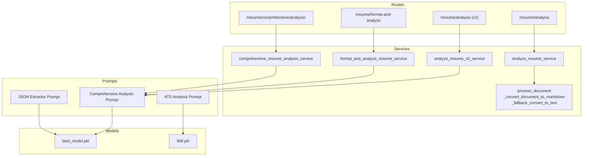
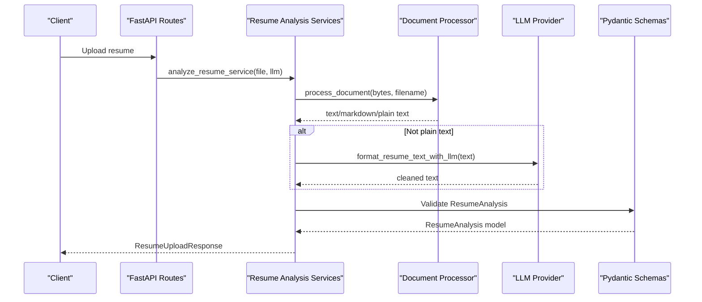
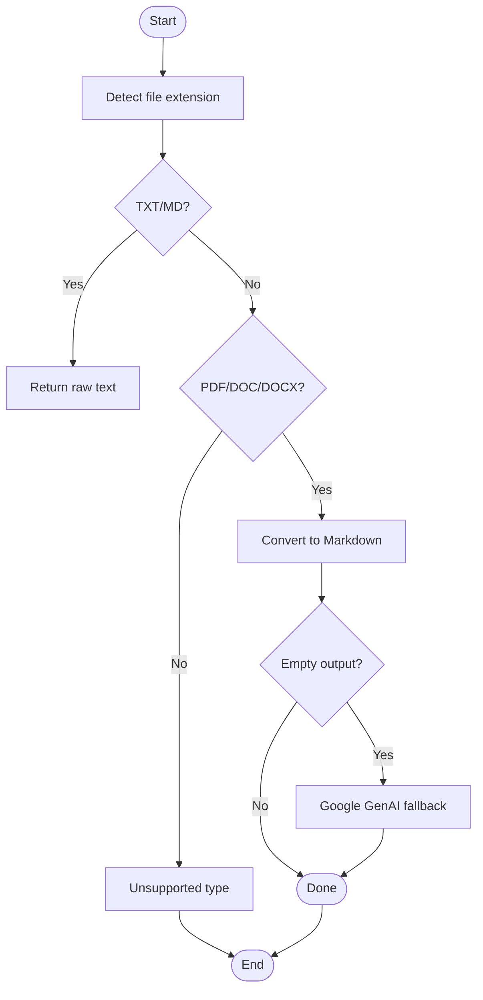
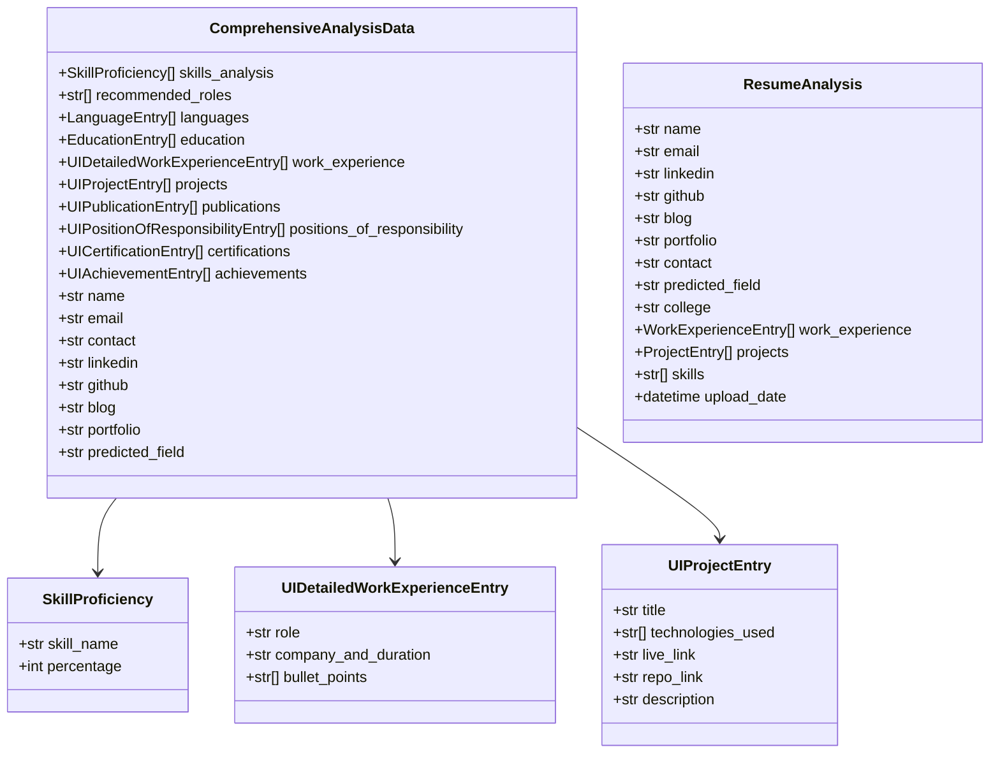
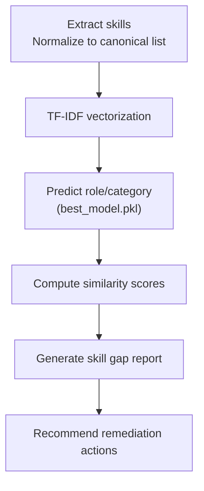
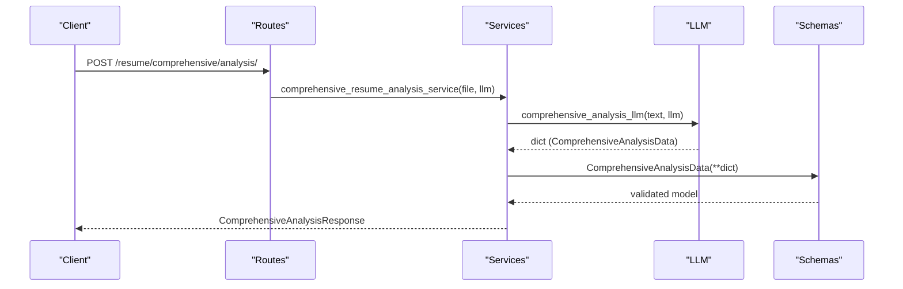
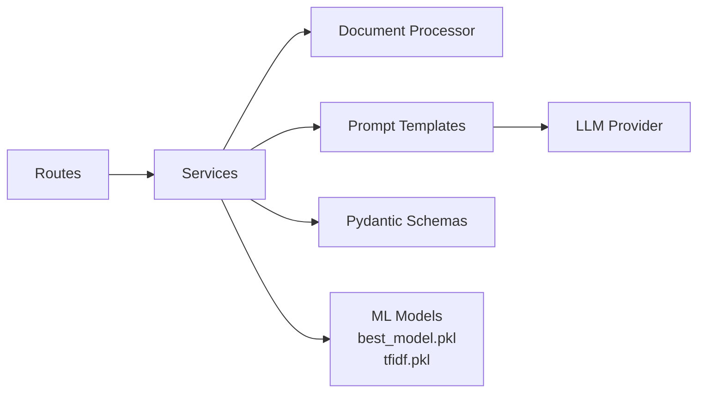

# NLP and Skill Extraction

<cite>
**Referenced Files in This Document**
- [process_resume.py](file://backend/app/services/process_resume.py)
- [resume_analysis.py](file://backend/app/services/resume_analysis.py)
- [resume_analysis_routes.py](file://backend/app/routes/resume_analysis.py)
- [json_extractor.py](file://backend/app/data/prompt/json_extractor.py)
- [comprehensive_analysis.py](file://backend/app/data/prompt/comprehensive_analysis.py)
- [ats_analysis.py](file://backend/app/data/prompt/ats_analysis.py)
- [schemas.py](file://backend/app/models/resume/schemas.py)
- [skills.py](file://backend/app/data/skills.py)
- [best_model.pkl](file://backend/app/model/best_model.pkl)
- [tfidf.pkl](file://backend/app/model/tfidf.pkl)
</cite>

## Table of Contents
1. [Introduction](#introduction)
2. [Project Structure](#project-structure)
3. [Core Components](#core-components)
4. [Architecture Overview](#architecture-overview)
5. [Detailed Component Analysis](#detailed-component-analysis)
6. [Dependency Analysis](#dependency-analysis)
7. [Performance Considerations](#performance-considerations)
8. [Troubleshooting Guide](#troubleshooting-guide)
9. [Conclusion](#conclusion)

## Introduction
This document describes the NLP and skill extraction subsystem powering resume analysis, structured data extraction, and predictive capabilities. It covers:
- Document ingestion and preprocessing
- Structured extraction via LLM prompts aligned to Pydantic schemas
- JSON validation and normalization
- Career path prediction and skill gap analysis using trained scikit-learn models
- TF-IDF vectorization for text similarity
- Model versioning, fallback strategies, and performance optimization

## Project Structure
The NLP subsystem spans three primary layers:
- Routes: Expose endpoints for resume analysis and comprehensive extraction
- Services: Orchestrate document processing, LLM calls, and schema validation
- Prompts and Models: Define extraction schemas, prompts, and ML assets

**Diagram sources**
- [resume_analysis_routes.py](file://backend/app/routes/resume_analysis.py#L1-L68)
- [resume_analysis.py](file://backend/app/services/resume_analysis.py#L28-L342)
- [process_resume.py](file://backend/app/services/process_resume.py#L12-L91)
- [json_extractor.py](file://backend/app/data/prompt/json_extractor.py#L5-L84)
- [comprehensive_analysis.py](file://backend/app/data/prompt/comprehensive_analysis.py#L5-L173)
- [ats_analysis.py](file://backend/app/data/prompt/ats_analysis.py#L4-L69)
- [best_model.pkl](file://backend/app/model/best_model.pkl)
- [tfidf.pkl](file://backend/app/model/tfidf.pkl)

**Section sources**
- [resume_analysis_routes.py](file://backend/app/routes/resume_analysis.py#L1-L68)
- [resume_analysis.py](file://backend/app/services/resume_analysis.py#L28-L342)
- [process_resume.py](file://backend/app/services/process_resume.py#L12-L91)
- [json_extractor.py](file://backend/app/data/prompt/json_extractor.py#L5-L84)
- [comprehensive_analysis.py](file://backend/app/data/prompt/comprehensive_analysis.py#L5-L173)
- [ats_analysis.py](file://backend/app/data/prompt/ats_analysis.py#L4-L69)
- [best_model.pkl](file://backend/app/model/best_model.pkl)
- [tfidf.pkl](file://backend/app/model/tfidf.pkl)

## Core Components
- Document processing and fallback conversion for PDFs and office documents
- Structured extraction using Pydantic-aligned prompts
- JSON normalization and validation
- Career path prediction and skill gap analysis using trained scikit-learn models
- TF-IDF vectorization for text similarity
- Schema-driven outputs for work experience, education, projects, skills, and more

**Section sources**
- [process_resume.py](file://backend/app/services/process_resume.py#L12-L91)
- [json_extractor.py](file://backend/app/data/prompt/json_extractor.py#L5-L84)
- [comprehensive_analysis.py](file://backend/app/data/prompt/comprehensive_analysis.py#L5-L173)
- [schemas.py](file://backend/app/models/resume/schemas.py#L21-L157)
- [best_model.pkl](file://backend/app/model/best_model.pkl)
- [tfidf.pkl](file://backend/app/model/tfidf.pkl)

## Architecture Overview
End-to-end flow from upload to structured output and predictions:

**Diagram sources**
- [resume_analysis_routes.py](file://backend/app/routes/resume_analysis.py#L16-L25)
- [resume_analysis.py](file://backend/app/services/resume_analysis.py#L28-L144)
- [process_resume.py](file://backend/app/services/process_resume.py#L68-L91)
- [schemas.py](file://backend/app/models/resume/schemas.py#L51-L64)

## Detailed Component Analysis

### Document Processing and Fallback Conversion
- Converts TXT/MD/PDF/DOCX to plain text/markdown
- Uses PyMuPDF and pymupdf4llm for robust parsing
- Falls back to Google GenAI multimodal conversion when PDF parsing fails and provider is Google/Gemini

**Diagram sources**
- [process_resume.py](file://backend/app/services/process_resume.py#L56-L91)

**Section sources**
- [process_resume.py](file://backend/app/services/process_resume.py#L12-L91)

### Structured Extraction with Pydantic Schemas
- Comprehensive analysis prompt defines a rich schema covering skills, work experience, projects, education, certifications, achievements, languages, and metadata
- JSON extractor prompt normalizes raw LLM outputs to a strict schema with validation rules
- Both prompts are constructed as LangChain PromptTemplates and chained to the LLM

Key schema highlights:
- ComprehensiveAnalysisData: Top-level container for all extracted sections
- SkillProficiency: Skill name and inferred proficiency percentage
- UIDetailedWorkExperienceEntry: Role, company_and_duration, bullet points
- UIProjectEntry: Title, technologies_used, links, description
- EducationEntry, UICertificationEntry, UIPositionOfResponsibilityEntry, UIPublicationEntry, UIAchievementEntry: Standardized entries
- ResumeAnalysis: Legacy schema for normalized JSON extraction

**Diagram sources**
- [comprehensive_analysis.py](file://backend/app/data/prompt/comprehensive_analysis.py#L14-L83)
- [schemas.py](file://backend/app/models/resume/schemas.py#L21-L64)

**Section sources**
- [comprehensive_analysis.py](file://backend/app/data/prompt/comprehensive_analysis.py#L5-L173)
- [json_extractor.py](file://backend/app/data/prompt/json_extractor.py#L5-L84)
- [schemas.py](file://backend/app/models/resume/schemas.py#L21-L64)

### Career Path Prediction and Skill Gap Analysis
- Trained scikit-learn model (GradientBoostingClassifier) stored as best_model.pkl
- Used to predict candidate roles and assist in skill gap analysis
- Typical workflow:
  - Extract skills and normalize to canonical list
  - Vectorize with TF-IDF (tfidf.pkl)
  - Predict role/category and compute similarity scores
  - Generate recommendations for missing skills

**Diagram sources**
- [best_model.pkl](file://backend/app/model/best_model.pkl)
- [tfidf.pkl](file://backend/app/model/tfidf.pkl)

**Section sources**
- [best_model.pkl](file://backend/app/model/best_model.pkl)
- [tfidf.pkl](file://backend/app/model/tfidf.pkl)

### TF-IDF Vectorization and Similarity
- TF-IDF vectors enable semantic similarity comparisons between candidate profiles and job descriptions
- Used alongside trained classifier for comprehensive scoring and recommendations

**Section sources**
- [tfidf.pkl](file://backend/app/model/tfidf.pkl)
- [ats_analysis.py](file://backend/app/data/prompt/ats_analysis.py#L4-L69)

### Skill Catalog and Normalization
- Canonical skill list maintained centrally for consistent extraction and matching
- Supports normalization and enrichment during analysis

**Section sources**
- [skills.py](file://backend/app/data/skills.py#L1-L162)

### API Endpoints and Workflows
- File-based analysis: Upload resume, preprocess, clean, validate, and return structured data
- Comprehensive analysis: Full extraction pipeline with rich schema alignment
- Text-based analysis: Accept preformatted text and run comprehensive extraction
- Validation ensures robustness against malformed inputs

**Diagram sources**
- [resume_analysis_routes.py](file://backend/app/routes/resume_analysis.py#L28-L37)
- [resume_analysis.py](file://backend/app/services/resume_analysis.py#L159-L225)
- [comprehensive_analysis.py](file://backend/app/data/prompt/comprehensive_analysis.py#L170-L173)
- [schemas.py](file://backend/app/models/resume/schemas.py#L44-L48)

**Section sources**
- [resume_analysis_routes.py](file://backend/app/routes/resume_analysis.py#L1-L68)
- [resume_analysis.py](file://backend/app/services/resume_analysis.py#L159-L225)

## Dependency Analysis
- Routes depend on services for orchestration
- Services depend on:
  - Document processor for text extraction
  - LLM chains for structured extraction
  - Pydantic schemas for validation
  - ML assets (best_model.pkl, tfidf.pkl) for predictions and similarity
- Prompts define the contract between unstructured text and structured outputs

**Diagram sources**
- [resume_analysis_routes.py](file://backend/app/routes/resume_analysis.py#L1-L68)
- [resume_analysis.py](file://backend/app/services/resume_analysis.py#L1-L30)
- [process_resume.py](file://backend/app/services/process_resume.py#L1-L25)
- [json_extractor.py](file://backend/app/data/prompt/json_extractor.py#L1-L3)
- [comprehensive_analysis.py](file://backend/app/data/prompt/comprehensive_analysis.py#L1-L3)
- [schemas.py](file://backend/app/models/resume/schemas.py#L1-L18)
- [best_model.pkl](file://backend/app/model/best_model.pkl)
- [tfidf.pkl](file://backend/app/model/tfidf.pkl)

**Section sources**
- [resume_analysis_routes.py](file://backend/app/routes/resume_analysis.py#L1-L68)
- [resume_analysis.py](file://backend/app/services/resume_analysis.py#L1-L30)
- [process_resume.py](file://backend/app/services/process_resume.py#L1-L25)
- [json_extractor.py](file://backend/app/data/prompt/json_extractor.py#L1-L3)
- [comprehensive_analysis.py](file://backend/app/data/prompt/comprehensive_analysis.py#L1-L3)
- [schemas.py](file://backend/app/models/resume/schemas.py#L1-L18)
- [best_model.pkl](file://backend/app/model/best_model.pkl)
- [tfidf.pkl](file://backend/app/model/tfidf.pkl)

## Performance Considerations
- Prefer plain text or markdown inputs to avoid heavy parsing overhead
- Cache TF-IDF vectors and model predictions where feasible
- Use streaming or chunked processing for long documents
- Monitor LLM latency and apply retry/backoff strategies
- Validate early to reduce downstream processing costs

## Troubleshooting Guide
Common issues and resolutions:
- Unsupported file type: Ensure TXT/MD/PDF/DOCX; check extension handling
- Empty or unreadable PDF: Trigger fallback conversion if provider supports it
- LLM errors: Validate API keys and provider configuration; ensure model availability
- Schema validation failures: Review prompt instructions and refine extraction logic
- Missing predictions: Verify model and vectorizer files are present and loadable

Operational checks:
- Confirm GOOGLE_API_KEY and provider settings for fallback conversion
- Validate Pydantic schema compliance for extracted data
- Test TF-IDF and model loading independently

**Section sources**
- [process_resume.py](file://backend/app/services/process_resume.py#L12-L53)
- [resume_analysis.py](file://backend/app/services/resume_analysis.py#L96-L103)
- [schemas.py](file://backend/app/models/resume/schemas.py#L51-L64)

## Conclusion
The NLP and skill extraction subsystem integrates robust document processing, schema-driven extraction, and trained ML models to deliver accurate, structured insights from resumes. By leveraging Pydantic schemas, validated prompts, and trained classifiers with TF-IDF similarity, it enables comprehensive analysis, career path prediction, and actionable skill gap recommendations while maintaining reliability through fallback strategies and validation.