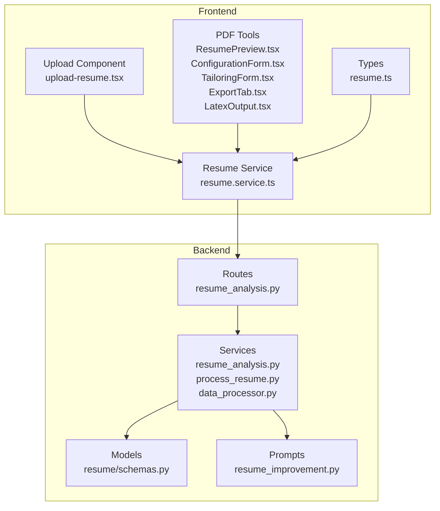
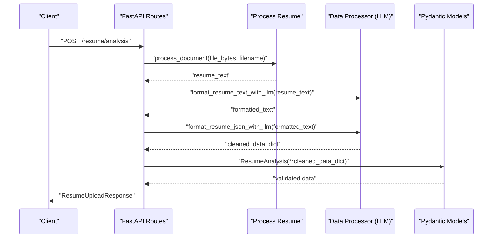
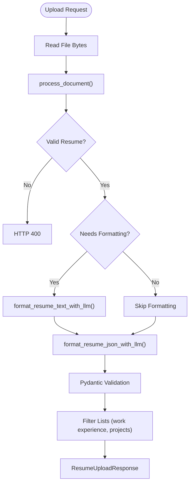
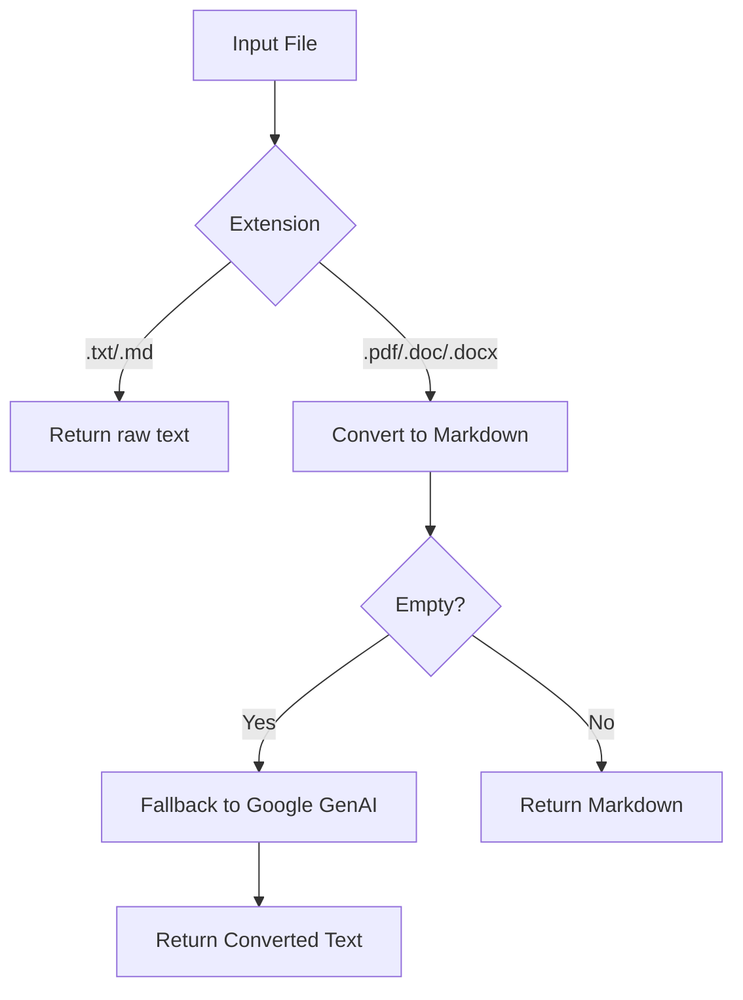
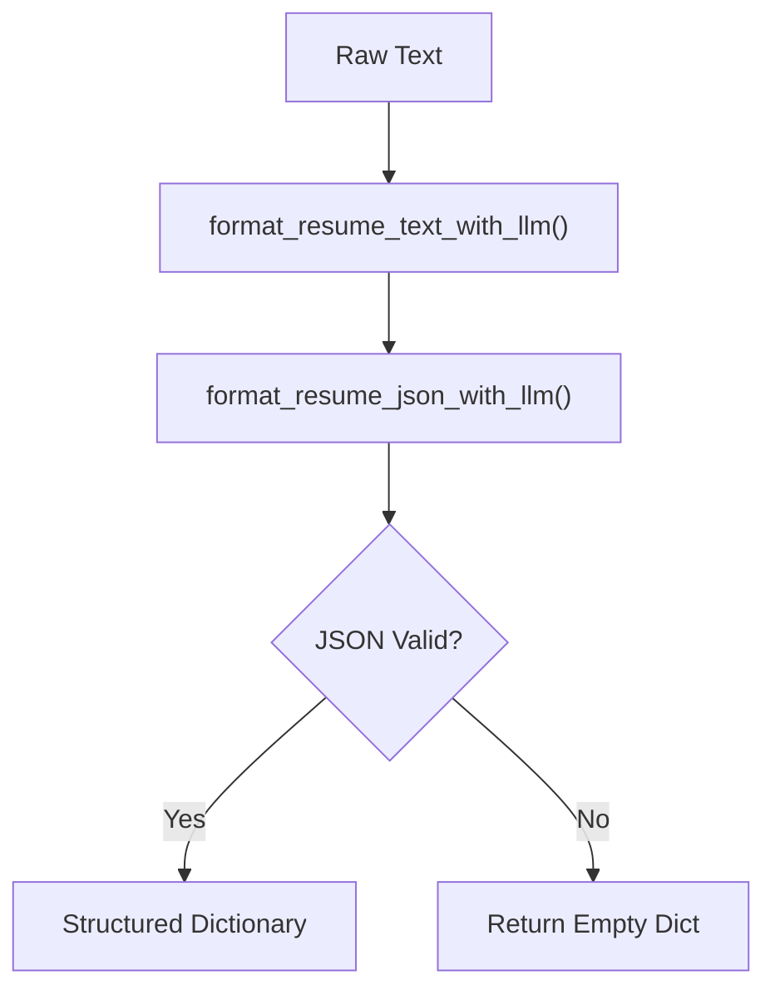
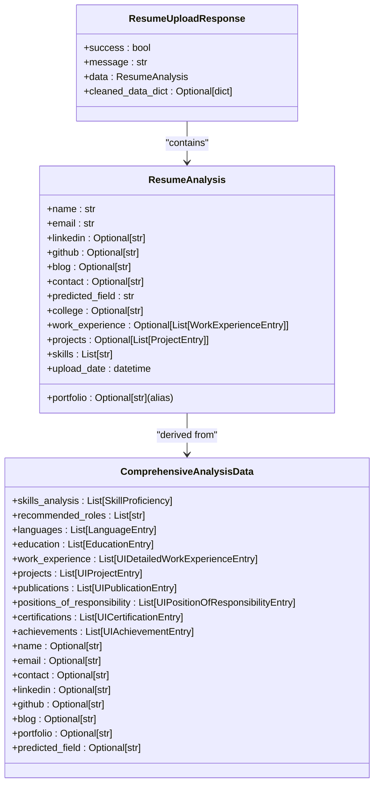
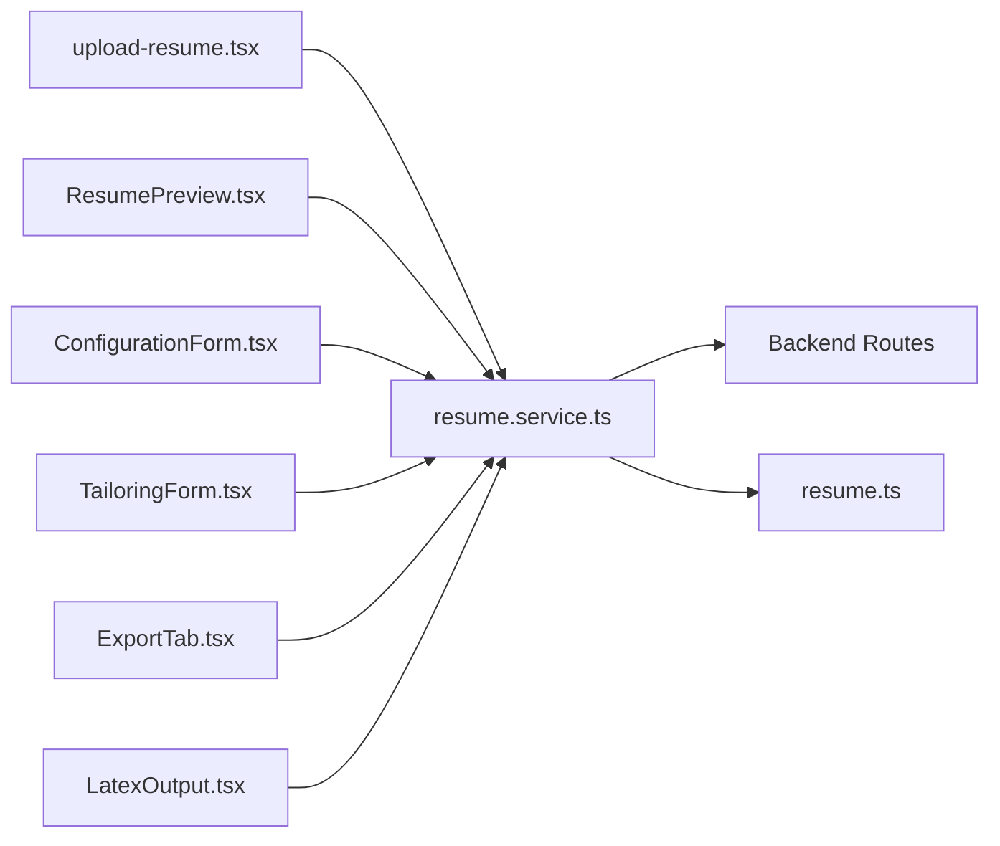
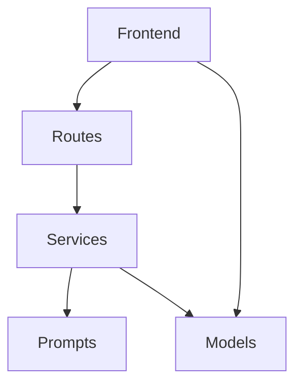

# Resume analysis engine

## Introduction
The Resume Analysis Engine is a detailed system designed to transform unstructured resume documents into structured, analyzable data. It integrates document parsing, text cleaning, NLP-powered extraction, and structured output generation. The engine supports multiple input formats (TXT, MD, PDF, DOC/DOCX), performs reliable validation, and produces standardized schemas consumable by downstream systems such as ATS scoring, recommendation engines, and PDF generation.

Key capabilities:
- Multi-format document ingestion and conversion
- Text formatting and cleaning via LLM
- Structured data extraction using JSON-parsing prompts
- Detailed analysis including skills, experiences, projects, and recommendations
- Frontend components for preview, PDF processing, and analysis display
- Data models for resume storage and enrichment history

## Project structure
The Resume Analysis Engine spans backend APIs, services, prompts, and frontend components:

```mermaid
graph TB
subgraph "Backend"
R["Routes<br/>resume_analysis.py"]
S["Services<br/>resume_analysis.py<br/>process_resume.py<br/>data_processor.py"]
M["Models<br/>resume/schemas.py"]
P["Prompts<br/>resume_improvement.py"]
end
subgraph "Frontend"
F1["Upload Component<br/>upload-resume.tsx"]
F2["Resume Service<br/>resume.service.ts"]
F3["Types<br/>resume.ts"]
F4["PDF Tools<br/>ResumePreview.tsx<br/>ConfigurationForm.tsx<br/>TailoringForm.tsx<br/>ExportTab.tsx<br/>LatexOutput.tsx"]
end
R --> S
S --> M
S --> P
F1 --> F2
F2 --> R
F4 --> F2
F3 --> F2
```

## Core components
- Routes: Expose endpoints for resume upload, detailed analysis, and format-and-analyze workflows.
- Services: Implement the processing pipeline, including document conversion, text formatting, JSON extraction, and validation.
- Prompts: Define structured prompts for text formatting, JSON extraction, and detailed analysis.
- Models: Define typed schemas for structured outputs and API responses.
- Frontend: Provide upload, preview, and PDF generation UI components.

## Architecture overview
The system follows a layered architecture:
- Presentation Layer: FastAPI routes expose endpoints for file uploads and text-based analysis.
- Application Layer: Services orchestrate document processing, LLM interactions, and data validation.
- Data Layer: Typed schemas define the structure of extracted and enriched data.
- Frontend Layer: React components handle user interactions, previews, and PDF generation.

```mermaid
sequenceDiagram
participant Client as "Client"
participant API as "FastAPI Routes"
participant Proc as "Process Resume"
participant LLM as "Data Processor (LLM)"
participant Model as "Pydantic Models"
Client->>API : "POST /resume/analysis"
API->>Proc : "process_document(file_bytes, filename)"
Proc-->>API : "resume_text"
API->>LLM : "format_resume_text_with_llm(resume_text)"
LLM-->>API : "formatted_text"
API->>LLM : "format_resume_json_with_llm(formatted_text)"
LLM-->>API : "cleaned_data_dict"
API->>Model : "ResumeAnalysis(**cleaned_data_dict)"
Model-->>API : "validated data"
API-->>Client : "ResumeUploadResponse"
```

## Detailed component analysis

### Backend routes
- File-based analysis endpoint: Accepts uploaded files, processes them, formats text if needed, validates content, extracts structured JSON, and returns a typed response.
- Detailed analysis endpoint: Performs a full analysis and returns a structured dataset.
- Format-and-analyze endpoint: Converts raw text to a standardized format and returns analysis results.
- Text-based analysis endpoint: Accepts pre-formatted text and returns detailed analysis.

```mermaid
flowchart TD
Start(["Upload Request"]) --> ReadFile["Read File Bytes"]
ReadFile --> ProcessDoc["process_document()"]
ProcessDoc --> ValidCheck{"Valid Resume?"}
ValidCheck -- No --> Error["HTTP 400"]
ValidCheck -- Yes --> FormatText{"Needs Formatting?"}
FormatText -- Yes --> LLMText["format_resume_text_with_llm()"]
FormatText -- No --> SkipText["Skip Formatting"]
LLMText --> LLMJson["format_resume_json_with_llm()"]
SkipText --> LLMJson
LLMJson --> Validate["Pydantic Validation"]
Validate --> Filter["Filter Lists (work experience, projects)"]
Filter --> Response["ResumeUploadResponse"]
```

### Document processing pipeline
- Supports TXT, MD, PDF, DOC/DOCX.
- Uses PyMuPDF to convert to Markdown for consistent parsing.
- Includes a fallback conversion using Google GenAI for PDFs when configured.
- Validates resume presence of key sections using heuristics.

```mermaid
flowchart TD
A["Input File"] --> B{"Extension"}
B --> |.txt/.md| C["Return raw text"]
B --> |.pdf/.doc/.docx| D["Convert to Markdown"]
D --> E{"Empty?"}
E --> |Yes| F["Fallback to Google GenAI"]
E --> |No| G["Return Markdown"]
F --> H["Return Converted Text"]
```

### LLM integration and JSON extraction
- Text formatting: Uses a dedicated chain to normalize resume text.
- JSON extraction: Parses LLM responses to ensure valid dictionaries.
- Detailed analysis: Builds a unified analysis dictionary with skills, experiences, projects, and recommendations.
- Fallbacks: Reliable JSON parsing handles fenced blocks, standalone JSON, and extracted substrings.

```mermaid
flowchart TD
T["Raw Text"] --> Fmt["format_resume_text_with_llm()"]
Fmt --> J["format_resume_json_with_llm()"]
J --> Parse{"JSON Valid?"}
Parse --> |Yes| Out["Structured Dictionary"]
Parse --> |No| Fallback["Return Empty Dict"]
```

### Detailed analysis and structured output
- Detailed analysis returns a rich dataset including skills, languages, education, work experience, projects, certifications, achievements, and recommended roles.
- Portfolio links are normalized from various field aliases.
- Validation ensures data integrity and provides meaningful error messages.

```mermaid
classDiagram
class ComprehensiveAnalysisData {
+skills_analysis : List[SkillProficiency]
+recommended_roles : List[str]
+languages : List[LanguageEntry]
+education : List[EducationEntry]
+work_experience : List[UIDetailedWorkExperienceEntry]
+projects : List[UIProjectEntry]
+publications : List[UIPublicationEntry]
+positions_of_responsibility : List[UIPositionOfResponsibilityEntry]
+certifications : List[UICertificationEntry]
+achievements : List[UIAchievementEntry]
+name : Optional[str]
+email : Optional[str]
+contact : Optional[str]
+linkedin : Optional[str]
+github : Optional[str]
+blog : Optional[str]
+portfolio : Optional[str]
+predicted_field : Optional[str]
}
class ResumeAnalysis {
+name : str
+email : str
+linkedin : Optional[str]
+github : Optional[str]
+blog : Optional[str]
+portfolio : Optional[str] (alias)
+contact : Optional[str]
+predicted_field : str
+college : Optional[str]
+work_experience : Optional[List[WorkExperienceEntry]]
+projects : Optional[List[ProjectEntry]]
+skills : List[str]
+upload_date : datetime
}
class ResumeUploadResponse {
+success : bool
+message : str
+data : ResumeAnalysis
+cleaned_data_dict : Optional[dict]
}
ResumeUploadResponse --> ResumeAnalysis : "contains"
ResumeAnalysis --> ComprehensiveAnalysisData : "derived from"
```

### Frontend components for resume preview, PDF processing, and analysis display
- Upload Component: Handles file selection and submission to backend.
- Resume Service: Manages API calls for analysis and retrieval.
- Types: Define TypeScript interfaces for resume data structures.
- PDF Tools: Provide preview, configuration, tailoring, export, and LaTeX output components.

```mermaid
graph LR
Upload["upload-resume.tsx"] --> Service["resume.service.ts"]
Service --> Routes["Backend Routes"]
Service --> Types["resume.ts"]
Preview["ResumePreview.tsx"] --> Service
Config["ConfigurationForm.tsx"] --> Service
Tailor["TailoringForm.tsx"] --> Service
Export["ExportTab.tsx"] --> Service
Latex["LatexOutput.tsx"] --> Service
```

### Data models for resume storage, analysis results, and enrichment history
- Prisma Schema: Defines database models for resumes, analysis results, and enrichment history.
- Resume Data Interfaces: TypeScript interfaces mirror backend schemas for frontend consumption.

Note: The Prisma schema file path is referenced below for completeness; consult the file for precise model definitions.

## Dependency analysis
The system exhibits clear separation of concerns:
- Routes depend on Services for processing logic.
- Services depend on Prompts and LLM helpers for text formatting and JSON extraction.
- Models provide type safety for responses and internal structures.
- Frontend depends on backend services and shared types.

```mermaid
graph TB
Routes["Routes"] --> Services["Services"]
Services --> Prompts["Prompts"]
Services --> Models["Models"]
Frontend["Frontend"] --> Routes
Frontend --> Models
```

## Performance considerations
- Document conversion: Prefer native text formats (TXT/MD) to avoid heavy conversions.
- LLM calls: Batch operations where possible; cache formatted text and validated JSON to reduce redundant processing.
- Large documents: Implement pagination for lists (work experience, projects) and filter empty/low-quality entries early.
- Rate limiting: Handle LLM rate limits gracefully by falling back to original text and retrying later.
- Memory: Stream file reads/writes and remove temporary files promptly after processing.

## Troubleshooting guide
Common issues and resolutions:
- Unsupported file type: Ensure the file extension is one of TXT, MD, PDF, DOC/DOCX.
- Empty or invalid resume text: Verify the document contains recognized resume keywords or sections.
- LLM errors: Check authentication and rate limits; the system falls back to original text when appropriate.
- JSON parsing failures: The system attempts multiple strategies to extract valid JSON; if all fail, returns an empty dictionary.

## Conclusion
The Resume Analysis Engine provides a reliable, extensible pipeline for transforming resumes into structured, actionable insights. By combining reliable document processing, resilient LLM integration, and strongly typed models, it enables downstream applications such as ATS scoring, recommendations, and PDF generation. The frontend components offer a cohesive user experience for uploading, previewing, and exporting resumes.

## Appendices

### Implementation examples
- Resume upload and analysis:
  - Endpoint: POST /resume/analysis
  - Behavior: Processes file, formats text if needed, extracts structured JSON, validates, filters lists, and returns a typed response.
  - Reference: `analyze_resume_service`

- Detailed analysis:
  - Endpoint: POST /resume/detailed/analysis/
  - Behavior: Validates resume content, performs detailed analysis, normalizes portfolio links, and returns structured data.
  - Reference: `comprehensive_resume_analysis_service`

- Format-and-analyze:
  - Endpoint: POST /resume/format-and-analyze
  - Behavior: Converts raw text to Markdown, formats and analyzes, normalizes portfolio links, and returns cleaned text and analysis.
  - Reference: `format_and_analyze_resume_service`

- Text-based analysis:
  - Endpoint: POST /resume/analysis (text-based)
  - Behavior: Accepts formatted text, performs detailed analysis, and returns structured data.
  - Reference: `analyze_resume_v2_service`

- Frontend integration:
  - Upload component: `upload-resume.tsx`
  - Service: `resume.service.ts`
  - Types: `resume.ts`

- Data models:
  - Backend schemas: `schemas.py`
  - Prisma schema: `schema.prisma`
