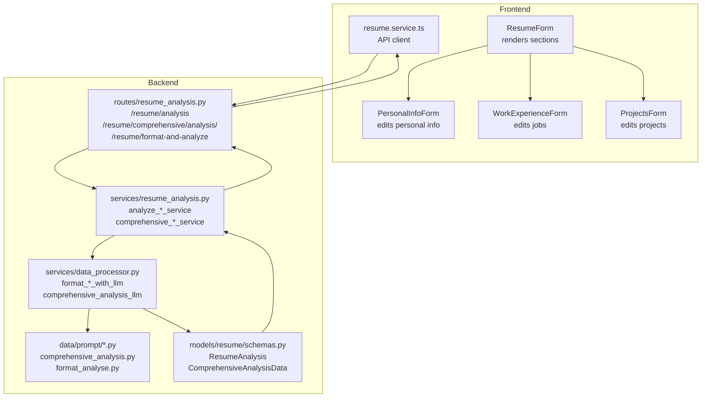
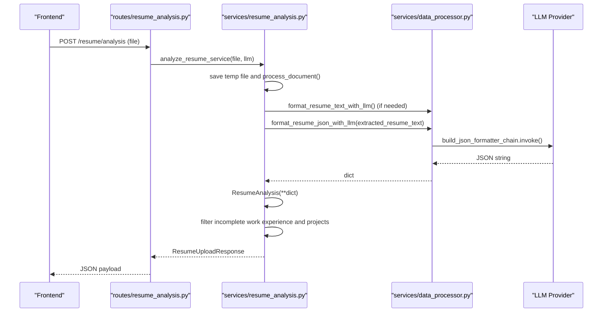
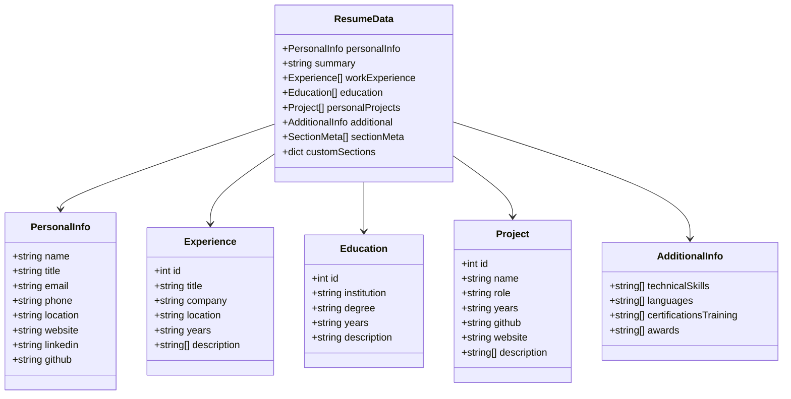
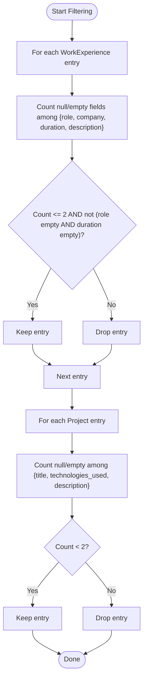
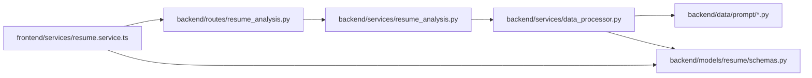

# Structured Data Extraction

<cite>
**Referenced Files in This Document**
- [comprehensive_analysis.py](file://backend/app/data/prompt/comprehensive_analysis.py)
- [format_analyse.py](file://backend/app/data/prompt/format_analyse.py)
- [schemas.py](file://backend/app/models/resume/schemas.py)
- [schemas.py](file://backend/app/models/resume_data/schemas.py)
- [resume_analysis.py](file://backend/app/services/resume_analysis.py)
- [data_processor.py](file://backend/app/services/data_processor.py)
- [resume_analysis.py](file://backend/app/routes/resume_analysis.py)
- [resume-form.tsx](file://frontend/components/resume-editor/resume-form.tsx)
- [personal-info-form.tsx](file://frontend/components/resume-editor/forms/personal-info-form.tsx)
- [work-experience-form.tsx](file://frontend/components/resume-editor/forms/work-experience-form.tsx)
- [projects-form.tsx](file://frontend/components/resume-editor/forms/projects-form.tsx)
- [resume.service.ts](file://frontend/services/resume.service.ts)
</cite>

## Table of Contents
1. [Introduction](#introduction)
2. [Project Structure](#project-structure)
3. [Core Components](#core-components)
4. [Architecture Overview](#architecture-overview)
5. [Detailed Component Analysis](#detailed-component-analysis)
6. [Dependency Analysis](#dependency-analysis)
7. [Performance Considerations](#performance-considerations)
8. [Troubleshooting Guide](#troubleshooting-guide)
9. [Conclusion](#conclusion)
10. [Appendices](#appendices)

## Introduction
This document explains the structured data extraction system that parses resume layouts, extracts semantic information, and standardizes it into structured formats. It covers:
- Format analysis prompts that guide LLM-based parsing and normalization
- The ComprehensiveAnalysisData schema that standardizes extracted information
- The ResumeAnalysis model with fields for personal info, work experience, education, projects, skills, and portfolio links
- Data cleaning and validation processes ensuring consistency across formats
- Frontend integration for displaying and editing extracted data
- Filtering logic for work experience and project validation that removes incomplete entries
- Examples of before/after transformations from raw text to structured JSON
- Data enrichment strategies and cross-field validation rules

## Project Structure
The system spans backend LLM orchestration, schema definitions, and frontend editing UI:
- Backend prompt templates define extraction tasks and schemas
- Services orchestrate document processing, LLM calls, and validation
- Routes expose endpoints for file-based and text-based analysis
- Frontend components render and edit structured resume data

**Diagram sources**
- [resume_analysis.py](file://backend/app/routes/resume_analysis.py#L1-L68)
- [resume_analysis.py](file://backend/app/services/resume_analysis.py#L1-L364)
- [data_processor.py](file://backend/app/services/data_processor.py#L1-L409)
- [comprehensive_analysis.py](file://backend/app/data/prompt/comprehensive_analysis.py#L1-L173)
- [format_analyse.py](file://backend/app/data/prompt/format_analyse.py#L1-L174)
- [schemas.py](file://backend/app/models/resume/schemas.py#L21-L157)
- [resume-form.tsx](file://frontend/components/resume-editor/resume-form.tsx#L1-L195)
- [personal-info-form.tsx](file://frontend/components/resume-editor/forms/personal-info-form.tsx#L1-L132)
- [work-experience-form.tsx](file://frontend/components/resume-editor/forms/work-experience-form.tsx#L1-L244)
- [projects-form.tsx](file://frontend/components/resume-editor/forms/projects-form.tsx#L1-L214)
- [resume.service.ts](file://frontend/services/resume.service.ts#L1-L66)

**Section sources**
- [resume_analysis.py](file://backend/app/routes/resume_analysis.py#L1-L68)
- [resume_analysis.py](file://backend/app/services/resume_analysis.py#L1-L364)
- [data_processor.py](file://backend/app/services/data_processor.py#L1-L409)
- [comprehensive_analysis.py](file://backend/app/data/prompt/comprehensive_analysis.py#L1-L173)
- [format_analyse.py](file://backend/app/data/prompt/format_analyse.py#L1-L174)
- [schemas.py](file://backend/app/models/resume/schemas.py#L21-L157)
- [resume-form.tsx](file://frontend/components/resume-editor/resume-form.tsx#L1-L195)
- [personal-info-form.tsx](file://frontend/components/resume-editor/forms/personal-info-form.tsx#L1-L132)
- [work-experience-form.tsx](file://frontend/components/resume-editor/forms/work-experience-form.tsx#L1-L244)
- [projects-form.tsx](file://frontend/components/resume-editor/forms/projects-form.tsx#L1-L214)
- [resume.service.ts](file://frontend/services/resume.service.ts#L1-L66)

## Core Components
- Format analysis prompts: Define extraction tasks and Pydantic schemas for LLM parsing
- ComprehensiveAnalysisData: Standardized schema capturing personal info, skills, languages, education, work experience, projects, publications, positions of responsibility, certifications, achievements, and portfolio links
- ResumeAnalysis: Model for upload responses with normalized fields and timestamps
- Data processor: Orchestrates text formatting, JSON formatting, and comprehensive analysis via LLM chains
- Validation and filtering: Removes incomplete entries from work experience and projects
- Frontend integration: Renders and edits structured resume data with drag-and-drop ordering and inline editing

**Section sources**
- [comprehensive_analysis.py](file://backend/app/data/prompt/comprehensive_analysis.py#L5-L173)
- [format_analyse.py](file://backend/app/data/prompt/format_analyse.py#L5-L174)
- [schemas.py](file://backend/app/models/resume/schemas.py#L21-L157)
- [data_processor.py](file://backend/app/services/data_processor.py#L26-L342)
- [resume_analysis.py](file://backend/app/services/resume_analysis.py#L105-L140)
- [resume-form.tsx](file://frontend/components/resume-editor/resume-form.tsx#L1-L195)

## Architecture Overview
The system follows a pipeline:
- Upload resume file or send formatted text
- Optionally format raw text with LLM
- Extract and normalize structured data with LLM
- Validate and filter incomplete entries
- Return standardized schema for frontend rendering and editing

**Diagram sources**
- [resume_analysis.py](file://backend/app/routes/resume_analysis.py#L16-L25)
- [resume_analysis.py](file://backend/app/services/resume_analysis.py#L28-L144)
- [data_processor.py](file://backend/app/services/data_processor.py#L26-L130)

## Detailed Component Analysis

### Format Analysis Prompts
The prompts define extraction tasks and Pydantic schemas for LLM parsing:
- comprehensive_analysis.py: Defines ComprehensiveAnalysisData with fields for personal info, skills, languages, education, work experience, projects, publications, positions of responsibility, certifications, achievements, and portfolio links
- format_analyse.py: Mirrors the same schema for format-and-analyze workflows

Key behaviors:
- Extraction instructions prioritize direct extraction and mark inferred values
- Output format requires a single JSON object instantiating ComprehensiveAnalysisData
- Aliased fields support flexible mapping for portfolio links

**Section sources**
- [comprehensive_analysis.py](file://backend/app/data/prompt/comprehensive_analysis.py#L5-L173)
- [format_analyse.py](file://backend/app/data/prompt/format_analyse.py#L5-L174)

### ComprehensiveAnalysisData Schema
Standardized schema capturing:
- Personal info: name, email, contact, LinkedIn, GitHub, blog, portfolio
- Skills: top 5–7 skills with percentages
- Languages, education, work experience, projects, publications, positions of responsibility, certifications, achievements
- Predicted field: inferred role/category
- Aliased portfolio field supports multiple link aliases

This schema ensures consistent downstream processing and UI rendering.

**Section sources**
- [schemas.py](file://backend/app/models/resume/schemas.py#L21-L47)

### ResumeAnalysis Model
Fields include:
- Personal info and portfolio
- Predicted field
- College
- Work experience entries
- Projects
- Skills list
- Upload timestamp

The model normalizes extracted data into a concise upload response.

**Section sources**
- [schemas.py](file://backend/app/models/resume/schemas.py#L51-L64)

### Data Cleaning and Validation
Backend validation and filtering:
- Text formatting: Attempts to clean/format raw text using LLM when needed
- JSON formatting: Robust parsing of LLM JSON output with multiple fallbacks
- Validation: Converts dict to ResumeAnalysis; handles alias mapping for portfolio
- Filtering:
  - Work experience: Removes entries with more than two missing/empty fields and missing role/duration combinations
  - Projects: Keeps entries with fewer than two missing fields among title, technologies_used, description

These steps ensure minimal noise and consistent quality across diverse resume formats.

**Section sources**
- [data_processor.py](file://backend/app/services/data_processor.py#L26-L130)
- [resume_analysis.py](file://backend/app/services/resume_analysis.py#L69-L140)

### Frontend Integration
Frontend components:
- ResumeForm orchestrates section rendering, expansion, visibility toggles, and drag-and-drop reordering
- PersonalInfoForm edits name, email, contact, LinkedIn, GitHub, portfolio, and blog
- WorkExperienceForm edits roles, companies/durations, and bullet points
- ProjectsForm edits titles, technologies, descriptions, and links

The API client integrates with backend endpoints to upload and update resume data.

**Diagram sources**
- [schemas.py](file://backend/app/models/resume_data/schemas.py#L114-L327)

**Section sources**
- [resume-form.tsx](file://frontend/components/resume-editor/resume-form.tsx#L1-L195)
- [personal-info-form.tsx](file://frontend/components/resume-editor/forms/personal-info-form.tsx#L1-L132)
- [work-experience-form.tsx](file://frontend/components/resume-editor/forms/work-experience-form.tsx#L1-L244)
- [projects-form.tsx](file://frontend/components/resume-editor/forms/projects-form.tsx#L1-L214)
- [schemas.py](file://backend/app/models/resume_data/schemas.py#L114-L327)

### Filtering Logic for Work Experience and Projects
Filtering criteria:
- Work experience: Remove entries where more than two fields are null/empty; also remove if role is missing and duration is missing
- Projects: Keep entries where fewer than two of {title, technologies_used, description} are missing

This logic preserves meaningful entries while discarding near-empty or ambiguous records.

**Diagram sources**
- [resume_analysis.py](file://backend/app/services/resume_analysis.py#L105-L140)

**Section sources**
- [resume_analysis.py](file://backend/app/services/resume_analysis.py#L105-L140)

### Before/After Data Transformation Examples
- Raw text: Unstructured resume content with varied formatting and free-text descriptions
- After LLM extraction and normalization: Structured JSON conforming to ComprehensiveAnalysisData, with:
  - Personal info fields
  - Skills with percentages
  - Work experience entries with role, company_and_duration, and bullet_points
  - Projects with title, technologies_used, live_link, repo_link, description
  - Portfolio links mapped via aliases

The transformation pipeline:
- Extract raw text from uploaded file
- Optionally format text with LLM
- Parse and normalize JSON with LLM
- Convert to ResumeAnalysis or ComprehensiveAnalysisData
- Filter incomplete entries
- Return standardized data for frontend display/editing

**Section sources**
- [data_processor.py](file://backend/app/services/data_processor.py#L26-L130)
- [resume_analysis.py](file://backend/app/services/resume_analysis.py#L28-L144)
- [schemas.py](file://backend/app/models/resume/schemas.py#L21-L47)

### Data Enrichment Strategies and Cross-Field Validation
Enrichment strategies:
- Inference rules: When fields are missing, infer based on predicted_field and statistical averages; mark inferred values distinctly
- Statistical defaults: Suggest typical roles, skills, and education based on predicted_category

Cross-field validation rules:
- Portfolio link aliasing: Support multiple aliases for portfolio links and map to a single field
- Filtering thresholds: Enforce minimum completeness for work experience and projects
- AI phrase replacements: Normalize bullet points and descriptions for consistency

**Section sources**
- [comprehensive_analysis.py](file://backend/app/data/prompt/comprehensive_analysis.py#L156-L159)
- [resume_analysis.py](file://backend/app/services/resume_analysis.py#L87-L94)
- [data_processor.py](file://backend/app/services/data_processor.py#L144-L184)

## Dependency Analysis
High-level dependencies:
- Routes depend on services
- Services depend on data_processor for LLM orchestration
- data_processor depends on prompt templates and LLM helpers
- Models define schemas consumed by services and used in responses
- Frontend depends on API client and renders structured data

**Diagram sources**
- [resume.service.ts](file://frontend/services/resume.service.ts#L1-L66)
- [resume_analysis.py](file://backend/app/routes/resume_analysis.py#L1-L68)
- [resume_analysis.py](file://backend/app/services/resume_analysis.py#L1-L364)
- [data_processor.py](file://backend/app/services/data_processor.py#L1-L409)
- [schemas.py](file://backend/app/models/resume/schemas.py#L21-L157)

**Section sources**
- [resume_analysis.py](file://backend/app/routes/resume_analysis.py#L1-L68)
- [resume_analysis.py](file://backend/app/services/resume_analysis.py#L1-L364)
- [data_processor.py](file://backend/app/services/data_processor.py#L1-L409)
- [schemas.py](file://backend/app/models/resume/schemas.py#L21-L157)
- [resume.service.ts](file://frontend/services/resume.service.ts#L1-L66)

## Performance Considerations
- LLM retries and fallbacks: The JSON formatter includes multiple strategies to recover from malformed outputs
- Rate limiting and auth handling: Text formatter gracefully falls back to original text on rate limit or auth errors
- Validation cost: Filtering occurs after LLM parsing to minimize unnecessary processing
- Frontend responsiveness: Drag-and-drop and inline editing reduce round-trips by batching updates

[No sources needed since this section provides general guidance]

## Troubleshooting Guide
Common issues and resolutions:
- Unsupported file type or processing errors: The service raises HTTP 400 with details
- Invalid resume format: Validation checks fail and return descriptive errors
- LLM unavailability or empty results: Dedicated exception class and HTTP 500 responses
- JSON parsing failures: Multiple fallbacks attempt to extract and parse JSON substrings
- Portfolio alias mismatch: Ensure one of the supported aliases is present; mapping logic normalizes to portfolio

**Section sources**
- [resume_analysis.py](file://backend/app/services/resume_analysis.py#L53-L73)
- [resume_analysis.py](file://backend/app/services/resume_analysis.py#L194-L198)
- [data_processor.py](file://backend/app/services/data_processor.py#L115-L129)
- [data_processor.py](file://backend/app/services/data_processor.py#L213-L245)

## Conclusion
The structured data extraction system combines robust prompt engineering, strict schema enforcement, and pragmatic validation to transform heterogeneous resume inputs into standardized, editable data. The frontend enables efficient authoring and refinement, while backend safeguards ensure reliability and consistency across diverse inputs.

[No sources needed since this section summarizes without analyzing specific files]

## Appendices

### Endpoint Reference
- POST /resume/analysis: Analyze uploaded resume file
- POST /resume/comprehensive/analysis/: Comprehensive analysis of uploaded resume
- POST /resume/format-and-analyze: Format and analyze resume from file (v2)
- POST /resume/analysis: Analyze pre-formatted resume text (v2)

**Section sources**
- [resume_analysis.py](file://backend/app/routes/resume_analysis.py#L16-L67)