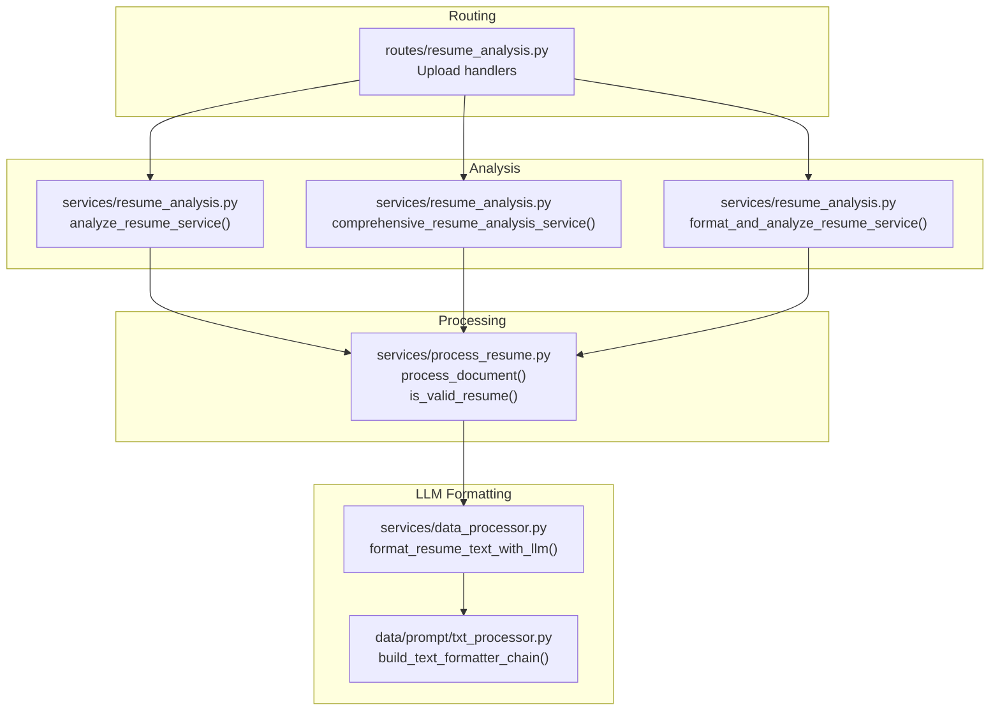
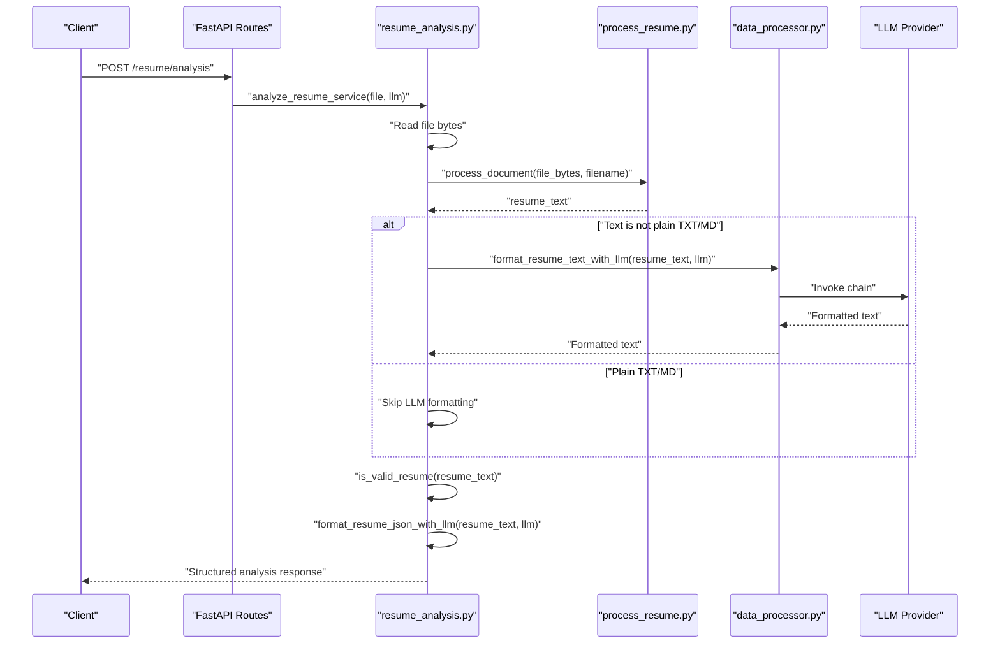
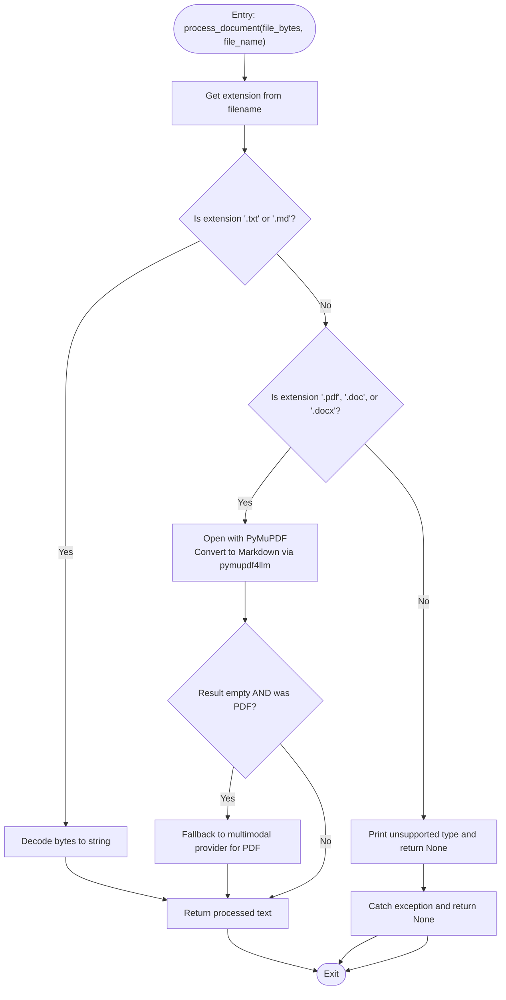
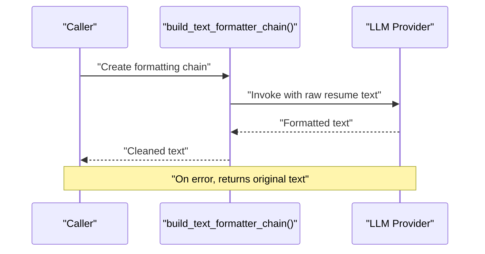
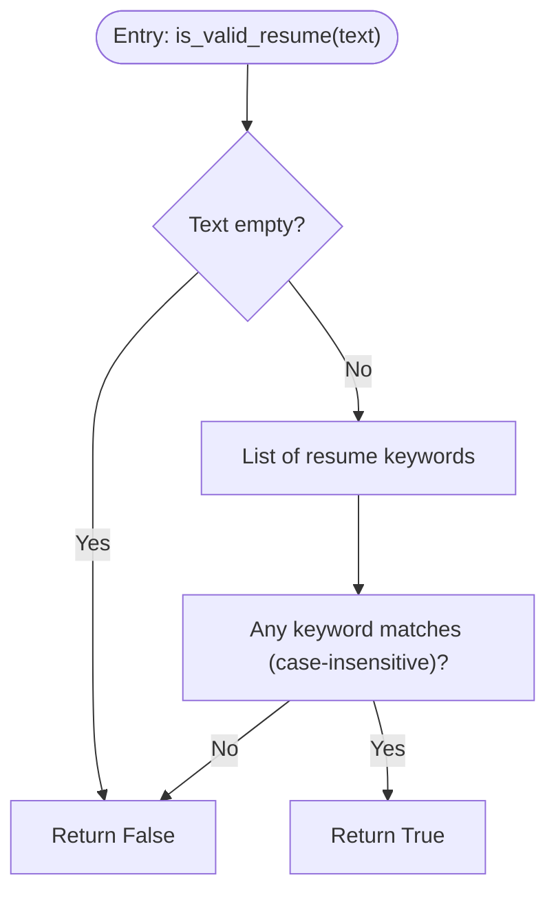
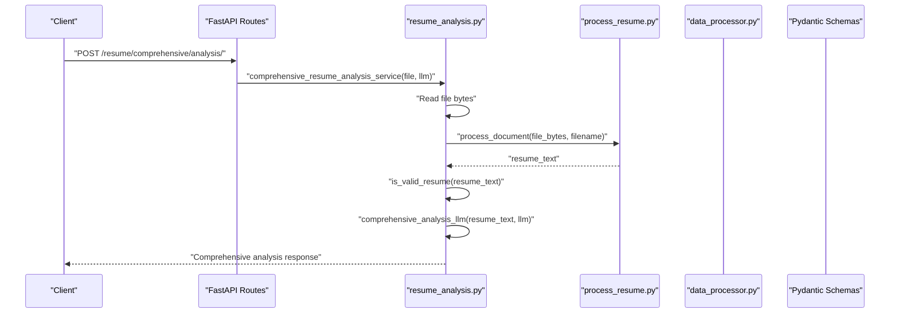
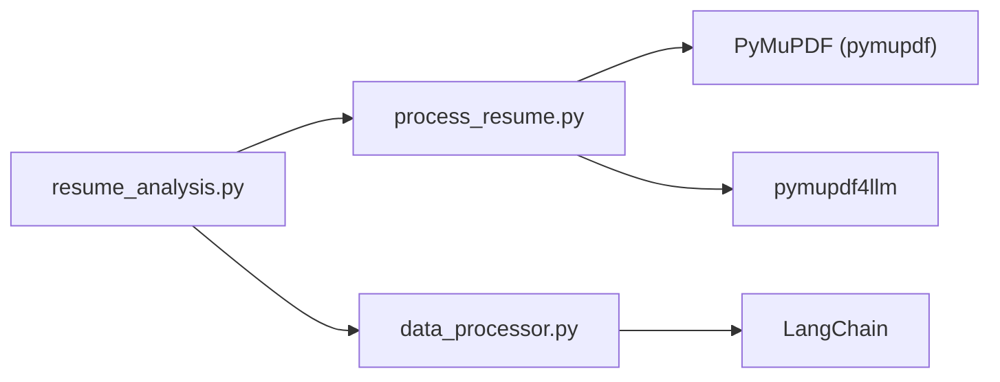

# Text Processing Pipeline

<cite>
**Referenced Files in This Document**
- [process_resume.py](file://backend/app/services/process_resume.py)
- [txt_processor.py](file://backend/app/data/prompt/txt_processor.py)
- [data_processor.py](file://backend/app/services/data_processor.py)
- [resume_analysis.py](file://backend/app/services/resume_analysis.py)
- [resume_analysis route](file://backend/app/routes/resume_analysis.py)
- [server.py](file://backend/server.py)
- [uv.lock](file://backend/uv.lock)
</cite>

## Table of Contents
1. [Introduction](#introduction)
2. [Project Structure](#project-structure)
3. [Core Components](#core-components)
4. [Architecture Overview](#architecture-overview)
5. [Detailed Component Analysis](#detailed-component-analysis)
6. [Dependency Analysis](#dependency-analysis)
7. [Performance Considerations](#performance-considerations)
8. [Troubleshooting Guide](#troubleshooting-guide)
9. [Conclusion](#conclusion)

## Introduction
This document explains the text processing pipeline used to transform uploaded resumes into normalized, structured text suitable for downstream analysis. It covers the end-to-end workflow from file upload through text extraction, optional LLM-based cleaning and formatting, validation, and JSON extraction. It also documents the validation logic for determining whether processed text qualifies as a valid resume, error handling strategies, and performance considerations for large documents.

## Project Structure
The text processing pipeline spans three primary areas:
- File upload and routing: FastAPI routes accept uploads and delegate to services.
- Processing service: Converts file bytes to text/markdown and validates content.
- LLM-based formatting and analysis: Cleans, normalizes, and extracts structured data from resume text.

**Diagram sources**
- [resume_analysis route](file://backend/app/routes/resume_analysis.py#L1-L68)
- [process_resume.py](file://backend/app/services/process_resume.py#L68-L110)
- [txt_processor.py](file://backend/app/data/prompt/txt_processor.py#L36-L39)
- [data_processor.py](file://backend/app/services/data_processor.py#L26-L64)
- [resume_analysis.py](file://backend/app/services/resume_analysis.py#L28-L157)

**Section sources**
- [resume_analysis route](file://backend/app/routes/resume_analysis.py#L1-L68)
- [process_resume.py](file://backend/app/services/process_resume.py#L68-L110)
- [txt_processor.py](file://backend/app/data/prompt/txt_processor.py#L36-L39)
- [data_processor.py](file://backend/app/services/data_processor.py#L26-L64)
- [resume_analysis.py](file://backend/app/services/resume_analysis.py#L28-L157)

## Core Components
- File processing and extraction:
  - process_document(file_bytes, file_name): Determines file type and extracts text/markdown using PyMuPDF and pymupdf4llm for PDF/DOC/DOCX, decodes TXT/MD directly, and falls back to a multimodal provider for PDFs when extraction yields empty content.
  - is_valid_resume(text): Validates that the extracted text contains key resume sections using keyword matching.

- LLM-based cleaning and formatting:
  - build_text_formatter_chain(llm): Creates a LangChain chain that prompts an LLM to clean and normalize raw resume text.
  - format_resume_text_with_llm(raw_text, llm): Executes the chain and returns cleaned text, with robust fallback to original text on errors.

- Downstream analysis orchestration:
  - analyze_resume_service(file, llm): Reads file, processes to text, optionally cleans via LLM, validates, converts to JSON via LLM, and performs schema validation.
  - comprehensive_resume_analysis_service(file, llm): Reads file, validates, and runs a comprehensive analysis LLM chain returning a structured dictionary.
  - format_and_analyze_resume_service(file, llm): Reads file, formats and analyzes via a combined chain, returning cleaned text and analysis.

**Section sources**
- [process_resume.py](file://backend/app/services/process_resume.py#L68-L110)
- [txt_processor.py](file://backend/app/data/prompt/txt_processor.py#L36-L39)
- [data_processor.py](file://backend/app/services/data_processor.py#L26-L64)
- [resume_analysis.py](file://backend/app/services/resume_analysis.py#L28-L157)
- [resume_analysis.py](file://backend/app/services/resume_analysis.py#L159-L237)
- [resume_analysis.py](file://backend/app/services/resume_analysis.py#L240-L302)

## Architecture Overview
The pipeline integrates FastAPI routes, a processing module, and LLM-based formatting and analysis modules. The flow varies slightly depending on whether the caller wants pure text cleaning, JSON extraction, or a comprehensive analysis.

**Diagram sources**
- [resume_analysis route](file://backend/app/routes/resume_analysis.py#L16-L25)
- [resume_analysis.py](file://backend/app/services/resume_analysis.py#L28-L157)
- [process_resume.py](file://backend/app/services/process_resume.py#L68-L110)
- [data_processor.py](file://backend/app/services/data_processor.py#L26-L64)

## Detailed Component Analysis

### File Upload and Routing
- The routes expose endpoints for resume analysis, comprehensive analysis, and a combined format-and-analyze operation. They depend on a request-scoped LLM instance and accept multipart/form-data uploads.

Implementation references:
- [resume_analysis route](file://backend/app/routes/resume_analysis.py#L16-L25)
- [resume_analysis route](file://backend/app/routes/resume_analysis.py#L28-L37)
- [resume_analysis route](file://backend/app/routes/resume_analysis.py#L43-L52)

**Section sources**
- [resume_analysis route](file://backend/app/routes/resume_analysis.py#L1-L68)

### Document Processing Workflow
The process_document function orchestrates extraction across supported formats:
- TXT/MD: Decoded directly from bytes.
- PDF/DOC/DOCX: Converted to Markdown using PyMuPDF and pymupdf4llm for consistent parsing.
- Fallback: For PDFs that yield empty content after initial extraction, a multimodal provider is used to convert the PDF to text.

**Diagram sources**
- [process_resume.py](file://backend/app/services/process_resume.py#L68-L91)

**Section sources**
- [process_resume.py](file://backend/app/services/process_resume.py#L68-L91)

### Text Cleaning and Normalization
- A LangChain prompt builds a chain that asks an LLM to clean and reformat resume text, preserving key information while removing artifacts and improving readability.
- The chain is executed via format_resume_text_with_llm, which returns the cleaned text or falls back to the original on errors (e.g., rate limits, authentication issues).

**Diagram sources**
- [txt_processor.py](file://backend/app/data/prompt/txt_processor.py#L36-L39)
- [data_processor.py](file://backend/app/services/data_processor.py#L26-L64)

**Section sources**
- [txt_processor.py](file://backend/app/data/prompt/txt_processor.py#L4-L39)
- [data_processor.py](file://backend/app/services/data_processor.py#L26-L64)

### Validation Logic: is_valid_resume
The is_valid_resume function checks whether the extracted text contains at least one of several canonical resume keywords. This serves as a quick filter to reject content that is likely not a resume.

**Diagram sources**
- [process_resume.py](file://backend/app/services/process_resume.py#L93-L109)

**Section sources**
- [process_resume.py](file://backend/app/services/process_resume.py#L93-L109)

### Orchestration Services
- analyze_resume_service:
  - Reads file bytes, writes a temporary file, processes to text, optionally formats via LLM, validates, converts to JSON via LLM, and performs schema validation.
  - Returns a structured response or raises HTTP exceptions on failure.
- comprehensive_resume_analysis_service:
  - Reads file, validates, and runs a comprehensive analysis LLM chain returning a dictionary.
- format_and_analyze_resume_service:
  - Reads file, formats and analyzes via a combined chain, returning cleaned text and analysis.

**Diagram sources**
- [resume_analysis.py](file://backend/app/services/resume_analysis.py#L159-L237)

**Section sources**
- [resume_analysis.py](file://backend/app/services/resume_analysis.py#L28-L157)
- [resume_analysis.py](file://backend/app/services/resume_analysis.py#L159-L237)
- [resume_analysis.py](file://backend/app/services/resume_analysis.py#L240-L302)

### Legacy Text Cleaning Utility
A separate utility exists for cleaning resume text using NLP preprocessing (lemmatization, stopword removal, punctuation stripping). While not used in the current pipeline, it demonstrates normalization techniques.

**Section sources**
- [server.py](file://backend/server.py#L738-L749)

## Dependency Analysis
External libraries and their roles:
- PyMuPDF and pymupdf4llm: Core engine for extracting text/markdown from PDF/DOC/DOCX.
- LangChain: Provides prompt composition and chain execution for LLM-based formatting and analysis.
- python-dotenv: Used for environment configuration (not directly part of the pipeline but relevant for deployment).

**Diagram sources**
- [process_resume.py](file://backend/app/services/process_resume.py#L4-L5)
- [uv.lock](file://backend/uv.lock#L1333-L1358)
- [data_processor.py](file://backend/app/services/data_processor.py#L1-L16)
- [resume_analysis.py](file://backend/app/services/resume_analysis.py#L15-L25)

**Section sources**
- [process_resume.py](file://backend/app/services/process_resume.py#L4-L5)
- [uv.lock](file://backend/uv.lock#L1333-L1358)
- [data_processor.py](file://backend/app/services/data_processor.py#L1-L16)
- [resume_analysis.py](file://backend/app/services/resume_analysis.py#L15-L25)

## Performance Considerations
- Extraction efficiency:
  - PyMuPDF and pymupdf4llm are efficient for converting PDF/DOC/DOCX to Markdown. For very large PDFs, consider:
    - Streaming chunks to reduce peak memory usage.
    - Limiting pages or applying OCR pre-processing if needed.
- LLM calls:
  - LLM-based formatting and analysis are I/O bound; batch requests where possible and avoid redundant formatting for plain TXT/MD.
  - Implement retry/backoff for transient LLM errors.
- Memory optimization:
  - Avoid storing entire files in memory beyond the minimal window needed for processing.
  - Delete temporary files promptly after processing.
- Validation cost:
  - Keyword-based validation is O(n) per keyword; keep the keyword list concise and case-insensitive to minimize overhead.

[No sources needed since this section provides general guidance]

## Troubleshooting Guide
Common issues and strategies:
- Unsupported file type:
  - The processor prints a message and returns None. Ensure the file extension is among supported types.
  - Reference: [process_resume.py](file://backend/app/services/process_resume.py#L83-L86)
- Corrupted or unreadable files:
  - Exceptions during processing are caught and None is returned. Verify file integrity and permissions.
  - Reference: [process_resume.py](file://backend/app/services/process_resume.py#L88-L90)
- Empty extraction for PDFs:
  - The processor attempts a fallback conversion using a multimodal provider. Ensure the provider and credentials are configured.
  - Reference: [process_resume.py](file://backend/app/services/process_resume.py#L78-L79)
- LLM formatting failures:
  - On errors (e.g., rate limits, authentication), the formatter returns the original text. Inspect logs and adjust provider settings.
  - Reference: [data_processor.py](file://backend/app/services/data_processor.py#L50-L63)
- Validation failures:
  - If is_valid_resume returns False, the service raises an HTTP 400 error. Ensure the file contains recognizable resume content.
  - Reference: [resume_analysis.py](file://backend/app/services/resume_analysis.py#L69-L73)

**Section sources**
- [process_resume.py](file://backend/app/services/process_resume.py#L83-L90)
- [data_processor.py](file://backend/app/services/data_processor.py#L50-L63)
- [resume_analysis.py](file://backend/app/services/resume_analysis.py#L69-L73)

## Conclusion
The text processing pipeline provides a robust, extensible workflow for transforming resumes into structured, validated content. It leverages PyMuPDF for reliable extraction, supports fallback conversion for challenging PDFs, and uses LLMs for cleaning and normalization. Validation ensures only meaningful resume content proceeds to analysis, while error handling and performance strategies support scalable operation.