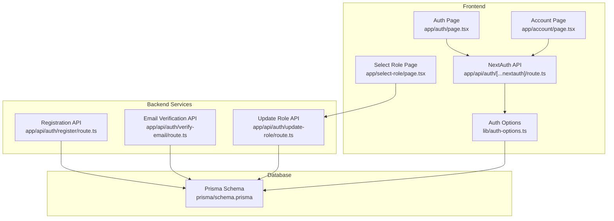
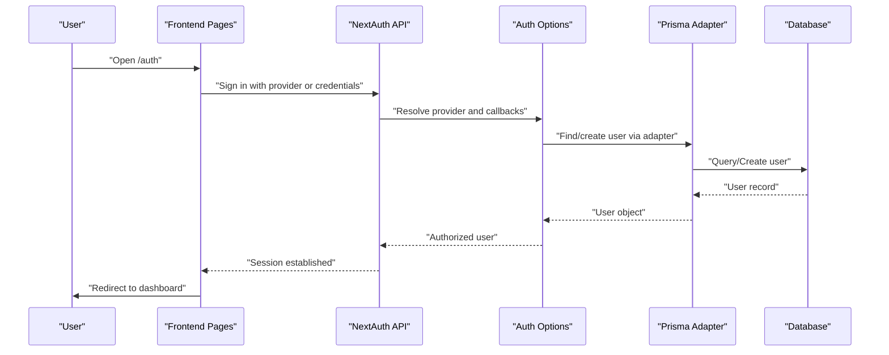
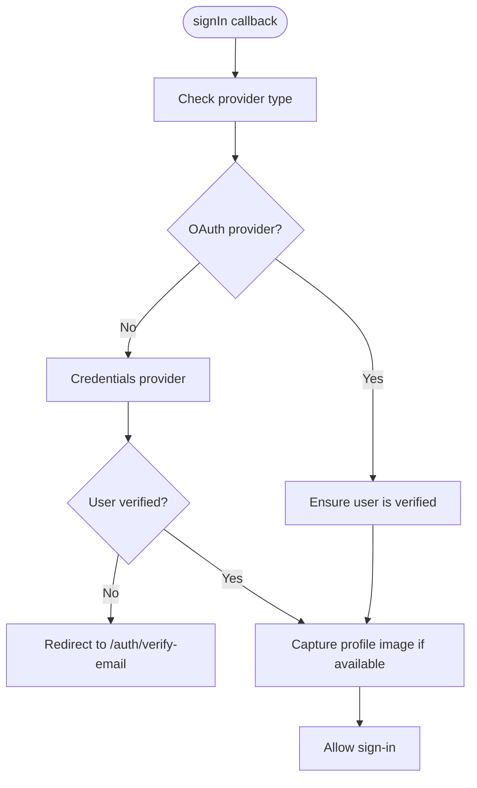
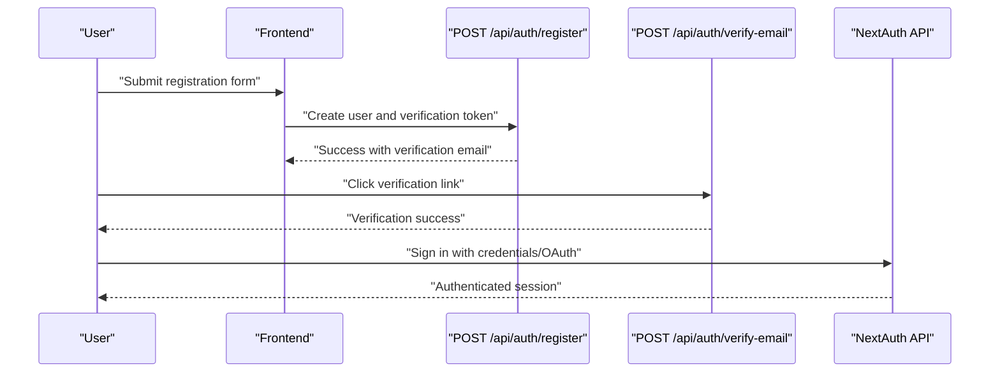
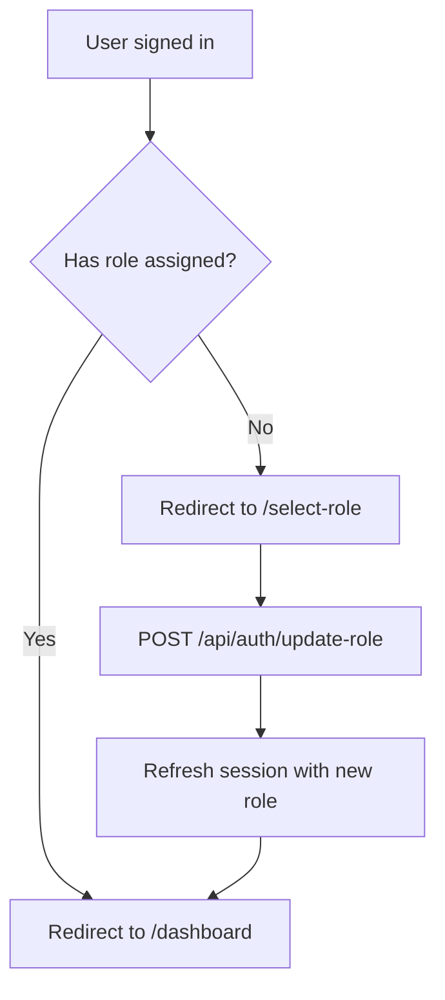
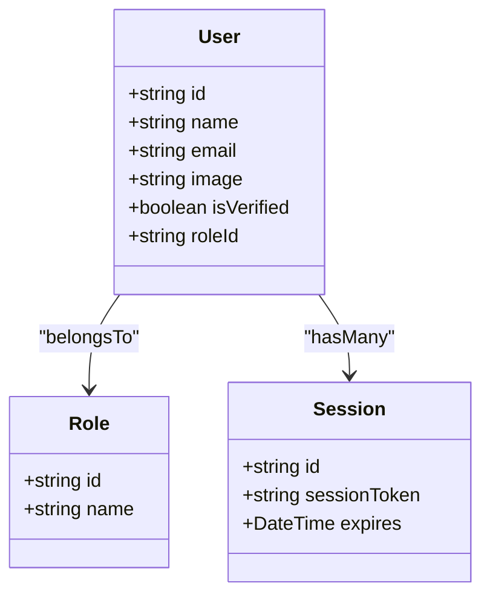
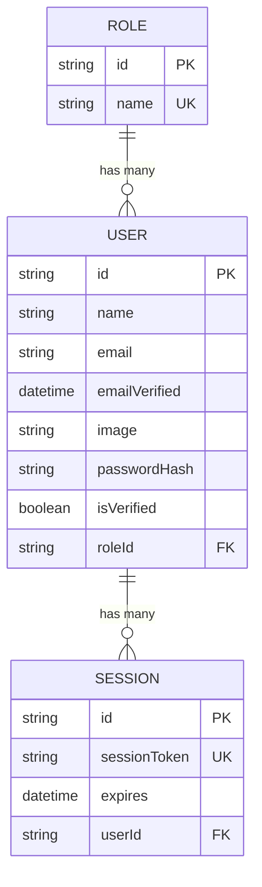
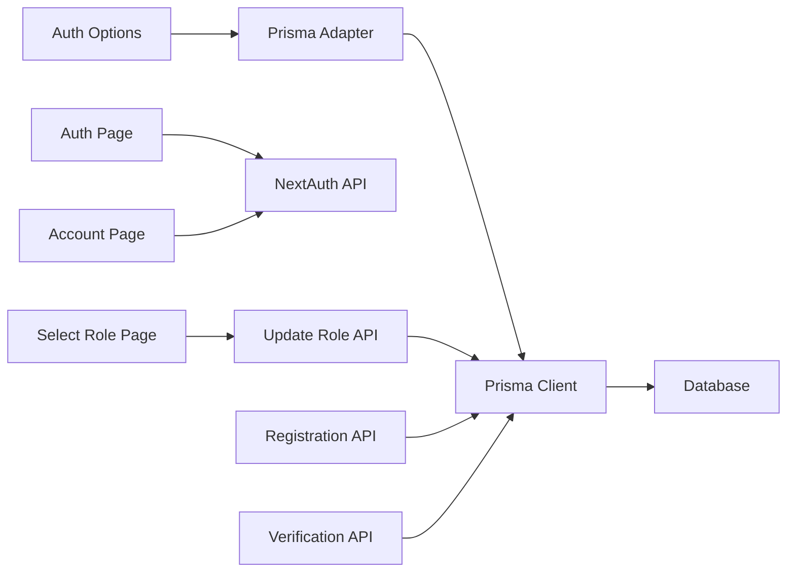

# User Management System

<cite>
**Referenced Files in This Document**
- [auth-options.ts](file://frontend/lib/auth-options.ts)
- [route.ts](file://frontend/app/api/auth/[...nextauth]/route.ts)
- [schema.prisma](file://frontend/prisma/schema.prisma)
- [register/route.ts](file://frontend/app/api/auth/register/route.ts)
- [verify-email/route.ts](file://frontend/app/api/auth/verify-email/route.ts)
- [update-role/route.ts](file://frontend/app/api/auth/update-role/route.ts)
- [auth/page.tsx](file://frontend/app/auth/page.tsx)
- [select-role/page.tsx](file://frontend/app/select-role/page.tsx)
- [account/page.tsx](file://frontend/app/account/page.tsx)
- [prisma.ts](file://frontend/lib/prisma.ts)
</cite>

## Table of Contents
1. [Introduction](#introduction)
2. [Project Structure](#project-structure)
3. [Core Components](#core-components)
4. [Architecture Overview](#architecture-overview)
5. [Detailed Component Analysis](#detailed-component-analysis)
6. [Dependency Analysis](#dependency-analysis)
7. [Performance Considerations](#performance-considerations)
8. [Troubleshooting Guide](#troubleshooting-guide)
9. [Conclusion](#conclusion)

## Introduction
This document describes the User Management System built with NextAuth.js, covering authentication providers, session management, role-based access control, and profile management. It explains the end-to-end user lifecycle from registration and email verification through login and role assignment, and documents the frontend components that enable user interactions. The backend integrates NextAuth.js with Prisma ORM to manage users, sessions, roles, and tokens, while the frontend provides intuitive UIs for authentication, profile editing, and role selection.

## Project Structure
The user management functionality spans the frontend Next.js application and the Prisma schema:
- NextAuth.js configuration and API routes for authentication
- Prisma schema defining users, roles, sessions, and related tokens
- Frontend pages for authentication, role selection, and account management

**Diagram sources**
- [route.ts](file://frontend/app/api/auth/[...nextauth]/route.ts#L1-L7)
- [auth-options.ts](file://frontend/lib/auth-options.ts#L1-L202)
- [auth/page.tsx](file://frontend/app/auth/page.tsx#L1-L933)
- [select-role/page.tsx](file://frontend/app/select-role/page.tsx#L1-L157)
- [account/page.tsx](file://frontend/app/account/page.tsx#L1-L498)
- [register/route.ts](file://frontend/app/api/auth/register/route.ts#L1-L176)
- [verify-email/route.ts](file://frontend/app/api/auth/verify-email/route.ts#L1-L84)
- [update-role/route.ts](file://frontend/app/api/auth/update-role/route.ts#L1-L65)
- [schema.prisma](file://frontend/prisma/schema.prisma#L1-L262)

**Section sources**
- [auth-options.ts](file://frontend/lib/auth-options.ts#L1-L202)
- [route.ts](file://frontend/app/api/auth/[...nextauth]/route.ts#L1-L7)
- [schema.prisma](file://frontend/prisma/schema.prisma#L1-L262)

## Core Components
- NextAuth.js configuration with multiple providers (credentials, Google, GitHub, email)
- JWT-based session strategy with callbacks for session and token synchronization
- Prisma adapter for user and session persistence
- Registration endpoint with email verification token generation
- Email verification endpoint validating tokens and marking users as verified
- Role selection and update endpoints for assigning roles post-registration
- Frontend authentication UI supporting OAuth and credentials login, plus registration with role selection
- Frontend role selection UI and account management UI for profile and security controls

**Section sources**
- [auth-options.ts](file://frontend/lib/auth-options.ts#L10-L202)
- [register/route.ts](file://frontend/app/api/auth/register/route.ts#L68-L176)
- [verify-email/route.ts](file://frontend/app/api/auth/verify-email/route.ts#L9-L84)
- [update-role/route.ts](file://frontend/app/api/auth/update-role/route.ts#L6-L65)
- [auth/page.tsx](file://frontend/app/auth/page.tsx#L145-L275)
- [select-role/page.tsx](file://frontend/app/select-role/page.tsx#L33-L67)
- [account/page.tsx](file://frontend/app/account/page.tsx#L74-L153)

## Architecture Overview
The system uses NextAuth.js for authentication and Prisma for data persistence. The auth options define providers, callbacks, and session strategy. The frontend pages integrate with NextAuth hooks and call backend APIs for registration, verification, and role updates.

**Diagram sources**
- [route.ts](file://frontend/app/api/auth/[...nextauth]/route.ts#L1-L7)
- [auth-options.ts](file://frontend/lib/auth-options.ts#L10-L202)
- [prisma.ts](file://frontend/lib/prisma.ts#L1-L10)
- [schema.prisma](file://frontend/prisma/schema.prisma#L16-L41)

## Detailed Component Analysis

### NextAuth.js Integration and Session Management
- Providers: Credentials, Google, GitHub, Email
- Session strategy: JWT
- Callbacks:
  - signIn: Enforce email verification for credentials, auto-verify OAuth users, capture profile images
  - session: Populate session.user with id and role from JWT token
  - jwt: Sync role and image from database on token creation/refresh
- Events: Automatically mark OAuth users as verified upon creation

**Diagram sources**
- [auth-options.ts](file://frontend/lib/auth-options.ts#L98-L144)

**Section sources**
- [auth-options.ts](file://frontend/lib/auth-options.ts#L10-L202)
- [route.ts](file://frontend/app/api/auth/[...nextauth]/route.ts#L1-L7)

### Authentication Flow: Registration, Verification, Login
- Registration:
  - Validates input, checks existing user and role, hashes password, creates user and verification token in a transaction, and attempts to send a verification email
- Email Verification:
  - Validates token existence and expiration, marks user as verified, and records confirmation
- Login:
  - Supports OAuth providers and credentials; credentials require email verification

**Diagram sources**
- [register/route.ts](file://frontend/app/api/auth/register/route.ts#L68-L176)
- [verify-email/route.ts](file://frontend/app/api/auth/verify-email/route.ts#L9-L84)
- [auth-options.ts](file://frontend/lib/auth-options.ts#L19-L56)
- [auth/page.tsx](file://frontend/app/auth/page.tsx#L188-L275)

**Section sources**
- [register/route.ts](file://frontend/app/api/auth/register/route.ts#L68-L176)
- [verify-email/route.ts](file://frontend/app/api/auth/verify-email/route.ts#L9-L84)
- [auth/page.tsx](file://frontend/app/auth/page.tsx#L188-L275)

### Role-Based Access Control and Role Selection
- Roles are stored in the Role model and linked to users via roleId
- On OAuth sign-in, users are auto-verified; on credentials sign-in, email verification is enforced
- After initial sign-in, users land on a role selection page where they choose "User" or "Recruiter"
- The role is persisted in the database and synchronized into JWT and session via callbacks
- The frontend displays role-aware UI and redirects appropriately

**Diagram sources**
- [select-role/page.tsx](file://frontend/app/select-role/page.tsx#L19-L67)
- [update-role/route.ts](file://frontend/app/api/auth/update-role/route.ts#L6-L65)
- [auth-options.ts](file://frontend/lib/auth-options.ts#L159-L195)

**Section sources**
- [schema.prisma](file://frontend/prisma/schema.prisma#L10-L28)
- [select-role/page.tsx](file://frontend/app/select-role/page.tsx#L33-L67)
- [update-role/route.ts](file://frontend/app/api/auth/update-role/route.ts#L6-L65)
- [auth-options.ts](file://frontend/lib/auth-options.ts#L159-L195)

### Profile Management Features
- Avatar management:
  - For email-authenticated users, an upload component allows custom avatar URLs
  - OAuth users use profile images from their OAuth provider
- Personal information:
  - Displayed on the account page; editable via future extensions
- Role updates:
  - Role can be changed through the role selection page and reflected in session
- Security actions:
  - Password reset initiation for email-authenticated users
  - Account deletion with confirmation

**Diagram sources**
- [schema.prisma](file://frontend/prisma/schema.prisma#L16-L41)
- [schema.prisma](file://frontend/prisma/schema.prisma#L10-L14)
- [schema.prisma](file://frontend/prisma/schema.prisma#L247-L253)

**Section sources**
- [account/page.tsx](file://frontend/app/account/page.tsx#L244-L271)
- [auth-options.ts](file://frontend/lib/auth-options.ts#L145-L158)

### Frontend Components for Authentication and Profile Management
- Authentication page:
  - Tabs for login and register
  - OAuth buttons for Google and GitHub
  - Credentials login with validation
  - Registration with role selection and avatar URL validation
- Role selection page:
  - Radio buttons for "User" and "Recruiter"
  - Updates role via API and refreshes session
- Account page:
  - Displays profile info and role
  - Manages avatar (upload for email users)
  - Initiates password reset and account deletion

**Section sources**
- [auth/page.tsx](file://frontend/app/auth/page.tsx#L145-L275)
- [select-role/page.tsx](file://frontend/app/select-role/page.tsx#L33-L67)
- [account/page.tsx](file://frontend/app/account/page.tsx#L74-L153)

### Database Schema for Users, Sessions, and Roles
- Role model defines unique role names and links to users
- User model includes optional password hash for credentials, email verification flag, optional role linkage, and profile fields
- Session model stores session tokens and expiry
- Additional token models support email verification and password resets

**Diagram sources**
- [schema.prisma](file://frontend/prisma/schema.prisma#L10-L14)
- [schema.prisma](file://frontend/prisma/schema.prisma#L16-L41)
- [schema.prisma](file://frontend/prisma/schema.prisma#L247-L253)

**Section sources**
- [schema.prisma](file://frontend/prisma/schema.prisma#L10-L262)

### Implementing Custom Authentication Providers and Extending Capabilities
- Custom provider integration:
  - Add a new provider in the NextAuth options array and implement authorize logic to validate credentials and return a user object with id, email, name, image, and role
- Extending user capabilities:
  - Add fields to the User model in the Prisma schema
  - Update the JWT and session callbacks to propagate new fields
  - Extend frontend components to collect and display new user attributes

[No sources needed since this section provides general guidance]

## Dependency Analysis
- NextAuth.js depends on the Prisma adapter and the configured providers
- Backend APIs depend on Prisma client for database operations
- Frontend pages depend on NextAuth hooks and call backend endpoints

**Diagram sources**
- [auth-options.ts](file://frontend/lib/auth-options.ts#L10-L202)
- [prisma.ts](file://frontend/lib/prisma.ts#L1-L10)
- [auth/page.tsx](file://frontend/app/auth/page.tsx#L145-L275)
- [select-role/page.tsx](file://frontend/app/select-role/page.tsx#L33-L67)
- [account/page.tsx](file://frontend/app/account/page.tsx#L74-L153)
- [update-role/route.ts](file://frontend/app/api/auth/update-role/route.ts#L6-L65)
- [register/route.ts](file://frontend/app/api/auth/register/route.ts#L68-L176)
- [verify-email/route.ts](file://frontend/app/api/auth/verify-email/route.ts#L9-L84)

**Section sources**
- [auth-options.ts](file://frontend/lib/auth-options.ts#L10-L202)
- [prisma.ts](file://frontend/lib/prisma.ts#L1-L10)

## Performance Considerations
- Use JWT-based sessions to avoid frequent database reads
- Keep token refresh callbacks minimal; fetch only necessary user fields
- Batch database operations (e.g., registration transaction) to reduce round-trips
- Cache frequently accessed role and user metadata where appropriate

[No sources needed since this section provides general guidance]

## Troubleshooting Guide
- Email verification failures:
  - Ensure the verification token exists, is unexpired, and not already confirmed
- Credentials login blocked:
  - Verify that the user’s email is marked as verified before allowing sign-in
- Role update errors:
  - Confirm the incoming roleId maps to a valid Role name in the database
- OAuth sign-in issues:
  - Confirm provider credentials are configured and user image/profile picture is captured when missing

**Section sources**
- [verify-email/route.ts](file://frontend/app/api/auth/verify-email/route.ts#L14-L66)
- [auth-options.ts](file://frontend/lib/auth-options.ts#L122-L136)
- [update-role/route.ts](file://frontend/app/api/auth/update-role/route.ts#L26-L45)

## Conclusion
The User Management System integrates NextAuth.js with Prisma to provide robust authentication, email verification, role-based access control, and profile management. The frontend offers intuitive UIs for registration, verification, role selection, and account settings, while the backend ensures secure and reliable user lifecycle management. Extensibility is supported through custom providers and schema enhancements.