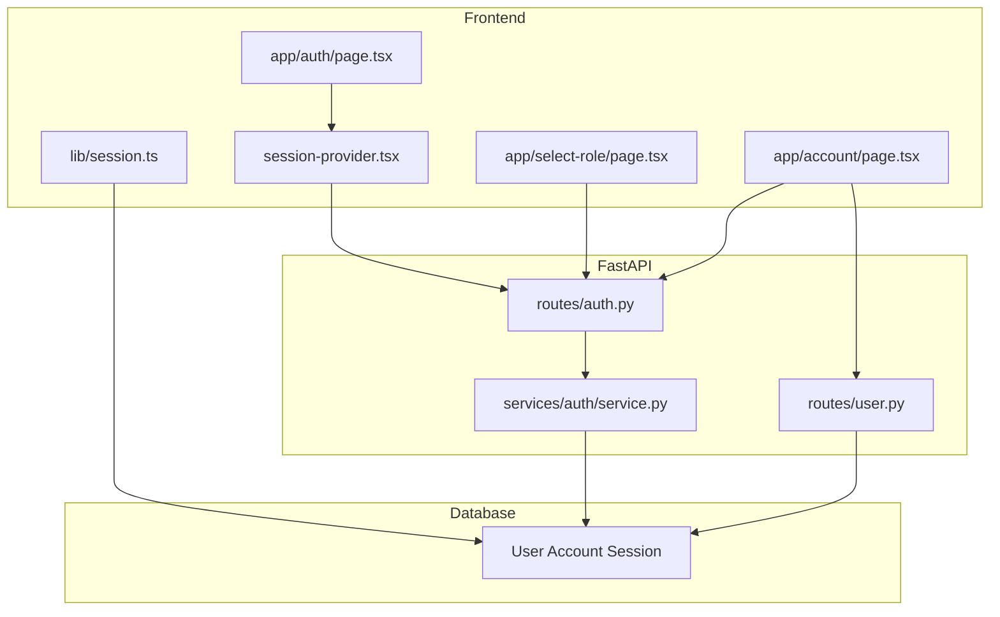
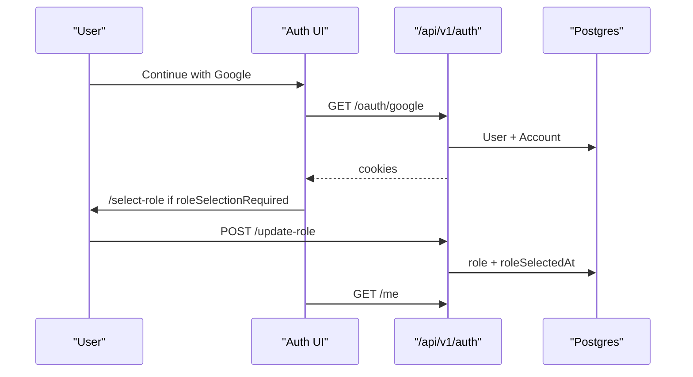
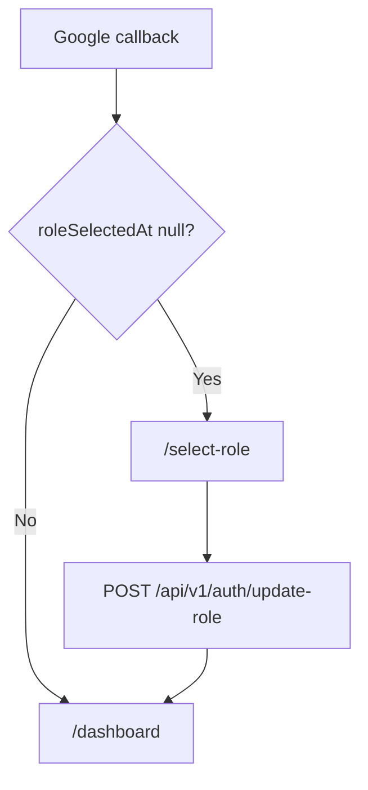
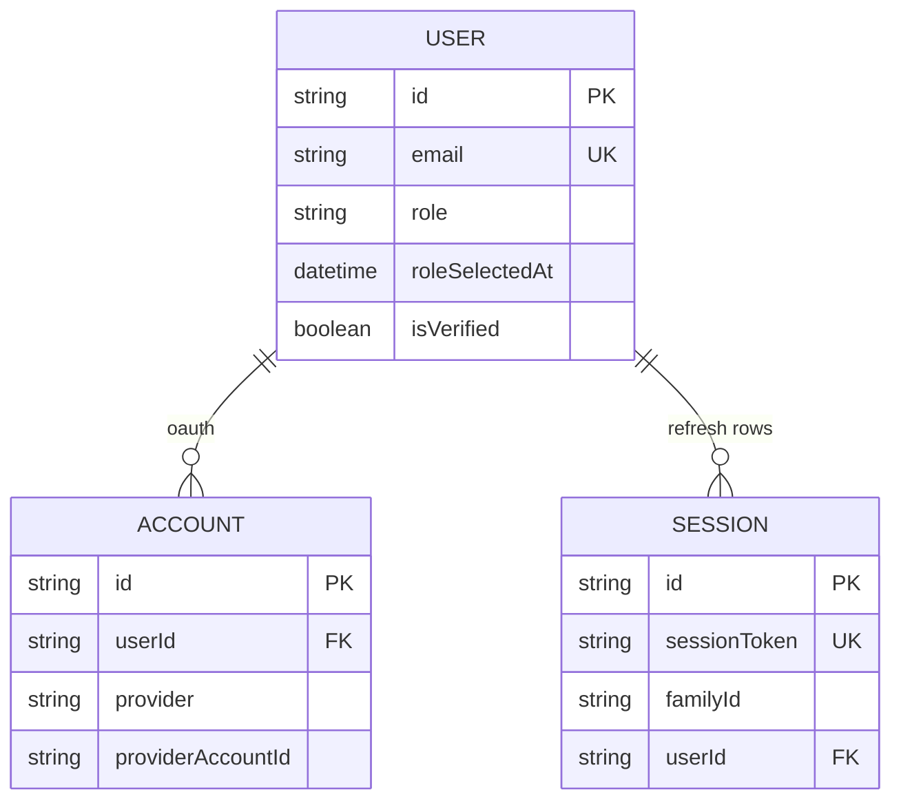
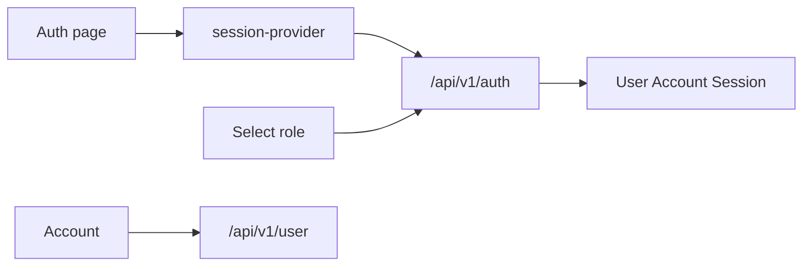

# User management system

Google OAuth, FastAPI sessions, Prisma/SQLModel `User` rows, and role selection. NextAuth is gone.

This is the job-seeker TalentSync app. Recruiter as a `UserRole` value is leftover enum + `/dashboard/recruiter` chrome, not TalentSync-HR.

## Repository layout

```mermaid
graph TB
subgraph "Frontend"
A["app/auth/page.tsx"]
B["session-provider.tsx"]
C["app/select-role/page.tsx"]
D["app/account/page.tsx"]
E["lib/session.ts"]
end
subgraph "FastAPI"
F["routes/auth.py"]
G["routes/user.py"]
H["services/auth/service.py"]
end
subgraph "Database"
I["User Account Session"]
end
A --> B
B --> F
C --> F
D --> F
D --> G
E --> I
F --> H
H --> I
G --> I
```

- `frontend/app/auth/page.tsx`
- `frontend/app/select-role/page.tsx`
- `frontend/app/account/page.tsx`
- `frontend/components/auth/role-selection-form.tsx`
- `frontend/lib/session.ts`
- `frontend/lib/user-roles.ts`
- `backend/app/routes/auth.py`
- `backend/app/routes/user.py`
- `backend/app/models/tables/user.py`
- `frontend/prisma/schema.prisma`

## Building blocks

- Google sign-in via `/api/v1/auth/oauth/google`
- `User.role` enum default `USER`, `roleSelectedAt` for first-login pick
- Session cookies owned by FastAPI
- Account page: profile, avatar (`POST /api/v1/user/update-avatar`), delete account
- Password and email-verify routes return 410 unless `CREDENTIALS_AUTH_ENABLED`

## How it fits together

```mermaid
sequenceDiagram
participant U as "User"
participant FE as "Auth UI"
participant Auth as "/api/v1/auth"
participant DB as "Postgres"
U->>FE : Continue with Google
FE->>Auth : GET /oauth/google
Auth->>DB : User + Account
Auth-->>FE : cookies
FE->>U : /select-role if roleSelectionRequired
U->>Auth : POST /update-role
Auth->>DB : role + roleSelectedAt
FE->>Auth : GET /me
```

## Session

Server: `getSession()` verifies the access JWT and hydrates Prisma `User`.

Client: `useSession()` from `session-provider.tsx` polls `/me` and refreshes the access cookie.

There is no NextAuth Prisma adapter. `Account` and `Session` tables still exist. `Session` is the hashed refresh store (`familyId`, `previousToken`). Prisma lists those models so the generated client matches the database. The comment on `Session` says do not write it from Next.js.

## Registration and login

Product login is Google. `oauth_login` creates or links the user, sets `isVerified` from Google's assertion, and stores `Account(provider=google)`.

Email/password register + verify is dead in production. Do not ship UI that POSTs `/register` expecting 201.

## Roles

```mermaid
flowchart TD
SignIn["Google callback"] --> Flag{"roleSelectedAt null?"}
Flag --> |Yes| Select["/select-role"]
Flag --> |No| Dash["/dashboard"]
Select --> Update["POST /api/v1/auth/update-role"]
Update --> Dash
```

`USER_ROLE` in `frontend/lib/user-roles.ts`: `USER`, `RECRUITER`, `ADMIN`. `hasRecruitingAccess` is true for recruiter and admin. That gates leftover candidate-DB UI in this repo, not the HR product.

## Profile

Account page shows name, email, image, role.

Avatar: `AvatarUpload` calls the user API then `update()` on the session provider so the navbar image refreshes.

Delete: `DELETE /api/v1/auth/delete-account`.

## Schema (identity)

```mermaid
erDiagram
USER {
  string id PK
  string email UK
  string role
  datetime roleSelectedAt
  boolean isVerified
}
ACCOUNT {
  string id PK
  string userId FK
  string provider
  string providerAccountId
}
SESSION {
  string id PK
  string sessionToken UK
  string familyId
  string userId FK
}
USER ||--o{ ACCOUNT : "oauth"
USER ||--o{ SESSION : "refresh rows"
```

Role is a column on `User`, not a separate `Role` table.

## Dependencies

```mermaid
graph LR
FE1["Auth page"] --> SP["session-provider"]
SP --> AUTH["/api/v1/auth"]
FE2["Select role"] --> AUTH
FE3["Account"] --> USER["/api/v1/user"]
AUTH --> TABLES["User Account Session"]
```

## Troubleshooting

- Google fails: redirect URI and client secrets. Not a NextAuth callback.
- Role picker loops: `roleSelectionRequired` still true; confirm `update-role` wrote `roleSelectedAt`.
- Avatar not showing: `/user/update-avatar` 401, or session not refreshed.
- 410 on password routes: expected.
