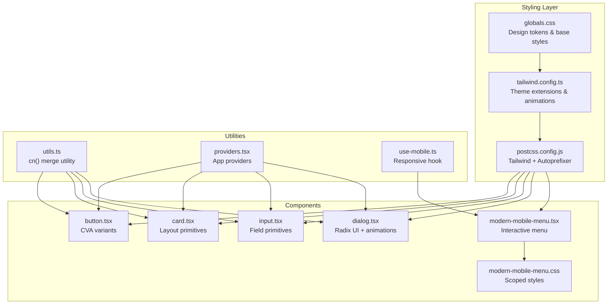
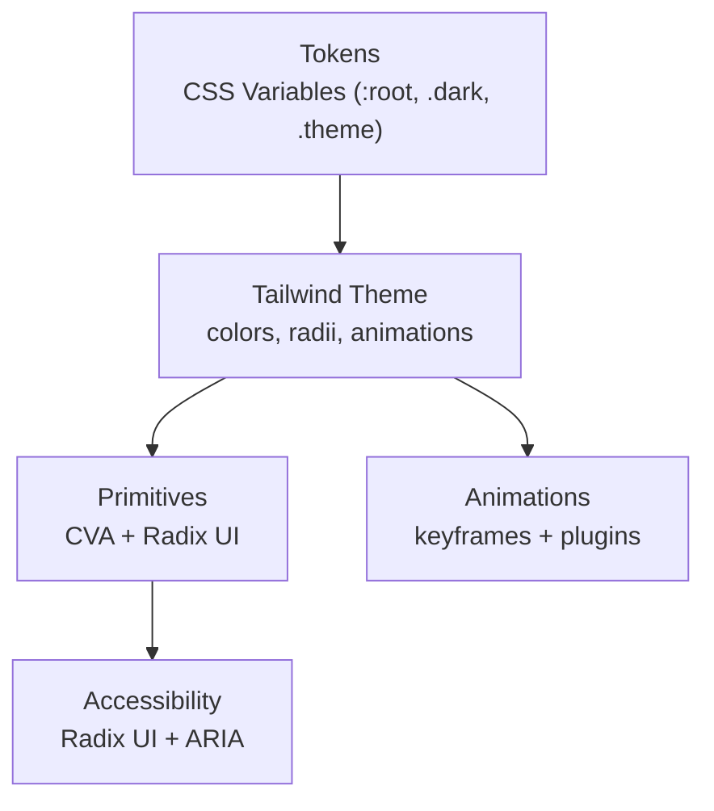
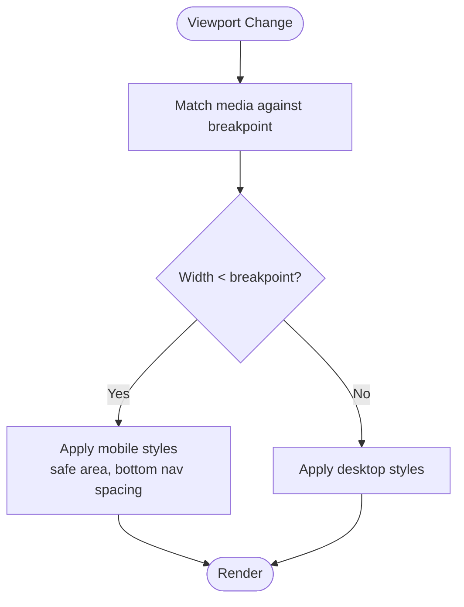
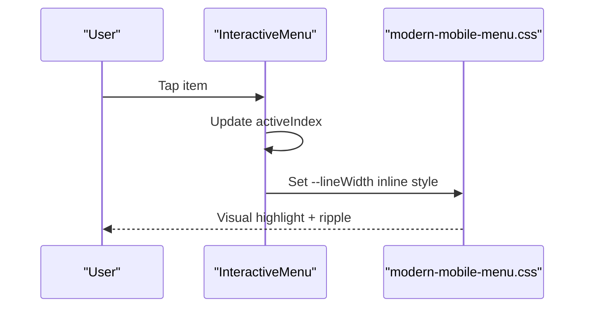
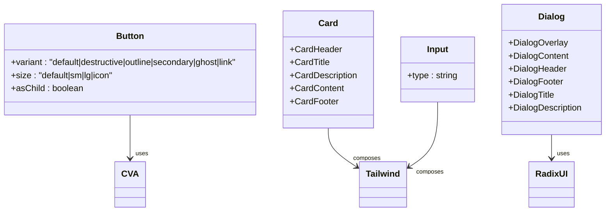
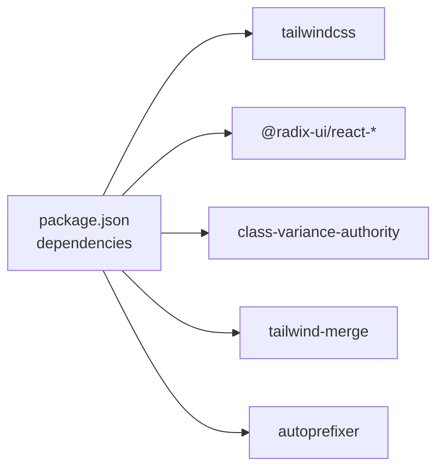

# Design system and styling

## Introduction
This page describes the design system and styling architecture of the frontend. It covers Tailwind CSS configuration, design tokens, component styling patterns, color system, typography hierarchy, spacing scale, responsive design, animation systems, transitions, micro-interactions, accessibility, dark mode, cross-browser compatibility, style organization, CSS-in-JS patterns, and performance optimization.

## Project structure
The styling system is organized around:
- Global CSS and CSS variables for design tokens
- Tailwind CSS configuration extending design tokens and animations
- UI primitives built with class variance authority (CVA) and clsx/tailwind-merge
- Radix UI primitives for accessible component foundations
- PostCSS pipeline with Tailwind and Autoprefixer
- Utility functions for merging classes and theme-aware components

```mermaid
graph TB
subgraph "Styling Layer"
A["globals.css<br/>Design tokens & base styles"]
B["tailwind.config.ts<br/>Theme extensions & animations"]
C["postcss.config.js<br/>Tailwind + Autoprefixer"]
end
subgraph "Components"
D["button.tsx<br/>CVA variants"]
E["card.tsx<br/>Layout primitives"]
F["input.tsx<br/>Field primitives"]
G["dialog.tsx<br/>Radix UI + animations"]
H["modern-mobile-menu.tsx<br/>Interactive menu"]
I["modern-mobile-menu.css<br/>Scoped styles"]
end
subgraph "Utilities"
J["utils.ts<br/>cn() merge utility"]
K["providers.tsx<br/>App providers"]
L["use-mobile.ts<br/>Responsive hook"]
end
A --> B
B --> C
C --> D
C --> E
C --> F
C --> G
C --> H
H --> I
J --> D
J --> E
J --> F
J --> G
K --> D
K --> E
K --> F
K --> G
L --> H
```

## Core components
The design system centers on reusable UI primitives that combine:
- Tailwind utility classes for layout and typography
- CSS variables for theme tokens
- CVA for variant composition
- clsx and tailwind-merge for safe class merging
- Radix UI for accessibility and semantics

Key primitives:
- Button: variants for default, destructive, outline, secondary, ghost, link; sizes for default, sm, lg, icon
- Card: container, header, title, description, content, footer
- Input: field with focus and disabled states
- Dialog: overlay, content, header, footer, title, description

## Architecture overview
The styling architecture follows a layered approach:
- Tokens: CSS variables define semantic color roles and surfaces
- Theme: Tailwind resolves tokens into design system utilities
- Components: Primitives use tokens and Tailwind utilities with CVA variants
- Animations: Tailwind keyframes and plugins power transitions and micro-interactions
- Accessibility: Radix UI ensures keyboard navigation and ARIA-ready markup

```mermaid
graph TB
T["Tokens<br/>CSS Variables (:root, .dark, .theme)"]
TW["Tailwind Theme<br/>colors, radii, animations"]
PR["Primitives<br/>CVA + Radix UI"]
AN["Animations<br/>keyframes + plugins"]
AC["Accessibility<br/>Radix UI + ARIA"]
T --> TW
TW --> PR
TW --> AN
PR --> AC
```

## Detailed component analysis

### Color system and design tokens
- Tokens are defined as CSS variables in:root and.dark layers, enabling automatic light/dark switching
- Semantic roles include background, foreground, card, popover, primary, secondary, muted, accent, destructive, borders, inputs, rings, and chart colors
- Brand tokens provide primary, secondary, dark, darker, light, lighter, off-white
- Status tokens include success, warning, info
- Surfaces and borders include surface, surface-hover, border-subtle
- Text states include text-muted-light, text-muted-medium, text-muted-dark
- Overlay and placeholder tokens support backdrop and hint text
- Third-party brand tokens include GitHub

Dark mode is implemented via class-based switching and prefers-color-scheme media queries.

### Typography hierarchy
- Font families are configured via CSS variables for sans and mono fonts
- Headings and body text rely on Tailwind utilities; component primitives define heading sizes and weights

### Spacing scale and border radius
- Border radius is driven by a CSS variable (--radius) extended in Tailwind
- Component primitives apply rounded corners consistently
- Utilities like padding and margin are applied via Tailwind utilities

### Responsive design and breakpoints
- Mobile-first approach with CSS variables and media queries
- A dedicated hook detects mobile viewport width using a breakpoint constant
- Base layer applies safe area and bottom navigation spacing for small screens
- Component-specific responsive adjustments exist (e.g., mobile menu)

```mermaid
flowchart TD
Start(["Viewport Change"]) --> Check["Match media against breakpoint"]
Check --> IsMobile{"Width < breakpoint?"}
IsMobile --> |Yes| ApplyMobile["Apply mobile styles<br/>safe area, bottom nav spacing"]
IsMobile --> |No| ApplyDesktop["Apply desktop styles"]
ApplyMobile --> End(["Render"])
ApplyDesktop --> End
```

### Animation systems, transitions, and micro-interactions
- Tailwind keyframes and plugin enable accordion animations
- Global CSS defines custom animations for floating, glowing, and shimmer effects
- Hover effects include elevation and subtle shadows
- Interactive menu integrates ripple and slide-up animations

```mermaid
sequenceDiagram
participant User as "User"
participant Menu as "InteractiveMenu"
participant CSS as "modern-mobile-menu.css"
User->>Menu : Tap item
Menu->>Menu : Update activeIndex
Menu->>CSS : Set --lineWidth inline style
CSS-->>User : Visual highlight + ripple
```

### Accessibility compliance
- Components use Radix UI primitives ensuring keyboard navigation, focus management, and ARIA attributes
- Focus styles are explicit via Tailwind utilities
- Semantic HTML elements are used within components (e.g., headings, paragraphs)
- Accessible labels and screen-reader text are included where appropriate (e.g., close button)

### Dark mode implementation
- CSS variables switch between light and dark palettes
- Tailwind darkMode strategy uses class-based switching
- Media query supports OS preference for initial theme

### Cross-Browser compatibility
- PostCSS pipeline includes Autoprefixer for vendor prefixes
- Scrollbar hiding and custom scrollbar styling are handled with cross-browser selectors
- CSS variables are widely supported; fallbacks are implicit via Tailwind's HSL resolution

### Style organization and CSS-in-JS patterns
- Component-level styles are scoped to files (e.g., interactive menu CSS)
- Global tokens live in a single stylesheet for centralized theme control
- CVA and clsx/tailwind-merge provide a predictable pattern for composing variants
- Radix UI props and refs integrate with Tailwind utilities

### Component styling patterns
- Button: CVA defines variant and size combinations; forwardRef enables slot behavior
- Card: semantic sections with consistent paddings and typography
- Input: focus-visible outlines and disabled states
- Dialog: overlay blur and backdrop; content with motion and scroll behavior

```mermaid
classDiagram
class Button {
+variant : "default|destructive|outline|secondary|ghost|link"
+size : "default|sm|lg|icon"
+asChild : boolean
}
class Card {
+CardHeader
+CardTitle
+CardDescription
+CardContent
+CardFooter
}
class Input {
+type : string
}
class Dialog {
+DialogOverlay
+DialogContent
+DialogHeader
+DialogFooter
+DialogTitle
+DialogDescription
}
Button --> "uses" CVA
Card --> "composes" Tailwind
Input --> "composes" Tailwind
Dialog --> "uses" RadixUI
```

## Dependency analysis
The styling stack depends on:
- Tailwind for utility-first CSS
- Radix UI for accessible component primitives
- class-variance-authority and tailwind-merge for variant composition
- PostCSS with Tailwind and Autoprefixer for build-time transforms

```mermaid
graph LR
Pkg["package.json<br/>dependencies"]
TW["tailwindcss"]
RUI["@radix-ui/react-*"]
CVA["class-variance-authority"]
TM["tailwind-merge"]
AP["autoprefixer"]
Pkg --> TW
Pkg --> RUI
Pkg --> CVA
Pkg --> TM
Pkg --> AP
```

## Performance considerations
- Use CVA and clsx/tailwind-merge to minimize redundant classes and avoid duplication
- Prefer Tailwind utilities over ad-hoc CSS for maintainability and tree-shaking
- Keep keyframes minimal and reuse across components
- Use CSS variables for theme tokens to reduce repaint costs during theme switches
- Avoid overly complex selector specificity; keep component styles shallow
- Lazy-load heavy assets and defer non-critical animations until after hydration

## Troubleshooting guide
- Dark mode not applying: verify class-based switching and:root/.dark token definitions
- Hover or focus styles missing: ensure focus-visible utilities are present on interactive elements
- Animation not smooth: check for layout thrashing; prefer transform and opacity changes
- Mobile layout issues: confirm safe-area and bottom navigation spacing are applied conditionally
- Build errors with Tailwind: ensure PostCSS pipeline includes Tailwind and Autoprefixer

## Conclusion
The design system combines CSS variables for tokens, Tailwind utilities for layout and typography, CVA for component variants, and Radix UI for accessibility. Animations use Tailwind keyframes and custom CSS, while responsive behavior is enforced via a mobile detection hook and media queries. The architecture balances consistency, performance, and accessibility across light and dark modes.
