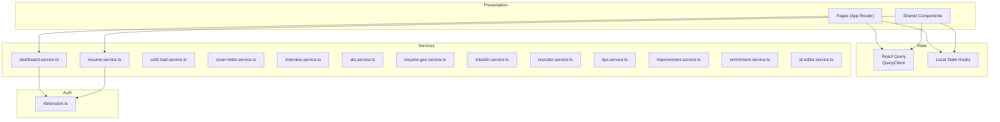
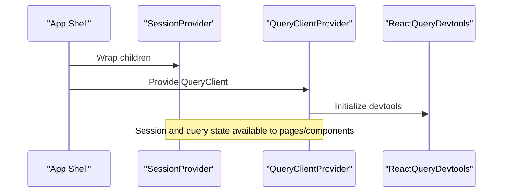
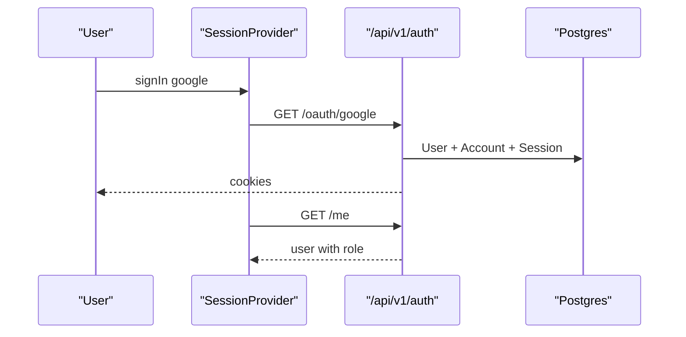
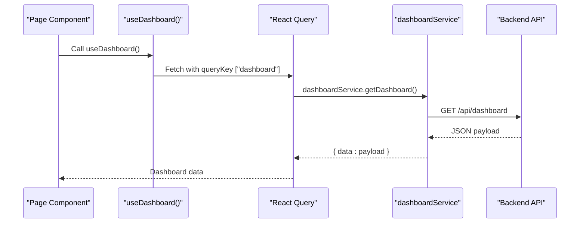
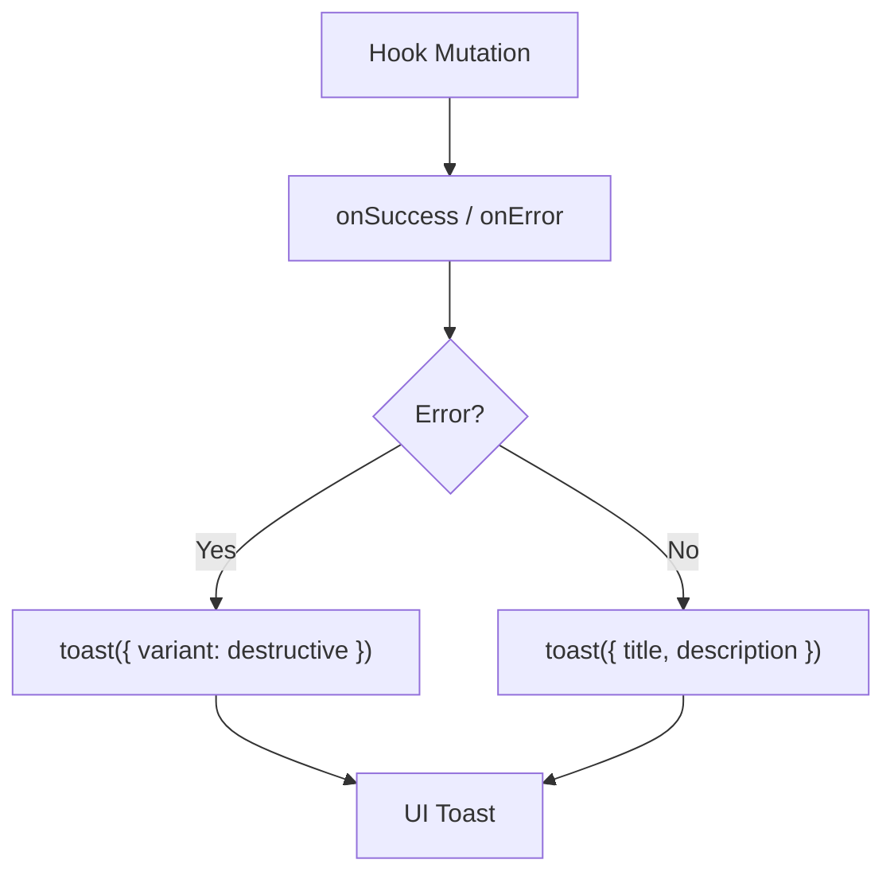
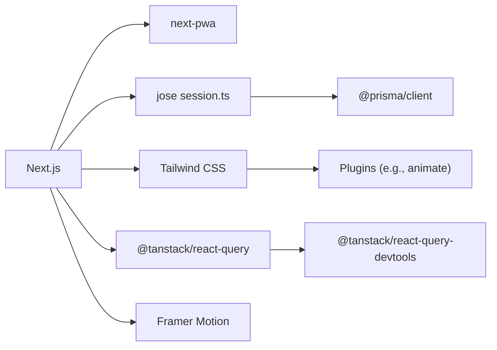

# Frontend application

Next.js App Router frontend: providers, layouts, feature pages, and the typed service layer that talks to FastAPI.

## Repository layout
Next.js App Router under `frontend/app`. Providers cover FastAPI session, React Query, and haptics. Navigation lives in `lib/navigation.ts`. Auth is Google OAuth on FastAPI, not NextAuth.

```mermaid
graph TB
A["app/layout.tsx<br/>Root HTML wrapper"] --> B["app/providers.tsx<br/>Providers: SessionProvider + QueryClientProvider"]
B --> C["app/layout-content.tsx<br/>LayoutContent + Navbar + Toaster"]
C --> D["app/page.tsx<br/>Home page"]
E["lib/navigation.ts<br/>navItems, mobileNavItems, actionItems"] --> C
F["lib/session.ts<br/>getSession"] --> B
G["tailwind.config.ts<br/>Design tokens + animations"] --> A
H["app/globals.css<br/>CSS variables + base styles"] --> A
```

## Building blocks
- Providers: React Query plus `SessionProvider` from `session-provider.tsx`.
- LayoutContent: Renders the Navbar, manages sidebar collapse state, and applies responsive spacing and transitions.
- Home page: Composes landing hero and value props sections.
- Navigation: Centralized navigation items and action items for desktop and mobile.
- Design system: Tailwind theme with CSS variables, Radix UI primitives, and Framer Motion animations.

Code to read:

- Providers initialization and defaults: `app/providers.tsx`
- LayoutContent sidebar-aware main area: `app/layout-content.tsx`
- Home page composition: `app/page.tsx`
- Navigation definitions: `lib/navigation.ts`
- Tailwind theme and brand tokens: `tailwind.config.ts`, `app/globals.css`

## How it fits together
The frontend follows a layered architecture:
- Presentation Layer: App Router pages and shared components.
- Service Layer: Typed clients per feature exporting a cohesive API surface.
- State Management: React Query for server state caching and optimistic updates; local state for UI toggles and ephemeral data.
- Authentication: FastAPI cookies. `getSession()` on the server, `useSession()` against `/api/v1/auth/me`.
- Styling: Tailwind CSS with design tokens, Radix UI for accessible primitives, and Framer Motion for animations.

```mermaid
graph TB
subgraph "Presentation"
P1["Pages (App Router)"]
P2["Shared Components"]
end
subgraph "State"
Q["React Query<br/>QueryClient"]
L["Local State Hooks"]
end
subgraph "Services"
S1["dashboard.service.ts"]
S2["resume.service.ts"]
S3["cold-mail.service.ts"]
S4["cover-letter.service.ts"]
S5["interview.service.ts"]
S6["ats.service.ts"]
S7["resume-gen.service.ts"]
S8["linkedin.service.ts"]
S9["recruiter.service.ts"]
S10["tips.service.ts"]
S11["improvement.service.ts"]
S12["enrichment.service.ts"]
S13["jd-editor.service.ts"]
end
subgraph "Auth"
A1["lib/session.ts"]
end
P1 --> Q
P2 --> Q
P1 --> L
P2 --> L
P1 --> S1
P2 --> S2
S1 --> A1
S2 --> A1
```

## Providers and state management
- React Query client is initialized with a staleTime of 1 minute, retry attempts of 2, and disabled window focus refetch. Devtools are conditionally rendered.
- `SessionProvider` wraps the app and seeds from `toClientSession(getSession())`.

Implementation references:
- Provider setup and defaults: `app/providers.tsx`
- QueryClient configuration: `app/providers.tsx`

```mermaid
sequenceDiagram
participant App as "App Shell"
participant SP as "SessionProvider"
participant QCP as "QueryClientProvider"
participant Dev as "ReactQueryDevtools"
App->>SP : Wrap children
App->>QCP : Provide QueryClient
QCP->>Dev : Initialize devtools
Note over SP,QCP : Session and query state available to pages/components
```

## Authentication state

Google OAuth. NextAuth is gone.

Implementation references:
- Server session: `lib/session.ts`
- Client session: `components/providers/session-provider.tsx`
- Sign-in page: `app/auth/page.tsx`

```mermaid
sequenceDiagram
participant U as "User"
participant SP as "SessionProvider"
participant Auth as "/api/v1/auth"
participant DB as "Postgres"
U->>SP : signIn google
SP->>Auth : GET /oauth/google
Auth->>DB : User + Account + Session
Auth-->>U : cookies
SP->>Auth : GET /me
Auth-->>SP : user with role
```

## Navigation and routing patterns
- Navigation items and action items are defined centrally for reuse across desktop and mobile views.
- The layout composes a Navbar and a main content area that adapts to sidebar collapse state.

Implementation references:
- Navigation definitions: `lib/navigation.ts`
- LayoutContent with responsive spacing: `app/layout-content.tsx`

```mermaid
flowchart TD
Start(["Render LayoutContent"]) --> LoadNav["Load navItems / mobileNavItems / actionItems"]
LoadNav --> RenderNavbar["Render Navbar with items"]
RenderNavbar --> ComputeSpacing["Compute main padding based on sidebar collapse"]
ComputeSpacing --> RenderMain["Render main content area"]
RenderMain --> End(["Done"])
```

## Service layer and API integration
- A central index exports all feature services for easy imports.
- Example hooks demonstrate fetching dashboard data and managing resume mutations with React Query and toast notifications.

Implementation references:
- Services index: `services/index.ts`
- Dashboard query hook: `hooks/queries/use-dashboard.ts`
- Resume mutations (rename/delete/upload): `hooks/queries/use-resumes.ts`

```mermaid
sequenceDiagram
participant Page as "Page Component"
participant Hook as "useDashboard()"
participant Query as "React Query"
participant Service as "dashboardService"
participant API as "Backend API"
Page->>Hook : Call useDashboard()
Hook->>Query : Fetch with queryKey ["dashboard"]
Query->>Service : dashboardService.getDashboard()
Service->>API : GET /api/dashboard
API-->>Service : JSON payload
Service-->>Query : { data : payload }
Query-->>Page : Dashboard data
```

## UI state management and toasts
- A custom toast manager provides singleton-like behavior with limits and timeouts, integrating with the UI toast components.
- Toasts are used in hooks to surface success and error feedback after mutations.

Implementation references:
- Toast manager and reducer: `hooks/use-toast.ts`
- Toast usage in resume hooks: `hooks/queries/use-resumes.ts`

```mermaid
flowchart TD
A["Hook Mutation"] --> B["onSuccess / onError"]
B --> C{"Error?"}
C --> |Yes| D["toast({ variant: destructive })"]
C --> |No| E["toast({ title, description })"]
D --> F["UI Toast"]
E --> F
```

## Responsive design and accessibility
- Responsive breakpoints and mobile navigation spacing are handled via CSS utilities and a dedicated hook.
- Tailwind theme defines brand tokens, semantic colors, and motion utilities for animations.
- Radix UI primitives are used across components for accessible controls.

Implementation references:
- Mobile detection hook: `hooks/use-mobile.ts`
- Tailwind theme and brand tokens: `tailwind.config.ts`
- Global CSS variables and animations: `app/globals.css`

## Dependencies
The frontend depends on Next.js, Prisma, React Query, Radix UI, Tailwind CSS, and Framer Motion. Auth uses jose against the FastAPI JWT.

```mermaid
graph LR
N["Next.js"] --> PWA["next-pwa"]
N --> NA["jose session.ts"]
N --> TW["Tailwind CSS"]
N --> RQ["@tanstack/react-query"]
N --> RM["Framer Motion"]
NA --> PRISMA["@prisma/client"]
RQ --> DEVTOOLS["@tanstack/react-query-devtools"]
TW --> PLUGINS["Plugins (e.g., animate)"]
```

## Performance
- React Query caching: staleTime reduces redundant network calls; retries improve resilience.
- PWA: next-pwa enables offline readiness and faster load times.
- Image optimization: next/image with remotePatterns for trusted avatars.
- Bundle hygiene: webpack fallbacks for Node.js modules in browser builds.

Recommendations:
- Prefer server-side rendering for SEO-sensitive pages.
- Use query keys to invalidate and refetch selectively.
- Lazy-load heavy components and images.
- Monitor bundle size and split vendor chunks if needed.

## Troubleshooting
Common issues and remedies:
- Hydration mismatches: suppressHydrationWarning in root layout for controlled hydration scenarios.
- PostHog browser errors: next.config.js includes webpack fallbacks and normal module replacement for node: imports.
- Authentication redirects: missing `ts_access_token` sends you to `/auth`. Password verification pages are leftovers (API 410).
- Toast stacking: limit set to 1 toast; ensure proper dismissal to avoid blocking newer messages.

References:
- Hydration suppression: `app/layout.tsx`
- PostHog webpack fixes: `next.config.js`
- Session: `lib/session.ts`
- Toast manager behavior: `hooks/use-toast.ts`

## Appendix

### Design system reference
- Tailwind theme: brand tokens, semantic colors, border radius, gradients, and keyframes.
- CSS variables: define HSL-based color scales for light/dark modes and surfaces.
- Animations: motion utilities for floating, glowing, and shimmer effects.

References:
- Tailwind theme extensions: `tailwind.config.ts`
- CSS variables and base styles: `app/globals.css`
