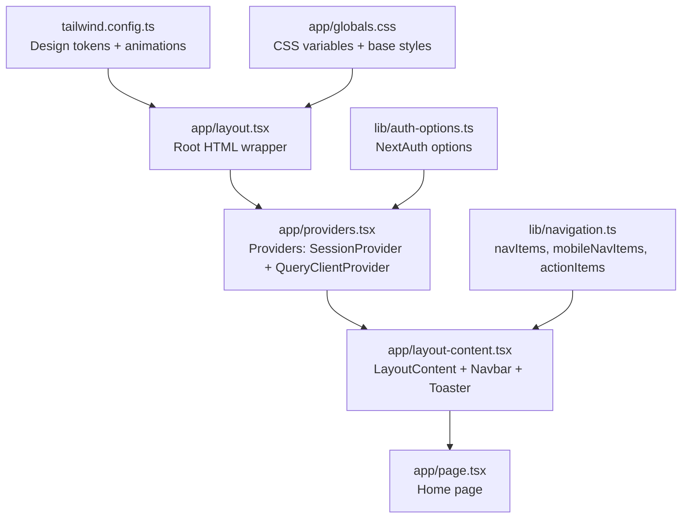
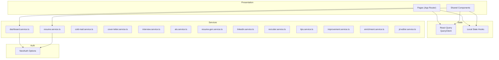
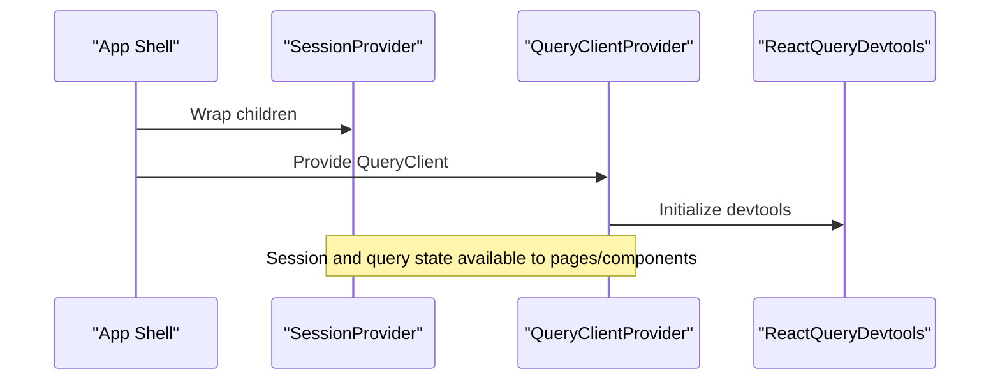
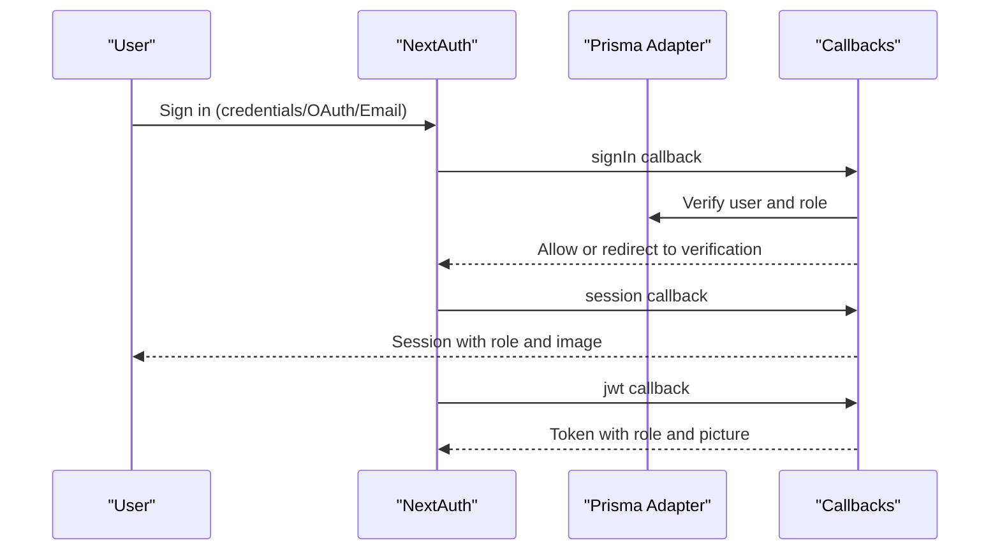
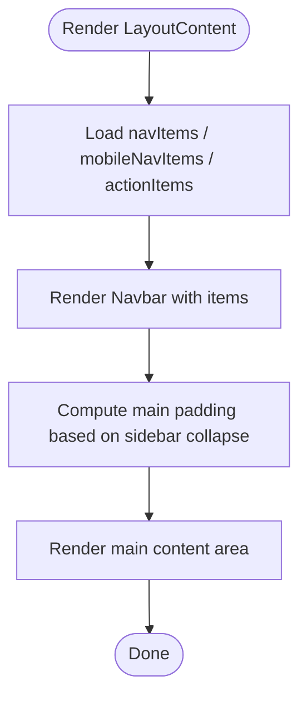
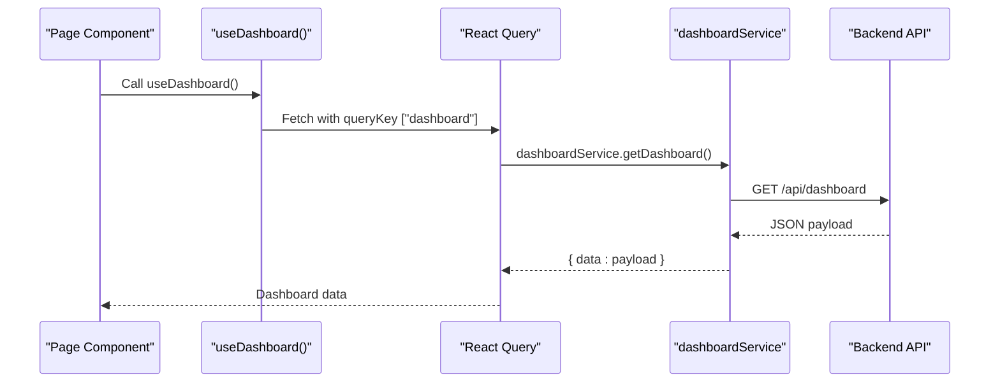
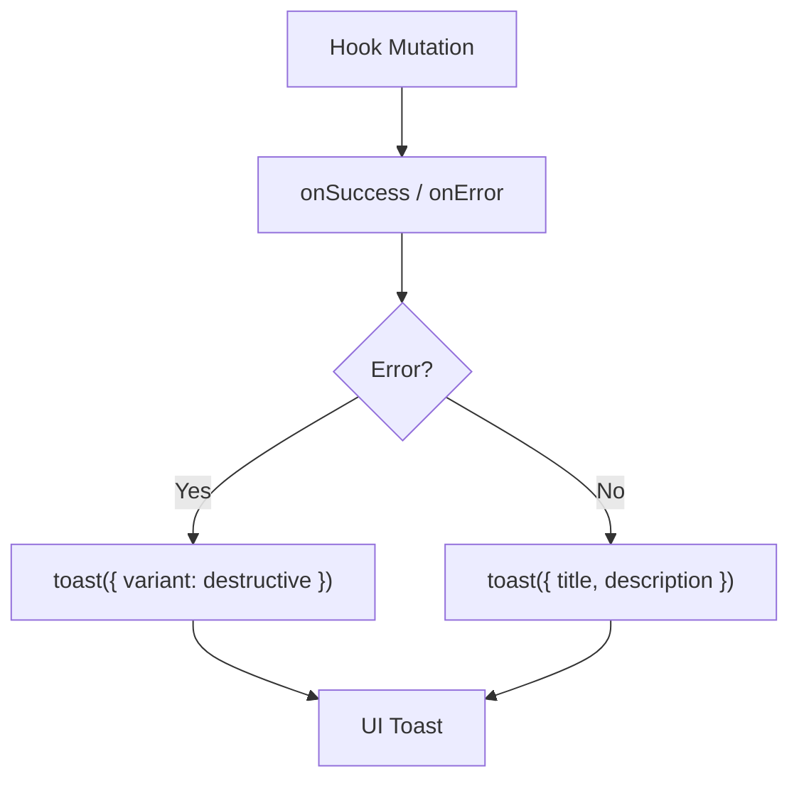
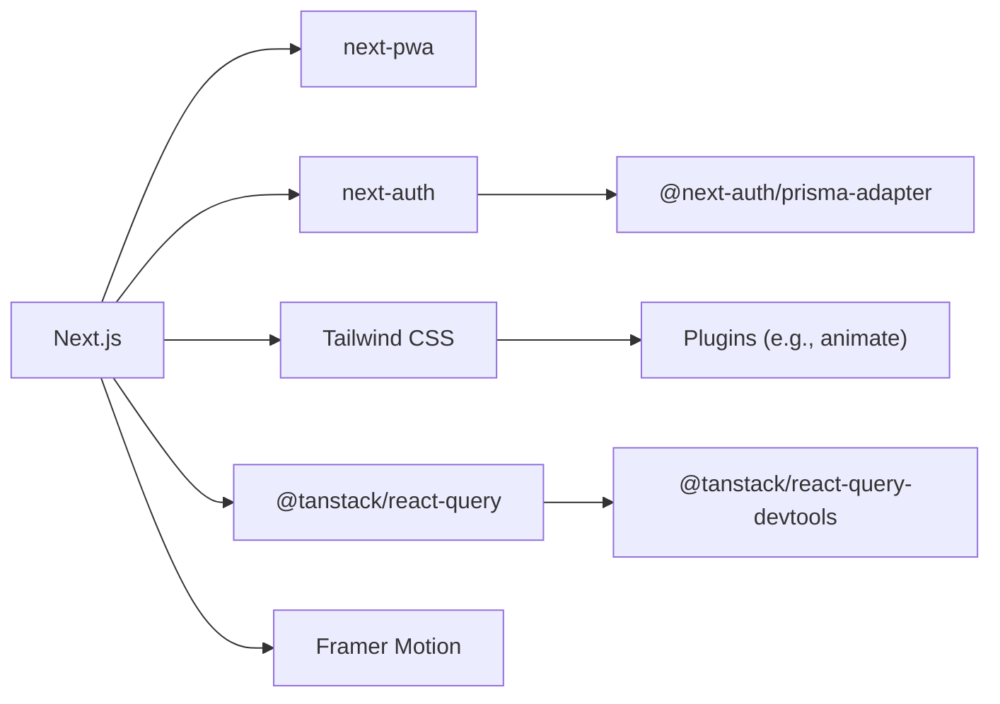

# Frontend application

## Introduction
This page describes the frontend architecture of the TalentSync-Normies Next.js application. It focuses on the App Router-based structure, page organization, component hierarchy, state management via React Query and local state, authentication state, and the design system built with Tailwind CSS, Radix UI, and Framer Motion. It also documents the service layer and API integration patterns, routing and navigation, user workflows, responsive design, accessibility, and cross-browser compatibility considerations.

## Project structure
The frontend is organized using Next.js App Router under the frontend/app directory. The application bootstraps providers for session management, React Query caching, and UI composition. Global styles and design tokens are centralized in Tailwind and CSS variables. Navigation items and actions are defined in a single module for reuse across layouts. Authentication is configured via NextAuth.js with multiple providers and callbacks.

```mermaid
graph TB
A["app/layout.tsx<br/>Root HTML wrapper"] --> B["app/providers.tsx<br/>Providers: SessionProvider + QueryClientProvider"]
B --> C["app/layout-content.tsx<br/>LayoutContent + Navbar + Toaster"]
C --> D["app/page.tsx<br/>Home page"]
E["lib/navigation.ts<br/>navItems, mobileNavItems, actionItems"] --> C
F["lib/auth-options.ts<br/>NextAuth options"] --> B
G["tailwind.config.ts<br/>Design tokens + animations"] --> A
H["app/globals.css<br/>CSS variables + base styles"] --> A
```

## Core components
- Providers: Initializes React Query with caching defaults and exposes devtools, and wraps the app with NextAuth's SessionProvider.
- LayoutContent: Renders the Navbar, manages sidebar collapse state, and applies responsive spacing and transitions.
- Home page: Composes landing hero and value props sections.
- Navigation: Centralized navigation items and action items for desktop and mobile.
- Design system: Tailwind theme with CSS variables, Radix UI primitives, and Framer Motion animations.

Key implementation references:
- Providers initialization and defaults: `app/providers.tsx`
- LayoutContent sidebar-aware main area: `app/layout-content.tsx`
- Home page composition: `app/page.tsx`
- Navigation definitions: `lib/navigation.ts`
- Tailwind theme and brand tokens: `tailwind.config.ts`, `app/globals.css`

## Architecture overview
The frontend follows a layered architecture:
- Presentation Layer: App Router pages and shared components.
- Service Layer: Typed clients per feature exporting a cohesive API surface.
- State Management: React Query for server state caching and optimistic updates; local state for UI toggles and ephemeral data.
- Authentication: NextAuth.js with JWT sessions and callbacks for role and verification handling.
- Styling: Tailwind CSS with design tokens, Radix UI for accessible primitives, and Framer Motion for animations.

```mermaid
graph TB
subgraph "Presentation"
P1["Pages (App Router)"]
P2["Shared Components"]
end
subgraph "State"
Q["React Query<br/>QueryClient"]
L["Local State Hooks"]
end
subgraph "Services"
S1["dashboard.service.ts"]
S2["resume.service.ts"]
S3["cold-mail.service.ts"]
S4["cover-letter.service.ts"]
S5["interview.service.ts"]
S6["ats.service.ts"]
S7["resume-gen.service.ts"]
S8["linkedin.service.ts"]
S9["recruiter.service.ts"]
S10["tips.service.ts"]
S11["improvement.service.ts"]
S12["enrichment.service.ts"]
S13["jd-editor.service.ts"]
end
subgraph "Auth"
A1["NextAuth Options"]
end
P1 --> Q
P2 --> Q
P1 --> L
P2 --> L
P1 --> S1
P2 --> S2
S1 --> A1
S2 --> A1
```

## Detailed component analysis

### Providers and state management
- React Query client is initialized with a staleTime of 1 minute, retry attempts of 2, and disabled window focus refetch. Devtools are conditionally rendered.
- SessionProvider from NextAuth wraps the app to expose session state to components.

Implementation references:
- Provider setup and defaults: `app/providers.tsx`
- QueryClient configuration: `app/providers.tsx`

```mermaid
sequenceDiagram
participant App as "App Shell"
participant SP as "SessionProvider"
participant QCP as "QueryClientProvider"
participant Dev as "ReactQueryDevtools"
App->>SP : Wrap children
App->>QCP : Provide QueryClient
QCP->>Dev : Initialize devtools
Note over SP,QCP : Session and query state available to pages/components
```

### Authentication state and NextAuth integration
- NextAuth is configured with multiple providers (credentials, Google, GitHub, Email) and a Prisma adapter.
- Callbacks manage role propagation, verification status, and image synchronization between OAuth and database.
- Pages redirect to a verification route for unverified credentials-based sign-ins.

Implementation references:
- NextAuth options and callbacks: `lib/auth-options.ts`
- Prisma adapter usage: `lib/auth-options.ts`
- Session and JWT callbacks: `lib/auth-options.ts`

```mermaid
sequenceDiagram
participant U as "User"
participant NA as "NextAuth"
participant DB as "Prisma Adapter"
participant CB as "Callbacks"
U->>NA : Sign in (credentials/OAuth/Email)
NA->>CB : signIn callback
CB->>DB : Verify user and role
CB-->>NA : Allow or redirect to verification
NA->>CB : session callback
CB-->>U : Session with role and image
NA->>CB : jwt callback
CB-->>NA : Token with role and picture
```

### Navigation and routing patterns
- Navigation items and action items are defined centrally for reuse across desktop and mobile views.
- The layout composes a Navbar and a main content area that adapts to sidebar collapse state.

Implementation references:
- Navigation definitions: `lib/navigation.ts`
- LayoutContent with responsive spacing: `app/layout-content.tsx`

```mermaid
flowchart TD
Start(["Render LayoutContent"]) --> LoadNav["Load navItems / mobileNavItems / actionItems"]
LoadNav --> RenderNavbar["Render Navbar with items"]
RenderNavbar --> ComputeSpacing["Compute main padding based on sidebar collapse"]
ComputeSpacing --> RenderMain["Render main content area"]
RenderMain --> End(["Done"])
```

### Service layer and API integration
- A central index exports all feature services for easy imports.
- Example hooks demonstrate fetching dashboard data and managing resume mutations with React Query and toast notifications.

Implementation references:
- Services index: `services/index.ts`
- Dashboard query hook: `hooks/queries/use-dashboard.ts`
- Resume mutations (rename/delete/upload): `hooks/queries/use-resumes.ts`

```mermaid
sequenceDiagram
participant Page as "Page Component"
participant Hook as "useDashboard()"
participant Query as "React Query"
participant Service as "dashboardService"
participant API as "Backend API"
Page->>Hook : Call useDashboard()
Hook->>Query : Fetch with queryKey ["dashboard"]
Query->>Service : dashboardService.getDashboard()
Service->>API : GET /api/dashboard
API-->>Service : JSON payload
Service-->>Query : { data : payload }
Query-->>Page : Dashboard data
```

### UI state management and toasts
- A custom toast manager provides singleton-like behavior with limits and timeouts, integrating with the UI toast components.
- Toasts are used in hooks to surface success and error feedback after mutations.

Implementation references:
- Toast manager and reducer: `hooks/use-toast.ts`
- Toast usage in resume hooks: `hooks/queries/use-resumes.ts`

```mermaid
flowchart TD
A["Hook Mutation"] --> B["onSuccess / onError"]
B --> C{"Error?"}
C --> |Yes| D["toast({ variant: destructive })"]
C --> |No| E["toast({ title, description })"]
D --> F["UI Toast"]
E --> F
```

### Responsive design and accessibility
- Responsive breakpoints and mobile navigation spacing are handled via CSS utilities and a dedicated hook.
- Tailwind theme defines brand tokens, semantic colors, and motion utilities for animations.
- Radix UI primitives are used across components for accessible controls.

Implementation references:
- Mobile detection hook: `hooks/use-mobile.ts`
- Tailwind theme and brand tokens: `tailwind.config.ts`
- Global CSS variables and animations: `app/globals.css`

## Dependency analysis
The frontend depends on Next.js, NextAuth, React Query, Radix UI, Tailwind CSS, and Framer Motion. Build-time and runtime configurations address PWA, image optimization, and external packages.

```mermaid
graph LR
N["Next.js"] --> PWA["next-pwa"]
N --> NA["next-auth"]
N --> TW["Tailwind CSS"]
N --> RQ["@tanstack/react-query"]
N --> RM["Framer Motion"]
NA --> PRISMA["@next-auth/prisma-adapter"]
RQ --> DEVTOOLS["@tanstack/react-query-devtools"]
TW --> PLUGINS["Plugins (e.g., animate)"]
```

## Performance considerations
- React Query caching: staleTime reduces redundant network calls; retries improve resilience.
- PWA: next-pwa enables offline readiness and faster load times.
- Image optimization: next/image with remotePatterns for trusted avatars.
- Bundle hygiene: webpack fallbacks for Node.js modules in browser builds.

Recommendations:
- Prefer server-side rendering for SEO-sensitive pages.
- Use query keys to invalidate and refetch selectively.
- Lazy-load heavy components and images.
- Monitor bundle size and split vendor chunks if needed.

## Troubleshooting guide
Common issues and remedies:
- Hydration mismatches: suppressHydrationWarning in root layout for controlled hydration scenarios.
- PostHog browser errors: next.config.js includes webpack fallbacks and normal module replacement for node: imports.
- Authentication redirects: unverified credentials sign-ins redirect to verification page; ensure email verification flow is completed.
- Toast stacking: limit set to 1 toast; ensure proper dismissal to avoid blocking newer messages.

References:
- Hydration suppression: `app/layout.tsx`
- PostHog webpack fixes: `next.config.js`
- Verification redirect: `lib/auth-options.ts`
- Toast manager behavior: `hooks/use-toast.ts`

## Conclusion
The frontend uses Next.js App Router, a reliable provider stack with React Query and NextAuth, and a cohesive design system. The service layer abstracts API interactions, while custom hooks encapsulate state and user feedback. Navigation and responsive utilities ensure a consistent experience across devices. The architecture supports scalability, maintainability, and a strong developer experience.

## Appendices

### Design system reference
- Tailwind theme: brand tokens, semantic colors, border radius, gradients, and keyframes.
- CSS variables: define HSL-based color scales for light/dark modes and surfaces.
- Animations: motion utilities for floating, glowing, and shimmer effects.

References:
- Tailwind theme extensions: `tailwind.config.ts`
- CSS variables and base styles: `app/globals.css`
