# Next.js Application Architecture

<cite>
**Referenced Files in This Document**
- [next.config.js](file://frontend/next.config.js)
- [package.json](file://frontend/package.json)
- [tsconfig.json](file://frontend/tsconfig.json)
- [instrumentation-client.ts](file://frontend/instrumentation-client.ts)
- [proxy.ts](file://frontend/proxy.ts)
- [app/layout.tsx](file://frontend/app/layout.tsx)
- [app/layout-content.tsx](file://frontend/app/layout-content.tsx)
- [app/providers.tsx](file://frontend/app/providers.tsx)
- [app/page.tsx](file://frontend/app/page.tsx)
- [app/error.tsx](file://frontend/app/error.tsx)
- [app/not-found.tsx](file://frontend/app/not-found.tsx)
- [app/global-error.tsx](file://frontend/app/global-error.tsx)
- [lib/auth-options.ts](file://frontend/lib/auth-options.ts)
- [lib/navigation.ts](file://frontend/lib/navigation.ts)
- [tailwind.config.ts](file://frontend/tailwind.config.ts)
- [postcss.config.js](file://frontend/postcss.config.js)
- [public/manifest.json](file://frontend/public/manifest.json)
</cite>

## Table of Contents
1. [Introduction](#introduction)
2. [Project Structure](#project-structure)
3. [Core Components](#core-components)
4. [Architecture Overview](#architecture-overview)
5. [Detailed Component Analysis](#detailed-component-analysis)
6. [Dependency Analysis](#dependency-analysis)
7. [Performance Considerations](#performance-considerations)
8. [Troubleshooting Guide](#troubleshooting-guide)
9. [Conclusion](#conclusion)
10. [Appendices](#appendices)

## Introduction
This document provides comprehensive documentation for the Next.js application architecture. It explains the App Router structure, page organization, and component hierarchy. It documents the application layout system, providers setup, and global configuration. It details the build configuration including PWA setup, image optimization, webpack customization, and external package handling. It covers routing patterns, middleware integration, and deployment considerations. It also addresses performance optimization strategies, code splitting, and bundle analysis, along with TypeScript configuration and type safety implementation throughout the application.

## Project Structure
The frontend application follows Next.js App Router conventions with a strict file-system-based routing structure under the app directory. Pages are organized by feature and route segments, with nested layouts and providers at the root level. Utility libraries and services are modularized under dedicated folders, while UI components are structured by feature and shared patterns.

Key structural highlights:
- App Router pages under app with nested layouts and providers
- Feature-specific pages grouped under functional namespaces (e.g., dashboard, auth, api)
- Shared UI components under components with feature-specific subfolders
- Services and hooks under services and hooks
- Utilities and types under lib and types
- Global styles and fonts configured at the root layout
- Build-time configuration under next.config.js, tsconfig.json, and related tooling files

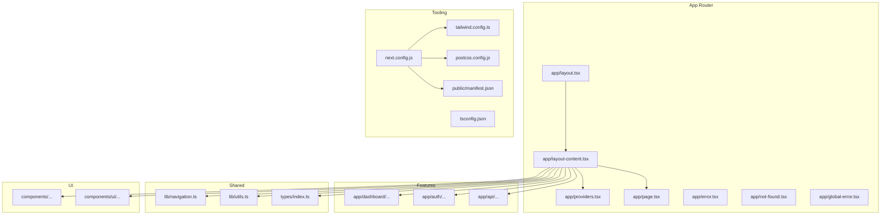

**Diagram sources**
- [app/layout.tsx](file://frontend/app/layout.tsx#L1-L52)
- [app/layout-content.tsx](file://frontend/app/layout-content.tsx#L1-L34)
- [app/providers.tsx](file://frontend/app/providers.tsx#L1-L38)
- [app/page.tsx](file://frontend/app/page.tsx#L1-L27)
- [app/error.tsx](file://frontend/app/error.tsx#L1-L28)
- [app/not-found.tsx](file://frontend/app/not-found.tsx#L1-L78)
- [app/global-error.tsx](file://frontend/app/global-error.tsx#L1-L32)
- [next.config.js](file://frontend/next.config.js#L1-L90)
- [tsconfig.json](file://frontend/tsconfig.json#L1-L43)
- [tailwind.config.ts](file://frontend/tailwind.config.ts#L1-L135)
- [postcss.config.js](file://frontend/postcss.config.js#L1-L7)
- [public/manifest.json](file://frontend/public/manifest.json#L1-L65)

**Section sources**
- [app/layout.tsx](file://frontend/app/layout.tsx#L1-L52)
- [app/layout-content.tsx](file://frontend/app/layout-content.tsx#L1-L34)
- [app/providers.tsx](file://frontend/app/providers.tsx#L1-L38)
- [next.config.js](file://frontend/next.config.js#L1-L90)
- [tsconfig.json](file://frontend/tsconfig.json#L1-L43)
- [tailwind.config.ts](file://frontend/tailwind.config.ts#L1-L135)
- [postcss.config.js](file://frontend/postcss.config.js#L1-L7)
- [public/manifest.json](file://frontend/public/manifest.json#L1-L65)

## Core Components
This section outlines the foundational components that define the application’s layout, providers, and global configuration.

- Root layout and metadata: Defines application metadata, fonts, and the root HTML wrapper with theme and manifest integration.
- Layout content: Provides the main content area with navigation, sidebar provider, and toast notifications.
- Providers: Wraps the application with session and query providers, configuring caching and retries for data fetching.
- Global error boundaries: Implements error and not-found handlers for graceful degradation and user feedback.
- Tooling configuration: Next.js configuration for PWA, images, webpack, and PostHog proxying; TypeScript strictness and module resolution; Tailwind and PostCSS setup.

Key implementation references:
- Root layout and metadata: [app/layout.tsx](file://frontend/app/layout.tsx#L1-L52)
- Layout content and sidebar provider: [app/layout-content.tsx](file://frontend/app/layout-content.tsx#L1-L34)
- Providers and React Query configuration: [app/providers.tsx](file://frontend/app/providers.tsx#L1-L38)
- Global error and not-found handlers: [app/error.tsx](file://frontend/app/error.tsx#L1-L28), [app/not-found.tsx](file://frontend/app/not-found.tsx#L1-L78), [app/global-error.tsx](file://frontend/app/global-error.tsx#L1-L32)
- Next.js configuration: [next.config.js](file://frontend/next.config.js#L1-L90)
- TypeScript configuration: [tsconfig.json](file://frontend/tsconfig.json#L1-L43)
- Tailwind and PostCSS: [tailwind.config.ts](file://frontend/tailwind.config.ts#L1-L135), [postcss.config.js](file://frontend/postcss.config.js#L1-L7)
- PWA manifest: [public/manifest.json](file://frontend/public/manifest.json#L1-L65)

**Section sources**
- [app/layout.tsx](file://frontend/app/layout.tsx#L1-L52)
- [app/layout-content.tsx](file://frontend/app/layout-content.tsx#L1-L34)
- [app/providers.tsx](file://frontend/app/providers.tsx#L1-L38)
- [app/error.tsx](file://frontend/app/error.tsx#L1-L28)
- [app/not-found.tsx](file://frontend/app/not-found.tsx#L1-L78)
- [app/global-error.tsx](file://frontend/app/global-error.tsx#L1-L32)
- [next.config.js](file://frontend/next.config.js#L1-L90)
- [tsconfig.json](file://frontend/tsconfig.json#L1-L43)
- [tailwind.config.ts](file://frontend/tailwind.config.ts#L1-L135)
- [postcss.config.js](file://frontend/postcss.config.js#L1-L7)
- [public/manifest.json](file://frontend/public/manifest.json#L1-L65)

## Architecture Overview
The application architecture centers around the Next.js App Router with a layered approach:
- Presentation layer: Root layout, layout content, and feature pages
- State management: Session and query providers for authentication and data fetching
- Routing and middleware: NextAuth middleware for authentication and role-based redirection
- Analytics and observability: PostHog client-side initialization
- Build and deployment: PWA, image optimization, webpack customization, and external packages

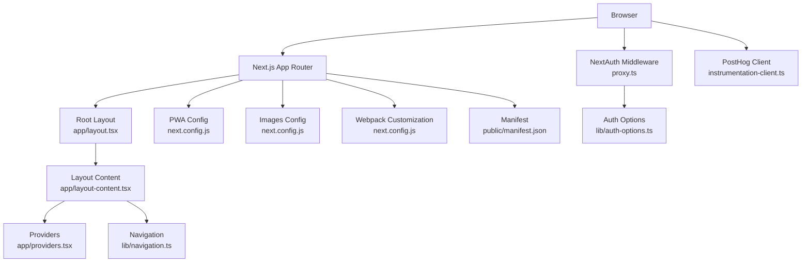

**Diagram sources**
- [app/layout.tsx](file://frontend/app/layout.tsx#L1-L52)
- [app/layout-content.tsx](file://frontend/app/layout-content.tsx#L1-L34)
- [app/providers.tsx](file://frontend/app/providers.tsx#L1-L38)
- [lib/navigation.ts](file://frontend/lib/navigation.ts#L1-L116)
- [proxy.ts](file://frontend/proxy.ts#L1-L31)
- [lib/auth-options.ts](file://frontend/lib/auth-options.ts#L1-L202)
- [next.config.js](file://frontend/next.config.js#L1-L90)
- [instrumentation-client.ts](file://frontend/instrumentation-client.ts#L1-L12)
- [public/manifest.json](file://frontend/public/manifest.json#L1-L65)

## Detailed Component Analysis

### Layout System and Providers
The layout system establishes a consistent shell across pages:
- Root layout sets metadata, fonts, theme variables, and mounts the Providers and LayoutContent wrappers.
- LayoutContent manages the main content area, navigation bar, sidebar provider, and toast notifications.
- Providers configure session management and React Query with caching and retry policies.

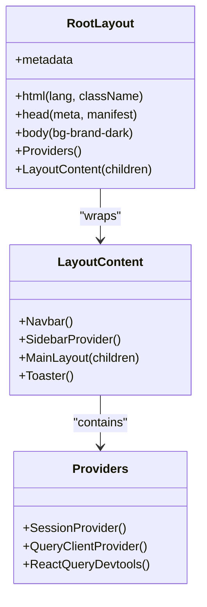

**Diagram sources**
- [app/layout.tsx](file://frontend/app/layout.tsx#L1-L52)
- [app/layout-content.tsx](file://frontend/app/layout-content.tsx#L1-L34)
- [app/providers.tsx](file://frontend/app/providers.tsx#L1-L38)

**Section sources**
- [app/layout.tsx](file://frontend/app/layout.tsx#L1-L52)
- [app/layout-content.tsx](file://frontend/app/layout-content.tsx#L1-L34)
- [app/providers.tsx](file://frontend/app/providers.tsx#L1-L38)

### Routing Patterns and Middleware Integration
Routing leverages Next.js App Router conventions with dynamic routes and catch-all patterns. Authentication and role-based redirection are handled via NextAuth middleware:
- Dynamic routes: e.g., dashboard pages with slug-based routing
- Catch-all routes: e.g., API namespaces with dynamic segments
- Middleware enforces role selection for authenticated users without roles and redirects accordingly

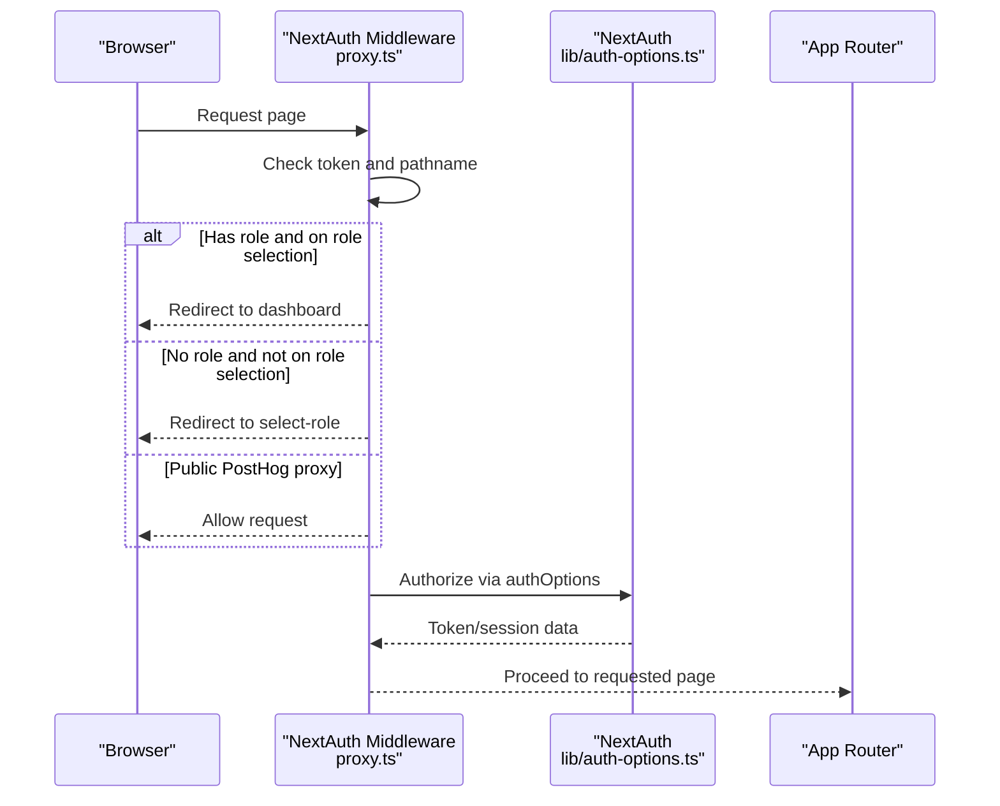

**Diagram sources**
- [proxy.ts](file://frontend/proxy.ts#L1-L31)
- [lib/auth-options.ts](file://frontend/lib/auth-options.ts#L1-L202)

**Section sources**
- [proxy.ts](file://frontend/proxy.ts#L1-L31)
- [lib/auth-options.ts](file://frontend/lib/auth-options.ts#L1-L202)

### Build Configuration and PWA Setup
The build configuration integrates PWA capabilities, image optimization, and webpack customization:
- PWA: Enabled via next-pwa with service worker registration and skipWaiting
- Images: Unoptimized mode with remote patterns for avatar providers
- Webpack: Browser-side fixes for Node.js modules and PostHog instrumentation compatibility
- Rewrites: Proxy for PostHog static assets and API requests
- External packages: serverExternalPackages includes @prisma/client and bcrypt

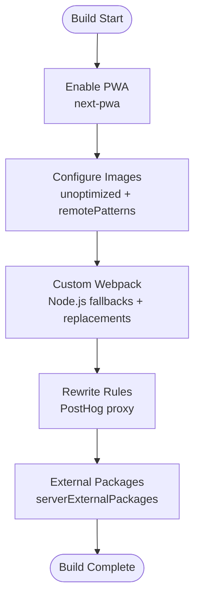

**Diagram sources**
- [next.config.js](file://frontend/next.config.js#L1-L90)

**Section sources**
- [next.config.js](file://frontend/next.config.js#L1-L90)

### TypeScript Configuration and Type Safety
TypeScript is configured for strict type checking and modern module resolution:
- Strict mode enabled with noEmit
- Bundler module resolution and isolated modules
- JSX runtime set to react-jsx
- Path aliases (@/*) mapped to root
- Included types for Next.js and generated types

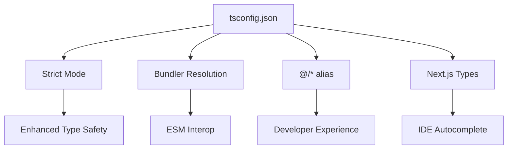

**Diagram sources**
- [tsconfig.json](file://frontend/tsconfig.json#L1-L43)

**Section sources**
- [tsconfig.json](file://frontend/tsconfig.json#L1-L43)

### UI Theme and Styling
Tailwind CSS and PostCSS provide a consistent design system:
- Dark mode support with class strategy
- Extended color palette and typography tokens
- Animations and responsive utilities
- Auto-prefixing and Tailwind integration

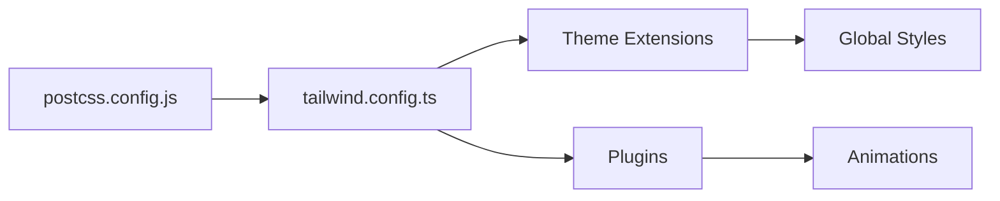

**Diagram sources**
- [tailwind.config.ts](file://frontend/tailwind.config.ts#L1-L135)
- [postcss.config.js](file://frontend/postcss.config.js#L1-L7)

**Section sources**
- [tailwind.config.ts](file://frontend/tailwind.config.ts#L1-L135)
- [postcss.config.js](file://frontend/postcss.config.js#L1-L7)

### Navigation and UI Components
Navigation items and action cards guide users through features:
- Navigation items for desktop and mobile
- Action items for quick feature access
- Shared UI components for forms, dialogs, and interactive elements

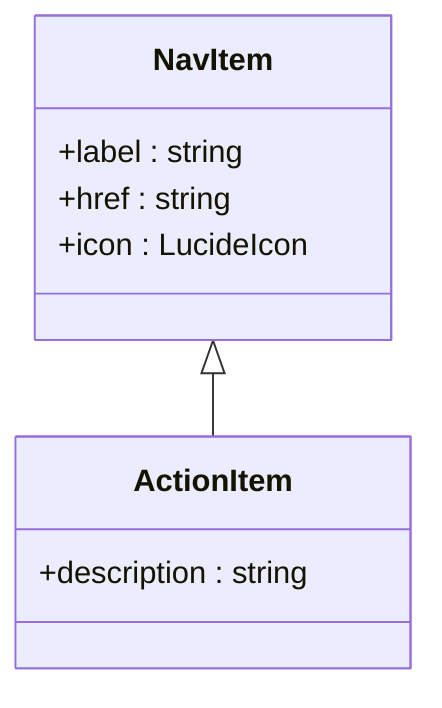

**Diagram sources**
- [lib/navigation.ts](file://frontend/lib/navigation.ts#L16-L24)

**Section sources**
- [lib/navigation.ts](file://frontend/lib/navigation.ts#L1-L116)

### Error Boundaries and User Feedback
Error boundaries provide graceful handling of errors and not-found scenarios:
- Page-level error boundary with reset functionality
- Global error boundary for top-level failures
- Not-found page with themed visuals and navigation

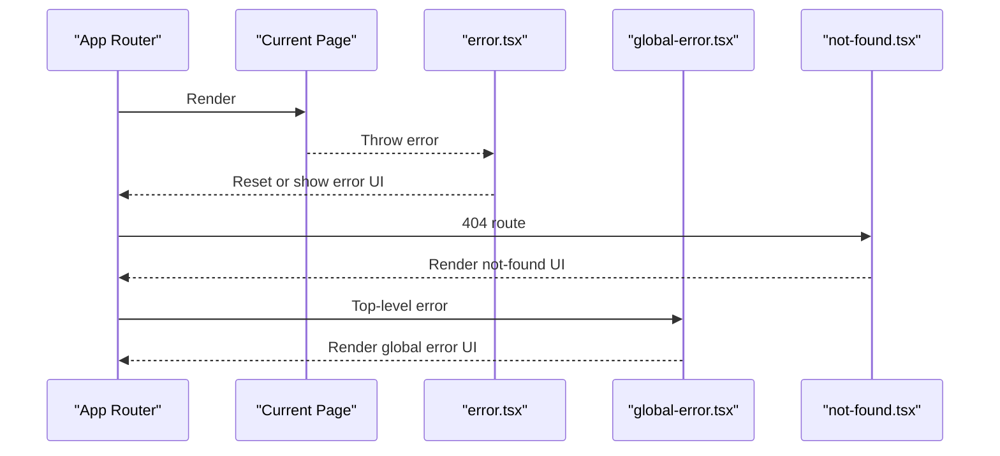

**Diagram sources**
- [app/error.tsx](file://frontend/app/error.tsx#L1-L28)
- [app/not-found.tsx](file://frontend/app/not-found.tsx#L1-L78)
- [app/global-error.tsx](file://frontend/app/global-error.tsx#L1-L32)

**Section sources**
- [app/error.tsx](file://frontend/app/error.tsx#L1-L28)
- [app/not-found.tsx](file://frontend/app/not-found.tsx#L1-L78)
- [app/global-error.tsx](file://frontend/app/global-error.tsx#L1-L32)

### Analytics Integration
PostHog client-side initialization supports analytics and event tracking:
- Client-side initialization with environment keys
- Proxy configuration for API and static assets
- Trailing slash handling for API compatibility

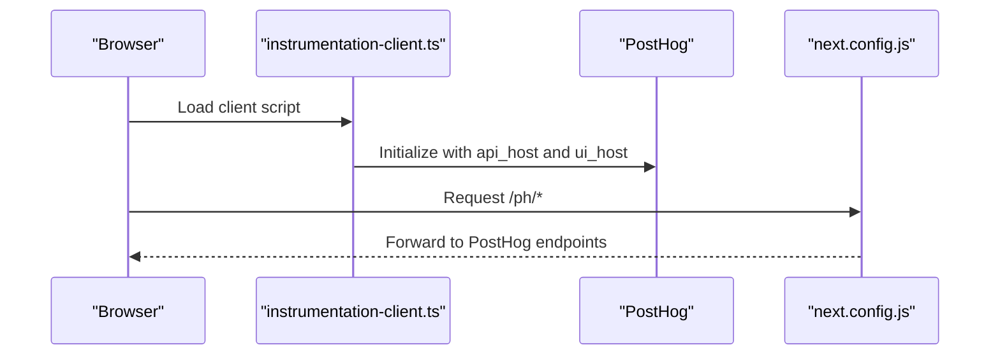

**Diagram sources**
- [instrumentation-client.ts](file://frontend/instrumentation-client.ts#L1-L12)
- [next.config.js](file://frontend/next.config.js#L73-L86)

**Section sources**
- [instrumentation-client.ts](file://frontend/instrumentation-client.ts#L1-L12)
- [next.config.js](file://frontend/next.config.js#L73-L86)

## Dependency Analysis
The application’s dependencies span UI libraries, state management, authentication, analytics, and build tools. The dependency graph highlights core integrations and potential coupling points.

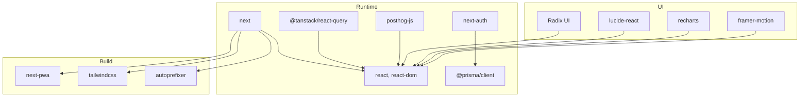

**Diagram sources**
- [package.json](file://frontend/package.json#L17-L85)
- [next.config.js](file://frontend/next.config.js#L1-L90)
- [tailwind.config.ts](file://frontend/tailwind.config.ts#L1-L135)

**Section sources**
- [package.json](file://frontend/package.json#L1-L114)
- [next.config.js](file://frontend/next.config.js#L1-L90)
- [tailwind.config.ts](file://frontend/tailwind.config.ts#L1-L135)

## Performance Considerations
Performance is addressed through several mechanisms:
- Image optimization: Unoptimized images with controlled remote patterns to reduce unnecessary processing
- PWA: Service worker registration and skipWaiting improve offline readiness and load performance
- Webpack customization: Node.js module fallbacks prevent runtime errors and reduce bundle bloat
- React Query caching: Stale-time and retry configurations minimize redundant network requests
- Tailwind purging: Content paths ensure unused styles are removed during build

Recommendations:
- Enable image optimization selectively for performance-sensitive assets
- Monitor bundle sizes and split large components
- Use React Suspense boundaries for data-intensive pages
- Leverage Next.js static generation where feasible

**Section sources**
- [next.config.js](file://frontend/next.config.js#L11-L24)
- [app/providers.tsx](file://frontend/app/providers.tsx#L14-L27)
- [tailwind.config.ts](file://frontend/tailwind.config.ts#L5-L8)

## Troubleshooting Guide
Common issues and resolutions:
- Authentication loops: Verify middleware redirection logic and token presence
- Role selection redirects: Ensure proper handling of authenticated users without roles
- PostHog proxy errors: Confirm rewrite rules and trailing slash configuration
- Image loading issues: Validate remote patterns and asset URLs
- Build errors for Node.js modules: Confirm webpack fallbacks and replacements

Diagnostics:
- Review NextAuth callbacks and session/token updates
- Inspect React Query cache behavior and stale times
- Check PWA registration and service worker lifecycle
- Validate Tailwind content paths and purge behavior

**Section sources**
- [proxy.ts](file://frontend/proxy.ts#L1-L31)
- [lib/auth-options.ts](file://frontend/lib/auth-options.ts#L98-L195)
- [next.config.js](file://frontend/next.config.js#L26-L86)
- [app/providers.tsx](file://frontend/app/providers.tsx#L14-L27)
- [tailwind.config.ts](file://frontend/tailwind.config.ts#L5-L8)

## Conclusion
The Next.js application employs a robust App Router architecture with strong layout and provider patterns, comprehensive authentication via NextAuth, and integrated analytics through PostHog. The build configuration emphasizes PWA readiness, controlled image optimization, and webpack customization for compatibility. TypeScript and Tailwind contribute to type safety and maintainable styling. The middleware ensures secure and role-aware routing, while error boundaries provide resilient user experiences.

## Appendices

### Deployment Considerations
- Environment variables for authentication and analytics
- PWA manifest and service worker registration
- Build scripts invoking Prisma generation and migrations
- Docker and compose configurations for containerized deployment

**Section sources**
- [package.json](file://frontend/package.json#L5-L12)
- [public/manifest.json](file://frontend/public/manifest.json#L1-L65)
- [next.config.js](file://frontend/next.config.js#L1-L90)