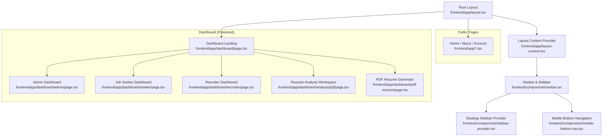
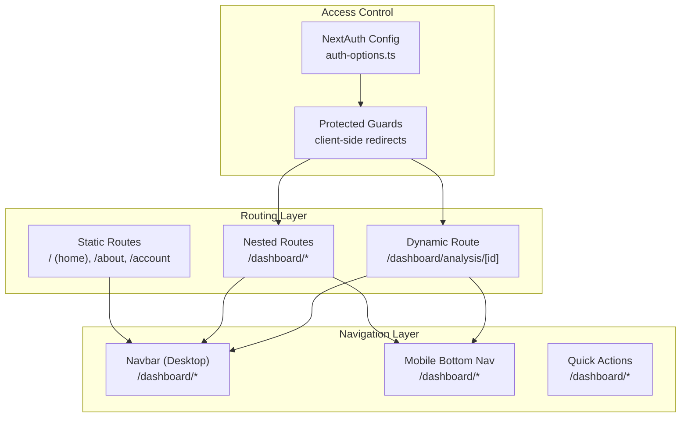
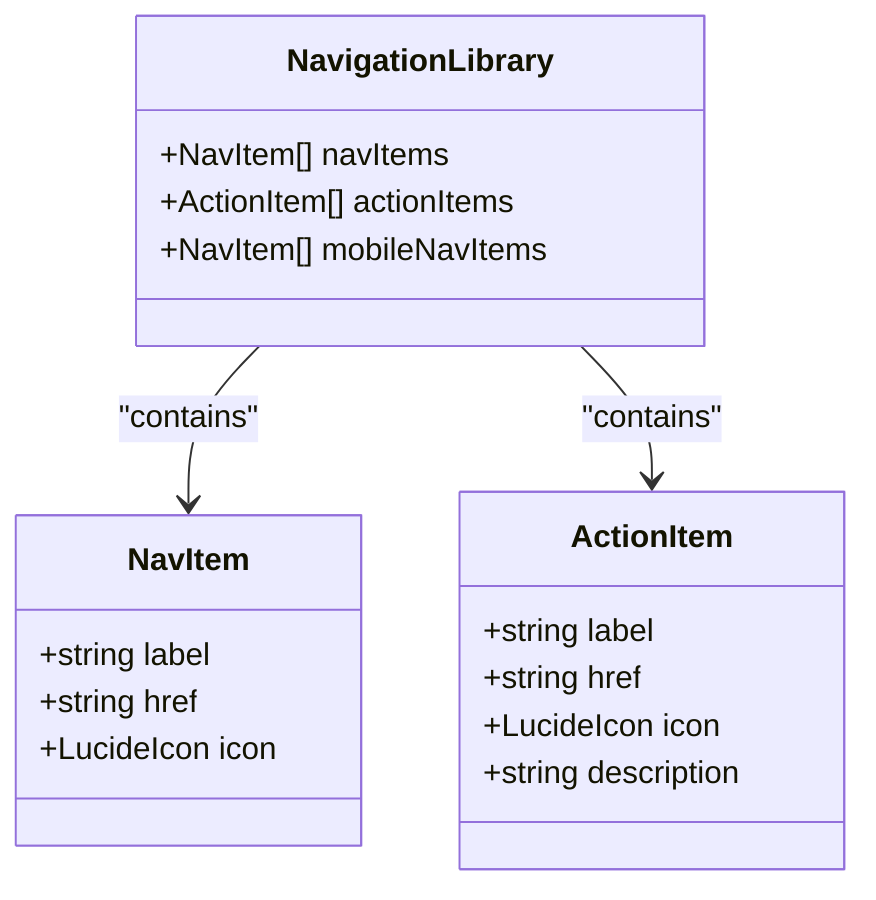
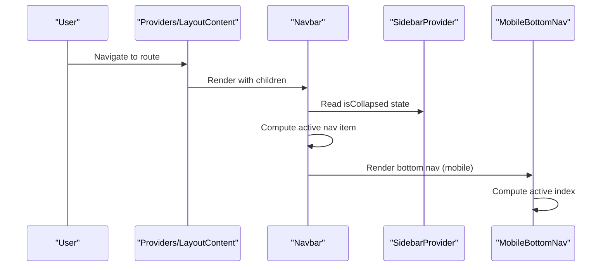
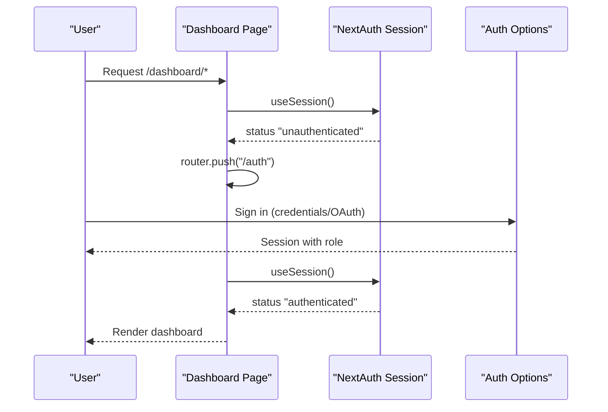
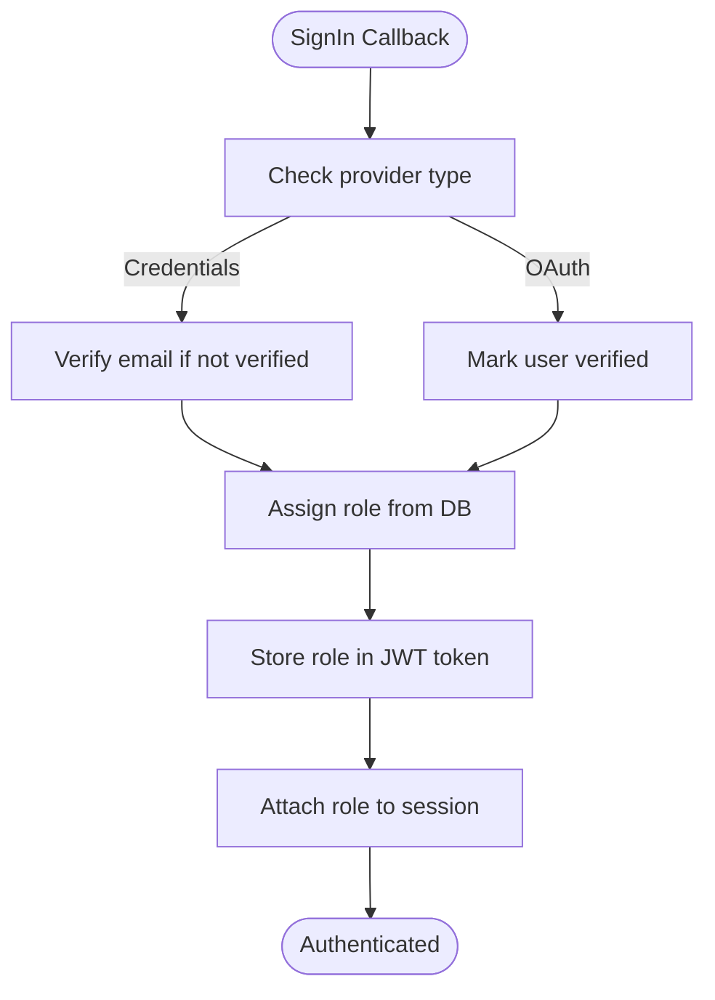
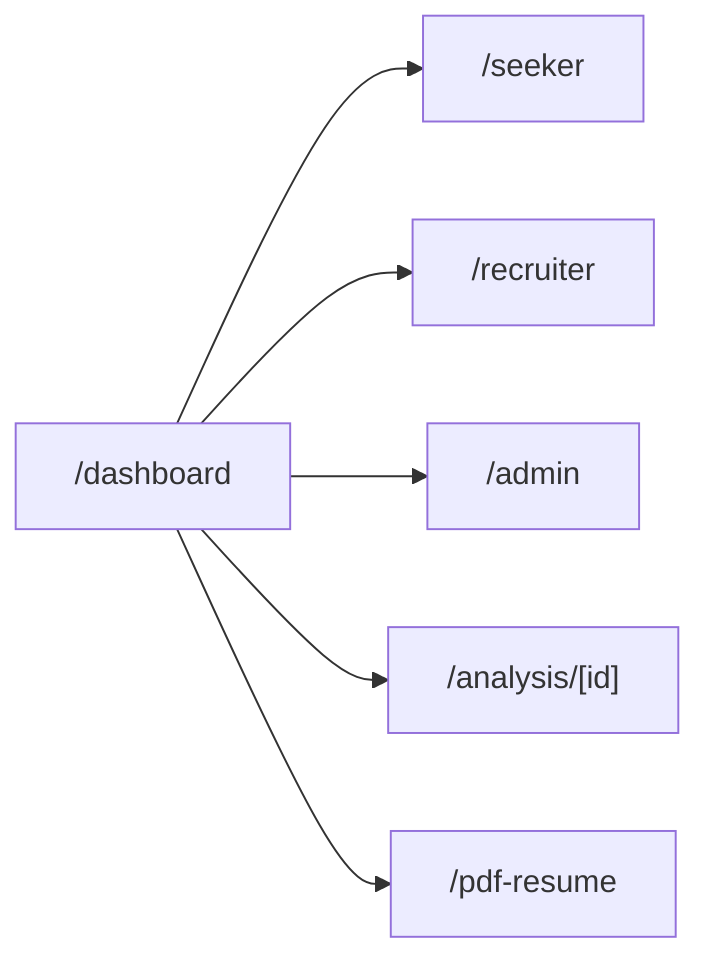
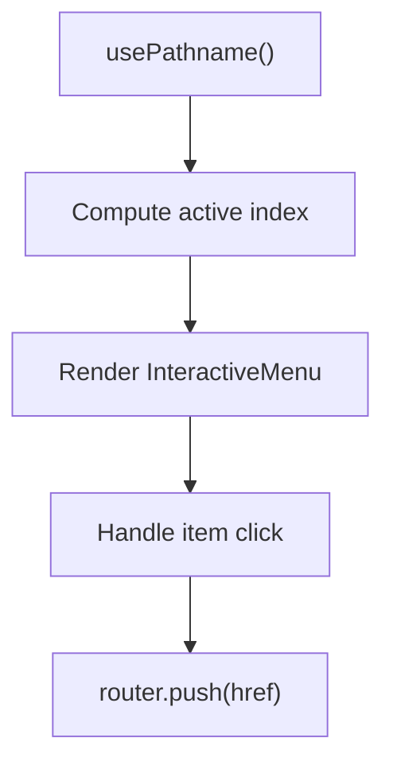
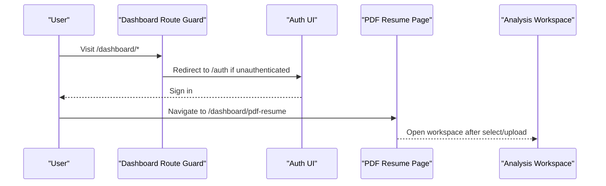
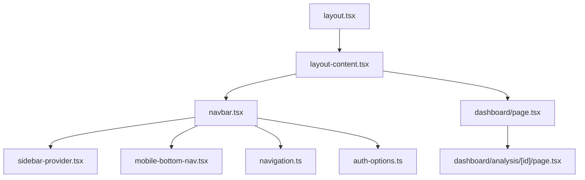

# Page Routing and Navigation

<cite>
**Referenced Files in This Document**
- [layout.tsx](file://frontend/app/layout.tsx)
- [layout-content.tsx](file://frontend/app/layout-content.tsx)
- [navigation.ts](file://frontend/lib/navigation.ts)
- [navbar.tsx](file://frontend/components/navbar.tsx)
- [sidebar-provider.tsx](file://frontend/components/sidebar-provider.tsx)
- [mobile-bottom-nav.tsx](file://frontend/components/mobile-bottom-nav.tsx)
- [auth-options.ts](file://frontend/lib/auth-options.ts)
- [dashboard/page.tsx](file://frontend/app/dashboard/page.tsx)
- [dashboard/admin/page.tsx](file://frontend/app/dashboard/admin/page.tsx)
- [dashboard/seeker/page.tsx](file://frontend/app/dashboard/seeker/page.tsx)
- [dashboard/recruiter/page.tsx](file://frontend/app/dashboard/recruiter/page.tsx)
- [dashboard/analysis/[id]/page.tsx](file://frontend/app/dashboard/analysis/[id]/page.tsx)
- [dashboard/pdf-resume/page.tsx](file://frontend/app/dashboard/pdf-resume/page.tsx)
</cite>

## Table of Contents
1. [Introduction](#introduction)
2. [Project Structure](#project-structure)
3. [Core Components](#core-components)
4. [Architecture Overview](#architecture-overview)
5. [Detailed Component Analysis](#detailed-component-analysis)
6. [Dependency Analysis](#dependency-analysis)
7. [Performance Considerations](#performance-considerations)
8. [Troubleshooting Guide](#troubleshooting-guide)
9. [Conclusion](#conclusion)

## Introduction
This document explains the Next.js routing system and navigation patterns used in the project. It covers page structure, dynamic routing, nested routing, and the navigation architecture. It also documents authentication-aware routing, role-based access control, protected route handling, and responsive navigation patterns across desktop, tablet, and mobile. Finally, it outlines performance considerations for routing and navigation.

## Project Structure
The application follows Next.js App Router conventions with a strict file-system-based routing hierarchy under the app directory. Pages are grouped by feature and role, with nested routes enabling deep linking and contextual navigation.

**Diagram sources**
- [layout.tsx](file://frontend/app/layout.tsx#L23-L51)
- [layout-content.tsx](file://frontend/app/layout-content.tsx#L27-L33)
- [navbar.tsx](file://frontend/components/navbar.tsx#L28-L397)
- [sidebar-provider.tsx](file://frontend/components/sidebar-provider.tsx#L12-L28)
- [mobile-bottom-nav.tsx](file://frontend/components/mobile-bottom-nav.tsx#L23-L64)
- [dashboard/page.tsx](file://frontend/app/dashboard/page.tsx#L89-L165)
- [dashboard/admin/page.tsx](file://frontend/app/dashboard/admin/page.tsx#L74-L248)
- [dashboard/seeker/page.tsx](file://frontend/app/dashboard/seeker/page.tsx#L20-L196)
- [dashboard/recruiter/page.tsx](file://frontend/app/dashboard/recruiter/page.tsx#L35-L651)
- [dashboard/analysis/[id]/page.tsx](file://frontend/app/dashboard/analysis/[id]/page.tsx#L56-L223)
- [dashboard/pdf-resume/page.tsx](file://frontend/app/dashboard/pdf-resume/page.tsx#L16-L180)

**Section sources**
- [layout.tsx](file://frontend/app/layout.tsx#L23-L51)
- [layout-content.tsx](file://frontend/app/layout-content.tsx#L27-L33)

## Core Components
- Root layout and providers: Sets global styles, theme fonts, manifest, and wraps children with Providers and LayoutContent.
- Layout content provider: Hosts Navbar and applies responsive margins and sidebar offset.
- Navigation library: Centralizes nav items, quick actions, and mobile navigation items.
- Navbar: Desktop sidebar with collapsible behavior, user section, and quick actions; tablet and mobile menus.
- Sidebar provider: Global state for sidebar collapse to synchronize layout spacing.
- Mobile bottom navigation: Bottom tab bar with floating action button and active state handling.
- Authentication and role-based access: NextAuth configuration and protected route guards.

**Section sources**
- [layout.tsx](file://frontend/app/layout.tsx#L17-L51)
- [layout-content.tsx](file://frontend/app/layout-content.tsx#L8-L33)
- [navigation.ts](file://frontend/lib/navigation.ts#L16-L116)
- [navbar.tsx](file://frontend/components/navbar.tsx#L28-L397)
- [sidebar-provider.tsx](file://frontend/components/sidebar-provider.tsx#L12-L28)
- [mobile-bottom-nav.tsx](file://frontend/components/mobile-bottom-nav.tsx#L23-L64)
- [auth-options.ts](file://frontend/lib/auth-options.ts#L10-L201)

## Architecture Overview
The routing architecture combines:
- Static routes for public pages (home, about, account).
- Nested routes under dashboard for role-specific dashboards and analysis workspaces.
- Dynamic routes for per-resume analysis ([id]).
- Protected routes enforced via client-side guards and NextAuth callbacks.

**Diagram sources**
- [dashboard/page.tsx](file://frontend/app/dashboard/page.tsx#L89-L165)
- [dashboard/analysis/[id]/page.tsx](file://frontend/app/dashboard/analysis/[id]/page.tsx#L56-L194)
- [navbar.tsx](file://frontend/components/navbar.tsx#L28-L397)
- [mobile-bottom-nav.tsx](file://frontend/components/mobile-bottom-nav.tsx#L23-L64)
- [auth-options.ts](file://frontend/lib/auth-options.ts#L98-L196)

## Detailed Component Analysis

### Navigation Library and Menu Systems
The navigation library defines:
- Nav items for primary navigation.
- Quick actions for authenticated users.
- Mobile navigation items optimized for bottom tab bar.

**Diagram sources**
- [navigation.ts](file://frontend/lib/navigation.ts#L16-L116)

**Section sources**
- [navigation.ts](file://frontend/lib/navigation.ts#L16-L116)

### Navbar and Sidebar Integration
The Navbar renders:
- Collapsible desktop sidebar with active-state highlighting.
- Quick actions for authenticated users.
- User section with dashboard and sign-out links.
- Tablet menu overlay with active highlighting.
- Mobile bottom navigation integrated via LayoutContent.

**Diagram sources**
- [layout-content.tsx](file://frontend/app/layout-content.tsx#L8-L33)
- [navbar.tsx](file://frontend/components/navbar.tsx#L28-L397)
- [sidebar-provider.tsx](file://frontend/components/sidebar-provider.tsx#L12-L28)
- [mobile-bottom-nav.tsx](file://frontend/components/mobile-bottom-nav.tsx#L23-L64)

**Section sources**
- [layout-content.tsx](file://frontend/app/layout-content.tsx#L8-L33)
- [navbar.tsx](file://frontend/components/navbar.tsx#L28-L397)
- [sidebar-provider.tsx](file://frontend/components/sidebar-provider.tsx#L12-L28)
- [mobile-bottom-nav.tsx](file://frontend/components/mobile-bottom-nav.tsx#L23-L64)

### Protected Routes and Authentication-Aware Routing
Protected routes are enforced through:
- Client-side guards in dashboard pages redirect unauthenticated users to the sign-in page.
- NextAuth callbacks inject role into session/token and enforce verification for credential-based sign-ins.

**Diagram sources**
- [dashboard/page.tsx](file://frontend/app/dashboard/page.tsx#L89-L165)
- [auth-options.ts](file://frontend/lib/auth-options.ts#L98-L196)

**Section sources**
- [dashboard/page.tsx](file://frontend/app/dashboard/page.tsx#L89-L165)
- [auth-options.ts](file://frontend/lib/auth-options.ts#L98-L196)

### Role-Based Access Control Implementation
Role-based access is handled in:
- NextAuth callbacks: role stored in JWT token and session.
- UI rendering: role displayed in user section and used to tailor quick actions.

**Diagram sources**
- [auth-options.ts](file://frontend/lib/auth-options.ts#L98-L196)

**Section sources**
- [auth-options.ts](file://frontend/lib/auth-options.ts#L98-L196)

### Dynamic Routing and Nested Routing Patterns
Dynamic and nested routing patterns include:
- Dynamic route for resume analysis: [id] under /dashboard/analysis.
- Nested dashboards for roles: /dashboard/seeker, /dashboard/recruiter, /dashboard/admin.
- Nested route for PDF resume generation: /dashboard/pdf-resume.

**Diagram sources**
- [dashboard/seeker/page.tsx](file://frontend/app/dashboard/seeker/page.tsx#L20-L196)
- [dashboard/recruiter/page.tsx](file://frontend/app/dashboard/recruiter/page.tsx#L35-L651)
- [dashboard/admin/page.tsx](file://frontend/app/dashboard/admin/page.tsx#L74-L248)
- [dashboard/analysis/[id]/page.tsx](file://frontend/app/dashboard/analysis/[id]/page.tsx#L56-L223)
- [dashboard/pdf-resume/page.tsx](file://frontend/app/dashboard/pdf-resume/page.tsx#L16-L180)

**Section sources**
- [dashboard/analysis/[id]/page.tsx](file://frontend/app/dashboard/analysis/[id]/page.tsx#L56-L223)
- [dashboard/pdf-resume/page.tsx](file://frontend/app/dashboard/pdf-resume/page.tsx#L16-L180)

### Mobile-Responsive Navigation Patterns
Mobile navigation integrates:
- Bottom tab bar with active state tracking and a floating action button.
- Tablet menu overlay with quick actions and user controls.
- Responsive breakpoints: desktop sidebar, tablet overlay, mobile bottom bar.

**Diagram sources**
- [mobile-bottom-nav.tsx](file://frontend/components/mobile-bottom-nav.tsx#L23-L64)

**Section sources**
- [mobile-bottom-nav.tsx](file://frontend/components/mobile-bottom-nav.tsx#L23-L64)

### User Workflow Flows
Typical user workflows:
- Unauthenticated user visits dashboard → redirected to sign-in.
- Authenticated user lands on dashboard → quick actions and role-specific dashboards available.
- Resume creation workflow: PDF Resume Generator → choose or upload → open workspace → export/edit.

**Diagram sources**
- [dashboard/page.tsx](file://frontend/app/dashboard/page.tsx#L89-L165)
- [dashboard/pdf-resume/page.tsx](file://frontend/app/dashboard/pdf-resume/page.tsx#L16-L180)
- [dashboard/analysis/[id]/page.tsx](file://frontend/app/dashboard/analysis/[id]/page.tsx#L56-L223)

**Section sources**
- [dashboard/page.tsx](file://frontend/app/dashboard/page.tsx#L89-L165)
- [dashboard/pdf-resume/page.tsx](file://frontend/app/dashboard/pdf-resume/page.tsx#L16-L180)
- [dashboard/analysis/[id]/page.tsx](file://frontend/app/dashboard/analysis/[id]/page.tsx#L56-L223)

## Dependency Analysis
The navigation stack depends on:
- Next.js App Router for file-system routing.
- NextAuth for session and role propagation.
- Framer Motion for animations.
- Lucide icons for visual affordances.
- React Context for sidebar state.

**Diagram sources**
- [layout.tsx](file://frontend/app/layout.tsx#L23-L51)
- [layout-content.tsx](file://frontend/app/layout-content.tsx#L27-L33)
- [navbar.tsx](file://frontend/components/navbar.tsx#L28-L397)
- [sidebar-provider.tsx](file://frontend/components/sidebar-provider.tsx#L12-L28)
- [mobile-bottom-nav.tsx](file://frontend/components/mobile-bottom-nav.tsx#L23-L64)
- [navigation.ts](file://frontend/lib/navigation.ts#L16-L116)
- [auth-options.ts](file://frontend/lib/auth-options.ts#L10-L201)
- [dashboard/page.tsx](file://frontend/app/dashboard/page.tsx#L89-L165)
- [dashboard/analysis/[id]/page.tsx](file://frontend/app/dashboard/analysis/[id]/page.tsx#L56-L223)

**Section sources**
- [layout.tsx](file://frontend/app/layout.tsx#L23-L51)
- [layout-content.tsx](file://frontend/app/layout-content.tsx#L27-L33)
- [navbar.tsx](file://frontend/components/navbar.tsx#L28-L397)
- [sidebar-provider.tsx](file://frontend/components/sidebar-provider.tsx#L12-L28)
- [mobile-bottom-nav.tsx](file://frontend/components/mobile-bottom-nav.tsx#L23-L64)
- [navigation.ts](file://frontend/lib/navigation.ts#L16-L116)
- [auth-options.ts](file://frontend/lib/auth-options.ts#L10-L201)
- [dashboard/page.tsx](file://frontend/app/dashboard/page.tsx#L89-L165)
- [dashboard/analysis/[id]/page.tsx](file://frontend/app/dashboard/analysis/[id]/page.tsx#L56-L223)

## Performance Considerations
- Client-side routing: Leverage Next.js automatic code splitting and route segments to minimize bundle sizes.
- Navigation animations: Keep Framer Motion animations lightweight; avoid heavy transforms on frequently accessed routes.
- Sidebar state: Persist collapsed state locally if needed to reduce re-computation across navigations.
- Protected routes: Perform minimal checks on the client; rely on server-side session validation for sensitive operations.
- Lazy loading: Consider lazy-loading heavy components within tabs (e.g., editor panels) to improve initial load performance.

## Troubleshooting Guide
Common issues and resolutions:
- Unauthenticated redirect loops: Ensure client-side guards only redirect when status is unauthenticated and avoid infinite redirects by guarding against the auth route itself.
- Role not reflected in UI: Confirm NextAuth callbacks attach role to token/session and that components read from session data.
- Mobile bottom nav not highlighting active route: Verify active index computation matches pathname and that hrefs align with route segments.
- Sidebar offset incorrect: Confirm LayoutContent applies correct padding based on sidebar collapse state.

**Section sources**
- [dashboard/page.tsx](file://frontend/app/dashboard/page.tsx#L89-L165)
- [auth-options.ts](file://frontend/lib/auth-options.ts#L98-L196)
- [mobile-bottom-nav.tsx](file://frontend/components/mobile-bottom-nav.tsx#L23-L64)
- [layout-content.tsx](file://frontend/app/layout-content.tsx#L8-L33)

## Conclusion
The routing and navigation system leverages Next.js App Router to organize pages by feature and role, with robust protected routes powered by NextAuth. The Navbar and mobile bottom navigation provide a cohesive, responsive experience across devices. Dynamic and nested routes enable deep linking into analysis workspaces and role-specific dashboards. By following the outlined patterns and performance recommendations, teams can maintain a scalable and user-friendly navigation architecture.