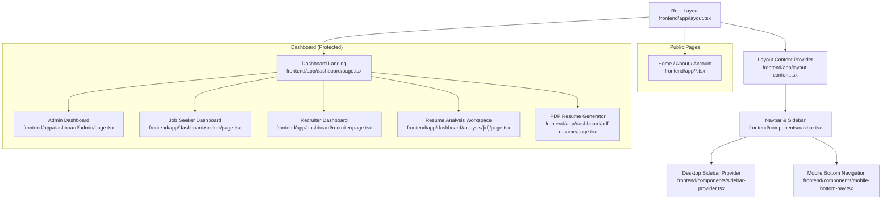
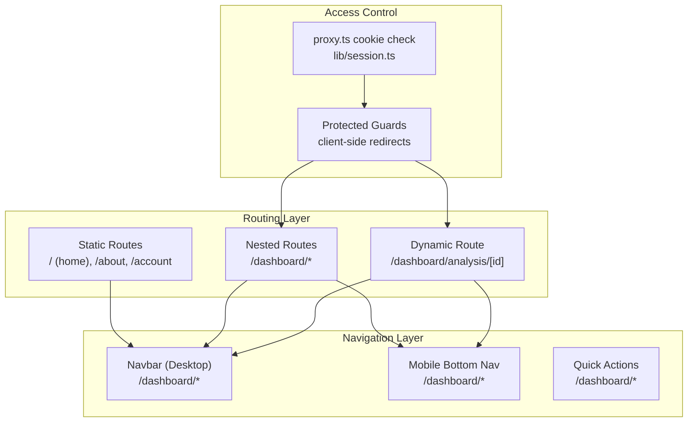
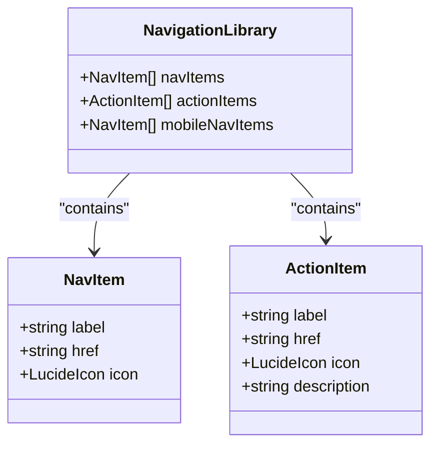
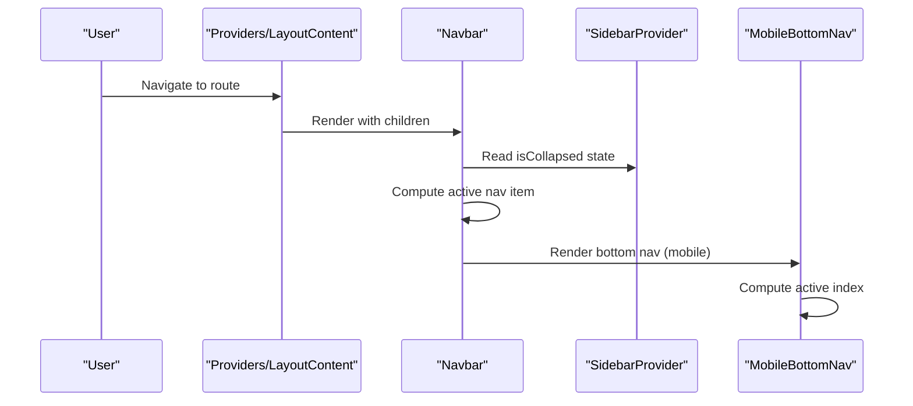
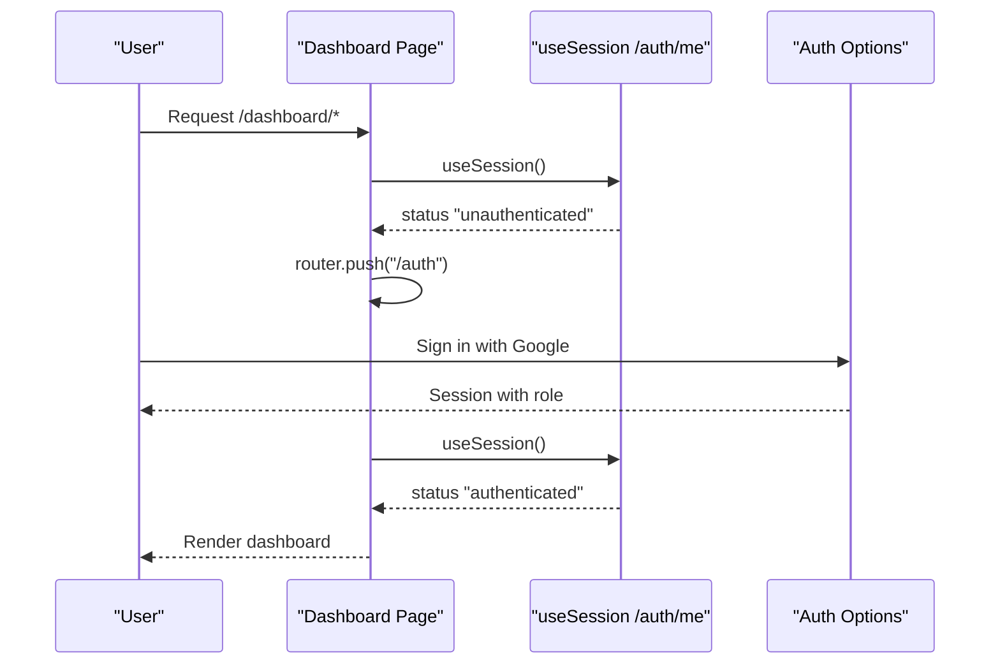
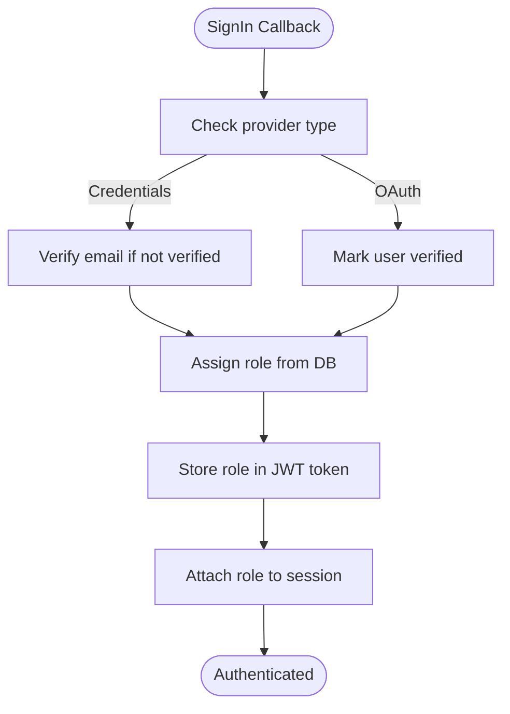
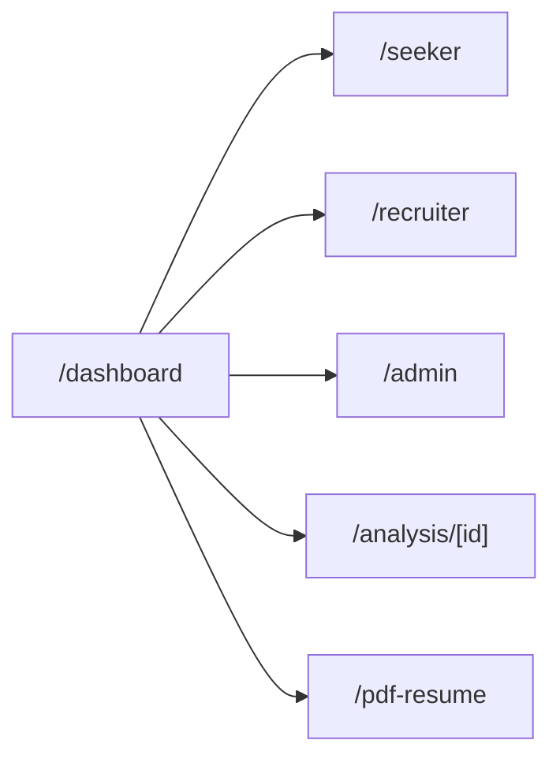
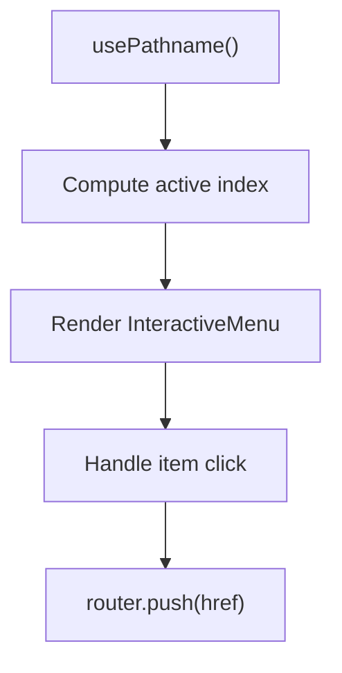
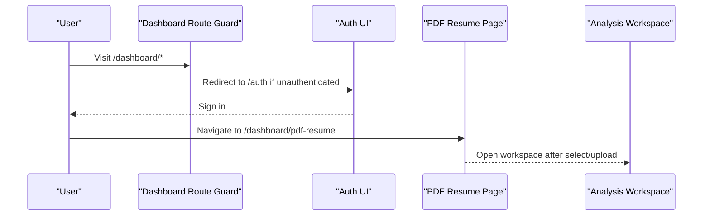
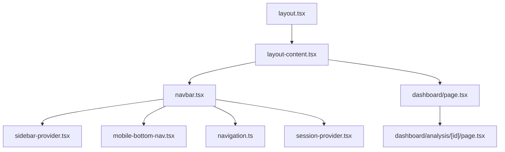

# Page routing and navigation

App Router routes and the shared navigation config that drives desktop and mobile chrome.

## Repository layout
The application follows Next.js App Router conventions with a strict file-system-based routing hierarchy under the app directory. Pages are grouped by feature and role, with nested routes for deep links and contextual nav.

```mermaid
graph TB
A["Root Layout<br/>frontend/app/layout.tsx"] --> B["Layout Content Provider<br/>frontend/app/layout-content.tsx"]
B --> C["Navbar & Sidebar<br/>frontend/components/navbar.tsx"]
C --> D["Desktop Sidebar Provider<br/>frontend/components/sidebar-provider.tsx"]
C --> E["Mobile Bottom Navigation<br/>frontend/components/mobile-bottom-nav.tsx"]
subgraph "Public Pages"
F["Home / About / Account<br/>frontend/app/*.tsx"]
end
subgraph "Dashboard (Protected)"
G["Dashboard Landing<br/>frontend/app/dashboard/page.tsx"]
H["Admin Dashboard<br/>frontend/app/dashboard/admin/page.tsx"]
I["Job Seeker Dashboard<br/>frontend/app/dashboard/seeker/page.tsx"]
J["Recruiter Dashboard<br/>frontend/app/dashboard/recruiter/page.tsx"]
K["Resume Analysis Workspace<br/>frontend/app/dashboard/analysis/[id]/page.tsx"]
L["PDF Resume Generator<br/>frontend/app/dashboard/pdf-resume/page.tsx"]
end
A --> F
A --> G
G --> H
G --> I
G --> J
G --> K
G --> L
```

- [dashboard/analysis/[id]/page.tsx](file://frontend/app/dashboard/analysis/[id]/page.tsx#L56-L223)
- `dashboard/pdf-resume/page.tsx`

## Building blocks
- Root layout and providers: Sets global styles, theme fonts, manifest, and wraps children with Providers and LayoutContent.
- Layout content provider: Hosts Navbar and applies responsive margins and sidebar offset.
- Navigation library: Centralizes nav items, quick actions, and mobile navigation items.
- Navbar: Desktop sidebar with collapsible behavior, user section, and quick actions; tablet and mobile menus.
- Sidebar provider: Global state for sidebar collapse to synchronize layout spacing.
- Mobile bottom navigation: Bottom tab bar with floating action button and active state handling.
- Authentication and role-based access: FastAPI cookies, `proxy.ts`, `useSession()`.

## How it fits together
The routing architecture combines:
- Static routes for public pages (home, about, account).
- Nested routes under dashboard for role-specific dashboards and analysis workspaces.
- Dynamic routes for per-resume analysis ([id]).
- Protected routes: `proxy.ts` cookie check plus client `useSession()` guards.

```mermaid
graph TB
subgraph "Routing Layer"
R1["Static Routes<br/>/ (home), /about, /account"]
R2["Nested Routes<br/>/dashboard/*"]
R3["Dynamic Route<br/>/dashboard/analysis/[id]"]
end
subgraph "Navigation Layer"
N1["Navbar (Desktop)<br/>/dashboard/*"]
N2["Mobile Bottom Nav<br/>/dashboard/*"]
N3["Quick Actions<br/>/dashboard/*"]
end
subgraph "Access Control"
A1["proxy.ts cookie check<br/>lib/session.ts"]
A2["Protected Guards<br/>client-side redirects"]
end
R1 --> N1
R2 --> N1
R3 --> N1
R2 --> N2
R3 --> N2
A1 --> A2
A2 --> R2
A2 --> R3
```

- [dashboard/analysis/[id]/page.tsx](file://frontend/app/dashboard/analysis/[id]/page.tsx#L56-L194)
- `navbar.tsx`
- `mobile-bottom-nav.tsx`
- `lib/session.ts`

## Navigation library and menu systems
The navigation library defines:
- Nav items for primary navigation.
- Quick actions for authenticated users.
- Mobile navigation items optimized for bottom tab bar.

```mermaid
classDiagram
class NavItem {
+string label
+string href
+LucideIcon icon
}
class ActionItem {
+string label
+string href
+LucideIcon icon
+string description
}
class NavigationLibrary {
+NavItem[] navItems
+ActionItem[] actionItems
+NavItem[] mobileNavItems
}
NavigationLibrary --> NavItem : "contains"
NavigationLibrary --> ActionItem : "contains"
```

## Navbar and sidebar integration
The Navbar renders:
- Collapsible desktop sidebar with active-state highlighting.
- Quick actions for authenticated users.
- User section with dashboard and sign-out links.
- Tablet menu overlay with active highlighting.
- Mobile bottom navigation integrated via LayoutContent.

```mermaid
sequenceDiagram
participant U as "User"
participant P as "Providers/LayoutContent"
participant N as "Navbar"
participant S as "SidebarProvider"
participant M as "MobileBottomNav"
U->>P : Navigate to route
P->>N : Render with children
N->>S : Read isCollapsed state
N->>N : Compute active nav item
N->>M : Render bottom nav (mobile)
M->>M : Compute active index
```

## Protected routes and authentication-aware routing
Protected routes are enforced through:
- Client-side guards in dashboard pages redirect unauthenticated users to the sign-in page.
- Role comes from Prisma `User.role` via `getSession()` / `/api/v1/auth/me`. Password verification is not a live path.

```mermaid
sequenceDiagram
participant U as "User"
participant DP as "Dashboard Page"
participant NA as "useSession /auth/me"
participant AO as "Auth Options"
U->>DP : Request /dashboard/*
DP->>NA : useSession()
NA-->>DP : status "unauthenticated"
DP->>DP : router.push("/auth")
U->>AO : Sign in with Google
AO-->>U : Session with role
DP->>NA : useSession()
NA-->>DP : status "authenticated"
DP-->>U : Render dashboard
```

## Role-Based access control implementation
Role-based access is handled in:
- Role stored on `User.role`. Access JWT `sub` is the user id. Session hydrates role from Postgres.
- UI rendering: role displayed in user section and used to tailor quick actions.

```mermaid
flowchart TD
Start(["SignIn Callback"]) --> CheckProvider["Check provider type"]
CheckProvider --> |Credentials| VerifyEmail["Verify email if not verified"]
CheckProvider --> |OAuth| MarkVerified["Mark user verified"]
VerifyEmail --> AssignRole["Assign role from DB"]
MarkVerified --> AssignRole
AssignRole --> StoreToken["Store role in JWT token"]
StoreToken --> StoreSession["Attach role to session"]
StoreSession --> End(["Authenticated"])
```

## Dynamic routing and nested routing patterns
Dynamic and nested routing patterns include:
- Dynamic route for resume analysis: [id] under /dashboard/analysis.
- Nested dashboards: `/dashboard/seeker` is the resume workspace. `/dashboard/recruiter` is leftover chrome, not TalentSync-HR. `/dashboard/admin` is operator UI.
- Nested route for PDF resume generation: /dashboard/pdf-resume.

```mermaid
graph LR
D["/dashboard"] --> S["/seeker"]
D --> R["/recruiter"]
D --> A["/admin"]
D --> W["/analysis/[id]"]
D --> P["/pdf-resume"]
```

- [dashboard/analysis/[id]/page.tsx](file://frontend/app/dashboard/analysis/[id]/page.tsx#L56-L223)
- `dashboard/pdf-resume/page.tsx`

- [dashboard/analysis/[id]/page.tsx](file://frontend/app/dashboard/analysis/[id]/page.tsx#L56-L223)
- `dashboard/pdf-resume/page.tsx`

## Mobile-Responsive navigation patterns
Mobile navigation integrates:
- Bottom tab bar with active state tracking and a floating action button.
- Tablet menu overlay with quick actions and user controls.
- Responsive breakpoints: desktop sidebar, tablet overlay, mobile bottom bar.

```mermaid
flowchart TD
Path["usePathname()"] --> ActiveIndex["Compute active index"]
ActiveIndex --> Render["Render InteractiveMenu"]
Render --> Click["Handle item click"]
Click --> Push["router.push(href)"]
```

## User workflow flows
Typical user workflows:
- Unauthenticated user visits dashboard → redirected to sign-in.
- Authenticated user lands on dashboard → quick actions and role-specific dashboards available.
- Resume creation workflow: PDF Resume Generator → choose or upload → open workspace → export/edit.

```mermaid
sequenceDiagram
participant U as "User"
participant DR as "Dashboard Route Guard"
participant AU as "Auth UI"
participant PR as "PDF Resume Page"
participant AR as "Analysis Workspace"
U->>DR : Visit /dashboard/*
DR->>AU : Redirect to /auth if unauthenticated
AU-->>U : Sign in
U->>PR : Navigate to /dashboard/pdf-resume
PR-->>AR : Open workspace after select/upload
```

- [dashboard/analysis/[id]/page.tsx](file://frontend/app/dashboard/analysis/[id]/page.tsx#L56-L223)

- [dashboard/analysis/[id]/page.tsx](file://frontend/app/dashboard/analysis/[id]/page.tsx#L56-L223)

## Dependencies
The navigation stack depends on:
- Next.js App Router for file-system routing.
- FastAPI cookies and `session-provider.tsx` for session and role.
- Framer Motion for animations.
- Lucide icons for visual affordances.
- React Context for sidebar state.

```mermaid
graph TB
L["layout.tsx"] --> LC["layout-content.tsx"]
LC --> NB["navbar.tsx"]
NB --> SP["sidebar-provider.tsx"]
NB --> MB["mobile-bottom-nav.tsx"]
NB --> NAV["navigation.ts"]
NB --> NA["session-provider.tsx"]
LC --> DP["dashboard/page.tsx"]
DP --> DA["dashboard/analysis/[id]/page.tsx"]
```

- [dashboard/analysis/[id]/page.tsx](file://frontend/app/dashboard/analysis/[id]/page.tsx#L56-L223)

- [dashboard/analysis/[id]/page.tsx](file://frontend/app/dashboard/analysis/[id]/page.tsx#L56-L223)

## Performance
- Client-side routing: Use Next.js automatic code splitting and route segments to minimize bundle sizes.
- Navigation animations: Keep Framer Motion animations lightweight; avoid heavy transforms on frequently accessed routes.
- Sidebar state: Persist collapsed state locally if needed to reduce re-computation across navigations.
- Protected routes: Perform minimal checks on the client; rely on server-side session validation for sensitive operations.
- Lazy loading: Consider lazy-loading heavy components within tabs (e.g., editor panels) to improve initial load performance.

## Troubleshooting
Common issues:

- Unauthenticated redirect loops: Ensure client-side guards only redirect when status is unauthenticated and avoid infinite redirects by guarding against the auth route itself.
- Role not reflected in UI: confirm `User.role` and call `useSession().refresh()` after `/update-role`.
- Mobile bottom nav not highlighting active route: Verify active index computation matches pathname and that hrefs align with route segments.
- Sidebar offset incorrect: Confirm LayoutContent applies correct padding based on sidebar collapse state.
