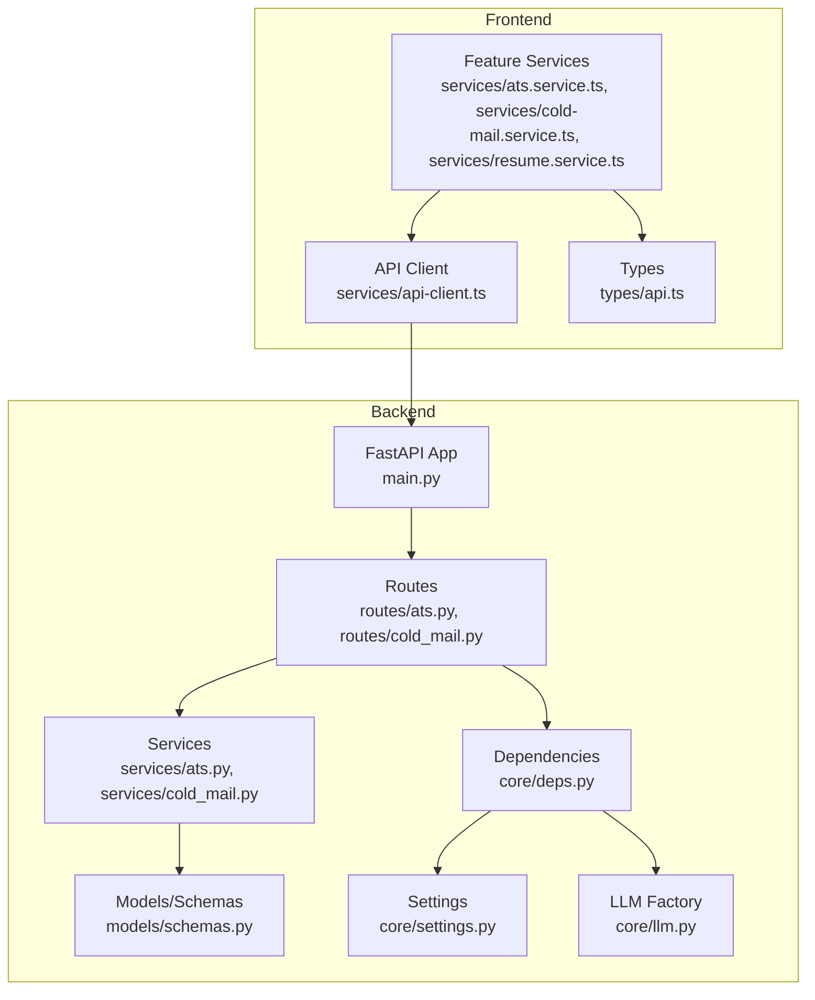
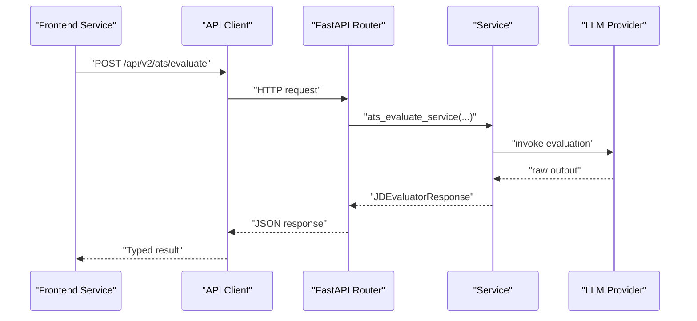
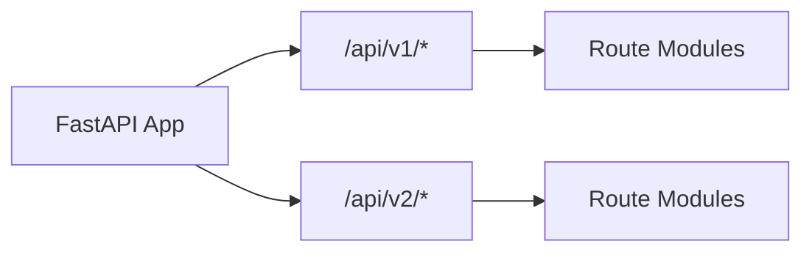
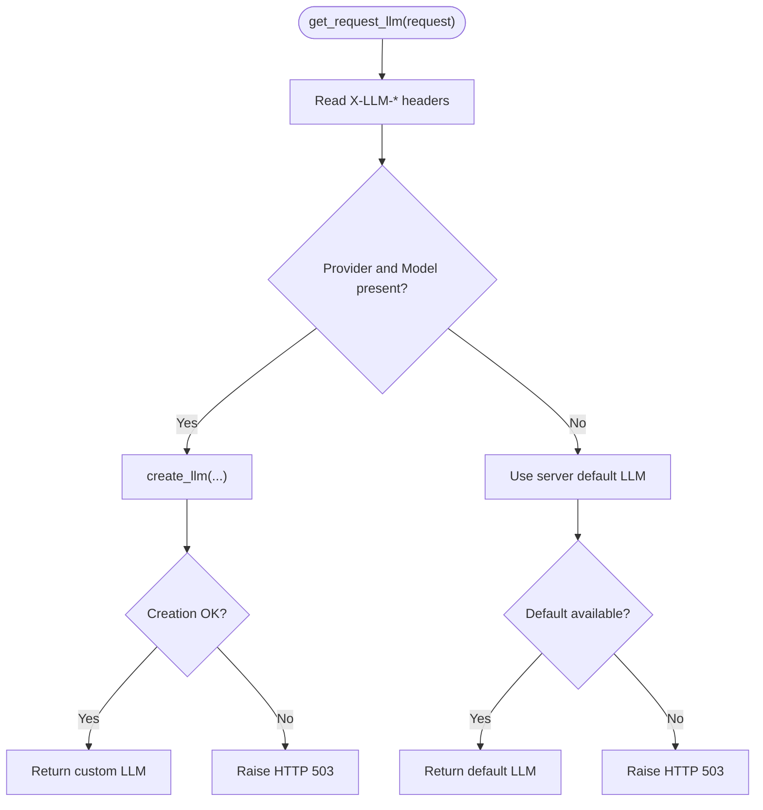
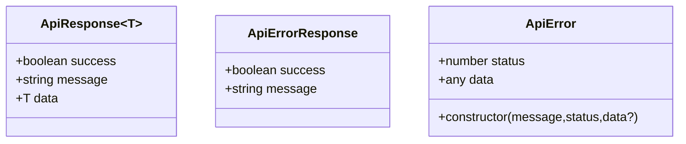
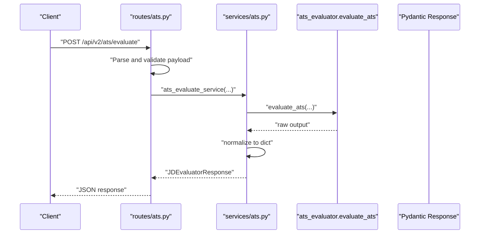
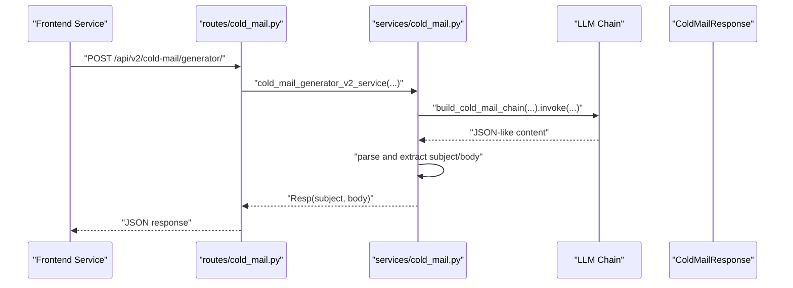
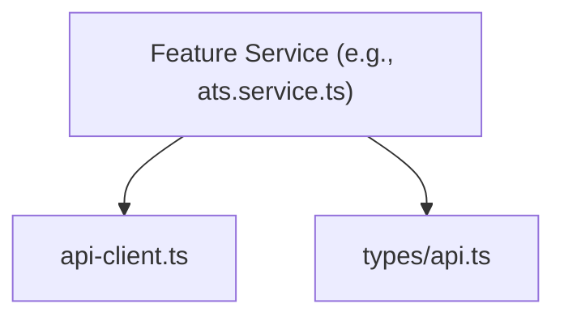
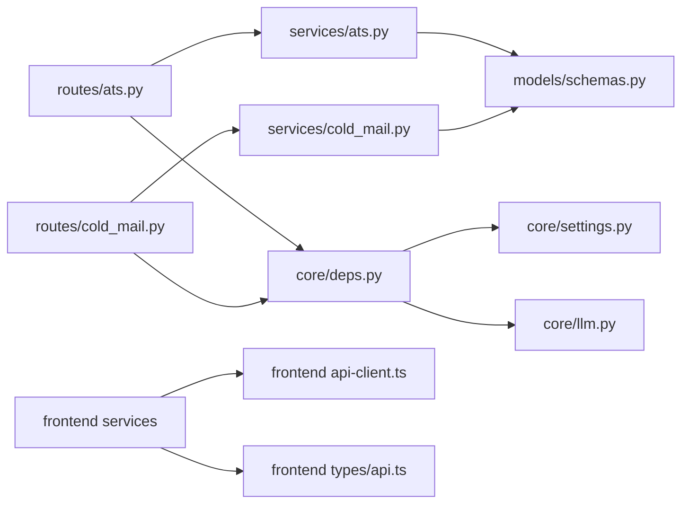

# Service layer and API integration

## Update summary
**Changes Made**
- Removed documentation sections describing third-party service integrations and external dependencies that were part of the temporary integration
- Updated service layer documentation to reflect current architecture without external dependency documentation
- Removed references to temporary integration components that have been reverted
- Streamlined documentation to focus on core service layer functionality

## Introduction
This page explains the service layer architecture and API integration patterns across the backend and frontend. It covers how the backend FastAPI application exposes versioned APIs, how services encapsulate business logic and integrate with external LLM providers, and how the frontend consumes these APIs with typed responses and reliable error handling. It also documents dependency injection, middleware, authentication headers, service composition, and strategies for caching and offline handling.

## Project structure
The system is split into:
- Backend (Python/FastAPI): routes, services, models, and core dependencies
- Frontend (TypeScript/Next.js): typed API clients and service wrappers

Key areas:
- Backend entrypoint registers middleware and routes under versioned prefixes
- Routes depend on per-request LLM instances resolved via dependency injection
- Services implement domain logic and normalize outputs to Pydantic models
- Frontend defines a typed API client and service modules for each feature area

```mermaid
graph TB
subgraph "Backend"
M["FastAPI App<br/>main.py"]
R1["Routes<br/>routes/ats.py, routes/cold_mail.py"]
S1["Services<br/>services/ats.py, services/cold_mail.py"]
D["Dependencies<br/>core/deps.py"]
MS["Models/Schemas<br/>models/schemas.py"]
CFG["Settings<br/>core/settings.py"]
LLM["LLM Factory<br/>core/llm.py"]
end
subgraph "Frontend"
FC["API Client<br/>services/api-client.ts"]
FS1["Feature Services<br/>services/ats.service.ts, services/cold-mail.service.ts, services/resume.service.ts"]
FT["Types<br/>types/api.ts"]
end
M --> R1
R1 --> S1
S1 --> MS
R1 --> D
D --> CFG
D --> LLM
FS1 --> FC
FC --> M
FS1 --> FT
```

## Core components
- Backend API server with versioned routes under /api/v1 and /api/v2
- Per-request LLM dependency injection supporting custom provider/model per request
- Typed Pydantic models for requests and responses
- Feature-specific services implementing domain logic and normalization
- Frontend typed API client with unified error handling and typed responses

## Architecture overview
The backend follows a layered architecture:
- HTTP layer: FastAPI routers define endpoints and bind typed request models
- Service layer: Business logic orchestrators, integrating LLMs and external tools
- Model layer: Pydantic models for validation and serialization
- Dependency layer: Per-request LLM creation and settings management

The frontend composes typed service modules around a single API client that centralizes HTTP request building, error extraction, and response parsing.

```mermaid
sequenceDiagram
participant FE as "Frontend Service"
participant AC as "API Client"
participant BE as "FastAPI Router"
participant SVC as "Service"
participant LLM as "LLM Provider"
FE->>AC : "POST /api/v2/ats/evaluate"
AC->>BE : "HTTP request"
BE->>SVC : "ats_evaluate_service(...)"
SVC->>LLM : "invoke evaluation"
LLM-->>SVC : "raw output"
SVC-->>BE : "JDEvaluatorResponse"
BE-->>AC : "JSON response"
AC-->>FE : "Typed result"
```

## Detailed component analysis

### Backend API versioning and routing
- v1 routes include LinkedIn, Database, Tips, Cold Mail, Hiring Assistant, Resume Analysis, Improvement, Enrichment, Cover Letter, ATS Evaluation, Tailored Resume, Digital Interviewer, and LLM Configuration
- v2 routes include Cold Mail, Hiring Assistant, Resume Analysis, Improvement, Enrichment, Cover Letter, ATS Evaluation, Tailored Resume, and JD Resume Editor
- Interview and LLM Configuration routes are v1-only in this snapshot

```mermaid
graph LR
A["FastAPI App"] --> V1["/api/v1/*"]
A --> V2["/api/v2/*"]
V1 --> R1["Route Modules"]
V2 --> R2["Route Modules"]
```

### Dependency injection and LLM integration
- Per-request LLM resolution supports custom provider, model, API key, and base URL via request headers
- Falls back to server-default LLM if headers are absent
- Raises HTTP 503 if custom configuration fails; HTTP 503 if server default is unavailable

```mermaid
flowchart TD
Start(["get_request_llm(request)"]) --> ReadHdrs["Read X-LLM-* headers"]
ReadHdrs --> HasCfg{"Provider and Model present?"}
HasCfg --> |Yes| TryCreate["create_llm(...)"]
TryCreate --> CreateOK{"Creation OK?"}
CreateOK --> |Yes| ReturnCustom["Return custom LLM"]
CreateOK --> |No| Raise503a["Raise HTTP 503"]
HasCfg --> |No| UseDefault["Use server default LLM"]
UseDefault --> DefaultOK{"Default available?"}
DefaultOK --> |Yes| ReturnDefault["Return default LLM"]
DefaultOK --> |No| Raise503b["Raise HTTP 503"]
```

### Typed API responses and error handling
- Backend routes return Pydantic models validated by FastAPI
- Frontend defines a generic ApiResponse<T> and ApiErrorResponse for typed responses
- Frontend API client throws ApiError with status and parsed message fields

```mermaid
classDiagram
class ApiResponse~T~ {
+boolean success
+string message
+T data
}
class ApiErrorResponse {
+boolean success
+string message
}
class ApiError {
+number status
+any data
+constructor(message,status,data?)
}
```

### ATS evaluation service integration
- Route accepts multipart/form-data or JSON; validates payload ensuring either JD text or link is provided
- Service resolves JD content from link if needed, validates inputs, invokes evaluator, normalizes output to JDEvaluatorResponse
- Returns structured success flag, message, score, reasons, and suggestions

```mermaid
sequenceDiagram
participant Client as "Client"
participant Router as "routes/ats.py"
participant Service as "services/ats.py"
participant Evaluator as "ats_evaluator.evaluate_ats"
participant Model as "Pydantic Response"
Client->>Router : "POST /api/v2/ats/evaluate"
Router->>Router : "Parse and validate payload"
Router->>Service : "ats_evaluate_service(...)"
Service->>Evaluator : "evaluate_ats(...)"
Evaluator-->>Service : "raw output"
Service->>Service : "normalize to dict"
Service-->>Router : "JDEvaluatorResponse"
Router-->>Client : "JSON response"
```

### Cold mail generation and editing
- File-based and text-based endpoints support generation and editing of cold emails
- Service orchestrates resume processing, optional LLM formatting, company research, and LLM-driven content generation
- Normalizes LLM JSON outputs and returns subject/body in ColdMailResponse

```mermaid
sequenceDiagram
participant FE as "Frontend Service"
participant Router as "routes/cold_mail.py"
participant Svc as "services/cold_mail.py"
participant LLM as "LLM Chain"
participant Resp as "ColdMailResponse"
FE->>Router : "POST /api/v2/cold-mail/generator/"
Router->>Svc : "cold_mail_generator_v2_service(...)"
Svc->>LLM : "build_cold_mail_chain(...).invoke(...)"
LLM-->>Svc : "JSON-like content"
Svc->>Svc : "parse and extract subject/body"
Svc-->>Router : "Resp(subject, body)"
Router-->>FE : "JSON response"
```

### Frontend service composition patterns
- Each feature module exports a service object with typed methods returning promises of typed responses
- Shared apiClient encapsulates HTTP mechanics, error translation, and JSON parsing
- Types define ApiResponse<T>, ApiErrorResponse, and paginated variants

```mermaid
graph TB
FS["Feature Service (e.g., ats.service.ts)"]
AC["api-client.ts"]
T["types/api.ts"]
FS --> AC
FS --> T
```

## Dependency analysis
- Routes depend on services and per-request LLM instances
- Services depend on Pydantic models and external tooling
- Frontend services depend on the API client and shared types
- Settings drive LLM defaults and runtime behavior

```mermaid
graph LR
R_ATS["routes/ats.py"] --> S_ATS["services/ats.py"]
R_COLD["routes/cold_mail.py"] --> S_COLD["services/cold_mail.py"]
S_ATS --> M["models/schemas.py"]
S_COLD --> M
R_ATS --> D["core/deps.py"]
R_COLD --> D
D --> CFG["core/settings.py"]
D --> LLM["core/llm.py"]
FE_SVC["frontend services"] --> FE_AC["frontend api-client.ts"]
FE_SVC --> FE_TYPES["frontend types/api.ts"]
```

## Performance considerations
- Prefer text-based endpoints for pure text inputs to avoid unnecessary file I/O
- Use the faster model variant when latency-sensitive operations are acceptable
- Centralized request/response logging helps identify slow endpoints and payloads
- Consider caching repeated LLM prompts and company research results at the application layer

## Troubleshooting guide
Common issues and remedies:
- LLM initialization failures: Verify provider headers and credentials; server falls back to default LLM or raises HTTP 503
- Validation errors on backend: Ensure required fields are present (e.g., JD text or link); route returns HTTP 400
- Network errors on frontend: ApiError wraps network failures; inspect status and message fields
- JSON parsing errors from LLM: Services normalize content and return ErrorResponse; check logs for raw LLM output

## Conclusion
The backend employs a clean separation of concerns with typed models, per-request dependency injection for LLMs, and versioned routes enabling incremental API evolution. The frontend composes typed services around a centralized API client, ensuring consistent error handling and response typing. Together, these patterns support maintainable, testable, and extensible integrations across the platform.

## Appendices

### API versioning summary
- v1: Legacy endpoints for LinkedIn, Database, Tips, Cold Mail, Hiring Assistant, Resume Analysis, Improvement, Enrichment, Cover Letter, ATS Evaluation, Tailored Resume, Digital Interviewer, LLM Configuration
- v2: Improved endpoints for Cold Mail, Hiring Assistant, Resume Analysis, Improvement, Enrichment, Cover Letter, ATS Evaluation, Tailored Resume, JD Resume Editor

### Authentication and headers
- Frontend relies on NextAuth for session management; backend reads custom LLM configuration via X-LLM-* headers for per-request LLM instantiation

### Service lifecycle management
- FastAPI lifespan manages startup/shutdown hooks; request/response logging middleware attaches request IDs and logs payloads

### LLM configuration and testing
- Backend provides LLM factory supporting multiple providers (Google, OpenAI, Anthropic, Ollama, OpenRouter, DeepSeek)
- Includes LLM connection testing endpoint for validating provider configurations
- Supports both server-default and per-request LLM instances
