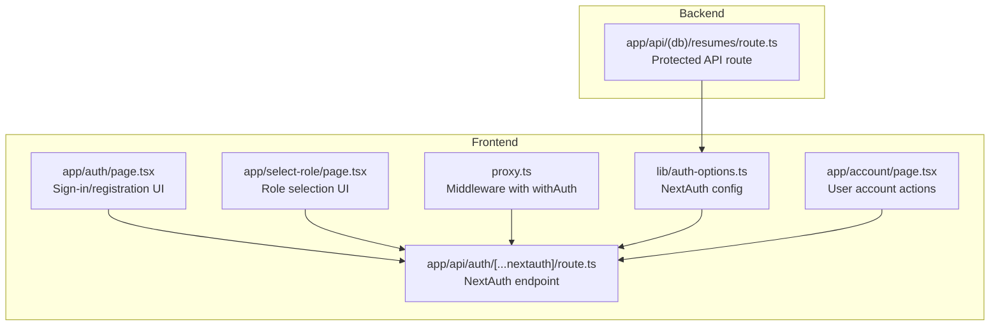
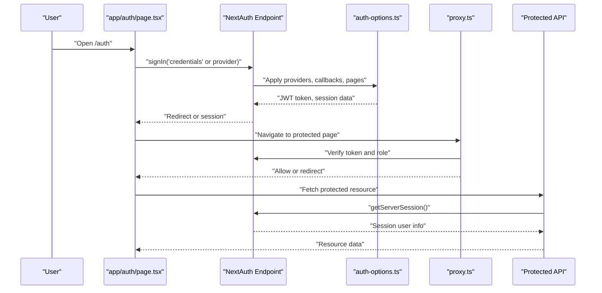
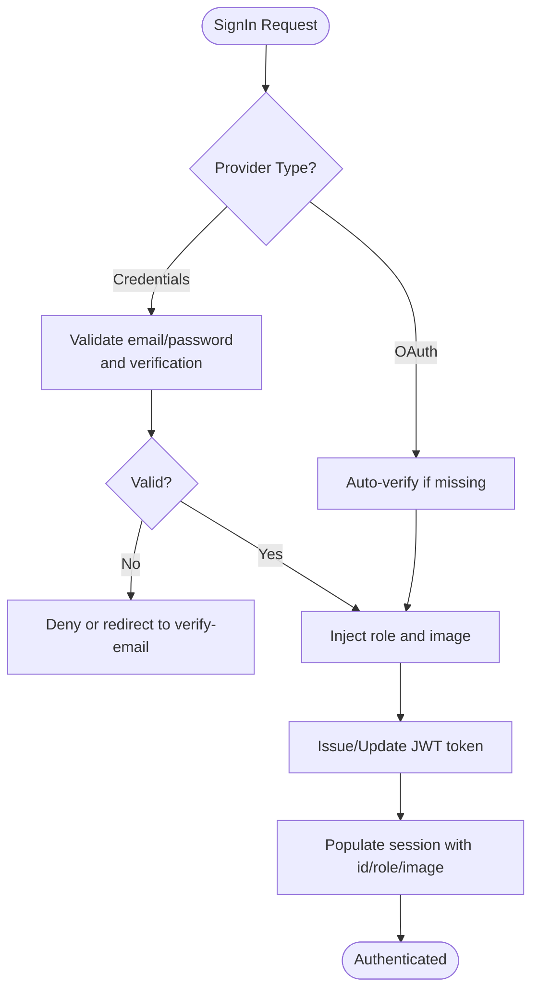
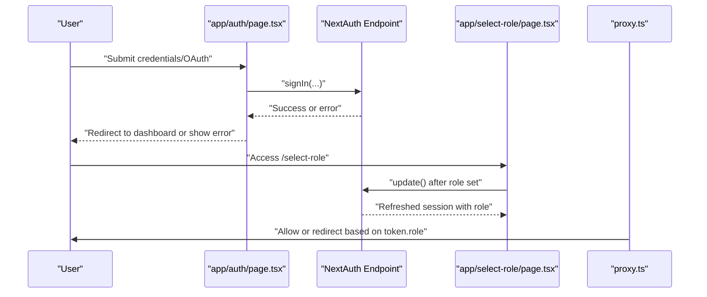
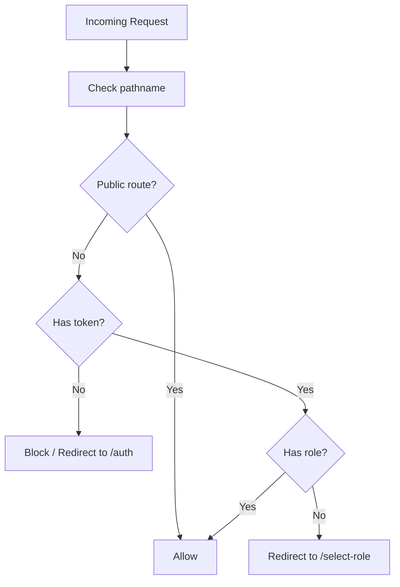
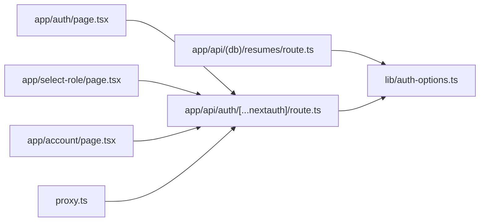

# Authentication State

<cite>
**Referenced Files in This Document**
- [auth-options.ts](file://frontend/lib/auth-options.ts)
- [route.ts](file://frontend/app/api/auth/[...nextauth]/route.ts)
- [page.tsx](file://frontend/app/auth/page.tsx)
- [proxy.ts](file://frontend/proxy.ts)
- [page.tsx](file://frontend/app/select-role/page.tsx)
- [page.tsx](file://frontend/app/account/page.tsx)
- [route.ts](file://frontend/app/api/(db)/resumes/route.ts)
</cite>

## Table of Contents
1. [Introduction](#introduction)
2. [Project Structure](#project-structure)
3. [Core Components](#core-components)
4. [Architecture Overview](#architecture-overview)
5. [Detailed Component Analysis](#detailed-component-analysis)
6. [Dependency Analysis](#dependency-analysis)
7. [Performance Considerations](#performance-considerations)
8. [Troubleshooting Guide](#troubleshooting-guide)
9. [Conclusion](#conclusion)

## Introduction
This document explains the authentication state management in the project, focusing on NextAuth.js integration, session management, and user state synchronization. It covers provider configuration (OAuth and credentials), JWT-based sessions, middleware-based access control, protected routes, role-based access control, and authentication guards. It also documents token refresh behavior, session persistence, and error handling, along with practical troubleshooting steps and security best practices.

## Project Structure
Authentication spans the frontend Next.js app and the NextAuth route handler:
- NextAuth configuration defines providers, callbacks, session strategy, and pages.
- The NextAuth route handler exposes the NextAuth endpoint.
- Frontend pages use NextAuth hooks to sign in/sign out and guard routes.
- Middleware enforces authentication and role presence for protected areas.
- Protected API routes validate server-side sessions.

**Diagram sources**
- [auth-options.ts](file://frontend/lib/auth-options.ts#L10-L201)
- [route.ts](file://frontend/app/api/auth/[...nextauth]/route.ts#L1-L7)
- [page.tsx](file://frontend/app/auth/page.tsx#L1-L933)
- [page.tsx](file://frontend/app/select-role/page.tsx#L1-L157)
- [proxy.ts](file://frontend/proxy.ts#L1-L74)
- [page.tsx](file://frontend/app/account/page.tsx#L40-L356)
- [route.ts](file://frontend/app/api/(db)/resumes/route.ts#L1-L38)

**Section sources**
- [auth-options.ts](file://frontend/lib/auth-options.ts#L10-L201)
- [route.ts](file://frontend/app/api/auth/[...nextauth]/route.ts#L1-L7)
- [page.tsx](file://frontend/app/auth/page.tsx#L1-L933)
- [page.tsx](file://frontend/app/select-role/page.tsx#L1-L157)
- [proxy.ts](file://frontend/proxy.ts#L1-L74)
- [page.tsx](file://frontend/app/account/page.tsx#L40-L356)
- [route.ts](file://frontend/app/api/(db)/resumes/route.ts#L1-L38)

## Core Components
- NextAuth configuration:
  - Providers: credentials, Google, GitHub, Email.
  - Session strategy: JWT.
  - Callbacks: signIn, session, jwt.
  - Pages: custom sign-in page.
  - Events: automatic verification for OAuth-created users.
- NextAuth route handler: mounts NextAuth with the configuration.
- Frontend authentication UI: sign-in/sign-up with OAuth and credentials.
- Middleware: enforces authentication and role presence for protected routes.
- Protected API routes: validate server-side session via getServerSession.

**Section sources**
- [auth-options.ts](file://frontend/lib/auth-options.ts#L10-L201)
- [route.ts](file://frontend/app/api/auth/[...nextauth]/route.ts#L1-L7)
- [page.tsx](file://frontend/app/auth/page.tsx#L1-L933)
- [proxy.ts](file://frontend/proxy.ts#L1-L74)
- [route.ts](file://frontend/app/api/(db)/resumes/route.ts#L1-L38)

## Architecture Overview
The authentication pipeline integrates client-side UI, NextAuth server, and middleware enforcement. The JWT strategy ensures session state is carried client-side and synchronized server-side.

**Diagram sources**
- [auth-options.ts](file://frontend/lib/auth-options.ts#L10-L201)
- [route.ts](file://frontend/app/api/auth/[...nextauth]/route.ts#L1-L7)
- [page.tsx](file://frontend/app/auth/page.tsx#L145-L186)
- [proxy.ts](file://frontend/proxy.ts#L4-L67)
- [route.ts](file://frontend/app/api/(db)/resumes/route.ts#L8-L20)

## Detailed Component Analysis

### NextAuth Configuration and Providers
- Providers:
  - Credentials: validates email/password, checks verification status, returns user with role and image.
  - Google/GitHub: OAuth providers configured via environment variables.
  - Email: transactional email provider configured via environment variables.
- Session strategy: JWT.
- Callbacks:
  - signIn: auto-verify OAuth users, enforce verification for credentials, propagate profile image.
  - session: injects user id, role, and image into session.
  - jwt: stores role and image; refreshes token payload on update or refresh.
- Events:
  - createUser: marks OAuth users without passwordHash as verified.
- Pages:
  - signIn: custom sign-in page path.

**Diagram sources**
- [auth-options.ts](file://frontend/lib/auth-options.ts#L19-L55)
- [auth-options.ts](file://frontend/lib/auth-options.ts#L98-L144)
- [auth-options.ts](file://frontend/lib/auth-options.ts#L145-L195)

**Section sources**
- [auth-options.ts](file://frontend/lib/auth-options.ts#L10-L201)

### NextAuth Route Handler
- Exposes NextAuth endpoint for all NextAuth routes.
- Delegates all routing to NextAuth with the configured options.

**Section sources**
- [route.ts](file://frontend/app/api/auth/[...nextauth]/route.ts#L1-L7)

### Frontend Authentication UI and Guards
- Sign-in page:
  - Uses NextAuth hooks to sign in with credentials or providers.
  - Handles unverified email errors and redirects to verification flow.
  - Provides loading overlays and error messaging.
- Role selection page:
  - Enforces that authenticated users without a role are redirected to select-role.
  - Updates user role via a protected API and refreshes session via update().
- Account page:
  - Detects authentication method (OAuth vs email/password) and supports logout.

**Diagram sources**
- [page.tsx](file://frontend/app/auth/page.tsx#L145-L186)
- [page.tsx](file://frontend/app/select-role/page.tsx#L33-L67)
- [proxy.ts](file://frontend/proxy.ts#L14-L31)

**Section sources**
- [page.tsx](file://frontend/app/auth/page.tsx#L1-L933)
- [page.tsx](file://frontend/app/select-role/page.tsx#L1-L157)
- [page.tsx](file://frontend/app/account/page.tsx#L40-L356)

### Middleware-Based Access Control
- Enforces:
  - Public pages: home, auth, verification, reset-password, API, static assets, PostHog proxy.
  - Role gating: redirects authenticated users without a role to select-role; allows access to select-role only when unrole.
  - Protected pages: require a valid token.

**Diagram sources**
- [proxy.ts](file://frontend/proxy.ts#L4-L67)

**Section sources**
- [proxy.ts](file://frontend/proxy.ts#L1-L74)

### Protected API Routes
- Server-side session validation:
  - Uses getServerSession with the same NextAuth configuration.
  - Returns 401 Unauthorized if session is missing.
  - Loads user and role from the database for downstream logic.

**Section sources**
- [route.ts](file://frontend/app/api/(db)/resumes/route.ts#L8-L38)

## Dependency Analysis
- Frontend pages depend on NextAuth hooks and the NextAuth endpoint.
- Middleware depends on NextAuth token availability and role presence.
- Protected APIs depend on NextAuth configuration and server-side session retrieval.
- NextAuth configuration depends on environment variables for providers and secrets.

**Diagram sources**
- [page.tsx](file://frontend/app/auth/page.tsx#L1-L933)
- [page.tsx](file://frontend/app/select-role/page.tsx#L1-L157)
- [page.tsx](file://frontend/app/account/page.tsx#L40-L356)
- [proxy.ts](file://frontend/proxy.ts#L1-L74)
- [route.ts](file://frontend/app/api/(db)/resumes/route.ts#L1-L38)
- [auth-options.ts](file://frontend/lib/auth-options.ts#L10-L201)
- [route.ts](file://frontend/app/api/auth/[...nextauth]/route.ts#L1-L7)

**Section sources**
- [auth-options.ts](file://frontend/lib/auth-options.ts#L10-L201)
- [route.ts](file://frontend/app/api/auth/[...nextauth]/route.ts#L1-L7)
- [page.tsx](file://frontend/app/auth/page.tsx#L1-L933)
- [page.tsx](file://frontend/app/select-role/page.tsx#L1-L157)
- [proxy.ts](file://frontend/proxy.ts#L1-L74)
- [page.tsx](file://frontend/app/account/page.tsx#L40-L356)
- [route.ts](file://frontend/app/api/(db)/resumes/route.ts#L1-L38)

## Performance Considerations
- JWT strategy reduces server-side session storage overhead and enables client-side session state.
- Callbacks perform database reads on sign-in and token refresh; keep database queries minimal and indexed.
- Middleware runs on every request; avoid heavy computation in callbacks and middleware.
- Prefer server-side session validation for sensitive endpoints to ensure robustness.

## Troubleshooting Guide
Common issues and resolutions:
- Unverified email prevents credentials sign-in:
  - The signIn callback redirects to the verification page if the user is not verified.
  - Resolution: guide users to verify their email; resend verification if needed.
- OAuth users not auto-verified:
  - The createUser event sets isVerified for OAuth users without passwordHash.
  - Resolution: ensure the user was created via OAuth and that the event executes.
- Role missing after sign-in:
  - The middleware redirects to select-role if token.role is absent.
  - Resolution: ensure the role is set via the role selection flow and that session is refreshed after update().
- Session not reflecting updates:
  - Use the session update() hook to refresh token and session after role or profile changes.
- Protected API returns unauthorized:
  - Ensure getServerSession is called with the same NextAuth configuration and that the request includes cookies.
- Environment variables missing:
  - Missing provider credentials or NEXTAUTH_SECRET leads to provider misconfiguration or signing failures.
  - Resolution: set required environment variables and restart the server.

Security best practices:
- Store NEXTAUTH_SECRET securely and rotate periodically.
- Use HTTPS in production to protect cookies and tokens.
- Validate and sanitize all inputs in custom providers and callbacks.
- Limit cookie attributes (sameSite, secure, httpOnly) according to deployment needs.
- Monitor and log authentication events in development; disable debug in production.

**Section sources**
- [auth-options.ts](file://frontend/lib/auth-options.ts#L37-L40)
- [auth-options.ts](file://frontend/lib/auth-options.ts#L82-L96)
- [auth-options.ts](file://frontend/lib/auth-options.ts#L122-L136)
- [page.tsx](file://frontend/app/select-role/page.tsx#L52-L57)
- [route.ts](file://frontend/app/api/(db)/resumes/route.ts#L10-L20)
- [proxy.ts](file://frontend/proxy.ts#L36-L66)

## Conclusion
The project implements a robust authentication system centered on NextAuth.js with JWT sessions, multiple providers, and middleware-driven access control. The configuration synchronizes user state across client and server, supports role-based navigation, and provides clear guards for protected routes and APIs. Following the troubleshooting and security recommendations will help maintain a reliable and secure authentication experience.