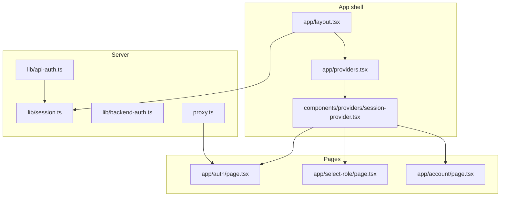
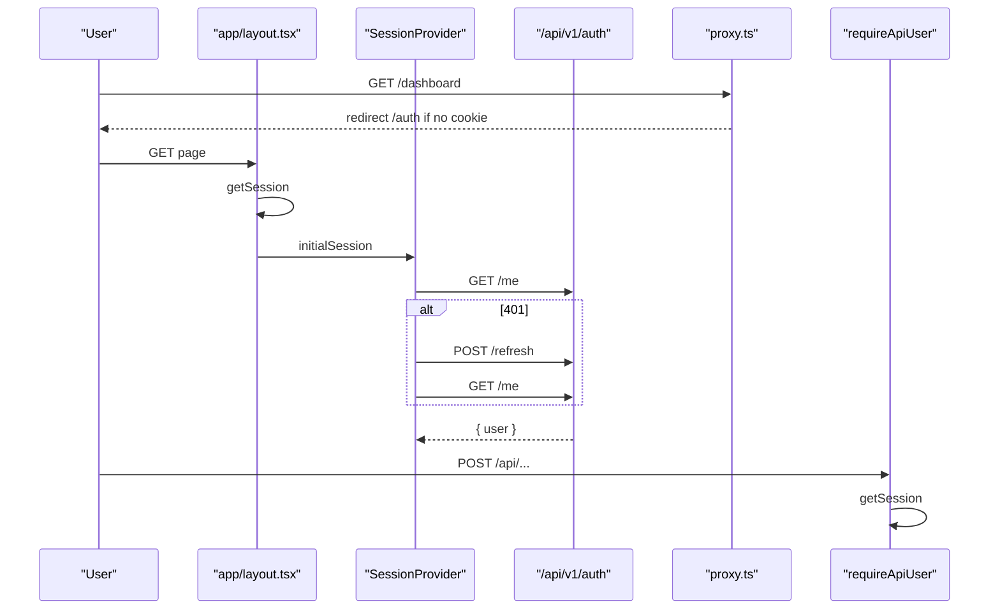
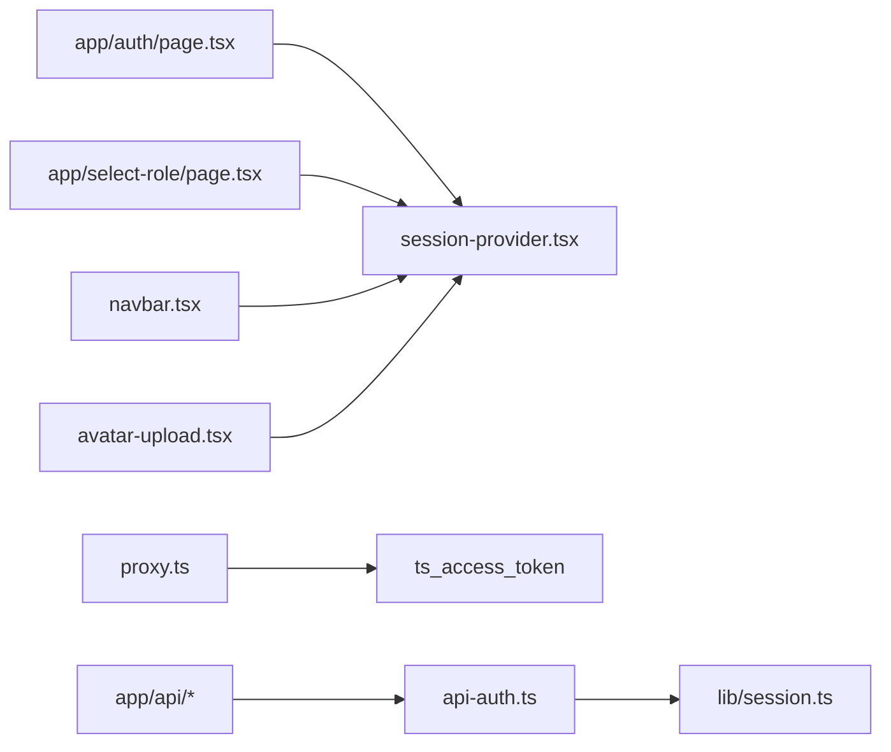

# Authentication state

How the frontend tracks the FastAPI session. NextAuth is gone. `useSession` / `signIn` / `signOut` are local helpers that talk to `/api/v1/auth/*`.

## Repository layout

```mermaid
graph TB
subgraph "App shell"
L["app/layout.tsx"]
P["app/providers.tsx"]
SP["components/providers/session-provider.tsx"]
end
subgraph "Server"
SESS["lib/session.ts"]
AUTH["lib/api-auth.ts"]
MINT["lib/backend-auth.ts"]
PROXY["proxy.ts"]
end
subgraph "Pages"
A["app/auth/page.tsx"]
R["app/select-role/page.tsx"]
ACC["app/account/page.tsx"]
end
L --> SESS
L --> P
P --> SP
SP --> A
SP --> R
SP --> ACC
PROXY --> A
AUTH --> SESS
```

- `frontend/lib/session.ts`
- `frontend/lib/api-auth.ts`
- `frontend/lib/backend-auth.ts`
- `frontend/components/providers/session-provider.tsx`
- `frontend/app/providers.tsx`
- `frontend/app/layout.tsx`
- `frontend/proxy.ts`
- `frontend/app/auth/page.tsx`
- `frontend/app/select-role/page.tsx`
- `frontend/components/auth/role-selection-gate.tsx`

## Building blocks

- Server: verify `ts_access_token` with `BACKEND_JWT_SECRET`, load the Prisma `User`.
- Client: `SessionProvider` seeds from `toClientSession(getSession())`, then GET `/api/v1/auth/me`.
- `signIn("google")` sets `window.location` to `/api/v1/auth/oauth/google?redirect=...`.
- `signOut()` POSTs `/api/v1/auth/logout`.
- `proxy.ts` redirects if the access cookie is missing. Presence only.

## How it fits together

```mermaid
sequenceDiagram
participant U as "User"
participant Layout as "app/layout.tsx"
participant SP as "SessionProvider"
participant Auth as "/api/v1/auth"
participant MW as "proxy.ts"
participant BFF as "requireApiUser"
U->>MW : GET /dashboard
MW-->>U : redirect /auth if no cookie
U->>Layout : GET page
Layout->>Layout : getSession
Layout->>SP : initialSession
SP->>Auth : GET /me
alt 401
SP->>Auth : POST /refresh
SP->>Auth : GET /me
end
Auth-->>SP : { user }
U->>BFF : POST /api/...
BFF->>BFF : getSession
```

## Server session

`getSessionUserId` reads the cookie and verifies HS256 `type=access`. It does not hit the database.

`getSession` then `prisma.user.findUnique` for `id, name, email, image, role, isVerified, roleSelectedAt`. Memoised with React `cache()` so one render pays one query.

Expired or tampered tokens become signed out. The client refresh path is `/api/v1/auth/refresh`.

`getAccessToken()` returns the raw cookie for forwarding. Most BFF routes mint a new JWT instead (`backend-auth.ts`) because FastAPI is a different origin from the Node process.

## Client session

`SessionProvider` state: `data`, `status` (`loading | authenticated | unauthenticated`), `refresh`, `update`.

On a 401 from `/me`, it POSTs `/refresh` once and retries. A 15-minute interval keeps the access cookie warm (access TTL is 20 minutes).

`roleSelectionRequired` is a boolean on the client user. The server maps `roleSelectedAt === null`.

## Sign-in UI

`app/auth/page.tsx` is Google only. Query errors:

- `oauth_email_taken` / leftover `OAuthAccountNotLinked`
- `AccessDenied`
- generic `oauth`

Password pages under `app/auth/forgot-password`, `reset-password`, `verify-email`, `resend-verification` still exist as leftovers. The matching API answers 410.

## Middleware

Public: `/`, `/about`, `/pricing`, `/privacy`, `/auth`, `/api/`, `/_next/`, `/ph`, icons.

If the cookie is present, the request proceeds. Signature checks are not done here.

## Protected BFF routes

`requireApiUser()` returns 401 `{ success: false, message: "Authentication required" }` when `getSession()` is null. Feature routes then mint backend headers.

## Dependencies

```mermaid
graph LR
UI["app/auth/page.tsx"] --> SP["session-provider.tsx"]
SEL["app/select-role/page.tsx"] --> SP
NAV["navbar.tsx"] --> SP
AVU["avatar-upload.tsx"] --> SP
MW["proxy.ts"] --> COOKIE["ts_access_token"]
BFF["app/api/*"] --> REQ["api-auth.ts"]
REQ --> SESS["lib/session.ts"]
```

## Troubleshooting

- First paint loading forever: `getSession()` failed (secret mismatch) so `initialSession` is null and `/me` also 401s.
- Role not updating: call `update()` / `refresh()` after `POST /update-role`.
- Protected API 401: cookie not on the request, or `BACKEND_JWT_SECRET` != `JWT_SECRET`.
- Redirect loop: `proxy.ts` sending you to `/auth` while `/auth` thinks you are signed in. Check cookie domain and `COOKIE_SECURE` on HTTP local.
- Env: set `BACKEND_JWT_SECRET` and `GOOGLE_*`. `NEXTAUTH_SECRET` is leftover naming if it still appears in `.env.example`.
