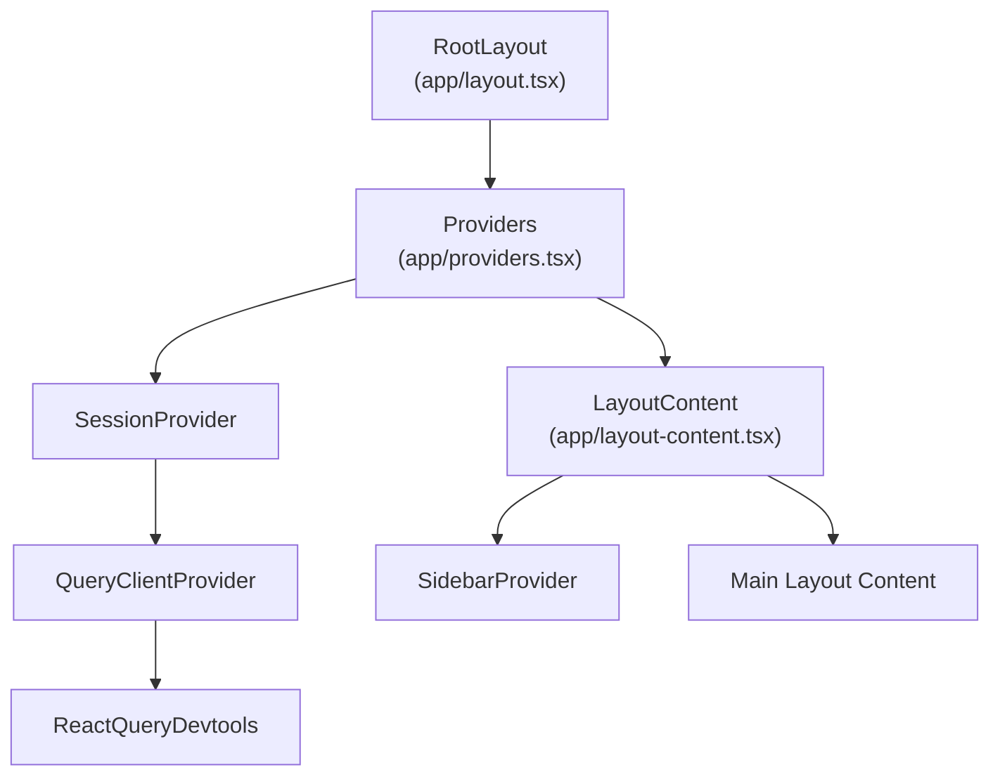
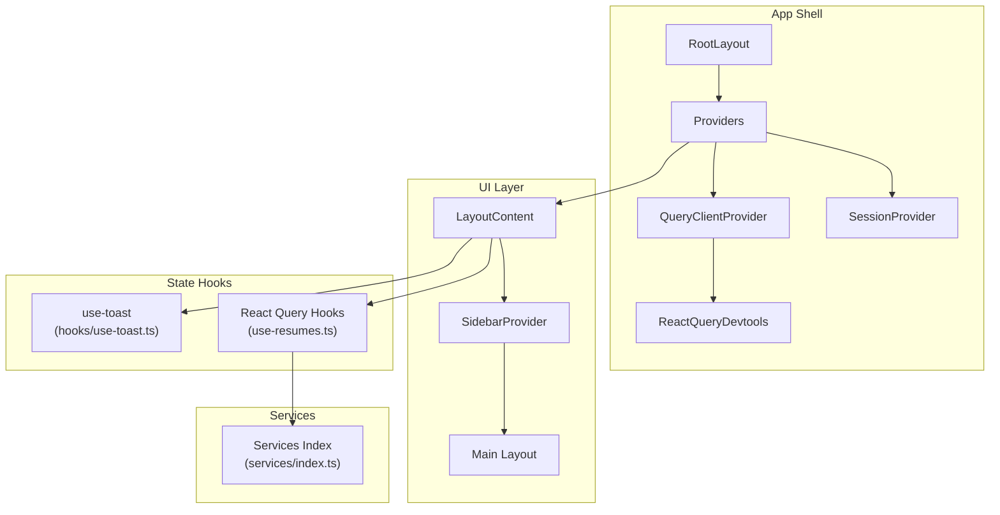
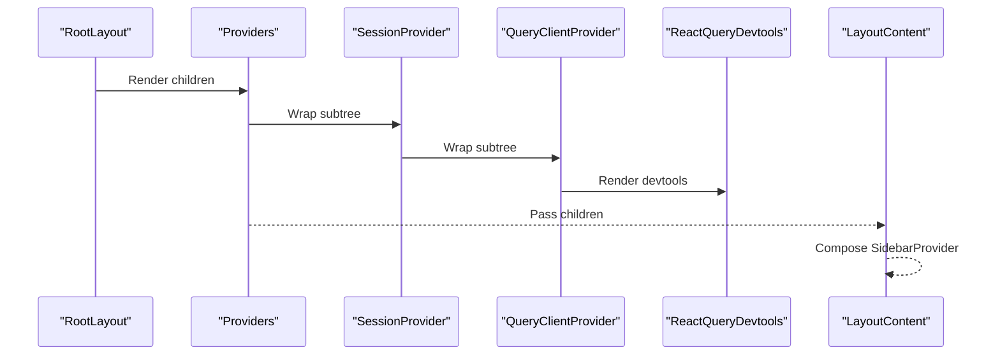
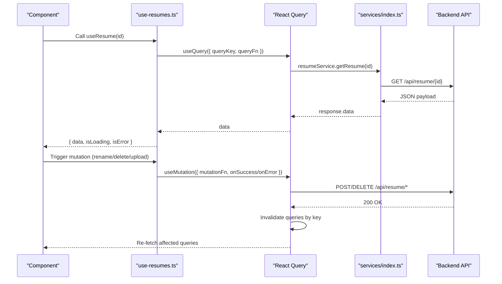
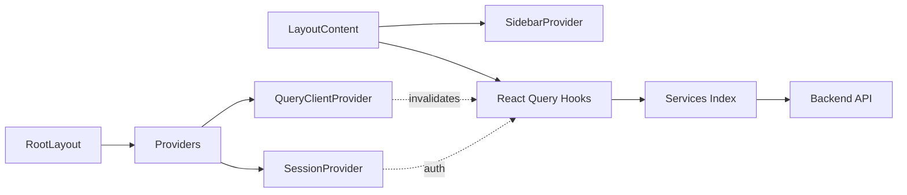

# Context Providers

<cite>
**Referenced Files in This Document**
- [frontend/app/providers.tsx](file://frontend/app/providers.tsx)
- [frontend/app/layout.tsx](file://frontend/app/layout.tsx)
- [frontend/app/layout-content.tsx](file://frontend/app/layout-content.tsx)
- [frontend/hooks/queries/index.ts](file://frontend/hooks/queries/index.ts)
- [frontend/hooks/queries/use-resumes.ts](file://frontend/hooks/queries/use-resumes.ts)
- [frontend/hooks/use-toast.ts](file://frontend/hooks/use-toast.ts)
- [frontend/services/index.ts](file://frontend/services/index.ts)
- [frontend/lib/prisma.ts](file://frontend/lib/prisma.ts)
- [frontend/lib/encryption.ts](file://frontend/lib/encryption.ts)
</cite>

## Table of Contents
1. [Introduction](#introduction)
2. [Project Structure](#project-structure)
3. [Core Components](#core-components)
4. [Architecture Overview](#architecture-overview)
5. [Detailed Component Analysis](#detailed-component-analysis)
6. [Dependency Analysis](#dependency-analysis)
7. [Performance Considerations](#performance-considerations)
8. [Troubleshooting Guide](#troubleshooting-guide)
9. [Conclusion](#conclusion)

## Introduction
This document explains the context providers architecture and state synchronization mechanisms in the frontend application. It covers the provider hierarchy, context creation, and how state propagates through the component tree. It also documents the integration with React Query for data fetching and state updates, including caching, retries, and invalidation strategies. Practical topics include context composition, selective re-renders, debugging context state, provider ordering, context isolation, state sharing patterns, and integrations with database connections and encryption utilities.

## Project Structure
The provider stack is established at the root of the Next.js app shell and composed around the application’s layout. Providers wrap the entire app subtree, enabling session-aware routing, centralized query caching, and cross-component notifications.

**Diagram sources**
- [frontend/app/layout.tsx](file://frontend/app/layout.tsx#L23-L50)
- [frontend/app/providers.tsx](file://frontend/app/providers.tsx#L13-L36)
- [frontend/app/layout-content.tsx](file://frontend/app/layout-content.tsx#L27-L33)

**Section sources**
- [frontend/app/layout.tsx](file://frontend/app/layout.tsx#L1-L52)
- [frontend/app/providers.tsx](file://frontend/app/providers.tsx#L1-L38)
- [frontend/app/layout-content.tsx](file://frontend/app/layout-content.tsx#L1-L34)

## Core Components
- Providers: Creates and exposes a singleton React Query client with default caching and retry policies, wraps children in next-auth’s SessionProvider, and renders React Query devtools.
- LayoutContent: Wraps the main content area with a SidebarProvider to manage collapsible sidebar state and composes the Navbar and main content region.
- use-toast: A toast notification service with a reducer-driven state machine and a lightweight pub/sub mechanism to broadcast toast updates across the app.

Key provider responsibilities:
- SessionProvider: Provides authentication state and session-related utilities to the app.
- QueryClientProvider: Exposes React Query’s cache and background refresh capabilities to all components.
- SidebarProvider: Manages a shared layout state (collapsed/collapsed) for responsive navigation.

**Section sources**
- [frontend/app/providers.tsx](file://frontend/app/providers.tsx#L13-L36)
- [frontend/app/layout-content.tsx](file://frontend/app/layout-content.tsx#L27-L33)
- [frontend/hooks/use-toast.ts](file://frontend/hooks/use-toast.ts#L1-L192)

## Architecture Overview
The provider architecture establishes a layered context stack that enables:
- Authentication context via next-auth
- Global query cache via React Query
- Cross-component notifications via a local toast store
- Layout state via a custom SidebarProvider

**Diagram sources**
- [frontend/app/layout.tsx](file://frontend/app/layout.tsx#L23-L50)
- [frontend/app/providers.tsx](file://frontend/app/providers.tsx#L13-L36)
- [frontend/app/layout-content.tsx](file://frontend/app/layout-content.tsx#L27-L33)
- [frontend/hooks/queries/use-resumes.ts](file://frontend/hooks/queries/use-resumes.ts#L1-L83)
- [frontend/hooks/use-toast.ts](file://frontend/hooks/use-toast.ts#L1-L192)
- [frontend/services/index.ts](file://frontend/services/index.ts#L1-L15)

## Detailed Component Analysis

### Provider Hierarchy and Composition
- RootLayout composes Providers and LayoutContent, ensuring all pages inherit the same context stack.
- Providers initializes a singleton QueryClient with:
  - Stale time configured to treat data as fresh for a short period.
  - Retry attempts for transient failures.
  - Window focus refetch disabled to reduce unnecessary network activity.
- SessionProvider from next-auth ensures authentication state is available to all downstream components.
- LayoutContent composes SidebarProvider to share layout state across the main content area.

**Diagram sources**
- [frontend/app/layout.tsx](file://frontend/app/layout.tsx#L23-L50)
- [frontend/app/providers.tsx](file://frontend/app/providers.tsx#L13-L36)
- [frontend/app/layout-content.tsx](file://frontend/app/layout-content.tsx#L27-L33)

**Section sources**
- [frontend/app/layout.tsx](file://frontend/app/layout.tsx#L23-L50)
- [frontend/app/providers.tsx](file://frontend/app/providers.tsx#L13-L36)
- [frontend/app/layout-content.tsx](file://frontend/app/layout-content.tsx#L27-L33)

### React Query Integration and State Propagation
React Query is used pervasively for data fetching, caching, and state updates. Hooks encapsulate query keys, fetchers, and optimistic updates. Mutations commonly invalidate related queries to keep the UI synchronized.

**Diagram sources**
- [frontend/hooks/queries/use-resumes.ts](file://frontend/hooks/queries/use-resumes.ts#L1-L83)
- [frontend/services/index.ts](file://frontend/services/index.ts#L1-L15)

**Section sources**
- [frontend/hooks/queries/use-resumes.ts](file://frontend/hooks/queries/use-resumes.ts#L1-L83)
- [frontend/hooks/queries/index.ts](file://frontend/hooks/queries/index.ts#L1-L14)
- [frontend/services/index.ts](file://frontend/services/index.ts#L1-L15)

### Context Creation and Isolation
- Authentication context: Provided by next-auth’s SessionProvider. Components can access session data via next-auth utilities.
- Query cache context: Provided by QueryClientProvider. All queries share a single cache instance with a shared stale/retry policy.
- Toast context: Provided by a local reducer store exposed via use-toast. This is isolated to the app boundary and does not leak into server-side rendering contexts.
- Layout context: Provided by SidebarProvider inside LayoutContent. This isolates sidebar state to the main content area.

Best practices:
- Keep provider order consistent across the app to avoid subtle hydration mismatches.
- Prefer wrapping only the necessary subtree with custom providers to minimize re-renders.

**Section sources**
- [frontend/app/providers.tsx](file://frontend/app/providers.tsx#L13-L36)
- [frontend/app/layout-content.tsx](file://frontend/app/layout-content.tsx#L27-L33)
- [frontend/hooks/use-toast.ts](file://frontend/hooks/use-toast.ts#L1-L192)

### State Sharing Patterns
- Shared UI state: SidebarProvider shares collapsed state across components in the main layout.
- Cross-component notifications: use-toast maintains a single source of truth for toast messages and broadcasts updates to all subscribers.
- Data state: React Query manages normalized cache entries keyed by query keys. Mutations invalidate related keys to propagate changes.

Patterns:
- Use query keys to scope cache invalidation precisely.
- Combine multiple small providers for focused state domains (e.g., layout vs. data vs. UI feedback).

**Section sources**
- [frontend/app/layout-content.tsx](file://frontend/app/layout-content.tsx#L27-L33)
- [frontend/hooks/use-toast.ts](file://frontend/hooks/use-toast.ts#L1-L192)
- [frontend/hooks/queries/use-resumes.ts](file://frontend/hooks/queries/use-resumes.ts#L1-L83)

### Integration with Database Connections and Encryption Utilities
- Database connection: Prisma client is initialized globally and reused across the backend. While not directly part of frontend providers, it underpins the APIs consumed by frontend services.
- Encryption utilities: Encryption helpers are provided for sensitive data handling. They rely on environment variables for keys and throw explicit errors when keys are missing.

Guidelines:
- Ensure environment variables are present in production to avoid runtime failures.
- Use encryption utilities for sensitive payloads before sending to the backend.

**Section sources**
- [frontend/lib/prisma.ts](file://frontend/lib/prisma.ts#L1-L10)
- [frontend/lib/encryption.ts](file://frontend/lib/encryption.ts#L1-L61)

## Dependency Analysis
The provider stack introduces dependencies between components and services. Hooks depend on services, which in turn call backend endpoints. Mutations depend on React Query’s cache invalidation to synchronize state.

**Diagram sources**
- [frontend/app/layout.tsx](file://frontend/app/layout.tsx#L23-L50)
- [frontend/app/providers.tsx](file://frontend/app/providers.tsx#L13-L36)
- [frontend/app/layout-content.tsx](file://frontend/app/layout-content.tsx#L27-L33)
- [frontend/hooks/queries/index.ts](file://frontend/hooks/queries/index.ts#L1-L14)
- [frontend/services/index.ts](file://frontend/services/index.ts#L1-L15)

**Section sources**
- [frontend/hooks/queries/index.ts](file://frontend/hooks/queries/index.ts#L1-L14)
- [frontend/services/index.ts](file://frontend/services/index.ts#L1-L15)

## Performance Considerations
- Caching strategy: Configure staleTime to balance freshness and network usage. Short-lived caches reduce bandwidth but increase requests; longer caches improve performance but risk staleness.
- Retries: Limit retries to avoid thundering herds on backend failures. Use exponential backoff at the service level if needed.
- Refetch policies: Disable refetchOnWindowFocus to prevent unnecessary background refetches during idle browsing.
- Selective re-renders: Use shallow equality checks and split providers to limit the scope of re-renders. Keep heavy providers near the root only when necessary.
- Devtools: Keep devtools closed in production to avoid overhead.

[No sources needed since this section provides general guidance]

## Troubleshooting Guide
Common issues and remedies:
- Hydration mismatch: Ensure Providers wrap the entire app subtree consistently. Avoid toggling providers conditionally based on SSR state.
- Toast not appearing: Verify use-toast is imported and called within the Providers boundary. Confirm that the Toaster component is rendered.
- Query not updating after mutation: Ensure mutations call invalidateQueries with the correct queryKey. Check that the service returns a successful response.
- Encryption errors: Confirm ENCRYPTION_KEY is set in the environment. The encryption module throws when the key is missing.
- Sidebar state not persisting: Confirm SidebarProvider is placed at the top of the layout subtree and that child components consume useSidebar correctly.

Debugging tips:
- Use React Query devtools to inspect cache state, query status, and invalidation triggers.
- Temporarily enable devtools in development to observe query lifecycles.
- Add logging around mutations to verify invalidation keys and error handling paths.

**Section sources**
- [frontend/app/providers.tsx](file://frontend/app/providers.tsx#L13-L36)
- [frontend/hooks/use-toast.ts](file://frontend/hooks/use-toast.ts#L1-L192)
- [frontend/lib/encryption.ts](file://frontend/lib/encryption.ts#L1-L61)

## Conclusion
The provider architecture centers on a predictable stack: authentication, query caching, and UI state providers. React Query coordinates data fetching and state updates with explicit cache invalidation, while custom hooks and services encapsulate API interactions. By composing providers thoughtfully, scoping state to focused domains, and leveraging devtools, the application achieves reliable state synchronization and maintainable performance.