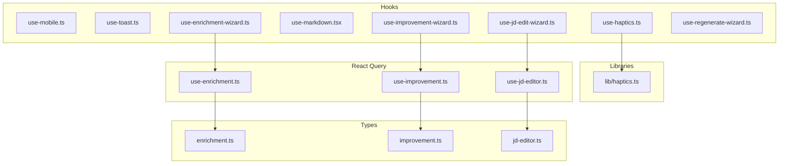
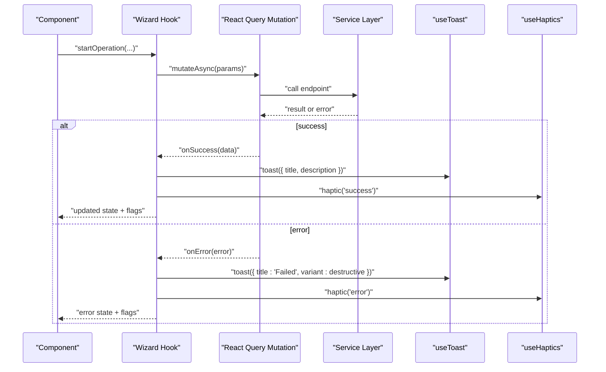
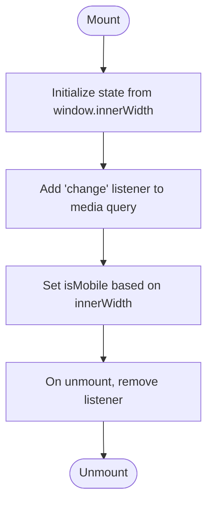
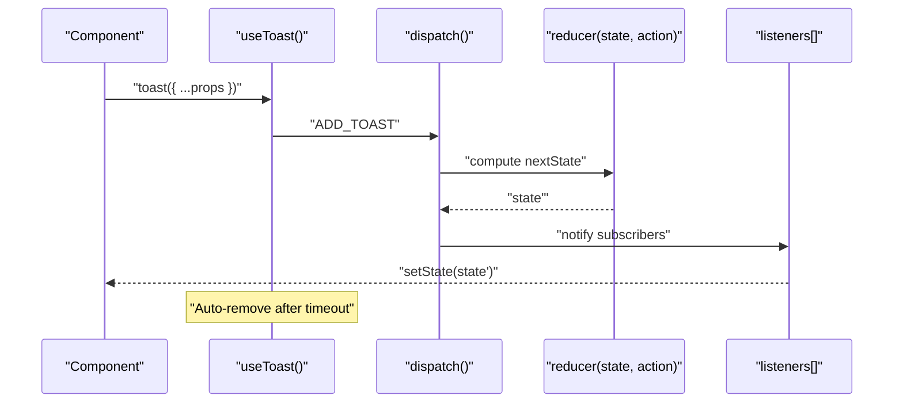
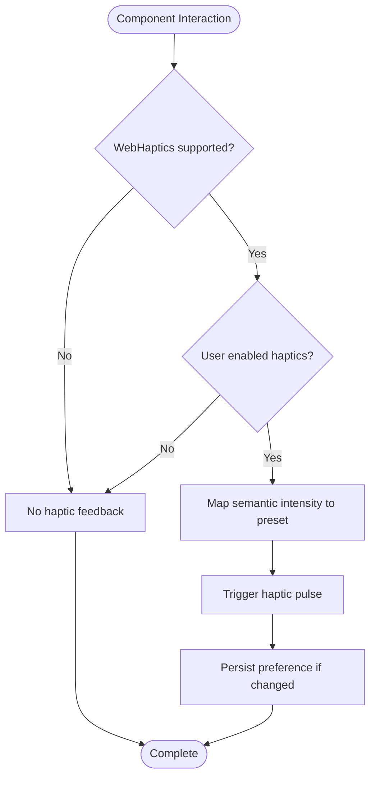
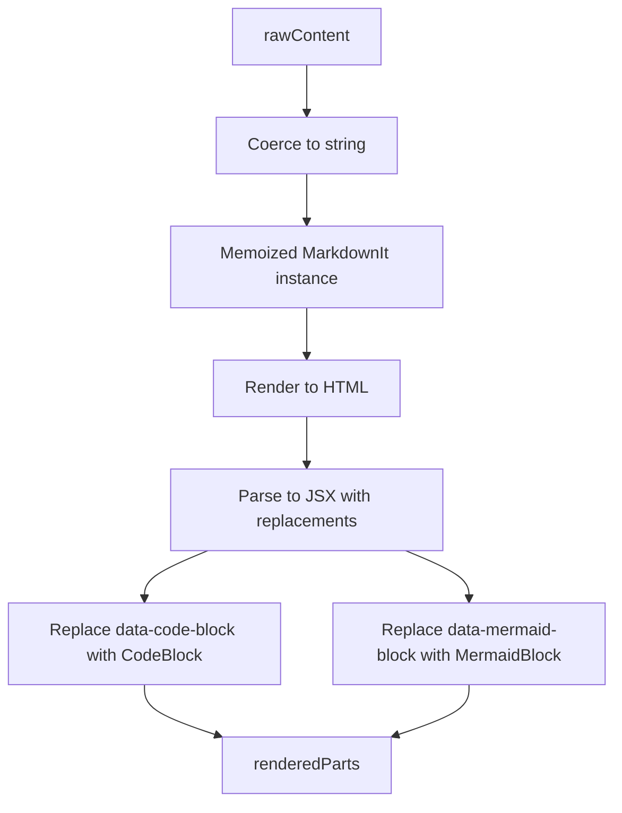
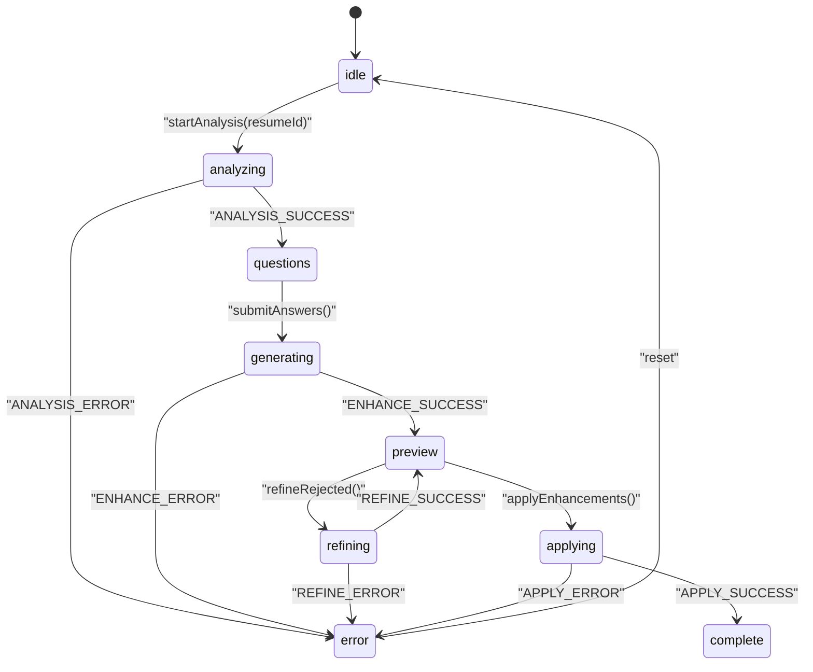
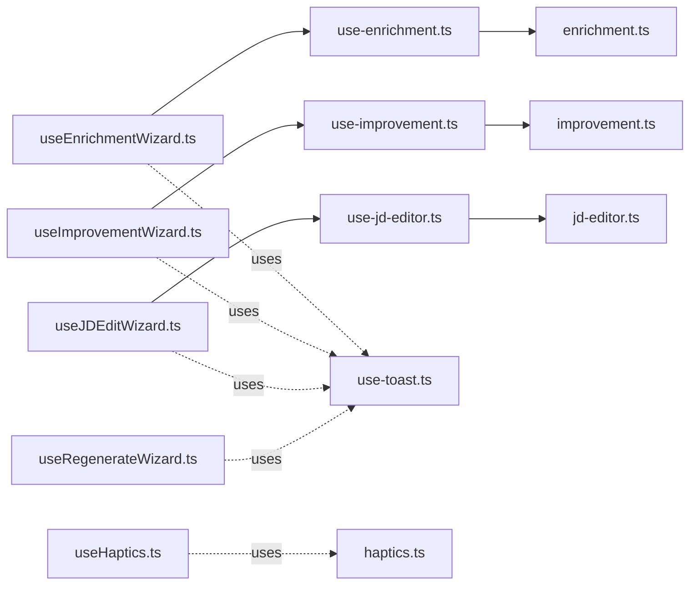

# Custom hooks

## Update summary
**Changes Made**
- Added new section for haptics hook implementation
- Updated project structure diagram to include haptics library
- Added haptics hook documentation with intensity levels and user preferences
- Updated dependency analysis to include haptics library integration

## Introduction
This page explains the design and implementation of custom React hooks used across the application. It focuses on reusable logic patterns, hook composition, dependency management, and state encapsulation. Special attention is given to:
- Responsive design hook use-mobile
- Notification system hook use-toast
- Haptic feedback system with use-haptics hook and haptics library
- Multi-step wizard hooks for enrichment, improvement, JD editing, and regeneration
- Integration with React Query and service layers
- Controlled vs uncontrolled patterns, form handling, and UI state management
- Testing, performance optimization, and debugging techniques

## Project structure
The custom hooks live under frontend/hooks and are organized by domain:
- Device responsiveness: use-mobile.ts
- Notifications: use-toast.ts
- Haptic feedback: use-haptics.ts and lib/haptics.ts
- Markdown rendering: use-markdown.tsx
- Wizard flows: use-enrichment-wizard.ts, use-improvement-wizard.ts, use-jd-edit-wizard.ts, use-regenerate-wizard.ts
- React Query integration: hooks/queries/use-*.ts
- Shared types: frontend/types/*.ts

```mermaid
graph TB
subgraph "Hooks"
UM["use-mobile.ts"]
UT["use-toast.ts"]
UH["use-haptics.ts"]
UMD["use-markdown.tsx"]
UEW["use-enrichment-wizard.ts"]
UIW["use-improvement-wizard.ts"]
UJEW["use-jd-edit-wizard.ts"]
URW["use-regenerate-wizard.ts"]
end
subgraph "Libraries"
HL["lib/haptics.ts"]
end
subgraph "React Query"
QE["use-enrichment.ts"]
QI["use-improvement.ts"]
QJD["use-jd-editor.ts"]
end
subgraph "Types"
T1["enrichment.ts"]
T2["improvement.ts"]
T3["jd-editor.ts"]
end
UEW --> QE
UIW --> QI
UJEW --> QJD
QE --> T1
QI --> T2
QJD --> T3
UH --> HL
```

## Core components
- useIsMobile: Detects mobile viewport and updates on resize. Encapsulates media query listener lifecycle.
- useToast: Centralized toast notification manager with reducer-driven state, listener pattern, and auto-dismiss queues.
- useHaptics: Haptic feedback manager with intensity levels and user preference persistence.
- use-markdown: Parses and renders Markdown with custom fences, callouts, headings, and Mermaid diagrams; returns parsed JSX.
- Wizard hooks: useEnrichmentWizard, useImprovementWizard, useJDEditWizard, useRegenerateWizard. Each uses useReducer to manage multi-step workflows, compose with React Query mutations, and expose derived UI flags.

Key design patterns:
- Hook composition: Wizard hooks depend on React Query hooks for network operations and useToast/useHaptics for user feedback.
- Dependency management: Mutations are memoized via useCallback and passed around as stable references to avoid re-renders.
- State encapsulation: Each wizard maintains a local finite state machine and exposes computed flags and helpers.
- Haptic feedback: useHaptics provides consistent tactile feedback with semantic intensity levels and user preference management.

## Architecture overview
The hooks integrate with React Query mutations and service layers. Wizard hooks orchestrate state transitions and delegate network tasks to mutations. Notifications and haptic feedback are centralized via useToast and useHaptics respectively.

```mermaid
sequenceDiagram
participant UI as "Component"
participant W as "Wizard Hook"
participant MQ as "React Query Mutation"
participant SVC as "Service Layer"
participant T as "useToast"
participant H as "useHaptics"
UI->>W : "startOperation(...)"
W->>MQ : "mutateAsync(params)"
MQ->>SVC : "call endpoint"
SVC-->>MQ : "result or error"
alt success
MQ-->>W : "onSuccess(data)"
W->>T : "toast({ title, description })"
W->>H : "haptic('success')"
W-->>UI : "updated state + flags"
else error
MQ-->>W : "onError(error)"
W->>T : "toast({ title : 'Failed', variant : destructive })"
W->>H : "haptic('error')"
W-->>UI : "error state + flags"
end
```

## Detailed component analysis

### useIsMobile: responsive design hook
Purpose:
- Detect mobile viewport and update on resize.
- Encapsulate media query listener lifecycle inside useEffect.

Implementation highlights:
- Uses a media query matching breakpoint and an effect to attach/detach listeners.
- Initializes state from current window width.

```mermaid
flowchart TD
Start(["Mount"]) --> Init["Initialize state from window.innerWidth"]
Init --> Attach["Add 'change' listener to media query"]
Attach --> SetState["Set isMobile based on innerWidth"]
SetState --> Cleanup["On unmount, remove listener"]
Cleanup --> End(["Unmount"])
```

### useToast: notification manager
Purpose:
- Provide a toast API with immutable state, reducer-driven updates, and listener subscriptions.

Implementation highlights:
- Maintains a single global state and a listener array.
- Generates unique IDs and schedules removal timeouts per toast.
- Exposes a hook to subscribe to global state and a standalone function to trigger toasts.

```mermaid
sequenceDiagram
participant Comp as "Component"
participant Hook as "useToast()"
participant Disp as "dispatch()"
participant Red as "reducer(state, action)"
participant List as "listeners[]"
Comp->>Hook : "toast({ ...props })"
Hook->>Disp : "ADD_TOAST"
Disp->>Red : "compute nextState"
Red-->>Disp : "state'"
Disp->>List : "notify subscribers"
List-->>Comp : "setState(state')"
Note over Hook : "Auto-remove after timeout"
```

### useHaptics: haptic feedback manager
Purpose:
- Provide consistent tactile feedback for user interactions with different intensity levels and user preference management.

Implementation highlights:
- Manages haptic feedback state with localStorage persistence for user preferences.
- Supports semantic intensity levels: selection, light, medium, heavy, success, error, tick.
- Integrates with web-haptics library for cross-platform compatibility.
- Provides safe fallbacks for unsupported devices and browsers.

```mermaid
flowchart TD
Start(["Component Interaction"]) --> CheckSupport{"WebHaptics supported?"}
CheckSupport --> |No| NoOp["No haptic feedback"]
CheckSupport --> |Yes| CheckEnabled{"User enabled haptics?"}
CheckEnabled --> |No| NoOp
CheckEnabled --> |Yes| MapIntensity["Map semantic intensity to preset"]
MapIntensity --> Trigger["Trigger haptic pulse"]
Trigger --> Persist["Persist preference if changed"]
NoOp --> End(["Complete"])
Persist --> End
```

### use-markdown: Markdown rendering hook
Purpose:
- Parse Markdown to HTML, transform fenced code blocks and Mermaid diagrams into React components, and add GFM-style callouts and heading anchors.

Implementation highlights:
- Memoizes a MarkdownIt instance and renderer rules for headings, lists, tables, blockquotes, and inline elements.
- Replaces fenced code blocks with placeholders and swaps them with CodeBlock components during parsing.
- Supports Mermaid diagrams with dynamic initialization and error fallback UI.

```mermaid
flowchart TD
Input["rawContent"] --> Normalize["Coerce to string"]
Normalize --> MD["Memoized MarkdownIt instance"]
MD --> Render["Render to HTML"]
Render --> Parse["Parse to JSX with replacements"]
Parse --> ReplaceCode["Replace data-code-block with CodeBlock"]
Parse --> ReplaceMermaid["Replace data-mermaid-block with MermaidBlock"]
ReplaceCode --> Output["renderedParts"]
ReplaceMermaid --> Output
```

### useEnrichmentWizard: multi-step enrichment workflow
Purpose:
- Manage a complex, multi-step enrichment flow: analyze -> answer questions -> generate enhancements -> preview -> refine rejected -> apply -> complete.

Implementation highlights:
- Uses useReducer to maintain a deterministic state machine.
- Composes with React Query mutations: analyze, improve, refine, apply.
- Exposes derived flags (canSubmitAnswers, canApplyEnhancements, counts) and actions (setAnswer, setPatchStatus, approveAll, refineRejected, applyEnhancements, reset).
- Handles error extraction and user-friendly messages.

```mermaid
stateDiagram-v2
[*] --> idle
idle --> analyzing : "startAnalysis(resumeId)"
analyzing --> questions : "ANALYSIS_SUCCESS"
analyzing --> error : "ANALYSIS_ERROR"
questions --> generating : "submitAnswers()"
generating --> preview : "ENHANCE_SUCCESS"
generating --> error : "ENHANCE_ERROR"
preview --> refining : "refineRejected()"
preview --> applying : "applyEnhancements()"
refining --> preview : "REFINE_SUCCESS"
refining --> error : "REFINE_ERROR"
applying --> complete : "APPLY_SUCCESS"
applying --> error : "APPLY_ERROR"
error --> idle : "reset"
```

### useImprovementWizard: resume improvement workflow
Purpose:
- Manage improvement flow: start -> improve -> preview -> apply -> complete (or error).

Implementation highlights:
- Simpler reducer with fewer steps compared to enrichment wizard.
- Composes with useImproveResume mutation and exposes isImproving/isApplying/hasPreview flags.

### useJDEditWizard: JD-based resume editing workflow
Purpose:
- Manage editing flow: set fields -> start editing -> preview -> mark applying -> complete (or error).

Implementation highlights:
- Uses a reducer to track field values and step transitions.
- Exposes prefill and manual applying markers to coordinate with parent component's persistence.

### useRegenerateWizard: item regeneration workflow
Purpose:
- Manage regeneration flow: open -> select items -> set instruction -> generate -> preview -> apply -> complete.

Implementation highlights:
- Tracks selected items, instruction length constraints, and error recovery with step-aware rollback.
- Uses two mutations: regenerate and apply regenerated items.

## Dependency analysis
- Wizard hooks depend on React Query mutations for network operations and on useToast/useHaptics for user feedback.
- React Query hooks encapsulate service calls and define onSuccess/onError handlers that trigger toasts and invalidations.
- useHaptics depends on the haptics library for cross-platform haptic feedback with semantic intensity levels.
- Wizard hooks derive UI flags from internal state and pass stable callbacks to components to minimize re-renders.

```mermaid
graph LR
UEW["useEnrichmentWizard.ts"] --> QE["use-enrichment.ts"]
UIW["useImprovementWizard.ts"] --> QI["use-improvement.ts"]
UJEW["useJDEditWizard.ts"] --> QJD["use-jd-editor.ts"]
QE --> T1["enrichment.ts"]
QI --> T2["improvement.ts"]
QJD --> T3["jd-editor.ts"]
UEW -.uses.-> UT["use-toast.ts"]
UIW -.uses.-> UT
UJEW -.uses.-> UT
URW["useRegenerateWizard.ts"] -.uses.-> UT
UH["useHaptics.ts"] -.uses.-> HL["haptics.ts"]
```

## Performance considerations
- Memoization: Wizard hooks memoize action creators with useCallback to prevent unnecessary prop updates and re-renders.
- Stable references: Mutations returned by React Query hooks are stable; pass them as-is to child components.
- State granularity: useReducer keeps state normalized and avoids spreading large objects into props.
- Toast batching: useToast limits concurrent toasts and schedules removal to reduce DOM churn.
- Haptic feedback optimization: useHaptics caches haptic instances and uses semantic intensity mapping for efficient feedback.
- Markdown rendering: Memoized MarkdownIt instance and selective replacement reduce re-computation.
- Event listeners: useIsMobile attaches and detaches media query listeners in useEffect to avoid leaks.

## Troubleshooting guide
Common issues and remedies:
- Toast not appearing:
  - Ensure the hook is used client-side and that the provider is mounted.
  - Verify listeners are registered and not prematurely removed.
- Haptic feedback not working:
  - Check browser/device support for WebHaptics/Vibration API.
  - Verify user hasn't disabled haptics in settings.
  - Ensure component is rendered client-side (use client directive).
- Wizard stuck in error:
  - Use the wizard's reset or goBack helpers to recover to a previous step.
  - Inspect error messages extracted from service responses.
- Network failures:
  - Confirm mutation keys and query invalidation are configured correctly.
  - Check toast notifications for user-facing error messages.
- Responsive detection:
  - Confirm the media query listener is attached and cleanup occurs on unmount.

## Conclusion
The custom hooks demonstrate reliable patterns for building reusable, composable logic:
- useIsMobile encapsulates responsive behavior cleanly.
- useToast centralizes notifications with a reducer and listener model.
- useHaptics provides consistent tactile feedback with semantic intensity levels and user preference management.
- use-markdown provides a flexible, extensible Markdown renderer.
- Wizard hooks orchestrate complex workflows with deterministic state machines, compose with React Query, and expose clear UI flags.
These patterns promote separation of concerns, testability, and maintainability across the application.

## Appendices

### Hook composition patterns
- Composition over inheritance: Wizard hooks compose with React Query and useToast/useHaptics rather than extending base classes.
- Stable callbacks: Use useCallback to memoize event handlers and prevent re-renders.
- Derived flags: Compute UI flags from state to simplify component logic.
- Haptic feedback integration: Use useHaptics alongside other feedback mechanisms for consistent user experience.

### Haptic intensity levels
The haptics system provides seven semantic intensity levels:
- selection: Lightest feedback for selections (8ms, 0.3 intensity)
- light: Standard button/tap feedback (15ms, 0.4 intensity)
- medium: Toggle/switch feedback (25ms, 0.7 intensity)
- heavy: Important actions/FAB feedback (35ms, 1.0 intensity)
- success: Two-pulse for successful operations
- error: Three-pulse for errors/warnings
- tick: Very short pulse for slider steps (mapped to rigid preset)

### Testing strategies
- Unit tests for reducers: Validate state transitions for each action type.
- Mock React Query: Spy on mutateAsync and assert calls with correct parameters.
- Mock toast: Spy on useToast to verify toast invocations on success/error.
- Mock haptics: Spy on useHaptics to verify haptic feedback triggers and intensity levels.
- Component tests: Render components with mocked hooks and assert UI flags and behavior.

### Debugging techniques
- Enable React DevTools Profiler to identify expensive renders.
- Log state transitions in reducers to trace unexpected state changes.
- Use browser devtools to inspect media query listener registrations and removals.
- Add console logs in mutation callbacks to verify success/error flows.
- Test haptic feedback across different devices and browsers to ensure compatibility.
- Monitor localStorage persistence for haptic preferences across sessions.
