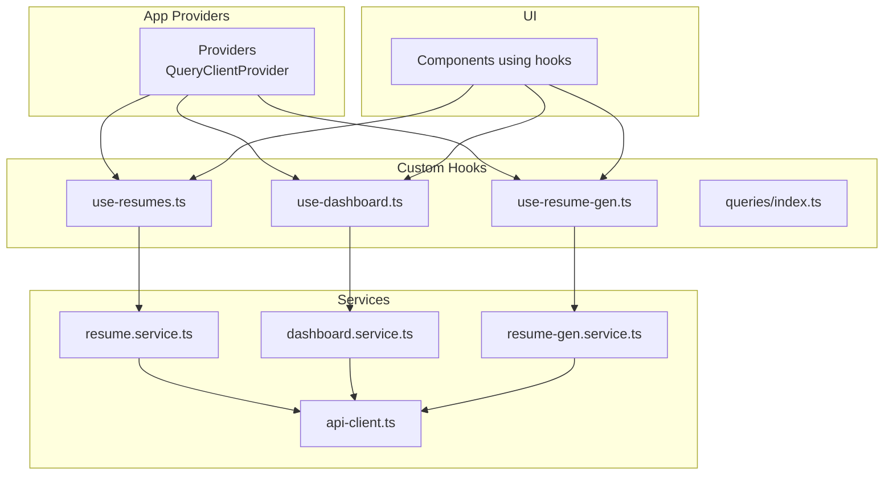
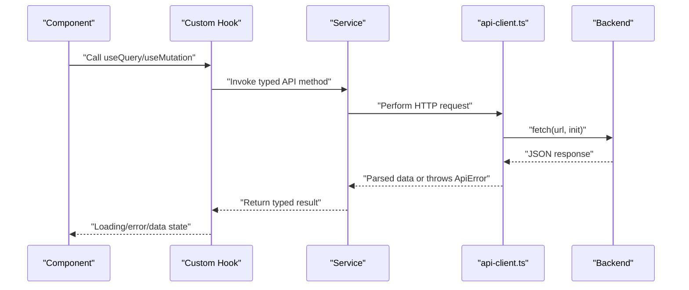
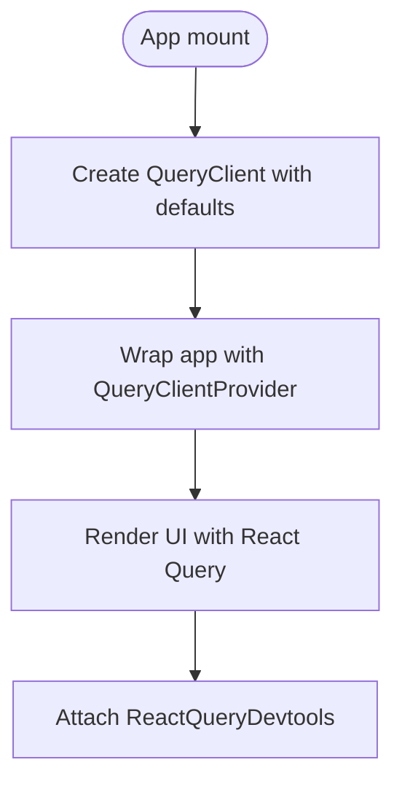
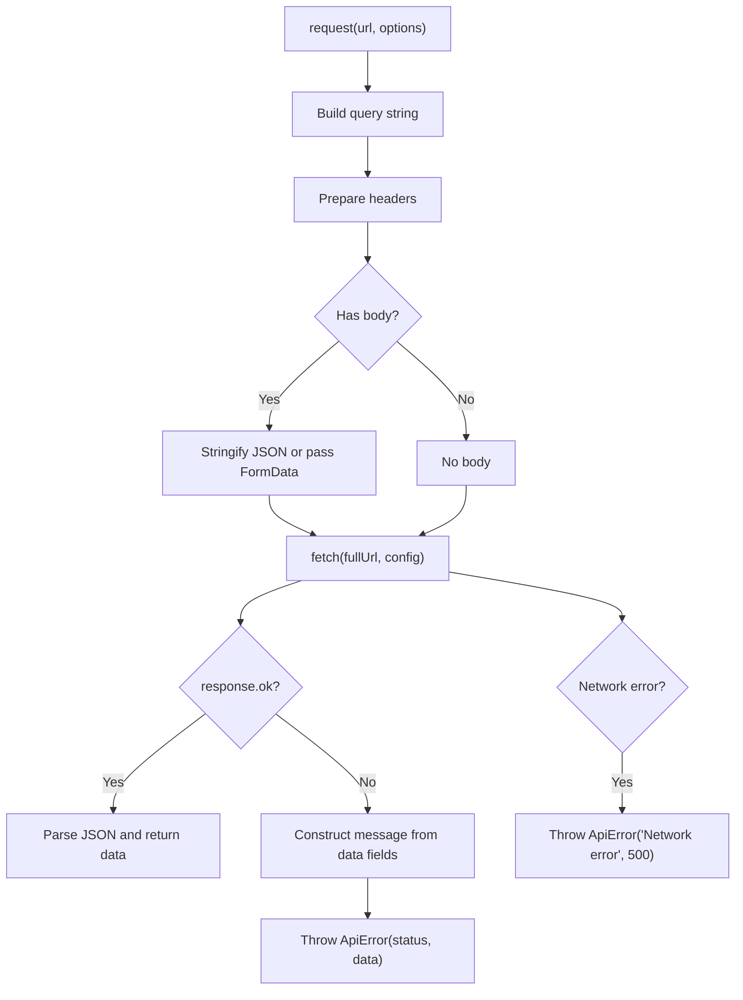
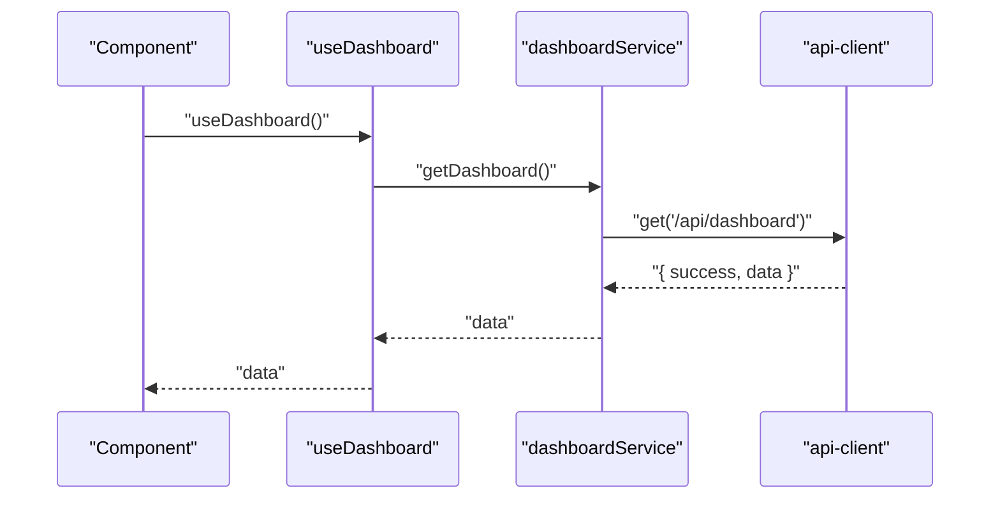
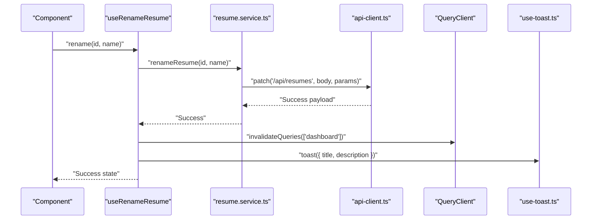
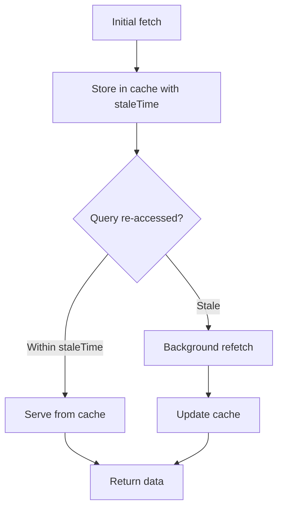
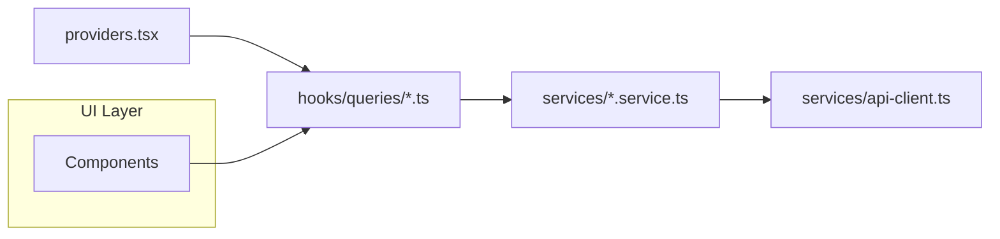

# React Query Integration

<cite>
**Referenced Files in This Document**
- [providers.tsx](file://frontend/app/providers.tsx)
- [api-client.ts](file://frontend/services/api-client.ts)
- [index.ts](file://frontend/hooks/queries/index.ts)
- [use-resumes.ts](file://frontend/hooks/queries/use-resumes.ts)
- [use-dashboard.ts](file://frontend/hooks/queries/use-dashboard.ts)
- [use-resume-gen.ts](file://frontend/hooks/queries/use-resume-gen.ts)
- [resume.service.ts](file://frontend/services/resume.service.ts)
- [dashboard.service.ts](file://frontend/services/dashboard.service.ts)
- [resume-gen.service.ts](file://frontend/services/resume-gen.service.ts)
- [use-toast.ts](file://frontend/hooks/use-toast.ts)
</cite>

## Table of Contents
1. [Introduction](#introduction)
2. [Project Structure](#project-structure)
3. [Core Components](#core-components)
4. [Architecture Overview](#architecture-overview)
5. [Detailed Component Analysis](#detailed-component-analysis)
6. [Dependency Analysis](#dependency-analysis)
7. [Performance Considerations](#performance-considerations)
8. [Troubleshooting Guide](#troubleshooting-guide)
9. [Conclusion](#conclusion)

## Introduction
This document explains how React Query is integrated into the frontend application. It covers the React Query setup and provider configuration, query client defaults, caching strategies, and the custom hook patterns used for data fetching, mutations, and error handling. It also documents the API client configuration, request/response handling, and outlines patterns for query invalidation, background refetching, and future enhancements such as pagination and infinite queries.

## Project Structure
React Query is initialized at the application boundary and consumed by feature-specific hooks and services:
- Providers initialize the QueryClient with default caching and retry behavior.
- Services encapsulate API calls and return typed responses.
- Custom hooks wrap React Query primitives to expose domain-specific data fetching and mutations.
- A toast utility integrates with mutations for user feedback.

**Diagram sources**
- [providers.tsx](file://frontend/app/providers.tsx#L13-L37)
- [api-client.ts](file://frontend/services/api-client.ts#L100-L124)
- [resume.service.ts](file://frontend/services/resume.service.ts#L23-L65)
- [dashboard.service.ts](file://frontend/services/dashboard.service.ts#L4-L7)
- [resume-gen.service.ts](file://frontend/services/resume-gen.service.ts#L4-L19)
- [use-resumes.ts](file://frontend/hooks/queries/use-resumes.ts#L1-L83)
- [use-dashboard.ts](file://frontend/hooks/queries/use-dashboard.ts#L1-L13)
- [use-resume-gen.ts](file://frontend/hooks/queries/use-resume-gen.ts#L1-L21)
- [index.ts](file://frontend/hooks/queries/index.ts#L1-L14)

**Section sources**
- [providers.tsx](file://frontend/app/providers.tsx#L1-L38)
- [index.ts](file://frontend/hooks/queries/index.ts#L1-L14)

## Core Components
- QueryClientProvider and default options:
  - Stale time is configured to treat data as fresh for a short duration.
  - Automatic retries are enabled for transient failures.
  - Window focus refetch is disabled to avoid unnecessary network activity.
- API client:
  - Provides typed request helpers (get, post, put, patch, delete).
  - Handles query parameters, FormData, and JSON bodies.
  - Parses JSON responses and throws a structured ApiError on non-OK responses.
  - Distinguishes between network errors and server-side error messages.
- Custom hooks:
  - useQuery wrappers for domain resources (e.g., dashboard, resume).
  - useMutation wrappers for write operations with optimistic updates and invalidation.
  - Integration with a toast utility for user feedback on success/error.

**Section sources**
- [providers.tsx](file://frontend/app/providers.tsx#L14-L27)
- [api-client.ts](file://frontend/services/api-client.ts#L25-L98)
- [use-resumes.ts](file://frontend/hooks/queries/use-resumes.ts#L1-L83)
- [use-dashboard.ts](file://frontend/hooks/queries/use-dashboard.ts#L1-L13)
- [use-resume-gen.ts](file://frontend/hooks/queries/use-resume-gen.ts#L1-L21)
- [use-toast.ts](file://frontend/hooks/use-toast.ts#L142-L169)

## Architecture Overview
The integration follows a layered pattern:
- Application layer: Providers configure React Query globally.
- Services layer: Typed API clients encapsulate HTTP requests and normalize responses.
- Hooks layer: Domain-specific React Query hooks orchestrate reads/writes.
- UI layer: Components consume hooks and render state.

**Diagram sources**
- [use-resumes.ts](file://frontend/hooks/queries/use-resumes.ts#L5-L14)
- [resume.service.ts](file://frontend/services/resume.service.ts#L24-L25)
- [api-client.ts](file://frontend/services/api-client.ts#L25-L98)

## Detailed Component Analysis

### Query Client Setup and Provider
- Providers initializes a single QueryClient instance with defaultOptions:
  - staleTime controls freshness.
  - retry governs transient failure resilience.
  - refetchOnWindowFocus disabled to reduce background traffic.
- Devtools are included for development inspection.

**Diagram sources**
- [providers.tsx](file://frontend/app/providers.tsx#L13-L37)

**Section sources**
- [providers.tsx](file://frontend/app/providers.tsx#L14-L27)

### API Client Configuration and Error Handling
- Request builder supports method, headers, body, and query parameters.
- Automatically sets Content-Type for JSON payloads and leaves it unset for FormData.
- Response parsing and error normalization:
  - On non-OK responses, constructs a human-readable message from common error fields.
  - Throws a structured ApiError with status and data payload.
  - Catches unexpected errors and wraps them as ApiError with a generic message.

**Diagram sources**
- [api-client.ts](file://frontend/services/api-client.ts#L25-L98)

**Section sources**
- [api-client.ts](file://frontend/services/api-client.ts#L25-L98)

### Custom Hook Patterns: Queries
- useDashboard:
  - Defines a queryKey for dashboard data.
  - Fetches data via dashboardService and returns normalized data.
- useResume:
  - Accepts an id and enables the query only when id is truthy.
  - Returns loading, error, and data states.

**Diagram sources**
- [use-dashboard.ts](file://frontend/hooks/queries/use-dashboard.ts#L4-L12)
- [dashboard.service.ts](file://frontend/services/dashboard.service.ts#L5-L6)
- [api-client.ts](file://frontend/services/api-client.ts#L101-L102)

**Section sources**
- [use-dashboard.ts](file://frontend/hooks/queries/use-dashboard.ts#L1-L13)
- [use-resumes.ts](file://frontend/hooks/queries/use-resumes.ts#L5-L14)

### Custom Hook Patterns: Mutations and Optimistic Updates
- useDeleteResume, useRenameResume, useUploadResume:
  - Use useMutation to perform write operations.
  - On success:
    - Invalidate related queries to refresh cached data.
    - Show a success toast.
  - On error:
    - Show a destructive toast with the error message.
- useTailorResume, useGenerateLatex, useDownloadPdf:
  - Provide mutation functions for resume generation tasks.
  - useDownloadPdf bypasses the typed apiClient wrapper to handle raw Blob responses.

**Diagram sources**
- [use-resumes.ts](file://frontend/hooks/queries/use-resumes.ts#L39-L61)
- [resume.service.ts](file://frontend/services/resume.service.ts#L32-L41)
- [api-client.ts](file://frontend/services/api-client.ts#L116-L120)
- [use-toast.ts](file://frontend/hooks/use-toast.ts#L142-L169)

**Section sources**
- [use-resumes.ts](file://frontend/hooks/queries/use-resumes.ts#L16-L82)
- [resume.service.ts](file://frontend/services/resume.service.ts#L27-L49)
- [use-resume-gen.ts](file://frontend/hooks/queries/use-resume-gen.ts#L4-L20)
- [resume-gen.service.ts](file://frontend/services/resume-gen.service.ts#L5-L19)
- [use-toast.ts](file://frontend/hooks/use-toast.ts#L142-L169)

### Caching Strategies
- Freshness:
  - staleTime is configured to keep data fresh for a short period, balancing responsiveness with cache validity.
- Invalidation:
  - After mutations, invalidateQueries is used to trigger refetch of affected query keys (e.g., ["dashboard"]).
- Background refetch:
  - Enabled by default for most queries; window focus refetch is disabled to prevent unnecessary network activity.

**Diagram sources**
- [providers.tsx](file://frontend/app/providers.tsx#L17-L24)

**Section sources**
- [providers.tsx](file://frontend/app/providers.tsx#L17-L24)
- [use-resumes.ts](file://frontend/hooks/queries/use-resumes.ts#L22-L23)

### Pagination and Infinite Queries
- Current implementation does not include pagination or infinite query patterns.
- Recommendations for future implementation:
  - Use hasNextPage and pages for infinite queries.
  - Implement getNextPageParam and getPreviousPageParam for cursor-based pagination.
  - Combine with queryKey composition to scope caches per page.

[No sources needed since this section provides general guidance]

### Real-time Data Synchronization
- No explicit real-time synchronization mechanisms are present in the current codebase.
- Recommendations:
  - Use background refetch intervals for periodic updates.
  - Implement WebSocket or Server-Sent Events alongside React Query invalidations.
  - Consider selective invalidation of specific query keys to minimize network overhead.

[No sources needed since this section provides general guidance]

## Dependency Analysis
The following diagram shows how components depend on each other across layers:

**Diagram sources**
- [providers.tsx](file://frontend/app/providers.tsx#L13-L37)
- [use-resumes.ts](file://frontend/hooks/queries/use-resumes.ts#L1-L83)
- [use-dashboard.ts](file://frontend/hooks/queries/use-dashboard.ts#L1-L13)
- [use-resume-gen.ts](file://frontend/hooks/queries/use-resume-gen.ts#L1-L21)
- [resume.service.ts](file://frontend/services/resume.service.ts#L1-L66)
- [dashboard.service.ts](file://frontend/services/dashboard.service.ts#L1-L8)
- [resume-gen.service.ts](file://frontend/services/resume-gen.service.ts#L1-L20)
- [api-client.ts](file://frontend/services/api-client.ts#L1-L125)

**Section sources**
- [index.ts](file://frontend/hooks/queries/index.ts#L1-L14)

## Performance Considerations
- Prefer targeted invalidation over broad cache clearing to minimize refetches.
- Use enabled flags to defer queries until required (as seen with resume query).
- Keep staleTime reasonable to balance freshness and bandwidth.
- Avoid excessive retries for operations that should fail fast.
- Use background refetch judiciously; disable window focus refetch for non-critical data.

[No sources needed since this section provides general guidance]

## Troubleshooting Guide
Common issues and resolutions:
- Network errors:
  - The API client wraps unknown errors as ApiError with a generic message. Inspect the thrown error’s message and status to diagnose.
- Server-side errors:
  - The API client extracts messages from common fields and throws a structured error. Log the status and data payload for debugging.
- Mutation errors:
  - Use the onError callback in useMutation to display user-friendly messages via the toast utility.
- Query not updating after mutation:
  - Ensure invalidateQueries is called with the correct queryKey to trigger refetch.
- Excessive refetches:
  - Adjust staleTime and retry settings in the QueryClient defaults.

**Section sources**
- [api-client.ts](file://frontend/services/api-client.ts#L89-L97)
- [use-resumes.ts](file://frontend/hooks/queries/use-resumes.ts#L29-L35)
- [use-toast.ts](file://frontend/hooks/use-toast.ts#L142-L169)

## Conclusion
The application integrates React Query through a clean provider setup, typed services, and domain-specific hooks. The default caching and retry policies are tuned for a responsive UX, while mutations leverage invalidation and toasts for reliable user feedback. Future enhancements can include pagination/infinite queries and optional real-time synchronization to further improve performance and user experience.