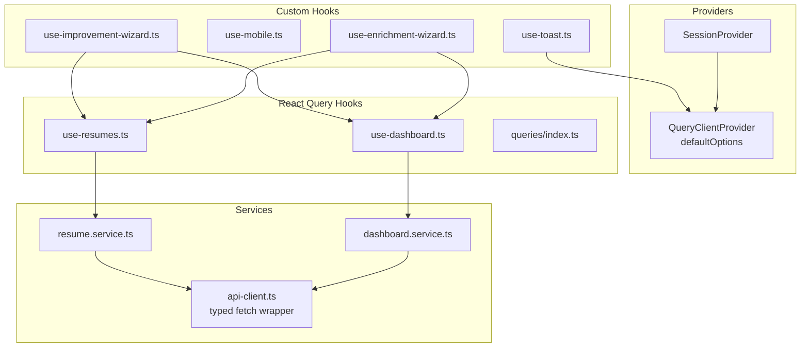
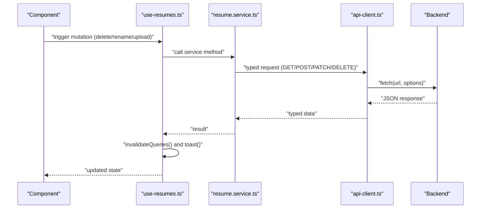
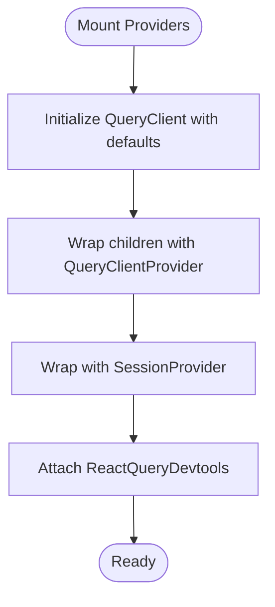
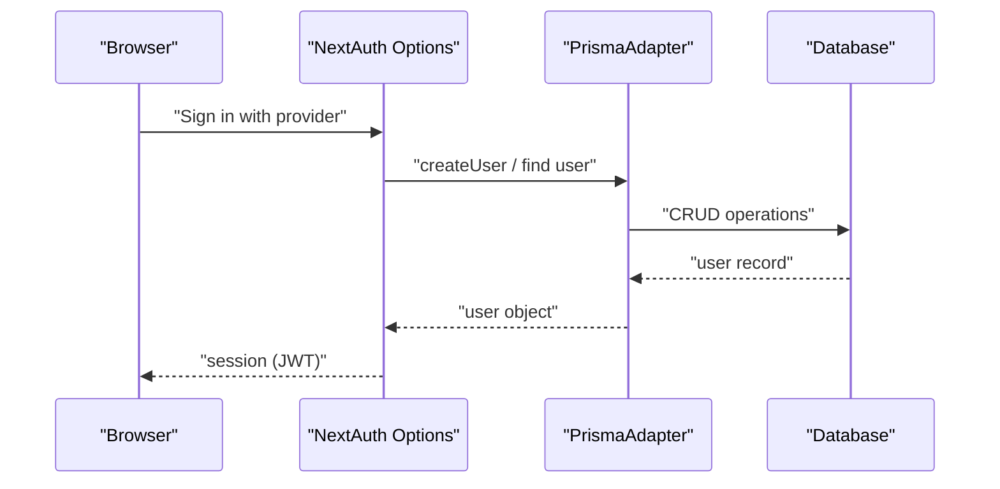
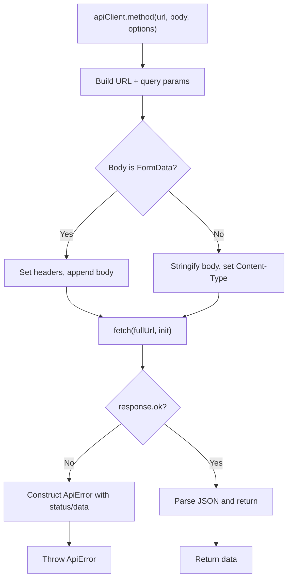
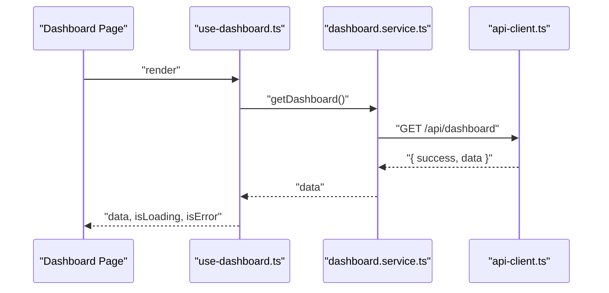
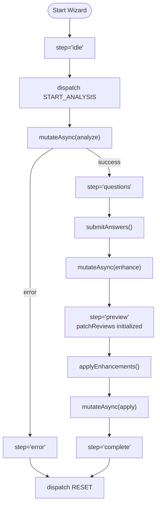
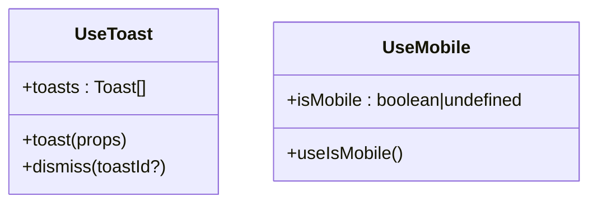
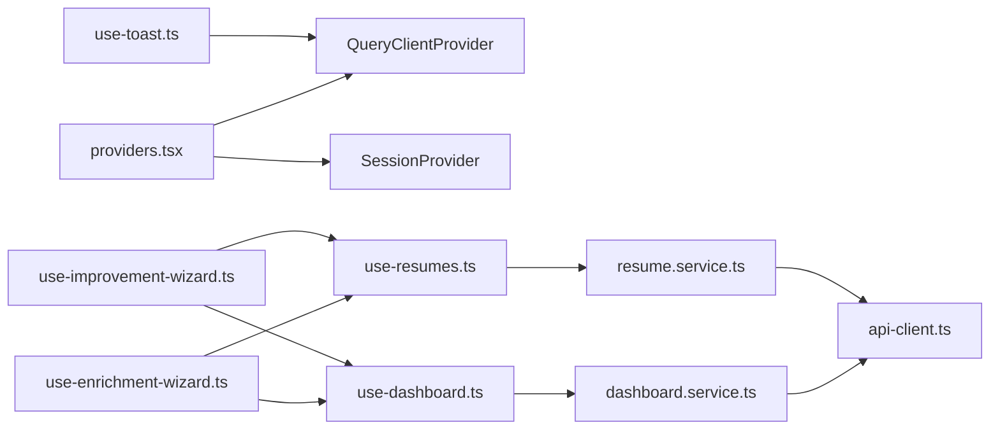

# State Management

<cite>
**Referenced Files in This Document**
- [providers.tsx](file://frontend/app/providers.tsx)
- [auth-options.ts](file://frontend/lib/auth-options.ts)
- [api-client.ts](file://frontend/services/api-client.ts)
- [dashboard.service.ts](file://frontend/services/dashboard.service.ts)
- [resume.service.ts](file://frontend/services/resume.service.ts)
- [use-dashboard.ts](file://frontend/hooks/queries/use-dashboard.ts)
- [use-resumes.ts](file://frontend/hooks/queries/use-resumes.ts)
- [index.ts (queries)](file://frontend/hooks/queries/index.ts)
- [use-toast.ts](file://frontend/hooks/use-toast.ts)
- [use-mobile.ts](file://frontend/hooks/use-mobile.ts)
- [use-enrichment-wizard.ts](file://frontend/hooks/use-enrichment-wizard.ts)
- [use-improvement-wizard.ts](file://frontend/hooks/use-improvement-wizard.ts)
- [types/index.ts](file://frontend/types/index.ts)
</cite>

## Table of Contents
1. [Introduction](#introduction)
2. [Project Structure](#project-structure)
3. [Core Components](#core-components)
4. [Architecture Overview](#architecture-overview)
5. [Detailed Component Analysis](#detailed-component-analysis)
6. [Dependency Analysis](#dependency-analysis)
7. [Performance Considerations](#performance-considerations)
8. [Troubleshooting Guide](#troubleshooting-guide)
9. [Conclusion](#conclusion)

## Introduction
This document explains the state management architecture of the frontend, focusing on:
- Server state management with React Query
- Local UI state with useState/useReducer
- Authentication state via NextAuth.js
- Custom hooks for API integration and UI state synchronization
- Data fetching patterns, caching, and optimistic updates
- Context providers, state persistence, and cross-component synchronization
- Error handling, loading states, and debugging techniques

## Project Structure
The state management stack is organized around three pillars:
- Providers: React Query client, session context, and developer tools
- Services: Typed API clients and service abstractions
- Hooks: React Query queries/mutations and custom reducers for wizard-like flows

**Diagram sources**
- [providers.tsx](file://frontend/app/providers.tsx#L1-L38)
- [api-client.ts](file://frontend/services/api-client.ts#L1-L125)
- [dashboard.service.ts](file://frontend/services/dashboard.service.ts#L1-L8)
- [resume.service.ts](file://frontend/services/resume.service.ts#L1-L66)
- [use-dashboard.ts](file://frontend/hooks/queries/use-dashboard.ts#L1-L13)
- [use-resumes.ts](file://frontend/hooks/queries/use-resumes.ts#L1-L83)
- [index.ts (queries)](file://frontend/hooks/queries/index.ts#L1-L14)
- [use-toast.ts](file://frontend/hooks/use-toast.ts#L1-L192)
- [use-mobile.ts](file://frontend/hooks/use-mobile.ts#L1-L20)
- [use-enrichment-wizard.ts](file://frontend/hooks/use-enrichment-wizard.ts#L1-L486)
- [use-improvement-wizard.ts](file://frontend/hooks/use-improvement-wizard.ts#L1-L204)

**Section sources**
- [providers.tsx](file://frontend/app/providers.tsx#L1-L38)
- [index.ts (queries)](file://frontend/hooks/queries/index.ts#L1-L14)

## Core Components
- Providers
  - React Query client configured with default caching and retry policies
  - NextAuth.js session provider for authentication state
- Services
  - Centralized typed API client with robust error handling
  - Feature-specific service modules encapsulate endpoint logic
- React Query Hooks
  - Queries for server state with explicit query keys
  - Mutations for writes with invalidation and notifications
- Custom Hooks
  - Local state machines for complex UI flows
  - Utility hooks for UI state and notifications

**Section sources**
- [providers.tsx](file://frontend/app/providers.tsx#L13-L37)
- [api-client.ts](file://frontend/services/api-client.ts#L100-L125)
- [dashboard.service.ts](file://frontend/services/dashboard.service.ts#L4-L7)
- [resume.service.ts](file://frontend/services/resume.service.ts#L23-L65)
- [use-dashboard.ts](file://frontend/hooks/queries/use-dashboard.ts#L4-L12)
- [use-resumes.ts](file://frontend/hooks/queries/use-resumes.ts#L16-L82)
- [use-toast.ts](file://frontend/hooks/use-toast.ts#L171-L189)
- [use-enrichment-wizard.ts](file://frontend/hooks/use-enrichment-wizard.ts#L237-L485)
- [use-improvement-wizard.ts](file://frontend/hooks/use-improvement-wizard.ts#L154-L203)

## Architecture Overview
The system integrates React Query for server state, NextAuth.js for authentication, and custom hooks for local UI state. Services abstract API calls and are consumed by React Query hooks.

**Diagram sources**
- [use-resumes.ts](file://frontend/hooks/queries/use-resumes.ts#L16-L82)
- [resume.service.ts](file://frontend/services/resume.service.ts#L23-L65)
- [api-client.ts](file://frontend/services/api-client.ts#L25-L98)

## Detailed Component Analysis

### React Query Provider and Defaults
- Creates a singleton QueryClient with:
  - Stale time: 1 minute
  - Retry attempts: 2
  - Window focus refetch disabled
- Wraps the app with SessionProvider for authentication state

**Diagram sources**
- [providers.tsx](file://frontend/app/providers.tsx#L13-L37)

**Section sources**
- [providers.tsx](file://frontend/app/providers.tsx#L13-L37)

### Authentication State Management
- NextAuth.js configuration supports:
  - Credentials, Google, GitHub, and Email providers
  - JWT session strategy
  - Callbacks for sign-in, session, and JWT token updates
  - Verification and image propagation
- Exposed via SessionProvider in providers

**Diagram sources**
- [auth-options.ts](file://frontend/lib/auth-options.ts#L10-L201)
- [providers.tsx](file://frontend/app/providers.tsx#L3-L3)

**Section sources**
- [auth-options.ts](file://frontend/lib/auth-options.ts#L10-L201)
- [providers.tsx](file://frontend/app/providers.tsx#L3-L3)

### API Client and Error Handling
- Provides typed GET/POST/PUT/PATCH/DELETE helpers
- Builds query strings and FormData support
- Throws ApiError with status and structured messages
- Centralizes error surface for hooks and services

**Diagram sources**
- [api-client.ts](file://frontend/services/api-client.ts#L25-L98)

**Section sources**
- [api-client.ts](file://frontend/services/api-client.ts#L13-L23)
- [api-client.ts](file://frontend/services/api-client.ts#L25-L98)

### Server State: Dashboard and Resumes
- useDashboard: fetches dashboard data with a fixed query key
- useResume: fetches a single resume by id with lazy execution (enabled only when id exists)
- useDeleteResume/useRenameResume/useUploadResume: mutations that invalidate dashboard queries and notify via toast

**Diagram sources**
- [use-dashboard.ts](file://frontend/hooks/queries/use-dashboard.ts#L4-L12)
- [dashboard.service.ts](file://frontend/services/dashboard.service.ts#L4-L7)
- [api-client.ts](file://frontend/services/api-client.ts#L100-L102)

**Section sources**
- [use-dashboard.ts](file://frontend/hooks/queries/use-dashboard.ts#L4-L12)
- [use-resumes.ts](file://frontend/hooks/queries/use-resumes.ts#L5-L14)
- [use-resumes.ts](file://frontend/hooks/queries/use-resumes.ts#L16-L82)
- [dashboard.service.ts](file://frontend/services/dashboard.service.ts#L4-L7)
- [resume.service.ts](file://frontend/services/resume.service.ts#L23-L65)

### Local State: Wizard Flows
- Enrichment Wizard
  - Uses useReducer to manage multi-step state machine
  - Integrates with React Query mutations for analysis, enhancement, refinement, and application
  - Computes derived UI flags (canSubmitAnswers, canApplyEnhancements, counts)
- Improvement Wizard
  - Similar reducer-driven flow for improving resumes
  - Emphasizes preview and applying changes

**Diagram sources**
- [use-enrichment-wizard.ts](file://frontend/hooks/use-enrichment-wizard.ts#L237-L485)
- [use-improvement-wizard.ts](file://frontend/hooks/use-improvement-wizard.ts#L154-L203)

**Section sources**
- [use-enrichment-wizard.ts](file://frontend/hooks/use-enrichment-wizard.ts#L23-L31)
- [use-enrichment-wizard.ts](file://frontend/hooks/use-enrichment-wizard.ts#L33-L209)
- [use-enrichment-wizard.ts](file://frontend/hooks/use-enrichment-wizard.ts#L237-L485)
- [use-improvement-wizard.ts](file://frontend/hooks/use-improvement-wizard.ts#L26-L65)
- [use-improvement-wizard.ts](file://frontend/hooks/use-improvement-wizard.ts#L71-L128)
- [use-improvement-wizard.ts](file://frontend/hooks/use-improvement-wizard.ts#L154-L203)

### UI State Utilities
- use-toast: centralized toast notifications with queue limits and dismissal
- use-mobile: responsive breakpoint detection for UI adaptation

**Diagram sources**
- [use-toast.ts](file://frontend/hooks/use-toast.ts#L171-L189)
- [use-mobile.ts](file://frontend/hooks/use-mobile.ts#L5-L18)

**Section sources**
- [use-toast.ts](file://frontend/hooks/use-toast.ts#L1-L192)
- [use-mobile.ts](file://frontend/hooks/use-mobile.ts#L1-L20)

### Data Fetching Patterns, Caching, and Invalidation
- Caching
  - Global staleTime of 1 minute; adjust per feature as needed
  - Automatic retries on failure
- Fetching
  - Queries keyed by domain identifiers (e.g., ["dashboard"], ["resume", id])
  - Lazy execution for id-dependent queries
- Invalidation
  - Mutations invalidate related query keys to synchronize UI state
  - Notifications surfaced via toast

**Section sources**
- [providers.tsx](file://frontend/app/providers.tsx#L14-L27)
- [use-resumes.ts](file://frontend/hooks/queries/use-resumes.ts#L6-L13)
- [use-resumes.ts](file://frontend/hooks/queries/use-resumes.ts#L22-L36)
- [use-resumes.ts](file://frontend/hooks/queries/use-resumes.ts#L46-L52)
- [use-resumes.ts](file://frontend/hooks/queries/use-resumes.ts#L70-L74)

### Optimistic Updates
- Current hooks primarily reflect server state after mutations
- To implement optimistic updates:
  - Pre-update cache in mutation.onMutate
  - Rollback on error via context returned by onMutate
  - Invalidate or update cache in onSuccess/onError
- Recommended for actions like renaming or toggling visibility to reduce perceived latency

[No sources needed since this section provides general guidance]

### Context Providers and Cross-Component Synchronization
- SessionProvider ensures authentication state is available across the app
- QueryClientProvider enables cache sharing and synchronization across components
- Custom hooks coordinate UI state and react to server-side changes via invalidation

**Section sources**
- [providers.tsx](file://frontend/app/providers.tsx#L29-L36)
- [use-resumes.ts](file://frontend/hooks/queries/use-resumes.ts#L22-L36)

### Types and Contracts
- Centralized exports of feature types enable consistent typing across services and hooks

**Section sources**
- [types/index.ts](file://frontend/types/index.ts#L1-L9)

## Dependency Analysis

**Diagram sources**
- [providers.tsx](file://frontend/app/providers.tsx#L13-L37)
- [use-dashboard.ts](file://frontend/hooks/queries/use-dashboard.ts#L1-L13)
- [dashboard.service.ts](file://frontend/services/dashboard.service.ts#L1-L8)
- [use-resumes.ts](file://frontend/hooks/queries/use-resumes.ts#L1-L83)
- [resume.service.ts](file://frontend/services/resume.service.ts#L1-L66)
- [use-enrichment-wizard.ts](file://frontend/hooks/use-enrichment-wizard.ts#L1-L486)
- [use-improvement-wizard.ts](file://frontend/hooks/use-improvement-wizard.ts#L1-L204)
- [use-toast.ts](file://frontend/hooks/use-toast.ts#L1-L192)

**Section sources**
- [index.ts (queries)](file://frontend/hooks/queries/index.ts#L1-L14)

## Performance Considerations
- Prefer granular query keys to minimize unnecessary refetches
- Use enabled flags for id-dependent queries to avoid redundant requests
- Tune staleTime per feature based on data volatility
- Limit concurrent mutations and batch invalidations to reduce re-renders
- Use devtools sparingly in production; initialIsOpen is disabled by default

[No sources needed since this section provides general guidance]

## Troubleshooting Guide
- Network and API errors
  - Inspect ApiError instances thrown by api-client
  - Surface user-friendly messages via toast
- React Query debugging
  - Enable devtools to inspect cache and query states
  - Verify query keys and invalidation triggers
- Authentication issues
  - Confirm provider configurations and callbacks
  - Check session and JWT token updates in development logs

**Section sources**
- [api-client.ts](file://frontend/services/api-client.ts#L13-L23)
- [api-client.ts](file://frontend/services/api-client.ts#L88-L98)
- [providers.tsx](file://frontend/app/providers.tsx#L33-L33)
- [use-toast.ts](file://frontend/hooks/use-toast.ts#L142-L169)
- [auth-options.ts](file://frontend/lib/auth-options.ts#L98-L196)

## Conclusion
The frontend employs a clean separation of concerns:
- React Query manages server state with predictable caching and invalidation
- NextAuth.js centralizes authentication state
- Services provide typed, reusable API access
- Custom hooks encapsulate UI logic and local state machines
This foundation supports scalable UI flows, robust error handling, and maintainable state synchronization across components.