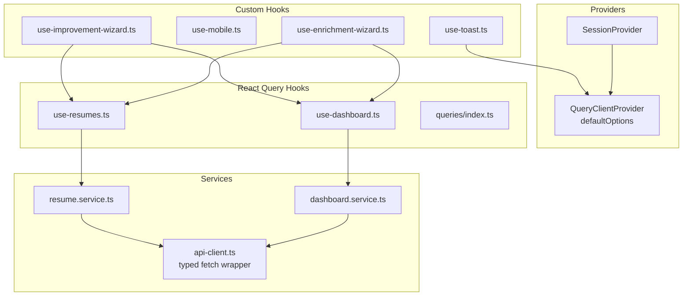
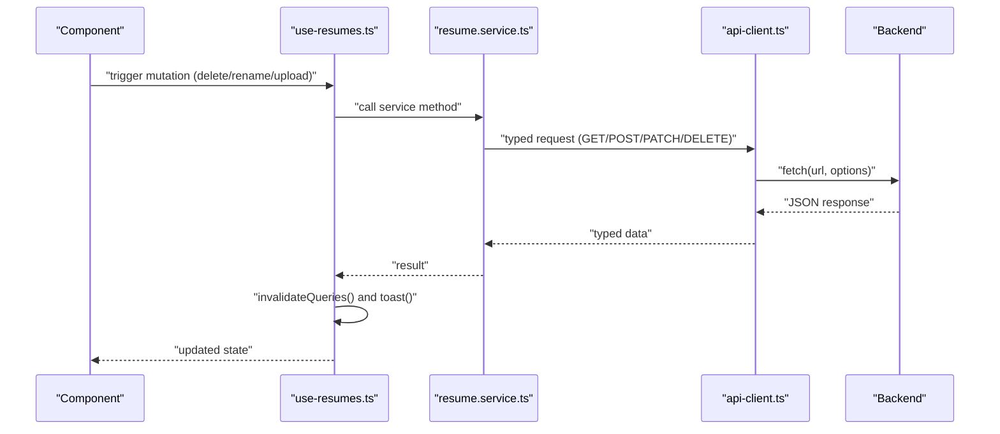
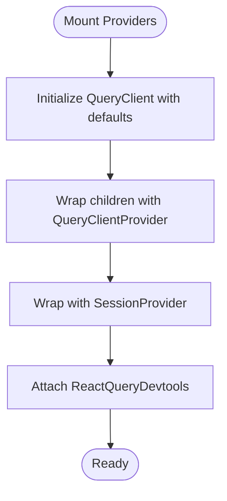
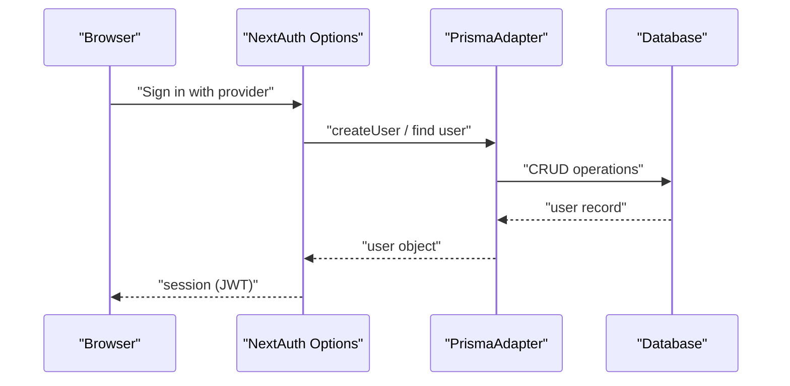
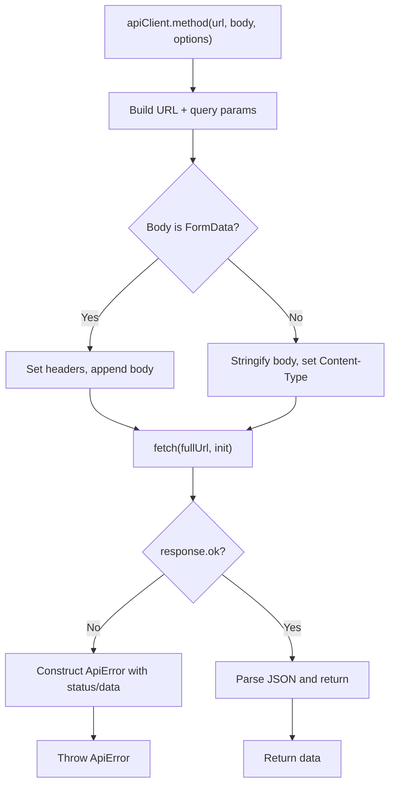
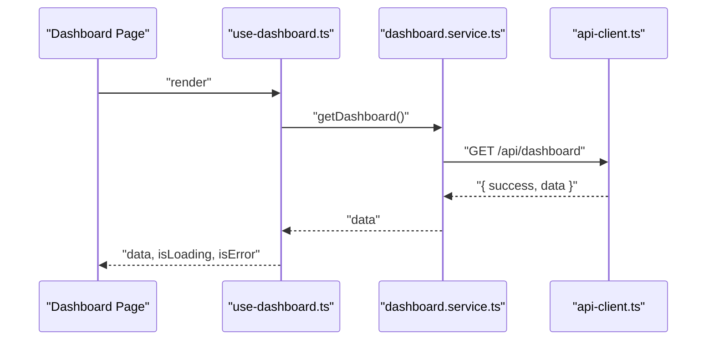
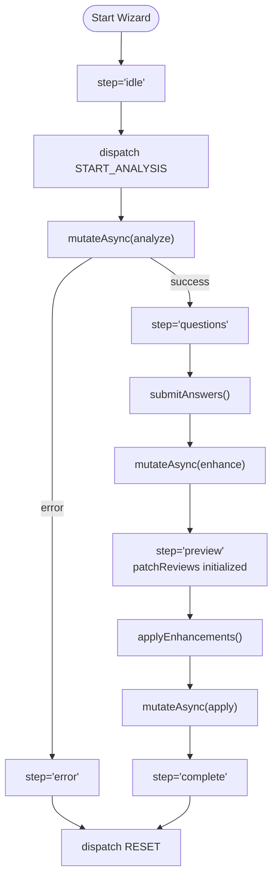
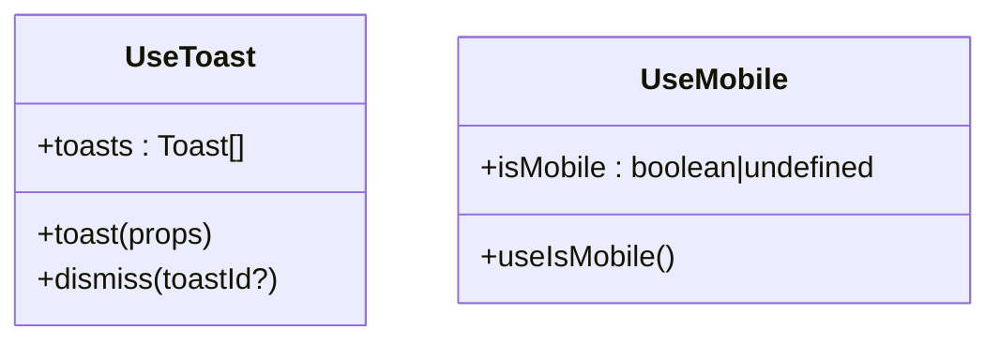
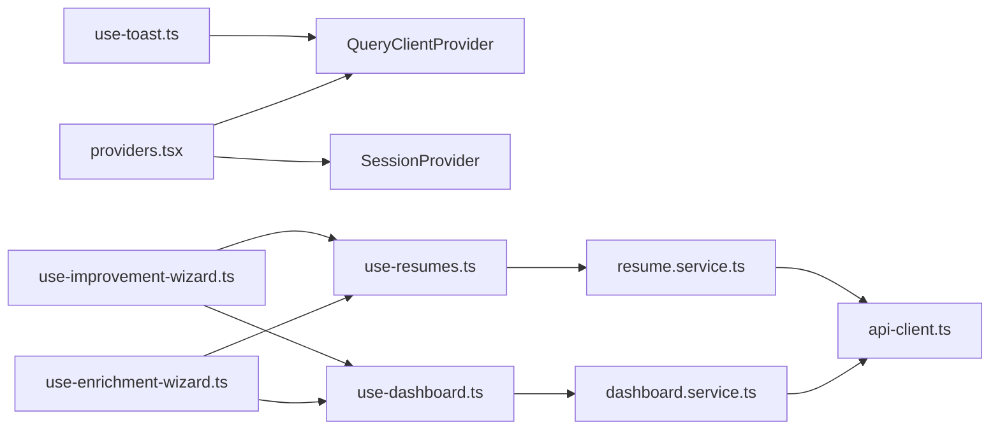

# State management

## Introduction
This page explains the state management architecture of the frontend, focusing on:
- Server state management with React Query
- Local UI state with useState/useReducer
- Authentication state via NextAuth.js
- Custom hooks for API integration and UI state synchronization
- Data fetching patterns, caching, and optimistic updates
- Context providers, state persistence, and cross-component synchronization
- Error handling, loading states, and debugging techniques

## Project structure
The state management stack is organized around three pillars:
- Providers: React Query client, session context, and developer tools
- Services: Typed API clients and service abstractions
- Hooks: React Query queries/mutations and custom reducers for wizard-like flows

```mermaid
graph TB
subgraph "Providers"
P1["QueryClientProvider<br/>defaultOptions"]
P2["SessionProvider"]
end
subgraph "Services"
S1["api-client.ts<br/>typed fetch wrapper"]
S2["dashboard.service.ts"]
S3["resume.service.ts"]
end
subgraph "React Query Hooks"
Q1["use-dashboard.ts"]
Q2["use-resumes.ts"]
IDX["queries/index.ts"]
end
subgraph "Custom Hooks"
H1["use-toast.ts"]
H2["use-mobile.ts"]
H3["use-enrichment-wizard.ts"]
H4["use-improvement-wizard.ts"]
end
P2 --> P1
Q1 --> S2 --> S1
Q2 --> S3 --> S1
H3 --> Q1
H3 --> Q2
H4 --> Q1
H4 --> Q2
H1 --> P1
```

## Core components
- Providers
  - React Query client configured with default caching and retry policies
  - NextAuth.js session provider for authentication state
- Services
  - Centralized typed API client with reliable error handling
  - Feature-specific service modules encapsulate endpoint logic
- React Query Hooks
  - Queries for server state with explicit query keys
  - Mutations for writes with invalidation and notifications
- Custom Hooks
  - Local state machines for complex UI flows
  - Utility hooks for UI state and notifications

## Architecture overview
The system integrates React Query for server state, NextAuth.js for authentication, and custom hooks for local UI state. Services abstract API calls and are consumed by React Query hooks.

```mermaid
sequenceDiagram
participant UI as "Component"
participant Hook as "use-resumes.ts"
participant Service as "resume.service.ts"
participant API as "api-client.ts"
participant Server as "Backend"
UI->>Hook : "trigger mutation (delete/rename/upload)"
Hook->>Service : "call service method"
Service->>API : "typed request (GET/POST/PATCH/DELETE)"
API->>Server : "fetch(url, options)"
Server-->>API : "JSON response"
API-->>Service : "typed data"
Service-->>Hook : "result"
Hook->>Hook : "invalidateQueries() and toast()"
Hook-->>UI : "updated state"
```

## Detailed component analysis

### React query provider and defaults
- Creates a singleton QueryClient with:
  - Stale time: 1 minute
  - Retry attempts: 2
  - Window focus refetch disabled
- Wraps the app with SessionProvider for authentication state

```mermaid
flowchart TD
Start(["Mount Providers"]) --> InitQC["Initialize QueryClient with defaults"]
InitQC --> WrapQP["Wrap children with QueryClientProvider"]
WrapQP --> WrapSP["Wrap with SessionProvider"]
WrapSP --> Devtools["Attach ReactQueryDevtools"]
Devtools --> End(["Ready"])
```

### Authentication state management
- NextAuth.js configuration supports:
  - Credentials, Google, GitHub, and Email providers
  - JWT session strategy
  - Callbacks for sign-in, session, and JWT token updates
  - Verification and image propagation
- Exposed via SessionProvider in providers

```mermaid
sequenceDiagram
participant Client as "Browser"
participant NextAuth as "NextAuth Options"
participant Adapter as "PrismaAdapter"
participant DB as "Database"
Client->>NextAuth : "Sign in with provider"
NextAuth->>Adapter : "createUser / find user"
Adapter->>DB : "CRUD operations"
DB-->>Adapter : "user record"
Adapter-->>NextAuth : "user object"
NextAuth-->>Client : "session (JWT)"
```

### API client and error handling
- Provides typed GET/POST/PUT/PATCH/DELETE helpers
- Builds query strings and FormData support
- Throws ApiError with status and structured messages
- Centralizes error surface for hooks and services

```mermaid
flowchart TD
A["apiClient.method(url, body, options)"] --> B["Build URL + query params"]
B --> C{"Body is FormData?"}
C -- Yes --> D["Set headers, append body"]
C -- No --> E["Stringify body, set Content-Type"]
D --> F["fetch(fullUrl, init)"]
E --> F
F --> G{"response.ok?"}
G -- No --> H["Construct ApiError with status/data"]
G -- Yes --> I["Parse JSON and return"]
H --> J["Throw ApiError"]
I --> K["Return data"]
```

### Server state: dashboard and resumes
- useDashboard: fetches dashboard data with a fixed query key
- useResume: fetches a single resume by id with lazy execution (enabled only when id exists)
- useDeleteResume/useRenameResume/useUploadResume: mutations that invalidate dashboard queries and notify via toast

```mermaid
sequenceDiagram
participant UI as "Dashboard Page"
participant Hook as "use-dashboard.ts"
participant Service as "dashboard.service.ts"
participant API as "api-client.ts"
UI->>Hook : "render"
Hook->>Service : "getDashboard()"
Service->>API : "GET /api/dashboard"
API-->>Service : "{ success, data }"
Service-->>Hook : "data"
Hook-->>UI : "data, isLoading, isError"
```

### Local state: wizard flows
- Enrichment Wizard
  - Uses useReducer to manage multi-step state machine
  - Integrates with React Query mutations for analysis, enhancement, refinement, and application
  - Computes derived UI flags (canSubmitAnswers, canApplyEnhancements, counts)
- Improvement Wizard
  - Similar reducer-driven flow for improving resumes
  - Emphasizes preview and applying changes

```mermaid
flowchart TD
Start(["Start Wizard"]) --> Idle["step='idle'"]
Idle --> Analyze["dispatch START_ANALYSIS"]
Analyze --> AnalyzeCall["mutateAsync(analyze)"]
AnalyzeCall --> |success| Questions["step='questions'"]
AnalyzeCall --> |error| Error["step='error'"]
Questions --> Submit["submitAnswers()"]
Submit --> EnhanceCall["mutateAsync(enhance)"]
EnhanceCall --> Preview["step='preview'<br/>patchReviews initialized"]
Preview --> Apply["applyEnhancements()"]
Apply --> ApplyCall["mutateAsync(apply)"]
ApplyCall --> Complete["step='complete'"]
Error --> Reset["dispatch RESET"]
Complete --> Reset
```

### UI state utilities
- use-toast: centralized toast notifications with queue limits and dismissal
- use-mobile: responsive breakpoint detection for UI adaptation

```mermaid
classDiagram
class UseToast {
+toasts : Toast[]
+toast(props)
+dismiss(toastId?)
}
class UseMobile {
+isMobile : boolean|undefined
+useIsMobile()
}
```

### Data fetching patterns, caching, and invalidation
- Caching
  - Global staleTime of 1 minute; adjust per feature as needed
  - Automatic retries on failure
- Fetching
  - Queries keyed by domain identifiers (e.g., ["dashboard"], ["resume", id])
  - Lazy execution for id-dependent queries
- Invalidation
  - Mutations invalidate related query keys to synchronize UI state
  - Notifications surfaced via toast

### Optimistic updates
- Current hooks primarily reflect server state after mutations
- To implement optimistic updates:
  - Pre-update cache in mutation.onMutate
  - Rollback on error via context returned by onMutate
  - Invalidate or update cache in onSuccess/onError
- Recommended for actions like renaming or toggling visibility to reduce perceived latency

[No sources needed since this section provides general guidance]

### Context providers and cross-component synchronization
- SessionProvider ensures authentication state is available across the app
- QueryClientProvider enables cache sharing and synchronization across components
- Custom hooks coordinate UI state and react to server-side changes via invalidation

### Types and contracts
- Centralized exports of feature types enable consistent typing across services and hooks

## Dependency analysis

```mermaid
graph LR
A["providers.tsx"] --> B["QueryClientProvider"]
A --> C["SessionProvider"]
D["use-dashboard.ts"] --> E["dashboard.service.ts"]
E --> F["api-client.ts"]
G["use-resumes.ts"] --> H["resume.service.ts"]
H --> F
I["use-enrichment-wizard.ts"] --> D
I --> G
J["use-improvement-wizard.ts"] --> D
J --> G
K["use-toast.ts"] --> B
```

## Performance considerations
- Prefer granular query keys to minimize unnecessary refetches
- Use enabled flags for id-dependent queries to avoid redundant requests
- Tune staleTime per feature based on data volatility
- Limit concurrent mutations and batch invalidations to reduce re-renders
- Use devtools sparingly in production; initialIsOpen is disabled by default

[No sources needed since this section provides general guidance]

## Troubleshooting guide
- Network and API errors
  - Inspect ApiError instances thrown by api-client
  - Surface user-friendly messages via toast
- React Query debugging
  - Enable devtools to inspect cache and query states
  - Verify query keys and invalidation triggers
- Authentication issues
  - Confirm provider configurations and callbacks
  - Check session and JWT token updates in development logs

## Conclusion
The frontend employs a clean separation of concerns:
- React Query manages server state with predictable caching and invalidation
- NextAuth.js centralizes authentication state
- Services provide typed, reusable API access
- Custom hooks encapsulate UI logic and local state machines
This foundation supports scalable UI flows, reliable error handling, and maintainable state synchronization across components.
