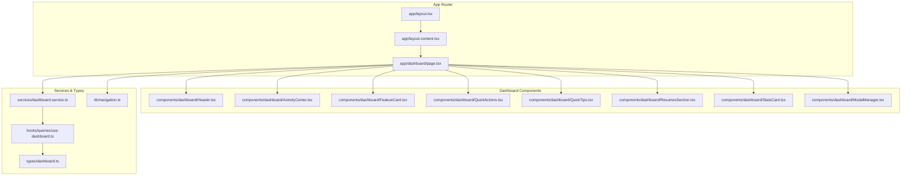
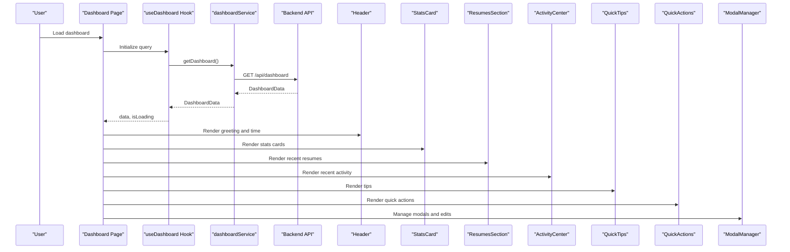
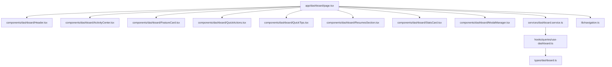

# Dashboard Components

<cite>
**Referenced Files in This Document**
- [Header.tsx](file://frontend/components/dashboard/Header.tsx)
- [ActivityCenter.tsx](file://frontend/components/dashboard/ActivityCenter.tsx)
- [FeatureCard.tsx](file://frontend/components/dashboard/FeatureCard.tsx)
- [QuickActions.tsx](file://frontend/components/dashboard/QuickActions.tsx)
- [QuickTips.tsx](file://frontend/components/dashboard/QuickTips.tsx)
- [ResumesSection.tsx](file://frontend/components/dashboard/ResumesSection.tsx)
- [StatsCard.tsx](file://frontend/components/dashboard/StatsCard.tsx)
- [ModalManager.tsx](file://frontend/components/dashboard/ModalManager.tsx)
- [page.tsx](file://frontend/app/dashboard/page.tsx)
- [use-dashboard.ts](file://frontend/hooks/queries/use-dashboard.ts)
- [dashboard.service.ts](file://frontend/services/dashboard.service.ts)
- [dashboard.ts](file://frontend/types/dashboard.ts)
- [navigation.ts](file://frontend/lib/navigation.ts)
- [layout.tsx](file://frontend/app/layout.tsx)
- [layout-content.tsx](file://frontend/app/layout-content.tsx)
</cite>

## Table of Contents
1. [Introduction](#introduction)
2. [Project Structure](#project-structure)
3. [Core Components](#core-components)
4. [Architecture Overview](#architecture-overview)
5. [Detailed Component Analysis](#detailed-component-analysis)
6. [Dependency Analysis](#dependency-analysis)
7. [Performance Considerations](#performance-considerations)
8. [Troubleshooting Guide](#troubleshooting-guide)
9. [Conclusion](#conclusion)

## Introduction
This document provides comprehensive documentation for dashboard-specific components and layouts in the TalentSync application. It focuses on the Header component for navigation and greeting, ActivityCenter for user activity tracking, FeatureCard for feature presentation, QuickActions for rapid feature access, QuickTips for contextual help, ResumesSection for resume management, and StatsCard for analytics display. It also explains the ModalManager component for modal handling and state management, component composition patterns, data binding, and integration with the dashboard layout system. Examples of component usage, customization options, and responsive design considerations are included to guide both developers and designers.

## Project Structure
The dashboard components reside under the frontend/components/dashboard directory and are integrated into the main dashboard page located at frontend/app/dashboard/page.tsx. They rely on shared UI components from frontend/components/ui, service abstractions in frontend/services, and typed data models in frontend/types. The layout system is provided by the Next.js app router with a root layout and a content wrapper that manages navigation and sidebar behavior.

**Diagram sources**
- [layout.tsx](file://frontend/app/layout.tsx#L23-L51)
- [layout-content.tsx](file://frontend/app/layout-content.tsx#L27-L33)
- [page.tsx](file://frontend/app/dashboard/page.tsx#L89-L135)
- [Header.tsx](file://frontend/components/dashboard/Header.tsx#L12-L57)
- [ActivityCenter.tsx](file://frontend/components/dashboard/ActivityCenter.tsx#L37-L156)
- [FeatureCard.tsx](file://frontend/components/dashboard/FeatureCard.tsx#L36-L101)
- [QuickActions.tsx](file://frontend/components/dashboard/QuickActions.tsx#L8-L32)
- [QuickTips.tsx](file://frontend/components/dashboard/QuickTips.tsx#L22-L89)
- [ResumesSection.tsx](file://frontend/components/dashboard/ResumesSection.tsx#L23-L117)
- [StatsCard.tsx](file://frontend/components/dashboard/StatsCard.tsx#L22-L65)
- [ModalManager.tsx](file://frontend/components/dashboard/ModalManager.tsx#L104-L817)
- [dashboard.service.ts](file://frontend/services/dashboard.service.ts#L4-L7)
- [use-dashboard.ts](file://frontend/hooks/queries/use-dashboard.ts#L4-L12)
- [dashboard.ts](file://frontend/types/dashboard.ts#L33-L38)
- [navigation.ts](file://frontend/lib/navigation.ts#L72-L115)

**Section sources**
- [layout.tsx](file://frontend/app/layout.tsx#L23-L51)
- [layout-content.tsx](file://frontend/app/layout-content.tsx#L27-L33)
- [page.tsx](file://frontend/app/dashboard/page.tsx#L89-L135)

## Core Components
This section introduces each dashboard component, its purpose, props, and typical usage patterns.

- Header: Displays a personalized greeting and current time with animated entrance effects.
- ActivityCenter: Shows recent user activities with live indicators and optional empty-state actions.
- FeatureCard: Presents feature highlights with badges, feature lists, and call-to-action buttons.
- QuickActions: Provides quick-access buttons to frequently used features.
- QuickTips: Delivers contextual tips with gradient backgrounds and color-coded categories.
- ResumesSection: Lists recent resumes with metadata and navigation to analysis pages.
- StatsCard: Visualizes metrics with progress indicators and optional click handlers.
- ModalManager: Centralized modal manager for managing resumes, interviews, and cold mails with editing and deletion workflows.

**Section sources**
- [Header.tsx](file://frontend/components/dashboard/Header.tsx#L12-L57)
- [ActivityCenter.tsx](file://frontend/components/dashboard/ActivityCenter.tsx#L37-L156)
- [FeatureCard.tsx](file://frontend/components/dashboard/FeatureCard.tsx#L36-L101)
- [QuickActions.tsx](file://frontend/components/dashboard/QuickActions.tsx#L8-L32)
- [QuickTips.tsx](file://frontend/components/dashboard/QuickTips.tsx#L22-L89)
- [ResumesSection.tsx](file://frontend/components/dashboard/ResumesSection.tsx#L23-L117)
- [StatsCard.tsx](file://frontend/components/dashboard/StatsCard.tsx#L22-L65)
- [ModalManager.tsx](file://frontend/components/dashboard/ModalManager.tsx#L104-L817)

## Architecture Overview
The dashboard integrates UI components with data fetching and state management. The main dashboard page orchestrates:
- Data fetching via a TanStack Query hook that calls a service abstraction.
- State management for modals and editing/deletion flows.
- Composition of dashboard components with animations and responsive layouts.
- Navigation integration through action items and links.

**Diagram sources**
- [page.tsx](file://frontend/app/dashboard/page.tsx#L123-L126)
- [use-dashboard.ts](file://frontend/hooks/queries/use-dashboard.ts#L4-L12)
- [dashboard.service.ts](file://frontend/services/dashboard.service.ts#L4-L7)
- [dashboard.ts](file://frontend/types/dashboard.ts#L33-L38)
- [Header.tsx](file://frontend/components/dashboard/Header.tsx#L12-L57)
- [StatsCard.tsx](file://frontend/components/dashboard/StatsCard.tsx#L22-L65)
- [ResumesSection.tsx](file://frontend/components/dashboard/ResumesSection.tsx#L23-L117)
- [ActivityCenter.tsx](file://frontend/components/dashboard/ActivityCenter.tsx#L37-L156)
- [QuickTips.tsx](file://frontend/components/dashboard/QuickTips.tsx#L22-L89)
- [QuickActions.tsx](file://frontend/components/dashboard/QuickActions.tsx#L8-L32)
- [ModalManager.tsx](file://frontend/components/dashboard/ModalManager.tsx#L104-L817)

## Detailed Component Analysis

### Header Component
Purpose:
- Display a personalized greeting based on the time of day and show the current time.
- Provide animated entrance effects using Framer Motion.

Props:
- currentTime: string representing the formatted time.
- userName: string for the user's name.

Composition pattern:
- Uses Badge and Clock for time display.
- Uses motion variants for staggered entrance.

Customization options:
- Theme colors via brand classes.
- Typography sizes and gradients for headings.

Responsive considerations:
- Text centering and spacing adapt to screen sizes.

**Section sources**
- [Header.tsx](file://frontend/components/dashboard/Header.tsx#L12-L57)

### ActivityCenter Component
Purpose:
- Present recent user activities with live indicators and empty-state actions.

Props:
- activities: Activity[] array.
- isLoading: boolean flag for loading state.

Composition pattern:
- Uses Card, Badge, Loader, and motion wrappers.
- Renders a list with staggered animations and handles empty state with call-to-action links.

Data binding:
- Maps activity types to icons and displays dates.

Customization options:
- Badge colors and text.
- Empty-state CTA buttons and links.

Responsive considerations:
- Grid and flex layouts adjust for smaller screens.

**Section sources**
- [ActivityCenter.tsx](file://frontend/components/dashboard/ActivityCenter.tsx#L37-L156)
- [dashboard.ts](file://frontend/types/dashboard.ts#L15-L21)

### FeatureCard Component
Purpose:
- Showcase a feature with an icon, title, description, feature list, and a prominent call-to-action button.

Props:
- icon: LucideIcon for the feature.
- title: string for the feature name.
- description: string for the feature description.
- badgeText: string for the badge label.
- features: string[] list of feature bullets.
- buttonText: string for the button text.
- buttonIcon: LucideIcon for the button.
- buttonHref: string for the link destination.
- buttonVariant: "default" | "outline".
- delay: number for animation delay.
- direction: "left" | "right" for slide direction.

Composition pattern:
- Uses Card, Badge, and motion wrappers.
- Button transitions with hover effects.

Customization options:
- Variant styles for button and card.
- Direction and timing of animations.

Responsive considerations:
- Grid layouts and spacing adapt to breakpoints.

**Section sources**
- [FeatureCard.tsx](file://frontend/components/dashboard/FeatureCard.tsx#L36-L101)

### QuickActions Component
Purpose:
- Provide quick-access buttons to frequently used features with animated entrance.

Props:
- None (renders predefined actions).

Composition pattern:
- Uses motion wrappers and Link components.
- Two primary actions with gradient backgrounds and icons.

Customization options:
- Modify action items in navigation utilities.

Responsive considerations:
- Flex wrap ensures proper stacking on small screens.

**Section sources**
- [QuickActions.tsx](file://frontend/components/dashboard/QuickActions.tsx#L8-L32)
- [navigation.ts](file://frontend/lib/navigation.ts#L72-L115)

### QuickTips Component
Purpose:
- Deliver contextual tips with gradient backgrounds and color-coded categories.

Props:
- None (hardcoded tips).

Composition pattern:
- Uses Card and motion wrappers.
- Grid layout for three tip cards with dynamic styling.

Customization options:
- Add or modify tip entries with icon, title, description, and color classes.

Responsive considerations:
- Responsive grid adjusts columns for tablet and desktop.

**Section sources**
- [QuickTips.tsx](file://frontend/components/dashboard/QuickTips.tsx#L22-L89)

### ResumesSection Component
Purpose:
- List recent resumes with metadata and navigation to analysis pages.

Props:
- resumes: Resume[] array.
- onViewAll: () => void callback for viewing all resumes.

Composition pattern:
- Uses Card, Badge, and motion wrappers.
- Truncates long names and shows upload dates and optional fields.

Data binding:
- Maps resume arrays to cards with links to analysis pages.

Customization options:
- Adjust grid columns and card layouts.

Responsive considerations:
- Responsive grid with 1 column on mobile, 2 on tablet, 3 on desktop.

**Section sources**
- [ResumesSection.tsx](file://frontend/components/dashboard/ResumesSection.tsx#L23-L117)
- [dashboard.ts](file://frontend/types/dashboard.ts#L23-L31)

### StatsCard Component
Purpose:
- Visualize metrics with progress indicators and optional click handlers.

Props:
- icon: LucideIcon for the metric.
- title: string for the metric label.
- value: number | string for the displayed value.
- progressValue: number for the progress bar.
- badgeText: string for the badge label.
- badgeIcon: LucideIcon for the badge.
- iconColor: string for the icon container.
- badgeColor: string for the badge.
- onClick?: () => void for card interaction.
- delay: number for animation delay.

Composition pattern:
- Uses Card, Badge, Progress, and motion wrappers.
- Optional click handler enables navigation or modal opening.

Customization options:
- Color classes for icons and badges.
- Click handler for navigation or modal triggers.

Responsive considerations:
- Consistent padding and typography scaling.

**Section sources**
- [StatsCard.tsx](file://frontend/components/dashboard/StatsCard.tsx#L22-L65)

### ModalManager Component
Purpose:
- Centralized modal manager for managing resumes, interviews, and cold mails with editing and deletion workflows.

Props:
- showResumesModal, setShowResumesModal: boolean and setter for resumes modal.
- showInterviewsModal, setShowInterviewsModal: boolean and setter for interviews modal.
- showColdMailsModal, setShowColdMailsModal: boolean and setter for cold mails modal.
- resumes: Resume[] array.
- interviewsData: InterviewSession[] array.
- coldMailsData: ColdMailSession[] array.
- isLoadingData, isLoadingInterviews, isLoadingColdMails: loading flags.
- editingResume, setEditingResume: editing state for resume renaming.
- newResumeName, setNewResumeName: input state for new name.
- deletingResume, setDeletingResume: deletion state for resume.
- deletingInterview, setDeletingInterview: deletion state for interview.
- deletingColdMail, setDeletingColdMail: deletion state for cold mail.
- handleRenameResume, handleDeleteResume, handleDeleteInterview, handleDeleteColdMail: handlers for mutations.
- copyToClipboard: utility for copying text.

Composition pattern:
- Uses AnimatePresence and motion wrappers for modal entrances/exits.
- Manages nested modals and confirmation dialogs.
- Handles editing inputs and mutation callbacks.

Data binding:
- Maps data arrays to modal content with conditional rendering.

Customization options:
- Extend modal content for additional entities.
- Customize confirmation dialogs and actions.

Responsive considerations:
- Scrollable modals with max-height constraints.

**Section sources**
- [ModalManager.tsx](file://frontend/components/dashboard/ModalManager.tsx#L104-L817)
- [dashboard.ts](file://frontend/types/dashboard.ts#L22-L53)

## Dependency Analysis
The dashboard components depend on shared UI primitives, typed data models, and service abstractions. The main dashboard page coordinates data fetching and state management, while components focus on presentation and user interactions.

**Diagram sources**
- [page.tsx](file://frontend/app/dashboard/page.tsx#L89-L135)
- [Header.tsx](file://frontend/components/dashboard/Header.tsx#L12-L57)
- [ActivityCenter.tsx](file://frontend/components/dashboard/ActivityCenter.tsx#L37-L156)
- [FeatureCard.tsx](file://frontend/components/dashboard/FeatureCard.tsx#L36-L101)
- [QuickActions.tsx](file://frontend/components/dashboard/QuickActions.tsx#L8-L32)
- [QuickTips.tsx](file://frontend/components/dashboard/QuickTips.tsx#L22-L89)
- [ResumesSection.tsx](file://frontend/components/dashboard/ResumesSection.tsx#L23-L117)
- [StatsCard.tsx](file://frontend/components/dashboard/StatsCard.tsx#L22-L65)
- [ModalManager.tsx](file://frontend/components/dashboard/ModalManager.tsx#L104-L817)
- [dashboard.ts](file://frontend/types/dashboard.ts#L33-L38)
- [dashboard.service.ts](file://frontend/services/dashboard.service.ts#L4-L7)
- [use-dashboard.ts](file://frontend/hooks/queries/use-dashboard.ts#L4-L12)
- [navigation.ts](file://frontend/lib/navigation.ts#L72-L115)

**Section sources**
- [page.tsx](file://frontend/app/dashboard/page.tsx#L89-L135)
- [dashboard.ts](file://frontend/types/dashboard.ts#L33-L38)
- [dashboard.service.ts](file://frontend/services/dashboard.service.ts#L4-L7)
- [use-dashboard.ts](file://frontend/hooks/queries/use-dashboard.ts#L4-L12)
- [navigation.ts](file://frontend/lib/navigation.ts#L72-L115)

## Performance Considerations
- Lazy loading and virtualization: Consider virtualizing long lists in ActivityCenter and ResumesSection for large datasets.
- Animation costs: Keep motion configurations minimal; avoid heavy transforms on many elements simultaneously.
- Data fetching: Use efficient caching and pagination for activity feeds and resume lists.
- Modal rendering: Unmount modals when closed to reduce DOM overhead.
- Image optimization: Ensure any images used in cards are optimized and lazy-loaded.

## Troubleshooting Guide
Common issues and resolutions:
- Missing session or redirect loop: Verify authentication state and redirects in the dashboard page.
- Empty activity or resume lists: Confirm data fetching hooks and service calls are successful.
- Modal not closing: Ensure event.stopPropagation is used on modal content and close handlers are bound correctly.
- Editing conflicts: Validate that editing state is cleared after successful mutations.
- Clipboard errors: Handle navigator.clipboard rejections gracefully with user feedback.

**Section sources**
- [page.tsx](file://frontend/app/dashboard/page.tsx#L160-L182)
- [ModalManager.tsx](file://frontend/components/dashboard/ModalManager.tsx#L312-L373)
- [ModalManager.tsx](file://frontend/components/dashboard/ModalManager.tsx#L682-L746)

## Conclusion
The dashboard components form a cohesive system that combines data-driven presentation with interactive modals and responsive layouts. By leveraging shared UI primitives, typed data models, and service abstractions, the components maintain consistency and scalability. The main dashboard page orchestrates data fetching, state management, and component composition, enabling a smooth user experience across devices.