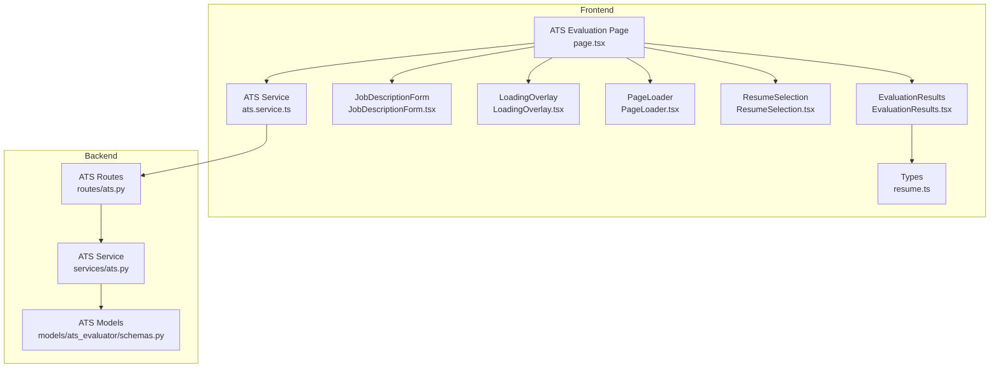
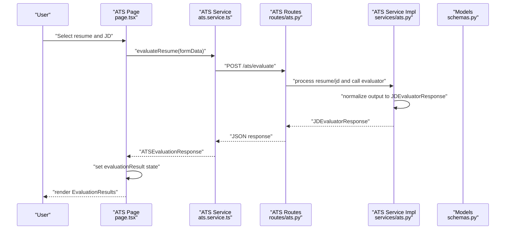
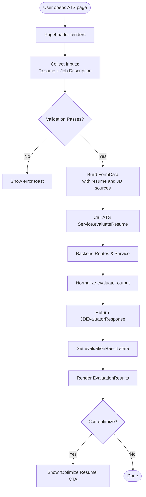
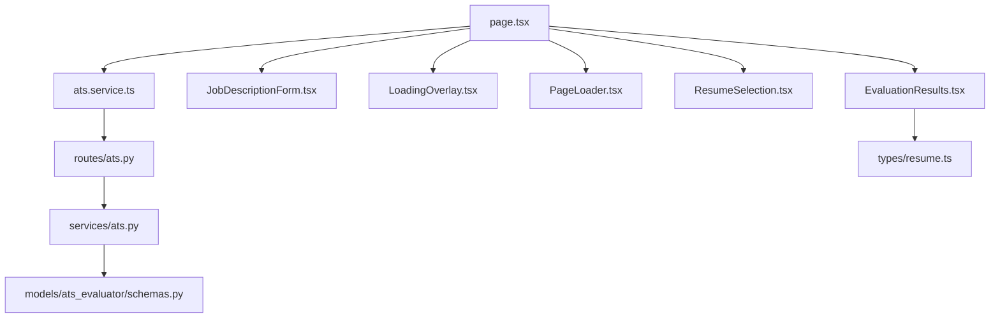

# ATS Evaluation Components

<cite>
**Referenced Files in This Document**
- [EvaluationResults.tsx](file://frontend/components/ats/EvaluationResults.tsx)
- [JobDescriptionForm.tsx](file://frontend/components/ats/JobDescriptionForm.tsx)
- [LoadingOverlay.tsx](file://frontend/components/ats/LoadingOverlay.tsx)
- [PageLoader.tsx](file://frontend/components/ats/PageLoader.tsx)
- [ResumeSelection.tsx](file://frontend/components/ats/ResumeSelection.tsx)
- [ats.service.ts](file://frontend/services/ats.service.ts)
- [page.tsx](file://frontend/app/dashboard/ats/page.tsx)
- [ats.py](file://backend/app/routes/ats.py)
- [ats.py](file://backend/app/services/ats.py)
- [schemas.py](file://backend/app/models/ats_evaluator/schemas.py)
- [resume.ts](file://frontend/types/resume.ts)
</cite>

## Table of Contents
1. [Introduction](#introduction)
2. [Project Structure](#project-structure)
3. [Core Components](#core-components)
4. [Architecture Overview](#architecture-overview)
5. [Detailed Component Analysis](#detailed-component-analysis)
6. [Dependency Analysis](#dependency-analysis)
7. [Performance Considerations](#performance-considerations)
8. [Troubleshooting Guide](#troubleshooting-guide)
9. [Conclusion](#conclusion)

## Introduction
This document provides comprehensive technical documentation for the ATS evaluation components in the TalentSync project. It covers five key frontend components used to evaluate resumes against job descriptions: EvaluationResults for displaying ATS scores and recommendations, JobDescriptionForm for job description input and processing, LoadingOverlay for async operation feedback, PageLoader for page-level loading states, and ResumeSelection for resume file upload and selection. The guide explains component props, state management, data flow from resume analysis to ATS scoring, and integration with backend APIs. It also includes usage examples, error handling patterns, and styling approaches.

## Project Structure
The ATS evaluation feature spans frontend components and backend services:
- Frontend components are located under frontend/components/ats and are orchestrated by the ATS evaluation page.
- Backend routes and services are under backend/app/routes and backend/app/services, with models defined in backend/app/models/ats_evaluator.
- The frontend communicates with the backend via a dedicated ATS service wrapper.

**Diagram sources**
- [page.tsx](file://frontend/app/dashboard/ats/page.tsx#L1-L289)
- [EvaluationResults.tsx](file://frontend/components/ats/EvaluationResults.tsx#L1-L177)
- [JobDescriptionForm.tsx](file://frontend/components/ats/JobDescriptionForm.tsx#L1-L286)
- [LoadingOverlay.tsx](file://frontend/components/ats/LoadingOverlay.tsx#L1-L45)
- [PageLoader.tsx](file://frontend/components/ats/PageLoader.tsx#L1-L23)
- [ResumeSelection.tsx](file://frontend/components/ats/ResumeSelection.tsx#L1-L325)
- [ats.service.ts](file://frontend/services/ats.service.ts#L1-L18)
- [ats.py](file://backend/app/routes/ats.py#L1-L184)
- [ats.py](file://backend/app/services/ats.py#L1-L214)
- [schemas.py](file://backend/app/models/ats_evaluator/schemas.py#L1-L44)
- [resume.ts](file://frontend/types/resume.ts#L81-L90)

**Section sources**
- [page.tsx](file://frontend/app/dashboard/ats/page.tsx#L1-L289)
- [ats.service.ts](file://frontend/services/ats.service.ts#L1-L18)
- [ats.py](file://backend/app/routes/ats.py#L1-L184)
- [ats.py](file://backend/app/services/ats.py#L1-L214)
- [schemas.py](file://backend/app/models/ats_evaluator/schemas.py#L1-L44)
- [resume.ts](file://frontend/types/resume.ts#L81-L90)

## Core Components
This section summarizes the primary components and their responsibilities:
- EvaluationResults: Renders ATS match score, reasons for the score, improvement suggestions, and optional optimization action.
- JobDescriptionForm: Provides three input modes for job descriptions (URL, text, file) with validation and preview.
- LoadingOverlay: Displays a modal overlay during evaluation requests.
- PageLoader: Shows page-level loading indicator on initial render.
- ResumeSelection: Manages resume selection from existing uploads or new file upload with preview and dropdown.

Key props and behaviors:
- Props are passed down from the parent page to each component, enabling centralized state management and controlled updates.
- State transitions are handled locally within components where appropriate, and coordinated via the parent page for cross-component actions.

**Section sources**
- [EvaluationResults.tsx](file://frontend/components/ats/EvaluationResults.tsx#L8-L18)
- [JobDescriptionForm.tsx](file://frontend/components/ats/JobDescriptionForm.tsx#L18-L28)
- [LoadingOverlay.tsx](file://frontend/components/ats/LoadingOverlay.tsx#L6-L8)
- [PageLoader.tsx](file://frontend/components/ats/PageLoader.tsx#L6-L8)
- [ResumeSelection.tsx](file://frontend/components/ats/ResumeSelection.tsx#L24-L37)

## Architecture Overview
The ATS evaluation workflow integrates frontend components with backend services:
- The frontend page orchestrates user input collection, validates selections, and triggers evaluation.
- The ATS service sends multipart/form-data to the backend, including resume and job description sources.
- Backend routes parse the form, process documents, and delegate evaluation to the ATS service.
- The service normalizes evaluator output into a standardized response model and returns it to the frontend.

**Diagram sources**
- [page.tsx](file://frontend/app/dashboard/ats/page.tsx#L60-L138)
- [ats.service.ts](file://frontend/services/ats.service.ts#L12-L17)
- [ats.py](file://backend/app/routes/ats.py#L50-L131)
- [ats.py](file://backend/app/services/ats.py#L22-L214)
- [schemas.py](file://backend/app/models/ats_evaluator/schemas.py#L33-L44)

## Detailed Component Analysis

### EvaluationResults Component
Purpose:
- Displays ATS match score, contextual reasons, improvement suggestions, and an optional optimization call-to-action.

Props:
- evaluationResult: Object containing score, reasons_for_the_score, and suggestions; can be null.
- onOptimize: Callback invoked when the user clicks the optimization button.
- canOptimize: Boolean flag controlling whether the optimization CTA is shown.

State and rendering:
- Renders a neutral state when no evaluationResult is present.
- On evaluation completion, renders a score display with animated progress bar and color-coded labels.
- Lists reasons and suggestions with staggered animations.
- Conditionally renders the optimization button based on canOptimize and onOptimize presence.

Styling and UX:
- Uses gradient backgrounds, backdrop blur, and subtle borders for depth.
- Animations leverage Framer Motion for smooth transitions and entrance effects.

Usage example:
- Rendered by the parent page after receiving evaluation results from the service.

**Section sources**
- [EvaluationResults.tsx](file://frontend/components/ats/EvaluationResults.tsx#L8-L18)
- [EvaluationResults.tsx](file://frontend/components/ats/EvaluationResults.tsx#L20-L177)

### JobDescriptionForm Component
Purpose:
- Accepts job description via URL, raw text, or file upload with validation and preview.

Props:
- formData: Object holding jd_text, jd_link, company_name, company_website.
- handleInputChange: Function to update formData fields.
- jdFile: Current selected file for JD.
- setJdFile: Function to set the selected JD file.

Modes and validation:
- Three modes: URL, text, file. Only one mode is active at a time.
- Clears conflicting fields when switching modes to avoid ambiguous submissions.
- Supports drag-and-drop for file uploads with visual feedback.

Rendering:
- Company name and website fields are optional.
- Animated transitions between modes using AnimatePresence and motion wrappers.
- File mode displays a preview of the selected file and supported extensions.

Usage example:
- Integrated into the parent page’s input form and validated before submission.

**Section sources**
- [JobDescriptionForm.tsx](file://frontend/components/ats/JobDescriptionForm.tsx#L18-L28)
- [JobDescriptionForm.tsx](file://frontend/components/ats/JobDescriptionForm.tsx#L32-L286)

### LoadingOverlay Component
Purpose:
- Provides a modal overlay indicating ongoing evaluation.

Props:
- isEvaluating: Boolean flag controlling visibility.

Behavior:
- Renders only when isEvaluating is true.
- Uses motion transitions for fade-in/fade-out and scaling effects.
- Includes a pulsing loader and descriptive text.

Usage example:
- Controlled by the parent page’s mutation state and displayed during evaluation requests.

**Section sources**
- [LoadingOverlay.tsx](file://frontend/components/ats/LoadingOverlay.tsx#L6-L8)
- [LoadingOverlay.tsx](file://frontend/components/ats/LoadingOverlay.tsx#L10-L45)

### PageLoader Component
Purpose:
- Shows a page-level loading indicator on initial render.

Props:
- isPageLoading: Boolean flag controlling visibility.

Behavior:
- Renders only when isPageLoading is true.
- Centers a loader with optional text and exits with animation when disabled.

Usage example:
- Used by the parent page to mask initial load until ready.

**Section sources**
- [PageLoader.tsx](file://frontend/components/ats/PageLoader.tsx#L6-L8)
- [PageLoader.tsx](file://frontend/components/ats/PageLoader.tsx#L10-L23)

### ResumeSelection Component
Purpose:
- Allows users to choose a resume from existing uploads or upload a new file.

Props:
- resumeSelectionMode: "existing" or "upload".
- setResumeSelectionMode: Switches between modes.
- userResumes: Array of UserResume objects for selection.
- selectedResumeId: Currently selected resume ID.
- setSelectedResumeId: Updates the selected resume.
- isLoadingResumes: Indicates loading state of resume list.
- showResumeDropdown: Controls dropdown visibility.
- setShowResumeDropdown: Toggles dropdown.
- resumeFile: Currently selected file for upload.
- setResumeFile: Sets the selected file.
- resumeText: Preview text for the selected file.

Behavior:
- Mode toggle switches between existing and upload modes.
- Existing mode shows a dropdown with resume cards, including metadata and upload date.
- Upload mode supports file selection with preview and extension hints.
- For text/markdown files, reads file content to provide a short preview.

Usage example:
- Integrated into the parent page’s input form and validated alongside job description inputs.

**Section sources**
- [ResumeSelection.tsx](file://frontend/components/ats/ResumeSelection.tsx#L24-L37)
- [ResumeSelection.tsx](file://frontend/components/ats/ResumeSelection.tsx#L39-L325)
- [resume.ts](file://frontend/types/resume.ts#L81-L90)

## Architecture Overview

### Data Flow from Input to Results
The end-to-end flow from user input to evaluation results:

**Diagram sources**
- [page.tsx](file://frontend/app/dashboard/ats/page.tsx#L60-L138)
- [ats.service.ts](file://frontend/services/ats.service.ts#L12-L17)
- [ats.py](file://backend/app/routes/ats.py#L50-L131)
- [ats.py](file://backend/app/services/ats.py#L22-L214)
- [schemas.py](file://backend/app/models/ats_evaluator/schemas.py#L33-L44)

### Backend API Contracts
Backend expects either:
- Form fields: resume_text, jd_text, jd_link, company_name, company_website.
- Or multipart/form-data with resume_file and optional jd_file/jd_text/jd_link.

Validation ensures exactly one job description source is provided. Responses conform to JDEvaluatorResponse.

**Section sources**
- [ats.py](file://backend/app/routes/ats.py#L22-L47)
- [ats.py](file://backend/app/routes/ats.py#L50-L131)
- [ats.py](file://backend/app/routes/ats.py#L133-L184)
- [schemas.py](file://backend/app/models/ats_evaluator/schemas.py#L33-L44)

## Dependency Analysis
Component and module dependencies:
- Parent page depends on all ATS components and the ATS service.
- ATS service depends on the API client and defines the evaluation response shape.
- Backend routes depend on the ATS service and models; the service depends on the evaluator and normalization logic.

**Diagram sources**
- [page.tsx](file://frontend/app/dashboard/ats/page.tsx#L1-L289)
- [EvaluationResults.tsx](file://frontend/components/ats/EvaluationResults.tsx#L1-L177)
- [JobDescriptionForm.tsx](file://frontend/components/ats/JobDescriptionForm.tsx#L1-L286)
- [LoadingOverlay.tsx](file://frontend/components/ats/LoadingOverlay.tsx#L1-L45)
- [PageLoader.tsx](file://frontend/components/ats/PageLoader.tsx#L1-L23)
- [ResumeSelection.tsx](file://frontend/components/ats/ResumeSelection.tsx#L1-L325)
- [ats.service.ts](file://frontend/services/ats.service.ts#L1-L18)
- [ats.py](file://backend/app/routes/ats.py#L1-L184)
- [ats.py](file://backend/app/services/ats.py#L1-L214)
- [schemas.py](file://backend/app/models/ats_evaluator/schemas.py#L1-L44)
- [resume.ts](file://frontend/types/resume.ts#L81-L90)

**Section sources**
- [page.tsx](file://frontend/app/dashboard/ats/page.tsx#L1-L289)
- [ats.service.ts](file://frontend/services/ats.service.ts#L1-L18)
- [ats.py](file://backend/app/routes/ats.py#L1-L184)
- [ats.py](file://backend/app/services/ats.py#L1-L214)
- [schemas.py](file://backend/app/models/ats_evaluator/schemas.py#L1-L44)
- [resume.ts](file://frontend/types/resume.ts#L81-L90)

## Performance Considerations
- Minimize re-renders by consolidating state in the parent page and passing only necessary props to child components.
- Use controlled components for inputs to avoid unnecessary updates.
- Debounce or throttle file previews for large documents to reduce UI jank.
- Prefer lazy-loading heavy animations and only mount overlays when needed.
- Cache processed resume and JD text when possible to avoid repeated parsing.

## Troubleshooting Guide
Common issues and resolutions:
- Missing inputs: Validation prevents evaluation without a resume and a valid job description source. Ensure at least one of resumeId or resume file is selected and one of jd_text, jd_link, or jd_file is provided.
- Unsupported file types: Backend rejects JD files with unsupported extensions. Ensure JD files are PDF, DOC, DOCX, TXT, or MD.
- Network errors: The service handles generic failures and returns descriptive messages. Inspect toast notifications and backend logs for details.
- Empty or invalid evaluator output: The backend normalizes evaluator output and defaults missing fields; ensure the evaluator returns a valid JSON structure.

Error handling patterns:
- Frontend: Uses toasts for user-friendly error messages and disables the evaluate button during requests.
- Backend: Validates inputs, raises HTTP exceptions with clear messages, and logs detailed context for debugging.

**Section sources**
- [page.tsx](file://frontend/app/dashboard/ats/page.tsx#L60-L138)
- [ats.py](file://backend/app/routes/ats.py#L80-L95)
- [ats.py](file://backend/app/routes/ats.py#L157-L174)
- [ats.py](file://backend/app/services/ats.py#L193-L214)

## Conclusion
The ATS evaluation components provide a cohesive, user-friendly workflow for analyzing resume-job description alignment. The frontend components encapsulate input collection, feedback, and result presentation, while the backend enforces validation, processes documents, and returns standardized results. By following the documented props, state management patterns, and integration points, developers can extend or customize the feature with confidence.