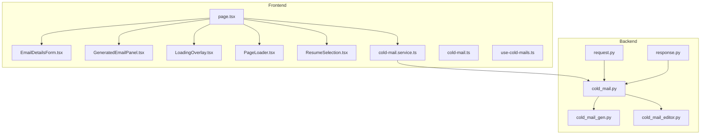
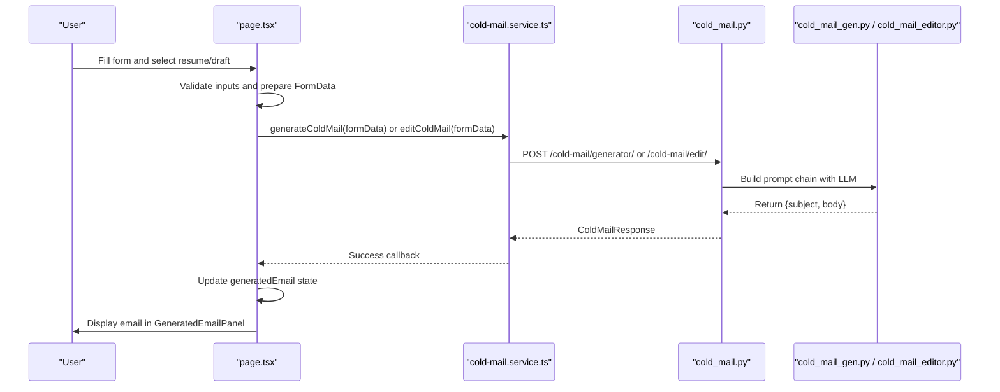
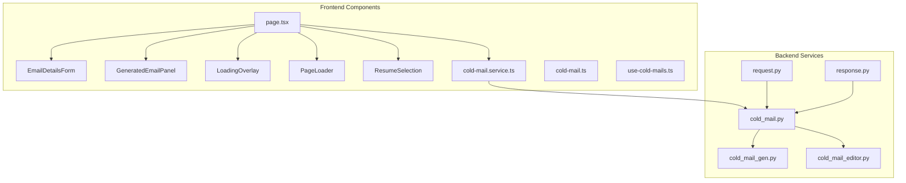
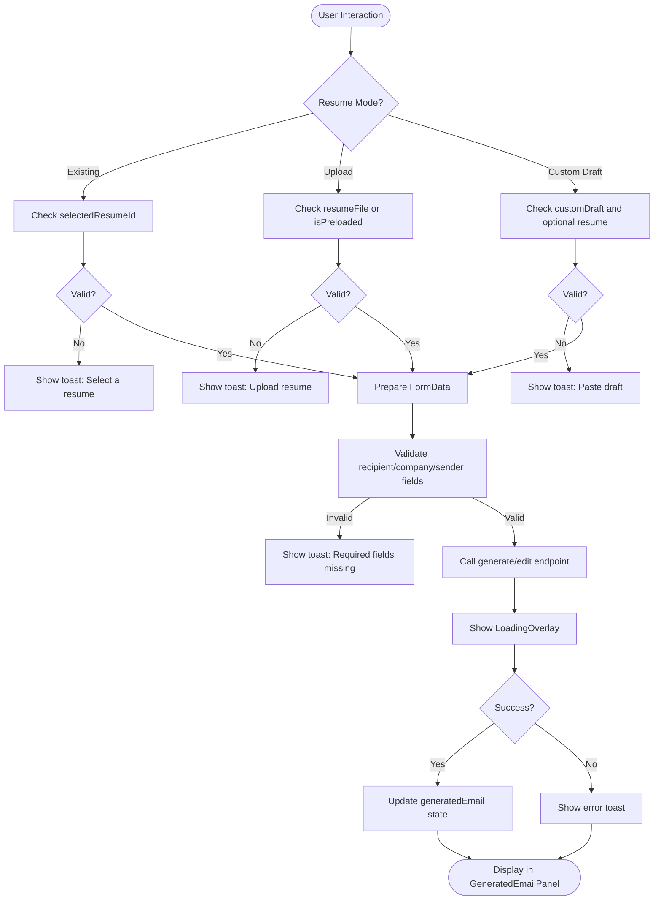
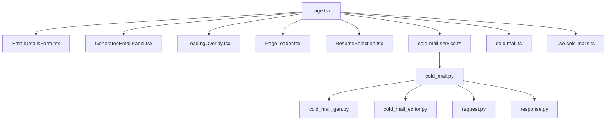

# Cold Mail Generation Components

<cite>
**Referenced Files in This Document**
- [EmailDetailsForm.tsx](file://frontend/components/cold-mail/EmailDetailsForm.tsx)
- [GeneratedEmailPanel.tsx](file://frontend/components/cold-mail/GeneratedEmailPanel.tsx)
- [LoadingOverlay.tsx](file://frontend/components/cold-mail/LoadingOverlay.tsx)
- [PageLoader.tsx](file://frontend/components/cold-mail/PageLoader.tsx)
- [ResumeSelection.tsx](file://frontend/components/cold-mail/ResumeSelection.tsx)
- [page.tsx](file://frontend/app/dashboard/cold-mail/page.tsx)
- [cold-mail.service.ts](file://frontend/services/cold-mail.service.ts)
- [cold-mail.ts](file://frontend/types/cold-mail.ts)
- [use-cold-mails.ts](file://frontend/hooks/queries/use-cold-mails.ts)
- [cold_mail.py](file://backend/app/routes/cold_mail.py)
- [request.py](file://backend/app/models/cold_mail/request.py)
- [response.py](file://backend/app/models/cold_mail/response.py)
- [cold_mail_gen.py](file://backend/app/data/prompt/cold_mail_gen.py)
- [cold_mail_editor.py](file://backend/app/data/prompt/cold_mail_editor.py)
</cite>

## Table of Contents
1. [Introduction](#introduction)
2. [Project Structure](#project-structure)
3. [Core Components](#core-components)
4. [Architecture Overview](#architecture-overview)
5. [Detailed Component Analysis](#detailed-component-analysis)
6. [Dependency Analysis](#dependency-analysis)
7. [Performance Considerations](#performance-considerations)
8. [Troubleshooting Guide](#troubleshooting-guide)
9. [Conclusion](#conclusion)

## Introduction
This document provides comprehensive documentation for the cold mail generation system, focusing on the frontend components responsible for capturing user input, generating personalized emails, and managing user feedback during asynchronous operations. It explains the email generation workflow, template system, personalization logic, and integration with backend cold mail APIs. Additionally, it covers form validation, email preview functionality, and export/download capabilities.

## Project Structure
The cold mail generation feature spans both frontend and backend components:
- Frontend: React components for capturing user input, displaying generated emails, and managing loading states
- Backend: FastAPI routes and services orchestrating LLM-based email generation and editing
- Shared: TypeScript types and service abstractions for API communication

**Diagram sources**
- [page.tsx](file://frontend/app/dashboard/cold-mail/page.tsx#L1-L736)
- [EmailDetailsForm.tsx](file://frontend/components/cold-mail/EmailDetailsForm.tsx#L1-L150)
- [GeneratedEmailPanel.tsx](file://frontend/components/cold-mail/GeneratedEmailPanel.tsx#L1-L190)
- [LoadingOverlay.tsx](file://frontend/components/cold-mail/LoadingOverlay.tsx#L1-L63)
- [PageLoader.tsx](file://frontend/components/cold-mail/PageLoader.tsx#L1-L23)
- [ResumeSelection.tsx](file://frontend/components/cold-mail/ResumeSelection.tsx#L1-L697)
- [cold-mail.service.ts](file://frontend/services/cold-mail.service.ts#L1-L37)
- [cold-mail.ts](file://frontend/types/cold-mail.ts#L1-L45)
- [use-cold-mails.ts](file://frontend/hooks/queries/use-cold-mails.ts#L1-L60)
- [cold_mail.py](file://backend/app/routes/cold_mail.py#L1-L150)
- [request.py](file://backend/app/models/cold_mail/request.py#L1-L44)
- [response.py](file://backend/app/models/cold_mail/response.py#L1-L10)
- [cold_mail_gen.py](file://backend/app/data/prompt/cold_mail_gen.py#L1-L118)
- [cold_mail_editor.py](file://backend/app/data/prompt/cold_mail_editor.py#L1-L137)

**Section sources**
- [page.tsx](file://frontend/app/dashboard/cold-mail/page.tsx#L1-L736)
- [cold_mail.py](file://backend/app/routes/cold_mail.py#L1-L150)

## Core Components
This section outlines the primary components involved in the cold mail generation workflow:

- EmailDetailsForm: Captures recipient and context information including name, designation, company, sender details, goals, website, key points to highlight, and additional context.
- GeneratedEmailPanel: Displays the generated email subject and body, supports editing mode with instructions, copying to clipboard, and downloading as text.
- LoadingOverlay: Provides modal feedback during generation and editing operations with customizable titles and descriptions.
- PageLoader: Shows a page-level loader during initial load.
- ResumeSelection: Manages three modes—existing resume, uploaded resume, and custom draft editing—along with file previews and optional resume enhancement.
- Service Layer: cold-mail.service.ts encapsulates API calls for retrieving user resumes, generating cold mails, and editing existing emails.
- Types: Defines request/response shapes for cold mail operations.
- Backend Routes: FastAPI endpoints for cold mail generation and editing, supporting both file-based and text-based inputs.

**Section sources**
- [EmailDetailsForm.tsx](file://frontend/components/cold-mail/EmailDetailsForm.tsx#L1-L150)
- [GeneratedEmailPanel.tsx](file://frontend/components/cold-mail/GeneratedEmailPanel.tsx#L1-L190)
- [LoadingOverlay.tsx](file://frontend/components/cold-mail/LoadingOverlay.tsx#L1-L63)
- [PageLoader.tsx](file://frontend/components/cold-mail/PageLoader.tsx#L1-L23)
- [ResumeSelection.tsx](file://frontend/components/cold-mail/ResumeSelection.tsx#L1-L697)
- [cold-mail.service.ts](file://frontend/services/cold-mail.service.ts#L1-L37)
- [cold-mail.ts](file://frontend/types/cold-mail.ts#L1-L45)
- [cold_mail.py](file://backend/app/routes/cold_mail.py#L1-L150)

## Architecture Overview
The system follows a React-based frontend with a modular component architecture and integrates with backend FastAPI endpoints. The workflow supports three input modes: existing resume, uploaded resume, and custom draft editing. The backend applies structured prompts to generate or refine cold emails using an LLM pipeline.

**Diagram sources**
- [page.tsx](file://frontend/app/dashboard/cold-mail/page.tsx#L136-L293)
- [cold-mail.service.ts](file://frontend/services/cold-mail.service.ts#L25-L35)
- [cold_mail.py](file://backend/app/routes/cold_mail.py#L13-L78)
- [cold_mail_gen.py](file://backend/app/data/prompt/cold_mail_gen.py#L1-L118)
- [cold_mail_editor.py](file://backend/app/data/prompt/cold_mail_editor.py#L1-L137)

## Detailed Component Analysis

### EmailDetailsForm
Purpose:
- Collects recipient information (name, designation), company details, sender identity, goals, optional website, and contextual content for personalization.

Key behaviors:
- Two-column layout for compact desktop/mobile layouts.
- Controlled inputs bound to parent state via handleInputChange.
- Uses accessible labels and placeholders aligned with brand styling.

Validation and UX:
- Required fields enforced at generation time in the parent page component.
- Optional fields allow flexible customization.

Accessibility and styling:
- Consistent use of shared UI primitives for labels and inputs.
- Focus states and transitions for improved interaction feedback.

**Section sources**
- [EmailDetailsForm.tsx](file://frontend/components/cold-mail/EmailDetailsForm.tsx#L1-L150)
- [page.tsx](file://frontend/app/dashboard/cold-mail/page.tsx#L132-L134)

### GeneratedEmailPanel
Purpose:
- Displays the generated email with subject and body, supports editing mode, copy-to-clipboard, and text download.

Key behaviors:
- Edit mode toggles a panel with instructions textarea and apply button.
- Uses MarkdownRenderer for rendering email body content.
- Provides action buttons for editing, copying, and downloading.

User feedback:
- Loading states synchronized with mutation status.
- Disabled states during editing to prevent concurrent operations.

Export/download:
- Copies a formatted subject/body string to clipboard.
- Downloads a .txt file containing subject and body.

**Section sources**
- [GeneratedEmailPanel.tsx](file://frontend/components/cold-mail/GeneratedEmailPanel.tsx#L1-L190)
- [page.tsx](file://frontend/app/dashboard/cold-mail/page.tsx#L295-L324)

### LoadingOverlay
Purpose:
- Modal overlay indicating ongoing generation or editing operations with animated loader and customizable messages.

Behavior:
- Conditionally renders based on isGenerating/isEditing flags.
- Dynamically sets title and description depending on operation type.

Styling:
- Uses motion animations for entrance/exit and a pulsing dot indicator.

**Section sources**
- [LoadingOverlay.tsx](file://frontend/components/cold-mail/LoadingOverlay.tsx#L1-L63)
- [page.tsx](file://frontend/app/dashboard/cold-mail/page.tsx#L507-L508)

### PageLoader
Purpose:
- Page-level loader shown during initial component mount.

Behavior:
- Simple overlay with spinner and text until initial load completes.

**Section sources**
- [PageLoader.tsx](file://frontend/components/cold-mail/PageLoader.tsx#L1-L23)
- [page.tsx](file://frontend/app/dashboard/cold-mail/page.tsx#L24-L85)

### ResumeSelection
Purpose:
- Manages three input modes:
  - Existing resume: Select from user's saved resumes with auto-fill of candidate name and predicted field.
  - Upload new resume: File picker with preview and accepted formats.
  - Custom draft: Paste draft and edit instructions, optionally enhance with resume context.

Key behaviors:
- Dynamic mode switching with visual toggle.
- Dropdown selection with resume metadata and upload date.
- File preview for uploaded resumes.
- Optional resume selection for draft editing.

Validation:
- Enforces required selections per mode in the parent page component.

**Section sources**
- [ResumeSelection.tsx](file://frontend/components/cold-mail/ResumeSelection.tsx#L1-L697)
- [page.tsx](file://frontend/app/dashboard/cold-mail/page.tsx#L35-L81)

### Service Layer and Types
Purpose:
- Encapsulate API interactions and define request/response contracts.

cold-mail.service.ts:
- Exposes methods for retrieving user resumes, generating cold mails, and editing existing emails.
- Uses FormData for multipart requests supporting files and form fields.

Types:
- ColdMailRequest defines required and optional fields for generation/editing.
- ColdMailResponseData standardizes returned subject/body plus optional identifiers.

**Section sources**
- [cold-mail.service.ts](file://frontend/services/cold-mail.service.ts#L1-L37)
- [cold-mail.ts](file://frontend/types/cold-mail.ts#L1-L45)

### Backend Integration
Purpose:
- Orchestrate LLM-based cold mail generation and editing via FastAPI endpoints.

cold_mail.py:
- File-based endpoints for generation and editing accept resume files and form fields.
- Text-based endpoints accept resume text and form fields for alternate workflows.

Prompt Templates:
- cold_mail_gen.py: Structured prompt with example, candidate resume, email details, and formatting instructions.
- cold_mail_editor.py: Similar structure but includes previous email and explicit edit instructions.

Models:
- request.py: Pydantic model validating required fields and optional company URL.
- response.py: Standardized response model with success flag, message, subject, and body.

**Section sources**
- [cold_mail.py](file://backend/app/routes/cold_mail.py#L1-L150)
- [cold_mail_gen.py](file://backend/app/data/prompt/cold_mail_gen.py#L1-L118)
- [cold_mail_editor.py](file://backend/app/data/prompt/cold_mail_editor.py#L1-L137)
- [request.py](file://backend/app/models/cold_mail/request.py#L1-L44)
- [response.py](file://backend/app/models/cold_mail/response.py#L1-L10)

## Architecture Overview

**Diagram sources**
- [page.tsx](file://frontend/app/dashboard/cold-mail/page.tsx#L1-L736)
- [EmailDetailsForm.tsx](file://frontend/components/cold-mail/EmailDetailsForm.tsx#L1-L150)
- [GeneratedEmailPanel.tsx](file://frontend/components/cold-mail/GeneratedEmailPanel.tsx#L1-L190)
- [LoadingOverlay.tsx](file://frontend/components/cold-mail/LoadingOverlay.tsx#L1-L63)
- [PageLoader.tsx](file://frontend/components/cold-mail/PageLoader.tsx#L1-L23)
- [ResumeSelection.tsx](file://frontend/components/cold-mail/ResumeSelection.tsx#L1-L697)
- [cold-mail.service.ts](file://frontend/services/cold-mail.service.ts#L1-L37)
- [cold-mail.ts](file://frontend/types/cold-mail.ts#L1-L45)
- [use-cold-mails.ts](file://frontend/hooks/queries/use-cold-mails.ts#L1-L60)
- [cold_mail.py](file://backend/app/routes/cold_mail.py#L1-L150)
- [cold_mail_gen.py](file://backend/app/data/prompt/cold_mail_gen.py#L1-L118)
- [cold_mail_editor.py](file://backend/app/data/prompt/cold_mail_editor.py#L1-L137)
- [request.py](file://backend/app/models/cold_mail/request.py#L1-L44)
- [response.py](file://backend/app/models/cold_mail/response.py#L1-L10)

## Detailed Component Analysis

### Email Generation Workflow
The workflow begins with user input capture, followed by validation and preparation of FormData. Depending on the selected mode, either the generation or editing endpoint is invoked. The backend applies a structured prompt to produce a personalized email, returning subject and body.

**Diagram sources**
- [page.tsx](file://frontend/app/dashboard/cold-mail/page.tsx#L136-L293)
- [LoadingOverlay.tsx](file://frontend/components/cold-mail/LoadingOverlay.tsx#L1-L63)
- [GeneratedEmailPanel.tsx](file://frontend/components/cold-mail/GeneratedEmailPanel.tsx#L1-L190)

**Section sources**
- [page.tsx](file://frontend/app/dashboard/cold-mail/page.tsx#L136-L293)
- [LoadingOverlay.tsx](file://frontend/components/cold-mail/LoadingOverlay.tsx#L1-L63)
- [GeneratedEmailPanel.tsx](file://frontend/components/cold-mail/GeneratedEmailPanel.tsx#L1-L190)

### Template System and Personalization Logic
The backend employs structured prompt templates to guide LLM behavior:
- cold_mail_gen.py: Includes an example email, candidate resume, recipient details, key points, additional context, and company insights. Enforces word limits, paragraph structure, tone, and formatting.
- cold_mail_editor.py: Builds upon an existing email and strict edit instructions to refine content while preserving personalization.

Personalization factors:
- Recipient name/designation, company name, sender name, and role/goal.
- Key points to highlight and additional context.
- Optional company URL for research insights.

**Section sources**
- [cold_mail_gen.py](file://backend/app/data/prompt/cold_mail_gen.py#L1-L118)
- [cold_mail_editor.py](file://backend/app/data/prompt/cold_mail_editor.py#L1-L137)
- [request.py](file://backend/app/models/cold_mail/request.py#L1-L44)

### Integration with Backend Cold Mail APIs
Frontend service methods:
- getColdMails: Retrieve user cold mail sessions.
- getUserResumes: Fetch user resumes for selection.
- generateColdMail: Submit FormData for cold mail generation.
- editColdMail: Submit FormData for editing an existing email.

Backend endpoints:
- File-based generation and editing accept resume files and form fields.
- Text-based variants accept resume text and form fields for alternate workflows.

Type safety:
- ColdMailRequest enforces required fields and optional company URL.
- ColdMailResponseData standardizes returned subject/body.

**Section sources**
- [cold-mail.service.ts](file://frontend/services/cold-mail.service.ts#L1-L37)
- [cold_mail.py](file://backend/app/routes/cold_mail.py#L1-L150)
- [cold-mail.ts](file://frontend/types/cold-mail.ts#L1-L45)
- [request.py](file://backend/app/models/cold_mail/request.py#L1-L44)
- [response.py](file://backend/app/models/cold_mail/response.py#L1-L10)

### Form Validation and User Feedback
Validation logic:
- Generates appropriate toasts for missing required fields in each mode.
- Disables the generate button when inputs are invalid.
- Ensures resume selection or upload is present when required.

User feedback:
- Toast notifications for success/error states.
- Loading overlays during generation/editing.
- Page-level loader on initial mount.

**Section sources**
- [page.tsx](file://frontend/app/dashboard/cold-mail/page.tsx#L136-L293)
- [LoadingOverlay.tsx](file://frontend/components/cold-mail/LoadingOverlay.tsx#L1-L63)
- [PageLoader.tsx](file://frontend/components/cold-mail/PageLoader.tsx#L1-L23)

### Email Preview and Export/Download
Preview:
- MarkdownRenderer renders email body content with appropriate styling.
- Sticky panel layout ensures visibility during scrolling.

Export/Download:
- Copy to clipboard: Formats subject and body into a single string.
- Download as text: Creates a Blob and triggers a download link.

**Section sources**
- [GeneratedEmailPanel.tsx](file://frontend/components/cold-mail/GeneratedEmailPanel.tsx#L1-L190)
- [page.tsx](file://frontend/app/dashboard/cold-mail/page.tsx#L295-L324)

## Dependency Analysis

**Diagram sources**
- [page.tsx](file://frontend/app/dashboard/cold-mail/page.tsx#L1-L736)
- [EmailDetailsForm.tsx](file://frontend/components/cold-mail/EmailDetailsForm.tsx#L1-L150)
- [GeneratedEmailPanel.tsx](file://frontend/components/cold-mail/GeneratedEmailPanel.tsx#L1-L190)
- [LoadingOverlay.tsx](file://frontend/components/cold-mail/LoadingOverlay.tsx#L1-L63)
- [PageLoader.tsx](file://frontend/components/cold-mail/PageLoader.tsx#L1-L23)
- [ResumeSelection.tsx](file://frontend/components/cold-mail/ResumeSelection.tsx#L1-L697)
- [cold-mail.service.ts](file://frontend/services/cold-mail.service.ts#L1-L37)
- [cold_mail.py](file://backend/app/routes/cold_mail.py#L1-L150)
- [cold_mail_gen.py](file://backend/app/data/prompt/cold_mail_gen.py#L1-L118)
- [cold_mail_editor.py](file://backend/app/data/prompt/cold_mail_editor.py#L1-L137)
- [request.py](file://backend/app/models/cold_mail/request.py#L1-L44)
- [response.py](file://backend/app/models/cold_mail/response.py#L1-L10)
- [cold-mail.ts](file://frontend/types/cold-mail.ts#L1-L45)
- [use-cold-mails.ts](file://frontend/hooks/queries/use-cold-mails.ts#L1-L60)

**Section sources**
- [page.tsx](file://frontend/app/dashboard/cold-mail/page.tsx#L1-L736)
- [cold_mail.py](file://backend/app/routes/cold_mail.py#L1-L150)

## Performance Considerations
- Asynchronous operations: Use of mutations and loaders prevents blocking the UI during generation/editing.
- Conditional rendering: Overlays and panels only render when needed, minimizing unnecessary DOM updates.
- File handling: Preview logic reads small portions of text files to avoid heavy computations.
- Toast notifications: Centralized error/success messaging avoids repeated error handling logic.

## Troubleshooting Guide
Common issues and resolutions:
- Missing required fields: Ensure recipient name, company name, and sender name are filled before generation.
- Resume selection problems: Select an existing resume or upload a valid file; pre-loaded files require re-upload if needed.
- Edit failures: Provide clear edit instructions and ensure an email exists to edit.
- Clipboard errors: Some browsers restrict clipboard access; fall back to manual copy or download.
- Network errors: Inspect service method responses and ensure backend endpoints are reachable.

**Section sources**
- [page.tsx](file://frontend/app/dashboard/cold-mail/page.tsx#L136-L293)
- [GeneratedEmailPanel.tsx](file://frontend/components/cold-mail/GeneratedEmailPanel.tsx#L1-L190)

## Conclusion
The cold mail generation system combines a user-friendly frontend with robust backend orchestration to deliver personalized cold emails. The modular component design, clear validation, and comprehensive user feedback mechanisms ensure a smooth user experience. The structured prompt templates and typed request/response models provide reliability and maintainability across the entire workflow.