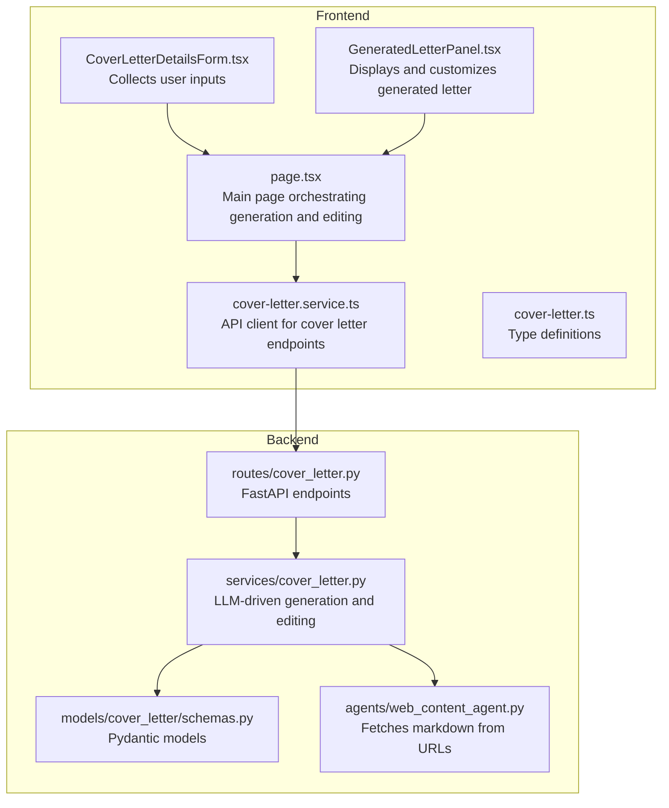
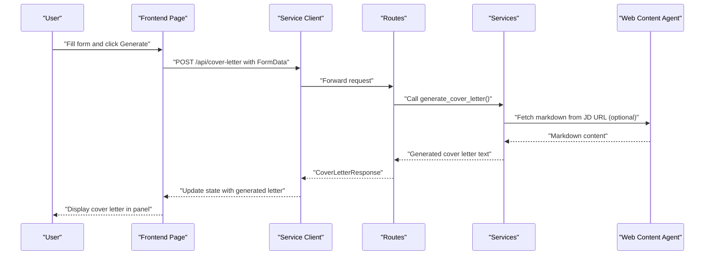
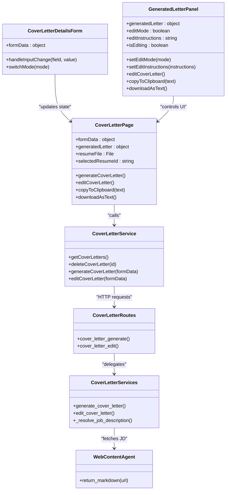
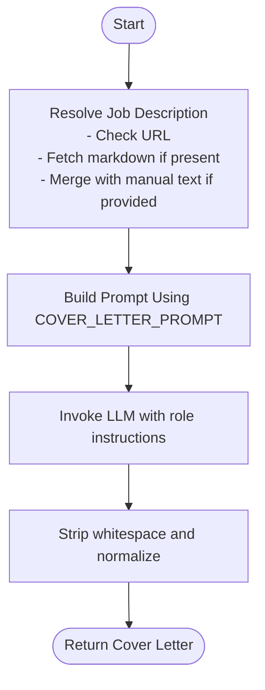
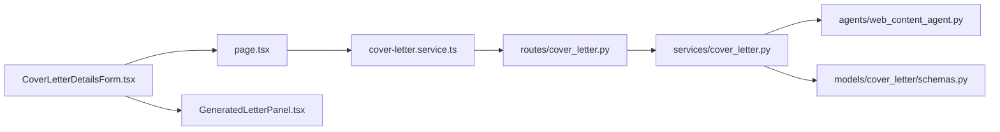

# Cover Letter Generation Components

<cite>
**Referenced Files in This Document**
- [CoverLetterDetailsForm.tsx](file://frontend/components/cover-letter/CoverLetterDetailsForm.tsx)
- [GeneratedLetterPanel.tsx](file://frontend/components/cover-letter/GeneratedLetterPanel.tsx)
- [cover-letter.service.ts](file://frontend/services/cover-letter.service.ts)
- [page.tsx](file://frontend/app/dashboard/cover-letter/page.tsx)
- [cover_letter.py](file://backend/app/routes/cover_letter.py)
- [cover_letter.py](file://backend/app/services/cover_letter.py)
- [schemas.py](file://backend/app/models/cover_letter/schemas.py)
- [cover-letter.ts](file://frontend/types/cover-letter.ts)
- [web_content_agent.py](file://backend/app/agents/web_content_agent.py)
</cite>

## Table of Contents
1. [Introduction](#introduction)
2. [Project Structure](#project-structure)
3. [Core Components](#core-components)
4. [Architecture Overview](#architecture-overview)
5. [Detailed Component Analysis](#detailed-component-analysis)
6. [Dependency Analysis](#dependency-analysis)
7. [Performance Considerations](#performance-considerations)
8. [Troubleshooting Guide](#troubleshooting-guide)
9. [Conclusion](#conclusion)

## Introduction
This document provides comprehensive documentation for the cover letter generation system, focusing on two primary frontend components and their backend integration. It explains how users input job details and personal information, how the system generates and customizes cover letters, and how it integrates with job descriptions, resume data, and backend APIs. The documentation covers the cover letter generation algorithm, template system, personalization features, formatting options, editing capabilities, and export functionality.

## Project Structure
The cover letter generation feature spans frontend React components and backend FastAPI services. The frontend collects user inputs, manages state, and handles user interactions such as copying to clipboard and downloading. The backend processes the inputs, resolves job descriptions from URLs or text, personalizes content using LLM prompts, and returns formatted cover letters.

**Diagram sources**
- [CoverLetterDetailsForm.tsx](file://frontend/components/cover-letter/CoverLetterDetailsForm.tsx#L1-L246)
- [GeneratedLetterPanel.tsx](file://frontend/components/cover-letter/GeneratedLetterPanel.tsx#L1-L174)
- [page.tsx](file://frontend/app/dashboard/cover-letter/page.tsx#L1-L512)
- [cover-letter.service.ts](file://frontend/services/cover-letter.service.ts#L1-L34)
- [cover_letter.py](file://backend/app/routes/cover_letter.py#L1-L103)
- [cover_letter.py](file://backend/app/services/cover_letter.py#L1-L254)
- [schemas.py](file://backend/app/models/cover_letter/schemas.py#L1-L33)
- [web_content_agent.py](file://backend/app/agents/web_content_agent.py#L1-L23)

**Section sources**
- [CoverLetterDetailsForm.tsx](file://frontend/components/cover-letter/CoverLetterDetailsForm.tsx#L1-L246)
- [GeneratedLetterPanel.tsx](file://frontend/components/cover-letter/GeneratedLetterPanel.tsx#L1-L174)
- [page.tsx](file://frontend/app/dashboard/cover-letter/page.tsx#L1-L512)
- [cover-letter.service.ts](file://frontend/services/cover-letter.service.ts#L1-L34)
- [cover_letter.py](file://backend/app/routes/cover_letter.py#L1-L103)
- [cover_letter.py](file://backend/app/services/cover_letter.py#L1-L254)
- [schemas.py](file://backend/app/models/cover_letter/schemas.py#L1-L33)
- [web_content_agent.py](file://backend/app/agents/web_content_agent.py#L1-L23)

## Core Components
- CoverLetterDetailsForm: Collects personal details, job description (via URL or text), key points to highlight, additional context, and optional recipient/company information. Includes a mode toggle to switch between URL and text inputs for job descriptions.
- GeneratedLetterPanel: Displays the generated cover letter, supports editing mode with instruction input, copy-to-clipboard, and text download functionality.
- Backend Services: Handle generation and editing requests, resolve job descriptions, and apply LLM prompts to produce or refine cover letters.

Key responsibilities:
- Frontend: Manage form state, validate inputs, assemble FormData, and orchestrate API calls.
- Backend: Validate inputs, fetch external content when needed, execute LLM prompts, and return structured responses.

**Section sources**
- [CoverLetterDetailsForm.tsx](file://frontend/components/cover-letter/CoverLetterDetailsForm.tsx#L9-L32)
- [GeneratedLetterPanel.tsx](file://frontend/components/cover-letter/GeneratedLetterPanel.tsx#L18-L44)
- [cover_letter.py](file://backend/app/routes/cover_letter.py#L16-L56)
- [cover_letter.py](file://backend/app/services/cover_letter.py#L138-L171)

## Architecture Overview
The system follows a client-server architecture:
- Frontend collects inputs and sends them to backend endpoints.
- Backend resolves job descriptions, builds prompts, and invokes an LLM to generate or edit cover letters.
- Responses are returned as structured data with the cover letter content.

**Diagram sources**
- [page.tsx](file://frontend/app/dashboard/cover-letter/page.tsx#L109-L198)
- [cover-letter.service.ts](file://frontend/services/cover-letter.service.ts#L22-L25)
- [cover_letter.py](file://backend/app/routes/cover_letter.py#L16-L56)
- [cover_letter.py](file://backend/app/services/cover_letter.py#L138-L171)
- [web_content_agent.py](file://backend/app/agents/web_content_agent.py#L4-L22)

## Detailed Component Analysis

### CoverLetterDetailsForm
Purpose:
- Collects all necessary inputs for cover letter generation, including personal details, job description (URL or text), key points to highlight, additional context, and optional recipient/company information.

Key features:
- Dual-input mode for job description: URL and text toggled via pill buttons.
- Controlled inputs bound to parent state via handleInputChange.
- Input sanitization and normalization (e.g., lowercasing sender name).

Processing logic:
- On mode switch, clears the inactive input to ensure only one source is submitted.
- Uses icons and animations for improved UX during mode transitions.

Validation and UX:
- Labels and placeholders guide users on required and optional fields.
- Animated transitions enhance perceived responsiveness.

**Section sources**
- [CoverLetterDetailsForm.tsx](file://frontend/components/cover-letter/CoverLetterDetailsForm.tsx#L26-L42)
- [CoverLetterDetailsForm.tsx](file://frontend/components/cover-letter/CoverLetterDetailsForm.tsx#L106-L131)
- [CoverLetterDetailsForm.tsx](file://frontend/components/cover-letter/CoverLetterDetailsForm.tsx#L134-L177)

### GeneratedLetterPanel
Purpose:
- Displays the generated cover letter, supports editing mode, and provides actions for copying and downloading.

Key features:
- Edit mode toggle with instruction input area.
- Action buttons: edit, copy to clipboard, download as text.
- Markdown rendering for readable presentation.

Processing logic:
- Toggles edit mode visibility and controls button states.
- Applies disabled states during editing operations.
- Uses a Markdown renderer for content display.

Export and editing:
- Copy to clipboard uses browser API with user feedback.
- Download creates a Blob and triggers a temporary anchor download.

**Section sources**
- [GeneratedLetterPanel.tsx](file://frontend/components/cover-letter/GeneratedLetterPanel.tsx#L34-L44)
- [GeneratedLetterPanel.tsx](file://frontend/components/cover-letter/GeneratedLetterPanel.tsx#L98-L147)
- [GeneratedLetterPanel.tsx](file://frontend/components/cover-letter/GeneratedLetterPanel.tsx#L150-L157)

### Frontend Page Orchestration (page.tsx)
Purpose:
- Coordinates the entire cover letter generation flow, including resume selection, form submission, and editing.

Key responsibilities:
- Manages form state, resume selection modes (resume ID vs. file upload), and generated letter state.
- Validates inputs before sending requests.
- Handles API responses and user feedback via toasts.
- Implements copy-to-clipboard and download-as-text functionality.

Integration points:
- Uses ResumeSelector for choosing existing resumes or uploading new ones.
- Calls useGenerateCoverLetter and useEditCoverLetter hooks for mutations.
- Builds FormData dynamically based on selected resume mode and form inputs.

**Section sources**
- [page.tsx](file://frontend/app/dashboard/cover-letter/page.tsx#L26-L57)
- [page.tsx](file://frontend/app/dashboard/cover-letter/page.tsx#L109-L198)
- [page.tsx](file://frontend/app/dashboard/cover-letter/page.tsx#L231-L324)
- [page.tsx](file://frontend/app/dashboard/cover-letter/page.tsx#L200-L229)

### Backend Routes (cover_letter.py)
Purpose:
- Expose REST endpoints for generating and editing cover letters.

Endpoints:
- POST /cover-letter/generator/: Accepts resume text or file, job details, and preferences; returns generated cover letter.
- POST /cover-letter/edit/: Accepts the previous cover letter and edit instructions; returns updated cover letter.

Request handling:
- Extracts form fields and passes them to service functions.
- Builds resume data dictionary from raw text or file content.
- Delegates to LLM-based services for generation and editing.

**Section sources**
- [cover_letter.py](file://backend/app/routes/cover_letter.py#L16-L56)
- [cover_letter.py](file://backend/app/routes/cover_letter.py#L59-L102)

### Backend Services (cover_letter.py)
Purpose:
- Implement the core logic for cover letter generation and editing using LLM prompts.

Key functions:
- generate_cover_letter(): Resolves job description (URL or text), constructs prompt, and invokes LLM.
- edit_cover_letter(): Applies user instructions to refine an existing cover letter.
- _resolve_job_description(): Fetches markdown from URL using web content agent and merges with manual text.

Prompts:
- COVER_LETTER_PROMPT: Defines structure, word limits, tone, and content requirements.
- COVER_LETTER_EDIT_PROMPT: Guides refinement based on explicit instructions.

External integration:
- Uses web_content_agent to fetch markdown from URLs.
- Converts language codes to readable names for prompt localization.

**Section sources**
- [cover_letter.py](file://backend/app/services/cover_letter.py#L12-L30)
- [cover_letter.py](file://backend/app/services/cover_letter.py#L138-L171)
- [cover_letter.py](file://backend/app/services/cover_letter.py#L174-L211)
- [cover_letter.py](file://backend/app/services/cover_letter.py#L33-L62)
- [cover_letter.py](file://backend/app/services/cover_letter.py#L65-L96)

### Data Models (schemas.py)
Purpose:
- Define request/response models for cover letter operations using Pydantic.

Models:
- CoverLetterRequest: Input fields for generation, including optional JD URL and additional info.
- CoverLetterEditRequest: Extends request model with generated cover letter and edit instructions.
- CoverLetterResponse: Standardized response containing success status, message, and cover letter body.

Validation:
- Enforces presence of required fields and defaults for optional ones.
- Ensures consistent shape for frontend-backend communication.

**Section sources**
- [schemas.py](file://backend/app/models/cover_letter/schemas.py#L5-L18)
- [schemas.py](file://backend/app/models/cover_letter/schemas.py#L20-L24)
- [schemas.py](file://backend/app/models/cover_letter/schemas.py#L27-L33)

### Frontend Types (cover-letter.ts)
Purpose:
- Define TypeScript interfaces for cover letter sessions, entries, requests, and response data.

Interfaces:
- CoverLetterSession and CoverLetterEntry: Represent stored cover letter history.
- CoverLetterRequest: Shape of data sent to backend, including optional fields for editing.
- CoverLetterResponseData: Response payload shape for generated letters.

Consistency:
- Mirrors backend models to ensure type-safe integration.

**Section sources**
- [cover-letter.ts](file://frontend/types/cover-letter.ts#L1-L13)
- [cover-letter.ts](file://frontend/types/cover-letter.ts#L15-L32)
- [cover-letter.ts](file://frontend/types/cover-letter.ts#L34-L38)

### Web Content Agent (web_content_agent.py)
Purpose:
- Fetch markdown content from external URLs using a third-party service.

Behavior:
- Sends GET request to a markdown extraction endpoint.
- Returns empty string on failure or invalid input.
- Used to resolve job descriptions from URLs.

**Section sources**
- [web_content_agent.py](file://backend/app/agents/web_content_agent.py#L4-L22)

## Architecture Overview

**Diagram sources**
- [CoverLetterDetailsForm.tsx](file://frontend/components/cover-letter/CoverLetterDetailsForm.tsx#L26-L42)
- [GeneratedLetterPanel.tsx](file://frontend/components/cover-letter/GeneratedLetterPanel.tsx#L34-L44)
- [page.tsx](file://frontend/app/dashboard/cover-letter/page.tsx#L26-L57)
- [cover-letter.service.ts](file://frontend/services/cover-letter.service.ts#L8-L33)
- [cover_letter.py](file://backend/app/routes/cover_letter.py#L16-L102)
- [cover_letter.py](file://backend/app/services/cover_letter.py#L138-L211)
- [web_content_agent.py](file://backend/app/agents/web_content_agent.py#L4-L22)

## Detailed Component Analysis

### Cover Letter Generation Algorithm
The generation algorithm follows a deterministic pipeline:
1. Resolve job description:
   - If a URL is provided, fetch markdown content via web content agent.
   - Merge fetched content with manually entered text if both are present.
2. Construct prompt:
   - Use COVER_LETTER_PROMPT with resolved job description, resume data, recipient/company details, and user-specified highlights.
3. Invoke LLM:
   - Call LLM with a role-playing instruction to act as a professional career coach.
4. Return result:
   - Strip whitespace and return plain text cover letter.

**Diagram sources**
- [cover_letter.py](file://backend/app/services/cover_letter.py#L12-L30)
- [cover_letter.py](file://backend/app/services/cover_letter.py#L154-L171)
- [web_content_agent.py](file://backend/app/agents/web_content_agent.py#L4-L22)

**Section sources**
- [cover_letter.py](file://backend/app/services/cover_letter.py#L12-L30)
- [cover_letter.py](file://backend/app/services/cover_letter.py#L138-L171)

### Template System and Personalization
Template system:
- Two prompts are defined:
  - COVER_LETTER_PROMPT: Controls structure, word limits, tone, and content requirements for new cover letters.
  - COVER_LETTER_EDIT_PROMPT: Guides refinement of existing letters based on explicit instructions.
- Language localization:
  - Output language is derived from language codes and injected into prompts.

Personalization features:
- Candidate details: sender name, desired role/goal.
- Recipient/company context: recipient name, company name.
- Resume integration: resume data passed as JSON to inform content.
- Additional context: key points to highlight and extra instructions for the LLM.

Formatting options:
- Plain text output enforced to avoid markdown or JSON in responses.
- Word limits and paragraph counts specified in prompts.

**Section sources**
- [cover_letter.py](file://backend/app/services/cover_letter.py#L33-L62)
- [cover_letter.py](file://backend/app/services/cover_letter.py#L65-L96)
- [cover_letter.py](file://backend/app/services/cover_letter.py#L151-L164)

### Integration with Job Descriptions and Resume Data
Job description resolution:
- URL mode: Uses web content agent to fetch markdown from the provided URL.
- Text mode: Uses manually entered job description.
- Combined mode: Merges fetched content with manual text to preserve user-added context.

Resume data integration:
- Frontend sends either resumeId or file content.
- Backend constructs resume_data dictionary with raw_text for prompt injection.

Backend request models:
- Pydantic models validate and normalize inputs for generation and editing.

**Section sources**
- [cover_letter.py](file://backend/app/routes/cover_letter.py#L21-L50)
- [cover_letter.py](file://backend/app/routes/cover_letter.py#L64-L96)
- [schemas.py](file://backend/app/models/cover_letter/schemas.py#L5-L18)
- [schemas.py](file://backend/app/models/cover_letter/schemas.py#L20-L24)

### Editing Capabilities
Editing workflow:
- User enables edit mode and provides specific instructions.
- Frontend packages current resume data, job details, previous cover letter, and edit instructions.
- Backend applies COVER_LETTER_EDIT_PROMPT to refine the letter while preserving quality and constraints.

User controls:
- Edit instructions input with validation to prevent empty submissions.
- Disabled states during editing to prevent concurrent operations.

**Section sources**
- [GeneratedLetterPanel.tsx](file://frontend/components/cover-letter/GeneratedLetterPanel.tsx#L98-L147)
- [page.tsx](file://frontend/app/dashboard/cover-letter/page.tsx#L231-L324)
- [cover_letter.py](file://backend/app/services/cover_letter.py#L174-L211)

### Export Functionality
Export options:
- Copy to clipboard: Uses browser clipboard API with user feedback.
- Download as text: Creates a Blob with text/plain type and triggers a temporary download link.

Frontend implementation:
- Clipboard: Handles errors gracefully and notifies the user.
- Download: Constructs filename and URL, removes DOM elements after download.

**Section sources**
- [GeneratedLetterPanel.tsx](file://frontend/components/cover-letter/GeneratedLetterPanel.tsx#L76-L90)
- [page.tsx](file://frontend/app/dashboard/cover-letter/page.tsx#L200-L229)

## Dependency Analysis
The system exhibits clear separation of concerns:
- Frontend components depend on service clients and type definitions.
- Service clients depend on backend routes.
- Routes depend on service functions.
- Services depend on web content agent and Pydantic models.

Potential circular dependencies:
- None observed; dependencies flow unidirectionally from UI to backend.

External dependencies:
- Web content agent relies on third-party markdown extraction service.
- LLM invocation requires configured language model dependencies.

**Diagram sources**
- [CoverLetterDetailsForm.tsx](file://frontend/components/cover-letter/CoverLetterDetailsForm.tsx#L1-L246)
- [GeneratedLetterPanel.tsx](file://frontend/components/cover-letter/GeneratedLetterPanel.tsx#L1-L174)
- [page.tsx](file://frontend/app/dashboard/cover-letter/page.tsx#L1-L512)
- [cover-letter.service.ts](file://frontend/services/cover-letter.service.ts#L1-L34)
- [cover_letter.py](file://backend/app/routes/cover_letter.py#L1-L103)
- [cover_letter.py](file://backend/app/services/cover_letter.py#L1-L254)
- [schemas.py](file://backend/app/models/cover_letter/schemas.py#L1-L33)
- [web_content_agent.py](file://backend/app/agents/web_content_agent.py#L1-L23)

**Section sources**
- [cover-letter.service.ts](file://frontend/services/cover-letter.service.ts#L1-L34)
- [cover_letter.py](file://backend/app/routes/cover_letter.py#L1-L103)
- [cover_letter.py](file://backend/app/services/cover_letter.py#L1-L254)
- [schemas.py](file://backend/app/models/cover_letter/schemas.py#L1-L33)
- [web_content_agent.py](file://backend/app/agents/web_content_agent.py#L1-L23)

## Performance Considerations
- Job description fetching: Network latency for URL-based JDs can impact generation time. Consider caching or pre-fetching strategies.
- LLM invocation: Asynchronous calls are used; ensure proper timeout handling and retry logic if needed.
- Frontend rendering: Large cover letters are rendered efficiently using a dedicated Markdown renderer component.
- FormData assembly: Minimize unnecessary fields to reduce payload size and improve network performance.

## Troubleshooting Guide
Common issues and resolutions:
- Missing resume: Ensure a resume is selected or uploaded before generating.
- Empty sender name: Required field; provide candidate name to proceed.
- Invalid JD URL: Verify URL accessibility and correctness; fallback to text mode if needed.
- Edit without instructions: Provide explicit edit instructions to avoid submission errors.
- Copy/download failures: Browser permissions or unsupported features may cause failures; notify users accordingly.

User feedback:
- Toast notifications provide immediate feedback for success and error states.
- Disabled states prevent concurrent operations and improve reliability.

**Section sources**
- [page.tsx](file://frontend/app/dashboard/cover-letter/page.tsx#L110-L147)
- [page.tsx](file://frontend/app/dashboard/cover-letter/page.tsx#L241-L249)
- [GeneratedLetterPanel.tsx](file://frontend/components/cover-letter/GeneratedLetterPanel.tsx#L118-L135)

## Conclusion
The cover letter generation system combines intuitive frontend components with robust backend services to deliver personalized, high-quality cover letters. Users can quickly input details, choose between URL and text job descriptions, and leverage AI-driven generation and editing. The modular architecture, clear data models, and explicit prompts ensure maintainability and extensibility. Integrations with resume data and external job description sources enable precise tailoring to specific roles and companies.