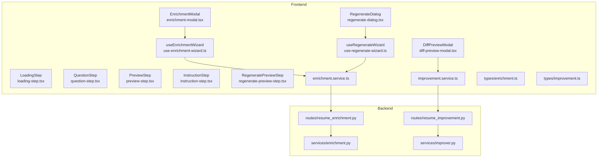
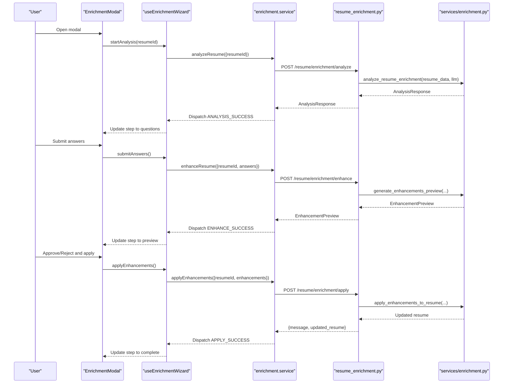
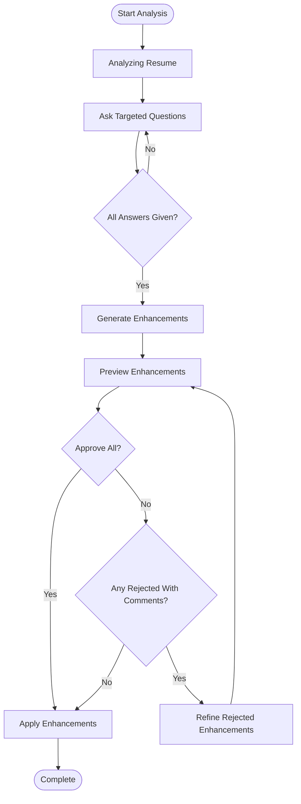
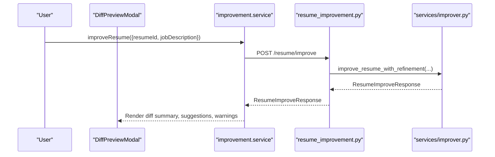
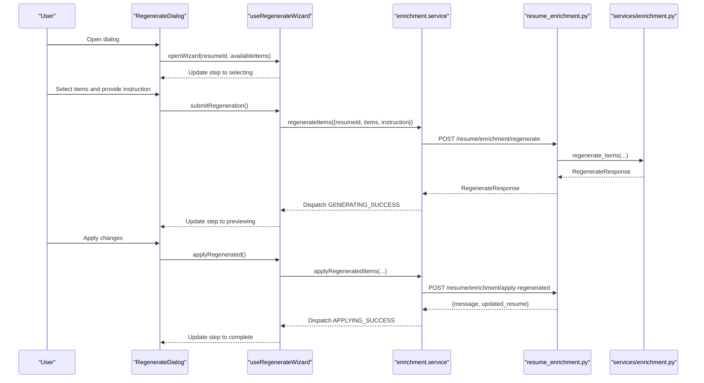
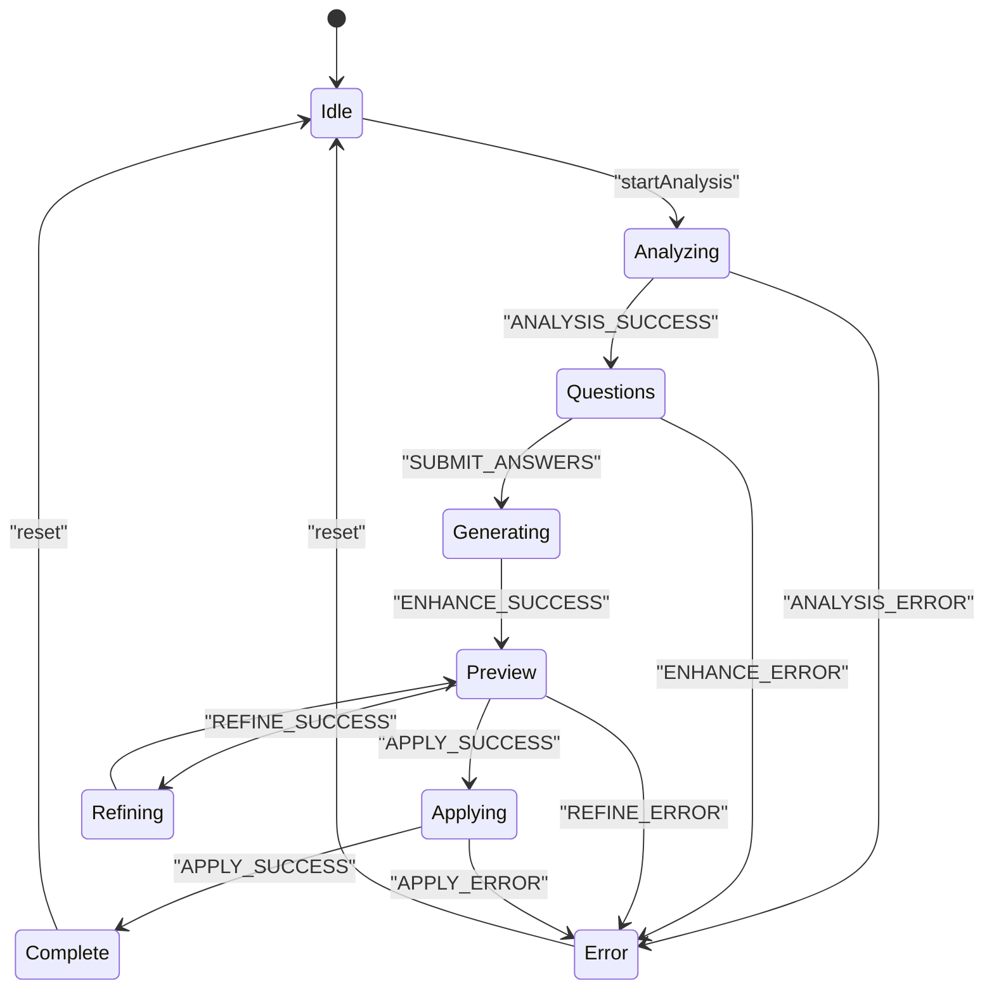
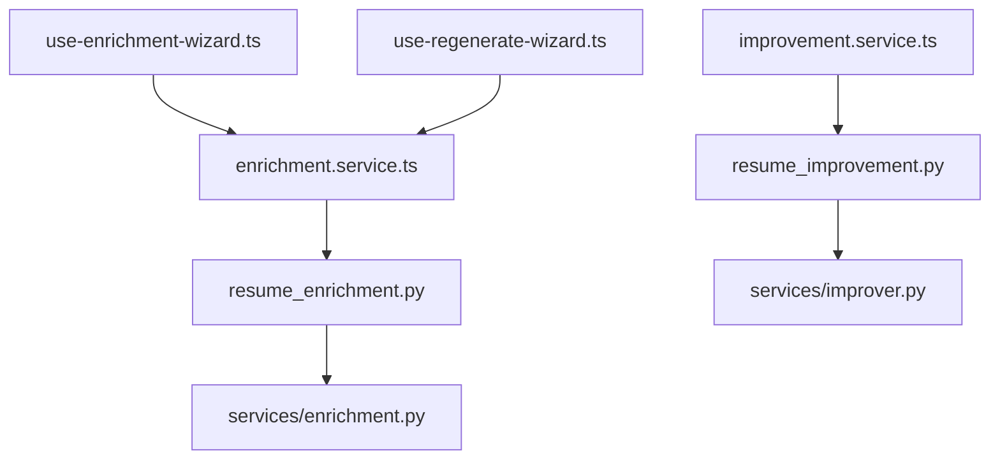

# Data processing and enhancement components

## Introduction
This page explains the data processing and enhancement components that power AI-driven resume transformations. It covers:
- Enrichment workflow: modal dialogs, step-by-step wizards, loading states, and preview functionality
- Improvement components: text difference display and modification previews
- Regeneration components: iterative content refinement with instruction-based workflows
- Data transformation pipelines, user interaction patterns, state management across multi-step processes
- Backend integration with FastAPI endpoints and LLM orchestration
- Error handling, progress tracking, and user feedback mechanisms

## Project structure
The feature set spans frontend UI components, hooks for state management, typed interfaces, and backend services:
- Frontend components implement modals and wizards for user interaction
- Hooks manage multi-step state machines and coordinate with backend services
- Services encapsulate API calls to FastAPI endpoints
- Backend routes expose REST endpoints and delegate to service helpers
- Service helpers transform resume data, orchestrate LLM prompts, and apply updates

```mermaid
graph TB
subgraph "Frontend"
EM["EnrichmentModal<br/>enrichment-modal.tsx"]
LS["LoadingStep<br/>loading-step.tsx"]
QS["QuestionStep<br/>question-step.tsx"]
PS["PreviewStep<br/>preview-step.tsx"]
RD["RegenerateDialog<br/>regenerate-dialog.tsx"]
IS["InstructionStep<br/>instruction-step.tsx"]
RPS["RegeneratePreviewStep<br/>regenerate-preview-step.tsx"]
DPM["DiffPreviewModal<br/>diff-preview-modal.tsx"]
UEW["useEnrichmentWizard<br/>use-enrichment-wizard.ts"]
URW["useRegenerateWizard<br/>use-regenerate-wizard.ts"]
ES["enrichment.service.ts"]
IMS["improvement.service.ts"]
ET["types/enrichment.ts"]
IT["types/improvement.ts"]
end
subgraph "Backend"
RE["routes/resume_enrichment.py"]
RI["routes/resume_improvement.py"]
ESRV["services/enrichment.py"]
ISRV["services/improver.py"]
end
EM --> UEW
RD --> URW
DPM --> IMS
UEW --> ES
URW --> ES
ES --> RE
IMS --> RI
RE --> ESRV
RI --> ISRV
```

## Core components
- Enrichment Modal: Orchestrates the end-to-end enrichment flow from analysis to applying enhancements, with animated transitions and error handling.
- Question Step: Presents targeted questions derived from the analysis and collects user answers.
- Preview Step: Displays before/after diffs, allows approvals/rejections, and supports bulk actions and comments.
- Loading Step: Provides consistent loading visuals during backend processing.
- Regenerate Dialog: Guides users through selecting items, providing instructions, previewing regenerated content, and applying changes.
- Instruction Step: Collects custom instructions with character limits and quick suggestions.
- Regenerate Preview Step: Shows side-by-side comparisons and error summaries for failed items.
- Diff Preview Modal: Renders improvement diffs, suggestions, refinement stats, and warnings.
- Wizard Hooks: Centralized state machines for both enrichment and regeneration flows.
- Services: Typed API clients wrapping backend endpoints for analysis, enhancement, refinement, regeneration, and improvement.
- Backend Routes and Services: Orchestrate LLM prompts, transform resume data, and persist updates.

## Architecture overview
The system follows a layered architecture:
- UI Layer: Modal dialogs and wizard steps render state and collect user input
- State Layer: Hooks implement finite state machines for multi-step flows
- Service Layer: Typed API clients call backend endpoints
- Backend Layer: FastAPI routes delegate to service helpers that orchestrate LLMs and data transformations

```mermaid
sequenceDiagram
participant U as "User"
participant EM as "EnrichmentModal"
participant UEW as "useEnrichmentWizard"
participant ES as "enrichment.service"
participant RE as "resume_enrichment.py"
participant ESRV as "services/enrichment.py"
U->>EM : Open modal
EM->>UEW : startAnalysis(resumeId)
UEW->>ES : analyzeResume({resumeId})
ES->>RE : POST /resume/enrichment/analyze
RE->>ESRV : analyze_resume_enrichment(resume_data, llm)
ESRV-->>RE : AnalysisResponse
RE-->>ES : AnalysisResponse
ES-->>UEW : Dispatch ANALYSIS_SUCCESS
UEW-->>EM : Update step to questions
U->>EM : Submit answers
EM->>UEW : submitAnswers()
UEW->>ES : enhanceResume({resumeId, answers})
ES->>RE : POST /resume/enrichment/enhance
RE->>ESRV : generate_enhancements_preview(...)
ESRV-->>RE : EnhancementPreview
RE-->>ES : EnhancementPreview
ES-->>UEW : Dispatch ENHANCE_SUCCESS
UEW-->>EM : Update step to preview
U->>EM : Approve/Reject and apply
EM->>UEW : applyEnhancements()
UEW->>ES : applyEnhancements({resumeId, enhancements})
ES->>RE : POST /resume/enrichment/apply
RE->>ESRV : apply_enhancements_to_resume(...)
ESRV-->>RE : Updated resume
RE-->>ES : {message, updated_resume}
ES-->>UEW : Dispatch APPLY_SUCCESS
UEW-->>EM : Update step to complete
```

## Detailed component analysis

### Enrichment workflow
The enrichment flow transforms raw resume data into actionable insights and enhancements:
- Analysis: Extracts weak areas and generates clarifying questions
- Question Collection: Groups questions by item and validates completeness
- Enhancement Generation: Builds contextual prompts and requests LLM to produce improved bullet points
- Preview and Review: Shows diffs, allows approvals/rejections, and bulk actions
- Refinement: Re-generates rejected items with user feedback
- Application: Persists approved enhancements to the resume

```mermaid
flowchart TD
Start(["Start Analysis"]) --> Analyzing["Analyzing Resume"]
Analyzing --> Questions["Ask Targeted Questions"]
Questions --> Answers{"All Answers Given?"}
Answers --> |No| Questions
Answers --> |Yes| Generating["Generate Enhancements"]
Generating --> Preview["Preview Enhancements"]
Preview --> Decision{"Approve All?"}
Decision --> |Yes| Apply["Apply Enhancements"]
Decision --> |No| RefineCheck{"Any Rejected With Comments?"}
RefineCheck --> |No| Apply
RefineCheck --> |Yes| Refining["Refine Rejected Enhancements"]
Refining --> Preview
Apply --> Complete(["Complete"])
```

Key UI components:
- EnrichmentModal orchestrates steps and error states
- QuestionStep groups questions by item and enforces validation
- PreviewStep renders diffs, manages patch reviews, and enables bulk actions
- LoadingStep provides consistent progress feedback

### Improvement and diff preview
The improvement workflow optimizes resumes for job descriptions and presents detailed diffs:
- Keyword extraction and resume improvement
- Diff calculation between original and improved versions
- Suggestions rendering and refinement statistics
- Warning highlights for risky changes

```mermaid
sequenceDiagram
participant U as "User"
participant DPM as "DiffPreviewModal"
participant IMS as "improvement.service"
participant RI as "resume_improvement.py"
participant ISRV as "services/improver.py"
U->>IMS : improveResume({resumeId, jobDescription})
IMS->>RI : POST /resume/improve
RI->>ISRV : improve_resume_with_refinement(...)
ISRV-->>RI : ResumeImproveResponse
RI-->>IMS : ResumeImproveResponse
IMS-->>DPM : Render diff summary, suggestions, warnings
```

### Regeneration workflow
The regeneration workflow lets users rewrite specific resume items with custom instructions:
- Item selection with metadata
- Instruction capture with character limits and quick suggestions
- Parallel regeneration per item type
- Preview with side-by-side comparison and error reporting
- Application of successful regenerations

```mermaid
sequenceDiagram
participant U as "User"
participant RD as "RegenerateDialog"
participant URW as "useRegenerateWizard"
participant ES as "enrichment.service"
participant RE as "resume_enrichment.py"
participant ESRV as "services/enrichment.py"
U->>RD : Open dialog
RD->>URW : openWizard(resumeId, availableItems)
URW-->>RD : Update step to selecting
U->>RD : Select items and provide instruction
RD->>URW : submitRegeneration()
URW->>ES : regenerateItems({resumeId, items, instruction})
ES->>RE : POST /resume/enrichment/regenerate
RE->>ESRV : regenerate_items(...)
ESRV-->>RE : RegenerateResponse
RE-->>ES : RegenerateResponse
ES-->>URW : Dispatch GENERATING_SUCCESS
URW-->>RD : Update step to previewing
U->>RD : Apply changes
RD->>URW : applyRegenerated()
URW->>ES : applyRegeneratedItems(...)
ES->>RE : POST /resume/enrichment/apply-regenerated
RE-->>ES : {message, updated_resume}
ES-->>URW : Dispatch APPLYING_SUCCESS
URW-->>RD : Update step to complete
```

### State management and data models
Both wizards implement deterministic state machines:
- Enrichment Wizard: idle → analyzing → questions → generating → preview → refining → applying → complete/error
- Regenerate Wizard: idle → selecting → instructing → generating → previewing → applying → complete/error

```mermaid
stateDiagram-v2
[*] --> Idle
Idle --> Analyzing : "startAnalysis"
Analyzing --> Questions : "ANALYSIS_SUCCESS"
Analyzing --> Error : "ANALYSIS_ERROR"
Questions --> Generating : "SUBMIT_ANSWERS"
Questions --> Error : "ENHANCE_ERROR"
Generating --> Preview : "ENHANCE_SUCCESS"
Preview --> Applying : "APPLY_SUCCESS"
Preview --> Refining : "REFINE_SUCCESS"
Preview --> Error : "REFINE_ERROR"
Refining --> Preview
Applying --> Complete : "APPLY_SUCCESS"
Applying --> Error : "APPLY_ERROR"
Error --> Idle : "reset"
Complete --> Idle : "reset"
```

Typed interfaces define the shape of data exchanged:
- Enrichment types: AnalysisResponse, EnhancementPreview, RegenerateResponse, PatchReviewState
- Improvement types: ResumeDiffSummary, ResumeFieldDiff, RefinementStats, ImprovementSuggestion

## Dependency analysis
Frontend-to-backend dependencies:
- Enrichment endpoints: analyze, improve, refine, apply, regenerate, apply-regenerated
- Improvement endpoints: improve, refine
- Service layers transform resume data, construct prompts, and apply updates
- Backend routes depend on LLM helpers and language utilities

```mermaid
graph TB
ES["enrichment.service.ts"] --> RE["resume_enrichment.py"]
IMS["improvement.service.ts"] --> RI["resume_improvement.py"]
RE --> ESRV["services/enrichment.py"]
RI --> ISRV["services/improver.py"]
UEW["use-enrichment-wizard.ts"] --> ES
URW["use-regenerate-wizard.ts"] --> ES
```

## Performance considerations
- Parallelization: Regeneration tasks are executed concurrently per item to reduce latency.
- Payload construction: Resume data is normalized and compacted before LLM calls to minimize token usage.
- Diff computation: Efficient sequence matching minimizes overhead when computing differences.
- UI responsiveness: Animated transitions and skeleton loaders improve perceived performance during async operations.

[No sources needed since this section provides general guidance]

## Troubleshooting guide
Common issues and resolutions:
- Analysis failures: Validate resume ID and network connectivity; display user-friendly messages and allow retry.
- Enhancement generation errors: Ensure all questions are answered; check backend logs for LLM errors.
- Refinement failures: Confirm rejected items have comments; verify backend prompt correctness.
- Apply failures: Inspect backend validation errors and mismatched content identifiers.
- Regeneration errors: Review per-item error messages and retry failed items individually.

User-facing error surfaces:
- Enrichment Modal error state with Try Again and Close actions
- Regenerate Dialog error state with Go Back and Close actions
- Diff Preview Modal displays warnings and refinement outcomes

## Conclusion
The data processing and enhancement components provide a reliable, user-friendly pipeline for AI-driven resume transformations. Through modal-based wizards, typed state machines, and backend orchestration, users can iteratively refine their content with clear previews, actionable diffs, and reliable application of changes. The architecture balances UX polish with scalable backend processing, ensuring smooth progress tracking and effective error handling.
