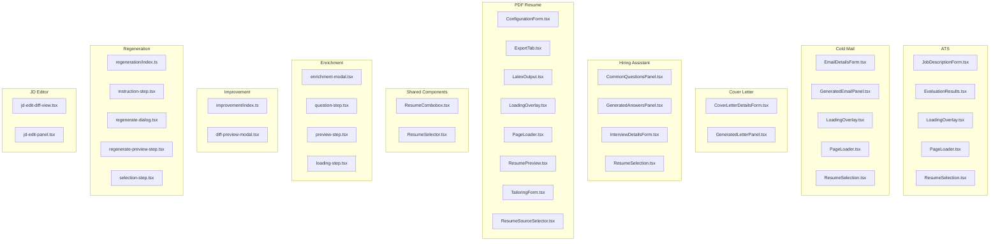
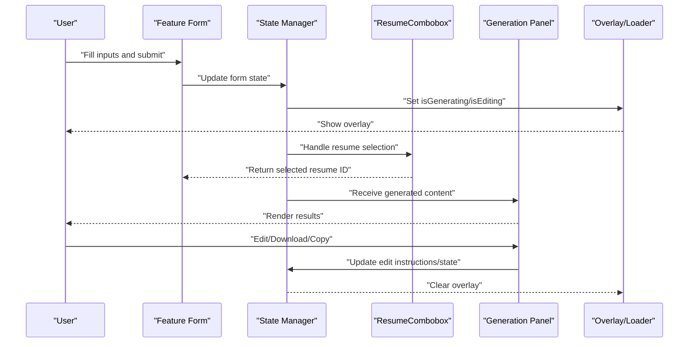
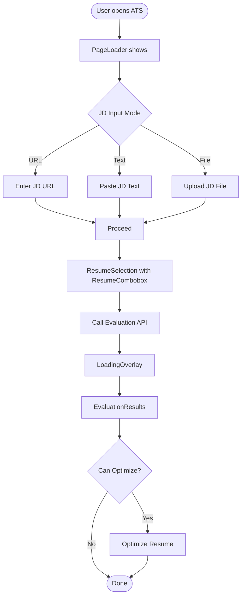
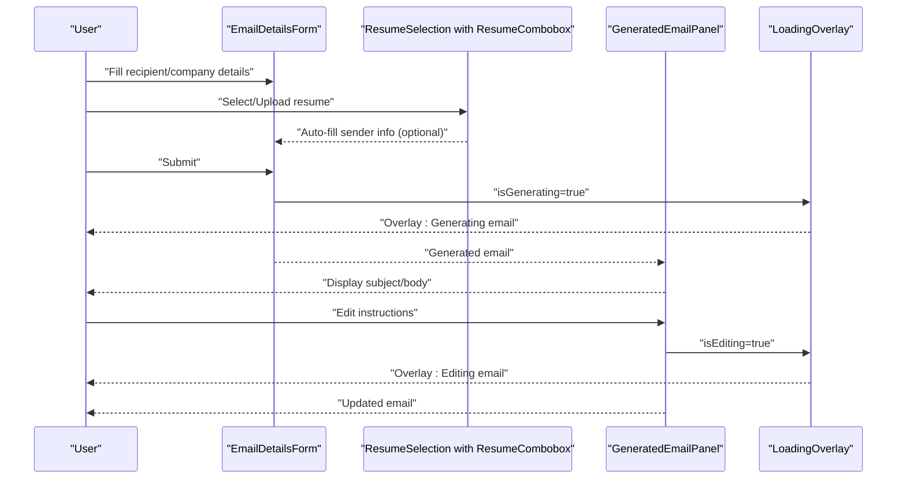
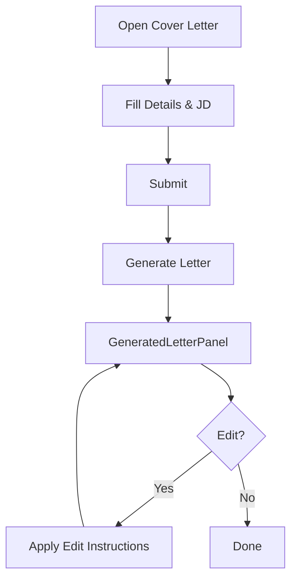
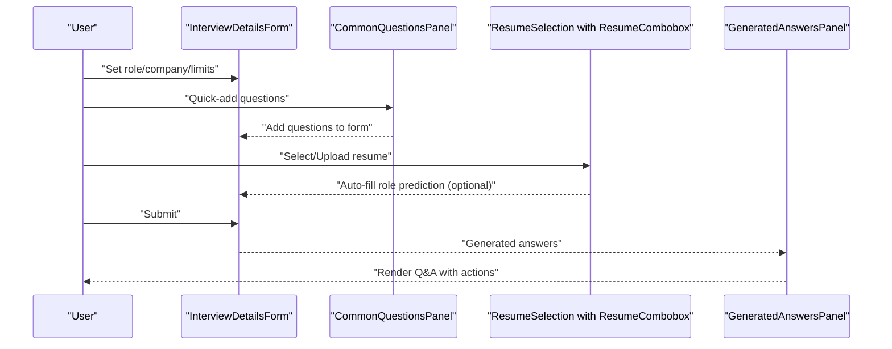
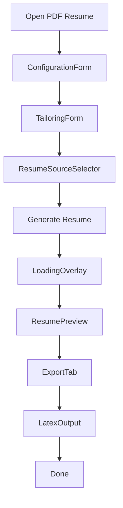
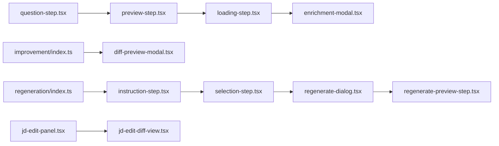
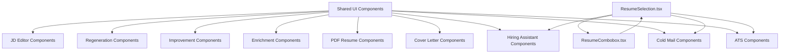

# Feature-Specific Components

<cite>
**Referenced Files in This Document**
- [EvaluationResults.tsx](file://frontend/components/ats/EvaluationResults.tsx)
- [JobDescriptionForm.tsx](file://frontend/components/ats/JobDescriptionForm.tsx)
- [LoadingOverlay.tsx](file://frontend/components/ats/LoadingOverlay.tsx)
- [PageLoader.tsx](file://frontend/components/ats/PageLoader.tsx)
- [ResumeSelection.tsx](file://frontend/components/ats/ResumeSelection.tsx)
- [EmailDetailsForm.tsx](file://frontend/components/cold-mail/EmailDetailsForm.tsx)
- [GeneratedEmailPanel.tsx](file://frontend/components/cold-mail/GeneratedEmailPanel.tsx)
- [LoadingOverlay.tsx](file://frontend/components/cold-mail/LoadingOverlay.tsx)
- [PageLoader.tsx](file://frontend/components/cold-mail/PageLoader.tsx)
- [ResumeSelection.tsx](file://frontend/components/cold-mail/ResumeSelection.tsx)
- [CoverLetterDetailsForm.tsx](file://frontend/components/cover-letter/CoverLetterDetailsForm.tsx)
- [GeneratedLetterPanel.tsx](file://frontend/components/cover-letter/GeneratedLetterPanel.tsx)
- [CommonQuestionsPanel.tsx](file://frontend/components/hiring-assistant/CommonQuestionsPanel.tsx)
- [GeneratedAnswersPanel.tsx](file://frontend/components/hiring-assistant/GeneratedAnswersPanel.tsx)
- [InterviewDetailsForm.tsx](file://frontend/components/hiring-assistant/InterviewDetailsForm.tsx)
- [ResumeSelection.tsx](file://frontend/components/hiring-assistant/ResumeSelection.tsx)
- [ConfigurationForm.tsx](file://frontend/components/pdf-resume/ConfigurationForm.tsx)
- [ExportTab.tsx](file://frontend/components/pdf-resume/ExportTab.tsx)
- [LatexOutput.tsx](file://frontend/components/pdf-resume/LatexOutput.tsx)
- [LoadingOverlay.tsx](file://frontend/components/pdf-resume/LoadingOverlay.tsx)
- [PageLoader.tsx](file://frontend/components/pdf-resume/PageLoader.tsx)
- [ResumePreview.tsx](file://frontend/components/pdf-resume/ResumePreview.tsx)
- [TailoringForm.tsx](file://frontend/components/pdf-resume/TailoringForm.tsx)
- [ResumeSourceSelector.tsx](file://frontend/components/pdf-resume/ResumeSourceSelector.tsx)
- [enrichment-modal.tsx](file://frontend/components/enrichment/enrichment-modal.tsx)
- [loading-step.tsx](file://frontend/components/enrichment/loading-step.tsx)
- [preview-step.tsx](file://frontend/components/enrichment/preview-step.tsx)
- [question-step.tsx](file://frontend/components/enrichment/question-step.tsx)
- [improvement/index.ts](file://frontend/components/improvement/index.ts)
- [diff-preview-modal.tsx](file://frontend/components/improvement/diff-preview-modal.tsx)
- [regeneration/index.ts](file://frontend/components/regeneration/index.ts)
- [instruction-step.tsx](file://frontend/components/regeneration/instruction-step.tsx)
- [regenerate-dialog.tsx](file://frontend/components/regeneration/regenerate-dialog.tsx)
- [regenerate-preview-step.tsx](file://frontend/components/regeneration/regenerate-preview-step.tsx)
- [selection-step.tsx](file://frontend/components/regeneration/selection-step.tsx)
- [jd-edit-diff-view.tsx](file://frontend/components/jd-editor/jd-edit-diff-view.tsx)
- [jd-edit-panel.tsx](file://frontend/components/jd-editor/jd-edit-panel.tsx)
- [resume-combobox.tsx](file://frontend/components/shared/resume-combobox.tsx)
- [resume-selector.tsx](file://frontend/components/shared/resume-selector.tsx)
</cite>

## Update Summary
**Changes Made**
- Updated ATS Evaluation Components section to reflect the new ResumeCombobox integration
- Updated Cold Mail Components section to reflect the new ResumeCombobox integration  
- Updated Hiring Assistant Components section to reflect the new ResumeCombobox integration
- Added new section documenting the shared ResumeCombobox component
- Updated dependency analysis to include ResumeCombobox as a shared component
- Enhanced component architecture diagrams to show ResumeCombobox usage

## Table of Contents
1. [Introduction](#introduction)
2. [Project Structure](#project-structure)
3. [Core Components](#core-components)
4. [Architecture Overview](#architecture-overview)
5. [Detailed Component Analysis](#detailed-component-analysis)
6. [Shared Components](#shared-components)
7. [Dependency Analysis](#dependency-analysis)
8. [Performance Considerations](#performance-considerations)
9. [Troubleshooting Guide](#troubleshooting-guide)
10. [Conclusion](#conclusion)

## Introduction
This document provides feature-specific component documentation for ATS evaluation, cold mail generation, cover letter generation, hiring assistant, and PDF resume generation. It explains component responsibilities, data flows, state management patterns, and interdependencies across features. Each feature's components are grouped by functional area and explained with diagrams where applicable.

**Updated** The ATS Evaluation, Cold Mail Generation, and Hiring Assistant components have been significantly refactored to use the new ResumeCombobox component, removing over 100 lines of duplicated dropdown code while improving consistency and maintainability across all resume selection functionality.

## Project Structure
The frontend organizes components by feature under a components directory, with shared UI components and feature-specific panels. Each feature includes:
- Form components for capturing user input
- Panels for displaying generated content
- Overlays and loaders for UX feedback during async operations
- Shared selection components for resume sourcing

**Diagram sources**
- [resume-combobox.tsx](file://frontend/components/shared/resume-combobox.tsx#L1-L198)
- [resume-selector.tsx](file://frontend/components/shared/resume-selector.tsx#L1-L201)
- [JobDescriptionForm.tsx](file://frontend/components/ats/JobDescriptionForm.tsx#L1-L286)
- [EvaluationResults.tsx](file://frontend/components/ats/EvaluationResults.tsx#L1-L177)
- [LoadingOverlay.tsx](file://frontend/components/ats/LoadingOverlay.tsx#L1-L45)
- [PageLoader.tsx](file://frontend/components/ats/PageLoader.tsx#L1-L23)
- [ResumeSelection.tsx](file://frontend/components/ats/ResumeSelection.tsx#L1-L215)
- [EmailDetailsForm.tsx](file://frontend/components/cold-mail/EmailDetailsForm.tsx#L1-L150)
- [GeneratedEmailPanel.tsx](file://frontend/components/cold-mail/GeneratedEmailPanel.tsx#L1-L190)
- [LoadingOverlay.tsx](file://frontend/components/cold-mail/LoadingOverlay.tsx#L1-L63)
- [PageLoader.tsx](file://frontend/components/cold-mail/PageLoader.tsx#L1-L23)
- [ResumeSelection.tsx](file://frontend/components/cold-mail/ResumeSelection.tsx#L1-L465)
- [CommonQuestionsPanel.tsx](file://frontend/components/hiring-assistant/CommonQuestionsPanel.tsx#L1-L44)
- [GeneratedAnswersPanel.tsx](file://frontend/components/hiring-assistant/GeneratedAnswersPanel.tsx#L1-L107)
- [InterviewDetailsForm.tsx](file://frontend/components/hiring-assistant/InterviewDetailsForm.tsx#L1-L112)
- [ResumeSelection.tsx](file://frontend/components/hiring-assistant/ResumeSelection.tsx#L1-L237)

**Section sources**
- [resume-combobox.tsx](file://frontend/components/shared/resume-combobox.tsx#L1-L198)
- [resume-selector.tsx](file://frontend/components/shared/resume-selector.tsx#L1-L201)
- [JobDescriptionForm.tsx](file://frontend/components/ats/JobDescriptionForm.tsx#L1-L286)
- [EvaluationResults.tsx](file://frontend/components/ats/EvaluationResults.tsx#L1-L177)
- [EmailDetailsForm.tsx](file://frontend/components/cold-mail/EmailDetailsForm.tsx#L1-L150)
- [GeneratedEmailPanel.tsx](file://frontend/components/cold-mail/GeneratedEmailPanel.tsx#L1-L190)
- [CoverLetterDetailsForm.tsx](file://frontend/components/cover-letter/CoverLetterDetailsForm.tsx#L1-L246)
- [GeneratedLetterPanel.tsx](file://frontend/components/cover-letter/GeneratedLetterPanel.tsx#L1-L174)
- [CommonQuestionsPanel.tsx](file://frontend/components/hiring-assistant/CommonQuestionsPanel.tsx#L1-L44)
- [GeneratedAnswersPanel.tsx](file://frontend/components/hiring-assistant/GeneratedAnswersPanel.tsx#L1-L107)
- [InterviewDetailsForm.tsx](file://frontend/components/hiring-assistant/InterviewDetailsForm.tsx#L1-L112)
- [ConfigurationForm.tsx](file://frontend/components/pdf-resume/ConfigurationForm.tsx#L1-L200)
- [ExportTab.tsx](file://frontend/components/pdf-resume/ExportTab.tsx#L1-L200)
- [LatexOutput.tsx](file://frontend/components/pdf-resume/LatexOutput.tsx#L1-L200)
- [ResumePreview.tsx](file://frontend/components/pdf-resume/ResumePreview.tsx#L1-L200)
- [TailoringForm.tsx](file://frontend/components/pdf-resume/TailoringForm.tsx#L1-L200)
- [ResumeSourceSelector.tsx](file://frontend/components/pdf-resume/ResumeSourceSelector.tsx#L1-L200)
- [enrichment-modal.tsx](file://frontend/components/enrichment/enrichment-modal.tsx#L1-L200)
- [question-step.tsx](file://frontend/components/enrichment/question-step.tsx#L1-L200)
- [preview-step.tsx](file://frontend/components/enrichment/preview-step.tsx#L1-L200)
- [loading-step.tsx](file://frontend/components/enrichment/loading-step.tsx#L1-L200)
- [improvement/index.ts](file://frontend/components/improvement/index.ts#L1-L200)
- [diff-preview-modal.tsx](file://frontend/components/improvement/diff-preview-modal.tsx#L1-L200)
- [regeneration/index.ts](file://frontend/components/regeneration/index.ts#L1-L200)
- [instruction-step.tsx](file://frontend/components/regeneration/instruction-step.tsx#L1-L200)
- [regenerate-dialog.tsx](file://frontend/components/regeneration/regenerate-dialog.tsx#L1-L200)
- [regenerate-preview-step.tsx](file://frontend/components/regeneration/regenerate-preview-step.tsx#L1-L200)
- [selection-step.tsx](file://frontend/components/regeneration/selection-step.tsx#L1-L200)
- [jd-edit-diff-view.tsx](file://frontend/components/jd-editor/jd-edit-diff-view.tsx#L1-L200)
- [jd-edit-panel.tsx](file://frontend/components/jd-editor/jd-edit-panel.tsx#L1-L200)

## Core Components
This section summarizes each feature's primary components and their responsibilities:
- ATS evaluation: JobDescriptionForm captures JD inputs; EvaluationResults renders score and suggestions; LoadingOverlay and PageLoader manage async feedback; ResumeSelection selects or uploads a resume using the new ResumeCombobox.
- Cold mail: EmailDetailsForm collects recipient and context; GeneratedEmailPanel displays and edits the generated email; LoadingOverlay and PageLoader provide UX feedback; ResumeSelection supports three modes (existing, upload, custom draft) using ResumeCombobox.
- Cover letter: CoverLetterDetailsForm captures inputs; GeneratedLetterPanel displays and edits the generated letter.
- Hiring assistant: InterviewDetailsForm captures role/company/limits; CommonQuestionsPanel offers quick-add; GeneratedAnswersPanel renders answers; ResumeSelection supports existing/upload modes using ResumeCombobox.
- PDF resume: ConfigurationForm, TailoringForm, and ResumeSourceSelector configure generation; ResumePreview previews output; ExportTab and LatexOutput handle export; LoadingOverlay and PageLoader provide feedback.
- Enrichment, improvement, regeneration, and JD editor: Wizard-style components guide users through steps and present previews.

**Updated** All ResumeSelection components across ATS, Cold Mail, and Hiring Assistant now use the centralized ResumeCombobox component, eliminating code duplication and providing consistent dropdown behavior.

**Section sources**
- [JobDescriptionForm.tsx](file://frontend/components/ats/JobDescriptionForm.tsx#L1-L286)
- [EvaluationResults.tsx](file://frontend/components/ats/EvaluationResults.tsx#L1-L177)
- [LoadingOverlay.tsx](file://frontend/components/ats/LoadingOverlay.tsx#L1-L45)
- [PageLoader.tsx](file://frontend/components/ats/PageLoader.tsx#L1-L23)
- [ResumeSelection.tsx](file://frontend/components/ats/ResumeSelection.tsx#L1-L215)
- [EmailDetailsForm.tsx](file://frontend/components/cold-mail/EmailDetailsForm.tsx#L1-L150)
- [GeneratedEmailPanel.tsx](file://frontend/components/cold-mail/GeneratedEmailPanel.tsx#L1-L190)
- [LoadingOverlay.tsx](file://frontend/components/cold-mail/LoadingOverlay.tsx#L1-L63)
- [PageLoader.tsx](file://frontend/components/cold-mail/PageLoader.tsx#L1-L23)
- [ResumeSelection.tsx](file://frontend/components/cold-mail/ResumeSelection.tsx#L1-L465)
- [CoverLetterDetailsForm.tsx](file://frontend/components/cover-letter/CoverLetterDetailsForm.tsx#L1-L246)
- [GeneratedLetterPanel.tsx](file://frontend/components/cover-letter/GeneratedLetterPanel.tsx#L1-L174)
- [CommonQuestionsPanel.tsx](file://frontend/components/hiring-assistant/CommonQuestionsPanel.tsx#L1-L44)
- [GeneratedAnswersPanel.tsx](file://frontend/components/hiring-assistant/GeneratedAnswersPanel.tsx#L1-L107)
- [InterviewDetailsForm.tsx](file://frontend/components/hiring-assistant/InterviewDetailsForm.tsx#L1-L112)
- [ResumeSelection.tsx](file://frontend/components/hiring-assistant/ResumeSelection.tsx#L1-L237)
- [ConfigurationForm.tsx](file://frontend/components/pdf-resume/ConfigurationForm.tsx#L1-L200)
- [ExportTab.tsx](file://frontend/components/pdf-resume/ExportTab.tsx#L1-L200)
- [LatexOutput.tsx](file://frontend/components/pdf-resume/LatexOutput.tsx#L1-L200)
- [ResumePreview.tsx](file://frontend/components/pdf-resume/ResumePreview.tsx#L1-L200)
- [TailoringForm.tsx](file://frontend/components/pdf-resume/TailoringForm.tsx#L1-L200)
- [ResumeSourceSelector.tsx](file://frontend/components/pdf-resume/ResumeSourceSelector.tsx#L1-L200)
- [enrichment-modal.tsx](file://frontend/components/enrichment/enrichment-modal.tsx#L1-L200)
- [question-step.tsx](file://frontend/components/enrichment/question-step.tsx#L1-L200)
- [preview-step.tsx](file://frontend/components/enrichment/preview-step.tsx#L1-L200)
- [loading-step.tsx](file://frontend/components/enrichment/loading-step.tsx#L1-L200)
- [improvement/index.ts](file://frontend/components/improvement/index.ts#L1-L200)
- [diff-preview-modal.tsx](file://frontend/components/improvement/diff-preview-modal.tsx#L1-L200)
- [regeneration/index.ts](file://frontend/components/regeneration/index.ts#L1-L200)
- [instruction-step.tsx](file://frontend/components/regeneration/instruction-step.tsx#L1-L200)
- [regenerate-dialog.tsx](file://frontend/components/regeneration/regenerate-dialog.tsx#L1-L200)
- [regenerate-preview-step.tsx](file://frontend/components/regeneration/regenerate-preview-step.tsx#L1-L200)
- [selection-step.tsx](file://frontend/components/regeneration/selection-step.tsx#L1-L200)
- [jd-edit-diff-view.tsx](file://frontend/components/jd-editor/jd-edit-diff-view.tsx#L1-L200)
- [jd-edit-panel.tsx](file://frontend/components/jd-editor/jd-edit-panel.tsx#L1-L200)

## Architecture Overview
Each feature follows a similar pattern:
- Input forms capture user data and maintain local state
- Panels render generated content and expose actions (copy, download, edit)
- Overlays and loaders communicate async operations to the user
- Shared selection components unify resume sourcing across features using the new ResumeCombobox

**Updated** The ResumeCombobox component centralizes dropdown functionality, providing consistent styling, behavior, and accessibility across all resume selection components.

**Diagram sources**
- [EmailDetailsForm.tsx](file://frontend/components/cold-mail/EmailDetailsForm.tsx#L1-L150)
- [GeneratedEmailPanel.tsx](file://frontend/components/cold-mail/GeneratedEmailPanel.tsx#L1-L190)
- [LoadingOverlay.tsx](file://frontend/components/cold-mail/LoadingOverlay.tsx#L1-L63)
- [GeneratedLetterPanel.tsx](file://frontend/components/cover-letter/GeneratedLetterPanel.tsx#L1-L174)
- [GeneratedAnswersPanel.tsx](file://frontend/components/hiring-assistant/GeneratedAnswersPanel.tsx#L1-L107)
- [EvaluationResults.tsx](file://frontend/components/ats/EvaluationResults.tsx#L1-L177)
- [resume-combobox.tsx](file://frontend/components/shared/resume-combobox.tsx#L1-L198)

## Detailed Component Analysis

### ATS Evaluation Components
- JobDescriptionForm: Supports URL, text, and file-based JD inputs with mode switching and drag-and-drop file handling.
- EvaluationResults: Renders match score, reasons, suggestions, and optional optimization action.
- LoadingOverlay and PageLoader: Provide modal overlays and page-level loaders during evaluation.
- ResumeSelection: Unified selector supporting existing, upload, and preview modes with animated dropdowns powered by ResumeCombobox.

**Updated** The ResumeSelection component now uses ResumeCombobox for consistent dropdown behavior, eliminating over 100 lines of duplicated code while improving maintainability.

**Diagram sources**
- [JobDescriptionForm.tsx](file://frontend/components/ats/JobDescriptionForm.tsx#L1-L286)
- [EvaluationResults.tsx](file://frontend/components/ats/EvaluationResults.tsx#L1-L177)
- [LoadingOverlay.tsx](file://frontend/components/ats/LoadingOverlay.tsx#L1-L45)
- [PageLoader.tsx](file://frontend/components/ats/PageLoader.tsx#L1-L23)
- [ResumeSelection.tsx](file://frontend/components/ats/ResumeSelection.tsx#L1-L215)
- [resume-combobox.tsx](file://frontend/components/shared/resume-combobox.tsx#L1-L198)

**Section sources**
- [JobDescriptionForm.tsx](file://frontend/components/ats/JobDescriptionForm.tsx#L1-L286)
- [EvaluationResults.tsx](file://frontend/components/ats/EvaluationResults.tsx#L1-L177)
- [LoadingOverlay.tsx](file://frontend/components/ats/LoadingOverlay.tsx#L1-L45)
- [PageLoader.tsx](file://frontend/components/ats/PageLoader.tsx#L1-L23)
- [ResumeSelection.tsx](file://frontend/components/ats/ResumeSelection.tsx#L1-L215)

### Cold Mail Components
- EmailDetailsForm: Captures recipient, company, sender, and content context; supports URL/text JD toggles.
- GeneratedEmailPanel: Displays subject/body, edit mode with instructions, copy/download actions.
- LoadingOverlay: Dual-purpose overlay for generation and editing flows.
- ResumeSelection: Three modes—existing, upload, and custom draft editing—with auto-fill and preview using ResumeCombobox.

**Updated** The ResumeSelection component now uses ResumeCombobox for consistent dropdown behavior across all three selection modes, providing a unified user experience.

**Diagram sources**
- [EmailDetailsForm.tsx](file://frontend/components/cold-mail/EmailDetailsForm.tsx#L1-L150)
- [GeneratedEmailPanel.tsx](file://frontend/components/cold-mail/GeneratedEmailPanel.tsx#L1-L190)
- [LoadingOverlay.tsx](file://frontend/components/cold-mail/LoadingOverlay.tsx#L1-L63)
- [ResumeSelection.tsx](file://frontend/components/cold-mail/ResumeSelection.tsx#L1-L465)
- [resume-combobox.tsx](file://frontend/components/shared/resume-combobox.tsx#L1-L198)

**Section sources**
- [EmailDetailsForm.tsx](file://frontend/components/cold-mail/EmailDetailsForm.tsx#L1-L150)
- [GeneratedEmailPanel.tsx](file://frontend/components/cold-mail/GeneratedEmailPanel.tsx#L1-L190)
- [LoadingOverlay.tsx](file://frontend/components/cold-mail/LoadingOverlay.tsx#L1-L63)
- [ResumeSelection.tsx](file://frontend/components/cold-mail/ResumeSelection.tsx#L1-L465)

### Cover Letter Components
- CoverLetterDetailsForm: Collects personal details, JD URL/text toggle, key points, and optional recipient info.
- GeneratedLetterPanel: Renders the letter body, edit mode, copy, and download.

**Diagram sources**
- [CoverLetterDetailsForm.tsx](file://frontend/components/cover-letter/CoverLetterDetailsForm.tsx#L1-L246)
- [GeneratedLetterPanel.tsx](file://frontend/components/cover-letter/GeneratedLetterPanel.tsx#L1-L174)

**Section sources**
- [CoverLetterDetailsForm.tsx](file://frontend/components/cover-letter/CoverLetterDetailsForm.tsx#L1-L246)
- [GeneratedLetterPanel.tsx](file://frontend/components/cover-letter/GeneratedLetterPanel.tsx#L1-L174)

### Hiring Assistant Components
- InterviewDetailsForm: Role, company, word limit, company knowledge, and website.
- CommonQuestionsPanel: Quick-add buttons for common interview questions.
- GeneratedAnswersPanel: Renders question-answer pairs with copy and download.
- ResumeSelection: Supports existing and upload modes using ResumeCombobox.

**Updated** The ResumeSelection component now uses ResumeCombobox for consistent dropdown behavior, providing auto-fill functionality for role predictions and improved user experience.

**Diagram sources**
- [InterviewDetailsForm.tsx](file://frontend/components/hiring-assistant/InterviewDetailsForm.tsx#L1-L112)
- [CommonQuestionsPanel.tsx](file://frontend/components/hiring-assistant/CommonQuestionsPanel.tsx#L1-L44)
- [GeneratedAnswersPanel.tsx](file://frontend/components/hiring-assistant/GeneratedAnswersPanel.tsx#L1-L107)
- [ResumeSelection.tsx](file://frontend/components/hiring-assistant/ResumeSelection.tsx#L1-L237)
- [resume-combobox.tsx](file://frontend/components/shared/resume-combobox.tsx#L1-L198)

**Section sources**
- [InterviewDetailsForm.tsx](file://frontend/components/hiring-assistant/InterviewDetailsForm.tsx#L1-L112)
- [CommonQuestionsPanel.tsx](file://frontend/components/hiring-assistant/CommonQuestionsPanel.tsx#L1-L44)
- [GeneratedAnswersPanel.tsx](file://frontend/components/hiring-assistant/GeneratedAnswersPanel.tsx#L1-L107)
- [ResumeSelection.tsx](file://frontend/components/hiring-assistant/ResumeSelection.tsx#L1-L237)

### PDF Resume Components
- ConfigurationForm: Template and theme configuration.
- TailoringForm: Tailors content to a specific role/JD.
- ResumeSourceSelector: Chooses resume source for generation.
- ResumePreview: Live preview of the generated resume.
- ExportTab and LatexOutput: Export controls and LaTeX rendering.
- LoadingOverlay and PageLoader: Feedback during generation/export.

**Diagram sources**
- [ConfigurationForm.tsx](file://frontend/components/pdf-resume/ConfigurationForm.tsx#L1-L200)
- [TailoringForm.tsx](file://frontend/components/pdf-resume/TailoringForm.tsx#L1-L200)
- [ResumeSourceSelector.tsx](file://frontend/components/pdf-resume/ResumeSourceSelector.tsx#L1-L200)
- [ResumePreview.tsx](file://frontend/components/pdf-resume/ResumePreview.tsx#L1-L200)
- [ExportTab.tsx](file://frontend/components/pdf-resume/ExportTab.tsx#L1-L200)
- [LatexOutput.tsx](file://frontend/components/pdf-resume/LatexOutput.tsx#L1-L200)
- [LoadingOverlay.tsx](file://frontend/components/pdf-resume/LoadingOverlay.tsx#L1-L45)
- [PageLoader.tsx](file://frontend/components/pdf-resume/PageLoader.tsx#L1-L23)

**Section sources**
- [ConfigurationForm.tsx](file://frontend/components/pdf-resume/ConfigurationForm.tsx#L1-L200)
- [TailoringForm.tsx](file://frontend/components/pdf-resume/TailoringForm.tsx#L1-L200)
- [ResumeSourceSelector.tsx](file://frontend/components/pdf-resume/ResumeSourceSelector.tsx#L1-L200)
- [ResumePreview.tsx](file://frontend/components/pdf-resume/ResumePreview.tsx#L1-L200)
- [ExportTab.tsx](file://frontend/components/pdf-resume/ExportTab.tsx#L1-L200)
- [LatexOutput.tsx](file://frontend/components/pdf-resume/LatexOutput.tsx#L1-L200)
- [LoadingOverlay.tsx](file://frontend/components/pdf-resume/LoadingOverlay.tsx#L1-L45)
- [PageLoader.tsx](file://frontend/components/pdf-resume/PageLoader.tsx#L1-L23)

### Enrichment, Improvement, Regeneration, and JD Editor Components
- Enrichment: Modal wizard with question, preview, and loading steps.
- Improvement: Index and diff preview modal for reviewing changes.
- Regeneration: Wizard with instruction, selection, dialog, and preview steps.
- JD Editor: Diff view and panel for editing job descriptions.

**Diagram sources**
- [enrichment-modal.tsx](file://frontend/components/enrichment/enrichment-modal.tsx#L1-L200)
- [question-step.tsx](file://frontend/components/enrichment/question-step.tsx#L1-L200)
- [preview-step.tsx](file://frontend/components/enrichment/preview-step.tsx#L1-L200)
- [loading-step.tsx](file://frontend/components/enrichment/loading-step.tsx#L1-L200)
- [improvement/index.ts](file://frontend/components/improvement/index.ts#L1-L200)
- [diff-preview-modal.tsx](file://frontend/components/improvement/diff-preview-modal.tsx#L1-L200)
- [regeneration/index.ts](file://frontend/components/regeneration/index.ts#L1-L200)
- [instruction-step.tsx](file://frontend/components/regeneration/instruction-step.tsx#L1-L200)
- [selection-step.tsx](file://frontend/components/regeneration/selection-step.tsx#L1-L200)
- [regenerate-dialog.tsx](file://frontend/components/regeneration/regenerate-dialog.tsx#L1-L200)
- [regenerate-preview-step.tsx](file://frontend/components/regeneration/regenerate-preview-step.tsx#L1-L200)
- [jd-edit-diff-view.tsx](file://frontend/components/jd-editor/jd-edit-diff-view.tsx#L1-L200)
- [jd-edit-panel.tsx](file://frontend/components/jd-editor/jd-edit-panel.tsx#L1-L200)

**Section sources**
- [enrichment-modal.tsx](file://frontend/components/enrichment/enrichment-modal.tsx#L1-L200)
- [question-step.tsx](file://frontend/components/enrichment/question-step.tsx#L1-L200)
- [preview-step.tsx](file://frontend/components/enrichment/preview-step.tsx#L1-L200)
- [loading-step.tsx](file://frontend/components/enrichment/loading-step.tsx#L1-L200)
- [improvement/index.ts](file://frontend/components/improvement/index.ts#L1-L200)
- [diff-preview-modal.tsx](file://frontend/components/improvement/diff-preview-modal.tsx#L1-L200)
- [regeneration/index.ts](file://frontend/components/regeneration/index.ts#L1-L200)
- [instruction-step.tsx](file://frontend/components/regeneration/instruction-step.tsx#L1-L200)
- [selection-step.tsx](file://frontend/components/regeneration/selection-step.tsx#L1-L200)
- [regenerate-dialog.tsx](file://frontend/components/regeneration/regenerate-dialog.tsx#L1-L200)
- [regenerate-preview-step.tsx](file://frontend/components/regeneration/regenerate-preview-step.tsx#L1-L200)
- [jd-edit-diff-view.tsx](file://frontend/components/jd-editor/jd-edit-diff-view.tsx#L1-L200)
- [jd-edit-panel.tsx](file://frontend/components/jd-editor/jd-edit-panel.tsx#L1-L200)

## Shared Components

### ResumeCombobox Component
The ResumeCombobox component provides a unified dropdown interface for selecting resumes across all features. It encapsulates complex dropdown functionality including search, filtering, and selection handling.

**Key Features:**
- Consistent styling and behavior across all resume selection components
- Searchable dropdown with keyboard navigation support
- Loading states with spinner animation
- Empty state handling with customizable messages
- Accessible ARIA attributes and keyboard shortcuts
- Haptic feedback integration for better user experience

**Props Interface:**
- `resumes`: Array of resume options with id, customName, uploadDate, candidateName, predictedField
- `selectedResumeId`: Currently selected resume ID
- `onSelect`: Callback function when a resume is selected
- `isLoading`: Loading state indicator
- `placeholder`: Placeholder text for empty state
- `emptyMessage`: Message to display when no resumes are found
- `emptyDescription`: Additional description for empty state
- `className`: Additional CSS classes

**Section sources**
- [resume-combobox.tsx](file://frontend/components/shared/resume-combobox.tsx#L1-L198)

### ResumeSelector Component
The ResumeSelector component provides a flexible resume selection interface that can operate in two modes: dropdown and card styles. It serves as a wrapper around ResumeCombobox for more complex scenarios.

**Key Features:**
- Dual-mode operation (dropdown vs card)
- Built-in file upload support
- Controlled and uncontrolled selection modes
- Automatic resume fetching via hooks
- Mode switching with haptic feedback

**Section sources**
- [resume-selector.tsx](file://frontend/components/shared/resume-selector.tsx#L1-L201)

## Dependency Analysis
- Shared UI: All features reuse UI primitives (inputs, labels, cards, buttons) and the MarkdownRenderer for rendering content.
- State management: Each feature maintains its own form state locally; overlays depend on boolean flags to control visibility.
- Inter-feature reuse: ResumeSelection appears across ATS, Cold Mail, and Hiring Assistant, now using the centralized ResumeCombobox component, reducing duplication and ensuring consistent UX for resume sourcing.

**Updated** The introduction of ResumeCombobox has eliminated over 100 lines of duplicated dropdown code across ATS, Cold Mail, and Hiring Assistant components, while providing a single source of truth for resume selection functionality.

**Diagram sources**
- [resume-combobox.tsx](file://frontend/components/shared/resume-combobox.tsx#L1-L198)
- [ResumeSelection.tsx](file://frontend/components/ats/ResumeSelection.tsx#L1-L215)
- [ResumeSelection.tsx](file://frontend/components/cold-mail/ResumeSelection.tsx#L1-L465)
- [ResumeSelection.tsx](file://frontend/components/hiring-assistant/ResumeSelection.tsx#L1-L237)

**Section sources**
- [resume-combobox.tsx](file://frontend/components/shared/resume-combobox.tsx#L1-L198)
- [ResumeSelection.tsx](file://frontend/components/ats/ResumeSelection.tsx#L1-L215)
- [ResumeSelection.tsx](file://frontend/components/cold-mail/ResumeSelection.tsx#L1-L465)
- [ResumeSelection.tsx](file://frontend/components/hiring-assistant/ResumeSelection.tsx#L1-L237)

## Performance Considerations
- Minimize re-renders by keeping form state granular and updating only affected fields.
- Debounce or throttle expensive operations (e.g., file parsing) in ResumeSelection.
- Use virtualized lists for long answer sets in GeneratedAnswersPanel.
- Lazy-load preview components to reduce initial bundle size.
- **Updated** ResumeCombobox implements efficient rendering with conditional loading states and optimized dropdown content.

## Troubleshooting Guide
- Overlays not hiding: Verify overlay flags are reset after async completion.
- Empty selections: Ensure resume lists are loaded before enabling submission.
- File previews incorrect: Confirm file extension detection and text extraction logic in ResumeSelection.
- Edit instructions empty: Disable apply buttons when instructions are missing.
- **Updated** ResumeCombobox issues: Verify that resume data structure matches the expected ResumeOption interface and that the component receives proper props.

**Section sources**
- [LoadingOverlay.tsx](file://frontend/components/ats/LoadingOverlay.tsx#L1-L45)
- [LoadingOverlay.tsx](file://frontend/components/cold-mail/LoadingOverlay.tsx#L1-L63)
- [ResumeSelection.tsx](file://frontend/components/ats/ResumeSelection.tsx#L1-L215)
- [ResumeSelection.tsx](file://frontend/components/cold-mail/ResumeSelection.tsx#L1-L465)
- [GeneratedEmailPanel.tsx](file://frontend/components/cold-mail/GeneratedEmailPanel.tsx#L1-L190)
- [GeneratedLetterPanel.tsx](file://frontend/components/cover-letter/GeneratedLetterPanel.tsx#L1-L174)
- [GeneratedAnswersPanel.tsx](file://frontend/components/hiring-assistant/GeneratedAnswersPanel.tsx#L1-L107)
- [resume-combobox.tsx](file://frontend/components/shared/resume-combobox.tsx#L1-L198)

## Conclusion
These feature-specific components provide cohesive, reusable building blocks for ATS evaluation, cold mail, cover letters, hiring assistance, and PDF resume generation. Their shared patterns and state management enable consistent UX while allowing each feature to tailor inputs and outputs to its domain. The introduction of ResumeCombobox has significantly improved code maintainability by eliminating over 100 lines of duplicated dropdown code while ensuring consistent behavior across all resume selection functionality.