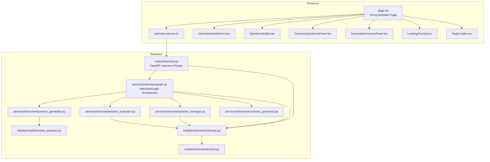
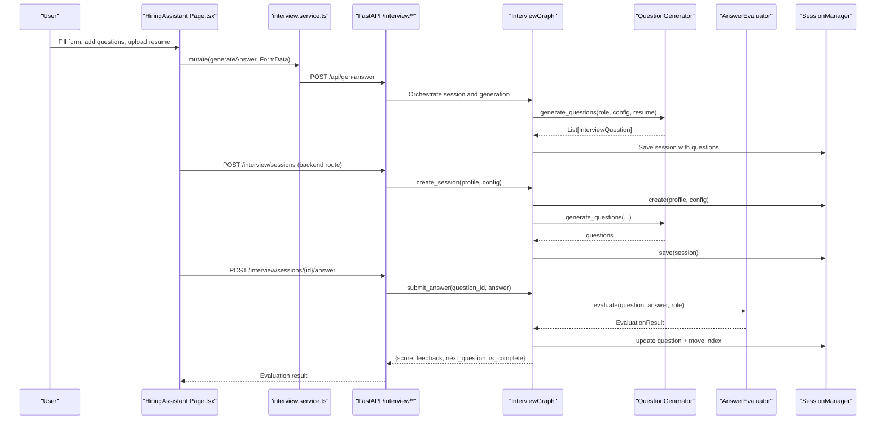
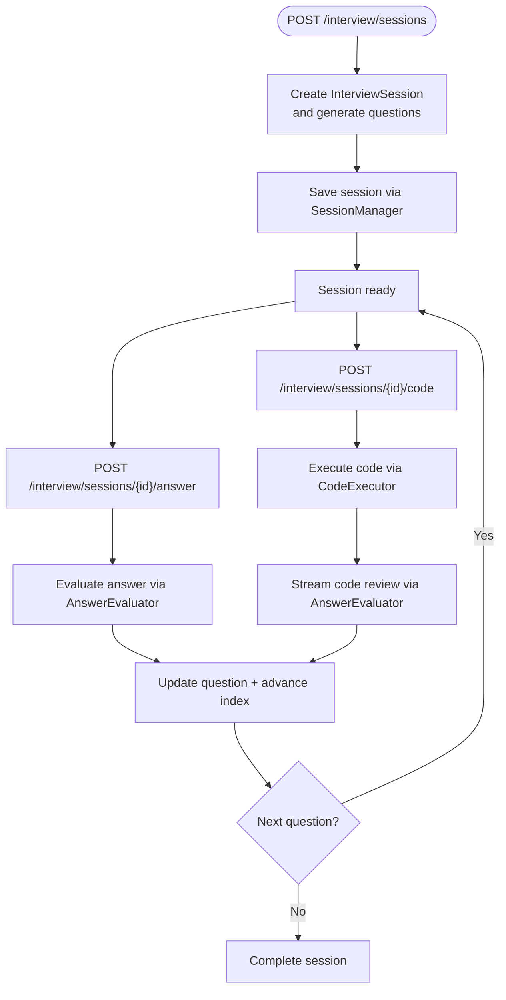
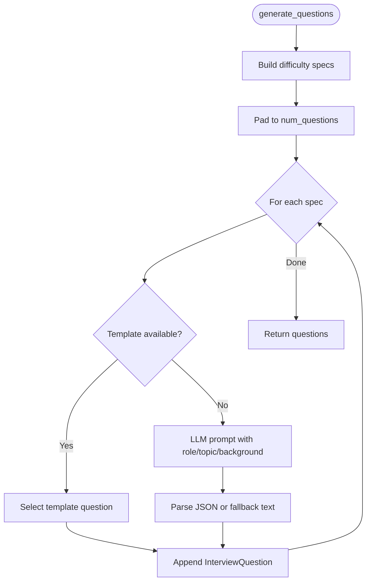
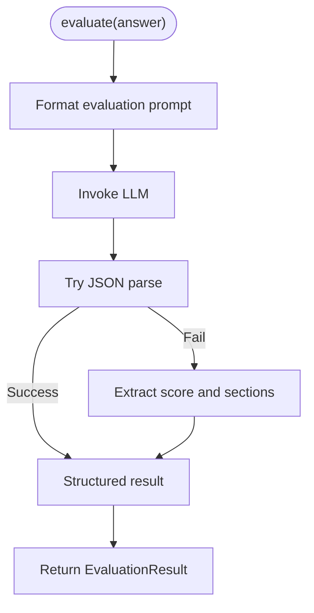
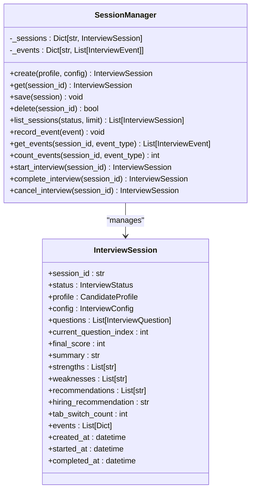
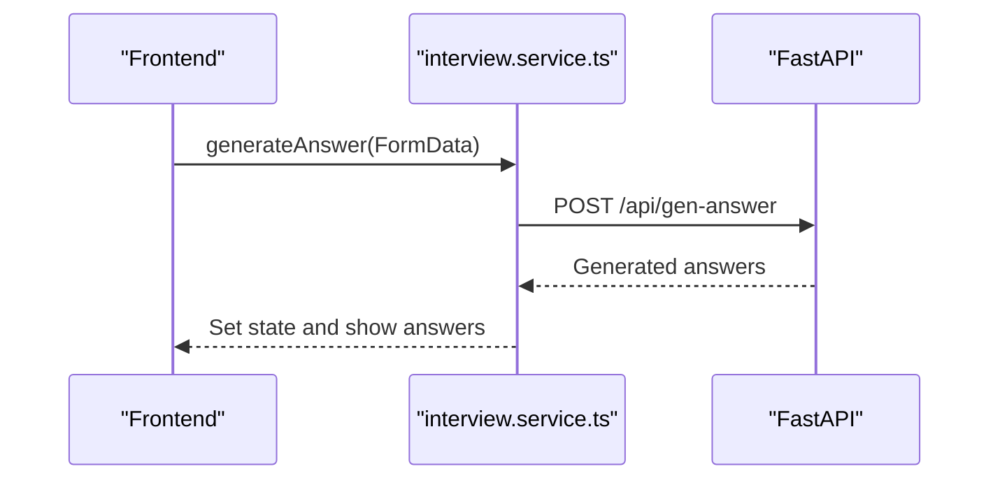
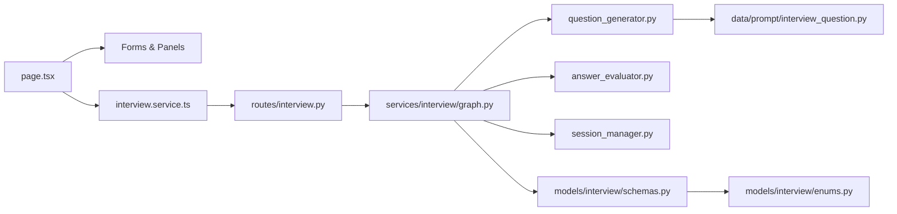

# Hiring assistant components

## Introduction
This page explains the Hiring Assistant components that power AI-driven interview preparation. It covers the frontend panels for configuring interview parameters, editing questions, and displaying AI-generated answers, alongside shared loading overlays. It also documents the backend orchestration pipeline, including question generation, answer evaluation, session lifecycle, and integration with FastAPI routes. The goal is to help developers and product teams understand how the system works end-to-end, from user input to AI-powered outputs and backend orchestration.

## Project structure
The Hiring Assistant spans the frontend Next.js application and the backend FastAPI service. The frontend provides interactive UI panels and state management, while the backend orchestrates interview sessions, generates questions, evaluates answers, and persists state.

```mermaid
graph TB
subgraph "Frontend"
FA["page.tsx<br/>Hiring Assistant Page"]
FCQP["CommonQuestionsPanel.tsx"]
FGAP["GeneratedAnswersPanel.tsx"]
FIDF["InterviewDetailsForm.tsx"]
FQE["QuestionsEditor.tsx"]
FLO["LoadingOverlay.tsx"]
FPL["PageLoader.tsx"]
FIS["interview.service.ts"]
end
subgraph "Backend"
BR["routes/interview.py<br/>FastAPI Interview Routes"]
BG["services/interview/graph.py<br/>InterviewGraph Orchestrator"]
QG["services/interview/question_generator.py"]
AE["services/interview/answer_evaluator.py"]
SM["services/interview/session_manager.py"]
SG["services/interview/summary_generator.py"]
SC["models/interview/schemas.py"]
EN["models/interview/enums.py"]
PR["data/prompt/interview_question.py"]
end
FA --> FIS
FA --> FIDF
FA --> FQE
FA --> FCQP
FA --> FGAP
FA --> FLO
FA --> FPL
FIS --> BR
BR --> BG
BG --> QG
BG --> AE
BG --> SM
BG --> SG
QG --> PR
AE --> SC
BG --> SC
SM --> SC
BR --> SC
SC --> EN
```

## Core components
- InterviewDetailsForm: Collects role, company, word limit, optional company knowledge, and website.
- QuestionsEditor: Manages a dynamic list of custom interview questions with add/remove and live editing.
- CommonQuestionsPanel: Provides quick-add buttons for standard interview prompts.
- GeneratedAnswersPanel: Renders AI-generated answers with copy/download capabilities and empty-state messaging.
- Shared Loading Components: PageLoader for initial page load and LoadingOverlay for generation requests.

These components integrate with frontend state hooks and a mutation to generate answers, then render the results in the answers panel.

## Architecture overview
The end-to-end flow begins on the frontend page, which validates inputs, composes a multipart/form-data payload, and triggers a mutation to generate answers. On the backend, FastAPI routes delegate to an orchestration graph that manages sessions, generates questions, and evaluates answers. The evaluation can be streamed via Server-Sent Events.

```mermaid
sequenceDiagram
participant U as "User"
participant FE as "HiringAssistant Page.tsx"
participant SVC as "interview.service.ts"
participant API as "FastAPI /interview/*"
participant G as "InterviewGraph"
participant Q as "QuestionGenerator"
participant E as "AnswerEvaluator"
participant S as "SessionManager"
U->>FE : Fill form, add questions, upload resume
FE->>SVC : mutate(generateAnswer, FormData)
SVC->>API : POST /api/gen-answer
API->>G : Orchestrate session and generation
G->>Q : generate_questions(role, config, resume)
Q-->>G : List[InterviewQuestion]
G->>S : Save session with questions
FE->>API : POST /interview/sessions (backend route)
API->>G : create_session(profile, config)
G->>S : create(profile, config)
G->>Q : generate_questions(...)
Q-->>G : questions
G->>S : save(session)
FE->>API : POST /interview/sessions/{id}/answer
API->>G : submit_answer(question_id, answer)
G->>E : evaluate(question, answer, role)
E-->>G : EvaluationResult
G->>S : update question + move index
G-->>API : {score, feedback, next_question, is_complete}
API-->>FE : Evaluation result
```

## Detailed component analysis

### InterviewDetailsForm
- Purpose: Capture essential interview configuration including role, company, word limit, optional company knowledge, and website.
- Behavior: Two-column layout for role/company; numeric input for word limit with min/max constraints; textarea for optional knowledge; input for optional website.
- Integration: Props accept a formData object and a handler to update fields.

### QuestionsEditor
- Purpose: Allow users to add, edit, and remove interview questions dynamically.
- Behavior: Renders a vertical stack of textareas; adds/removes entries; shows a default empty-state with an Add button; enforces minimum one question.
- Integration: Exposes callbacks to add/remove/update questions; integrates with the page's state.

### CommonQuestionsPanel
- Purpose: Provide quick-add buttons for frequently used interview prompts.
- Behavior: Displays a scrollable grid of common questions; clicking a button adds it to the editor if not present; limits display to a subset.
- Integration: Receives a list of common questions and a callback to add a selected question.

### GeneratedAnswersPanel
- Purpose: Render AI-generated answers with copy and download actions.
- Behavior: Shows a list of question-answer pairs with animated reveal; displays empty-state with illustration and guidance when no answers are present; supports copying answers to clipboard and downloading as text.
- Integration: Accepts generatedAnswers map, formData for context, and action handlers.

### Shared loading components
- PageLoader: Fullscreen loader shown while the page initializes.
- LoadingOverlay: Overlay shown during generation requests with animated pulse indicators.

### Backend orchestration and workflows

#### Interview simulation workflow
- Session creation: The backend route accepts a profile and config, delegates to the graph, which creates a session, generates questions, and marks it in progress.
- Answer evaluation: The route submits an answer; the graph evaluates it and updates the session state, advancing to the next question or completing the session.
- Streaming evaluation: The route supports SSE streaming for real-time feedback tokens.
- Code execution: For coding questions, the backend executes code and optionally streams a code review.
- Summary generation: The backend can generate a final summary and update session metadata.

```mermaid
flowchart TD
Start(["POST /interview/sessions"]) --> Create["Create InterviewSession<br/>and generate questions"]
Create --> Save["Save session via SessionManager"]
Save --> Ready["Session ready"]
Ready --> Answer["POST /interview/sessions/{id}/answer"]
Answer --> Eval["Evaluate answer via AnswerEvaluator"]
Eval --> Update["Update question + advance index"]
Update --> Next{"Next question?"}
Next --> |Yes| Ready
Next --> |No| Complete["Complete session"]
Ready --> Code["POST /interview/sessions/{id}/code"]
Code --> Exec["Execute code via CodeExecutor"]
Exec --> Review["Stream code review via AnswerEvaluator"]
Review --> Update
```

#### Question generation logic
- Inputs: Role, number of questions, difficulty distribution, optional template/topic/resume data.
- Strategy: Builds a spec list from difficulty distribution, pads to requested count, optionally uses a template bank, otherwise generates via LLM with a structured prompt.
- Output: A list of InterviewQuestion objects with metadata like expected keywords and follow-up questions.

```mermaid
flowchart TD
QStart(["generate_questions"]) --> Specs["Build difficulty specs"]
Specs --> Pad["Pad to num_questions"]
Pad --> ForEach{"For each spec"}
ForEach --> Template{"Template available?"}
Template --> |Yes| UseT["Select template question"]
Template --> |No| LLM["LLM prompt with role/topic/background"]
UseT --> Append["Append InterviewQuestion"]
LLM --> Parse["Parse JSON or fallback text"]
Parse --> Append
Append --> ForEach
ForEach --> |Done| Return["Return questions"]
```

#### Answer evaluation criteria
- Non-streaming: Returns a structured result with score, feedback, strengths, and improvements.
- Streaming: Emits partial tokens until completion; parser extracts score and structured sections.
- Parsing: Attempts JSON extraction; falls back to markdown patterns to extract score and bullet lists.

```mermaid
flowchart TD
EvalStart(["evaluate(answer)"]) --> Prompt["Format evaluation prompt"]
Prompt --> Invoke["Invoke LLM"]
Invoke --> Parse["Try JSON parse"]
Parse --> |Success| Result["Structured result"]
Parse --> |Fail| Regex["Extract score and sections"]
Regex --> Result
Result --> Return["Return EvaluationResult"]
```

#### State management for interview sessions
- In-memory session storage keyed by session_id; tracks events and counts.
- Supports CRUD operations, listing with filters, and status transitions.
- Integrates with the orchestration graph to persist questions, answers, scores, and timestamps.

```mermaid
classDiagram
class SessionManager {
-_sessions : Dict[str, InterviewSession]
-_events : Dict[str, List[InterviewEvent]]
+create(profile, config) InterviewSession
+get(session_id) InterviewSession
+save(session) void
+delete(session_id) bool
+list_sessions(status, limit) List[InterviewSession]
+record_event(event) void
+get_events(session_id, event_type) List[InterviewEvent]
+count_events(session_id, event_type) int
+start_interview(session_id) InterviewSession
+complete_interview(session_id) InterviewSession
+cancel_interview(session_id) InterviewSession
}
class InterviewSession {
+session_id : str
+status : InterviewStatus
+profile : CandidateProfile
+config : InterviewConfig
+questions : List[InterviewQuestion]
+current_question_index : int
+final_score : int
+summary : str
+strengths : List[str]
+weaknesses : List[str]
+recommendations : List[str]
+hiring_recommendation : str
+tab_switch_count : int
+events : List[Dict]
+created_at : datetime
+started_at : datetime
+completed_at : datetime
}
SessionManager --> InterviewSession : "manages"
```

#### Integration with backend interview APIs
- Frontend service: Provides a simple client for GET/DELETE interviews and POST to generate answers.
- Backend routes: Offer session creation, retrieval, deletion, answer submission (streaming and non-streaming), code execution (streaming and non), summary generation (streaming and non), and event recording.

```mermaid
sequenceDiagram
participant FE as "Frontend"
participant SVC as "interview.service.ts"
participant API as "FastAPI"
FE->>SVC : generateAnswer(FormData)
SVC->>API : POST /api/gen-answer
API-->>SVC : Generated answers
SVC-->>FE : Set state and show answers
```

## Dependency analysis
- Frontend depends on:
  - UI components for forms and panels
  - State hooks for form data and questions
  - A service client for API calls
- Backend depends on:
  - LangChain LLM integration for question generation and evaluation
  - Prompt templates for structured generation
  - Pydantic models for typed request/response and session state
  - Graph orchestration to coordinate services

```mermaid
graph LR
FE_Page["page.tsx"] --> FE_Forms["Forms & Panels"]
FE_Page --> FE_Service["interview.service.ts"]
FE_Service --> BE_Routes["routes/interview.py"]
BE_Routes --> BE_Graph["services/interview/graph.py"]
BE_Graph --> BE_QGen["question_generator.py"]
BE_Graph --> BE_Eval["answer_evaluator.py"]
BE_Graph --> BE_Session["session_manager.py"]
BE_QGen --> BE_Prompt["data/prompt/interview_question.py"]
BE_Graph --> BE_Schemas["models/interview/schemas.py"]
BE_Schemas --> BE_Enums["models/interview/enums.py"]
```

## Performance considerations
- Streaming evaluations reduce perceived latency by rendering feedback incrementally.
- In-memory session storage is efficient for small-scale usage; consider persistence to a database for production.
- Prompt templating and structured JSON parsing improve reliability and reduce hallucinations.
- Avoid excessive concurrent generations; throttle requests and use overlays to prevent redundant submissions.

## Troubleshooting guide
- Missing inputs: The frontend validates resume selection, role/company, and at least one question before generating answers.
- Generation failures: The frontend shows a toast with error details; ensure network connectivity and backend health.
- Session not found: Backend routes return 404 when sessions or questions are missing; verify IDs and state transitions.
- Streaming errors: SSE endpoints emit error events; check browser console and network tab for disconnections.

## Conclusion
The Hiring Assistant combines a user-friendly frontend with a reliable backend orchestration pipeline. The frontend panels streamline configuration and answer viewing, while the backend uses LLMs, structured prompts, and a session manager to deliver personalized interview experiences. The modular design enables future enhancements such as persistence, richer evaluation criteria, and expanded coding capabilities.
