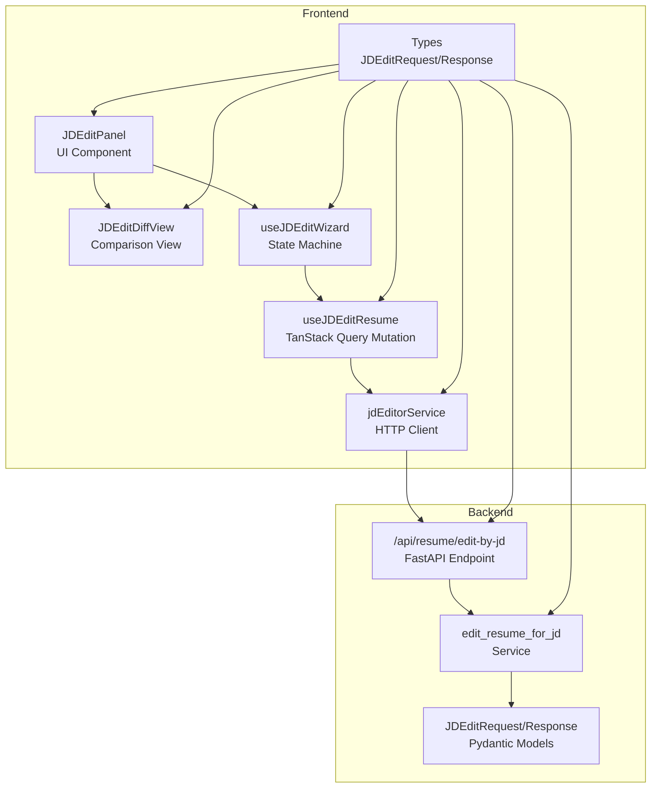
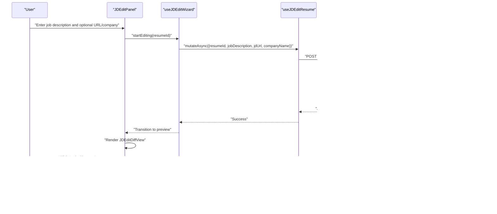
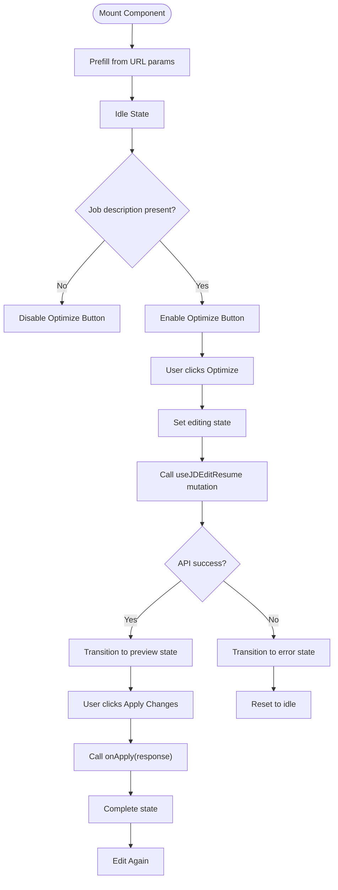
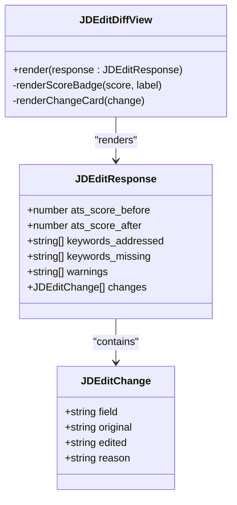
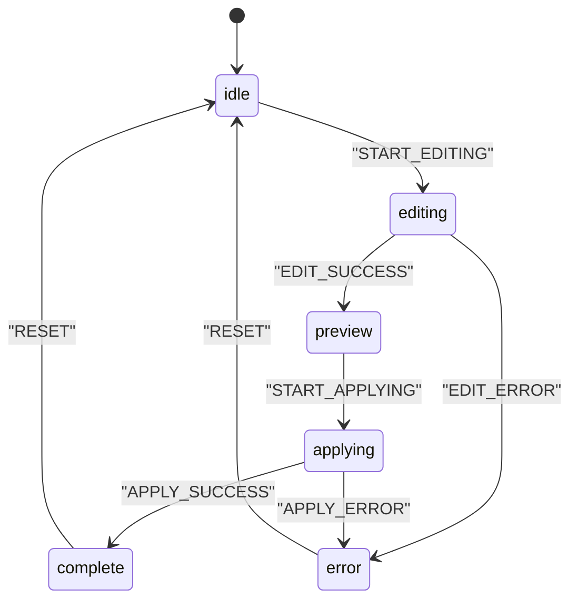
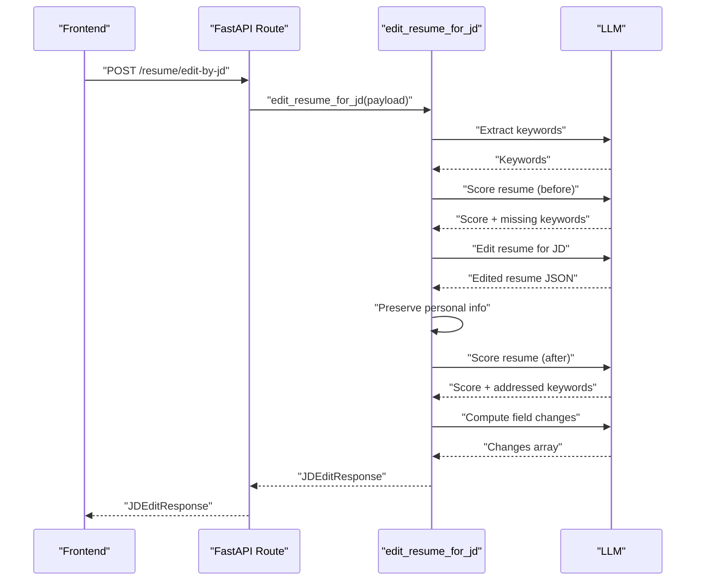
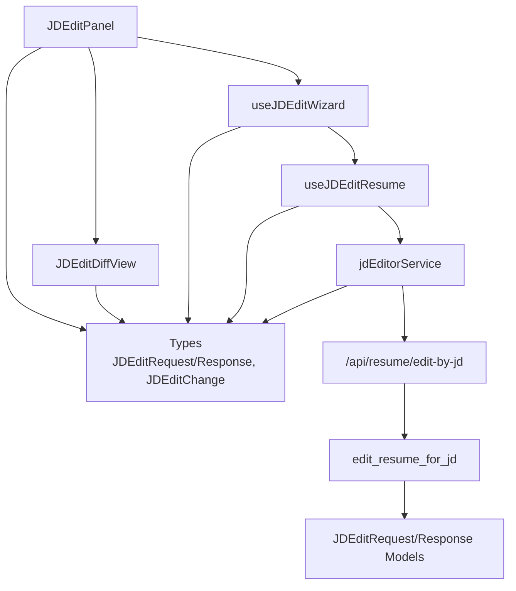

# Job description editor components

## Introduction
This page provides detailed technical documentation for the job description editor components in the TalentSync project. It focuses on two primary UI components:
- JDEditPanel: A rich editing panel for job description-driven resume optimization with validation, preview, and apply workflows.
- JDEditDiffView: A detailed comparison view that displays ATS score changes, keyword analysis, warnings, and field-level diffs.

The documentation explains the editing workflow, content validation, preview functionality, and integration with backend job description management APIs. It also covers collaborative editing features, version control, and export capabilities for job descriptions.

## Project structure
The job description editor feature spans both frontend and backend layers:
- Frontend components and hooks manage user interactions, state transitions, and API communication.
- Backend services orchestrate LLM-based processing, keyword extraction, scoring, and diff computation.
- Shared types define the request/response contracts and UI state machine.

```mermaid
graph TB
subgraph "Frontend"
Panel["JDEditPanel<br/>UI Component"]
Diff["JDEditDiffView<br/>Comparison View"]
Wizard["useJDEditWizard<br/>State Machine"]
Query["useJDEditResume<br/>TanStack Query Mutation"]
Service["jdEditorService<br/>HTTP Client"]
Types["Types<br/>JDEditRequest/Response"]
end
subgraph "Backend"
Route["/api/resume/edit-by-jd<br/>FastAPI Endpoint"]
ServiceB["edit_resume_for_jd<br/>Service"]
Schemas["JDEditRequest/Response<br/>Pydantic Models"]
end
Panel --> Diff
Panel --> Wizard
Wizard --> Query
Query --> Service
Service --> Route
Route --> ServiceB
ServiceB --> Schemas
Types --> Panel
Types --> Diff
Types --> Wizard
Types --> Query
Types --> Service
Types --> Route
Types --> ServiceB
```

## Core components
This section documents the core components and their responsibilities.

- JDEditPanel
  - Purpose: Provides a form for job description input, optional JD URL and company name, and triggers the optimization workflow. Displays loading states and the preview with apply controls.
  - Key behaviors:
    - Prefills fields from URL query parameters.
    - Validates that job description is present before enabling the optimize action.
    - Delegates optimization to the wizard hook and displays the diff preview upon success.
    - Handles apply actions via a callback to persist changes to the database.
  - Integration points:
    - Uses useJDEditWizard for state management.
    - Renders JDEditDiffView for preview.
    - Calls onApply to finalize changes.

- JDEditDiffView
  - Purpose: Visualizes the optimization results with ATS score change, addressed/missing keywords, warnings, and field-level before/after diffs.
  - Key behaviors:
    - Computes score delta and color-codes ATS scores.
    - Lists keywords addressed and missing.
    - Displays warnings surfaced by the backend.
    - Renders per-field changes with original and edited values and reasons.

- useJDEditWizard
  - Purpose: Implements a finite state machine for the editing workflow and orchestrates API calls.
  - States: idle → editing → preview → applying → complete/error.
  - Responsibilities:
    - Manages form fields (job description, JD URL, company name).
    - Starts editing by invoking the mutation hook.
    - Handles errors and transitions to error state.
    - Exposes helpers to mark applying, success, and error for the apply phase.
    - Provides computed flags for UI rendering (canEdit, isEditing, hasPreview).

- useJDEditResume
  - Purpose: TanStack Query mutation wrapper around the JD editor service.
  - Responsibilities:
    - Executes the edit operation.
    - Displays user feedback via toast on error.

- jdEditorService
  - Purpose: HTTP client for the JD editor endpoint.
  - Responsibilities:
    - Sends edit requests with resumeId, jobDescription, optional jdUrl, and companyName.
    - Returns JDEditResponse typed data.

- Types
  - JDEditRequest/JDEditResponse: Define the contract between frontend and backend.
  - JDEditChange: Describes individual field-level changes with reason.
  - JDEditState/JDEditStep: Define the UI state machine.

## Architecture overview
The system follows a clear separation of concerns:
- Frontend UI components render forms and previews.
- Hooks manage state and orchestrate asynchronous operations.
- Services encapsulate HTTP communication.
- Backend FastAPI routes delegate to service functions that coordinate LLM prompts and computations.

```mermaid
sequenceDiagram
participant User as "User"
participant Panel as "JDEditPanel"
participant Wizard as "useJDEditWizard"
participant Query as "useJDEditResume"
participant Service as "jdEditorService"
participant API as "FastAPI Route"
participant Svc as "edit_resume_for_jd"
User->>Panel : "Enter job description and optional URL/company"
Panel->>Wizard : "startEditing(resumeId)"
Wizard->>Query : "mutateAsync({resumeId, jobDescription, jdUrl, companyName})"
Query->>Service : "POST /api/resume/edit-by-jd"
Service->>API : "Forward request"
API->>Svc : "Call service function"
Svc-->>API : "JDEditResponse"
API-->>Service : "JDEditResponse"
Service-->>Query : "JDEditResponse"
Query-->>Wizard : "Success"
Wizard-->>Panel : "Transition to preview"
Panel->>Panel : "Render JDEditDiffView"
User->>Panel : "Click Apply Changes"
Panel->>Panel : "onApply(response)"
Panel-->>User : "Show completion/reset option"
```

## Detailed component analysis

### JDEditPanel analysis
JDEditPanel is the primary UI surface for job description editing. It manages:
- Form inputs for job description, optional JD URL, and company name.
- Validation to ensure job description is present before enabling optimization.
- Loading state during backend processing.
- Preview rendering via JDEditDiffView.
- Apply workflow with error handling and success feedback.

```mermaid
flowchart TD
Start(["Mount Component"]) --> Prefill["Prefill from URL params"]
Prefill --> Idle["Idle State"]
Idle --> Validate{"Job description present?"}
Validate --> |No| Disabled["Disable Optimize Button"]
Validate --> |Yes| Enabled["Enable Optimize Button"]
Enabled --> ClickOptimize["User clicks Optimize"]
ClickOptimize --> Editing["Set editing state"]
Editing --> CallAPI["Call useJDEditResume mutation"]
CallAPI --> Success{"API success?"}
Success --> |Yes| Preview["Transition to preview state"]
Success --> |No| Error["Transition to error state"]
Preview --> Apply["User clicks Apply Changes"]
Apply --> OnApply["Call onApply(response)"]
OnApply --> Complete["Complete state"]
Error --> Reset["Reset to idle"]
Complete --> Restart["Edit Again"]
```

### JDEditDiffView analysis
JDEditDiffView renders the optimization results:
- ATS Score Change: Before/After scores with delta indicator.
- Keywords: Addressed and missing keywords with counts.
- Warnings: Non-fatal issues surfaced by the backend.
- Field Changes: Per-field diffs with original and edited values and reasons.

```mermaid
classDiagram
class JDEditDiffView {
+render(response : JDEditResponse)
-renderScoreBadge(score, label)
-renderChangeCard(change)
}
class JDEditResponse {
+number ats_score_before
+number ats_score_after
+string[] keywords_addressed
+string[] keywords_missing
+string[] warnings
+JDEditChange[] changes
}
class JDEditChange {
+string field
+string original
+string edited
+string reason
}
JDEditDiffView --> JDEditResponse : "renders"
JDEditResponse --> JDEditChange : "contains"
```

### useJDEditWizard analysis
The wizard hook implements a state machine with explicit transitions:
- SET_FIELD: Updates form fields.
- START_EDITING: Enters editing state and clears previous response/error.
- EDIT_SUCCESS: Receives response and transitions to preview.
- EDIT_ERROR: Captures and surfaces errors.
- START_APPLYING/APPLY_SUCCESS/APPLY_ERROR: Manage the apply phase lifecycle.
- RESET: Returns to initial state.

```mermaid
stateDiagram-v2
[*] --> idle
idle --> editing : "START_EDITING"
editing --> preview : "EDIT_SUCCESS"
editing --> error : "EDIT_ERROR"
preview --> applying : "START_APPLYING"
applying --> complete : "APPLY_SUCCESS"
applying --> error : "APPLY_ERROR"
error --> idle : "RESET"
complete --> idle : "RESET"
```

### Backend service and API integration
The backend service performs the following steps:
- Validates inputs and resolves job description from URL if text is not provided.
- Extracts keywords from the job description.
- Scores the resume before editing.
- Edits the resume to align with the job description using LLM prompts.
- Preserves personal identity fields.
- Scores the edited resume and computes differences.
- Returns a detailed response including changes, diffs, and warnings.

```mermaid
sequenceDiagram
participant Client as "Frontend"
participant Route as "FastAPI Route"
participant Service as "edit_resume_for_jd"
participant LLM as "LLM"
Client->>Route : "POST /resume/edit-by-jd"
Route->>Service : "edit_resume_for_jd(payload)"
Service->>LLM : "Extract keywords"
LLM-->>Service : "Keywords"
Service->>LLM : "Score resume (before)"
LLM-->>Service : "Score + missing keywords"
Service->>LLM : "Edit resume for JD"
LLM-->>Service : "Edited resume JSON"
Service->>Service : "Preserve personal info"
Service->>LLM : "Score resume (after)"
LLM-->>Service : "Score + addressed keywords"
Service->>LLM : "Compute field changes"
LLM-->>Service : "Changes array"
Service-->>Route : "JDEditResponse"
Route-->>Client : "JDEditResponse"
```

## Dependency analysis
The components and their dependencies form a cohesive pipeline:

```mermaid
graph TB
Types["Types<br/>JDEditRequest/Response, JDEditChange"]
Panel["JDEditPanel"]
Diff["JDEditDiffView"]
Wizard["useJDEditWizard"]
Query["useJDEditResume"]
Service["jdEditorService"]
Route["/api/resume/edit-by-jd"]
BackendSvc["edit_resume_for_jd"]
Schemas["JDEditRequest/Response Models"]
Panel --> Types
Diff --> Types
Wizard --> Types
Query --> Types
Service --> Types
Panel --> Wizard
Panel --> Diff
Wizard --> Query
Query --> Service
Service --> Route
Route --> BackendSvc
BackendSvc --> Schemas
```

## Performance considerations
- LLM latency: The optimization process involves multiple LLM calls (keyword extraction, scoring, editing, change computation). Network latency and model response times impact perceived performance.
- Debouncing and caching: Consider debouncing repeated edits and caching recent results to reduce redundant API calls.
- Progressive rendering: Render the preview progressively as the backend returns results to improve perceived responsiveness.
- Token limits: The editing prompt specifies a high token limit; ensure inputs are trimmed or summarized when necessary to avoid exceeding limits.

## Troubleshooting guide
Common issues and resolutions:
- Empty job description: The wizard prevents optimization until a job description is provided. Ensure users enter either text or a valid URL.
- JD URL resolution failures: If a URL is provided but cannot be fetched, the backend adds a warning and returns partial results. Verify the URL accessibility and network connectivity.
- LLM errors: Errors during LLM operations are caught and surfaced as warnings or errors. Retry the operation or adjust inputs.
- Apply failures: The apply phase is controlled by the parent component via onApply. Ensure the callback properly persists changes and calls markApplySuccess or markApplyError accordingly.

## Conclusion
The job description editor components provide a reliable, user-friendly workflow for optimizing resumes against specific job descriptions. The frontend components offer clear validation, rich previews, and smooth integration with backend services that use LLMs for keyword extraction, scoring, editing, and diff computation. The architecture supports extensibility for collaborative editing, version control, and export capabilities, enabling teams to refine and track changes effectively.
