# PDF Resume Generation Components

<cite>
**Referenced Files in This Document**
- [ConfigurationForm.tsx](file://frontend/components/pdf-resume/ConfigurationForm.tsx)
- [ExportTab.tsx](file://frontend/components/pdf-resume/ExportTab.tsx)
- [LatexOutput.tsx](file://frontend/components/pdf-resume/LatexOutput.tsx)
- [ResumePreview.tsx](file://frontend/components/pdf-resume/ResumePreview.tsx)
- [ResumeSourceSelector.tsx](file://frontend/components/pdf-resume/ResumeSourceSelector.tsx)
- [TailoringForm.tsx](file://frontend/components/pdf-resume/TailoringForm.tsx)
- [latexGenerator.ts](file://frontend/utils/latexGenerator.ts)
- [latexEscape.ts](file://frontend/utils/latexEscape.ts)
- [resume-gen.service.ts](file://frontend/services/resume-gen.service.ts)
- [tailored-resume/route.ts](file://frontend/app/api/(backend-interface)/tailored-resume/route.ts)
- [graph.py](file://backend/app/services/resume_generator/graph.py)
</cite>

## Table of Contents
1. [Introduction](#introduction)
2. [Project Structure](#project-structure)
3. [Core Components](#core-components)
4. [Architecture Overview](#architecture-overview)
5. [Detailed Component Analysis](#detailed-component-analysis)
6. [Dependency Analysis](#dependency-analysis)
7. [Performance Considerations](#performance-considerations)
8. [Troubleshooting Guide](#troubleshooting-guide)
9. [Conclusion](#conclusion)

## Introduction
This document explains the PDF resume generation system, focusing on the frontend components that enable users to customize, preview, and export professional resumes. It covers the configuration options, export formats, LaTeX generation process, template system, styling options, and integration with backend APIs. The goal is to help developers and technical users understand how the resume generation pipeline works from UI interactions to backend processing and final output delivery.

## Project Structure
The resume generation feature is organized into reusable React components and supporting utilities, with clear separation between UI, data orchestration, and LaTeX generation logic. The frontend components communicate with Next.js API routes, which act as bridges to the backend services responsible for resume tailoring and PDF generation.

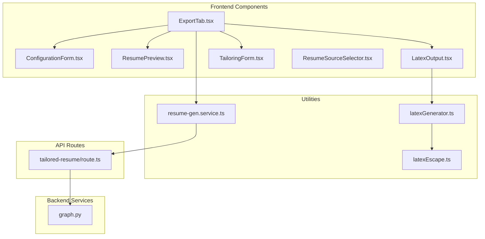

**Diagram sources**
- [ExportTab.tsx](file://frontend/components/pdf-resume/ExportTab.tsx#L1-L293)
- [ConfigurationForm.tsx](file://frontend/components/pdf-resume/ConfigurationForm.tsx#L1-L158)
- [TailoringForm.tsx](file://frontend/components/pdf-resume/TailoringForm.tsx#L1-L130)
- [ResumePreview.tsx](file://frontend/components/pdf-resume/ResumePreview.tsx#L1-L277)
- [LatexOutput.tsx](file://frontend/components/pdf-resume/LatexOutput.tsx#L1-L83)
- [ResumeSourceSelector.tsx](file://frontend/components/pdf-resume/ResumeSourceSelector.tsx#L1-L271)
- [latexGenerator.ts](file://frontend/utils/latexGenerator.ts#L1-L347)
- [latexEscape.ts](file://frontend/utils/latexEscape.ts#L1-L50)
- [resume-gen.service.ts](file://frontend/services/resume-gen.service.ts#L1-L20)
- [tailored-resume/route.ts](file://frontend/app/api/(backend-interface)/tailored-resume/route.ts#L1-L366)
- [graph.py](file://backend/app/services/resume_generator/graph.py#L1-L266)

**Section sources**
- [ExportTab.tsx](file://frontend/components/pdf-resume/ExportTab.tsx#L1-L293)
- [ConfigurationForm.tsx](file://frontend/components/pdf-resume/ConfigurationForm.tsx#L1-L158)
- [TailoringForm.tsx](file://frontend/components/pdf-resume/TailoringForm.tsx#L1-L130)
- [ResumePreview.tsx](file://frontend/components/pdf-resume/ResumePreview.tsx#L1-L277)
- [LatexOutput.tsx](file://frontend/components/pdf-resume/LatexOutput.tsx#L1-L83)
- [ResumeSourceSelector.tsx](file://frontend/components/pdf-resume/ResumeSourceSelector.tsx#L1-L271)
- [latexGenerator.ts](file://frontend/utils/latexGenerator.ts#L1-L347)
- [latexEscape.ts](file://frontend/utils/latexEscape.ts#L1-L50)
- [resume-gen.service.ts](file://frontend/services/resume-gen.service.ts#L1-L20)
- [tailored-resume/route.ts](file://frontend/app/api/(backend-interface)/tailored-resume/route.ts#L1-L366)
- [graph.py](file://backend/app/services/resume_generator/graph.py#L1-L266)

## Core Components
This section introduces the primary components involved in the resume generation workflow:

- ConfigurationForm: Allows users to choose a resume template, color scheme, and font size.
- TailoringForm: Enables job-specific customization by providing job role, company details, and job description.
- ExportTab: Orchestrates the entire export process, including resume tailoring, preview generation, LaTeX code generation, and PDF download.
- ResumePreview: Renders a human-readable preview of the resume data.
- LatexOutput: Displays generated LaTeX code and provides actions to copy or open in Overleaf.
- ResumeSourceSelector: Lets users select an existing resume or upload a new one.
- latexGenerator: Provides LaTeX templates and generation utilities.
- latexEscape: Ensures safe LaTeX compilation by escaping special characters.
- resume-gen.service: Frontend service for interacting with backend resume generation endpoints.
- tailored-resume/route.ts: Next.js API route that bridges frontend requests to backend services.
- graph.py: Backend service orchestrating resume tailoring with LLMs and tools.

**Section sources**
- [ConfigurationForm.tsx](file://frontend/components/pdf-resume/ConfigurationForm.tsx#L1-L158)
- [TailoringForm.tsx](file://frontend/components/pdf-resume/TailoringForm.tsx#L1-L130)
- [ExportTab.tsx](file://frontend/components/pdf-resume/ExportTab.tsx#L1-L293)
- [ResumePreview.tsx](file://frontend/components/pdf-resume/ResumePreview.tsx#L1-L277)
- [LatexOutput.tsx](file://frontend/components/pdf-resume/LatexOutput.tsx#L1-L83)
- [ResumeSourceSelector.tsx](file://frontend/components/pdf-resume/ResumeSourceSelector.tsx#L1-L271)
- [latexGenerator.ts](file://frontend/utils/latexGenerator.ts#L1-L347)
- [latexEscape.ts](file://frontend/utils/latexEscape.ts#L1-L50)
- [resume-gen.service.ts](file://frontend/services/resume-gen.service.ts#L1-L20)
- [tailored-resume/route.ts](file://frontend/app/api/(backend-interface)/tailored-resume/route.ts#L1-L366)
- [graph.py](file://backend/app/services/resume_generator/graph.py#L1-L266)

## Architecture Overview
The resume generation architecture follows a clear separation of concerns:
- Frontend components collect user preferences and trigger actions.
- ExportTab coordinates state and orchestrates API calls.
- Next.js API routes validate requests, enforce authentication, and forward to backend services.
- Backend services perform resume tailoring and prepare data for LaTeX generation.
- LaTeX utilities transform structured resume data into compilable LaTeX documents.

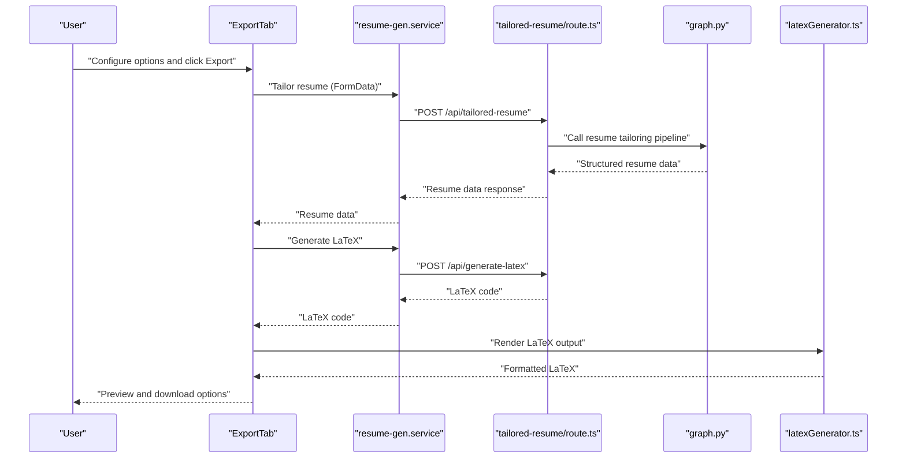

**Diagram sources**
- [ExportTab.tsx](file://frontend/components/pdf-resume/ExportTab.tsx#L50-L168)
- [resume-gen.service.ts](file://frontend/services/resume-gen.service.ts#L4-L18)
- [tailored-resume/route.ts](file://frontend/app/api/(backend-interface)/tailored-resume/route.ts#L43-L329)
- [graph.py](file://backend/app/services/resume_generator/graph.py#L74-L261)
- [latexGenerator.ts](file://frontend/utils/latexGenerator.ts#L343-L347)

## Detailed Component Analysis

### ConfigurationForm
ConfigurationForm provides three customization controls:
- Template selection: Professional or Modern.
- Color scheme: Gray, Blue, Green, Red.
- Font size: Slider from 8pt to 12pt.

These options influence the LaTeX output styling and structure.

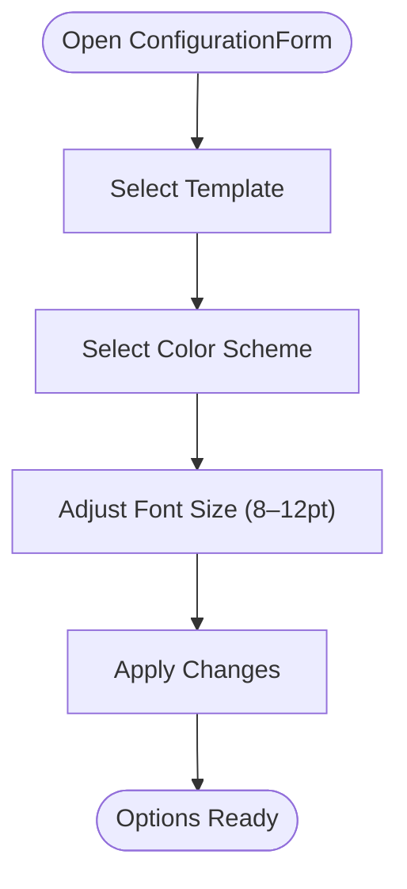

**Diagram sources**
- [ConfigurationForm.tsx](file://frontend/components/pdf-resume/ConfigurationForm.tsx#L46-L154)

**Section sources**
- [ConfigurationForm.tsx](file://frontend/components/pdf-resume/ConfigurationForm.tsx#L1-L158)

### TailoringForm
TailoringForm enables job-specific resume tailoring:
- Toggle for enabling tailoring.
- Required job role.
- Optional company name, website, and job description.

When enabled, these inputs are sent to the backend to tailor the resume data.

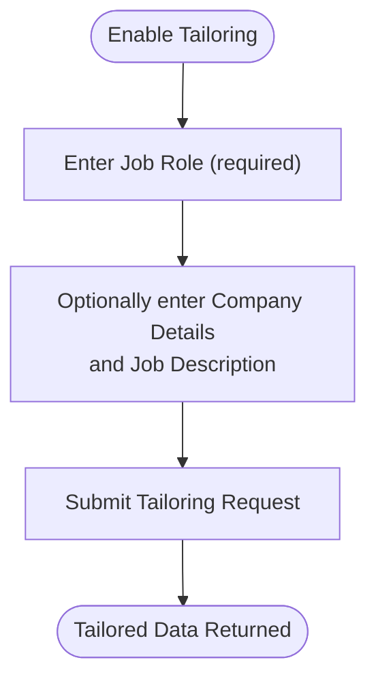

**Diagram sources**
- [TailoringForm.tsx](file://frontend/components/pdf-resume/TailoringForm.tsx#L55-L126)

**Section sources**
- [TailoringForm.tsx](file://frontend/components/pdf-resume/TailoringForm.tsx#L1-L130)

### ExportTab
ExportTab is the central orchestrator:
- Manages state for configuration, tailoring, preview, and LaTeX output.
- Handles preview generation, LaTeX generation, and PDF download.
- Integrates with API mutations for tailor, LaTeX generation, and PDF download.
- Displays loading overlays during generation and shows success/error notifications.

Key flows:
- Preview: Calls tailor mutation, sets parsed data, and renders ResumePreview.
- LaTeX: Builds PdfGenerationRequest with selected template and options, calls generate LaTeX mutation, and displays LatexOutput.
- PDF: Builds PdfGenerationRequest, calls download mutation, handles Blob download, and falls back to LaTeX if PDF service is unavailable.

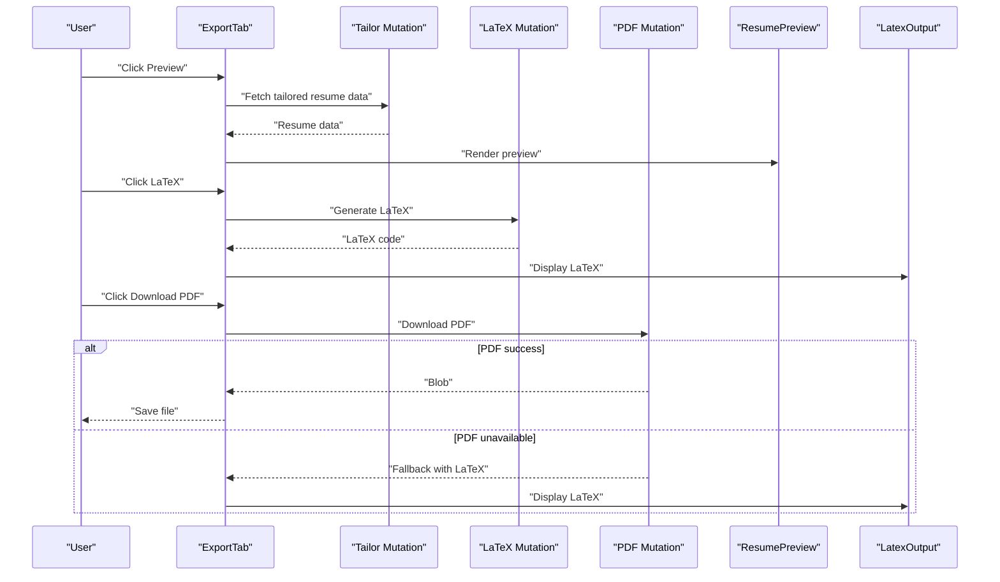

**Diagram sources**
- [ExportTab.tsx](file://frontend/components/pdf-resume/ExportTab.tsx#L50-L168)
- [ResumePreview.tsx](file://frontend/components/pdf-resume/ResumePreview.tsx#L11-L14)
- [LatexOutput.tsx](file://frontend/components/pdf-resume/LatexOutput.tsx#L11-L15)

**Section sources**
- [ExportTab.tsx](file://frontend/components/pdf-resume/ExportTab.tsx#L1-L293)

### ResumePreview
ResumePreview renders a readable preview of the resume data:
- Header with name and contact information.
- Sections for Education, Skills, Languages, Experience, Projects, Publications, Positions of Responsibility, Certifications, and Achievements.
- Uses markdown rendering for rich text display.

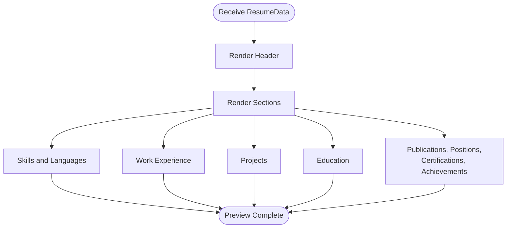

**Diagram sources**
- [ResumePreview.tsx](file://frontend/components/pdf-resume/ResumePreview.tsx#L26-L272)

**Section sources**
- [ResumePreview.tsx](file://frontend/components/pdf-resume/ResumePreview.tsx#L1-L277)

### LatexOutput
LatexOutput presents the generated LaTeX code:
- Provides buttons to copy LaTeX to clipboard and open in Overleaf.
- Includes a textarea with the full LaTeX code.
- Offers manual compilation instructions.

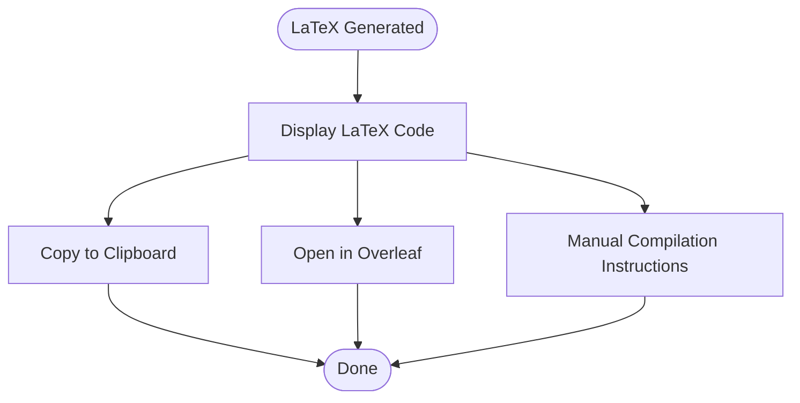

**Diagram sources**
- [LatexOutput.tsx](file://frontend/components/pdf-resume/LatexOutput.tsx#L20-L78)

**Section sources**
- [LatexOutput.tsx](file://frontend/components/pdf-resume/LatexOutput.tsx#L1-L83)

### ResumeSourceSelector
ResumeSourceSelector allows users to choose a resume source:
- Toggle between "Use Existing Resume" and "Upload New Resume".
- Dropdown to select from user's resumes with metadata.
- Drag-and-drop upload area for new resumes.

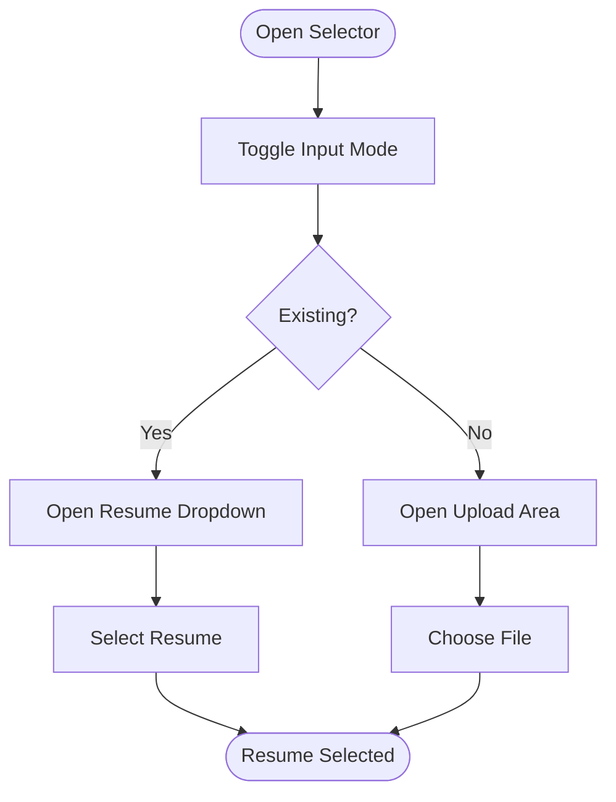

**Diagram sources**
- [ResumeSourceSelector.tsx](file://frontend/components/pdf-resume/ResumeSourceSelector.tsx#L46-L268)

**Section sources**
- [ResumeSourceSelector.tsx](file://frontend/components/pdf-resume/ResumeSourceSelector.tsx#L1-L271)

### LaTeX Generation Process and Template System
The LaTeX generation pipeline transforms structured resume data into compilable LaTeX:
- Templates: Professional and Modern, each with distinct styling and packages.
- Options: Font size, margins, and color scheme.
- Escaping: Special characters are escaped to ensure LaTeX compilation safety.
- Utilities: Helper functions format lists, sanitize headers, and escape text.

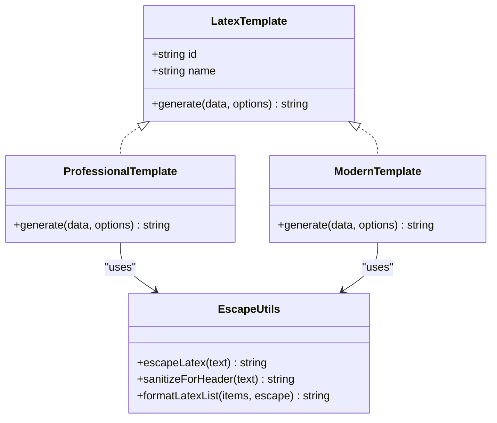

**Diagram sources**
- [latexGenerator.ts](file://frontend/utils/latexGenerator.ts#L5-L171)
- [latexEscape.ts](file://frontend/utils/latexEscape.ts#L8-L49)

**Section sources**
- [latexGenerator.ts](file://frontend/utils/latexGenerator.ts#L1-L347)
- [latexEscape.ts](file://frontend/utils/latexEscape.ts#L1-L50)

### Backend Integration and Resume Tailoring
The frontend communicates with backend services through Next.js API routes:
- Authentication: Session-based checks ensure authorized access.
- Tailoring: Two pathways—file upload (v1) or existing resume text (v2).
- Validation: Ensures required fields and prevents conflicting inputs.
- Error handling: Graceful handling of timeouts, non-JSON responses, and access restrictions.
- Pipeline: Backend orchestrates LLM-based tailoring and returns structured data.

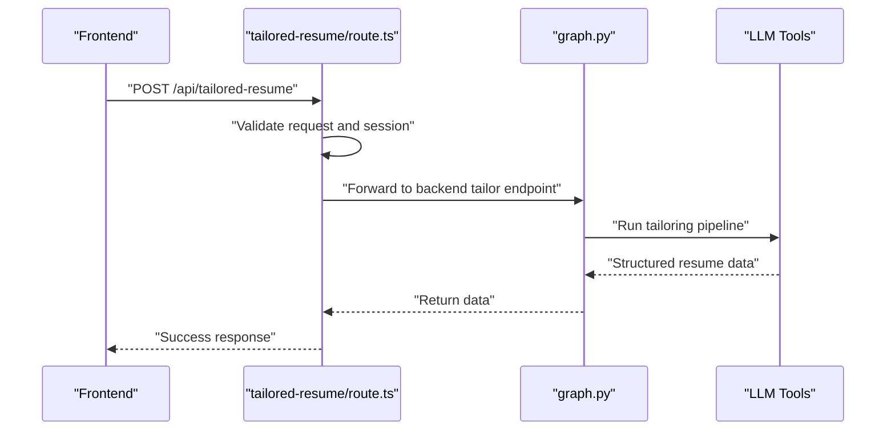

**Diagram sources**
- [tailored-resume/route.ts](file://frontend/app/api/(backend-interface)/tailored-resume/route.ts#L43-L329)
- [graph.py](file://backend/app/services/resume_generator/graph.py#L74-L261)

**Section sources**
- [tailored-resume/route.ts](file://frontend/app/api/(backend-interface)/tailored-resume/route.ts#L1-L366)
- [graph.py](file://backend/app/services/resume_generator/graph.py#L1-L266)

## Dependency Analysis
The components and utilities depend on each other as follows:
- ExportTab depends on TailoringForm, ConfigurationForm, ResumePreview, LatexOutput, and resume-gen.service.
- LatexOutput depends on latexGenerator and latexEscape.
- ExportTab also integrates with Next.js API routes for backend communication.
- ResumeSourceSelector supports input modes for existing resumes and uploads.

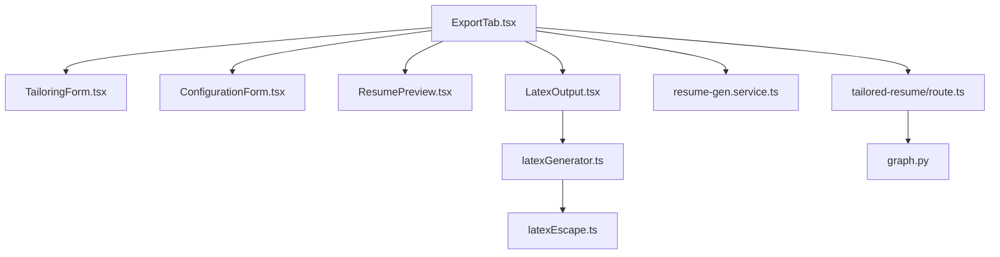

**Diagram sources**
- [ExportTab.tsx](file://frontend/components/pdf-resume/ExportTab.tsx#L1-L293)
- [TailoringForm.tsx](file://frontend/components/pdf-resume/TailoringForm.tsx#L1-L130)
- [ConfigurationForm.tsx](file://frontend/components/pdf-resume/ConfigurationForm.tsx#L1-L158)
- [ResumePreview.tsx](file://frontend/components/pdf-resume/ResumePreview.tsx#L1-L277)
- [LatexOutput.tsx](file://frontend/components/pdf-resume/LatexOutput.tsx#L1-L83)
- [latexGenerator.ts](file://frontend/utils/latexGenerator.ts#L1-L347)
- [latexEscape.ts](file://frontend/utils/latexEscape.ts#L1-L50)
- [resume-gen.service.ts](file://frontend/services/resume-gen.service.ts#L1-L20)
- [tailored-resume/route.ts](file://frontend/app/api/(backend-interface)/tailored-resume/route.ts#L1-L366)
- [graph.py](file://backend/app/services/resume_generator/graph.py#L1-L266)

**Section sources**
- [ExportTab.tsx](file://frontend/components/pdf-resume/ExportTab.tsx#L1-L293)
- [latexGenerator.ts](file://frontend/utils/latexGenerator.ts#L1-L347)
- [latexEscape.ts](file://frontend/utils/latexEscape.ts#L1-L50)
- [resume-gen.service.ts](file://frontend/services/resume-gen.service.ts#L1-L20)
- [tailored-resume/route.ts](file://frontend/app/api/(backend-interface)/tailored-resume/route.ts#L1-L366)
- [graph.py](file://backend/app/services/resume_generator/graph.py#L1-L266)

## Performance Considerations
- Timeout handling: Backend requests use extended timeouts suitable for long-running LLM operations.
- Error resilience: Non-JSON responses and HTML error pages are handled gracefully with user-friendly messages.
- Large payloads: Ensure resume text length is sufficient before tailoring to avoid unnecessary processing.
- UI responsiveness: Loading overlays and disabled states prevent concurrent operations and improve UX.

## Troubleshooting Guide
Common issues and resolutions:
- Authentication failures: Verify session validity; ensure proper sign-in.
- Missing job role: Tailoring requires a non-empty job role; provide it before enabling tailoring.
- Access denied to resume: Confirm ownership or administrative privileges for selected resume.
- Backend connectivity: Timeouts or service unavailability trigger fallback behavior; retry later or use LaTeX output.
- PDF download failures: When PDF service is unavailable, the system returns LaTeX code for manual compilation.

**Section sources**
- [tailored-resume/route.ts](file://frontend/app/api/(backend-interface)/tailored-resume/route.ts#L46-L52)
- [tailored-resume/route.ts](file://frontend/app/api/(backend-interface)/tailored-resume/route.ts#L90-L99)
- [tailored-resume/route.ts](file://frontend/app/api/(backend-interface)/tailored-resume/route.ts#L167-L177)
- [ExportTab.tsx](file://frontend/components/pdf-resume/ExportTab.tsx#L148-L161)

## Conclusion
The PDF resume generation system combines intuitive UI components with robust backend processing to deliver customizable, ATS-friendly resumes. Users can tailor resumes to specific jobs, preview the results, generate LaTeX code, and download PDFs. The modular design ensures maintainability, while the backend pipeline leverages LLMs and tools to produce high-quality, structured resume data ready for LaTeX compilation.