# Landing Page Components

<cite>
**Referenced Files in This Document**
- [landing-hero.tsx](file://frontend/components/landing-hero.tsx)
- [know-more-button.tsx](file://frontend/components/know-more-button.tsx)
- [cta.tsx](file://frontend/components/landing/cta.tsx)
- [how-it-works.tsx](file://frontend/components/landing/how-it-works.tsx)
- [testimonials.tsx](file://frontend/components/landing/testimonials.tsx)
- [value-props.tsx](file://frontend/components/landing/value-props.tsx)
- [competitive-edge-table.tsx](file://frontend/components/about/competitive-edge-table.tsx)
- [database-architecture.tsx](file://frontend/components/about/database-architecture.tsx)
- [dual-value.tsx](file://frontend/components/about/dual-value.tsx)
- [market-growth.tsx](file://frontend/components/about/market-growth.tsx)
- [problem-stats.tsx](file://frontend/components/about/problem-stats.tsx)
- [scroll-progress.tsx](file://frontend/components/about/scroll-progress.tsx)
- [section-divider.tsx](file://frontend/components/about/section-divider.tsx)
- [section-nav.tsx](file://frontend/components/about/section-nav.tsx)
- [sections.tsx](file://frontend/components/about/sections.tsx)
- [target-industries.tsx](file://frontend/components/about/target-industries.tsx)
- [tech-stack-grid.tsx](file://frontend/components/about/tech-stack-grid.tsx)
- [workflow-interactive.tsx](file://frontend/components/about/workflow-interactive.tsx)
</cite>

## Table of Contents
1. [Introduction](#introduction)
2. [Project Structure](#project-structure)
3. [Core Components](#core-components)
4. [Architecture Overview](#architecture-overview)
5. [Detailed Component Analysis](#detailed-component-analysis)
6. [Dependency Analysis](#dependency-analysis)
7. [Performance Considerations](#performance-considerations)
8. [Troubleshooting Guide](#troubleshooting-guide)
9. [Conclusion](#conclusion)
10. [Appendices](#appendices)

## Introduction
This document explains the landing page and marketing components used to convert visitors into engaged users and inform decision-makers. It covers:
- Marketing hero and CTAs
- Feature explanation and benefits
- Social proof and testimonials
- About page pillars, pipeline, data model, tech stack, and industry targeting
- Engagement prompts and navigation aids

Each component’s purpose, styling approach, responsiveness, and integration with marketing copy is documented. Usage examples show how to assemble cohesive landing experiences across different contexts (e.g., job seeker vs. recruiter, product demo vs. investor storytelling).

## Project Structure
The components are organized by feature area:
- Landing marketing components live under frontend/components/landing
- The main hero and engagement prompt live under frontend/components
- About page components live under frontend/components/about

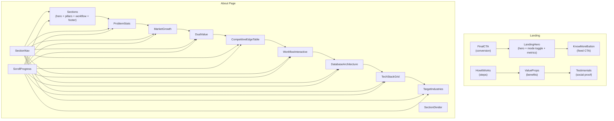

**Diagram sources**
- [landing-hero.tsx](file://frontend/components/landing-hero.tsx#L16-L323)
- [know-more-button.tsx](file://frontend/components/know-more-button.tsx#L7-L22)
- [cta.tsx](file://frontend/components/landing/cta.tsx#L6-L62)
- [how-it-works.tsx](file://frontend/components/landing/how-it-works.tsx#L28-L105)
- [value-props.tsx](file://frontend/components/landing/value-props.tsx#L33-L93)
- [testimonials.tsx](file://frontend/components/landing/testimonials.tsx#L26-L81)
- [sections.tsx](file://frontend/components/about/sections.tsx#L14-L299)
- [problem-stats.tsx](file://frontend/components/about/problem-stats.tsx#L27-L101)
- [market-growth.tsx](file://frontend/components/about/market-growth.tsx#L7-L152)
- [dual-value.tsx](file://frontend/components/about/dual-value.tsx#L23-L136)
- [competitive-edge-table.tsx](file://frontend/components/about/competitive-edge-table.tsx#L38-L126)
- [workflow-interactive.tsx](file://frontend/components/about/workflow-interactive.tsx#L100-L204)
- [database-architecture.tsx](file://frontend/components/about/database-architecture.tsx#L7-L130)
- [tech-stack-grid.tsx](file://frontend/components/about/tech-stack-grid.tsx#L43-L128)
- [target-industries.tsx](file://frontend/components/about/target-industries.tsx#L35-L147)
- [section-nav.tsx](file://frontend/components/about/section-nav.tsx#L19-L69)
- [section-divider.tsx](file://frontend/components/about/section-divider.tsx#L5-L25)
- [scroll-progress.tsx](file://frontend/components/about/scroll-progress.tsx#L4-L13)

**Section sources**
- [landing-hero.tsx](file://frontend/components/landing-hero.tsx#L16-L323)
- [know-more-button.tsx](file://frontend/components/know-more-button.tsx#L7-L22)
- [cta.tsx](file://frontend/components/landing/cta.tsx#L6-L62)
- [how-it-works.tsx](file://frontend/components/landing/how-it-works.tsx#L28-L105)
- [value-props.tsx](file://frontend/components/landing/value-props.tsx#L33-L93)
- [testimonials.tsx](file://frontend/components/landing/testimonials.tsx#L26-L81)
- [sections.tsx](file://frontend/components/about/sections.tsx#L14-L299)
- [problem-stats.tsx](file://frontend/components/about/problem-stats.tsx#L27-L101)
- [market-growth.tsx](file://frontend/components/about/market-growth.tsx#L7-L152)
- [dual-value.tsx](file://frontend/components/about/dual-value.tsx#L23-L136)
- [competitive-edge-table.tsx](file://frontend/components/about/competitive-edge-table.tsx#L38-L126)
- [workflow-interactive.tsx](file://frontend/components/about/workflow-interactive.tsx#L100-L204)
- [database-architecture.tsx](file://frontend/components/about/database-architecture.tsx#L7-L130)
- [tech-stack-grid.tsx](file://frontend/components/about/tech-stack-grid.tsx#L43-L128)
- [target-industries.tsx](file://frontend/components/about/target-industries.tsx#L35-L147)
- [section-nav.tsx](file://frontend/components/about/section-nav.tsx#L19-L69)
- [section-divider.tsx](file://frontend/components/about/section-divider.tsx#L5-L25)
- [scroll-progress.tsx](file://frontend/components/about/scroll-progress.tsx#L4-L13)

## Core Components
- LandingHero: Hero unit with dynamic headline, mode toggle (seeker vs. recruiter), metrics, and primary CTAs. Implements animated typing and ambient visuals.
- KnowMoreButton: Persistent floating action to drive deeper engagement to the About page.
- FinalCTA: Conversion-focused section with gradient headline, supporting text, paired buttons, and trust indicators.
- HowItWorks: Stepwise feature explanation with animated timeline and icon cards.
- ValueProps: Benefit-focused grid with hover states and radial accents.
- Testimonials: Carousel-like social proof with quote cards and hover effects.

These components are designed to be composed into landing pages that speak to distinct personas and use cases, while maintaining consistent brand language and motion.

**Section sources**
- [landing-hero.tsx](file://frontend/components/landing-hero.tsx#L16-L323)
- [know-more-button.tsx](file://frontend/components/know-more-button.tsx#L7-L22)
- [cta.tsx](file://frontend/components/landing/cta.tsx#L6-L62)
- [how-it-works.tsx](file://frontend/components/landing/how-it-works.tsx#L28-L105)
- [value-props.tsx](file://frontend/components/landing/value-props.tsx#L33-L93)
- [testimonials.tsx](file://frontend/components/landing/testimonials.tsx#L26-L81)

## Architecture Overview
The landing and About page components share a cohesive design system:
- Motion primitives via Framer Motion for entrance, hover, and progress effects
- Brand-centric tokens (colors, typography, spacing) applied consistently
- Responsive grids and layouts that adapt from mobile to desktop
- Semantic section anchors enabling smooth navigation and scroll progress

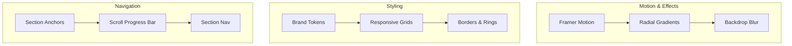

**Diagram sources**
- [landing-hero.tsx](file://frontend/components/landing-hero.tsx#L16-L323)
- [scroll-progress.tsx](file://frontend/components/about/scroll-progress.tsx#L4-L13)
- [section-nav.tsx](file://frontend/components/about/section-nav.tsx#L19-L69)
- [sections.tsx](file://frontend/components/about/sections.tsx#L14-L299)

## Detailed Component Analysis

### LandingHero
Purpose:
- Establish brand promise, present dual persona value, and drive immediate action.
Key behaviors:
- Animated typing effect cycles words and pauses at completion.
- Mode toggle switches copy, metrics, and CTA labels between “seeker” and “recruiter.”
- Ambient blobs and gradients create depth; desktop preview panel highlights outputs.
Responsiveness:
- Mobile-first magazine-style layout with centered hero and minimal metrics strip.
- Desktop layout splits content and preview, with mode switch and prominent CTAs.
Integration with marketing copy:
- Headline emphasizes transformation (“Turn Resumes Into…”), supported by concise taglines and metrics.
Usage examples:
- Job seeker landing: default mode “seeker,” CTA links to seeker dashboard.
- Recruiter landing: switch to “recruiter,” CTA links to recruiter console.

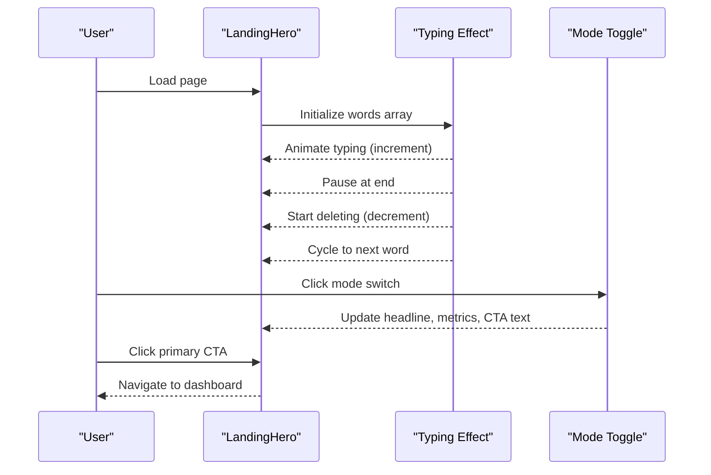

**Diagram sources**
- [landing-hero.tsx](file://frontend/components/landing-hero.tsx#L27-L52)
- [landing-hero.tsx](file://frontend/components/landing-hero.tsx#L186-L200)
- [landing-hero.tsx](file://frontend/components/landing-hero.tsx#L202-L232)

**Section sources**
- [landing-hero.tsx](file://frontend/components/landing-hero.tsx#L16-L323)

### KnowMoreButton
Purpose:
- Provide persistent, low-friction access to the About page for curiosity-driven users.
Behavior:
- Fixed-position floating button with subtle hover animation and scale effect.
Integration with marketing copy:
- “Know More” communicates transparency and invites deeper exploration.
Usage examples:
- Place on landing pages after hero or conversion section to reduce bounce.

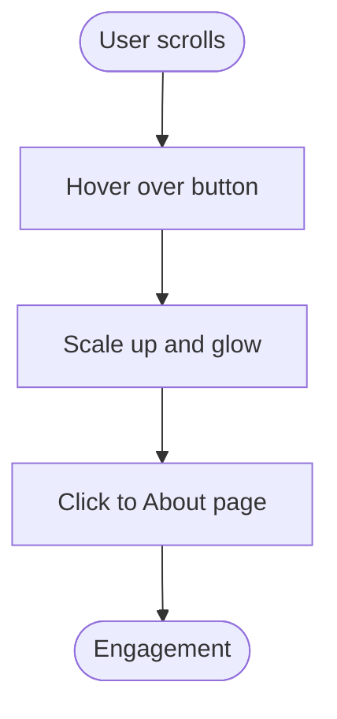

**Diagram sources**
- [know-more-button.tsx](file://frontend/components/know-more-button.tsx#L7-L22)

**Section sources**
- [know-more-button.tsx](file://frontend/components/know-more-button.tsx#L7-L22)

### FinalCTA
Purpose:
- Convert attention into action with paired CTAs for seeker and recruiter.
Behavior:
- Staggered entrance animations for headline, body, and buttons.
- Trust indicators below CTAs reinforce risk reduction.
Integration with marketing copy:
- Clear value proposition and benefit framing (“No credit card required • Fast onboarding”).
Usage examples:
- After feature explanation or testimonials to close the funnel.

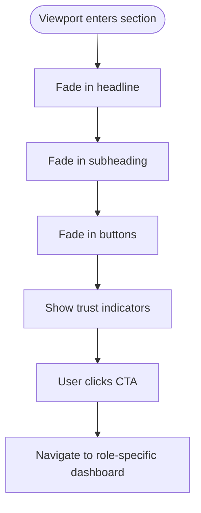

**Diagram sources**
- [cta.tsx](file://frontend/components/landing/cta.tsx#L13-L58)

**Section sources**
- [cta.tsx](file://frontend/components/landing/cta.tsx#L6-L62)

### HowItWorks
Purpose:
- Communicate the product flow in digestible steps with visual rhythm.
Behavior:
- Vertical timeline with alternating step content and animated entrances.
- Icon cards with subtle glow and hover elevation.
Integration with marketing copy:
- Headline and subheadline frame the flow as simple and fast.
Usage examples:
- Place after hero and before benefits to maintain momentum.

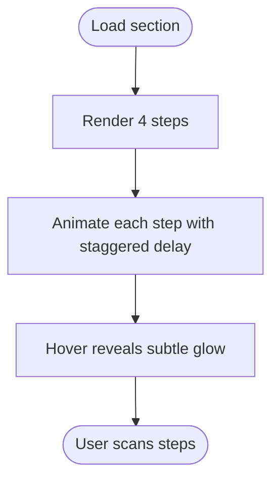

**Diagram sources**
- [how-it-works.tsx](file://frontend/components/landing/how-it-works.tsx#L56-L98)

**Section sources**
- [how-it-works.tsx](file://frontend/components/landing/how-it-works.tsx#L28-L105)

### ValueProps
Purpose:
- Present core benefits with iconography and hover states.
Behavior:
- Responsive grid with animated cards and radial gradient overlays.
- Hover states emphasize brand color and subtle elevation.
Integration with marketing copy:
- Headline and subheadline position the platform as outcome-focused.
Usage examples:
- Use after feature explanation to reinforce value.

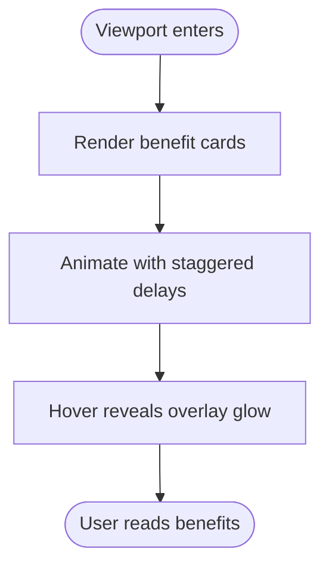

**Diagram sources**
- [value-props.tsx](file://frontend/components/landing/value-props.tsx#L60-L86)

**Section sources**
- [value-props.tsx](file://frontend/components/landing/value-props.tsx#L33-L93)

### Testimonials
Purpose:
- Build credibility through real outcomes and roles.
Behavior:
- Horizontal scrollable cards with snap points on mobile and grid on desktop.
- Hover states reveal radial accent and subtle elevation.
Integration with marketing copy:
- Headline and subheadline frame outcomes as everyday wins.
Usage examples:
- Place after benefits and before conversion section.

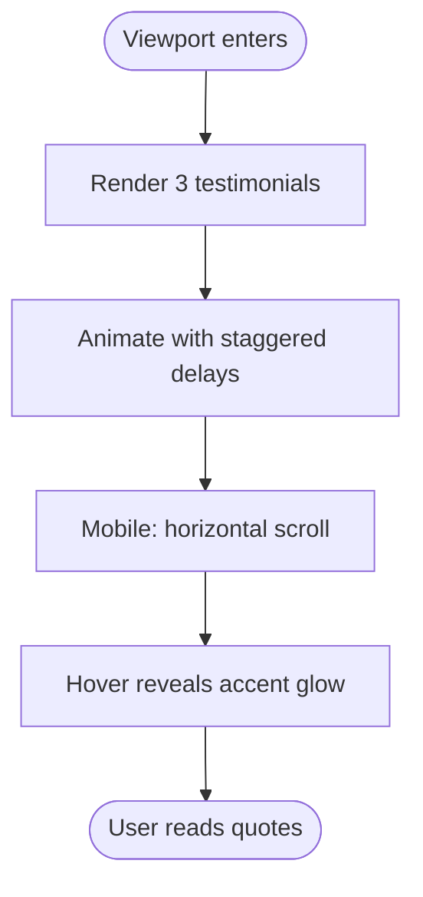

**Diagram sources**
- [testimonials.tsx](file://frontend/components/landing/testimonials.tsx#L54-L76)

**Section sources**
- [testimonials.tsx](file://frontend/components/landing/testimonials.tsx#L26-L81)

### About Page Components

#### Sections (Hero, Pillars, Workflow, Footer)
Purpose:
- Tell the story of the company, principles, and end-to-end workflow.
Behavior:
- Hero with animated background and gradient headline.
- Pillars grid with hover elevation and colored backgrounds.
- Interactive workflow strip with numbered stages and hover reveals.
- Footer with call-to-action and branding.
Integration with marketing copy:
- Consistent tone and gradient accents unify the narrative.
Usage examples:
- Use as standalone About page or embedded in landing page sections.

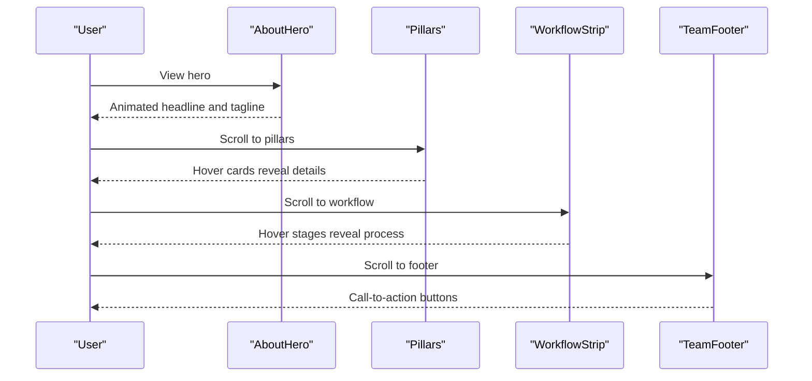

**Diagram sources**
- [sections.tsx](file://frontend/components/about/sections.tsx#L14-L299)

**Section sources**
- [sections.tsx](file://frontend/components/about/sections.tsx#L14-L299)

#### ProblemStats
Purpose:
- Highlight pain points with striking stats and visual emphasis.
Behavior:
- Two-column stat cards with animated progress bars and gradient accents.
Integration with marketing copy:
- Headline and descriptions tie stats to platform capabilities.
Usage examples:
- Use early in About page to establish context.

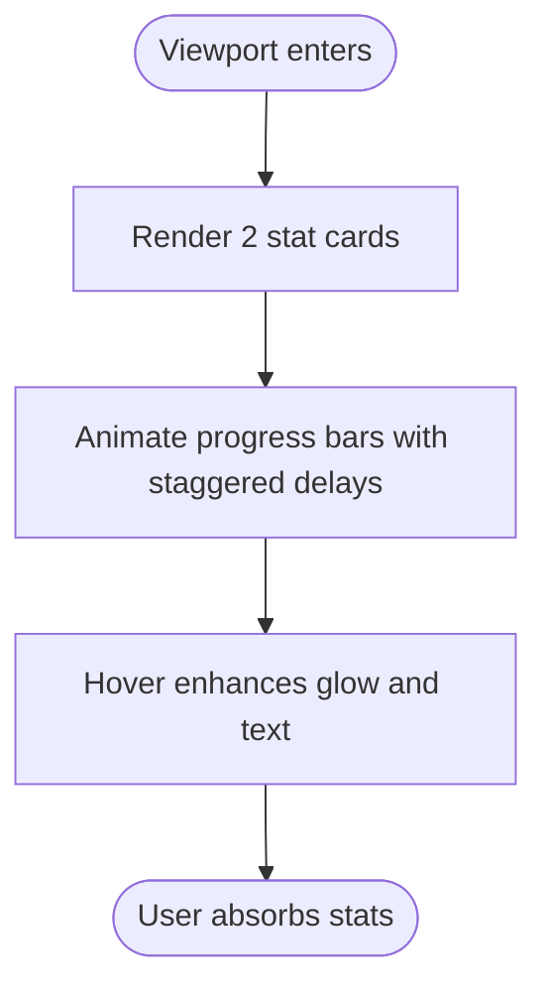

**Diagram sources**
- [problem-stats.tsx](file://frontend/components/about/problem-stats.tsx#L52-L95)

**Section sources**
- [problem-stats.tsx](file://frontend/components/about/problem-stats.tsx#L27-L101)

#### MarketGrowth
Purpose:
- Demonstrate TAM and growth trends to support positioning.
Behavior:
- Two-column cards with animated bars and projections.
Integration with marketing copy:
- Headlines and badges summarize growth narratives.
Usage examples:
- Use after problem stats to pivot to opportunity.

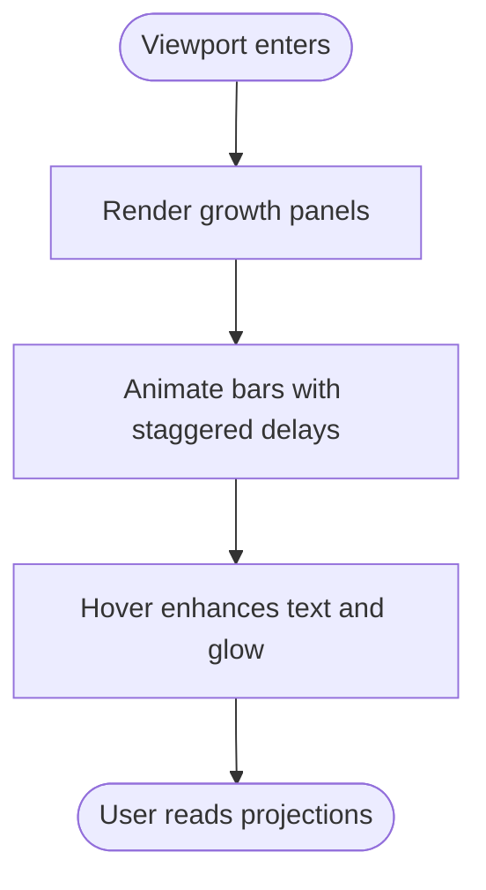

**Diagram sources**
- [market-growth.tsx](file://frontend/components/about/market-growth.tsx#L33-L147)

**Section sources**
- [market-growth.tsx](file://frontend/components/about/market-growth.tsx#L7-L152)

#### DualValue
Purpose:
- Explain compounding flywheel for both seekers and employers.
Behavior:
- Split cards with animated connecting icon and hover enhancements.
Integration with marketing copy:
- Headline and descriptions emphasize mutual value creation.
Usage examples:
- Use after market growth to anchor strategic positioning.

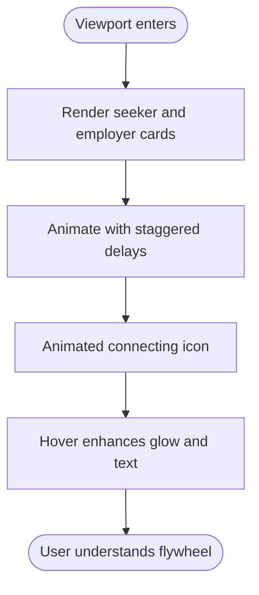

**Diagram sources**
- [dual-value.tsx](file://frontend/components/about/dual-value.tsx#L54-L131)

**Section sources**
- [dual-value.tsx](file://frontend/components/about/dual-value.tsx#L23-L136)

#### CompetitiveEdgeTable
Purpose:
- Compare feature support across categories to highlight differentiation.
Behavior:
- Table with status indicators and hover states.
Integration with marketing copy:
- Headline and descriptions frame integrated workflow advantages.
Usage examples:
- Use after dual value to provide concrete evidence.

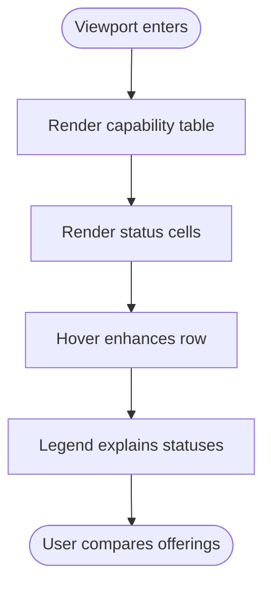

**Diagram sources**
- [competitive-edge-table.tsx](file://frontend/components/about/competitive-edge-table.tsx#L86-L120)

**Section sources**
- [competitive-edge-table.tsx](file://frontend/components/about/competitive-edge-table.tsx#L38-L126)

#### WorkflowInteractive
Purpose:
- Visualize the parsing and scoring pipeline with interactive stages.
Behavior:
- Grid of stages with hover reveals of internal processes.
- Mobile backup image for small screens.
Integration with marketing copy:
- Headline and description explain the ML + NLP workflow.
Usage examples:
- Use after competitive edge to demonstrate technical depth.

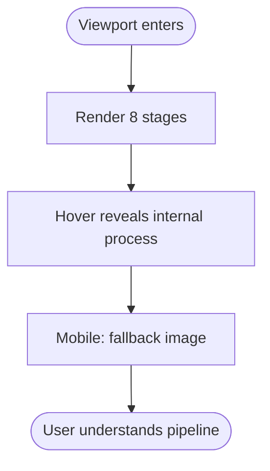

**Diagram sources**
- [workflow-interactive.tsx](file://frontend/components/about/workflow-interactive.tsx#L126-L184)

**Section sources**
- [workflow-interactive.tsx](file://frontend/components/about/workflow-interactive.tsx#L100-L204)

#### DatabaseArchitecture
Purpose:
- Communicate data model and persistence design.
Behavior:
- Two-column layout with logical architecture and ER diagram.
Integration with marketing copy:
- Headlines and descriptions explain scalability and integrity.
Usage examples:
- Use after workflow to ground technical claims.

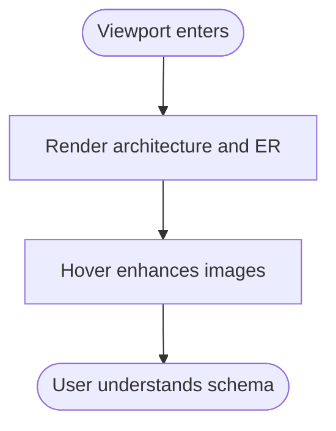

**Diagram sources**
- [database-architecture.tsx](file://frontend/components/about/database-architecture.tsx#L32-L125)

**Section sources**
- [database-architecture.tsx](file://frontend/components/about/database-architecture.tsx#L7-L130)

#### TechStackGrid
Purpose:
- Showcase the technology foundation with categorized modules.
Behavior:
- Three-column grid with category cards and hover elevation.
Integration with marketing copy:
- Headlines and descriptions emphasize performance and extensibility.
Usage examples:
- Use after database architecture to complete the tech story.

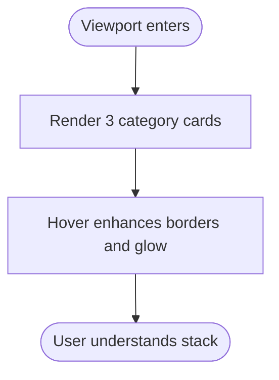

**Diagram sources**
- [tech-stack-grid.tsx](file://frontend/components/about/tech-stack-grid.tsx#L68-L122)

**Section sources**
- [tech-stack-grid.tsx](file://frontend/components/about/tech-stack-grid.tsx#L43-L128)

#### TargetIndustries
Purpose:
- Communicate adoption vectors and sector breakdown.
Behavior:
- Donut chart visualization with legend and hover states.
Integration with marketing copy:
- Headline and descriptions explain rationale for focus.
Usage examples:
- Use after tech stack to anchor go-to-market strategy.

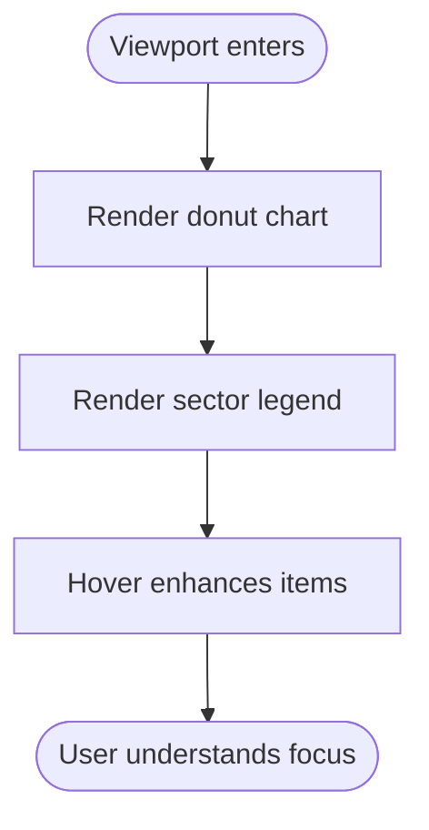

**Diagram sources**
- [target-industries.tsx](file://frontend/components/about/target-industries.tsx#L64-L142)

**Section sources**
- [target-industries.tsx](file://frontend/components/about/target-industries.tsx#L35-L147)

#### SectionNav
Purpose:
- Provide sticky navigation across long About page sections.
Behavior:
- Intersection observer tracks active section; pill highlight animates.
Integration with marketing copy:
- Clean labels guide users through the narrative.
Usage examples:
- Place near top of About page for easy scanning.

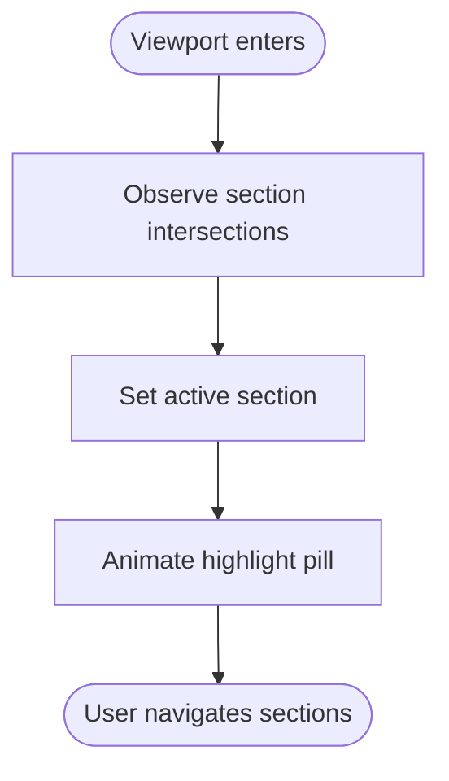

**Diagram sources**
- [section-nav.tsx](file://frontend/components/about/section-nav.tsx#L22-L38)

**Section sources**
- [section-nav.tsx](file://frontend/components/about/section-nav.tsx#L19-L69)

#### SectionDivider
Purpose:
- Visually separate major sections with a subtle gradient bar.
Behavior:
- Optional subtle variant for lighter dividers.
Integration with marketing copy:
- Minimalist design keeps focus on content.
Usage examples:
- Use between About page sections.

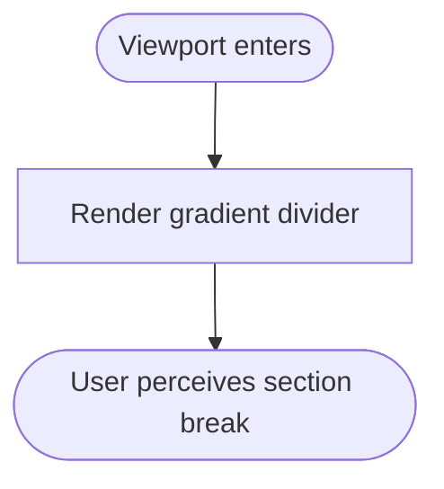

**Diagram sources**
- [section-divider.tsx](file://frontend/components/about/section-divider.tsx#L11-L23)

**Section sources**
- [section-divider.tsx](file://frontend/components/about/section-divider.tsx#L5-L25)

#### ScrollProgress
Purpose:
- Indicate reading progress with a dynamic bar.
Behavior:
- Uses scroll progress to scale width of a gradient bar.
Integration with marketing copy:
- Subtle indicator supports long-form storytelling.
Usage examples:
- Place at top of About page.

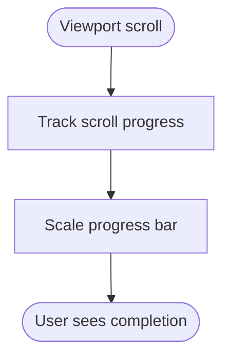

**Diagram sources**
- [scroll-progress.tsx](file://frontend/components/about/scroll-progress.tsx#L4-L12)

**Section sources**
- [scroll-progress.tsx](file://frontend/components/about/scroll-progress.tsx#L4-L13)

## Dependency Analysis
- Motion and styling:
  - Framer Motion powers entrances, hover states, and progress bars.
  - Tailwind utilities define responsive grids, borders, and backdrop blur.
- Navigation:
  - Section anchors enable smooth scrolling and progress tracking.
  - Intersection Observer synchronizes active section highlighting.
- Icons:
  - Lucide React provides consistent iconography across components.

```mermaid
graph LR
FM["Framer Motion"] --> LH["LandingHero"]
FM --> CTA["FinalCTA"]
FM --> HIW["HowItWorks"]
FM --> VAL["ValueProps"]
FM --> TST["Testimonials"]
FM --> SEC["Sections"]
FM --> PROB["ProblemStats"]
FM --> MARKET["MarketGrowth"]
FM --> DUAL["DualValue"]
FM --> EDGE["CompetitiveEdgeTable"]
FM --> PIPE["WorkflowInteractive"]
FM --> DATA["DatabaseArchitecture"]
FM --> STACK["TechStackGrid"]
FM --> IND["TargetIndustries"]
FM --> NAV["SectionNav"]
FM --> DIV["SectionDivider"]
FM --> SCR["ScrollProgress"]
BRAND["Brand Tokens"] --> LH
BRAND --> CTA
BRAND --> HIW
BRAND --> VAL
BRAND --> TST
BRAND --> SEC
BRAND --> PROB
BRAND --> MARKET
BRAND --> DUAL
BRAND --> EDGE
BRAND --> PIPE
BRAND --> DATA
BRAND --> STACK
BRAND --> IND
BRAND --> NAV
BRAND --> DIV
BRAND --> SCR
```

**Diagram sources**
- [landing-hero.tsx](file://frontend/components/landing-hero.tsx#L16-L323)
- [cta.tsx](file://frontend/components/landing/cta.tsx#L6-L62)
- [how-it-works.tsx](file://frontend/components/landing/how-it-works.tsx#L28-L105)
- [value-props.tsx](file://frontend/components/landing/value-props.tsx#L33-L93)
- [testimonials.tsx](file://frontend/components/landing/testimonials.tsx#L26-L81)
- [sections.tsx](file://frontend/components/about/sections.tsx#L14-L299)
- [problem-stats.tsx](file://frontend/components/about/problem-stats.tsx#L27-L101)
- [market-growth.tsx](file://frontend/components/about/market-growth.tsx#L7-L152)
- [dual-value.tsx](file://frontend/components/about/dual-value.tsx#L23-L136)
- [competitive-edge-table.tsx](file://frontend/components/about/competitive-edge-table.tsx#L38-L126)
- [workflow-interactive.tsx](file://frontend/components/about/workflow-interactive.tsx#L100-L204)
- [database-architecture.tsx](file://frontend/components/about/database-architecture.tsx#L7-L130)
- [tech-stack-grid.tsx](file://frontend/components/about/tech-stack-grid.tsx#L43-L128)
- [target-industries.tsx](file://frontend/components/about/target-industries.tsx#L35-L147)
- [section-nav.tsx](file://frontend/components/about/section-nav.tsx#L19-L69)
- [section-divider.tsx](file://frontend/components/about/section-divider.tsx#L5-L25)
- [scroll-progress.tsx](file://frontend/components/about/scroll-progress.tsx#L4-L13)

**Section sources**
- [landing-hero.tsx](file://frontend/components/landing-hero.tsx#L16-L323)
- [cta.tsx](file://frontend/components/landing/cta.tsx#L6-L62)
- [how-it-works.tsx](file://frontend/components/landing/how-it-works.tsx#L28-L105)
- [value-props.tsx](file://frontend/components/landing/value-props.tsx#L33-L93)
- [testimonials.tsx](file://frontend/components/landing/testimonials.tsx#L26-L81)
- [sections.tsx](file://frontend/components/about/sections.tsx#L14-L299)
- [problem-stats.tsx](file://frontend/components/about/problem-stats.tsx#L27-L101)
- [market-growth.tsx](file://frontend/components/about/market-growth.tsx#L7-L152)
- [dual-value.tsx](file://frontend/components/about/dual-value.tsx#L23-L136)
- [competitive-edge-table.tsx](file://frontend/components/about/competitive-edge-table.tsx#L38-L126)
- [workflow-interactive.tsx](file://frontend/components/about/workflow-interactive.tsx#L100-L204)
- [database-architecture.tsx](file://frontend/components/about/database-architecture.tsx#L7-L130)
- [tech-stack-grid.tsx](file://frontend/components/about/tech-stack-grid.tsx#L43-L128)
- [target-industries.tsx](file://frontend/components/about/target-industries.tsx#L35-L147)
- [section-nav.tsx](file://frontend/components/about/section-nav.tsx#L19-L69)
- [section-divider.tsx](file://frontend/components/about/section-divider.tsx#L5-L25)
- [scroll-progress.tsx](file://frontend/components/about/scroll-progress.tsx#L4-L13)

## Performance Considerations
- Prefer lazy-loaded images for charts and diagrams to minimize initial payload.
- Keep motion animations scoped to visible sections to avoid layout thrash.
- Use CSS containment and transform-style for smoother hover effects.
- Optimize SVGs and gradients to reduce render cost on lower-end devices.
- Defer heavy animations until viewport-visible to improve First Contentful Paint.

## Troubleshooting Guide
- Animations not triggering:
  - Verify viewport and amount thresholds are appropriate for section heights.
  - Confirm Framer Motion is initialized and not blocked by SSR environments.
- Scroll progress not updating:
  - Ensure scroll container is the document body or a configured scroller.
  - Check that the progress element is positioned fixed at the top.
- Section nav not highlighting:
  - Confirm section IDs match the nav targets and intersection observer is active.
  - Validate root margin and thresholds align with viewport height.
- Hover states not appearing:
  - Check backdrop blur and gradient classes are not conflicting with pointer-events.
  - Ensure parent containers allow pointer events for interactive elements.

**Section sources**
- [scroll-progress.tsx](file://frontend/components/about/scroll-progress.tsx#L4-L12)
- [section-nav.tsx](file://frontend/components/about/section-nav.tsx#L22-L38)

## Conclusion
These components form a cohesive, motion-rich system for communicating value, guiding conversions, and telling a compelling story. By composing them thoughtfully—aligning hero messaging with feature explanations, benefits, and social proof—you can craft landing pages that resonate with both job seekers and recruiters while informing stakeholders with technical depth.

## Appendices
- Example compositions:
  - Job Seeker Landing: Hero → HowItWorks → ValueProps → Testimonials → FinalCTA
  - Recruiter Landing: Hero → HowItWorks → ValueProps → Testimonials → FinalCTA
  - Investor Story: ProblemStats → MarketGrowth → DualValue → CompetitiveEdgeTable → WorkflowInteractive → DatabaseArchitecture → TechStackGrid → TargetIndustries → SectionNav + ScrollProgress
- Best practices:
  - Maintain consistent brand color application and typography hierarchy.
  - Use progressive disclosure for complex workflows (e.g., hover reveals).
  - Anchor sections with IDs and pair with scroll progress and sticky navigation.