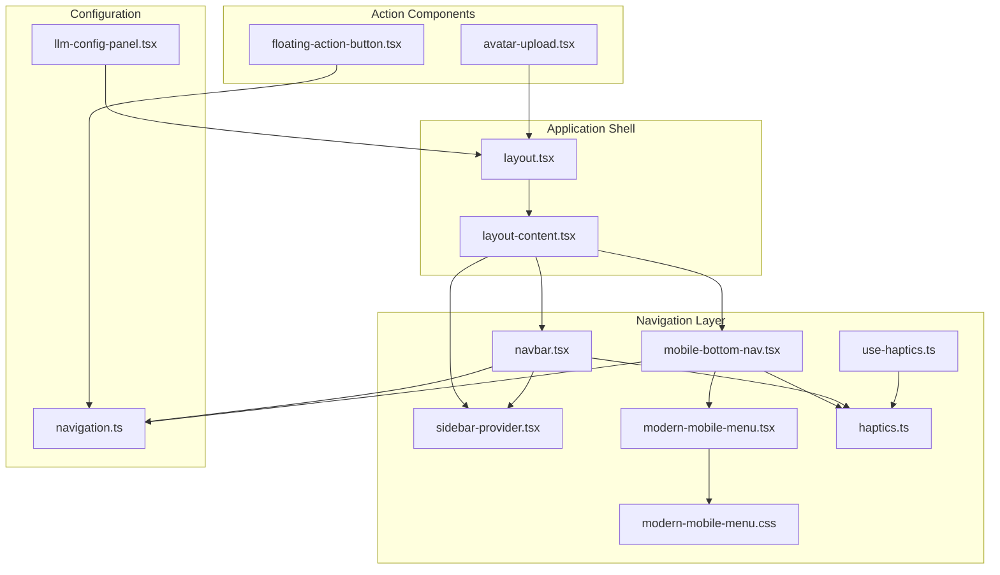
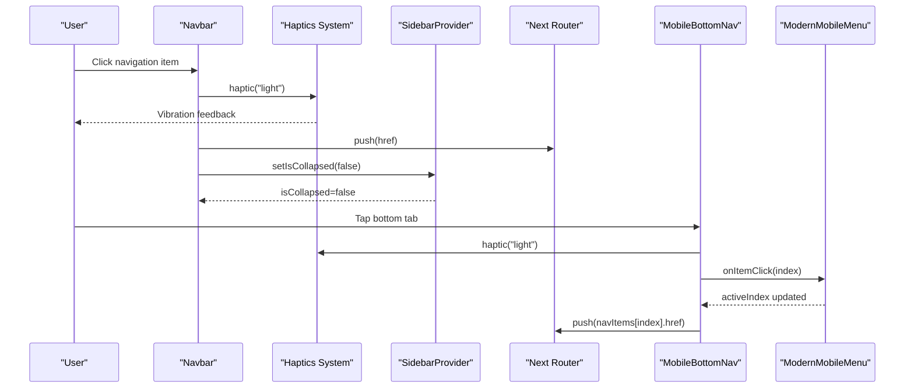
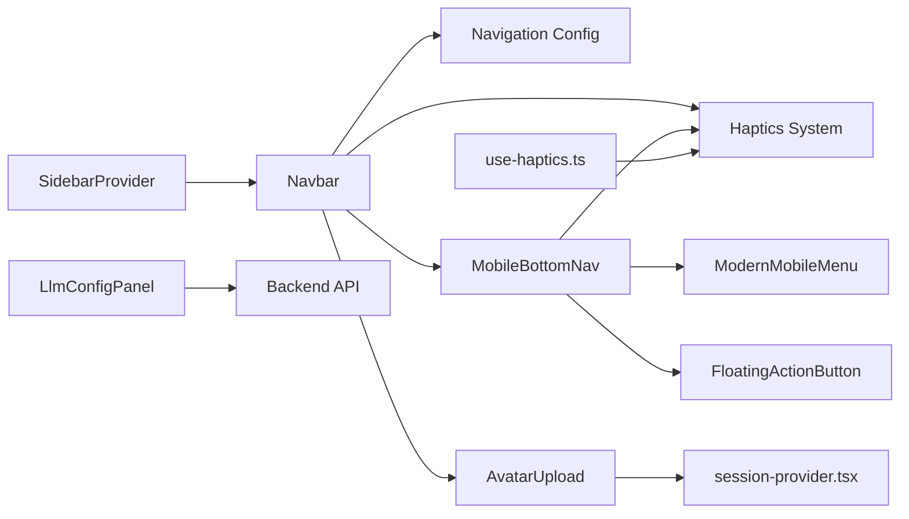

# Layout and navigation components

App chrome: desktop Navbar, mobile menus, sidebar, LLM config panel, FAB, and avatar menu.

## Recent changes
- Navbar back-button detection and dynamic titles
- Haptic feedback helpers with intensity levels
- Mobile nav with contextual menus and Framer Motion
- MobileBottomNav haptic wiring

## Repository layout
Key files:
- Application shell and providers: `layout.tsx`, `layout-content.tsx`
- Navigation configuration: `navigation.ts`
- Desktop and mobile navigation: `navbar.tsx`, `mobile-bottom-nav.tsx`
- Sidebar management: `sidebar-provider.tsx`
- Mobile menu foundation: `modern-mobile-menu.tsx`, `modern-mobile-menu.css`
- Action components: `floating-action-button.tsx`, `avatar-upload.tsx`
- AI configuration: `llm-config-panel.tsx`
- Haptic feedback system: `haptics.ts`, `use-haptics.ts`

```mermaid
graph TB
subgraph "Application Shell"
L["layout.tsx"]
LC["layout-content.tsx"]
end
subgraph "Navigation Layer"
NAV["navbar.tsx"]
MBN["mobile-bottom-nav.tsx"]
SP["sidebar-provider.tsx"]
NM["modern-mobile-menu.tsx"]
NMCSS["modern-mobile-menu.css"]
HF["haptics.ts"]
UH["use-haptics.ts"]
end
subgraph "Action Components"
FAB["floating-action-button.tsx"]
AVU["avatar-upload.tsx"]
end
subgraph "Configuration"
LCP["llm-config-panel.tsx"]
NAVCFG["navigation.ts"]
end
L --> LC
LC --> NAV
LC --> MBN
LC --> SP
MBN --> NM
MBN --> HF
NM --> NMCSS
NAV --> SP
NAV --> NAVCFG
NAV --> HF
MBN --> NAVCFG
FAB --> NAVCFG
AVU --> L
LCP --> L
UH --> HF
```

## Building blocks
This section introduces the primary components and their responsibilities with improved functionality:
- **Navbar**: Desktop navigation with back button detection, dynamic page title display, contextual menu buttons, Framer Motion animations, and detailed haptic feedback system.
- **MobileBottomNav**: Bottom tab navigation with integrated floating action button, improved haptic feedback, responsive behavior, and improved navigation logic.
- **SidebarProvider**: Context provider for sidebar collapse state management.
- **ModernMobileMenu**: Reusable interactive bottom navigation component with animated indicators, improved styling, and haptic feedback integration.
- **LlmConfigPanel**: Full-featured AI model configuration manager with create/edit/test/activate/delete operations.
- **FloatingActionButton**: Animated floating action button with sub-actions, backdrop behavior, and haptic feedback integration.
- **AvatarUpload**: User avatar management with URL validation, session updates, and haptic feedback.

## How it fits together
The navigation architecture combines desktop and mobile patterns with a centralized sidebar state managed by a React Context and improved with detailed haptic feedback. The Navbar controls desktop layout and tablet menus with back button detection and dynamic page titles, while MobileBottomNav handles mobile navigation with integrated floating action button and improved haptic feedback. The LLM configuration panel operates independently but integrates with the app shell for consistent theming and routing.

```mermaid
sequenceDiagram
participant User as "User"
participant Navbar as "Navbar"
participant Haptics as "Haptics System"
participant Sidebar as "SidebarProvider"
participant Router as "Next Router"
participant MobileNav as "MobileBottomNav"
participant Menu as "ModernMobileMenu"
User->>Navbar : Click navigation item
Navbar->>Haptics : haptic("light")
Haptics-->>User : Vibration feedback
Navbar->>Router : push(href)
Navbar->>Sidebar : setIsCollapsed(false)
Sidebar-->>Navbar : isCollapsed=false
User->>MobileNav : Tap bottom tab
MobileNav->>Haptics : haptic("light")
MobileNav->>Menu : onItemClick(index)
Menu-->>MobileNav : activeIndex updated
MobileNav->>Router : push(navItems[index].href)
```

## Navbar (desktop)

What it does:

- Shows a back button only on routes that need one (`shouldShowBack`, with exclusions)
- Resolves the page title from the path (exact match, then prefix for dynamic routes)
- Swaps hamburger vs three-dot menus based on the current route
- Animates entrance with Framer Motion springs (stiffness 300, damping 30)
- Collapses or expands the sidebar width
- Renders nav items, quick actions, and the session-aware profile block
- On tablet, opens an overlay menu instead of the desktop sidebar

State:

- Local mobile-menu open flag
- Sidebar collapse from context
- `useSession()` from `session-provider.tsx` (including loading)
- Computed title from the route

Routing:

- Next.js `Link` for client navigation
- Sign-out with a callback URL
- Titles for dashboard and account routes

Accessibility:

- Focus management on animated transitions
- Keyboard-reachable menu items
- Labels that match the current title
- Contrast that holds in active and idle states

Haptics fire on primary taps via `haptic("light" | "medium" | "heavy")`. That is wired once in the click handlers, not as a separate UI mode.

## MobileBottomNav

Bottom tab bar for touch layouts. Active tab tracks the pathname. A center slot hosts `FloatingActionButton`. Items split around that slot so the FAB stays centered. Ripple styling lives in the companion CSS.

Behavior:

- Map `navItems` into the interactive menu
- Compute `activeIndex` from the pathname
- `router.push` on tab select
- Session-aware items when auth matters

## SidebarProvider

React context for sidebar collapsed/expanded width. `useState` behind a getter/setter pair, typed context, and an error if a consumer mounts outside the provider. Navbar and layout chrome read the same value so width stays in sync.

## ModernMobileMenu

Reusable bottom menu used by the mobile chrome:

- 2-5 items, validated on the way in
- Active indicator line width measured from refs
- Accent color from CSS variables
- Touch ripples on press

Resize handling is effect-based. Styles that do not need fresh layout work are memoized. Markup uses a navigation role.

## LlmConfigPanel

Multi-provider LLM config UI (OpenAI, Anthropic, Google, and the rest of the factory list):

- Create, edit, test, activate, delete
- Form validation and error states
- Live connection test
- Active config highlighted in the list

Data comes from the backend REST endpoints. Loading and error messages stay in the panel. UI uses status badges, simple transitions, and a responsive grid.

## FloatingActionButton

Animated primary action with an expandable sub-menu:

- Backdrop overlay while open
- Rotation on toggle
- Staggered sub-action entries
- Backdrop click closes
- Selection routes through the nav item hrefs

Touch targets stay large enough for thumbs. Focus moves cleanly on open/close. Haptics run on toggle and selection the same way as the bottom nav.

## AvatarUpload

URL-based avatar update with preview, validation, backend write, and a session refresh after success. Form state clears on a clean save.

Integration:
- Uses `useSession().update()` after a successful avatar write
- Calls user API endpoint for avatar changes
- Updates UI state upon successful completion
- Resets form on cancel or completion

## Haptic feedback system
The application now features a detailed haptic feedback system with semantic intensity levels and user preference management:

### Haptic intensity levels
The system provides seven semantic haptic intensity levels:
- **selection** (8ms, 0.3): Lightest intensity for tab/radio/checkbox selection
- **light** (15ms, 0.4): Standard button taps and navigation item taps
- **medium** (25ms, 0.7): Toggle switches and select dropdown interactions
- **heavy** (35ms, 1.0): Primary actions like FAB open/close and destructive actions
- **success** (two-pulse): Successful operation feedback
- **error** (three-pulse): Failed operation/warning feedback
- **tick** (10ms, 1.0): Slider step feedback (mapped to "rigid")

### Haptic utility functions
The haptics system provides three core utility functions:
- **haptic(intensity)**: Fire a haptic pulse with the specified intensity
- **getHapticsEnabled**: Check if user has haptics enabled
- **setHapticsEnabled(value)**: Persist user haptic preference

### Haptic hook integration
The useHaptics hook provides React integration :
- **haptic**: Fire a haptic pulse with optional intensity
- **enabled**: Current haptic preference state
- **setEnabled**: Toggle or explicitly set haptic preference

### Implementation details
- Built on the web-haptics library with graceful fallbacks
- Uses Vibration API internally with browser/device support detection
- User preferences persisted in localStorage under "haptics-enabled"
- Defaults to enabled when no preference has been saved
- Silent no-ops on unsupported browsers/devices (iOS, desktop)

## Dependencies
The navigation system exhibits clean separation of concerns with minimal coupling and improved haptic feedback integration:
- Navbar depends on SidebarProvider, `session-provider.tsx`, navigation configuration, and haptic feedback system
- MobileBottomNav depends on ModernMobileMenu, FloatingActionButton, and haptic feedback system
- SidebarProvider is a pure context without external dependencies
- LlmConfigPanel is self-contained with API integration
- AvatarUpload integrates with `useSession` and `POST /api/v1/user/update-avatar`
- Haptic feedback system provides centralized haptic management

```mermaid
graph LR
SP["SidebarProvider"] --> NAV["Navbar"]
NAV --> NAVCFG["Navigation Config"]
NAV --> HF["Haptics System"]
MBN["MobileBottomNav"] --> NM["ModernMobileMenu"]
MBN --> FAB["FloatingActionButton"]
MBN --> HF
NAV --> MBN
LCP["LlmConfigPanel"] --> API["Backend API"]
AVU["AvatarUpload"] --> NA["session-provider.tsx"]
NAV --> AVU
UH["use-haptics.ts"] --> HF
```

## Performance
- Use of Framer Motion animations should be optimized for mobile devices with haptic feedback
- Debounce resize handlers in menu components with improved performance monitoring
- Lazy load heavy configuration panels when possible with haptic feedback optimization
- Minimize unnecessary re-renders through proper state scoping with haptic feedback integration
- Consider virtualizing long lists in configuration panels with performance monitoring
- Optimize image loading for avatar previews with haptic feedback timing
- Implement haptic feedback debouncing to prevent excessive vibration calls
- Cache haptic intensity mappings for performance optimization
- Use requestAnimationFrame for haptic feedback timing in animations

## Troubleshooting
Common issues and resolutions with haptic feedback integration:
- **Navigation not updating after sidebar changes**: Verify SidebarProvider wrapping and haptic feedback integration
- **Mobile menu not responding**: Check ModernMobileMenu item count validation and haptic feedback system
- **Avatar upload failing**: Confirm API endpoint availability, session state, and haptic feedback configuration
- **LLM configuration errors**: Validate provider credentials, network connectivity, and haptic feedback system
- **Floating action button not animating**: Ensure proper CSS variable definitions and haptic feedback integration
- **Haptic feedback not working**: Check browser/device support, user preferences, and haptic system initialization
- **Haptic feedback too frequent**: Implement debouncing and adjust haptic intensity levels
- **Haptic feedback inconsistent**: Verify haptic system singleton instance and localStorage persistence

Debugging tips:
- Use React DevTools to inspect component state and haptic feedback integration
- Monitor network requests for API failures and haptic feedback timing
- Check browser console for JavaScript errors and haptic system initialization
- Verify `useSession()` state and haptic preference persistence
- Inspect CSS custom properties for theme-related issues and haptic feedback styling
- Monitor haptic feedback calls with performance profiling tools
