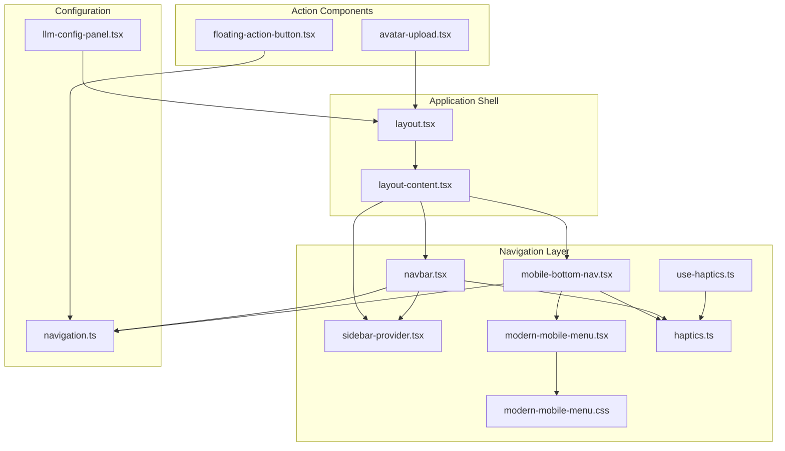
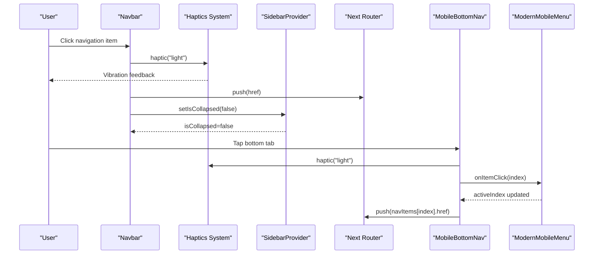
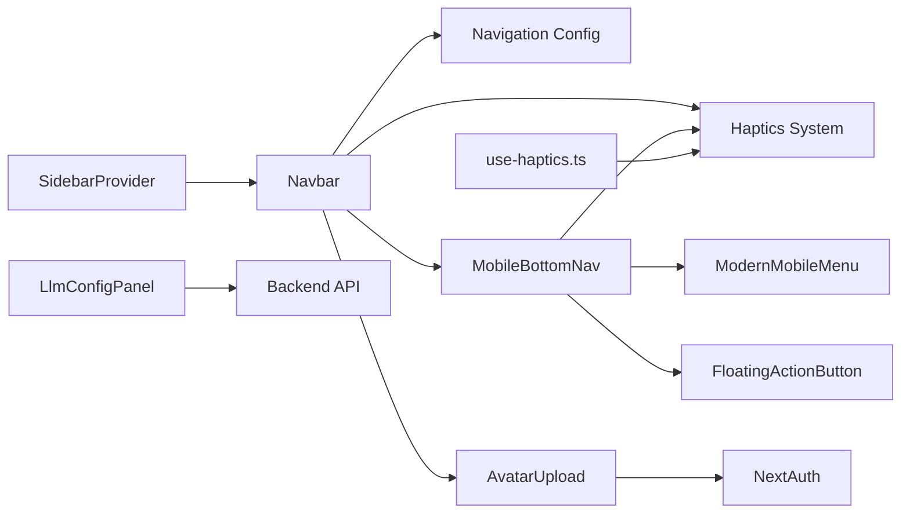

# Layout and navigation components

## Update summary
**Changes Made**
- Improved Navbar component with sophisticated back button detection and dynamic page title display
- Integrated detailed haptic feedback system with semantic intensity levels
- Improved mobile navigation with contextual menu buttons and Framer Motion animations
- Added modernized mobile menu system with improved user interaction patterns
- Updated MobileBottomNav with better haptic feedback integration

## Introduction
This page provides detailed documentation for the layout and navigation components that form the backbone of the TalentSync application's user interface. The system has been improved with sophisticated mobile navigation patterns, detailed haptic feedback integration, and modernized navigation components. It covers the desktop Navbar with advanced back button detection and dynamic page titles, mobile navigation patterns with contextual menu buttons, sidebar management, AI configuration panel, floating action button, and user avatar management. The guide explains component state management, responsive behavior, routing integration, customization options, and accessibility considerations for navigation patterns.

## Project structure
The layout and navigation system is organized around a few key files with improved haptic feedback capabilities:
- Application shell and providers: `layout.tsx`, `layout-content.tsx`
- Navigation configuration: `navigation.ts`
- Desktop and mobile navigation: `navbar.tsx`, `mobile-bottom-nav.tsx`
- Sidebar management: `sidebar-provider.tsx`
- Mobile menu foundation: `modern-mobile-menu.tsx`, `modern-mobile-menu.css`
- Action components: `floating-action-button.tsx`, `avatar-upload.tsx`
- AI configuration: `llm-config-panel.tsx`
- Haptic feedback system: `haptics.ts`, `use-haptics.ts`

```mermaid
graph TB
subgraph "Application Shell"
L["layout.tsx"]
LC["layout-content.tsx"]
end
subgraph "Navigation Layer"
NAV["navbar.tsx"]
MBN["mobile-bottom-nav.tsx"]
SP["sidebar-provider.tsx"]
NM["modern-mobile-menu.tsx"]
NMCSS["modern-mobile-menu.css"]
HF["haptics.ts"]
UH["use-haptics.ts"]
end
subgraph "Action Components"
FAB["floating-action-button.tsx"]
AVU["avatar-upload.tsx"]
end
subgraph "Configuration"
LCP["llm-config-panel.tsx"]
NAVCFG["navigation.ts"]
end
L --> LC
LC --> NAV
LC --> MBN
LC --> SP
MBN --> NM
MBN --> HF
NM --> NMCSS
NAV --> SP
NAV --> NAVCFG
NAV --> HF
MBN --> NAVCFG
FAB --> NAVCFG
AVU --> L
LCP --> L
UH --> HF
```

## Core components
This section introduces the primary components and their responsibilities with improved functionality:
- **Navbar**: Desktop navigation with sophisticated back button detection, dynamic page title display, contextual menu buttons, Framer Motion animations, and detailed haptic feedback system.
- **MobileBottomNav**: Bottom tab navigation with integrated floating action button, improved haptic feedback, responsive behavior, and improved navigation logic.
- **SidebarProvider**: Context provider for sidebar collapse state management.
- **ModernMobileMenu**: Reusable interactive bottom navigation component with animated indicators, improved styling, and haptic feedback integration.
- **LlmConfigPanel**: Full-featured AI model configuration manager with create/edit/test/activate/delete operations.
- **FloatingActionButton**: Animated floating action button with sub-actions, backdrop behavior, and haptic feedback integration.
- **AvatarUpload**: User avatar management with URL validation, session updates, and haptic feedback.

## Architecture overview
The navigation architecture combines desktop and mobile patterns with a centralized sidebar state managed by a React Context and improved with detailed haptic feedback. The Navbar controls desktop layout and tablet menus with sophisticated back button detection and dynamic page titles, while MobileBottomNav handles mobile navigation with integrated floating action button and improved haptic feedback. The LLM configuration panel operates independently but integrates with the app shell for consistent theming and routing.

```mermaid
sequenceDiagram
participant User as "User"
participant Navbar as "Navbar"
participant Haptics as "Haptics System"
participant Sidebar as "SidebarProvider"
participant Router as "Next Router"
participant MobileNav as "MobileBottomNav"
participant Menu as "ModernMobileMenu"
User->>Navbar : Click navigation item
Navbar->>Haptics : haptic("light")
Haptics-->>User : Vibration feedback
Navbar->>Router : push(href)
Navbar->>Sidebar : setIsCollapsed(false)
Sidebar-->>Navbar : isCollapsed=false
User->>MobileNav : Tap bottom tab
MobileNav->>Haptics : haptic("light")
MobileNav->>Menu : onItemClick(index)
Menu-->>MobileNav : activeIndex updated
MobileNav->>Router : push(navItems[index].href)
```

## Detailed component analysis

### Improved navbar component (desktop navigation)
The Navbar provides a detailed desktop navigation experience with sophisticated enhancements:
- **Advanced Back Button Detection**: Intelligent back button visibility based on route patterns with configurable logic
- **Dynamic Page Title Display**: Contextual page titles with prefix matching for dynamic routes and special route handling
- **Contextual Menu Buttons**: Adaptive menu button that changes between hamburger and three-dot menus based on current route
- **Framer Motion Animations**: Sophisticated entrance animations with spring physics and controlled transitions
- **Detailed Haptic Feedback**: Semantic haptic feedback for different user interactions (light, heavy, medium)
- **Collapsible Sidebar**: Smooth animations with responsive sidebar width management
- **Main navigation items and quick action shortcuts**: Improved with haptic feedback integration
- **User profile section with role display**: Session-aware rendering with haptic feedback
- **Tablet-responsive menu overlay**: Controlled visibility with animated transitions
- **Integration with Next.js routing and authentication**: Smooth navigation with sign-out flow

Key behaviors:
- Uses Framer Motion for entrance animations with spring physics (stiffness: 300, damping: 30)
- Advanced back button detection using shouldShowBack() function with route exclusions
- Dynamic page title resolution with exact and prefix matching for dynamic routes
- Contextual menu button that adapts to current route (hamburger vs three-dots)
- Detailed haptic feedback integration for all user interactions
- Responsive sidebar width (collapsed vs expanded) with smooth transitions
- Active state highlighting based on current path with improved visual feedback
- Session-aware rendering for authenticated/unauthenticated users with haptic feedback
- Tablet menu toggle with controlled visibility and animated transitions

State management:
- Local state for mobile menu visibility with controlled animations
- Context state for sidebar collapse with haptic feedback
- Session state from NextAuth with loading states
- Dynamic page title computation with route-based logic

Routing integration:
- Uses Next.js Link for client-side navigation with haptic feedback
- Handles sign-out with callback URL and heavy haptic feedback
- Integrates with dashboard and account pages with contextual titles
- Supports dynamic route patterns with prefix matching

Accessibility considerations:
- Proper focus management with animated transitions
- Keyboard navigable menu items with haptic feedback
- Screen reader friendly labels with contextual titles
- Sufficient color contrast with improved visual states
- Semantic haptic feedback for different interaction types

### Improved MobileBottomNav component
MobileBottomNav implements an improved bottom navigation bar optimized for touch devices with detailed haptic feedback:
- **Improved Tab Switching**: Responsive tab switching with active state tracking and haptic feedback
- **Integrated FloatingActionButton**: Central floating action button with haptic feedback integration
- **Dynamic Item Splitting**: Intelligent item splitting for floating action button placement with haptic feedback
- **Custom CSS for Themed Appearance**: Improved styling with ripple effects and haptic feedback integration
- **Path-based Active Index Calculation**: Improved route-based active index determination
- **Detailed Haptic Feedback**: Semantic haptic feedback for all interactions (light, selection)

Core functionality:
- Transforms navigation items for the interactive menu with haptic feedback integration
- Calculates active index based on current pathname with improved logic
- Handles navigation with custom logic and haptic feedback
- Manages item splitting for floating action button placement with haptic feedback
- Integrates haptic feedback for all user interactions

Integration points:
- Uses Next.js router for navigation with haptic feedback
- Uses NextAuth session for conditional rendering with haptic feedback
- Integrates with FloatingActionButton for primary actions with haptic feedback
- Improved haptic feedback system for all navigation interactions

Responsive behavior:
- Adapts to screen size changes with haptic feedback
- Maintains consistent spacing for floating action button with haptic feedback
- Uses CSS media queries for fine-tuning with improved styling
- Optimized for different screen sizes with haptic feedback integration

### SidebarProvider component
SidebarProvider manages the global sidebar collapse state:
- React Context for state sharing across components
- Centralized state management for sidebar width
- Type-safe context with error handling
- Provider wrapper in the application layout

Implementation details:
- Uses useState hook for local state
- Provides getter/setter pair through context
- Enforces context usage with error messages
- Minimal re-renders through selective state updates

Usage pattern:
- Wrapped around the main layout
- Consumed by Navbar and other layout components
- Enables coordinated sidebar behavior

### Improved ModernMobileMenu component
ModernMobileMenu provides a reusable bottom navigation foundation with improved features:
- **Configurable Item Count**: 2-5 items with improved validation
- **Animated Active State Indicators**: Sophisticated line width calculations with haptic feedback
- **Dynamic Line Width Calculations**: Improved measurement and animation
- **Theme-aware Accent Colors**: CSS variable integration with haptic feedback
- **Touch-friendly Ripple Effects**: Improved visual feedback with haptic integration
- **Improved Styling**: Improved visual design with haptic feedback integration

Technical features:
- Validates incoming items array with improved error handling
- Uses refs for DOM measurements with haptic feedback integration
- Effect-based resize handling with performance optimizations
- Memoized style calculations with improved caching
- Accessible markup with navigation role and haptic feedback

Customization options:
- Adjustable accent color via CSS variables with haptic feedback
- Flexible item count and labels with validation
- Customizable icon components with improved styling
- Responsive design with media queries and haptic feedback

### LlmConfigPanel component
LlmConfigPanel offers a detailed AI configuration management interface:
- Multi-provider support (OpenAI, Anthropic, Google, etc.)
- Create, edit, test, activate, and delete operations
- Form validation and error handling
- Real-time testing with feedback
- Active configuration management

Core workflows:
- Configuration list with status indicators
- Modal dialogs for creation and editing
- Test connection functionality
- Activation/deactivation controls
- Confirmation dialogs for destructive actions

Data management:
- Fetches configurations from backend API
- Handles CRUD operations via REST endpoints
- Manages loading states and error messages
- Supports custom model entries

UI/UX features:
- Animated transitions and feedback
- Status badges for configuration health
- Gradient backgrounds and glassmorphism
- Responsive grid layouts

### Improved FloatingActionButton component
FloatingActionButton provides an animated primary action button with detailed haptic feedback:
- **Expandable Sub-menu**: Animated entries with haptic feedback integration
- **Central Positioning**: Backdrop overlay with haptic feedback
- **Smooth Rotation Animation**: Toggle state with controlled animations and haptic feedback
- **Integration with Navigation Items**: Improved navigation with haptic feedback
- **Touch-friendly Sizing**: Appropriate sizing with haptic feedback integration

Behavioral patterns:
- Toggle state management with controlled visibility and haptic feedback
- Staggered animation for sub-actions with haptic feedback
- Backdrop click-to-close functionality with haptic feedback
- Route-based navigation on selection with haptic feedback

Accessibility:
- Focus management during open/close with haptic feedback
- Touch targets sized appropriately with haptic feedback
- Visual feedback for hover/tap states with haptic feedback
- Screen reader compatible labels with haptic feedback

### AvatarUpload component
AvatarUpload enables user avatar management:
- URL-based avatar updates
- Real-time preview functionality
- Validation and error handling
- Session synchronization
- Clean form state management

Key features:
- URL validation with format checks
- Preview generation for URLs
- Backend API integration for updates
- Session refresh after avatar change
- User-friendly error messaging

Integration:
- Uses NextAuth session for updates
- Calls user API endpoint for avatar changes
- Updates UI state upon successful completion
- Resets form on cancel or completion

## Haptic feedback system
The application now features a detailed haptic feedback system with semantic intensity levels and user preference management:

### Haptic intensity levels
The system provides seven semantic haptic intensity levels:
- **selection** (8ms, 0.3): Lightest intensity for tab/radio/checkbox selection
- **light** (15ms, 0.4): Standard button taps and navigation item taps
- **medium** (25ms, 0.7): Toggle switches and select dropdown interactions
- **heavy** (35ms, 1.0): Primary actions like FAB open/close and destructive actions
- **success** (two-pulse): Successful operation feedback
- **error** (three-pulse): Failed operation/warning feedback
- **tick** (10ms, 1.0): Slider step feedback (mapped to "rigid")

### Haptic utility functions
The haptics system provides three core utility functions:
- **haptic(intensity)**: Fire a haptic pulse with the specified intensity
- **getHapticsEnabled()**: Check if user has haptics enabled
- **setHapticsEnabled(value)**: Persist user haptic preference

### Haptic hook integration
The useHaptics hook provides React integration with:
- **haptic()**: Fire a haptic pulse with optional intensity
- **enabled**: Current haptic preference state
- **setEnabled()**: Toggle or explicitly set haptic preference

### Implementation details
- Built on the web-haptics library with graceful fallbacks
- Uses Vibration API internally with browser/device support detection
- User preferences persisted in localStorage under "haptics-enabled"
- Defaults to enabled when no preference has been saved
- Silent no-ops on unsupported browsers/devices (iOS, desktop)

## Dependency analysis
The navigation system exhibits clean separation of concerns with minimal coupling and improved haptic feedback integration:
- Navbar depends on SidebarProvider, NextAuth, navigation configuration, and haptic feedback system
- MobileBottomNav depends on ModernMobileMenu, FloatingActionButton, and haptic feedback system
- SidebarProvider is a pure context without external dependencies
- LlmConfigPanel is self-contained with API integration
- AvatarUpload integrates with NextAuth and user API
- Haptic feedback system provides centralized haptic management

```mermaid
graph LR
SP["SidebarProvider"] --> NAV["Navbar"]
NAV --> NAVCFG["Navigation Config"]
NAV --> HF["Haptics System"]
MBN["MobileBottomNav"] --> NM["ModernMobileMenu"]
MBN --> FAB["FloatingActionButton"]
MBN --> HF
NAV --> MBN
LCP["LlmConfigPanel"] --> API["Backend API"]
AVU["AvatarUpload"] --> NA["NextAuth"]
NAV --> AVU
UH["use-haptics.ts"] --> HF
```

## Performance considerations
- Use of Framer Motion animations should be optimized for mobile devices with haptic feedback
- Debounce resize handlers in menu components with improved performance monitoring
- Lazy load heavy configuration panels when possible with haptic feedback optimization
- Minimize unnecessary re-renders through proper state scoping with haptic feedback integration
- Consider virtualizing long lists in configuration panels with performance monitoring
- Optimize image loading for avatar previews with haptic feedback timing
- Implement haptic feedback debouncing to prevent excessive vibration calls
- Cache haptic intensity mappings for performance optimization
- Use requestAnimationFrame for haptic feedback timing in animations

## Troubleshooting guide
Common issues and resolutions with haptic feedback integration:
- **Navigation not updating after sidebar changes**: Verify SidebarProvider wrapping and haptic feedback integration
- **Mobile menu not responding**: Check ModernMobileMenu item count validation and haptic feedback system
- **Avatar upload failing**: Confirm API endpoint availability, session state, and haptic feedback configuration
- **LLM configuration errors**: Validate provider credentials, network connectivity, and haptic feedback system
- **Floating action button not animating**: Ensure proper CSS variable definitions and haptic feedback integration
- **Haptic feedback not working**: Check browser/device support, user preferences, and haptic system initialization
- **Haptic feedback too frequent**: Implement debouncing and adjust haptic intensity levels
- **Haptic feedback inconsistent**: Verify haptic system singleton instance and localStorage persistence

Debugging tips:
- Use React DevTools to inspect component state and haptic feedback integration
- Monitor network requests for API failures and haptic feedback timing
- Check browser console for JavaScript errors and haptic system initialization
- Verify NextAuth session state consistency and haptic preference persistence
- Inspect CSS custom properties for theme-related issues and haptic feedback styling
- Monitor haptic feedback calls with performance profiling tools

## Conclusion
The improved layout and navigation system provides a reliable, responsive, and tactilely rich foundation for the TalentSync application. The components work together smoothly to deliver an intuitive user experience across desktop, tablet, and mobile devices with detailed haptic feedback integration. The modular architecture allows for easy customization and extension while maintaining consistency in design and behavior. The integration with Next.js routing, authentication, backend APIs, and the detailed haptic feedback system ensures a cohesive and engaging application experience. The sophisticated back button detection, dynamic page titles, contextual menu buttons, and improved mobile navigation patterns provide users with a modern and intuitive navigation experience that responds to their interactions with appropriate tactile feedback.
