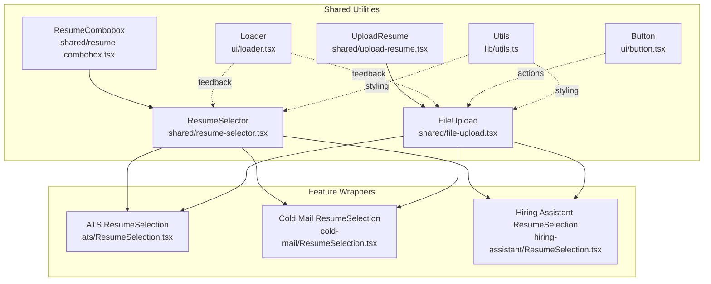
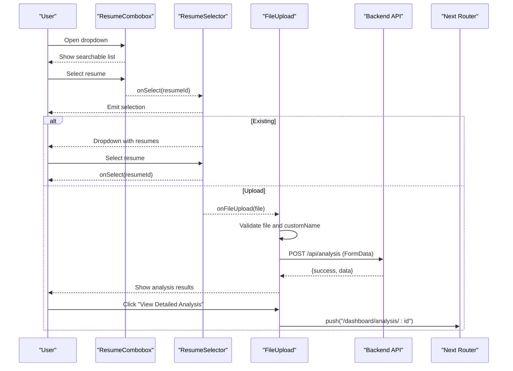
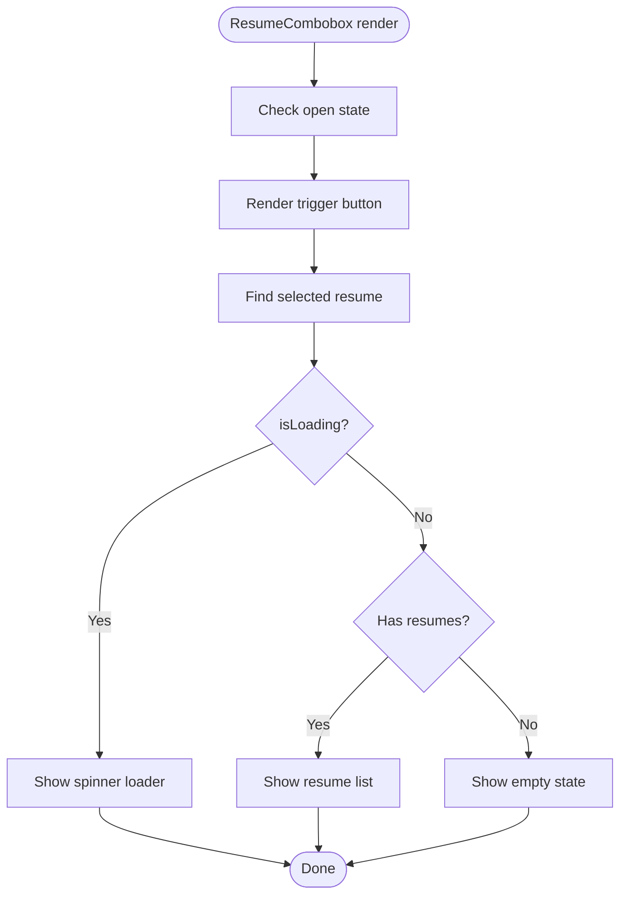
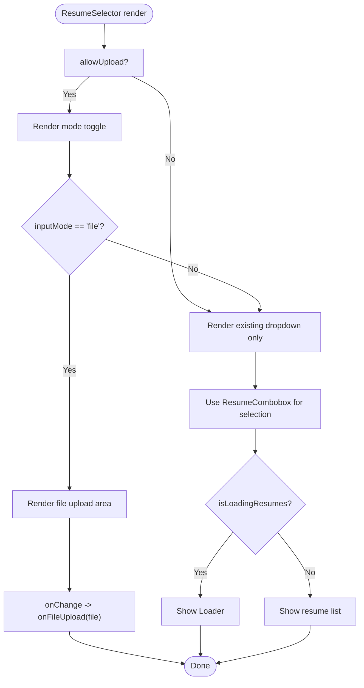
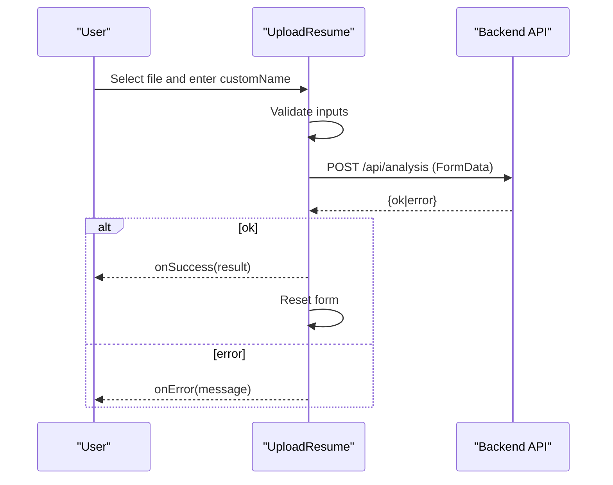
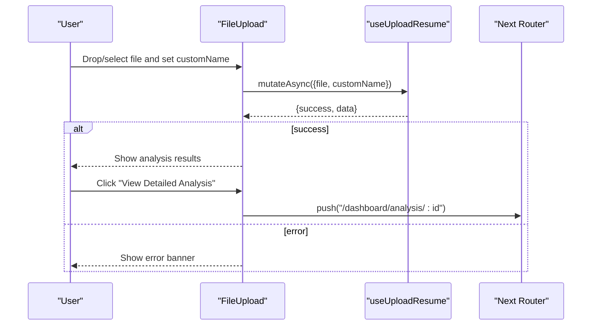
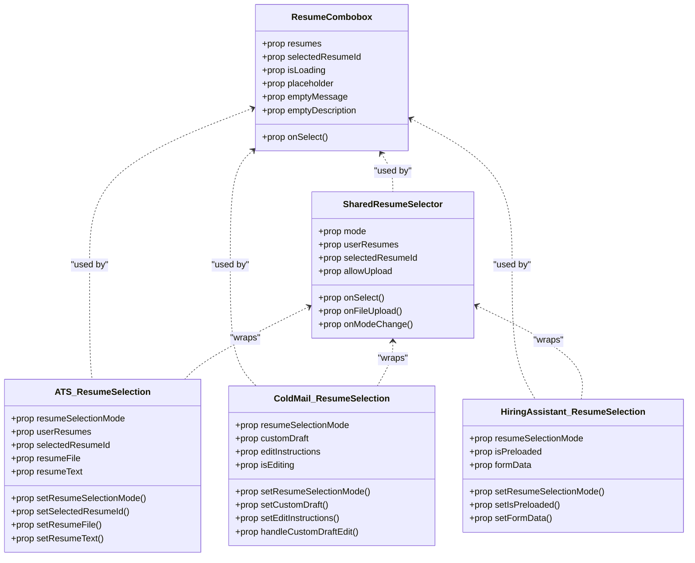
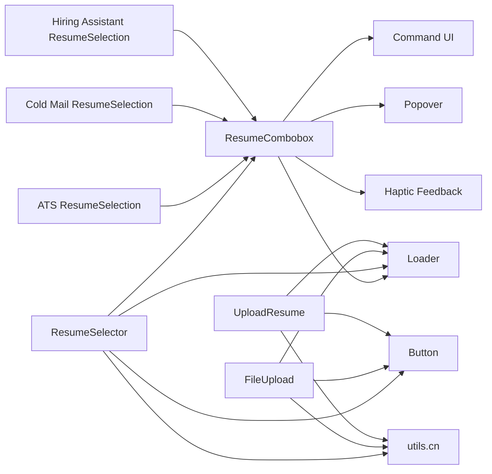

# Shared Utility Components

<cite>
**Referenced Files in This Document**
- [resume-combobox.tsx](file://frontend/components/shared/resume-combobox.tsx)
- [resume-selector.tsx](file://frontend/components/shared/resume-selector.tsx)
- [upload-resume.tsx](file://frontend/components/upload-resume.tsx)
- [file-upload.tsx](file://frontend/components/file-upload.tsx)
- [ResumeSelection.tsx (ATS)](file://frontend/components/ats/ResumeSelection.tsx)
- [ResumeSelection.tsx (Cold Mail)](file://frontend/components/cold-mail/ResumeSelection.tsx)
- [ResumeSelection.tsx (Hiring Assistant)](file://frontend/components/hiring-assistant/ResumeSelection.tsx)
- [loader.tsx](file://frontend/components/ui/loader.tsx)
- [button.tsx](file://frontend/components/ui/button.tsx)
- [utils.ts](file://frontend/lib/utils.ts)
</cite>

## Update Summary
**Changes Made**
- Added comprehensive documentation for the new ResumeCombobox component (197 lines)
- Updated ResumeSelector documentation to reflect integration with ResumeCombobox
- Enhanced feature-specific ResumeSelection components documentation to show ResumeCombobox usage
- Updated architecture diagrams to reflect the new component hierarchy
- Added new section covering ResumeCombobox's advanced features

## Table of Contents
1. [Introduction](#introduction)
2. [Project Structure](#project-structure)
3. [Core Components](#core-components)
4. [Architecture Overview](#architecture-overview)
5. [Detailed Component Analysis](#detailed-component-analysis)
6. [Dependency Analysis](#dependency-analysis)
7. [Performance Considerations](#performance-considerations)
8. [Troubleshooting Guide](#troubleshooting-guide)
9. [Conclusion](#conclusion)

## Introduction
This document describes the shared utility components used across multiple features in the application. It focuses on:
- ResumeCombobox: A modern, searchable combobox component with haptic feedback and loading states
- ResumeSelector: A flexible component for choosing existing resumes or uploading new ones
- UploadResume: A simple form-based uploader for resume analysis
- FileUpload: A modern drag-and-drop uploader with integrated analysis and quick actions
- Supporting utilities: Loader, Button, and shared styling helpers

It explains component props, event handlers, state management, validation, user feedback, integration patterns, and relationships to feature-specific components.

## Project Structure
The shared utilities live under the frontend/components directory, with feature-specific wrappers under feature folders (e.g., ats/, cold-mail/, hiring-assistant/). UI primitives and shared helpers are centralized under frontend/components/ui and frontend/lib.

**Diagram sources**
- [resume-combobox.tsx](file://frontend/components/shared/resume-combobox.tsx#L1-L198)
- [resume-selector.tsx](file://frontend/components/shared/resume-selector.tsx#L1-L201)
- [upload-resume.tsx](file://frontend/components/upload-resume.tsx#L1-L188)
- [file-upload.tsx](file://frontend/components/file-upload.tsx#L1-L505)
- [ResumeSelection.tsx (ATS)](file://frontend/components/ats/ResumeSelection.tsx#L1-L215)
- [ResumeSelection.tsx (Cold Mail)](file://frontend/components/cold-mail/ResumeSelection.tsx#L1-L465)
- [ResumeSelection.tsx (Hiring Assistant)](file://frontend/components/hiring-assistant/ResumeSelection.tsx#L1-L237)
- [loader.tsx](file://frontend/components/ui/loader.tsx#L1-L220)
- [button.tsx](file://frontend/components/ui/button.tsx#L1-L57)
- [utils.ts](file://frontend/lib/utils.ts#L1-L7)

**Section sources**
- [resume-combobox.tsx](file://frontend/components/shared/resume-combobox.tsx#L1-L198)
- [resume-selector.tsx](file://frontend/components/shared/resume-selector.tsx#L1-L201)
- [file-upload.tsx](file://frontend/components/file-upload.tsx#L1-L505)
- [upload-resume.tsx](file://frontend/components/upload-resume.tsx#L1-L188)
- [ResumeSelection.tsx (ATS)](file://frontend/components/ats/ResumeSelection.tsx#L1-L215)
- [ResumeSelection.tsx (Cold Mail)](file://frontend/components/cold-mail/ResumeSelection.tsx#L1-L465)
- [ResumeSelection.tsx (Hiring Assistant)](file://frontend/components/hiring-assistant/ResumeSelection.tsx#L1-L237)
- [loader.tsx](file://frontend/components/ui/loader.tsx#L1-L220)
- [button.tsx](file://frontend/components/ui/button.tsx#L1-L57)
- [utils.ts](file://frontend/lib/utils.ts#L1-L7)

## Core Components
This section summarizes the four primary shared components and their responsibilities.

- ResumeCombobox
  - Purpose: Modern searchable combobox with haptic feedback, loading states, and empty state handling
  - Key props: resumes, selectedResumeId, onSelect, isLoading, placeholder, emptyMessage, emptyDescription, className
  - Behavior: Integrated with Command UI components; provides search functionality and keyboard navigation
  - Features: Loading spinner, empty state with custom messages, haptic feedback on selection, responsive design

- ResumeSelector
  - Purpose: Unified picker for existing resumes or new file upload with two modes ("dropdown" and "card")
  - Key props: mode, userResumes, selectedResumeId, onSelect, onFileUpload, isLoadingResumes, resumeFile, allowUpload, onModeChange, className
  - Behavior: Internal state for mode and selection; controlled/uncontrolled selection support; optional upload toggle; integrates with useUserResumes hook
  - Feedback: Uses Loader for loading states and animated dropdown transitions

- UploadResume
  - Purpose: Form-based uploader that posts to "/api/analysis" with file and metadata
  - Key props: onSuccess, onError
  - Behavior: Validates presence of file and customName; constructs FormData; handles errors; resets form after success
  - Feedback: Disabled states during upload; displays selected file info

- FileUpload
  - Purpose: Modern drag-and-drop uploader with integrated analysis and quick action routing
  - Key props: onUploadSuccess
  - Behavior: Uses react-dropzone; validates supported formats; calls useUploadResume mutation; navigates to analysis and feature pages; stores analysis data in localStorage for downstream flows
  - Feedback: Full-screen loading overlay; success cards; error banners; animated previews

**Section sources**
- [resume-combobox.tsx](file://frontend/components/shared/resume-combobox.tsx#L22-L39)
- [resume-selector.tsx](file://frontend/components/shared/resume-selector.tsx#L25-L42)
- [upload-resume.tsx](file://frontend/components/upload-resume.tsx#L4-L7)
- [file-upload.tsx](file://frontend/components/file-upload.tsx#L63-L65)

## Architecture Overview
The shared components integrate with feature-specific wrappers and UI primitives. ResumeCombobox serves as the foundation for modern resume selection across all features. ResumeSelector wraps ResumeCombobox for backward compatibility and additional UI features. FileUpload encapsulates the entire upload+analysis flow and is often composed by higher-level features. UploadResume is a simpler alternative for basic upload+analysis scenarios.

**Diagram sources**
- [resume-combobox.tsx](file://frontend/components/shared/resume-combobox.tsx#L138-L142)
- [resume-selector.tsx](file://frontend/components/shared/resume-selector.tsx#L118-L124)
- [file-upload.tsx](file://frontend/components/file-upload.tsx#L105-L131)
- [ResumeSelection.tsx (ATS)](file://frontend/components/ats/ResumeSelection.tsx#L104-L110)

## Detailed Component Analysis

### ResumeCombobox
- Props and events
  - resumes: ResumeOption[] - Array of resume objects with id, customName, uploadDate, candidateName, predictedField
  - selectedResumeId: string - Currently selected resume ID
  - onSelect(resumeId: string): void - Callback when user selects a resume
  - isLoading?: boolean - Loading state indicator
  - placeholder?: string - Placeholder text when no selection
  - emptyMessage?: string - Message when no resumes found
  - emptyDescription?: string - Additional description for empty state
  - className?: string - Additional CSS classes
- State management
  - Internal: open state for popover control
  - Selection tracking: finds currently selected resume from resumes array
- Advanced features
  - Search functionality: CommandInput with searchable options
  - Loading states: Spinner animation during isLoading
  - Empty states: Customizable empty message and description
  - Haptic feedback: Integration with haptic library for selection feedback
  - Responsive design: Tailwind CSS classes for adaptive layouts
- Integration patterns
  - Used as primary dropdown replacement across all feature modules
  - Provides consistent UX across ATS, Cold Mail, and Hiring Assistant
  - Supports keyboard navigation and accessibility features

**Diagram sources**
- [resume-combobox.tsx](file://frontend/components/shared/resume-combobox.tsx#L51-L196)

**Section sources**
- [resume-combobox.tsx](file://frontend/components/shared/resume-combobox.tsx#L22-L39)
- [resume-combobox.tsx](file://frontend/components/shared/resume-combobox.tsx#L41-L50)
- [resume-combobox.tsx](file://frontend/components/shared/resume-combobox.tsx#L110-L196)

### ResumeSelector
- Props and events
  - mode: "dropdown" | "card"
  - userResumes?: UserResumeSummary[]
  - selectedResumeId?: string
  - onSelect(resumeId: string): void
  - onFileUpload?(file: File): void
  - isLoadingResumes?: boolean
  - resumeFile?: File | null
  - allowUpload?: boolean
  - onModeChange?(mode: "resumeId" | "file"): void
  - className?: string
- State management
  - Internal: inputMode ("resumeId" | "file"), showDropdown, internalSelectedId
  - Controlled/uncontrolled: if selectedResumeIdProp is provided, selection is controlled; otherwise internal
  - Data: merges external userResumes or falls back to hook-provided data
- Integration with ResumeCombobox
  - Replaces previous custom dropdown implementation
  - Uses ResumeCombobox for modern, searchable resume selection
  - Maintains backward compatibility with existing ResumeSelector interface
- Validation and feedback
  - Loading states via Loader
  - Animated dropdown with motion
  - Conditional rendering based on allowUpload and current mode
  - Haptic feedback integration for mode switching

**Diagram sources**
- [resume-selector.tsx](file://frontend/components/shared/resume-selector.tsx#L56-L127)

**Section sources**
- [resume-selector.tsx](file://frontend/components/shared/resume-selector.tsx#L25-L42)
- [resume-selector.tsx](file://frontend/components/shared/resume-selector.tsx#L44-L55)
- [resume-selector.tsx](file://frontend/components/shared/resume-selector.tsx#L118-L127)

### UploadResume
- Props and events
  - onSuccess?(result: any): void
  - onError?(error: string): void
- State management
  - file, customName, showInCentral, isUploading
- Validation and feedback
  - Prevents submission if file or customName missing
  - Disabled states during upload
  - Error callback invoked on failure
- Integration patterns
  - Posts to "/api/analysis"
  - Resets form and clears file input after success

**Diagram sources**
- [upload-resume.tsx](file://frontend/components/upload-resume.tsx#L29-L77)

**Section sources**
- [upload-resume.tsx](file://frontend/components/upload-resume.tsx#L4-L7)
- [upload-resume.tsx](file://frontend/components/upload-resume.tsx#L9-L12)
- [upload-resume.tsx](file://frontend/components/upload-resume.tsx#L18-L77)

### FileUpload
- Props and events
  - onUploadSuccess?(): void
- State management
  - file, customName, showInCentral, analysisResult, error, isUploading
- Validation and feedback
  - Accepts PDF, TXT, MD, DOCX via react-dropzone
  - Full-screen LoaderOverlay during upload
  - Error banner display
- Integration patterns
  - Calls useUploadResume mutation
  - Navigates to analysis page and feature pages (tips, cold-mail, cover-letter, hiring-assistant)
  - Stores file and analysis data in localStorage for downstream flows

**Diagram sources**
- [file-upload.tsx](file://frontend/components/file-upload.tsx#L79-L131)
- [file-upload.tsx](file://frontend/components/file-upload.tsx#L133-L216)

**Section sources**
- [file-upload.tsx](file://frontend/components/file-upload.tsx#L63-L65)
- [file-upload.tsx](file://frontend/components/file-upload.tsx#L79-L131)
- [file-upload.tsx](file://frontend/components/file-upload.tsx#L133-L216)

### Feature-Specific ResumeSelection Wrappers
These components wrap shared ResumeSelector or ResumeCombobox to tailor behavior per feature.

- ATS ResumeSelection
  - Uses ResumeCombobox for modern resume selection
  - Adds file preview for non-PDF/TXT/MD files
  - Integrates with shared ResumeCombobox props and state
- Cold Mail ResumeSelection
  - Extends to "customDraft" mode with editable draft and instructions
  - Auto-fills sender name and role from selected resume when available
  - Uses ResumeCombobox for both existing and optional resume selection
- Hiring Assistant ResumeSelection
  - Auto-fills role from predictedField when available
  - Uses ResumeCombobox for streamlined resume selection experience

**Diagram sources**
- [resume-combobox.tsx](file://frontend/components/shared/resume-combobox.tsx#L22-L39)
- [resume-selector.tsx](file://frontend/components/shared/resume-selector.tsx#L25-L42)
- [ResumeSelection.tsx (ATS)](file://frontend/components/ats/ResumeSelection.tsx#L22-L33)
- [ResumeSelection.tsx (Cold Mail)](file://frontend/components/cold-mail/ResumeSelection.tsx#L25-L49)
- [ResumeSelection.tsx (Hiring Assistant)](file://frontend/components/hiring-assistant/ResumeSelection.tsx#L21-L36)

**Section sources**
- [ResumeSelection.tsx (ATS)](file://frontend/components/ats/ResumeSelection.tsx#L1-L215)
- [ResumeSelection.tsx (Cold Mail)](file://frontend/components/cold-mail/ResumeSelection.tsx#L1-L465)
- [ResumeSelection.tsx (Hiring Assistant)](file://frontend/components/hiring-assistant/ResumeSelection.tsx#L1-L237)

## Dependency Analysis
- Shared components depend on:
  - UI primitives: Button, Loader, Input, Label, Card, Popover, Command components
  - Styling: cn from utils.ts
  - Routing: Next.js router for navigation
  - Hooks: useUploadResume for FileUpload; feature-specific hooks for ResumeSelector (e.g., useUserResumes)
  - Haptic feedback: haptic library integration
- Feature wrappers depend on shared components and pass down props/state to align with feature needs

**Diagram sources**
- [resume-combobox.tsx](file://frontend/components/shared/resume-combobox.tsx#L1-L198)
- [resume-selector.tsx](file://frontend/components/shared/resume-selector.tsx#L1-L201)
- [file-upload.tsx](file://frontend/components/file-upload.tsx#L1-L505)
- [upload-resume.tsx](file://frontend/components/upload-resume.tsx#L1-L188)
- [ResumeSelection.tsx (ATS)](file://frontend/components/ats/ResumeSelection.tsx#L1-L215)
- [ResumeSelection.tsx (Cold Mail)](file://frontend/components/cold-mail/ResumeSelection.tsx#L1-L465)
- [ResumeSelection.tsx (Hiring Assistant)](file://frontend/components/hiring-assistant/ResumeSelection.tsx#L1-L237)
- [loader.tsx](file://frontend/components/ui/loader.tsx#L1-L220)
- [button.tsx](file://frontend/components/ui/button.tsx#L1-L57)
- [utils.ts](file://frontend/lib/utils.ts#L1-L7)

**Section sources**
- [resume-combobox.tsx](file://frontend/components/shared/resume-combobox.tsx#L1-L198)
- [resume-selector.tsx](file://frontend/components/shared/resume-selector.tsx#L1-L201)
- [file-upload.tsx](file://frontend/components/file-upload.tsx#L1-L505)
- [upload-resume.tsx](file://frontend/components/upload-resume.tsx#L1-L188)
- [loader.tsx](file://frontend/components/ui/loader.tsx#L1-L220)
- [button.tsx](file://frontend/components/ui/button.tsx#L1-L57)
- [utils.ts](file://frontend/lib/utils.ts#L1-L7)

## Performance Considerations
- ResumeCombobox
  - Optimized with virtualized lists for large resume collections
  - Debounced search input for improved responsiveness
  - Efficient state management with minimal re-renders
  - Lazy loading for resume thumbnails and metadata
- ResumeSelector
  - Uses controlled vs uncontrolled selection to avoid unnecessary re-renders
  - Animated dropdown leverages motion; keep lists reasonably sized to minimize DOM
- FileUpload
  - Full-screen overlay is lightweight; ensure large files are handled gracefully
  - Debounce or batch updates if integrating with real-time features
- UploadResume
  - Single form submission; keep payload minimal to reduce latency
- Shared UI
  - Loader variants are optimized with motion; avoid excessive nested loaders

## Troubleshooting Guide
- ResumeCombobox
  - If resumes don't appear, verify isLoading prop and resumes array structure
  - If search doesn't work, check CommandInput configuration and value prop
  - If haptic feedback doesn't trigger, verify haptic library integration
- ResumeSelector
  - If resumes do not appear, verify isLoadingResumes and userResumes prop propagation
  - If dropdown does not open, check showDropdown state and click handler binding
- FileUpload
  - If upload fails, inspect error banner and console logs; ensure accept types match
  - If navigation does not occur, verify router availability and route correctness
- UploadResume
  - If form remains disabled, ensure both file and customName are set
  - If API errors occur, check backend endpoint and network connectivity

**Section sources**
- [resume-combobox.tsx](file://frontend/components/shared/resume-combobox.tsx#L138-L142)
- [resume-selector.tsx](file://frontend/components/shared/resume-selector.tsx#L66-L71)
- [file-upload.tsx](file://frontend/components/file-upload.tsx#L105-L131)
- [upload-resume.tsx](file://frontend/components/upload-resume.tsx#L29-L77)

## Conclusion
The shared utility components provide a cohesive, reusable foundation for resume selection and upload across features. ResumeCombobox introduces modern, searchable resume selection with haptic feedback and loading states, replacing previous custom dropdown implementations. ResumeSelector offers flexibility and controlled state management, while ResumeCombobox provides a standardized, accessible solution. UploadResume delivers a straightforward upload path, and FileUpload encapsulates the full analysis workflow with rich feedback and navigation. Together with supporting UI primitives and shared utilities, they enable consistent user experiences and maintainable feature integrations.