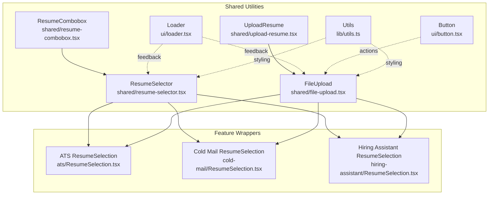
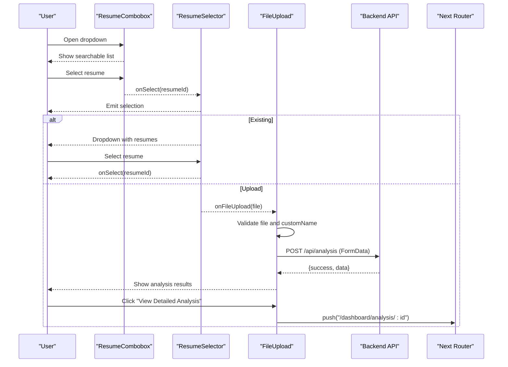
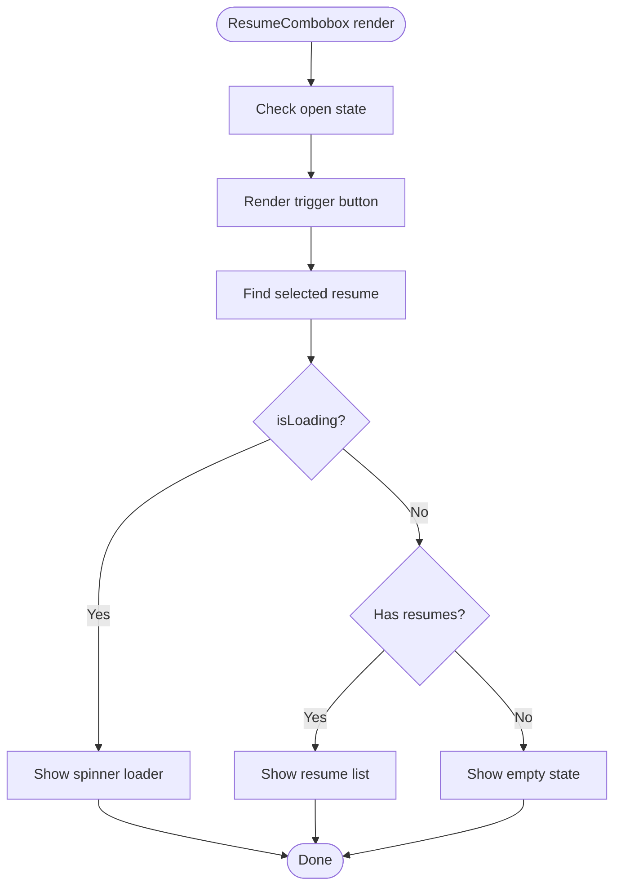
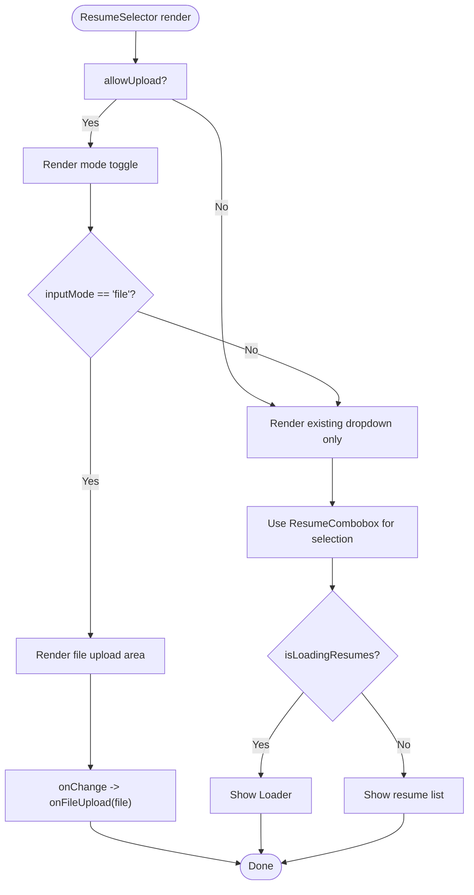
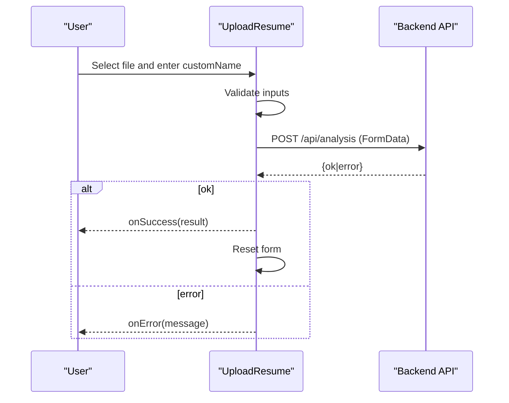
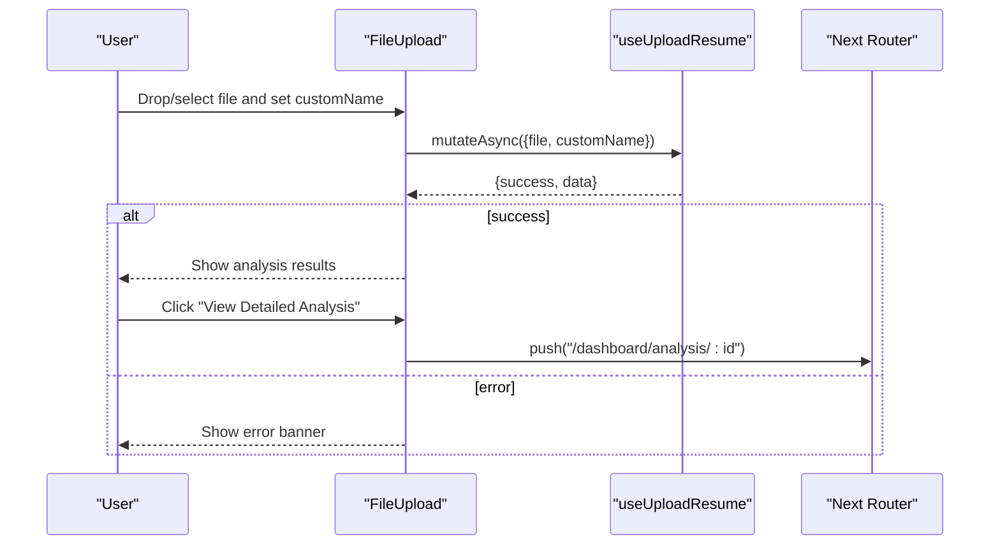
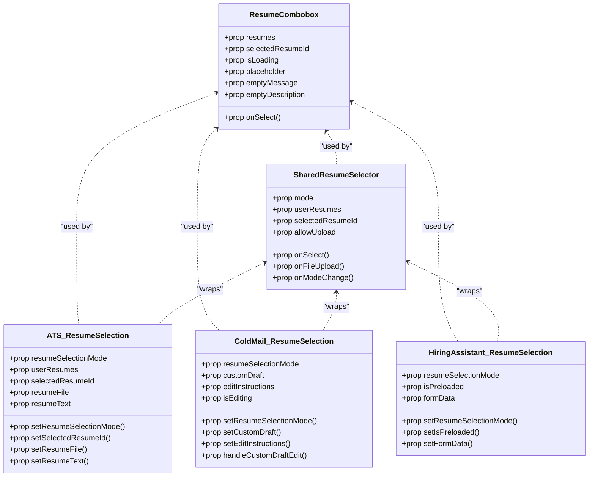
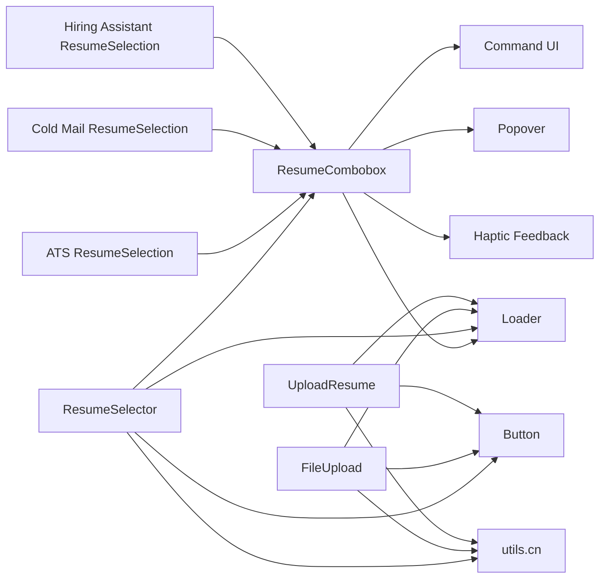

# Shared utility components

## Update summary
**Changes Made**
- Added detailed documentation for the new ResumeCombobox component (197 lines)
- Updated ResumeSelector documentation to reflect integration with ResumeCombobox
- Improved feature-specific ResumeSelection components documentation to show ResumeCombobox usage
- Updated architecture diagrams to reflect the new component hierarchy
- Added new section covering ResumeCombobox's advanced features

## Introduction
This page describes the shared utility components used across multiple features in the application. It focuses on:
- ResumeCombobox: A modern, searchable combobox component with haptic feedback and loading states
- ResumeSelector: A flexible component for choosing existing resumes or uploading new ones
- UploadResume: A simple form-based uploader for resume analysis
- FileUpload: A modern drag-and-drop uploader with integrated analysis and quick actions
- Supporting utilities: Loader, Button, and shared styling helpers

It explains component props, event handlers, state management, validation, user feedback, integration patterns, and relationships to feature-specific components.

## Project structure
The shared utilities live under the frontend/components directory, with feature-specific wrappers under feature folders (e.g., ats/, cold-mail/, hiring-assistant/). UI primitives and shared helpers are centralized under frontend/components/ui and frontend/lib.

```mermaid
graph TB
subgraph "Shared Utilities"
RCB["ResumeCombobox<br/>shared/resume-combobox.tsx"]
RS["ResumeSelector<br/>shared/resume-selector.tsx"]
UR["UploadResume<br/>shared/upload-resume.tsx"]
FU["FileUpload<br/>shared/file-upload.tsx"]
LDR["Loader<br/>ui/loader.tsx"]
BTN["Button<br/>ui/button.tsx"]
UTL["Utils<br/>lib/utils.ts"]
end
subgraph "Feature Wrappers"
ATS_RS["ATS ResumeSelection<br/>ats/ResumeSelection.tsx"]
CM_RS["Cold Mail ResumeSelection<br/>cold-mail/ResumeSelection.tsx"]
HA_RS["Hiring Assistant ResumeSelection<br/>hiring-assistant/ResumeSelection.tsx"]
end
RCB --> RS
RS --> ATS_RS
RS --> CM_RS
RS --> HA_RS
FU --> ATS_RS
FU --> CM_RS
FU --> HA_RS
UR --> FU
LDR -. feedback .-> RS
LDR -. feedback .-> FU
BTN -. actions .-> FU
UTL -. styling .-> RS
UTL -. styling .-> FU
```

## Core components
This section summarizes the four primary shared components and their responsibilities.

- ResumeCombobox
  - Purpose: Modern searchable combobox with haptic feedback, loading states, and empty state handling
  - Key props: resumes, selectedResumeId, onSelect, isLoading, placeholder, emptyMessage, emptyDescription, className
  - Behavior: Integrated with Command UI components; provides search functionality and keyboard navigation
  - Features: Loading spinner, empty state with custom messages, haptic feedback on selection, responsive design

- ResumeSelector
  - Purpose: Unified picker for existing resumes or new file upload with two modes ("dropdown" and "card")
  - Key props: mode, userResumes, selectedResumeId, onSelect, onFileUpload, isLoadingResumes, resumeFile, allowUpload, onModeChange, className
  - Behavior: Internal state for mode and selection; controlled/uncontrolled selection support; optional upload toggle; integrates with useUserResumes hook
  - Feedback: Uses Loader for loading states and animated dropdown transitions

- UploadResume
  - Purpose: Form-based uploader that posts to "/api/analysis" with file and metadata
  - Key props: onSuccess, onError
  - Behavior: Validates presence of file and customName; constructs FormData; handles errors; resets form after success
  - Feedback: Disabled states during upload; displays selected file info

- FileUpload
  - Purpose: Modern drag-and-drop uploader with integrated analysis and quick action routing
  - Key props: onUploadSuccess
  - Behavior: Uses react-dropzone; validates supported formats; calls useUploadResume mutation; navigates to analysis and feature pages; stores analysis data in localStorage for downstream flows
  - Feedback: Full-screen loading overlay; success cards; error banners; animated previews

## Architecture overview
The shared components integrate with feature-specific wrappers and UI primitives. ResumeCombobox is the foundation for modern resume selection across all features. ResumeSelector wraps ResumeCombobox for backward compatibility and additional UI features. FileUpload encapsulates the entire upload+analysis flow and is often composed by higher-level features. UploadResume is a simpler alternative for basic upload+analysis scenarios.

```mermaid
sequenceDiagram
participant User as "User"
participant RCB as "ResumeCombobox"
participant RS as "ResumeSelector"
participant FU as "FileUpload"
participant API as "Backend API"
participant Router as "Next Router"
User->>RCB : Open dropdown
RCB-->>User : Show searchable list
User->>RCB : Select resume
RCB-->>RS : onSelect(resumeId)
RS-->>User : Emit selection
alt Existing
RS-->>User : Dropdown with resumes
User->>RS : Select resume
RS-->>User : onSelect(resumeId)
else Upload
RS-->>FU : onFileUpload(file)
FU->>FU : Validate file and customName
FU->>API : POST /api/analysis (FormData)
API-->>FU : {success, data}
FU-->>User : Show analysis results
User->>FU : Click "View Detailed Analysis"
FU->>Router : push("/dashboard/analysis/ : id")
end
```

## Detailed component analysis

### ResumeCombobox
- Props and events
  - resumes: ResumeOption[] - Array of resume objects with id, customName, uploadDate, candidateName, predictedField
  - selectedResumeId: string - Currently selected resume ID
  - onSelect(resumeId: string): void - Callback when user selects a resume
  - isLoading?: boolean - Loading state indicator
  - placeholder?: string - Placeholder text when no selection
  - emptyMessage?: string - Message when no resumes found
  - emptyDescription?: string - Additional description for empty state
  - className?: string - Additional CSS classes
- State management
  - Internal: open state for popover control
  - Selection tracking: finds currently selected resume from resumes array
- Advanced features
  - Search functionality: CommandInput with searchable options
  - Loading states: Spinner animation during isLoading
  - Empty states: Customizable empty message and description
  - Haptic feedback: Integration with haptic library for selection feedback
  - Responsive design: Tailwind CSS classes for adaptive layouts
- Integration patterns
  - Used as primary dropdown replacement across all feature modules
  - Provides consistent UX across ATS, Cold Mail, and Hiring Assistant
  - Supports keyboard navigation and accessibility features

```mermaid
flowchart TD
Start(["ResumeCombobox render"]) --> CheckOpen["Check open state"]
CheckOpen --> RenderTrigger["Render trigger button"]
RenderTrigger --> CheckSelected["Find selected resume"]
CheckSelected --> CheckLoading{"isLoading?"}
CheckLoading --> |Yes| ShowLoading["Show spinner loader"]
CheckLoading --> |No| CheckResumes{"Has resumes?"}
CheckResumes --> |Yes| ShowList["Show resume list"]
CheckResumes --> |No| ShowEmpty["Show empty state"]
ShowLoading --> End(["Done"])
ShowList --> End
ShowEmpty --> End
```

### ResumeSelector
- Props and events
  - mode: "dropdown" | "card"
  - userResumes?: UserResumeSummary[]
  - selectedResumeId?: string
  - onSelect(resumeId: string): void
  - onFileUpload?(file: File): void
  - isLoadingResumes?: boolean
  - resumeFile?: File | null
  - allowUpload?: boolean
  - onModeChange?(mode: "resumeId" | "file"): void
  - className?: string
- State management
  - Internal: inputMode ("resumeId" | "file"), showDropdown, internalSelectedId
  - Controlled/uncontrolled: if selectedResumeIdProp is provided, selection is controlled; otherwise internal
  - Data: merges external userResumes or falls back to hook-provided data
- Integration with ResumeCombobox
  - Replaces previous custom dropdown implementation
  - Uses ResumeCombobox for modern, searchable resume selection
  - Maintains backward compatibility with existing ResumeSelector interface
- Validation and feedback
  - Loading states via Loader
  - Animated dropdown with motion
  - Conditional rendering based on allowUpload and current mode
  - Haptic feedback integration for mode switching

```mermaid
flowchart TD
Start(["ResumeSelector render"]) --> CheckAllow["allowUpload?"]
CheckAllow --> |No| RenderExisting["Render existing dropdown only"]
CheckAllow --> |Yes| RenderToggle["Render mode toggle"]
RenderToggle --> ModeCheck{"inputMode == 'file'?"}
ModeCheck --> |Yes| RenderUpload["Render file upload area"]
ModeCheck --> |No| RenderExisting
RenderExisting --> UseCombobox["Use ResumeCombobox for selection"]
UseCombobox --> LoadCheck{"isLoadingResumes?"}
LoadCheck --> |Yes| ShowLoader["Show Loader"]
LoadCheck --> |No| ShowList["Show resume list"]
RenderUpload --> OnChange["onChange -> onFileUpload(file)"]
OnChange --> End(["Done"])
ShowLoader --> End
ShowList --> End
```

### UploadResume
- Props and events
  - onSuccess?(result: any): void
  - onError?(error: string): void
- State management
  - file, customName, showInCentral, isUploading
- Validation and feedback
  - Prevents submission if file or customName missing
  - Disabled states during upload
  - Error callback invoked on failure
- Integration patterns
  - Posts to "/api/analysis"
  - Resets form and clears file input after success

```mermaid
sequenceDiagram
participant User as "User"
participant UR as "UploadResume"
participant API as "Backend API"
User->>UR : Select file and enter customName
UR->>UR : Validate inputs
UR->>API : POST /api/analysis (FormData)
API-->>UR : {ok|error}
alt ok
UR-->>User : onSuccess(result)
UR->>UR : Reset form
else error
UR-->>User : onError(message)
end
```

### FileUpload
- Props and events
  - onUploadSuccess?(): void
- State management
  - file, customName, showInCentral, analysisResult, error, isUploading
- Validation and feedback
  - Accepts PDF, TXT, MD, DOCX via react-dropzone
  - Full-screen LoaderOverlay during upload
  - Error banner display
- Integration patterns
  - Calls useUploadResume mutation
  - Navigates to analysis page and feature pages (tips, cold-mail, cover-letter, hiring-assistant)
  - Stores file and analysis data in localStorage for downstream flows

```mermaid
sequenceDiagram
participant User as "User"
participant FU as "FileUpload"
participant Hook as "useUploadResume"
participant Router as "Next Router"
User->>FU : Drop/select file and set customName
FU->>Hook : mutateAsync({file, customName})
Hook-->>FU : {success, data}
alt success
FU-->>User : Show analysis results
User->>FU : Click "View Detailed Analysis"
FU->>Router : push("/dashboard/analysis/ : id")
else error
FU-->>User : Show error banner
end
```

### Feature-Specific ResumeSelection wrappers
These components wrap shared ResumeSelector or ResumeCombobox to tailor behavior per feature.

- ATS ResumeSelection
  - Uses ResumeCombobox for modern resume selection
  - Adds file preview for non-PDF/TXT/MD files
  - Integrates with shared ResumeCombobox props and state
- Cold Mail ResumeSelection
  - Extends to "customDraft" mode with editable draft and instructions
  - Auto-fills sender name and role from selected resume when available
  - Uses ResumeCombobox for both existing and optional resume selection
- Hiring Assistant ResumeSelection
  - Auto-fills role from predictedField when available
  - Uses ResumeCombobox for streamlined resume selection experience

```mermaid
classDiagram
class ResumeCombobox {
+prop resumes
+prop selectedResumeId
+prop onSelect()
+prop isLoading
+prop placeholder
+prop emptyMessage
+prop emptyDescription
}
class SharedResumeSelector {
+prop mode
+prop userResumes
+prop selectedResumeId
+prop onSelect()
+prop onFileUpload()
+prop allowUpload
+prop onModeChange()
}
class ATS_ResumeSelection {
+prop resumeSelectionMode
+prop setResumeSelectionMode()
+prop userResumes
+prop selectedResumeId
+prop setSelectedResumeId()
+prop resumeFile
+prop setResumeFile()
+prop resumeText
+prop setResumeText()
}
class ColdMail_ResumeSelection {
+prop resumeSelectionMode
+prop setResumeSelectionMode()
+prop customDraft
+prop setCustomDraft()
+prop editInstructions
+prop setEditInstructions()
+prop isEditing
+prop handleCustomDraftEdit()
}
class HiringAssistant_ResumeSelection {
+prop resumeSelectionMode
+prop setResumeSelectionMode()
+prop isPreloaded
+prop setIsPreloaded()
+prop formData
+prop setFormData()
}
ResumeCombobox <.. SharedResumeSelector : "used by"
ResumeCombobox <.. ATS_ResumeSelection : "used by"
ResumeCombobox <.. ColdMail_ResumeSelection : "used by"
ResumeCombobox <.. HiringAssistant_ResumeSelection : "used by"
SharedResumeSelector <.. ATS_ResumeSelection : "wraps"
SharedResumeSelector <.. ColdMail_ResumeSelection : "wraps"
SharedResumeSelector <.. HiringAssistant_ResumeSelection : "wraps"
```

## Dependency analysis
- Shared components depend on:
  - UI primitives: Button, Loader, Input, Label, Card, Popover, Command components
  - Styling: cn from utils.ts
  - Routing: Next.js router for navigation
  - Hooks: useUploadResume for FileUpload; feature-specific hooks for ResumeSelector (e.g., useUserResumes)
  - Haptic feedback: haptic library integration
- Feature wrappers depend on shared components and pass down props/state to align with feature needs

```mermaid
graph LR
RCB["ResumeCombobox"] --> CMD["Command UI"]
RCB --> POP["Popover"]
RCB --> LDR["Loader"]
RCB --> HAPT["Haptic Feedback"]
RS["ResumeSelector"] --> RCB
RS --> BTN["Button"]
RS --> LDR
RS --> UTL["utils.cn"]
FU["FileUpload"] --> BTN
FU --> LDR
FU --> UTL
UR["UploadResume"] --> LDR
UR --> BTN
UR --> UTL
ATS["ATS ResumeSelection"] --> RCB
CM["Cold Mail ResumeSelection"] --> RCB
HA["Hiring Assistant ResumeSelection"] --> RCB
```

## Performance considerations
- ResumeCombobox
  - Optimized with virtualized lists for large resume collections
  - Debounced search input for improved responsiveness
  - Efficient state management with minimal re-renders
  - Lazy loading for resume thumbnails and metadata
- ResumeSelector
  - Uses controlled vs uncontrolled selection to avoid unnecessary re-renders
  - Animated dropdown uses motion; keep lists reasonably sized to minimize DOM
- FileUpload
  - Full-screen overlay is lightweight; ensure large files are handled gracefully
  - Debounce or batch updates if integrating with real-time features
- UploadResume
  - Single form submission; keep payload minimal to reduce latency
- Shared UI
  - Loader variants are optimized with motion; avoid excessive nested loaders

## Troubleshooting guide
- ResumeCombobox
  - If resumes don't appear, verify isLoading prop and resumes array structure
  - If search doesn't work, check CommandInput configuration and value prop
  - If haptic feedback doesn't trigger, verify haptic library integration
- ResumeSelector
  - If resumes do not appear, verify isLoadingResumes and userResumes prop propagation
  - If dropdown does not open, check showDropdown state and click handler binding
- FileUpload
  - If upload fails, inspect error banner and console logs; ensure accept types match
  - If navigation does not occur, verify router availability and route correctness
- UploadResume
  - If form remains disabled, ensure both file and customName are set
  - If API errors occur, check backend endpoint and network connectivity

## Conclusion
The shared utility components provide a cohesive, reusable foundation for resume selection and upload across features. ResumeCombobox introduces modern, searchable resume selection with haptic feedback and loading states, replacing previous custom dropdown implementations. ResumeSelector offers flexibility and controlled state management, while ResumeCombobox provides a standardized, accessible solution. UploadResume delivers a straightforward upload path, and FileUpload encapsulates the full analysis workflow with rich feedback and navigation. Together with supporting UI primitives and shared utilities, they enable consistent user experiences and maintainable feature integrations.
