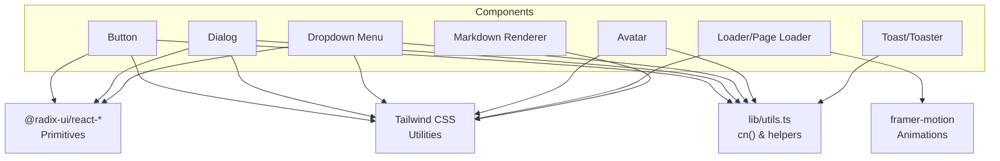
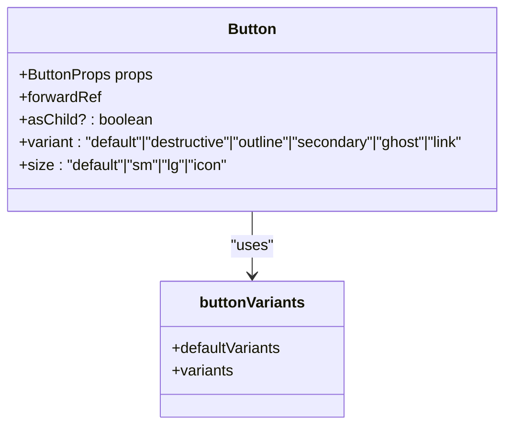
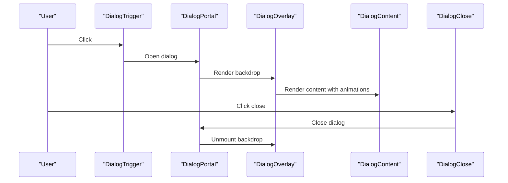
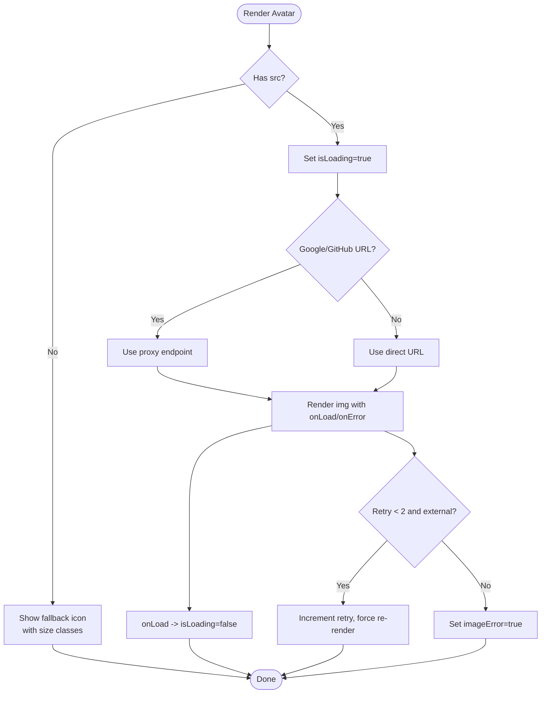
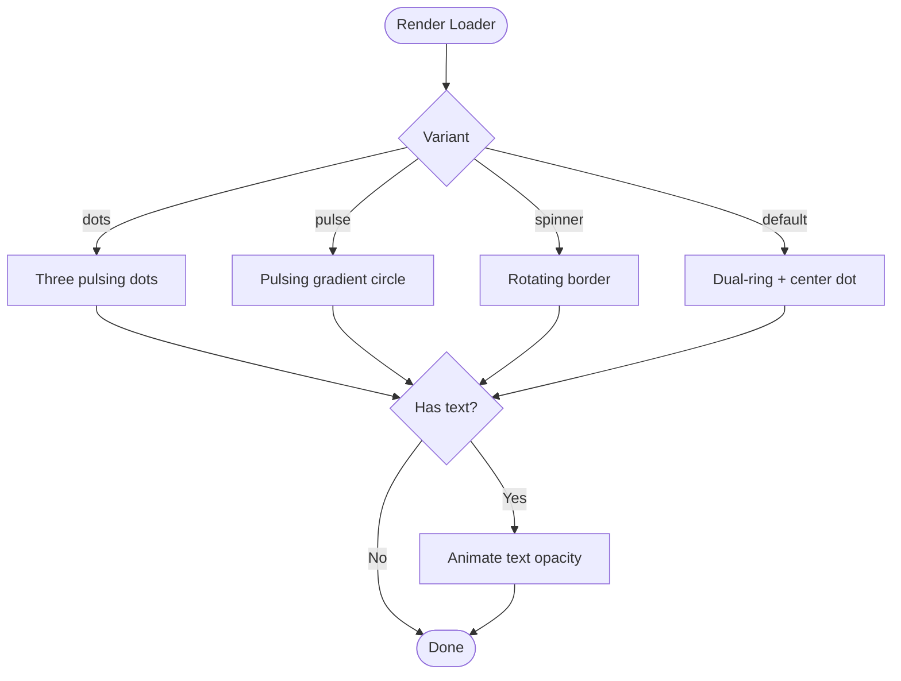
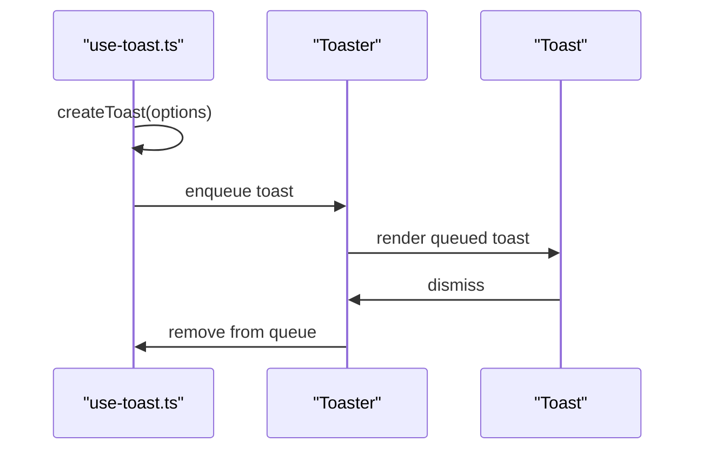
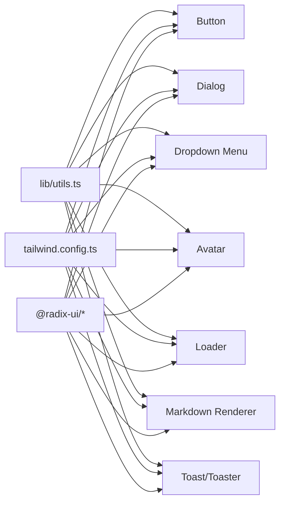

# UI Component Library

<cite>
**Referenced Files in This Document**
- [button.tsx](file://frontend/components/ui/button.tsx)
- [input.tsx](file://frontend/components/ui/input.tsx)
- [dialog.tsx](file://frontend/components/ui/dialog.tsx)
- [card.tsx](file://frontend/components/ui/card.tsx)
- [checkbox.tsx](file://frontend/components/ui/checkbox.tsx)
- [avatar.tsx](file://frontend/components/ui/avatar.tsx)
- [badge.tsx](file://frontend/components/ui/badge.tsx)
- [dropdown-menu.tsx](file://frontend/components/ui/dropdown-menu.tsx)
- [label.tsx](file://frontend/components/ui/label.tsx)
- [loader.tsx](file://frontend/components/ui/loader.tsx)
- [markdown-renderer.tsx](file://frontend/components/ui/markdown-renderer.tsx)
- [modern-mobile-menu.tsx](file://frontend/components/ui/modern-mobile-menu.tsx)
- [page-loader.tsx](file://frontend/components/ui/page-loader.tsx)
- [progress.tsx](file://frontend/components/ui/progress.tsx)
- [radio-group.tsx](file://frontend/components/ui/radio-group.tsx)
- [scroll-area.tsx](file://frontend/components/ui/scroll-area.tsx)
- [toast.tsx](file://frontend/components/ui/toast.tsx)
- [toaster.tsx](file://frontend/components/ui/toaster.tsx)
- [tailwind.config.ts](file://frontend/tailwind.config.ts)
- [globals.css](file://frontend/app/globals.css)
- [utils.ts](file://frontend/lib/utils.ts)
- [use-toast.ts](file://frontend/hooks/use-toast.ts)
- [cn function](file://frontend/lib/utils.ts)
</cite>

## Table of Contents
1. [Introduction](#introduction)
2. [Project Structure](#project-structure)
3. [Core Components](#core-components)
4. [Architecture Overview](#architecture-overview)
5. [Detailed Component Analysis](#detailed-component-analysis)
6. [Dependency Analysis](#dependency-analysis)
7. [Performance Considerations](#performance-considerations)
8. [Accessibility Features](#accessibility-features)
9. [Component Composition Strategies](#component-composition-strategies)
10. [Testing Strategies](#testing-strategies)
11. [Documentation Standards](#documentation-standards)
12. [Troubleshooting Guide](#troubleshooting-guide)
13. [Conclusion](#conclusion)

## Introduction
This document describes the UI component library architecture used in the frontend application. It covers the shared components system, reusable component patterns, and composition strategies. It also details the integration with Radix UI primitives, Tailwind CSS styling approach, and the design system implementation. The guide includes form components, data display components, and interactive elements, along with component props, customization options, accessibility features, state management, event handling, and testing strategies.

## Project Structure
The UI component library is organized under the components/ui directory. Each component is self-contained with its own TypeScript/TSX file, styling via Tailwind CSS, and optional animations powered by Framer Motion. Shared utilities and design tokens are centralized in lib/utils.ts and configured in tailwind.config.ts. Global styles are defined in app/globals.css.

```mermaid
graph TB
subgraph "UI Components"
B["Button<br/>button.tsx"]
I["Input<br/>input.tsx"]
D["Dialog<br/>dialog.tsx"]
C["Card<br/>card.tsx"]
CB["Checkbox<br/>checkbox.tsx"]
AV["Avatar<br/>avatar.tsx"]
BD["Badge<br/>badge.tsx"]
DM["Dropdown Menu<br/>dropdown-menu.tsx"]
L["Label<br/>label.tsx"]
PR["Progress<br/>progress.tsx"]
RG["Radio Group<br/>radio-group.tsx"]
SA["Scroll Area<br/>scroll-area.tsx"]
MDR["Markdown Renderer<br/>markdown-renderer.tsx"]
LO["Loader<br/>loader.tsx"]
PL["Page Loader<br/>page-loader.tsx"]
MMM["Modern Mobile Menu<br/>modern-mobile-menu.tsx"]
TS["Toast<br/>toast.tsx"]
TSTR["Toaster<br/>toaster.tsx"]
end
subgraph "Styling & Utils"
TW["Tailwind Config<br/>tailwind.config.ts"]
GCSS["Globals CSS<br/>app/globals.css"]
U["Utils<br/>lib/utils.ts"]
end
subgraph "Hooks & Services"
UT["use-toast.ts"]
end
B --> U
I --> U
D --> U
C --> U
CB --> U
AV --> U
BD --> U
DM --> U
L --> U
PR --> U
RG --> U
SA --> U
MDR --> U
LO --> U
PL --> U
MMM --> U
TS --> U
TSTR --> U
B --> TW
I --> TW
D --> TW
C --> TW
CB --> TW
AV --> TW
BD --> TW
DM --> TW
L --> TW
PR --> TW
RG --> TW
SA --> TW
MDR --> TW
LO --> TW
PL --> TW
MMM --> TW
TS --> TW
TSTR --> TW
GCSS --> TW
UT --> TSTR
```

**Diagram sources**
- [button.tsx](file://frontend/components/ui/button.tsx#L1-L57)
- [input.tsx](file://frontend/components/ui/input.tsx#L1-L26)
- [dialog.tsx](file://frontend/components/ui/dialog.tsx#L1-L123)
- [card.tsx](file://frontend/components/ui/card.tsx#L1-L87)
- [checkbox.tsx](file://frontend/components/ui/checkbox.tsx#L1-L31)
- [avatar.tsx](file://frontend/components/ui/avatar.tsx#L1-L121)
- [badge.tsx](file://frontend/components/ui/badge.tsx#L1-L37)
- [dropdown-menu.tsx](file://frontend/components/ui/dropdown-menu.tsx#L1-L201)
- [label.tsx](file://frontend/components/ui/label.tsx#L1-L27)
- [progress.tsx](file://frontend/components/ui/progress.tsx#L1-L29)
- [radio-group.tsx](file://frontend/components/ui/radio-group.tsx#L1-L45)
- [scroll-area.tsx](file://frontend/components/ui/scroll-area.tsx#L1-L49)
- [markdown-renderer.tsx](file://frontend/components/ui/markdown-renderer.tsx#L1-L77)
- [loader.tsx](file://frontend/components/ui/loader.tsx#L1-L220)
- [page-loader.tsx](file://frontend/components/ui/page-loader.tsx#L1-L23)
- [modern-mobile-menu.tsx](file://frontend/components/ui/modern-mobile-menu.tsx#L1-L121)
- [toast.tsx](file://frontend/components/ui/toast.tsx)
- [toaster.tsx](file://frontend/components/ui/toaster.tsx)
- [tailwind.config.ts](file://frontend/tailwind.config.ts)
- [globals.css](file://frontend/app/globals.css)
- [utils.ts](file://frontend/lib/utils.ts)
- [use-toast.ts](file://frontend/hooks/use-toast.ts)

**Section sources**
- [button.tsx](file://frontend/components/ui/button.tsx#L1-L57)
- [input.tsx](file://frontend/components/ui/input.tsx#L1-L26)
- [dialog.tsx](file://frontend/components/ui/dialog.tsx#L1-L123)
- [card.tsx](file://frontend/components/ui/card.tsx#L1-L87)
- [checkbox.tsx](file://frontend/components/ui/checkbox.tsx#L1-L31)
- [avatar.tsx](file://frontend/components/ui/avatar.tsx#L1-L121)
- [badge.tsx](file://frontend/components/ui/badge.tsx#L1-L37)
- [dropdown-menu.tsx](file://frontend/components/ui/dropdown-menu.tsx#L1-L201)
- [label.tsx](file://frontend/components/ui/label.tsx#L1-L27)
- [progress.tsx](file://frontend/components/ui/progress.tsx#L1-L29)
- [radio-group.tsx](file://frontend/components/ui/radio-group.tsx#L1-L45)
- [scroll-area.tsx](file://frontend/components/ui/scroll-area.tsx#L1-L49)
- [markdown-renderer.tsx](file://frontend/components/ui/markdown-renderer.tsx#L1-L77)
- [loader.tsx](file://frontend/components/ui/loader.tsx#L1-L220)
- [page-loader.tsx](file://frontend/components/ui/page-loader.tsx#L1-L23)
- [modern-mobile-menu.tsx](file://frontend/components/ui/modern-mobile-menu.tsx#L1-L121)
- [toast.tsx](file://frontend/components/ui/toast.tsx)
- [toaster.tsx](file://frontend/components/ui/toaster.tsx)
- [tailwind.config.ts](file://frontend/tailwind.config.ts)
- [globals.css](file://frontend/app/globals.css)
- [utils.ts](file://frontend/lib/utils.ts)
- [use-toast.ts](file://frontend/hooks/use-toast.ts)

## Core Components
This section documents the foundational UI components that form the shared component library.

- Button
  - Purpose: Base action element with variants and sizes.
  - Props: Inherits standard button attributes plus variant and size from class-variance-authority; supports asChild for composition.
  - Variants: default, destructive, outline, secondary, ghost, link.
  - Sizes: default, sm, lg, icon.
  - Accessibility: Inherits native button semantics; focus-visible ring via Tailwind utilities.
  - Composition: Uses Slot from @radix-ui/react-slot to wrap children when asChild is true.

- Input
  - Purpose: Text input field with consistent styling and focus states.
  - Props: Standard input attributes; integrates with Tailwind for focus, disabled, and placeholder states.
  - Accessibility: Native input semantics; focus-visible ring for keyboard navigation.

- Dialog
  - Purpose: Modal overlay with content area, header, footer, title, and description.
  - Components: Root, Trigger, Portal, Close, Overlay, Content, Header, Footer, Title, Description.
  - Accessibility: Built on @radix-ui/react-dialog; manages focus trapping and escape key handling.
  - Styling: Dark theme overlay with backdrop blur; slide/fade animations; close button with sr-only label.

- Card
  - Purpose: Container for grouping related content with header, title, description, content, and footer.
  - Components: Card, CardHeader, CardTitle, CardDescription, CardContent, CardFooter.
  - Styling: Background and border tokens; spacing and typography tokens.

- Checkbox
  - Purpose: Binary selection control with indicator.
  - Props: Inherits Radix checkbox attributes; styled with brand colors when checked.
  - Accessibility: Uses @radix-ui/react-checkbox; maintains keyboard and screen reader compatibility.

- Avatar
  - Purpose: User avatar with fallback icon and optimized image loading.
  - Props: src, alt, size (sm/md/lg), className.
  - Behavior: Optimizes Google and GitHub profile URLs via proxy; retries on failure; loading states with pulse effect.
  - Styling: Responsive sizing; border and color tokens.

- Badge
  - Purpose: Label or indicator with variants.
  - Props: Inherits standard div attributes plus variant from class-variance-authority.
  - Variants: default, secondary, destructive, outline.

- Dropdown Menu
  - Purpose: Context menu with items, checkboxes, radios, labels, separators, and submenus.
  - Components: Root, Trigger, Portal, Content, Item, CheckboxItem, RadioItem, Label, Separator, Shortcut, Group, Sub, SubContent, SubTrigger, RadioGroup.
  - Accessibility: Built on @radix-ui/react-dropdown-menu; supports nested menus and keyboard navigation.

- Label
  - Purpose: Associated label for form controls.
  - Props: Inherits Radix label attributes plus variant from class-variance-authority.
  - Accessibility: Peer-based disabled state handling; integrates with form controls.

- Progress
  - Purpose: Visual progress bar.
  - Props: Inherits Radix progress attributes; value determines indicator width.
  - Accessibility: Semantic progress indication; integrates with screen readers.

- Radio Group
  - Purpose: Group of radio buttons with consistent styling.
  - Components: RadioGroup, RadioGroupItem.
  - Accessibility: Built on @radix-ui/react-radio-group; maintains group semantics.

- Scroll Area
  - Purpose: Customizable scrollbars with viewport and corner.
  - Components: ScrollArea, ScrollBar.
  - Accessibility: Preserves native scrolling semantics; styled scrollbar thumb.

- Loader and Page Loader
  - Purpose: Loading indicators with multiple variants and full-screen overlay.
  - Variants: dots, pulse, spinner, default.
  - Props: size (sm/md/lg/xl), variant, className, text; PageLoader adds motion transitions.
  - Integration: Reuses Loader in PageLoader for consistent UX.

- Markdown Renderer
  - Purpose: Render markdown content with custom GFM-style callouts and details/summary support.
  - Props: content (unknown), className.
  - Styling: Extensive Tailwind utilities for headings, lists, callouts, and interactive elements.

- Modern Mobile Menu
  - Purpose: Interactive bottom navigation with animated underline and dynamic width calculation.
  - Props: items (array of label/icon), accentColor (CSS variable).
  - Behavior: Validates items length, calculates active line width, handles click events.

- Toast and Toaster
  - Purpose: Non-blocking notifications with queue management.
  - Integration: use-toast hook provides toast creation; Toaster renders queued toasts.

**Section sources**
- [button.tsx](file://frontend/components/ui/button.tsx#L36-L56)
- [input.tsx](file://frontend/components/ui/input.tsx#L5-L25)
- [dialog.tsx](file://frontend/components/ui/dialog.tsx#L9-L122)
- [card.tsx](file://frontend/components/ui/card.tsx#L5-L86)
- [checkbox.tsx](file://frontend/components/ui/checkbox.tsx#L9-L30)
- [avatar.tsx](file://frontend/components/ui/avatar.tsx#L5-L120)
- [badge.tsx](file://frontend/components/ui/badge.tsx#L26-L36)
- [dropdown-menu.tsx](file://frontend/components/ui/dropdown-menu.tsx#L9-L200)
- [label.tsx](file://frontend/components/ui/label.tsx#L13-L24)
- [progress.tsx](file://frontend/components/ui/progress.tsx#L8-L28)
- [radio-group.tsx](file://frontend/components/ui/radio-group.tsx#L9-L44)
- [scroll-area.tsx](file://frontend/components/ui/scroll-area.tsx#L8-L48)
- [loader.tsx](file://frontend/components/ui/loader.tsx#L6-L199)
- [page-loader.tsx](file://frontend/components/ui/page-loader.tsx#L6-L22)
- [markdown-renderer.tsx](file://frontend/components/ui/markdown-renderer.tsx#L7-L76)
- [modern-mobile-menu.tsx](file://frontend/components/ui/modern-mobile-menu.tsx#L17-L120)
- [toast.tsx](file://frontend/components/ui/toast.tsx)
- [toaster.tsx](file://frontend/components/ui/toaster.tsx)
- [use-toast.ts](file://frontend/hooks/use-toast.ts)

## Architecture Overview
The component library follows a modular, composition-first architecture:
- Each component encapsulates styling, behavior, and accessibility.
- Radix UI primitives provide accessible base behaviors (focus management, ARIA, keyboard interactions).
- Tailwind CSS provides atomic, themeable styling with design tokens.
- Utilities in lib/utils.ts centralize class merging and shared helpers.
- Framer Motion enables smooth, declarative animations for loaders and page transitions.

**Diagram sources**
- [button.tsx](file://frontend/components/ui/button.tsx#L1-L57)
- [dialog.tsx](file://frontend/components/ui/dialog.tsx#L1-L123)
- [dropdown-menu.tsx](file://frontend/components/ui/dropdown-menu.tsx#L1-L201)
- [avatar.tsx](file://frontend/components/ui/avatar.tsx#L1-L121)
- [loader.tsx](file://frontend/components/ui/loader.tsx#L1-L220)
- [page-loader.tsx](file://frontend/components/ui/page-loader.tsx#L1-L23)
- [markdown-renderer.tsx](file://frontend/components/ui/markdown-renderer.tsx#L1-L77)
- [toast.tsx](file://frontend/components/ui/toast.tsx)
- [toaster.tsx](file://frontend/components/ui/toaster.tsx)
- [utils.ts](file://frontend/lib/utils.ts)
- [tailwind.config.ts](file://frontend/tailwind.config.ts)

## Detailed Component Analysis

### Button Component
The Button component demonstrates variant-driven styling with class-variance-authority and composable rendering via Radix Slot.

**Diagram sources**
- [button.tsx](file://frontend/components/ui/button.tsx#L36-L56)

**Section sources**
- [button.tsx](file://frontend/components/ui/button.tsx#L7-L34)
- [button.tsx](file://frontend/components/ui/button.tsx#L42-L54)

### Dialog Component
The Dialog stack composes multiple Radix UI parts into a cohesive modal experience with animations and accessibility.

**Diagram sources**
- [dialog.tsx](file://frontend/components/ui/dialog.tsx#L9-L54)

**Section sources**
- [dialog.tsx](file://frontend/components/ui/dialog.tsx#L17-L54)

### Avatar Component
The Avatar component handles image loading, error fallbacks, and proxy optimization for external images.

**Diagram sources**
- [avatar.tsx](file://frontend/components/ui/avatar.tsx#L48-L78)

**Section sources**
- [avatar.tsx](file://frontend/components/ui/avatar.tsx#L12-L120)

### Loader Component
The Loader component provides multiple animation variants and a full-screen overlay.

**Diagram sources**
- [loader.tsx](file://frontend/components/ui/loader.tsx#L33-L199)

**Section sources**
- [loader.tsx](file://frontend/components/ui/loader.tsx#L13-L199)

### Toast System
The toast system integrates with a hook to manage toasts and a renderer to display them.

**Diagram sources**
- [use-toast.ts](file://frontend/hooks/use-toast.ts)
- [toaster.tsx](file://frontend/components/ui/toaster.tsx)
- [toast.tsx](file://frontend/components/ui/toast.tsx)

**Section sources**
- [use-toast.ts](file://frontend/hooks/use-toast.ts)
- [toaster.tsx](file://frontend/components/ui/toaster.tsx)
- [toast.tsx](file://frontend/components/ui/toast.tsx)

## Dependency Analysis
The component library exhibits low coupling and high cohesion:
- Components depend on Radix UI primitives for accessibility and behavior.
- Styling is centralized via Tailwind utilities and design tokens.
- Utilities in lib/utils.ts provide shared helpers like cn() for class merging.
- Animations rely on Framer Motion for consistent motion design.

**Diagram sources**
- [utils.ts](file://frontend/lib/utils.ts)
- [tailwind.config.ts](file://frontend/tailwind.config.ts)
- [button.tsx](file://frontend/components/ui/button.tsx#L1-L57)
- [dialog.tsx](file://frontend/components/ui/dialog.tsx#L1-L123)
- [dropdown-menu.tsx](file://frontend/components/ui/dropdown-menu.tsx#L1-L201)
- [avatar.tsx](file://frontend/components/ui/avatar.tsx#L1-L121)
- [loader.tsx](file://frontend/components/ui/loader.tsx#L1-L220)
- [markdown-renderer.tsx](file://frontend/components/ui/markdown-renderer.tsx#L1-L77)
- [toast.tsx](file://frontend/components/ui/toast.tsx)
- [toaster.tsx](file://frontend/components/ui/toaster.tsx)

**Section sources**
- [utils.ts](file://frontend/lib/utils.ts)
- [tailwind.config.ts](file://frontend/tailwind.config.ts)
- [button.tsx](file://frontend/components/ui/button.tsx#L1-L57)
- [dialog.tsx](file://frontend/components/ui/dialog.tsx#L1-L123)
- [dropdown-menu.tsx](file://frontend/components/ui/dropdown-menu.tsx#L1-L201)
- [avatar.tsx](file://frontend/components/ui/avatar.tsx#L1-L121)
- [loader.tsx](file://frontend/components/ui/loader.tsx#L1-L220)
- [markdown-renderer.tsx](file://frontend/components/ui/markdown-renderer.tsx#L1-L77)
- [toast.tsx](file://frontend/components/ui/toast.tsx)
- [toaster.tsx](file://frontend/components/ui/toaster.tsx)

## Performance Considerations
- Prefer variant props over inline styles to leverage Tailwind’s efficient class generation.
- Use memoization for derived values (e.g., useMemo in interactive menu) to avoid unnecessary recalculations.
- Lazy-load heavy assets (images) and use optimized URLs to reduce bandwidth and improve CLS.
- Keep animations minimal and scoped to avoid layout thrashing; use transform and opacity where possible.
- Consolidate animations through shared components (Loader) to reduce duplication.

## Accessibility Features
- Focus management: Components built on Radix UI ensure focus trapping, escape key handling, and proper focus order.
- Keyboard navigation: Dropdowns, dialogs, and radio groups support keyboard interactions.
- Screen reader support: Proper ARIA roles and labels are applied via Radix primitives and semantic HTML.
- Contrast and visibility: Tailwind utilities enforce sufficient contrast and readable text sizes.
- Form controls: Labels associate with inputs; disabled states are communicated clearly.

## Component Composition Strategies
- Composition over inheritance: Use asChild patterns (e.g., Button with Slot) to wrap other components.
- Slot pattern: Enables flexible DOM structure while preserving component behavior.
- Compound components: Dialog exposes multiple subcomponents (Content, Header, Footer) for structured markup.
- Variant systems: class-variance-authority allows consistent, extensible styling across components.
- Theme tokens: Centralized design tokens in Tailwind config enable consistent theming.

## Testing Strategies
- Unit tests: Verify component rendering with different props (variants, sizes, states).
- Accessibility tests: Use axe-core or similar tools to check ARIA attributes and keyboard navigation.
- Interaction tests: Simulate user actions (clicks, focus, keyboard) to validate behavior.
- Snapshot tests: Capture component output to prevent regressions.
- Integration tests: Test composed components (e.g., Dialog with Button trigger) to ensure interoperability.

## Documentation Standards
- Component READMEs: Describe purpose, props, variants, and usage examples.
- Storybook stories: Visualize component states and variants.
- Type documentation: Exported props should be typed and documented.
- Accessibility checklist: Include accessibility notes per component.
- Migration guides: Document breaking changes and upgrade steps for major updates.

## Troubleshooting Guide
- Dialog not closing: Ensure DialogClose is used and that the portal mounts correctly.
- Avatar flickering: Confirm image load/error handlers and retry logic are functioning.
- Loader not animating: Verify Framer Motion is imported and animations are enabled.
- Toast not appearing: Check use-toast hook and Toaster registration.
- Styles not applying: Confirm Tailwind utilities and design tokens are present in the build.

**Section sources**
- [dialog.tsx](file://frontend/components/ui/dialog.tsx#L1-L123)
- [avatar.tsx](file://frontend/components/ui/avatar.tsx#L1-L121)
- [loader.tsx](file://frontend/components/ui/loader.tsx#L1-L220)
- [use-toast.ts](file://frontend/hooks/use-toast.ts)
- [toaster.tsx](file://frontend/components/ui/toaster.tsx)

## Conclusion
The UI component library leverages Radix UI for accessibility, Tailwind CSS for styling, and Framer Motion for animations to deliver a consistent, themeable, and accessible design system. Components are designed for composition, extensibility, and maintainability, with clear patterns for state management, event handling, and integration across the application.