# UI Primitive Components

<cite>
**Referenced Files in This Document**
- [button.tsx](file://frontend/components/ui/button.tsx)
- [input.tsx](file://frontend/components/ui/input.tsx)
- [dialog.tsx](file://frontend/components/ui/dialog.tsx)
- [card.tsx](file://frontend/components/ui/card.tsx)
- [avatar.tsx](file://frontend/components/ui/avatar.tsx)
- [badge.tsx](file://frontend/components/ui/badge.tsx)
- [checkbox.tsx](file://frontend/components/ui/checkbox.tsx)
- [dropdown-menu.tsx](file://frontend/components/ui/dropdown-menu.tsx)
- [label.tsx](file://frontend/components/ui/label.tsx)
- [loader.tsx](file://frontend/components/ui/loader.tsx)
- [markdown-renderer.tsx](file://frontend/components/ui/markdown-renderer.tsx)
- [progress.tsx](file://frontend/components/ui/progress.tsx)
- [radio-group.tsx](file://frontend/components/ui/radio-group.tsx)
- [scroll-area.tsx](file://frontend/components/ui/scroll-area.tsx)
- [select.tsx](file://frontend/components/ui/select.tsx)
- [slider.tsx](file://frontend/components/ui/slider.tsx)
- [switch.tsx](file://frontend/components/ui/switch.tsx)
- [tabs.tsx](file://frontend/components/ui/tabs.tsx)
- [textarea.tsx](file://frontend/components/ui/textarea.tsx)
- [toast.tsx](file://frontend/components/ui/toast.tsx)
- [toaster.tsx](file://frontend/components/ui/toaster.tsx)
- [command.tsx](file://frontend/components/ui/command.tsx)
- [popover.tsx](file://frontend/components/ui/popover.tsx)
- [haptics.ts](file://frontend/lib/haptics.ts)
</cite>

## Update Summary
**Changes Made**
- Added new Command component for keyboard-driven search and selection
- Added new Popover component for modal-like interactions
- Enhanced Select component with haptic feedback integration
- Updated project structure diagram to include new components
- Added haptic feedback documentation and integration patterns

## Table of Contents
1. [Introduction](#introduction)
2. [Project Structure](#project-structure)
3. [Core Components](#core-components)
4. [Architecture Overview](#architecture-overview)
5. [Detailed Component Analysis](#detailed-component-analysis)
6. [Dependency Analysis](#dependency-analysis)
7. [Performance Considerations](#performance-considerations)
8. [Troubleshooting Guide](#troubleshooting-guide)
9. [Conclusion](#conclusion)
10. [Appendices](#appendices)

## Introduction
This document describes the foundational UI primitive components used across the frontend. It explains each component's purpose, props, styling options, accessibility features, and usage patterns. It also details how these primitives integrate with Radix UI and Tailwind CSS, and how they compose to form higher-level components. Where applicable, we include code-level diagrams and flowcharts to illustrate behavior and data flow.

**Updated** Added new Command component for keyboard-driven search and selection, Popover component for modal-like interactions, and enhanced Select component with haptic feedback integration.

## Project Structure
The primitives live under the UI module and are thin wrappers around Radix UI primitives and Tailwind classes. They expose consistent props, variants, and slots for composition. The new Command and Popover components integrate seamlessly with the existing component ecosystem.

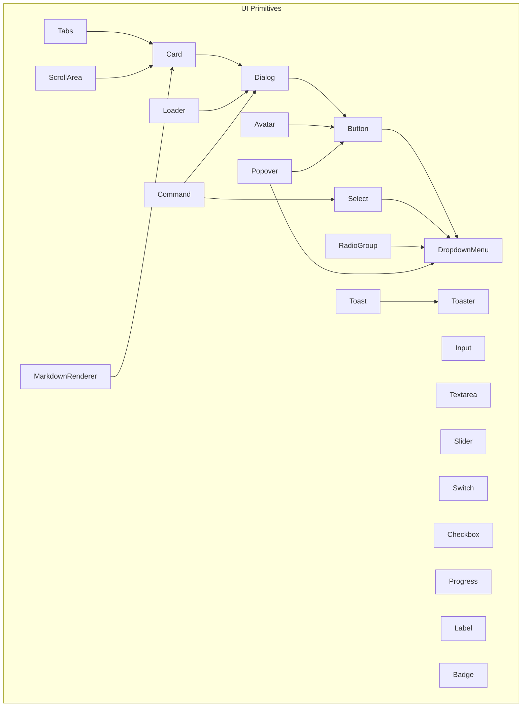

**Diagram sources**
- [button.tsx](file://frontend/components/ui/button.tsx#L1-L57)
- [input.tsx](file://frontend/components/ui/input.tsx#L1-L26)
- [textarea.tsx](file://frontend/components/ui/textarea.tsx)
- [slider.tsx](file://frontend/components/ui/slider.tsx#L1-L29)
- [switch.tsx](file://frontend/components/ui/switch.tsx)
- [checkbox.tsx](file://frontend/components/ui/checkbox.tsx#L1-L31)
- [radio-group.tsx](file://frontend/components/ui/radio-group.tsx#L1-L45)
- [progress.tsx](file://frontend/components/ui/progress.tsx#L1-L29)
- [label.tsx](file://frontend/components/ui/label.tsx#L1-L27)
- [avatar.tsx](file://frontend/components/ui/avatar.tsx#L1-L121)
- [badge.tsx](file://frontend/components/ui/badge.tsx#L1-L37)
- [dialog.tsx](file://frontend/components/ui/dialog.tsx#L1-L123)
- [card.tsx](file://frontend/components/ui/card.tsx#L1-L87)
- [dropdown-menu.tsx](file://frontend/components/ui/dropdown-menu.tsx#L1-L201)
- [select.tsx](file://frontend/components/ui/select.tsx#L1-L186)
- [tabs.tsx](file://frontend/components/ui/tabs.tsx)
- [scroll-area.tsx](file://frontend/components/ui/scroll-area.tsx#L1-L49)
- [markdown-renderer.tsx](file://frontend/components/ui/markdown-renderer.tsx#L1-L77)
- [loader.tsx](file://frontend/components/ui/loader.tsx#L1-L220)
- [toast.tsx](file://frontend/components/ui/toast.tsx)
- [toaster.tsx](file://frontend/components/ui/toaster.tsx)
- [command.tsx](file://frontend/components/ui/command.tsx#L1-L156)
- [popover.tsx](file://frontend/components/ui/popover.tsx#L1-L34)

**Section sources**
- [button.tsx](file://frontend/components/ui/button.tsx#L1-L57)
- [dialog.tsx](file://frontend/components/ui/dialog.tsx#L1-L123)
- [card.tsx](file://frontend/components/ui/card.tsx#L1-L87)
- [avatar.tsx](file://frontend/components/ui/avatar.tsx#L1-L121)
- [badge.tsx](file://frontend/components/ui/badge.tsx#L1-L37)
- [checkbox.tsx](file://frontend/components/ui/checkbox.tsx#L1-L31)
- [dropdown-menu.tsx](file://frontend/components/ui/dropdown-menu.tsx#L1-L201)
- [label.tsx](file://frontend/components/ui/label.tsx#L1-L27)
- [loader.tsx](file://frontend/components/ui/loader.tsx#L1-L220)
- [markdown-renderer.tsx](file://frontend/components/ui/markdown-renderer.tsx#L1-L77)
- [progress.tsx](file://frontend/components/ui/progress.tsx#L1-L29)
- [radio-group.tsx](file://frontend/components/ui/radio-group.tsx#L1-L45)
- [scroll-area.tsx](file://frontend/components/ui/scroll-area.tsx#L1-L49)
- [select.tsx](file://frontend/components/ui/select.tsx#L1-L186)
- [slider.tsx](file://frontend/components/ui/slider.tsx#L1-L29)
- [switch.tsx](file://frontend/components/ui/switch.tsx)
- [tabs.tsx](file://frontend/components/ui/tabs.tsx)
- [textarea.tsx](file://frontend/components/ui/textarea.tsx)
- [toast.tsx](file://frontend/components/ui/toast.tsx)
- [toaster.tsx](file://frontend/components/ui/toaster.tsx)
- [command.tsx](file://frontend/components/ui/command.tsx#L1-L156)
- [popover.tsx](file://frontend/components/ui/popover.tsx#L1-L34)

## Core Components
Below is a concise overview of each primitive, focusing on props, styling, accessibility, and typical usage patterns.

- Button
  - Purpose: Presents actionable controls with variants and sizes.
  - Props: Inherits native button attributes plus variant and size from its variant factory; supports asChild for composing with links or other elements.
  - Styling: Uses Tailwind classes via a variant factory; integrates with theme tokens.
  - Accessibility: Inherits focus-visible styles and disabled states from the variant factory.
  - Usage pattern: Wrap child content; pass onClick; optionally use asChild to render a link.

- Input
  - Purpose: Standard text input with consistent focus and disabled states.
  - Props: Inherits native input attributes; supports type.
  - Styling: Tailwind classes define focus rings, borders, and disabled behavior.
  - Accessibility: Focus-visible ring ensures keyboard operability.
  - Usage pattern: Controlled via useState; combine with Label for accessibility.

- Dialog
  - Purpose: Overlay modal with portal rendering and animated content.
  - Props: Root, Trigger, Portal, Overlay, Content, Close, Header, Footer, Title, Description.
  - Styling: Dark backdrop blur; slide/fade animations; responsive max-width and max-height.
  - Accessibility: Focus trapping via Radix; close button with aria-label; overlay click-to-close.
  - Usage pattern: Open/close via Trigger; render children inside Content; place actions in Footer.

- Card
  - Purpose: Container with header, title, description, content, and footer slots.
  - Props: Standard div attributes; composed via forwardRef.
  - Styling: Tailwind-based card background and shadows; spacing helpers for header/footer.
  - Accessibility: No special ARIA; rely on semantic headings and paragraphs.
  - Usage pattern: Nest Title/Description/Content/Footer inside Card.

- Avatar
  - Purpose: User avatar with fallback icon and optimized image loading.
  - Props: src, alt, size (sm/md/lg), className.
  - Styling: Size classes per variant; pulse loader overlay; brand accent borders.
  - Accessibility: Fallback icon; alt text passed to img.
  - Usage pattern: Provide src; handle optional alt; size affects visual weight.

- Badge
  - Purpose: Small status or metadata indicator.
  - Props: Inherits HTML div attributes plus variant from its variant factory.
  - Styling: Rounded pill shape; variant tokens for color.
  - Accessibility: Stateless; ensure sufficient color contrast.
  - Usage pattern: Render with text content; choose variant for semantic meaning.

- Checkbox
  - Purpose: Binary selection with visual indicator.
  - Props: Inherits Radix checkbox attributes; styled with Tailwind.
  - Styling: Brand-checked state; focus-visible ring; disabled opacity.
  - Accessibility: Works with Label; supports keyboard activation.
  - Usage pattern: Controlled via checked prop; pair with Label.

- DropdownMenu
  - Purpose: Menu with nested submenus, checkboxes, radios, and shortcuts.
  - Props: Root, Trigger, Group, Portal, Sub, SubTrigger, SubContent, Content, Item, CheckboxItem, RadioItem, Label, Separator, Shortcut, RadioGroup.
  - Styling: Popover-like content with transitions; inset support for nested items.
  - Accessibility: Keyboard navigation; focus management; open/close states handled by Radix.
  - Usage pattern: Compose Trigger with Content; nest Sub* for hierarchical menus.

- Label
  - Purpose: Associates text with form controls.
  - Props: Inherits Radix label attributes plus variant from its variant factory.
  - Styling: Peer-disabled cursor and opacity; integrates with form controls.
  - Accessibility: Essential for screen readers; clicking label toggles associated control.
  - Usage pattern: Wrap input/control; apply for-labelledby relationships.

- Loader
  - Purpose: Animated loading indicators with multiple variants and overlay mode.
  - Props: size (sm/md/lg/xl), variant (default/dots/pulse/spinner), className, text.
  - Styling: Motion-based animations; brand color accents; centered layout.
  - Accessibility: Not inherently interactive; consider aria-live regions when used in pages.
  - Usage pattern: Render inline or via LoaderOverlay for full-screen blocking.

- MarkdownRenderer
  - Purpose: Renders markdown with custom GFM-style callouts and details/summary support.
  - Props: content (unknown), className.
  - Styling: Utility-first Tailwind classes targeting details, callouts, and task lists.
  - Accessibility: Ensures semantic headings and lists; details/summary supported.
  - Usage pattern: Pass raw markdown; style via className overrides.

- Progress
  - Purpose: Visual progress bar with numeric value.
  - Props: Inherits Radix progress attributes; value prop drives width.
  - Styling: Background track and animated indicator; transforms based on percentage.
  - Accessibility: Announce progress changes via ARIA if needed.
  - Usage pattern: Bind value to completion percentage.

- RadioGroup
  - Purpose: Single-selection group with visual indicators.
  - Props: Root and Item inherit Radix attributes; styled with Tailwind.
  - Styling: Circular items with focus ring; indicator uses a small circle.
  - Accessibility: Keyboard navigation; checked state managed by Radix.
  - Usage pattern: Use RadioGroup.Root with RadioGroup.Item children.

- ScrollArea
  - Purpose: Adds custom scrollbar to overflow content.
  - Props: Root and ScrollBar inherit Radix attributes; orientation defaults vertical.
  - Styling: Track and thumb with transparency; handles horizontal/vertical modes.
  - Accessibility: Preserves native scrolling semantics.
  - Usage pattern: Wrap content in viewport; ScrollBar is auto-added.

- Select
  - Purpose: Customizable single/multi-select with scroll buttons and popper positioning.
  - Props: Root, Group, Value, Trigger, Content, Label, Item, Separator, ScrollUp/DownButton.
  - Styling: Trigger mimics input; Content uses popover styles; item indicators.
  - Accessibility: Keyboard navigation; focus management; viewport sizing.
  - Usage pattern: Compose Trigger with Content and Item children.
  - **Enhanced** Now includes haptic feedback integration for improved tactile experience.

- Slider
  - Purpose: Range selector with draggable thumb.
  - Props: Inherits Radix slider attributes; styled with Tailwind.
  - Styling: Track and range; thumb with focus ring.
  - Accessibility: Keyboard and mouse; supports disabled state.
  - Usage pattern: Controlled via value prop; bind onChangeEnd for final updates.

- Switch
  - Purpose: Toggle control with visual knob.
  - Props: Inherits Radix switch attributes; styled with Tailwind.
  - Styling: Track and thumb; focus ring; disabled opacity.
  - Accessibility: Toggle semantics; keyboard activation.
  - Usage pattern: Controlled via checked prop; pair with Label.

- Tabs
  - Purpose: Organizes content into selectable panels.
  - Props: Inherits Radix tabs attributes; styled with Tailwind.
  - Styling: Indicator and panel transitions; focus ring.
  - Accessibility: Keyboard navigation; selected tab receives focus.
  - Usage pattern: Compose List, Trigger, Content; ensure unique ids.

- Textarea
  - Purpose: Multi-line text input with consistent focus/disabled styling.
  - Props: Inherits native textarea attributes.
  - Styling: Tailwind classes mirror Input but for multiline.
  - Accessibility: Focus-visible ring; label association recommended.
  - Usage pattern: Controlled via useState; resize via CSS if needed.

- Toast
  - Purpose: Non-blocking notifications.
  - Props: Inherits attributes appropriate for transient messages.
  - Styling: Tailwind-based; integrates with Toaster.
  - Accessibility: Consider aria-live and role; avoid auto-dismiss for critical info.
  - Usage pattern: Trigger via hook; manage queue via Toaster.

- Toaster
  - Purpose: Container for Toast notifications with queue management.
  - Props: Inherits attributes for toast container.
  - Styling: Tailwind-based; manages stacking and transitions.
  - Accessibility: Ensure sufficient time for reading; allow manual dismissal.
  - Usage pattern: Render once; trigger toasts via hook.

- Command
  - Purpose: Keyboard-driven search and selection interface with instant results.
  - Props: Command, CommandDialog, CommandInput, CommandList, CommandEmpty, CommandGroup, CommandItem, CommandSeparator, CommandShortcut.
  - Styling: Popover-based container with focused styling for selected items.
  - Accessibility: Keyboard navigation with arrow keys, Enter to select, Escape to close.
  - Usage pattern: Wrap search interface with CommandDialog; use CommandInput for search; populate CommandList with CommandItem entries.

- Popover
  - Purpose: Modal-like overlay content positioned relative to a trigger element.
  - Props: Root, Trigger, Content, Anchor with alignment and offset options.
  - Styling: Z-index stacking with fade and slide animations; responsive positioning.
  - Accessibility: Focus management and keyboard interaction; supports align and sideOffset props.
  - Usage pattern: Compose PopoverTrigger with PopoverContent; use PopoverAnchor for precise positioning.

**Section sources**
- [button.tsx](file://frontend/components/ui/button.tsx#L36-L54)
- [input.tsx](file://frontend/components/ui/input.tsx#L5-L23)
- [dialog.tsx](file://frontend/components/ui/dialog.tsx#L9-L122)
- [card.tsx](file://frontend/components/ui/card.tsx#L5-L86)
- [avatar.tsx](file://frontend/components/ui/avatar.tsx#L5-L120)
- [badge.tsx](file://frontend/components/ui/badge.tsx#L26-L34)
- [checkbox.tsx](file://frontend/components/ui/checkbox.tsx#L9-L28)
- [dropdown-menu.tsx](file://frontend/components/ui/dropdown-menu.tsx#L9-L200)
- [label.tsx](file://frontend/components/ui/label.tsx#L13-L24)
- [loader.tsx](file://frontend/components/ui/loader.tsx#L6-L199)
- [markdown-renderer.tsx](file://frontend/components/ui/markdown-renderer.tsx#L7-L76)
- [progress.tsx](file://frontend/components/ui/progress.tsx#L8-L26)
- [radio-group.tsx](file://frontend/components/ui/radio-group.tsx#L9-L44)
- [scroll-area.tsx](file://frontend/components/ui/scroll-area.tsx#L8-L48)
- [select.tsx](file://frontend/components/ui/select.tsx#L9-L186)
- [slider.tsx](file://frontend/components/ui/slider.tsx#L8-L26)
- [switch.tsx](file://frontend/components/ui/switch.tsx)
- [tabs.tsx](file://frontend/components/ui/tabs.tsx)
- [textarea.tsx](file://frontend/components/ui/textarea.tsx)
- [toast.tsx](file://frontend/components/ui/toast.tsx)
- [toaster.tsx](file://frontend/components/ui/toaster.tsx)
- [command.tsx](file://frontend/components/ui/command.tsx#L11-L155)
- [popover.tsx](file://frontend/components/ui/popover.tsx#L8-L33)

## Architecture Overview
These primitives are thin wrappers around Radix UI primitives, exposing a consistent API and styling via Tailwind. They promote composition and accessibility by forwarding refs, preserving event handlers, and integrating with theme tokens. The new Command component integrates with the cmdk library for keyboard-driven interactions, while Popover provides modal-like positioning capabilities.

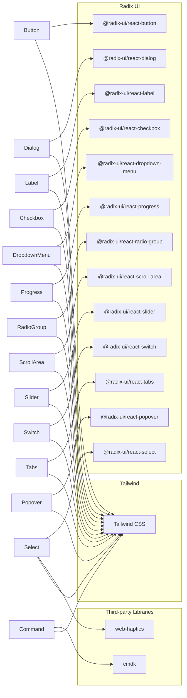

**Diagram sources**
- [button.tsx](file://frontend/components/ui/button.tsx#L1-L57)
- [dialog.tsx](file://frontend/components/ui/dialog.tsx#L1-L123)
- [label.tsx](file://frontend/components/ui/label.tsx#L1-L27)
- [checkbox.tsx](file://frontend/components/ui/checkbox.tsx#L1-L31)
- [dropdown-menu.tsx](file://frontend/components/ui/dropdown-menu.tsx#L1-L201)
- [progress.tsx](file://frontend/components/ui/progress.tsx#L1-L29)
- [radio-group.tsx](file://frontend/components/ui/radio-group.tsx#L1-L45)
- [scroll-area.tsx](file://frontend/components/ui/scroll-area.tsx#L1-L49)
- [select.tsx](file://frontend/components/ui/select.tsx#L1-L186)
- [slider.tsx](file://frontend/components/ui/slider.tsx#L1-L29)
- [switch.tsx](file://frontend/components/ui/switch.tsx)
- [tabs.tsx](file://frontend/components/ui/tabs.tsx)
- [input.tsx](file://frontend/components/ui/input.tsx#L1-L26)
- [card.tsx](file://frontend/components/ui/card.tsx#L1-L87)
- [avatar.tsx](file://frontend/components/ui/avatar.tsx#L1-L121)
- [badge.tsx](file://frontend/components/ui/badge.tsx#L1-L37)
- [loader.tsx](file://frontend/components/ui/loader.tsx#L1-L220)
- [markdown-renderer.tsx](file://frontend/components/ui/markdown-renderer.tsx#L1-L77)
- [textarea.tsx](file://frontend/components/ui/textarea.tsx)
- [toast.tsx](file://frontend/components/ui/toast.tsx)
- [toaster.tsx](file://frontend/components/ui/toaster.tsx)
- [command.tsx](file://frontend/components/ui/command.tsx#L1-L156)
- [popover.tsx](file://frontend/components/ui/popover.tsx#L1-L34)
- [haptics.ts](file://frontend/lib/haptics.ts#L1-L81)

## Detailed Component Analysis

### Button
- Composition: Uses a variant factory for consistent variants and sizes; supports asChild to render as a slot element.
- Accessibility: Focus-visible ring and disabled pointer-events.
- Usage patterns: Use variant for semantic intent (default, destructive, outline, secondary, ghost, link); size for density; asChild for anchor tags.

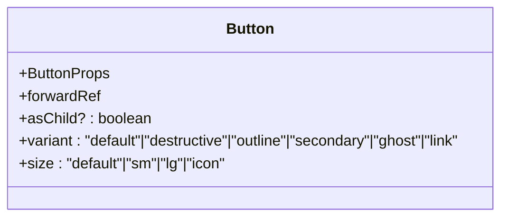

**Diagram sources**
- [button.tsx](file://frontend/components/ui/button.tsx#L36-L54)

**Section sources**
- [button.tsx](file://frontend/components/ui/button.tsx#L7-L34)
- [button.tsx](file://frontend/components/ui/button.tsx#L36-L54)

### Dialog
- Composition: Root, Trigger, Portal, Overlay, Content, Close, Header, Footer, Title, Description.
- Accessibility: Focus trap via Radix; overlay click-to-close; close button with aria-label.
- Usage patterns: Open via Trigger; render structured content inside Content; place actions in Footer.

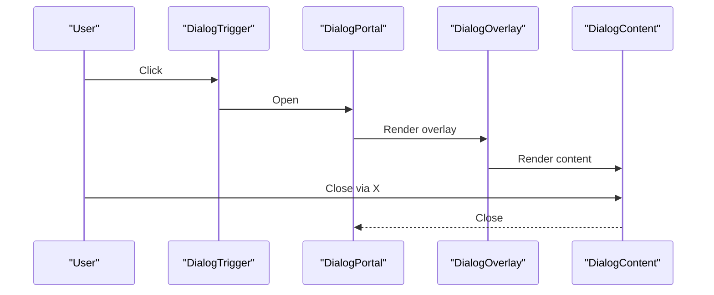

**Diagram sources**
- [dialog.tsx](file://frontend/components/ui/dialog.tsx#L9-L54)

**Section sources**
- [dialog.tsx](file://frontend/components/ui/dialog.tsx#L17-L54)
- [dialog.tsx](file://frontend/components/ui/dialog.tsx#L56-L122)

### Card
- Composition: Card, CardHeader, CardTitle, CardDescription, CardContent, CardFooter.
- Accessibility: Semantic headings and paragraphs; ensure contrast.
- Usage patterns: Use CardHeader/Title/Description for metadata; CardContent for body; CardFooter for actions.

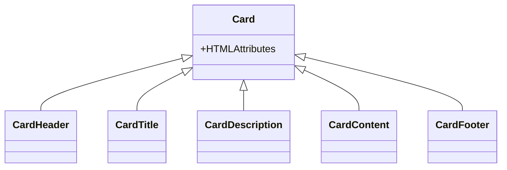

**Diagram sources**
- [card.tsx](file://frontend/components/ui/card.tsx#L5-L86)

**Section sources**
- [card.tsx](file://frontend/components/ui/card.tsx#L5-L86)

### Avatar
- Composition: Image with fallback icon; optimized URL handling for external providers; loading/error states.
- Accessibility: Alt text; fallback icon when image fails.
- Usage patterns: Provide src; size affects visual weight; alt text improves accessibility.

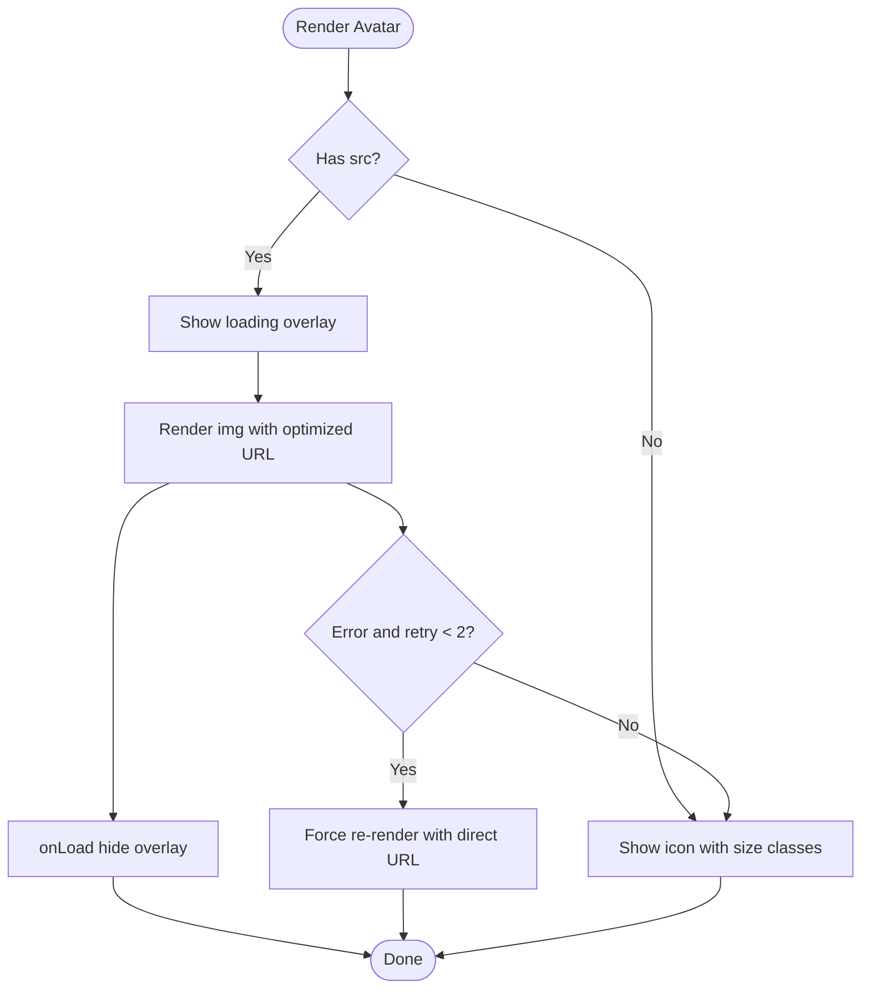

**Diagram sources**
- [avatar.tsx](file://frontend/components/ui/avatar.tsx#L12-L120)

**Section sources**
- [avatar.tsx](file://frontend/components/ui/avatar.tsx#L5-L120)

### Badge
- Composition: Variant factory for default, secondary, destructive, outline.
- Accessibility: Stateless; ensure contrast with background.
- Usage patterns: Use variant to reflect status or category.

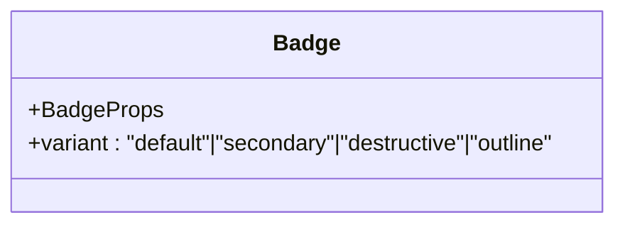

**Diagram sources**
- [badge.tsx](file://frontend/components/ui/badge.tsx#L26-L34)

**Section sources**
- [badge.tsx](file://frontend/components/ui/badge.tsx#L6-L24)
- [badge.tsx](file://frontend/components/ui/badge.tsx#L26-L34)

### Checkbox
- Composition: Radix Checkbox with styled indicator.
- Accessibility: Works with Label; keyboard activation.
- Usage patterns: Controlled via checked; pair with Label.

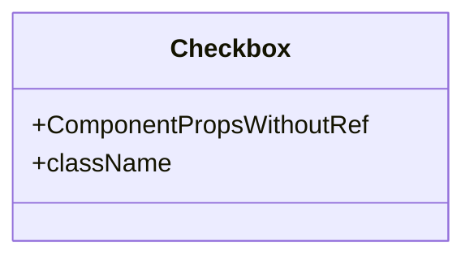

**Diagram sources**
- [checkbox.tsx](file://frontend/components/ui/checkbox.tsx#L9-L28)

**Section sources**
- [checkbox.tsx](file://frontend/components/ui/checkbox.tsx#L1-L31)

### DropdownMenu
- Composition: Root, Trigger, Portal, Sub, SubTrigger, SubContent, Content, Item, CheckboxItem, RadioItem, Label, Separator, Shortcut, RadioGroup.
- Accessibility: Keyboard navigation; focus management.
- Usage patterns: Compose Trigger with Content; nest Sub* for hierarchical menus.

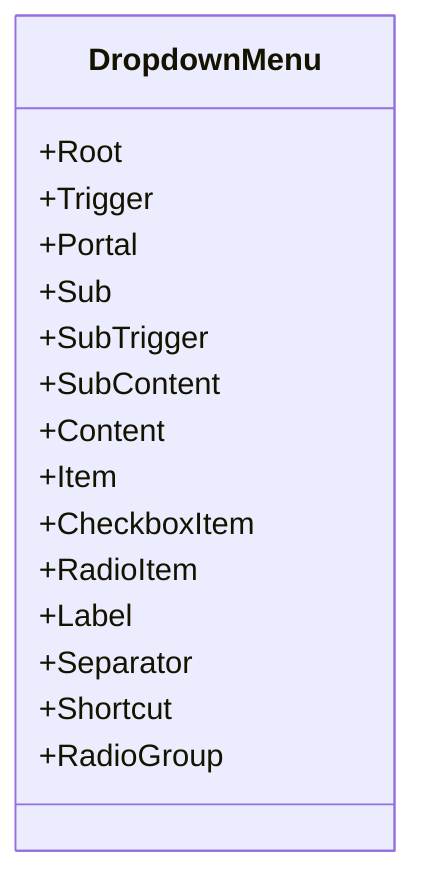

**Diagram sources**
- [dropdown-menu.tsx](file://frontend/components/ui/dropdown-menu.tsx#L9-L200)

**Section sources**
- [dropdown-menu.tsx](file://frontend/components/ui/dropdown-menu.tsx#L1-L201)

### Label
- Composition: Radix Label with variant factory.
- Accessibility: Essential for screen readers; clicking toggles associated control.
- Usage patterns: Wrap input/control; apply for-labelledby relationships.

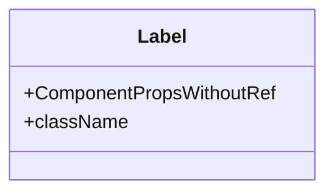

**Diagram sources**
- [label.tsx](file://frontend/components/ui/label.tsx#L13-L24)

**Section sources**
- [label.tsx](file://frontend/components/ui/label.tsx#L9-L24)

### Loader
- Composition: Multiple variants (default/dots/pulse/spinner) with optional text; overlay mode.
- Accessibility: Not inherently interactive; consider aria-live regions.
- Usage patterns: Render inline or via LoaderOverlay for full-screen blocking.

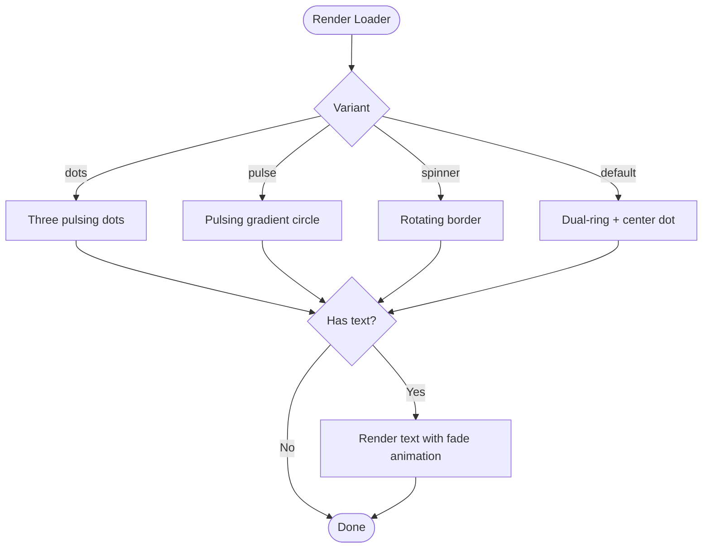

**Diagram sources**
- [loader.tsx](file://frontend/components/ui/loader.tsx#L13-L199)

**Section sources**
- [loader.tsx](file://frontend/components/ui/loader.tsx#L6-L199)
- [loader.tsx](file://frontend/components/ui/loader.tsx#L202-L220)

### MarkdownRenderer
- Composition: Uses a hook to produce rendered parts; applies Tailwind utilities for details/summaries, callouts, and task lists.
- Accessibility: Ensures semantic headings and lists; details/summary supported.
- Usage patterns: Pass raw markdown; style via className overrides.

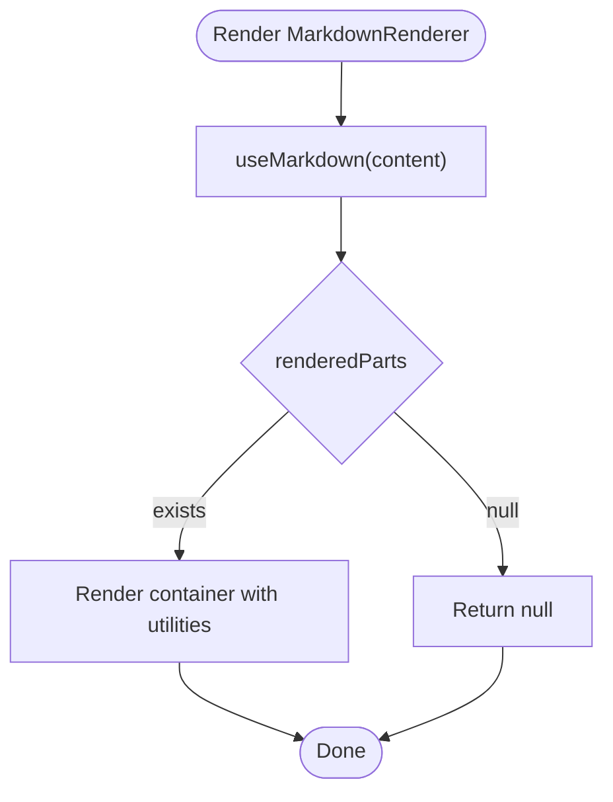

**Diagram sources**
- [markdown-renderer.tsx](file://frontend/components/ui/markdown-renderer.tsx#L12-L76)

**Section sources**
- [markdown-renderer.tsx](file://frontend/components/ui/markdown-renderer.tsx#L7-L76)

### Progress
- Composition: Radix Progress with styled indicator.
- Accessibility: Announce progress changes via ARIA if needed.
- Usage patterns: Bind value to completion percentage.

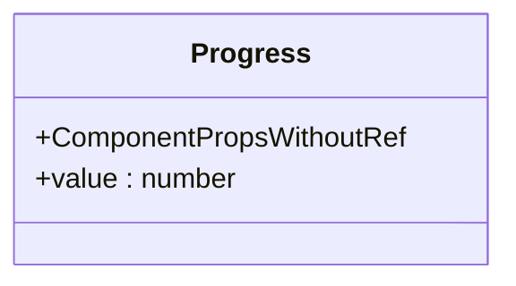

**Diagram sources**
- [progress.tsx](file://frontend/components/ui/progress.tsx#L8-L26)

**Section sources**
- [progress.tsx](file://frontend/components/ui/progress.tsx#L1-L29)

### RadioGroup
- Composition: Radix RadioGroup with styled items.
- Accessibility: Keyboard navigation; checked state managed by Radix.
- Usage patterns: Use RadioGroup.Root with RadioGroup.Item children.

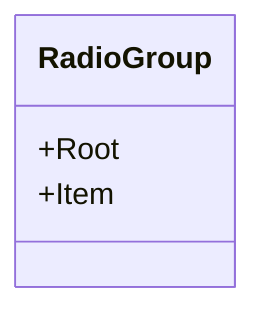

**Diagram sources**
- [radio-group.tsx](file://frontend/components/ui/radio-group.tsx#L9-L44)

**Section sources**
- [radio-group.tsx](file://frontend/components/ui/radio-group.tsx#L1-L45)

### ScrollArea
- Composition: Radix ScrollArea with styled scrollbar.
- Accessibility: Preserves native scrolling semantics.
- Usage patterns: Wrap content in viewport; ScrollBar is auto-added.

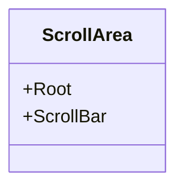

**Diagram sources**
- [scroll-area.tsx](file://frontend/components/ui/scroll-area.tsx#L8-L48)

**Section sources**
- [scroll-area.tsx](file://frontend/components/ui/scroll-area.tsx#L1-L49)

### Select
- Composition: Root, Trigger, Content, Item, Label, Separator, ScrollUp/DownButton.
- Accessibility: Keyboard navigation; focus management; viewport sizing.
- Usage patterns: Compose Trigger with Content and Item children.
- **Enhanced** Integrated haptic feedback for improved tactile experience during interactions.

**Updated** Enhanced Select component now includes haptic feedback integration through the haptic utility. The SelectTrigger and SelectItem components now trigger haptic pulses on user interactions:
- SelectTrigger triggers "medium" haptic feedback when opening the dropdown
- SelectItem triggers "selection" haptic feedback when selecting an option

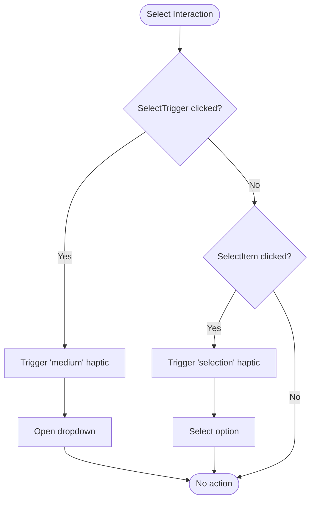

**Diagram sources**
- [select.tsx](file://frontend/components/ui/select.tsx#L16-L44)
- [select.tsx](file://frontend/components/ui/select.tsx#L128-L159)
- [haptics.ts](file://frontend/lib/haptics.ts#L19-L36)

**Section sources**
- [select.tsx](file://frontend/components/ui/select.tsx#L1-L186)
- [haptics.ts](file://frontend/lib/haptics.ts#L64-L67)

### Slider
- Composition: Radix Slider with styled track and thumb.
- Accessibility: Keyboard and mouse; supports disabled state.
- Usage patterns: Controlled via value prop; bind onChangeEnd for final updates.

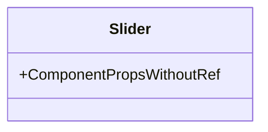

**Diagram sources**
- [slider.tsx](file://frontend/components/ui/slider.tsx#L8-L26)

**Section sources**
- [slider.tsx](file://frontend/components/ui/slider.tsx#L1-L29)

### Switch
- Composition: Radix Switch with styled thumb.
- Accessibility: Toggle semantics; keyboard activation.
- Usage patterns: Controlled via checked prop; pair with Label.

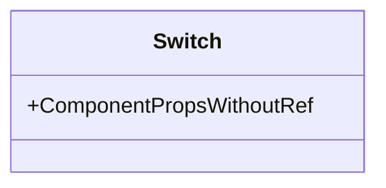

**Diagram sources**
- [switch.tsx](file://frontend/components/ui/switch.tsx)

**Section sources**
- [switch.tsx](file://frontend/components/ui/switch.tsx)

### Tabs
- Composition: Radix Tabs with styled triggers and content.
- Accessibility: Keyboard navigation; selected tab receives focus.
- Usage patterns: Compose List, Trigger, Content; ensure unique ids.

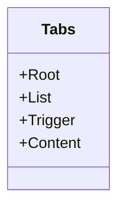

**Diagram sources**
- [tabs.tsx](file://frontend/components/ui/tabs.tsx)

**Section sources**
- [tabs.tsx](file://frontend/components/ui/tabs.tsx)

### Textarea
- Composition: Native textarea with consistent focus/disabled styling.
- Accessibility: Focus-visible ring; label association recommended.
- Usage patterns: Controlled via useState; resize via CSS if needed.

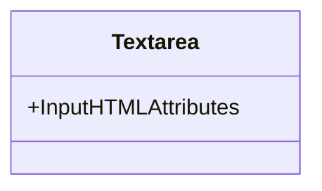

**Diagram sources**
- [textarea.tsx](file://frontend/components/ui/textarea.tsx)

**Section sources**
- [textarea.tsx](file://frontend/components/ui/textarea.tsx)

### Toast and Toaster
- Composition: Toast is a transient message; Toaster manages queue and presentation.
- Accessibility: Consider aria-live and role; avoid auto-dismiss for critical info.
- Usage patterns: Trigger via hook; manage queue via Toaster.

```mermaid
sequenceDiagram
participant App as "App"
participant Hook as "useToast()"
participant Toaster as "Toaster"
participant Toast as "Toast"
App->>Hook : Trigger toast
Hook->>Toaster : Enqueue toast
Toaster->>Toast : Render toast
Toast-->>Toaster : Dismiss
Toaster-->>App : Update queue
```

**Diagram sources**
- [toast.tsx](file://frontend/components/ui/toast.tsx)
- [toaster.tsx](file://frontend/components/ui/toaster.tsx)

**Section sources**
- [toast.tsx](file://frontend/components/ui/toast.tsx)
- [toaster.tsx](file://frontend/components/ui/toaster.tsx)

### Command
- Composition: Command, CommandDialog, CommandInput, CommandList, CommandEmpty, CommandGroup, CommandItem, CommandSeparator, CommandShortcut.
- Accessibility: Keyboard navigation with arrow keys, Enter to select, Escape to close.
- Usage patterns: Wrap search interface with CommandDialog; use CommandInput for search; populate CommandList with CommandItem entries.

**New Component** The Command component provides a keyboard-driven search and selection interface inspired by applications like Spotlight and Alfred. It integrates with the cmdk library for instant search results and keyboard navigation.

```mermaid
flowchart TD
Start(["Command Interface"]) --> Open["Open CommandDialog"]
Open --> Input["Type in CommandInput"]
Input --> Results["Filter CommandList"]
Results --> Navigate{"Keyboard navigation?"}
Navigate --> |Arrow Keys| Move["Move selection"]
Navigate --> |Enter| Select["Select CommandItem"]
Navigate --> |Escape| Close["Close dialog"]
Move --> Results
Select --> Action["Execute action"]
Action --> Close
Close --> End(["Done"])
```

**Diagram sources**
- [command.tsx](file://frontend/components/ui/command.tsx#L26-L38)
- [command.tsx](file://frontend/components/ui/command.tsx#L40-L55)
- [command.tsx](file://frontend/components/ui/command.tsx#L59-L68)

**Section sources**
- [command.tsx](file://frontend/components/ui/command.tsx#L1-L156)

### Popover
- Composition: Root, Trigger, Content, Anchor with alignment and offset options.
- Accessibility: Focus management and keyboard interaction; supports align and sideOffset props.
- Usage patterns: Compose PopoverTrigger with PopoverContent; use PopoverAnchor for precise positioning.

**New Component** The Popover component provides modal-like overlay content positioned relative to a trigger element. It offers flexible positioning with alignment options and smooth animations.

```mermaid
classDiagram
class Popover {
+Root
+Trigger
+Content
+Anchor
}
class PopoverContent {
+align : "start"|"center"|"end"
+sideOffset : number
}
Popover <|-- PopoverContent
```

**Diagram sources**
- [popover.tsx](file://frontend/components/ui/popover.tsx#L8-L33)

**Section sources**
- [popover.tsx](file://frontend/components/ui/popover.tsx#L1-L34)

## Dependency Analysis
- Radix UI integration: All interactive primitives depend on Radix UI for state, focus, and accessibility semantics.
- Tailwind CSS integration: Primitives apply consistent utility classes for colors, spacing, typography, and motion.
- Third-party library integration: Command component integrates with cmdk for keyboard-driven interactions; haptic feedback integrates with web-haptics library.
- Composition patterns: Many components expose subcomponents (e.g., Dialog, DropdownMenu, Select, Tabs, Command, Popover) enabling modular composition.

```mermaid
graph TB
Btn["Button"] --> R_B["@radix-ui/react-button"]
Dlg["Dialog"] --> R_D["@radix-ui/react-dialog"]
Lbl["Label"] --> R_L["@radix-ui/react-label"]
Chk["Checkbox"] --> R_C["@radix-ui/react-checkbox"]
DM["DropdownMenu"] --> R_DM["@radix-ui/react-dropdown-menu"]
Pg["Progress"] --> R_P["@radix-ui/react-progress"]
Rg["RadioGroup"] --> R_RG["@radix-ui/react-radio-group"]
Scr["ScrollArea"] --> R_SA["@radix-ui/react-scroll-area"]
Sel["Select"] --> R_S["@radix-ui/react-select"]
Sld["Slider"] --> R_Sl["@radix-ui/react-slider"]
Sw["Switch"] --> R_Sw["@radix-ui/react-switch"]
Tabs["Tabs"] --> R_T["@radix-ui/react-tabs"]
Pop["Popover"] --> R_Pop["@radix-ui/react-popover"]
Cmd["Command"] --> CMDK["cmdk"]
Sel --> HAPTICS["web-haptics"]
Btn --> TW["Tailwind CSS"]
Dlg --> TW
Lbl --> TW
Chk --> TW
DM --> TW
Pg --> TW
Rg --> TW
Scr --> TW
Sel --> TW
Sld --> TW
Sw --> TW
Tabs --> TW
Pop --> TW
Cmd --> TW
```

**Diagram sources**
- [button.tsx](file://frontend/components/ui/button.tsx#L1-L57)
- [dialog.tsx](file://frontend/components/ui/dialog.tsx#L1-L123)
- [label.tsx](file://frontend/components/ui/label.tsx#L1-L27)
- [checkbox.tsx](file://frontend/components/ui/checkbox.tsx#L1-L31)
- [dropdown-menu.tsx](file://frontend/components/ui/dropdown-menu.tsx#L1-L201)
- [progress.tsx](file://frontend/components/ui/progress.tsx#L1-L29)
- [radio-group.tsx](file://frontend/components/ui/radio-group.tsx#L1-L45)
- [scroll-area.tsx](file://frontend/components/ui/scroll-area.tsx#L1-L49)
- [select.tsx](file://frontend/components/ui/select.tsx#L1-L186)
- [slider.tsx](file://frontend/components/ui/slider.tsx#L1-L29)
- [switch.tsx](file://frontend/components/ui/switch.tsx)
- [tabs.tsx](file://frontend/components/ui/tabs.tsx)
- [input.tsx](file://frontend/components/ui/input.tsx#L1-L26)
- [card.tsx](file://frontend/components/ui/card.tsx#L1-L87)
- [avatar.tsx](file://frontend/components/ui/avatar.tsx#L1-L121)
- [badge.tsx](file://frontend/components/ui/badge.tsx#L1-L37)
- [loader.tsx](file://frontend/components/ui/loader.tsx#L1-L220)
- [markdown-renderer.tsx](file://frontend/components/ui/markdown-renderer.tsx#L1-L77)
- [textarea.tsx](file://frontend/components/ui/textarea.tsx)
- [toast.tsx](file://frontend/components/ui/toast.tsx)
- [toaster.tsx](file://frontend/components/ui/toaster.tsx)
- [command.tsx](file://frontend/components/ui/command.tsx#L1-L156)
- [popover.tsx](file://frontend/components/ui/popover.tsx#L1-L34)
- [haptics.ts](file://frontend/lib/haptics.ts#L1-L81)

**Section sources**
- [button.tsx](file://frontend/components/ui/button.tsx#L1-L57)
- [dialog.tsx](file://frontend/components/ui/dialog.tsx#L1-L123)
- [label.tsx](file://frontend/components/ui/label.tsx#L1-L27)
- [checkbox.tsx](file://frontend/components/ui/checkbox.tsx#L1-L31)
- [dropdown-menu.tsx](file://frontend/components/ui/dropdown-menu.tsx#L1-L201)
- [progress.tsx](file://frontend/components/ui/progress.tsx#L1-L29)
- [radio-group.tsx](file://frontend/components/ui/radio-group.tsx#L1-L45)
- [scroll-area.tsx](file://frontend/components/ui/scroll-area.tsx#L1-L49)
- [select.tsx](file://frontend/components/ui/select.tsx#L1-L186)
- [slider.tsx](file://frontend/components/ui/slider.tsx#L1-L29)
- [switch.tsx](file://frontend/components/ui/switch.tsx)
- [tabs.tsx](file://frontend/components/ui/tabs.tsx)
- [input.tsx](file://frontend/components/ui/input.tsx#L1-L26)
- [card.tsx](file://frontend/components/ui/card.tsx#L1-L87)
- [avatar.tsx](file://frontend/components/ui/avatar.tsx#L1-L121)
- [badge.tsx](file://frontend/components/ui/badge.tsx#L1-L37)
- [loader.tsx](file://frontend/components/ui/loader.tsx#L1-L220)
- [markdown-renderer.tsx](file://frontend/components/ui/markdown-renderer.tsx#L1-L77)
- [textarea.tsx](file://frontend/components/ui/textarea.tsx)
- [toast.tsx](file://frontend/components/ui/toast.tsx)
- [toaster.tsx](file://frontend/components/ui/toaster.tsx)
- [command.tsx](file://frontend/components/ui/command.tsx#L1-L156)
- [popover.tsx](file://frontend/components/ui/popover.tsx#L1-L34)
- [haptics.ts](file://frontend/lib/haptics.ts#L1-L81)

## Performance Considerations
- Prefer variant factories for consistent styling to reduce runtime style computations.
- Use asChild where appropriate to avoid unnecessary DOM nodes.
- Keep animations minimal; leverage motion libraries only when necessary.
- Defer heavy computations in render-heavy components like MarkdownRenderer.
- Use portals judiciously to avoid layout thrashing.
- **New** Consider haptic feedback performance implications - haptic pulses are brief but should be throttled to prevent excessive vibration.
- **New** Command component performance: Use virtualized lists for large datasets to maintain smooth keyboard navigation.

## Troubleshooting Guide
- Dialog does not close on overlay click:
  - Ensure Overlay and Content are both rendered and that Close is reachable.
- Checkbox or RadioGroup not reflecting state:
  - Verify controlled props (checked/value) are bound correctly.
- Select menu appears off-screen:
  - Adjust container prop and ensure parent has overflow visible.
- Avatar flickers or shows fallback:
  - Confirm src URL validity; check network errors and retry logic.
- Loader not visible:
  - Verify variant and size combinations; ensure className overrides do not hide elements.
- MarkdownRenderer styles not applied:
  - Confirm className concatenation and that utility classes are not overridden by conflicting styles.
- **New** Command component issues:
  - Ensure cmdk is properly installed and imported; verify keyboard navigation works with arrow keys and Enter.
  - Check that CommandDialog wraps CommandInput and CommandList correctly.
- **New** Popover positioning problems:
  - Adjust align and sideOffset props; ensure parent has proper positioning context.
  - Verify PopoverAnchor is positioned correctly relative to trigger.
- **New** Haptic feedback not working:
  - Check browser support for Vibration API; verify user hasn't disabled haptics in preferences.
  - Ensure haptic utility is imported and called with valid intensity levels.

**Section sources**
- [dialog.tsx](file://frontend/components/ui/dialog.tsx#L17-L54)
- [checkbox.tsx](file://frontend/components/ui/checkbox.tsx#L9-L28)
- [radio-group.tsx](file://frontend/components/ui/radio-group.tsx#L9-L44)
- [select.tsx](file://frontend/components/ui/select.tsx#L70-L102)
- [avatar.tsx](file://frontend/components/ui/avatar.tsx#L61-L78)
- [loader.tsx](file://frontend/components/ui/loader.tsx#L13-L199)
- [markdown-renderer.tsx](file://frontend/components/ui/markdown-renderer.tsx#L20-L73)
- [command.tsx](file://frontend/components/ui/command.tsx#L26-L38)
- [popover.tsx](file://frontend/components/ui/popover.tsx#L14-L31)
- [haptics.ts](file://frontend/lib/haptics.ts#L64-L67)

## Conclusion
These primitives form a cohesive foundation for building accessible, consistent, and maintainable UI surfaces. By leveraging Radix UI for behavior and Tailwind for styling, components remain composable, customizable, and aligned with platform best practices. The addition of the Command component enhances keyboard-driven workflows, while the Popover component provides flexible modal-like interactions. The enhanced Select component with haptic feedback creates a more engaging user experience through tactile responses. Use the provided patterns to construct higher-level components while preserving accessibility and performance.

## Appendices
- Customization guidelines:
  - Use variant factories for semantic variants.
  - Apply className to augment Tailwind utilities without overriding core styles.
  - Pair form controls with Label for accessibility.
  - Test keyboard navigation and focus states across components.
  - **New** For Command components, ensure proper keyboard accessibility and screen reader support.
  - **New** For Popover components, test positioning across different screen sizes and orientations.
- State management:
  - Control interactive components via React state.
  - Use hooks for toast queues and markdown rendering.
  - Avoid excessive re-renders by memoizing derived values.
  - **New** Implement debouncing for Command search inputs to improve performance.
  - **New** Manage haptic feedback preferences through localStorage persistence.
- **New** Haptic Feedback Integration:
  - Use semantic intensity levels: "selection", "light", "medium", "heavy", "success", "error", "tick"
  - Integrate haptic feedback for key interactions: dropdown opens, option selections, form submissions
  - Respect user preferences and gracefully handle unsupported devices
  - Test haptic feedback across different devices and browsers