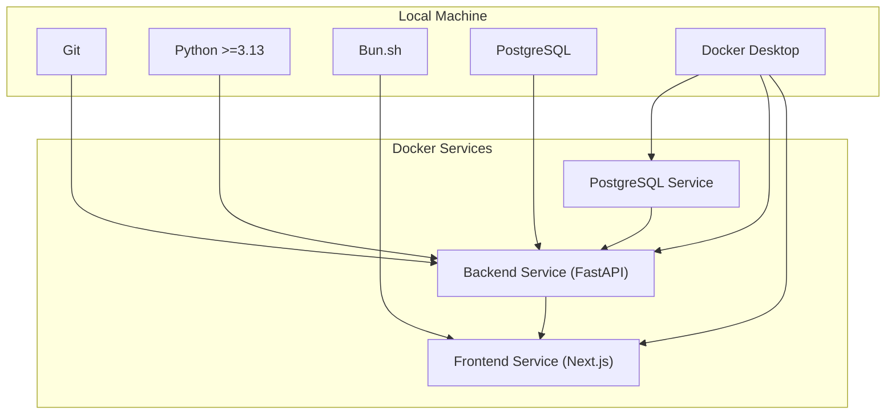
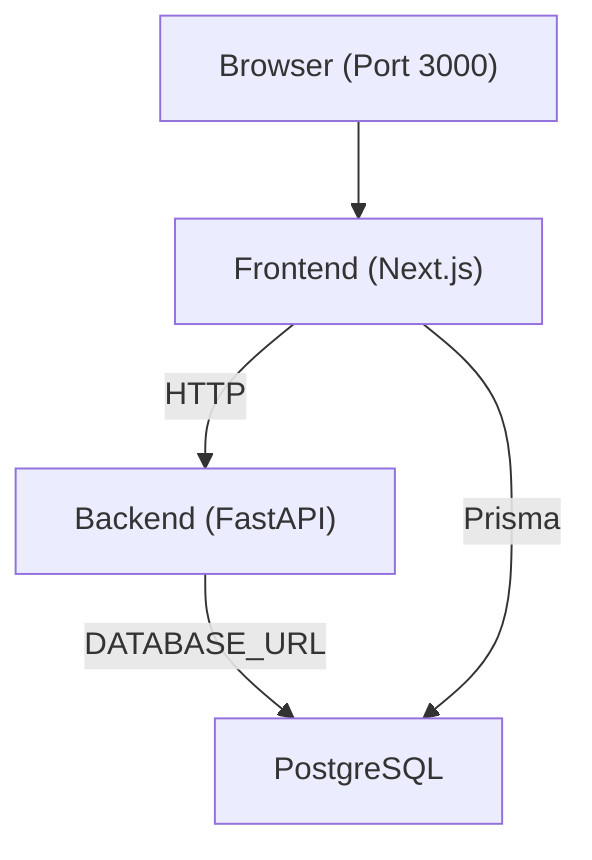
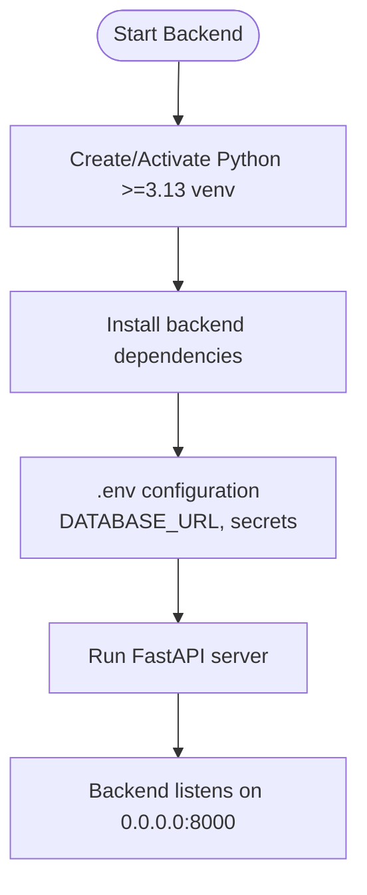
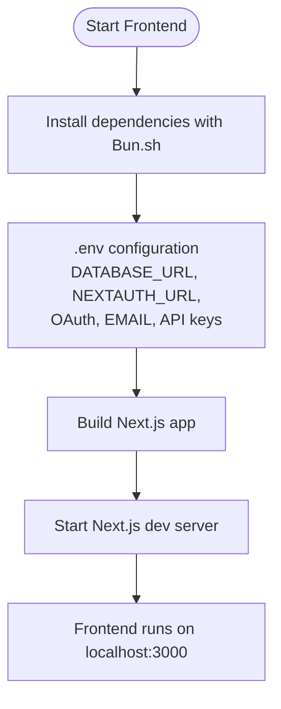
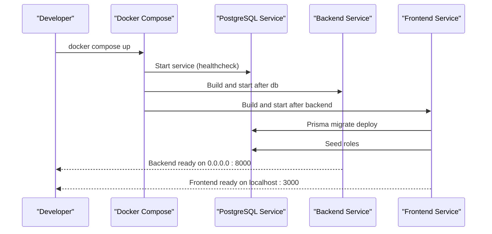
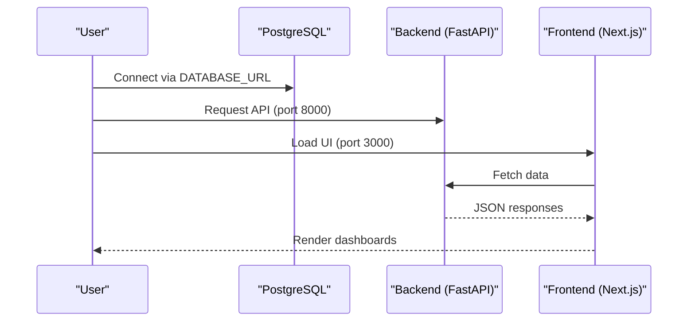
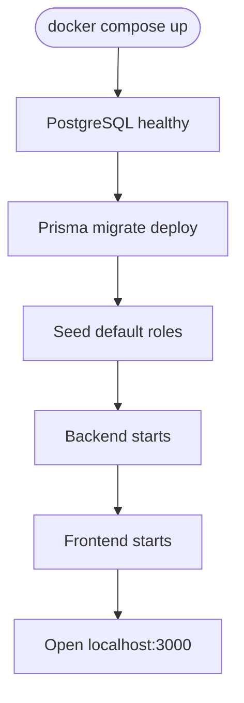
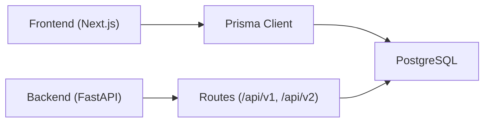

# Getting Started

<cite>
**Referenced Files in This Document**
- [readme.md](file://readme.md)
- [.env](file://.env)
- [backend/.env](file://backend/.env)
- [frontend/.env](file://frontend/.env)
- [docker-compose.yaml](file://docker-compose.yaml)
- [docker-compose.prod.yaml](file://docker-compose.prod.yaml)
- [backend/pyproject.toml](file://backend/pyproject.toml)
- [frontend/package.json](file://frontend/package.json)
- [backend/Dockerfile](file://backend/Dockerfile)
- [frontend/Dockerfile](file://frontend/Dockerfile)
- [backend/main.py](file://backend/main.py)
- [backend/app/main.py](file://backend/app/main.py)
- [frontend/next.config.js](file://frontend/next.config.js)
- [frontend/prisma/schema.prisma](file://frontend/prisma/schema.prisma)
- [frontend/prisma/seed.ts](file://frontend/prisma/seed.ts)
</cite>

## Table of Contents
1. [Introduction](#introduction)
2. [Project Structure](#project-structure)
3. [Core Components](#core-components)
4. [Architecture Overview](#architecture-overview)
5. [Detailed Component Analysis](#detailed-component-analysis)
6. [Dependency Analysis](#dependency-analysis)
7. [Performance Considerations](#performance-considerations)
8. [Troubleshooting Guide](#troubleshooting-guide)
9. [Conclusion](#conclusion)
10. [Appendices](#appendices)

## Introduction
This guide helps you install and run the TalentSync-Normies platform locally. The platform consists of:
- Backend: FastAPI application serving AI-powered resume and hiring tools
- Frontend: Next.js application with authentication, dashboards, and integrations
- Database: PostgreSQL managed either manually or via Docker Compose
- Optional: Bun.sh for frontend builds and deployments

You will learn prerequisites, environment setup, step-by-step installation for both manual and Docker-based workflows, running order, verification steps, and troubleshooting.

## Project Structure
The repository is organized into:
- backend: FastAPI application, Dockerfile, pyproject.toml, and environment configuration
- frontend: Next.js application, Dockerfile, package.json, Prisma schema and seed
- docker-compose.yaml and docker-compose.prod.yaml: Multi-service orchestration for local and production-like environments
- Root .env and backend/frontend .env files: Environment variables for secrets and URLs

**Diagram sources**
- [docker-compose.yaml](file://docker-compose.yaml#L1-L78)
- [docker-compose.prod.yaml](file://docker-compose.prod.yaml#L1-L105)

**Section sources**
- [readme.md](file://readme.md#L73-L142)
- [docker-compose.yaml](file://docker-compose.yaml#L1-L78)
- [docker-compose.prod.yaml](file://docker-compose.prod.yaml#L1-L105)

## Core Components
- Backend (FastAPI)
  - Python version requirement: Python >=3.13
  - Dependencies include FastAPI, asyncpg, Pydantic Settings, cryptography, and AI/ML libraries
  - Exposes API routes under /api/v1 and /api/v2
  - Runs on port 8000
- Frontend (Next.js)
  - Uses Bun.sh for builds and runtime
  - Prisma client connects to PostgreSQL via DATABASE_URL
  - Authentication via NextAuth.js with OAuth providers
  - Runs on port 3000
- Database (PostgreSQL)
  - Managed locally or via Docker Compose
  - Migrations and seed executed during frontend container lifecycle
- Optional tools
  - Docker Desktop for simplified local deployment
  - Bun.sh for faster JS/TS builds and package management

**Section sources**
- [backend/pyproject.toml](file://backend/pyproject.toml#L6-L33)
- [backend/app/main.py](file://backend/app/main.py#L157-L203)
- [backend/Dockerfile](file://backend/Dockerfile#L3-L33)
- [frontend/package.json](file://frontend/package.json#L5-L12)
- [frontend/Dockerfile](file://frontend/Dockerfile#L85-L110)
- [frontend/prisma/schema.prisma](file://frontend/prisma/schema.prisma#L1-L4)
- [frontend/next.config.js](file://frontend/next.config.js#L10-L87)

## Architecture Overview
The platform follows a container-first architecture with three primary services:
- PostgreSQL: persistent relational data for users, resumes, analyses, and integrations
- Backend: FastAPI API handling resume analysis, ATS evaluation, cover letters, cold emails, hiring assistant, and interview tools
- Frontend: Next.js UI with authentication, dashboards, and Prisma-driven data access

**Diagram sources**
- [docker-compose.yaml](file://docker-compose.yaml#L51-L63)
- [frontend/prisma/schema.prisma](file://frontend/prisma/schema.prisma#L1-L4)
- [backend/app/main.py](file://backend/app/main.py#L157-L203)

## Detailed Component Analysis

### Prerequisites and System Requirements
- Git
- Python >=3.13 (required by backend Dockerfile and pyproject.toml)
- Bun.sh (required by frontend Dockerfile and scripts)
- PostgreSQL (locally or via Docker)
- Docker Desktop (recommended for streamlined setup)

Optional tools for enhanced development experience:
- IDE with TypeScript/Python support
- Prisma VS Code extensions
- Postman or curl for API testing

**Section sources**
- [backend/pyproject.toml](file://backend/pyproject.toml#L6)
- [backend/Dockerfile](file://backend/Dockerfile#L3)
- [frontend/Dockerfile](file://frontend/Dockerfile#L6)
- [readme.md](file://readme.md#L77-L86)

### Manual Installation (Non-Docker)

#### Backend (FastAPI)
1. Clone the repository and navigate to the backend directory.
2. Create and activate a Python virtual environment with Python >=3.13.
3. Install backend dependencies.
4. Create a .env file from the example and configure DATABASE_URL and other secrets.
5. Start the backend server.

**Diagram sources**
- [backend/Dockerfile](file://backend/Dockerfile#L3-L33)
- [backend/pyproject.toml](file://backend/pyproject.toml#L6-L33)
- [backend/main.py](file://backend/main.py#L1-L10)
- [backend/app/main.py](file://backend/app/main.py#L157-L203)

**Section sources**
- [readme.md](file://readme.md#L96-L114)
- [backend/main.py](file://backend/main.py#L1-L10)
- [backend/.env](file://backend/.env#L1-L26)

#### Frontend (Next.js)
1. Navigate to the frontend directory.
2. Install dependencies using Bun.sh.
3. Configure environment variables (.env) for DATABASE_URL, NEXTAUTH_URL, OAuth clients, email, and API keys.
4. Build and start the development server.

**Diagram sources**
- [frontend/Dockerfile](file://frontend/Dockerfile#L6-L17)
- [frontend/package.json](file://frontend/package.json#L5-L12)
- [frontend/.env](file://frontend/.env#L1-L27)
- [frontend/next.config.js](file://frontend/next.config.js#L10-L87)

**Section sources**
- [readme.md](file://readme.md#L115-L124)
- [frontend/package.json](file://frontend/package.json#L5-L12)
- [frontend/.env](file://frontend/.env#L1-L27)

### Docker-Based Deployment

#### Local Development (docker-compose.yaml)
- Services:
  - db: PostgreSQL 16 with named volume
  - backend: FastAPI built from backend/Dockerfile
  - frontend: Next.js built from frontend/Dockerfile with Prisma migrations and seed
- Networking:
  - frontend exposes port 3000
  - backend listens on 8000 inside the network
  - internal DNS: backend and frontend communicate via service names
- Environment:
  - .env variables injected via env_file
  - DATABASE_URL constructed for internal service discovery

**Diagram sources**
- [docker-compose.yaml](file://docker-compose.yaml#L1-L78)
- [frontend/Dockerfile](file://frontend/Dockerfile#L69-L79)
- [frontend/prisma/seed.ts](file://frontend/prisma/seed.ts#L1-L30)

**Section sources**
- [docker-compose.yaml](file://docker-compose.yaml#L1-L78)
- [docker-compose.prod.yaml](file://docker-compose.prod.yaml#L1-L105)

### Environment Setup (.env)
Configure environment variables for both backend and frontend. The repository includes example .env files at the root and per service. Critical variables include:
- DATABASE_URL: PostgreSQL connection string
- NEXTAUTH_URL and NEXTAUTH_SECRET: NextAuth configuration
- OAuth client IDs/secrets for Google/GitHub
- Email server settings for notifications
- BACKEND_URL: internal URL for frontend to reach backend
- API keys for Google, Tavily, and analytics
- Encryption and JWT secrets

Notes:
- The root .env and backend/frontend .env files share similar keys for local parity
- For production-like Docker Compose, variables are injected via env_file and composed into DATABASE_URL

**Section sources**
- [.env](file://.env#L1-L26)
- [backend/.env](file://backend/.env#L1-L26)
- [frontend/.env](file://frontend/.env#L1-L27)
- [docker-compose.yaml](file://docker-compose.yaml#L24-L32)
- [docker-compose.prod.yaml](file://docker-compose.prod.yaml#L32-L33)

### Running Instructions

#### Manual Workflow
1. Start PostgreSQL locally or via Docker.
2. Start the backend server (FastAPI).
3. Start the frontend development server (Next.js).
4. Open http://localhost:3000 in your browser.

**Diagram sources**
- [backend/app/main.py](file://backend/app/main.py#L157-L203)
- [frontend/next.config.js](file://frontend/next.config.js#L10-L87)

**Section sources**
- [readme.md](file://readme.md#L125-L142)
- [backend/main.py](file://backend/main.py#L1-L10)
- [frontend/package.json](file://frontend/package.json#L5-L12)

#### Docker Workflow
1. Ensure Docker Desktop is running.
2. Bring up services with docker-compose.
3. Wait for migrations and seed to complete.
4. Open http://localhost:3000 in your browser.

**Diagram sources**
- [docker-compose.yaml](file://docker-compose.yaml#L63-L66)
- [frontend/Dockerfile](file://frontend/Dockerfile#L69-L79)
- [frontend/prisma/seed.ts](file://frontend/prisma/seed.ts#L1-L30)

**Section sources**
- [docker-compose.yaml](file://docker-compose.yaml#L1-L78)
- [docker-compose.prod.yaml](file://docker-compose.prod.yaml#L1-L105)

## Dependency Analysis
- Backend
  - Python >=3.13 enforced by Dockerfile and pyproject.toml
  - FastAPI application registers routes for resume analysis, ATS, cover letters, cold mail, hiring assistant, interviews, and LLM configuration
- Frontend
  - Next.js with PWA, Prisma client, NextAuth, and analytics
  - Prisma schema defines models and relations; seed initializes default roles
- Database
  - PostgreSQL configured via .env and Docker Compose
  - Prisma manages schema migrations and seed

**Diagram sources**
- [backend/app/main.py](file://backend/app/main.py#L157-L203)
- [frontend/prisma/schema.prisma](file://frontend/prisma/schema.prisma#L1-L4)
- [frontend/package.json](file://frontend/package.json#L17-L86)

**Section sources**
- [backend/pyproject.toml](file://backend/pyproject.toml#L6-L33)
- [frontend/package.json](file://frontend/package.json#L17-L86)
- [frontend/prisma/schema.prisma](file://frontend/prisma/schema.prisma#L1-L4)

## Performance Considerations
- Use Docker Desktop for predictable builds and consistent runtime environments.
- Prefer Bun.sh for faster frontend builds compared to npm/yarn.
- Keep Python version aligned with backend requirements (>=3.13) to avoid rebuilds and compatibility issues.
- For PostgreSQL, provision sufficient CPU/RAM and SSD storage for Prisma migrations and resume parsing workloads.

## Troubleshooting Guide
Common issues and resolutions:
- Python version mismatch
  - Symptom: Backend fails to start or install dependencies
  - Resolution: Ensure Python >=3.13 is installed and selected by your environment
- PostgreSQL connectivity
  - Symptom: Prisma migration failures or frontend seed errors
  - Resolution: Verify DATABASE_URL matches your PostgreSQL host/port/user/password; ensure the database exists and is reachable
- OAuth configuration
  - Symptom: Login redirects fail or NextAuth errors
  - Resolution: Confirm NEXTAUTH_URL, NEXTAUTH_SECRET, and provider client IDs/secrets are set correctly
- Port conflicts
  - Symptom: localhost:3000 or 127.0.0.1:8000 already in use
  - Resolution: Stop conflicting processes or adjust ports in environment configuration
- Docker Compose health checks
  - Symptom: Frontend waits indefinitely for backend/db
  - Resolution: Inspect logs for db healthcheck and backend startup; ensure env_file variables are present and correct
- Prisma migrations and seed
  - Symptom: Empty roles or schema inconsistencies
  - Resolution: Re-run Prisma migrate deploy and seed; ensure DATABASE_URL is correct for the service network

**Section sources**
- [backend/pyproject.toml](file://backend/pyproject.toml#L6)
- [backend/Dockerfile](file://backend/Dockerfile#L3)
- [frontend/Dockerfile](file://frontend/Dockerfile#L69-L79)
- [frontend/prisma/seed.ts](file://frontend/prisma/seed.ts#L1-L30)
- [docker-compose.yaml](file://docker-compose.yaml#L15-L23)
- [docker-compose.prod.yaml](file://docker-compose.prod.yaml#L15-L23)

## Conclusion
You now have multiple pathways to run TalentSync-Normies locally:
- Manual: set up Python >=3.13, Bun.sh, PostgreSQL, configure .env, then start backend and frontend
- Docker: use docker-compose to orchestrate db, backend, and frontend with automated migrations and seeding

Follow the verification steps below to confirm a successful setup, and consult the troubleshooting section for common pitfalls.

## Appendices

### Verification Steps
- Backend
  - Visit http://127.0.0.1:8000/docs to confirm FastAPI docs are available
  - Test a basic route (e.g., resume analysis or ATS evaluation) using curl or Postman
- Frontend
  - Open http://localhost:3000 and log in via NextAuth
  - Navigate to dashboards and ensure Prisma data loads (users, roles, resumes)
- Database
  - Confirm Prisma migrations ran and seed created default roles
  - Validate connections via DATABASE_URL from both backend and frontend

**Section sources**
- [backend/app/main.py](file://backend/app/main.py#L157-L203)
- [frontend/package.json](file://frontend/package.json#L5-L12)
- [frontend/prisma/schema.prisma](file://frontend/prisma/schema.prisma#L1-L4)
- [frontend/prisma/seed.ts](file://frontend/prisma/seed.ts#L1-L30)